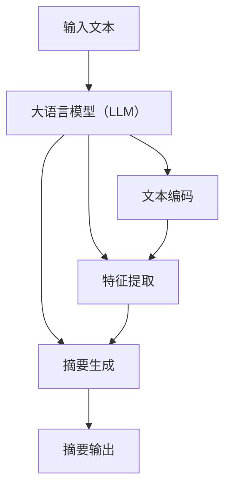

# 自动摘要AI Agent：LLM驱动的文本压缩与提炼

> 关键词：自动摘要、AI Agent、大语言模型（LLM）、文本压缩、文本提炼

> 摘要：本文围绕自动摘要AI Agent展开，探讨其在大语言模型（LLM）驱动下实现文本压缩与提炼的相关技术。详细介绍了自动摘要的背景知识，包括目的、适用读者和文档结构等。深入剖析核心概念，阐述其原理和架构，并通过Mermaid流程图直观展示。给出核心算法原理，使用Python代码进行详细解释。介绍相关数学模型和公式，并举例说明。通过项目实战，讲解开发环境搭建、源代码实现与解读。列举实际应用场景，推荐学习资源、开发工具框架和相关论文著作。最后总结未来发展趋势与挑战，解答常见问题，并提供扩展阅读和参考资料，旨在为读者全面深入了解自动摘要AI Agent提供技术指导。

## 1. 背景介绍 
### 1.1 目的和范围
在信息爆炸的时代，大量的文本信息如潮水般涌来，无论是新闻报道、学术论文还是商业文档，人们需要花费大量的时间和精力去筛选和理解其中的关键内容。自动摘要AI Agent的出现旨在解决这一问题，它能够在大语言模型（LLM）的驱动下，对长文本进行有效的压缩和提炼，提取出文本的核心信息，生成简洁明了的摘要。

本文的范围将涵盖自动摘要AI Agent的核心概念、算法原理、数学模型、项目实战、实际应用场景以及相关的工具和资源推荐等方面，为读者全面深入地了解这一技术提供一个完整的知识体系。

### 1.2 预期读者
本文预期读者包括对自然语言处理、人工智能领域感兴趣的研究人员、开发者、学生，以及希望利用自动摘要技术提高信息处理效率的专业人士，如记者、分析师、知识管理者等。对于想要了解如何使用大语言模型进行文本处理和摘要生成的人群，本文也具有较高的参考价值。

### 1.3 文档结构概述
本文将按照以下结构进行组织：
- 核心概念与联系：介绍自动摘要AI Agent的核心概念，包括其原理和架构，并通过文本示意图和Mermaid流程图进行直观展示。
- 核心算法原理 & 具体操作步骤：详细讲解实现自动摘要的核心算法原理，并使用Python源代码进行详细阐述。
- 数学模型和公式 & 详细讲解 & 举例说明：介绍相关的数学模型和公式，并通过具体的例子进行说明。
- 项目实战：代码实际案例和详细解释说明：通过一个实际的项目案例，介绍开发环境搭建、源代码实现和代码解读。
- 实际应用场景：列举自动摘要AI Agent在不同领域的实际应用场景。
- 工具和资源推荐：推荐学习资源、开发工具框架和相关论文著作。
- 总结：未来发展趋势与挑战：总结自动摘要AI Agent的未来发展趋势和面临的挑战。
- 附录：常见问题与解答：解答读者在学习和使用过程中可能遇到的常见问题。
- 扩展阅读 & 参考资料：提供相关的扩展阅读和参考资料，方便读者进一步深入学习。

### 1.4 术语表
#### 1.4.1 核心术语定义
- **自动摘要（Automatic Summarization）**：指利用计算机技术自动从文本中提取关键信息，生成简洁摘要的过程。
- **AI Agent**：人工智能代理，是一种能够感知环境、自主决策并采取行动以实现特定目标的智能实体。在本文中，自动摘要AI Agent是指专门用于实现自动摘要功能的智能代理。
- **大语言模型（LLM，Large Language Model）**：是一种基于深度学习的语言模型，通过在大规模文本数据上进行训练，能够学习到语言的模式和规律，具备强大的语言理解和生成能力。
- **文本压缩（Text Compression）**：将长文本转换为较短文本的过程，在保证关键信息不丢失的前提下，减少文本的长度。
- **文本提炼（Text Extraction）**：从文本中提取出最关键、最重要的信息，去除冗余和无关内容。

#### 1.4.2 相关概念解释
- **抽取式摘要（Extractive Summarization）**：从原文中直接抽取关键句子或片段作为摘要的方法。这种方法不改变原文的表达方式，只是选择其中的重要部分。
- **生成式摘要（Abstractive Summarization）**：通过对原文的理解和分析，生成全新的文本作为摘要的方法。生成式摘要能够对原文进行重新组织和表达，更符合人类的语言习惯。
- **预训练模型（Pretrained Model）**：在大规模无监督数据上进行预训练的模型，具有一定的语言知识和通用能力。在自动摘要任务中，通常会使用预训练的大语言模型作为基础，然后在特定的数据集上进行微调。

#### 1.4.3 缩略词列表
- **LLM**：Large Language Model，大语言模型
- **NLP**：Natural Language Processing，自然语言处理
- **BERT**：Bidirectional Encoder Representations from Transformers，双向编码器表示来自Transformer
- **GPT**：Generative Pretrained Transformer，生成式预训练Transformer

## 2. 核心概念与联系 

### 核心概念原理
自动摘要AI Agent的核心原理是利用大语言模型（LLM）强大的语言理解和生成能力，对输入的文本进行分析和处理，提取出关键信息，并生成简洁的摘要。其主要分为抽取式和生成式两种方法。

抽取式摘要的原理是通过计算文本中每个句子的重要性得分，选择得分较高的句子作为摘要。常用的方法包括基于词频、基于图的方法（如TextRank）等。这些方法通过分析句子之间的语义相似度、词共现关系等，来评估句子的重要性。

生成式摘要则是让大语言模型对原文进行理解和推理，然后根据理解的内容生成全新的摘要。生成式摘要需要模型具备更强的语言生成能力和语义理解能力，通常使用预训练的大语言模型，如GPT、BERT等，并在特定的摘要数据集上进行微调。

### 架构的文本示意图
```plaintext
+-------------------+
| 输入文本           |
+-------------------+
          |
          v
+-------------------+
| 大语言模型（LLM） |
|  - 文本编码        |
|  - 特征提取        |
|  - 摘要生成        |
+-------------------+
          |
          v
+-------------------+
| 摘要输出           |
+-------------------+
```

### Mermaid流程图


## 3. 核心算法原理 & 具体操作步骤 

### 抽取式摘要算法 - TextRank
TextRank是一种基于图的抽取式摘要算法，其核心思想是将文本中的句子看作图中的节点，句子之间的相似度作为边的权重，通过迭代计算节点的重要性得分，选择得分较高的句子作为摘要。

#### 算法原理
TextRank算法的基本步骤如下：
1. **文本预处理**：对输入的文本进行分词、去除停用词等预处理操作。
2. **构建图**：将文本中的每个句子作为图中的一个节点，计算任意两个句子之间的相似度，作为边的权重。常用的相似度计算方法有余弦相似度等。
3. **迭代计算节点得分**：使用PageRank算法的思想，迭代计算每个节点的重要性得分。节点的得分取决于其邻居节点的得分和边的权重。
4. **选择摘要句子**：根据节点的得分，选择得分较高的句子作为摘要。

#### Python代码实现
```python
import nltk
from nltk.corpus import stopwords
from nltk.tokenize import sent_tokenize, word_tokenize
import numpy as np
import networkx as nx

nltk.download('punkt')
nltk.download('stopwords')

def preprocess_text(text):
    """
    文本预处理函数
    """
    sentences = sent_tokenize(text)
    stop_words = set(stopwords.words('english'))
    preprocessed_sentences = []
    for sentence in sentences:
        words = word_tokenize(sentence.lower())
        filtered_words = [word for word in words if word.isalnum() and word not in stop_words]
        preprocessed_sentences.append(filtered_words)
    return preprocessed_sentences

def sentence_similarity(sent1, sent2):
    """
    计算两个句子的余弦相似度
    """
    all_words = list(set(sent1 + sent2))
    vector1 = [0] * len(all_words)
    vector2 = [0] * len(all_words)

    for word in sent1:
        vector1[all_words.index(word)] += 1

    for word in sent2:
        vector2[all_words.index(word)] += 1

    dot_product = np.dot(vector1, vector2)
    norm1 = np.linalg.norm(vector1)
    norm2 = np.linalg.norm(vector2)
    if norm1 == 0 or norm2 == 0:
        return 0
    return dot_product / (norm1 * norm2)

def build_similarity_matrix(sentences):
    """
    构建相似度矩阵
    """
    similarity_matrix = np.zeros((len(sentences), len(sentences)))
    for i in range(len(sentences)):
        for j in range(len(sentences)):
            if i!= j:
                similarity_matrix[i][j] = sentence_similarity(sentences[i], sentences[j])
    return similarity_matrix

def textrank_summary(text, num_sentences=3):
    """
    TextRank摘要生成函数
    """
    preprocessed_sentences = preprocess_text(text)
    similarity_matrix = build_similarity_matrix(preprocessed_sentences)
    sentence_graph = nx.from_numpy_array(similarity_matrix)
    scores = nx.pagerank(sentence_graph)
    ranked_sentences = sorted(((scores[i], s) for i, s in enumerate(sent_tokenize(text))), reverse=True)
    summary = [sentence for score, sentence in ranked_sentences[:num_sentences]]
    return ' '.join(summary)

# 示例文本
text = "This is an example text. It contains several sentences. The purpose is to generate a summary. The summary should be concise and informative."
summary = textrank_summary(text)
print("TextRank摘要: ", summary)
```

### 生成式摘要算法 - 使用Hugging Face的Transformers库
Hugging Face的Transformers库提供了预训练的大语言模型，如T5、BART等，可以方便地用于生成式摘要任务。

#### 算法原理
使用预训练的大语言模型进行生成式摘要的基本步骤如下：
1. **加载预训练模型**：从Transformers库中加载预训练的摘要模型。
2. **文本编码**：将输入的文本编码为模型可以接受的输入格式。
3. **摘要生成**：使用模型的生成功能，生成摘要。
4. **解码输出**：将模型生成的编码结果解码为文本。

#### Python代码实现
```python
from transformers import AutoTokenizer, AutoModelForSeq2SeqLM

# 加载预训练模型和分词器
model_name = "t5-small"
tokenizer = AutoTokenizer.from_pretrained(model_name)
model = AutoModelForSeq2SeqLM.from_pretrained(model_name)

# 示例文本
text = "This is an example text. It contains several sentences. The purpose is to generate a summary. The summary should be concise and informative."

# 文本编码
input_ids = tokenizer.encode("summarize: " + text, return_tensors="pt")

# 摘要生成
output = model.generate(input_ids)

# 解码输出
summary = tokenizer.decode(output[0], skip_special_tokens=True)
print("生成式摘要: ", summary)
```

## 4. 数学模型和公式 & 详细讲解 & 举例说明 

### 余弦相似度
余弦相似度是一种常用的计算向量相似度的方法，在文本处理中常用于计算句子之间的相似度。

#### 数学公式
对于两个向量 $\vec{A}=(a_1,a_2,\cdots,a_n)$ 和 $\vec{B}=(b_1,b_2,\cdots,b_n)$，它们的余弦相似度定义为：
$$
\cos(\theta)=\frac{\vec{A}\cdot\vec{B}}{\|\vec{A}\|\|\vec{B}\|}=\frac{\sum_{i = 1}^{n}a_ib_i}{\sqrt{\sum_{i = 1}^{n}a_i^2}\sqrt{\sum_{i = 1}^{n}b_i^2}}
$$

#### 详细讲解
余弦相似度的取值范围在 $[-1,1]$ 之间，值越接近1表示两个向量越相似，值越接近 -1 表示两个向量越不相似。在文本处理中，我们将句子表示为向量，通过计算向量之间的余弦相似度来评估句子之间的语义相似度。

#### 举例说明
假设有两个句子：
- 句子1："The cat is on the mat."
- 句子2："There is a cat on the mat."

首先对句子进行分词和词频统计，得到两个向量：
- 向量1：$\vec{A}=(1, 1, 1, 1, 1)$
- 向量2：$\vec{B}=(1, 1, 1, 1, 1, 1)$

计算向量的点积：
$$
\vec{A}\cdot\vec{B}=1\times1 + 1\times1 + 1\times1 + 1\times1 + 1\times1 = 5
$$

计算向量的模：
$$
\|\vec{A}\|=\sqrt{1^2 + 1^2 + 1^2 + 1^2 + 1^2}=\sqrt{5}
$$
$$
\|\vec{B}\|=\sqrt{1^2 + 1^2 + 1^2 + 1^2 + 1^2 + 1^2}=\sqrt{6}
$$

计算余弦相似度：
$$
\cos(\theta)=\frac{5}{\sqrt{5}\sqrt{6}}\approx0.91
$$

### PageRank算法
PageRank算法是一种用于计算网页重要性的算法，在TextRank算法中被用于计算句子的重要性得分。

#### 数学公式
PageRank算法的基本思想是通过迭代计算每个节点的得分，节点的得分取决于其邻居节点的得分和边的权重。具体公式如下：
$$
PR(p_i)=(1 - d)+d\times\sum_{p_j\in M(p_i)}\frac{PR(p_j)}{L(p_j)}
$$
其中：
- $PR(p_i)$ 表示节点 $p_i$ 的PageRank得分。
- $d$ 是阻尼系数，通常取值为 0.85。
- $M(p_i)$ 表示指向节点 $p_i$ 的所有节点的集合。
- $L(p_j)$ 表示节点 $p_j$ 的出度，即从节点 $p_j$ 出发的边的数量。

#### 详细讲解
PageRank算法通过迭代的方式不断更新节点的得分，直到得分收敛。在每次迭代中，每个节点的得分会根据其邻居节点的得分进行更新。阻尼系数 $d$ 用于控制节点之间的影响力传递，避免出现某些节点的得分过高或过低的情况。

#### 举例说明
假设有一个简单的图，包含3个节点 $A$、$B$、$C$，节点之间的连接关系如下：
- $A$ 指向 $B$ 和 $C$
- $B$ 指向 $C$
- $C$ 指向 $A$

初始时，每个节点的PageRank得分都设为 1。

第一次迭代：
- $PR(A)=(1 - 0.85)+0.85\times\frac{PR(C)}{1}=0.15 + 0.85\times1 = 1$
- $PR(B)=(1 - 0.85)+0.85\times\frac{PR(A)}{2}=0.15 + 0.85\times\frac{1}{2}=0.575$
- $PR(C)=(1 - 0.85)+0.85\times(\frac{PR(A)}{2}+\frac{PR(B)}{1})=0.15 + 0.85\times(\frac{1}{2}+0.575)=1.275$

继续迭代，直到得分收敛。

## 5. 项目实战：代码实际案例和详细解释说明 

### 5.1  开发环境搭建
#### 安装Python
首先需要安装Python，建议使用Python 3.7及以上版本。可以从Python官方网站（https://www.python.org/downloads/）下载并安装。

#### 安装必要的库
使用以下命令安装项目所需的库：
```bash
pip install nltk networkx transformers
```

#### 下载NLTK数据
在Python中运行以下代码下载NLTK所需的数据：
```python
import nltk
nltk.download('punkt')
nltk.download('stopwords')
```

### 5.2  源代码详细实现和代码解读
以下是一个完整的项目代码，结合了抽取式摘要和生成式摘要的功能：

```python
import nltk
from nltk.corpus import stopwords
from nltk.tokenize import sent_tokenize, word_tokenize
import numpy as np
import networkx as nx
from transformers import AutoTokenizer, AutoModelForSeq2SeqLM

nltk.download('punkt')
nltk.download('stopwords')

def preprocess_text(text):
    """
    文本预处理函数
    """
    sentences = sent_tokenize(text)
    stop_words = set(stopwords.words('english'))
    preprocessed_sentences = []
    for sentence in sentences:
        words = word_tokenize(sentence.lower())
        filtered_words = [word for word in words if word.isalnum() and word not in stop_words]
        preprocessed_sentences.append(filtered_words)
    return preprocessed_sentences

def sentence_similarity(sent1, sent2):
    """
    计算两个句子的余弦相似度
    """
    all_words = list(set(sent1 + sent2))
    vector1 = [0] * len(all_words)
    vector2 = [0] * len(all_words)

    for word in sent1:
        vector1[all_words.index(word)] += 1

    for word in sent2:
        vector2[all_words.index(word)] += 1

    dot_product = np.dot(vector1, vector2)
    norm1 = np.linalg.norm(vector1)
    norm2 = np.linalg.norm(vector2)
    if norm1 == 0 or norm2 == 0:
        return 0
    return dot_product / (norm1 * norm2)

def build_similarity_matrix(sentences):
    """
    构建相似度矩阵
    """
    similarity_matrix = np.zeros((len(sentences), len(sentences)))
    for i in range(len(sentences)):
        for j in range(len(sentences)):
            if i!= j:
                similarity_matrix[i][j] = sentence_similarity(sentences[i], sentences[j])
    return similarity_matrix

def textrank_summary(text, num_sentences=3):
    """
    TextRank摘要生成函数
    """
    preprocessed_sentences = preprocess_text(text)
    similarity_matrix = build_similarity_matrix(preprocessed_sentences)
    sentence_graph = nx.from_numpy_array(similarity_matrix)
    scores = nx.pagerank(sentence_graph)
    ranked_sentences = sorted(((scores[i], s) for i, s in enumerate(sent_tokenize(text))), reverse=True)
    summary = [sentence for score, sentence in ranked_sentences[:num_sentences]]
    return ' '.join(summary)

def generative_summary(text):
    """
    生成式摘要函数
    """
    model_name = "t5-small"
    tokenizer = AutoTokenizer.from_pretrained(model_name)
    model = AutoModelForSeq2SeqLM.from_pretrained(model_name)

    input_ids = tokenizer.encode("summarize: " + text, return_tensors="pt")
    output = model.generate(input_ids)
    summary = tokenizer.decode(output[0], skip_special_tokens=True)
    return summary

# 示例文本
text = "This is an example text. It contains several sentences. The purpose is to generate a summary. The summary should be concise and informative."

# 抽取式摘要
extractive_summary = textrank_summary(text)
print("抽取式摘要: ", extractive_summary)

# 生成式摘要
generative_summary = generative_summary(text)
print("生成式摘要: ", generative_summary)
```

### 5.3  代码解读与分析
#### 抽取式摘要部分
- `preprocess_text` 函数：对输入的文本进行预处理，包括分词、去除停用词等操作。
- `sentence_similarity` 函数：计算两个句子的余弦相似度。
- `build_similarity_matrix` 函数：构建句子之间的相似度矩阵。
- `textrank_summary` 函数：使用TextRank算法生成抽取式摘要。

#### 生成式摘要部分
- `generative_summary` 函数：使用Hugging Face的Transformers库加载预训练的T5模型，进行生成式摘要。

通过调用这两个函数，可以分别得到抽取式摘要和生成式摘要的结果。

## 6. 实际应用场景 
### 新闻媒体
在新闻媒体领域，自动摘要AI Agent可以帮助记者快速浏览大量的新闻稿件，提取关键信息，生成简洁的新闻摘要。同时，对于读者来说，也可以通过阅读摘要快速了解新闻的主要内容，提高信息获取效率。

### 学术研究
在学术研究中，研究人员需要阅读大量的学术论文。自动摘要技术可以帮助他们快速筛选出与自己研究方向相关的论文，并提取论文的核心观点和研究成果，节省时间和精力。

### 商业情报
在商业领域，企业需要收集和分析大量的市场信息、竞争对手信息等。自动摘要AI Agent可以对这些信息进行压缩和提炼，帮助企业决策者快速了解市场动态和竞争态势，做出更明智的决策。

### 文档管理
在企业和机构中，存在大量的文档，如报告、合同、会议记录等。自动摘要技术可以对这些文档进行摘要生成，方便文档的分类、检索和管理。

### 信息推荐
在信息推荐系统中，自动摘要可以用于生成推荐内容的摘要，让用户在不阅读全文的情况下快速了解推荐内容的大致信息，提高推荐的准确性和用户体验。

## 7. 工具和资源推荐
### 7.1 学习资源推荐
#### 7.1.1 书籍推荐
- 《自然语言处理入门》：介绍了自然语言处理的基础知识和常用算法，适合初学者入门。
- 《深度学习》：详细介绍了深度学习的原理和应用，对于理解大语言模型的工作原理有很大帮助。
- 《Python自然语言处理实战》：通过实际案例介绍了如何使用Python进行自然语言处理，包括自动摘要等任务。

#### 7.1.2 在线课程
- Coursera上的“Natural Language Processing Specialization”：由顶尖大学的教授授课，系统介绍了自然语言处理的各个方面。
- edX上的“Deep Learning for Natural Language Processing”：专注于深度学习在自然语言处理中的应用。
- 哔哩哔哩上有很多关于自然语言处理和大语言模型的教程视频，可以根据自己的需求选择学习。

#### 7.1.3 技术博客和网站
- Hugging Face博客（https://huggingface.co/blog）：提供了关于大语言模型和自然语言处理的最新研究成果和技术应用。
- Medium上的自然语言处理相关文章：有很多专业人士分享的技术文章和实践经验。
- arXiv（https://arxiv.org/）：是一个预印本平台，提供了大量的学术论文，包括自然语言处理领域的最新研究。

### 7.2 开发工具框架推荐
#### 7.2.1 IDE和编辑器
- PyCharm：是一款专业的Python集成开发环境，提供了丰富的代码编辑、调试和分析功能。
- Visual Studio Code：是一款轻量级的代码编辑器，支持多种编程语言，并且有大量的扩展插件可供使用。

#### 7.2.2 调试和性能分析工具
- Py-Spy：可以用于分析Python程序的性能，找出性能瓶颈。
- TensorBoard：是TensorFlow提供的可视化工具，可以用于可视化模型的训练过程和性能指标。

#### 7.2.3 相关框架和库
- Hugging Face Transformers：提供了大量的预训练模型和工具，方便进行自然语言处理任务，包括自动摘要。
- NLTK：是一个常用的自然语言处理库，提供了丰富的文本处理工具和数据集。
- SpaCy：是一个高效的自然语言处理库，具有快速的处理速度和良好的性能。

### 7.3 相关论文著作推荐
#### 7.3.1 经典论文
- “TextRank: Bringing Order into Texts”：介绍了TextRank算法的原理和应用，是抽取式摘要领域的经典论文。
- “Attention Is All You Need”：提出了Transformer架构，为大语言模型的发展奠定了基础。
- “BERT: Pre-training of Deep Bidirectional Transformers for Language Understanding”：介绍了BERT模型的原理和预训练方法，在自然语言处理领域产生了深远影响。

#### 7.3.2 最新研究成果
可以关注ACL（Association for Computational Linguistics）、EMNLP（Conference on Empirical Methods in Natural Language Processing）等自然语言处理领域的顶级会议，获取最新的研究成果。

#### 7.3.3 应用案例分析
可以在学术数据库和技术博客上查找自动摘要技术在不同领域的应用案例分析，了解实际应用中的经验和挑战。

## 8. 总结：未来发展趋势与挑战
### 未来发展趋势
#### 多模态融合
未来的自动摘要AI Agent将不仅仅局限于文本处理，还将融合图像、音频、视频等多模态信息，实现更全面、更准确的信息压缩和提炼。例如，在新闻报道中，可以同时对文字、图片和视频进行摘要生成，提供更丰富的信息体验。

#### 个性化摘要
随着人工智能技术的发展，自动摘要将更加注重个性化。根据用户的兴趣、偏好和需求，为用户生成个性化的摘要内容。例如，在新闻推荐中，根据用户的阅读历史和兴趣标签，为用户生成符合其兴趣的新闻摘要。

#### 跨语言摘要
随着全球化的发展，跨语言信息交流越来越频繁。未来的自动摘要技术将能够处理多种语言的文本，实现跨语言的信息压缩和提炼。例如，将一篇英文新闻自动翻译成中文并生成摘要，方便不同语言背景的用户获取信息。

#### 与知识图谱结合
将自动摘要技术与知识图谱相结合，可以更好地理解文本的语义和上下文信息，提高摘要的准确性和质量。知识图谱可以提供丰富的背景知识和语义关系，帮助自动摘要AI Agent更好地进行信息抽取和生成。

### 挑战
#### 语义理解难题
虽然大语言模型在语言理解和生成方面取得了很大的进展，但对于一些复杂的语义和语境，仍然存在理解困难的问题。例如，一些隐喻、反语、幽默等表达方式，模型很难准确理解其含义，从而影响摘要的质量。

#### 数据质量和多样性
自动摘要技术的性能很大程度上依赖于训练数据的质量和多样性。如果训练数据存在偏差或不完整，模型可能会出现过拟合或泛化能力不足的问题。此外，不同领域和类型的文本具有不同的语言特点和语义信息，如何获取足够的、高质量的、多样化的数据是一个挑战。

#### 计算资源和效率
大语言模型通常需要大量的计算资源进行训练和推理，这对于一些资源有限的企业和机构来说是一个挑战。如何在保证摘要质量的前提下，提高模型的计算效率，降低计算成本，是未来需要解决的问题之一。

#### 伦理和法律问题
自动摘要技术的应用也带来了一些伦理和法律问题。例如，摘要的准确性和客观性如何保证，是否会对原文的意思造成曲解；在使用他人文本进行摘要生成时，如何保护知识产权等。这些问题需要在技术发展的同时，制定相应的伦理和法律规范。

## 9. 附录：常见问题与解答
### 问题1：抽取式摘要和生成式摘要哪个更好？
抽取式摘要和生成式摘要各有优缺点。抽取式摘要的优点是简单、快速，能够保留原文的表达方式，适用于对信息准确性要求较高的场景；缺点是灵活性较差，摘要内容可能比较生硬。生成式摘要的优点是能够生成更自然、流畅的摘要，具有更好的灵活性和可读性；缺点是对模型的要求较高，可能会出现信息丢失或生成内容不准确的问题。因此，选择哪种方法取决于具体的应用场景和需求。

### 问题2：如何评估自动摘要的质量？
评估自动摘要的质量可以从多个方面进行，常用的评估指标包括：
- **ROUGE（Recall-Oriented Understudy for Gisting Evaluation）**：通过比较摘要和参考摘要之间的重叠程度来评估摘要的质量，包括ROUGE-N、ROUGE-L等指标。
- **BLEU（Bilingual Evaluation Understudy）**：常用于机器翻译评估，也可以用于自动摘要评估，通过比较生成的摘要和参考摘要之间的n-gram匹配程度来评估质量。
- **人工评估**：让人类评估者对摘要的质量进行主观评价，包括摘要的准确性、完整性、可读性等方面。

### 问题3：如何提高自动摘要的性能？
可以从以下几个方面提高自动摘要的性能：
- **使用更强大的模型**：选择更先进的大语言模型，并在大规模的数据集上进行预训练和微调。
- **优化算法**：不断改进抽取式和生成式摘要的算法，提高摘要的准确性和质量。
- **增加训练数据**：使用更多、更丰富的训练数据，提高模型的泛化能力。
- **结合领域知识**：在摘要生成过程中，结合领域知识和上下文信息，提高摘要的针对性和准确性。

### 问题4：自动摘要技术是否会取代人类摘要？
自动摘要技术虽然能够提高信息处理效率，但目前还无法完全取代人类摘要。人类具有丰富的知识、经验和判断力，能够更好地理解文本的语义和语境，生成更准确、更有价值的摘要。自动摘要技术可以作为人类的辅助工具，帮助人类快速筛选和处理信息，提高工作效率。

## 10. 扩展阅读 & 参考资料
### 扩展阅读
- 《人工智能时代的自然语言处理》：深入探讨了自然语言处理在人工智能时代的发展趋势和应用前景。
- 《自然语言处理综论》：是自然语言处理领域的经典教材，全面介绍了自然语言处理的理论和技术。

### 参考资料
- Hugging Face官方文档（https://huggingface.co/docs/transformers/index）
- NLTK官方文档（https://www.nltk.org/）
- NetworkX官方文档（https://networkx.org/documentation/stable/）

作者：AI天才研究院/AI Genius Institute & 禅与计算机程序设计艺术 /Zen And The Art of Computer Programming