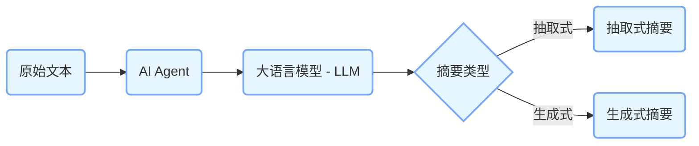

# 自动文本摘要AI Agent：LLM驱动的关键信息提取

> 关键词：自动文本摘要、AI Agent、大语言模型（LLM）、关键信息提取、自然语言处理

> 摘要：本文聚焦于自动文本摘要AI Agent，探讨其在大语言模型（LLM）驱动下进行关键信息提取的技术。详细介绍了相关核心概念、算法原理、数学模型，通过项目实战展示了具体的代码实现和应用场景。同时，推荐了学习资源、开发工具和相关论文著作，最后总结了该领域的未来发展趋势与挑战，并对常见问题进行了解答。

## 1. 背景介绍 
### 1.1 目的和范围
随着信息时代的发展，文本数据呈现爆炸式增长，人们需要从海量的文本中快速获取关键信息。自动文本摘要技术应运而生，它能够自动生成文本的简洁摘要，帮助用户节省阅读时间。本文旨在深入探讨基于大语言模型（LLM）驱动的自动文本摘要AI Agent，详细介绍其核心概念、算法原理、实现步骤以及实际应用场景等内容，范围涵盖从理论基础到实际项目开发的全过程。

### 1.2 预期读者
本文预期读者包括自然语言处理领域的研究人员、开发者、对人工智能技术感兴趣的学生以及希望利用自动文本摘要技术解决实际问题的企业技术人员等。这些读者需要具备一定的编程基础和对自然语言处理的基本了解。

### 1.3 文档结构概述
本文将按照以下结构展开：首先介绍相关核心概念和它们之间的联系，包括自动文本摘要、AI Agent和大语言模型的原理和架构；接着阐述核心算法原理和具体操作步骤，并用Python代码详细说明；然后讲解数学模型和公式，并通过举例进行说明；之后进行项目实战，包括开发环境搭建、源代码实现和代码解读；再介绍实际应用场景；推荐相关的学习资源、开发工具和论文著作；最后总结未来发展趋势与挑战，解答常见问题，并提供扩展阅读和参考资料。

### 1.4 术语表
#### 1.4.1 核心术语定义
- **自动文本摘要**：指利用计算机技术自动从原始文本中提取关键信息，生成简洁、连贯且能反映原文主旨的摘要的过程。
- **AI Agent**：即人工智能代理，是一种能够感知环境、自主决策并采取行动以实现特定目标的智能实体。在本文中，AI Agent负责执行自动文本摘要的任务。
- **大语言模型（LLM）**：是一种基于深度学习的语言模型，通过在大规模文本数据上进行训练，能够学习到语言的统计规律和语义信息，具备强大的语言理解和生成能力。

#### 1.4.2 相关概念解释
- **关键信息提取**：从文本中识别和提取出最能代表文本核心内容的信息，这些信息通常是重要的事实、观点、结论等。
- **自然语言处理（NLP）**：是一门研究如何让计算机理解、处理和生成人类语言的学科，自动文本摘要属于自然语言处理的一个重要应用领域。

#### 1.4.3 缩略词列表
- **LLM**：Large Language Model，大语言模型
- **NLP**：Natural Language Processing，自然语言处理

## 2. 核心概念与联系 

### 2.1 自动文本摘要
自动文本摘要主要有两种类型：抽取式摘要和生成式摘要。抽取式摘要通过从原文中选取重要的句子或片段来组成摘要，而生成式摘要则是基于对原文的理解，重新生成新的文本作为摘要。

#### 2.1.1 抽取式摘要原理
抽取式摘要的核心思想是对原文中的句子进行重要性评估，然后选择重要性较高的句子作为摘要。常用的评估方法包括基于词频、位置、句子长度等特征的统计方法，以及基于机器学习的分类方法。

#### 2.1.2 生成式摘要原理
生成式摘要则更注重对原文语义的理解和重构。它通常使用神经网络模型，如循环神经网络（RNN）、长短期记忆网络（LSTM）和Transformer等，通过学习大量的文本数据，掌握语言的生成规律，从而生成自然流畅的摘要。

### 2.2 AI Agent
AI Agent在自动文本摘要中扮演着决策者和执行者的角色。它接收原始文本作为输入，根据预设的目标和规则，利用大语言模型进行关键信息提取和摘要生成。AI Agent可以根据不同的场景和需求进行定制，例如可以设置不同的摘要长度、摘要风格等。

### 2.3 大语言模型（LLM）
大语言模型是自动文本摘要AI Agent的核心驱动力。它通过在大规模的文本数据上进行无监督学习，学习到丰富的语言知识和语义信息。在自动文本摘要中，LLM可以用于对文本进行理解、关键信息提取和摘要生成。常见的大语言模型有GPT系列、BERT等。

### 2.4 核心概念架构示意图


该流程图展示了自动文本摘要AI Agent的工作流程。原始文本首先输入到AI Agent中，AI Agent利用大语言模型对文本进行处理，然后根据预设的摘要类型（抽取式或生成式）生成相应的摘要。

## 3. 核心算法原理 & 具体操作步骤 

### 3.1 基于LLM的抽取式摘要算法原理
基于LLM的抽取式摘要算法主要分为以下几个步骤：
1. **文本编码**：将原始文本输入到LLM中，得到每个句子的向量表示。
2. **重要性评估**：根据句子的向量表示，计算每个句子的重要性得分。常用的方法是计算句子向量与文本整体向量的相似度，相似度越高，句子越重要。
3. **句子选择**：根据重要性得分，选择得分较高的句子作为摘要。

### 3.2 Python代码实现

```python
import torch
from transformers import AutoTokenizer, AutoModel

# 加载预训练的大语言模型和分词器
model_name = 'bert-base-chinese'
tokenizer = AutoTokenizer.from_pretrained(model_name)
model = AutoModel.from_pretrained(model_name)

def extractive_summary(text, num_sentences=3):
    # 将文本按句子分割
    sentences = text.split('。')
    sentence_embeddings = []
    for sentence in sentences:
        # 对每个句子进行分词
        inputs = tokenizer(sentence, return_tensors='pt')
        # 输入到模型中得到句子的向量表示
        outputs = model(**inputs)
        # 取[CLS]标记的向量作为句子的表示
        sentence_embedding = outputs.last_hidden_state[:, 0, :].squeeze()
        sentence_embeddings.append(sentence_embedding)
    
    # 计算文本整体向量
    text_embedding = torch.mean(torch.stack(sentence_embeddings), dim=0)
    
    # 计算每个句子与文本整体向量的相似度
    similarities = []
    for embedding in sentence_embeddings:
        similarity = torch.cosine_similarity(embedding.unsqueeze(0), text_embedding.unsqueeze(0))
        similarities.append(similarity.item())
    
    # 根据相似度排序，选择得分最高的句子
    sorted_indices = sorted(range(len(similarities)), key=lambda i: similarities[i], reverse=True)
    selected_indices = sorted(sorted_indices[:num_sentences])
    
    # 生成摘要
    summary = [sentences[i] for i in selected_indices]
    summary = '。'.join(summary)
    return summary

# 示例文本
text = "这是一段示例文本。它包含了一些重要的信息。这些信息对于理解问题很有帮助。另外，还有一些补充说明。"
summary = extractive_summary(text)
print("抽取式摘要：", summary)
```

### 3.3 代码解释
1. **模型加载**：使用`transformers`库加载预训练的BERT模型和分词器。
2. **句子编码**：将文本按句子分割，对每个句子进行分词并输入到模型中，得到句子的向量表示。
3. **重要性评估**：计算每个句子与文本整体向量的余弦相似度，作为句子的重要性得分。
4. **句子选择**：根据重要性得分排序，选择得分最高的句子作为摘要。
5. **摘要生成**：将选择的句子组合成摘要。

### 3.4 基于LLM的生成式摘要算法原理
基于LLM的生成式摘要算法通常使用序列到序列（Seq2Seq）模型，如Transformer架构。模型接收原始文本作为输入，通过编码器对文本进行编码，然后解码器根据编码信息生成摘要。

### 3.5 Python代码实现

```python
from transformers import AutoTokenizer, AutoModelForSeq2SeqLM

# 加载预训练的生成式模型和分词器
model_name = 't5-base'
tokenizer = AutoTokenizer.from_pretrained(model_name)
model = AutoModelForSeq2SeqLM.from_pretrained(model_name)

def generative_summary(text):
    # 对文本进行分词
    inputs = tokenizer(text, return_tensors='pt')
    # 生成摘要
    outputs = model.generate(**inputs)
    # 将生成的摘要解码为文本
    summary = tokenizer.decode(outputs[0], skip_special_tokens=True)
    return summary

# 示例文本
text = "这是一段示例文本。它包含了一些重要的信息。这些信息对于理解问题很有帮助。另外，还有一些补充说明。"
summary = generative_summary(text)
print("生成式摘要：", summary)
```

### 3.6 代码解释
1. **模型加载**：使用`transformers`库加载预训练的T5模型和分词器。
2. **文本编码**：对原始文本进行分词，将其转换为模型可以接受的输入格式。
3. **摘要生成**：调用模型的`generate`方法生成摘要。
4. **摘要解码**：将生成的摘要从模型输出的张量转换为文本。

## 4. 数学模型和公式 & 详细讲解 & 举例说明 

### 4.1 抽取式摘要中的余弦相似度公式
在抽取式摘要中，我们使用余弦相似度来评估句子的重要性。余弦相似度的计算公式如下：

$$
\text{Cosine Similarity}(A, B) = \frac{A \cdot B}{\|A\| \|B\|}
$$

其中，$A$ 和 $B$ 分别是两个向量，$A \cdot B$ 表示向量的点积，$\|A\|$ 和 $\|B\|$ 分别表示向量的模。

#### 4.1.1 详细讲解
余弦相似度衡量的是两个向量之间的夹角余弦值，取值范围在 $[-1, 1]$ 之间。当余弦相似度为 1 时，表示两个向量方向完全相同；当余弦相似度为 -1 时，表示两个向量方向完全相反；当余弦相似度为 0 时，表示两个向量相互垂直。在抽取式摘要中，我们希望选择与文本整体向量相似度较高的句子，因为这些句子更能代表文本的核心内容。

#### 4.1.2 举例说明
假设我们有两个句子的向量表示：$A = [1, 2, 3]$ 和 $B = [2, 4, 6]$。首先计算向量的点积：

$$
A \cdot B = 1 \times 2 + 2 \times 4 + 3 \times 6 = 2 + 8 + 18 = 28
$$

然后计算向量的模：

$$
\|A\| = \sqrt{1^2 + 2^2 + 3^2} = \sqrt{1 + 4 + 9} = \sqrt{14}
$$

$$
\|B\| = \sqrt{2^2 + 4^2 + 6^2} = \sqrt{4 + 16 + 36} = \sqrt{56} = 2\sqrt{14}
$$

最后计算余弦相似度：

$$
\text{Cosine Similarity}(A, B) = \frac{28}{\sqrt{14} \times 2\sqrt{14}} = \frac{28}{2 \times 14} = 1
$$

这表明向量 $A$ 和 $B$ 方向完全相同，它们的相似度为 1。

### 4.2 生成式摘要中的交叉熵损失函数
在生成式摘要中，通常使用交叉熵损失函数来训练模型。交叉熵损失函数的计算公式如下：

$$
H(p, q) = - \sum_{i=1}^{n} p(i) \log(q(i))
$$

其中，$p$ 是真实概率分布，$q$ 是模型预测的概率分布，$n$ 是类别数。

#### 4.2.1 详细讲解
交叉熵损失函数衡量的是真实概率分布和模型预测概率分布之间的差异。在生成式摘要中，真实概率分布表示目标摘要的正确单词序列，模型预测概率分布表示模型生成的单词序列的概率。通过最小化交叉熵损失函数，模型可以学习到生成更接近目标摘要的文本。

#### 4.2.2 举例说明
假设我们有一个简单的文本生成任务，目标是生成一个由两个单词组成的句子，单词集合为 $\{w_1, w_2\}$。真实概率分布 $p = [0.8, 0.2]$，表示第一个单词的概率为 0.8，第二个单词的概率为 0.2。模型预测的概率分布 $q = [0.6, 0.4]$。则交叉熵损失为：

$$
H(p, q) = - (0.8 \log(0.6) + 0.2 \log(0.4)) \approx 0.5004
$$

通过不断调整模型的参数，使得交叉熵损失逐渐减小，模型的生成效果会越来越好。

## 5. 项目实战：代码实际案例和详细解释说明 

### 5.1  开发环境搭建
#### 5.1.1 安装Python
首先需要安装Python，建议使用Python 3.7及以上版本。可以从Python官方网站（https://www.python.org/downloads/）下载并安装。

#### 5.1.2 创建虚拟环境
为了避免不同项目之间的依赖冲突，建议使用虚拟环境。可以使用`venv`模块创建虚拟环境：

```bash
python -m venv myenv
```

激活虚拟环境：

- 在Windows上：
```bash
myenv\Scripts\activate
```
- 在Linux/Mac上：
```bash
source myenv/bin/activate
```

#### 5.1.3 安装依赖库
使用`pip`安装所需的依赖库：

```bash
pip install transformers torch
```

### 5.2  源代码详细实现和代码解读
#### 5.2.1 抽取式摘要代码
```python
import torch
from transformers import AutoTokenizer, AutoModel

# 加载预训练的大语言模型和分词器
model_name = 'bert-base-chinese'
tokenizer = AutoTokenizer.from_pretrained(model_name)
model = AutoModel.from_pretrained(model_name)

def extractive_summary(text, num_sentences=3):
    # 将文本按句子分割
    sentences = text.split('。')
    sentence_embeddings = []
    for sentence in sentences:
        # 对每个句子进行分词
        inputs = tokenizer(sentence, return_tensors='pt')
        # 输入到模型中得到句子的向量表示
        outputs = model(**inputs)
        # 取[CLS]标记的向量作为句子的表示
        sentence_embedding = outputs.last_hidden_state[:, 0, :].squeeze()
        sentence_embeddings.append(sentence_embedding)
    
    # 计算文本整体向量
    text_embedding = torch.mean(torch.stack(sentence_embeddings), dim=0)
    
    # 计算每个句子与文本整体向量的相似度
    similarities = []
    for embedding in sentence_embeddings:
        similarity = torch.cosine_similarity(embedding.unsqueeze(0), text_embedding.unsqueeze(0))
        similarities.append(similarity.item())
    
    # 根据相似度排序，选择得分最高的句子
    sorted_indices = sorted(range(len(similarities)), key=lambda i: similarities[i], reverse=True)
    selected_indices = sorted(sorted_indices[:num_sentences])
    
    # 生成摘要
    summary = [sentences[i] for i in selected_indices]
    summary = '。'.join(summary)
    return summary

# 示例文本
text = "这是一段示例文本。它包含了一些重要的信息。这些信息对于理解问题很有帮助。另外，还有一些补充说明。"
summary = extractive_summary(text)
print("抽取式摘要：", summary)
```

#### 5.2.2 代码解读
- **模型加载**：使用`transformers`库加载预训练的BERT模型和分词器，`bert-base-chinese`是一个中文预训练模型。
- **句子编码**：将文本按句子分割，对每个句子进行分词并输入到模型中，通过`model(**inputs)`得到模型的输出，取`[CLS]`标记的向量作为句子的表示。
- **重要性评估**：计算每个句子与文本整体向量的余弦相似度，作为句子的重要性得分。
- **句子选择**：根据重要性得分排序，选择得分最高的句子作为摘要。
- **摘要生成**：将选择的句子组合成摘要。

#### 5.2.3 生成式摘要代码
```python
from transformers import AutoTokenizer, AutoModelForSeq2SeqLM

# 加载预训练的生成式模型和分词器
model_name = 't5-base'
tokenizer = AutoTokenizer.from_pretrained(model_name)
model = AutoModelForSeq2SeqLM.from_pretrained(model_name)

def generative_summary(text):
    # 对文本进行分词
    inputs = tokenizer(text, return_tensors='pt')
    # 生成摘要
    outputs = model.generate(**inputs)
    # 将生成的摘要解码为文本
    summary = tokenizer.decode(outputs[0], skip_special_tokens=True)
    return summary

# 示例文本
text = "这是一段示例文本。它包含了一些重要的信息。这些信息对于理解问题很有帮助。另外，还有一些补充说明。"
summary = generative_summary(text)
print("生成式摘要：", summary)
```

#### 5.2.4 代码解读
- **模型加载**：使用`transformers`库加载预训练的T5模型和分词器，`t5-base`是一个通用的生成式模型。
- **文本编码**：对原始文本进行分词，将其转换为模型可以接受的输入格式。
- **摘要生成**：调用模型的`generate`方法生成摘要。
- **摘要解码**：将生成的摘要从模型输出的张量转换为文本，`skip_special_tokens=True`表示跳过特殊标记。

### 5.3  代码解读与分析
#### 5.3.1 抽取式摘要代码分析
- **优点**：抽取式摘要方法简单直接，不需要大量的训练数据，能够保留原文的关键信息，生成的摘要准确性较高。
- **缺点**：摘要的灵活性较差，只能从原文中选取句子，可能无法生成自然流畅的摘要。

#### 5.3.2 生成式摘要代码分析
- **优点**：生成式摘要能够根据原文的语义生成新的文本，摘要更加自然流畅，灵活性较高。
- **缺点**：需要大量的训练数据和计算资源，生成的摘要可能存在信息不准确或语义偏离的问题。

## 6. 实际应用场景 
### 6.1 新闻媒体领域
在新闻媒体领域，自动文本摘要技术可以帮助记者快速获取大量新闻文章的关键信息，提高新闻编辑的效率。同时，用户也可以通过阅读摘要快速了解新闻内容，节省阅读时间。例如，新闻网站可以为每篇文章生成摘要，展示在首页或搜索结果中，吸引用户点击阅读。

### 6.2 文档处理领域
在企业和机构中，每天都会产生大量的文档，如报告、合同、论文等。自动文本摘要技术可以帮助用户快速理解文档的核心内容，提高文档处理的效率。例如，企业可以使用自动文本摘要工具对合同进行摘要，快速了解合同的关键条款；科研人员可以使用该技术对论文进行摘要，快速筛选出有价值的研究成果。

### 6.3 智能客服领域
在智能客服系统中，自动文本摘要技术可以帮助客服人员快速理解用户的问题，提供更准确的回答。例如，当用户输入较长的问题时，系统可以自动生成问题的摘要，提取关键信息，然后根据摘要进行回复，提高客服效率和用户满意度。

### 6.4 信息检索领域
在搜索引擎中，自动文本摘要技术可以为搜索结果生成摘要，帮助用户快速判断搜索结果是否符合自己的需求。例如，百度、谷歌等搜索引擎在搜索结果中会展示网页的摘要，让用户快速了解网页的内容。

## 7. 工具和资源推荐
### 7.1 学习资源推荐
#### 7.1.1 书籍推荐
- 《自然语言处理入门》：作者何晗，本书全面介绍了自然语言处理的基础知识和常用技术，适合初学者入门。
- 《深度学习》：作者Ian Goodfellow、Yoshua Bengio和Aaron Courville，这本书是深度学习领域的经典教材，涵盖了深度学习的基本原理、模型架构和应用场景。
- 《Python自然语言处理》：作者Steven Bird、Ewan Klein和Edward Loper，本书通过Python代码详细介绍了自然语言处理的各种技术和工具。

#### 7.1.2 在线课程
- Coursera上的“Natural Language Processing Specialization”：由深度学习领域的知名学者授课，系统介绍了自然语言处理的各个方面。
- 网易云课堂上的“自然语言处理实战”：通过实际项目案例，帮助学习者掌握自然语言处理的实践技能。

#### 7.1.3 技术博客和网站
- Hugging Face Blog：提供了关于大语言模型和自然语言处理的最新研究成果和技术应用。
- Medium上的自然语言处理相关文章：有很多专业人士分享的自然语言处理技术和经验。
- 机器之心：关注人工智能领域的最新动态和技术发展，有很多关于自动文本摘要的报道和分析。

### 7.2 开发工具框架推荐
#### 7.2.1 IDE和编辑器
- PyCharm：是一款专门为Python开发设计的集成开发环境，具有强大的代码编辑、调试和项目管理功能。
- Visual Studio Code：是一款轻量级的代码编辑器，支持多种编程语言，有丰富的插件扩展功能。

#### 7.2.2 调试和性能分析工具
- PyTorch Profiler：可以帮助开发者分析PyTorch模型的性能瓶颈，优化代码效率。
- TensorBoard：是TensorFlow的可视化工具，也可以用于PyTorch模型的训练过程可视化和性能分析。

#### 7.2.3 相关框架和库
- Transformers：由Hugging Face开发的开源库，提供了丰富的预训练模型和工具，方便开发者进行自然语言处理任务。
- NLTK：自然语言工具包，提供了多种自然语言处理的工具和数据集，如分词、词性标注、命名实体识别等。
- SpaCy：是一个高效的自然语言处理库，提供了快速的文本处理功能和预训练模型。

### 7.3 相关论文著作推荐
#### 7.3.1 经典论文
- “Attention Is All You Need”：提出了Transformer架构，是自然语言处理领域的里程碑式论文。
- “BERT: Pre-training of Deep Bidirectional Transformers for Language Understanding”：介绍了BERT模型，开创了预训练语言模型的新时代。
- “Text Summarization Techniques: A Brief Survey”：对自动文本摘要技术进行了全面的综述。

#### 7.3.2 最新研究成果
- 关注ACL（Association for Computational Linguistics）、EMNLP（Conference on Empirical Methods in Natural Language Processing）等自然语言处理领域的顶级会议，这些会议上会发表很多关于自动文本摘要的最新研究成果。
- 阅读ArXiv上的相关论文，ArXiv是一个开放获取的预印本平台，很多研究人员会在上面发布自己的最新研究成果。

#### 7.3.3 应用案例分析
- 可以参考一些企业和机构发布的技术博客和报告，了解自动文本摘要技术在实际应用中的案例和经验。例如，谷歌、微软等公司会分享他们在自然语言处理领域的应用实践。

## 8. 总结：未来发展趋势与挑战
### 8.1 未来发展趋势
#### 8.1.1 多模态融合
未来的自动文本摘要技术将不仅仅局限于文本数据，还会融合图像、音频、视频等多模态信息。例如，在新闻报道中，除了文本内容，还可以结合图片和视频生成更加丰富和全面的摘要。

#### 8.1.2 个性化摘要
随着人工智能技术的发展，自动文本摘要将能够根据用户的个性化需求生成摘要。例如，根据用户的阅读历史、兴趣爱好等信息，为用户提供符合其需求的摘要。

#### 8.1.3 跨语言摘要
在全球化的背景下，跨语言的信息交流越来越频繁。未来的自动文本摘要技术将能够处理多种语言的文本，实现跨语言的摘要生成，帮助用户更好地获取和理解不同语言的信息。

#### 8.1.4 与知识图谱结合
知识图谱可以为自动文本摘要提供丰富的背景知识，帮助模型更好地理解文本的语义。未来的自动文本摘要技术将与知识图谱相结合，提高摘要的准确性和质量。

### 8.2 挑战
#### 8.2.1 语义理解难题
虽然大语言模型在语言理解方面取得了很大的进展，但仍然存在语义理解不准确的问题。在自动文本摘要中，准确理解文本的语义是生成高质量摘要的关键，因此如何提高模型的语义理解能力是一个挑战。

#### 8.2.2 数据质量和多样性
自动文本摘要技术需要大量的高质量数据进行训练，但目前的数据质量和多样性还存在一定的问题。例如，数据中可能存在噪声、错误标注等问题，影响模型的训练效果。同时，不同领域、不同风格的文本数据也需要进一步丰富。

#### 8.2.3 计算资源需求
大语言模型的训练和推理需要大量的计算资源，这对于一些小型企业和研究机构来说是一个挑战。如何降低计算资源的需求，提高模型的效率，是未来需要解决的问题。

#### 8.2.4 伦理和法律问题
自动文本摘要技术的应用也带来了一些伦理和法律问题，如摘要的版权归属、虚假信息传播等。如何制定相应的法律法规和道德准则，规范自动文本摘要技术的应用，是一个亟待解决的问题。

## 9. 附录：常见问题与解答
### 9.1 自动文本摘要和人工摘要有什么区别？
自动文本摘要由计算机程序自动生成，速度快、效率高，可以处理大量的文本数据。但自动文本摘要的质量可能不如人工摘要，存在语义理解不准确、摘要不够自然流畅等问题。人工摘要则由人工编写，能够更好地理解文本的语义，生成的摘要质量较高，但速度慢、效率低，不适合处理大量的文本数据。

### 9.2 抽取式摘要和生成式摘要哪个更好？
抽取式摘要和生成式摘要各有优缺点，选择哪种方法取决于具体的应用场景和需求。如果需要保留原文的关键信息，对摘要的准确性要求较高，抽取式摘要可能更合适；如果需要生成自然流畅、灵活多样的摘要，生成式摘要可能更适合。

### 9.3 如何评估自动文本摘要的质量？
常用的评估指标包括ROUGE（Recall-Oriented Understudy for Gisting Evaluation）、BLEU（Bilingual Evaluation Understudy）等。ROUGE主要衡量摘要与参考摘要之间的重叠程度，BLEU主要用于评估机器翻译的质量，也可以用于评估自动文本摘要的质量。此外，还可以通过人工评估的方式，让用户对摘要的质量进行打分和评价。

### 9.4 自动文本摘要技术可以处理哪些类型的文本？
自动文本摘要技术可以处理各种类型的文本，如新闻文章、学术论文、报告、小说等。但不同类型的文本具有不同的特点和语言风格，对模型的性能和效果可能会产生一定的影响。在实际应用中，需要根据具体的文本类型选择合适的模型和方法。

## 10. 扩展阅读 & 参考资料
### 10.1 扩展阅读
- 《人工智能时代的自然语言处理》：深入探讨了自然语言处理在人工智能时代的发展趋势和应用前景。
- 《深度学习进阶：自然语言处理》：介绍了自然语言处理中的深度学习技术和应用，适合有一定深度学习基础的读者阅读。

### 10.2 参考资料
- Hugging Face官方文档：https://huggingface.co/docs
- Transformers库源代码：https://github.com/huggingface/transformers
- NLTK官方文档：https://www.nltk.org/
- SpaCy官方文档：https://spacy.io/

作者：AI天才研究院/AI Genius Institute & 禅与计算机程序设计艺术 /Zen And The Art of Computer Programming