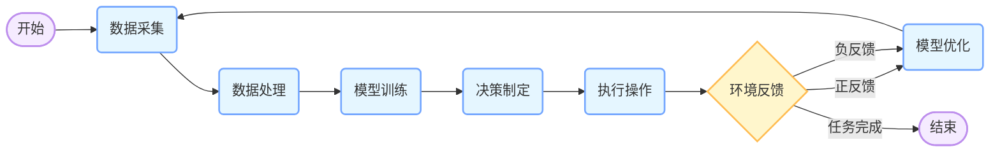

# 自我完善型AI系统:设计原则与实现策略

> 关键词：自我完善型AI系统、设计原则、实现策略、机器学习、自适应算法

> 摘要：本文聚焦于自我完善型AI系统，深入探讨其设计原则与实现策略。首先介绍了该领域的背景信息，包括目的、预期读者等。接着阐述了核心概念及联系，给出了原理和架构的示意图与流程图。详细讲解了核心算法原理和具体操作步骤，运用Python代码进行说明。同时，分析了相关数学模型和公式，并举例阐释。通过项目实战，展示了代码实际案例及详细解释。还探讨了实际应用场景，推荐了相关工具和资源。最后总结了未来发展趋势与挑战，解答了常见问题，并提供了扩展阅读和参考资料，旨在为构建高效的自我完善型AI系统提供全面的指导。

## 1. 背景介绍 
### 1.1 目的和范围
自我完善型AI系统旨在使人工智能具备自主学习、自我优化和适应环境变化的能力。随着人工智能技术的广泛应用，传统的AI系统在面对复杂多变的现实场景时，往往需要人工干预来更新模型和规则。而自我完善型AI系统能够自动从新的数据中学习，不断改进自身的性能和决策能力，减少对人工的依赖。

本文的范围涵盖了自我完善型AI系统的设计原则、实现策略、核心算法、数学模型以及实际应用等方面。通过深入研究这些内容，为开发者和研究人员提供全面的指导，帮助他们构建更加智能、灵活和高效的自我完善型AI系统。

### 1.2 预期读者
本文的预期读者包括人工智能领域的研究人员、开发者、软件工程师、数据科学家以及对自我完善型AI系统感兴趣的技术爱好者。对于研究人员，本文可以为他们的学术研究提供理论基础和研究方向；对于开发者和软件工程师，本文提供了具体的实现策略和代码示例，有助于他们在实际项目中应用自我完善型AI技术；对于数据科学家，本文涉及的数据处理和机器学习算法相关内容可以为他们的工作提供参考；而对于技术爱好者，本文能够帮助他们了解自我完善型AI系统的基本概念和原理。

### 1.3 文档结构概述
本文将按照以下结构进行组织：
- 核心概念与联系：介绍自我完善型AI系统的核心概念，包括其定义、特点和与其他AI系统的区别，并给出原理和架构的示意图与流程图。
- 核心算法原理 & 具体操作步骤：详细讲解实现自我完善的核心算法，如强化学习、遗传算法等，并给出Python代码示例。
- 数学模型和公式 & 详细讲解 & 举例说明：分析自我完善型AI系统所涉及的数学模型和公式，如损失函数、优化算法等，并通过具体例子进行说明。
- 项目实战：通过一个实际的项目案例，展示自我完善型AI系统的开发过程，包括开发环境搭建、源代码实现和代码解读。
- 实际应用场景：探讨自我完善型AI系统在不同领域的应用场景，如智能交通、医疗诊断等。
- 工具和资源推荐：推荐学习自我完善型AI系统的相关书籍、在线课程、技术博客和网站，以及开发工具、框架和相关论文著作。
- 总结：未来发展趋势与挑战：总结自我完善型AI系统的发展趋势，分析面临的挑战和问题。
- 附录：常见问题与解答：解答读者在学习和实践过程中可能遇到的常见问题。
- 扩展阅读 & 参考资料：提供进一步学习和研究的扩展阅读材料和参考资料。

### 1.4 术语表
#### 1.4.1 核心术语定义
- **自我完善型AI系统**：能够自动从新的数据中学习，不断改进自身性能和决策能力，以适应环境变化的人工智能系统。
- **机器学习**：一门多领域交叉学科，涉及概率论、统计学、逼近论、凸分析、算法复杂度理论等多门学科。它专门研究计算机怎样模拟或实现人类的学习行为，以获取新的知识或技能，重新组织已有的知识结构使之不断改善自身的性能。
- **强化学习**：一种机器学习方法，智能体通过与环境进行交互，根据环境反馈的奖励信号来学习最优的行为策略。
- **遗传算法**：是模拟达尔文生物进化论的自然选择和遗传学机理的生物进化过程的计算模型，是一种通过模拟自然进化过程搜索最优解的方法。

#### 1.4.2 相关概念解释
- **自适应**：系统能够根据环境的变化自动调整自身的行为和参数，以保持良好的性能。
- **模型更新**：在自我完善型AI系统中，模型更新是指根据新的数据对已有的模型进行修改和优化，以提高模型的准确性和适应性。
- **数据驱动**：系统的决策和行为主要基于数据，通过对大量数据的分析和学习来实现自我完善。

#### 1.4.3 缩略词列表
- **AI**：Artificial Intelligence，人工智能
- **ML**：Machine Learning，机器学习
- **RL**：Reinforcement Learning，强化学习
- **GA**：Genetic Algorithm，遗传算法

## 2. 核心概念与联系 
### 核心概念原理
自我完善型AI系统的核心原理在于实现系统的自主学习和自我优化。它通过不断地与环境进行交互，获取新的数据，并利用这些数据来改进自身的模型和策略。具体来说，系统会根据当前的状态做出决策，然后观察环境的反馈，根据反馈的奖励或惩罚信号来调整自己的行为。这个过程不断循环，使得系统能够逐渐适应环境的变化，提高自身的性能。

例如，在一个智能游戏系统中，AI角色会根据当前的游戏场景（如敌人的位置、自身的生命值等）做出行动决策，如攻击、防御或逃跑。游戏结束后，系统会根据游戏的结果（胜利或失败）给予AI角色相应的奖励或惩罚。AI角色会根据这些反馈来调整自己的决策策略，以便在未来的游戏中取得更好的成绩。

### 架构的文本示意图
以下是一个简单的自我完善型AI系统的架构示意图：

```plaintext
+-------------------+
|   环境（Environment）   |
+-------------------+
         |
         v
+-------------------+
|  数据采集模块（Data Collection） |
+-------------------+
         |
         v
+-------------------+
|  数据处理模块（Data Processing） |
+-------------------+
         |
         v
+-------------------+
|  模型训练模块（Model Training） |
+-------------------+
         |
         v
+-------------------+
|  决策模块（Decision Making） |
+-------------------+
         |
         v
+-------------------+
|  执行模块（Execution） |
+-------------------+
         |
         v
+-------------------+
|  反馈模块（Feedback） |
+-------------------+
         |
         v
|  模型更新模块（Model Update） |
+-------------------+
```

### Mermaid流程图


这个流程图展示了自我完善型AI系统的基本工作流程。系统从数据采集开始，经过数据处理、模型训练、决策制定和执行操作等步骤，然后根据环境的反馈进行模型优化，形成一个闭环的自我完善过程。

## 3. 核心算法原理 & 具体操作步骤 
### 强化学习算法原理
强化学习是实现自我完善型AI系统的重要算法之一。在强化学习中，智能体（Agent）与环境（Environment）进行交互，通过执行一系列的动作（Action）来改变环境的状态（State），并从环境中获得奖励（Reward）。智能体的目标是学习一个最优的策略（Policy），使得在长期的交互过程中获得的累积奖励最大。

强化学习的核心是价值函数（Value Function）和策略函数（Policy Function）。价值函数用于评估在某个状态下采取某个动作的价值，而策略函数则决定了智能体在每个状态下应该采取的动作。

### Python代码示例
以下是一个简单的使用OpenAI Gym库实现的强化学习示例，使用Q学习算法来解决CartPole-v1环境的问题：

```python
import gym
import numpy as np

# 创建环境
env = gym.make('CartPole-v1')

# 初始化Q表
state_space_size = env.observation_space.shape[0]
action_space_size = env.action_space.n
q_table = np.zeros((state_space_size, action_space_size))

# 超参数设置
learning_rate = 0.1
discount_rate = 0.99
exploration_rate = 1
max_exploration_rate = 1
min_exploration_rate = 0.01
exploration_decay_rate = 0.001

# 训练参数
num_episodes = 1000
max_steps_per_episode = 200

# 训练循环
for episode in range(num_episodes):
    state = env.reset()
    done = False
    for step in range(max_steps_per_episode):
        # 探索与利用策略
        exploration_rate_threshold = np.random.uniform(0, 1)
        if exploration_rate_threshold > exploration_rate:
            action = np.argmax(q_table[state, :])
        else:
            action = env.action_space.sample()
        
        # 执行动作
        new_state, reward, done, info = env.step(action)
        
        # 更新Q表
        q_table[state, action] = q_table[state, action] * (1 - learning_rate) + \
            learning_rate * (reward + discount_rate * np.max(q_table[new_state, :]))
        
        state = new_state
        
        if done == True:
            break
    
    # 衰减探索率
    exploration_rate = min_exploration_rate + \
        (max_exploration_rate - min_exploration_rate) * np.exp(-exploration_decay_rate * episode)

# 测试训练好的模型
state = env.reset()
done = False
for step in range(max_steps_per_episode):
    action = np.argmax(q_table[state, :])
    new_state, reward, done, info = env.step(action)
    state = new_state
    env.render()
    if done == True:
        break

env.close()
```

### 代码解释
1. **环境创建**：使用`gym.make('CartPole-v1')`创建一个CartPole-v1环境。
2. **Q表初始化**：初始化一个Q表，用于存储每个状态-动作对的价值。
3. **超参数设置**：设置学习率、折扣率、探索率等超参数。
4. **训练循环**：在每个episode中，智能体根据探索与利用策略选择动作，执行动作并更新Q表。
5. **探索率衰减**：随着训练的进行，逐渐降低探索率，增加利用已学习到的知识的比例。
6. **测试模型**：使用训练好的Q表在环境中进行测试，观察智能体的表现。

### 遗传算法原理
遗传算法是一种基于生物进化原理的优化算法。它通过模拟自然选择和遗传机制，在解空间中搜索最优解。遗传算法的基本操作包括选择、交叉和变异。

选择操作根据个体的适应度值选择优秀的个体作为父代；交叉操作将父代的基因进行交换，生成子代；变异操作对个体的基因进行随机变异，增加种群的多样性。

### Python代码示例
以下是一个简单的遗传算法示例，用于求解函数 $f(x) = -x^2 + 10$ 的最大值：

```python
import numpy as np

# 目标函数
def objective_function(x):
    return -x**2 + 10

# 初始化种群
def initialize_population(pop_size, gene_length):
    population = np.random.uniform(-10, 10, (pop_size, gene_length))
    return population

# 计算适应度值
def calculate_fitness(population):
    fitness = []
    for individual in population:
        x = individual[0]
        fit = objective_function(x)
        fitness.append(fit)
    return np.array(fitness)

# 选择操作
def selection(population, fitness, num_parents):
    parents = []
    for _ in range(num_parents):
        max_fitness_index = np.argmax(fitness)
        parents.append(population[max_fitness_index])
        fitness[max_fitness_index] = -np.inf
    return np.array(parents)

# 交叉操作
def crossover(parents, offspring_size):
    offspring = []
    for _ in range(offspring_size[0]):
        parent1_index = np.random.randint(0, parents.shape[0])
        parent2_index = np.random.randint(0, parents.shape[0])
        child = parents[parent1_index] * 0.5 + parents[parent2_index] * 0.5
        offspring.append(child)
    return np.array(offspring)

# 变异操作
def mutation(offspring, mutation_rate):
    for individual in offspring:
        if np.random.rand() < mutation_rate:
            individual[0] += np.random.uniform(-1, 1)
    return offspring

# 遗传算法主函数
def genetic_algorithm(pop_size, gene_length, num_generations, num_parents, mutation_rate):
    population = initialize_population(pop_size, gene_length)
    for generation in range(num_generations):
        fitness = calculate_fitness(population)
        parents = selection(population, fitness, num_parents)
        offspring_size = (pop_size - parents.shape[0], gene_length)
        offspring = crossover(parents, offspring_size)
        offspring = mutation(offspring, mutation_rate)
        population = np.vstack((parents, offspring))
    best_fitness_index = np.argmax(calculate_fitness(population))
    best_solution = population[best_fitness_index]
    return best_solution

# 运行遗传算法
pop_size = 50
gene_length = 1
num_generations = 100
num_parents = 20
mutation_rate = 0.1
best_solution = genetic_algorithm(pop_size, gene_length, num_generations, num_parents, mutation_rate)
print("最优解:", best_solution[0])
print("最优值:", objective_function(best_solution[0]))
```

### 代码解释
1. **目标函数定义**：定义了目标函数 $f(x) = -x^2 + 10$。
2. **种群初始化**：随机生成初始种群。
3. **适应度计算**：计算每个个体的适应度值。
4. **选择操作**：选择适应度值高的个体作为父代。
5. **交叉操作**：将父代的基因进行交换，生成子代。
6. **变异操作**：对个体的基因进行随机变异。
7. **遗传算法主循环**：不断进行选择、交叉和变异操作，直到达到指定的迭代次数。
8. **输出最优解**：输出最优解和最优值。

## 4. 数学模型和公式 & 详细讲解 & 举例说明 
### 强化学习中的数学模型
#### 马尔可夫决策过程（MDP）
马尔可夫决策过程是强化学习的基础数学模型，它由一个四元组 $(S, A, P, R)$ 表示，其中：
- $S$ 是状态空间，表示环境可能处于的所有状态的集合。
- $A$ 是动作空间，表示智能体可以采取的所有动作的集合。
- $P$ 是状态转移概率函数，$P(s'|s, a)$ 表示在状态 $s$ 下采取动作 $a$ 后转移到状态 $s'$ 的概率。
- $R$ 是奖励函数，$R(s, a, s')$ 表示在状态 $s$ 下采取动作 $a$ 并转移到状态 $s'$ 时获得的奖励。

#### 价值函数
价值函数用于评估在某个状态下的价值。常见的价值函数有状态价值函数 $V(s)$ 和动作价值函数 $Q(s, a)$。

状态价值函数 $V(s)$ 表示从状态 $s$ 开始，遵循某个策略 $\pi$ 所能获得的期望累积奖励：
$$V^{\pi}(s) = \mathbb{E}_{\pi}\left[\sum_{t=0}^{\infty}\gamma^t R_{t+1} \mid S_0 = s\right]$$
其中，$\gamma$ 是折扣因子，$0 \leq \gamma \leq 1$，用于权衡即时奖励和未来奖励的重要性。

动作价值函数 $Q(s, a)$ 表示在状态 $s$ 下采取动作 $a$，然后遵循某个策略 $\pi$ 所能获得的期望累积奖励：
$$Q^{\pi}(s, a) = \mathbb{E}_{\pi}\left[\sum_{t=0}^{\infty}\gamma^t R_{t+1} \mid S_0 = s, A_0 = a\right]$$

#### Q学习算法公式
Q学习算法是一种基于动作价值函数的无模型强化学习算法，其更新公式为：
$$Q(S_t, A_t) \leftarrow Q(S_t, A_t) + \alpha \left[R_{t+1} + \gamma \max_{a} Q(S_{t+1}, a) - Q(S_t, A_t)\right]$$
其中，$\alpha$ 是学习率，控制每次更新的步长。

### 举例说明
假设一个简单的网格世界环境，智能体在一个 $3 \times 3$ 的网格中移动，目标是到达右上角的格子。每个格子是一个状态，智能体可以选择上、下、左、右四个动作。当智能体到达目标格子时，获得奖励 $+10$，否则获得奖励 $-1$。

初始时，Q表中的所有值都为0。智能体在某个状态 $s$ 下选择动作 $a$，执行动作后转移到新状态 $s'$ 并获得奖励 $r$。根据Q学习算法的更新公式，更新Q表中 $(s, a)$ 对应的Q值。

例如，智能体在状态 $(1, 1)$ 选择向右的动作，转移到状态 $(1, 2)$ 并获得奖励 $-1$。假设学习率 $\alpha = 0.1$，折扣因子 $\gamma = 0.9$，当前 $(1, 1)$ 状态下向右动作的Q值为 $Q(1, 1, \text{right}) = 0$，$(1, 2)$ 状态下所有动作的最大Q值为 $\max_{a} Q(1, 2, a) = 0$。则更新后的Q值为：
$$Q(1, 1, \text{right}) = 0 + 0.1 \times [-1 + 0.9 \times 0 - 0] = -0.1$$

### 遗传算法中的数学模型
#### 适应度函数
适应度函数用于评估每个个体的优劣程度。在求解函数 $f(x) = -x^2 + 10$ 的最大值问题中，适应度函数可以直接定义为目标函数 $f(x)$。

#### 选择概率
在选择操作中，每个个体被选中作为父代的概率通常与其适应度值成正比。假设种群中有 $N$ 个个体，第 $i$ 个个体的适应度值为 $f_i$，则其被选中的概率为：
$$P_i = \frac{f_i}{\sum_{j=1}^{N} f_j}$$

#### 交叉和变异操作
交叉操作通常采用单点交叉、多点交叉等方法，变异操作则是对个体的基因进行随机扰动。例如，在二进制编码的遗传算法中，交叉操作可以是随机选择一个交叉点，交换两个父代个体在交叉点之后的基因；变异操作可以是随机选择一个基因位，将其值取反。

### 举例说明
假设种群中有三个个体，其适应度值分别为 $f_1 = 5$，$f_2 = 3$，$f_3 = 2$。则它们被选中作为父代的概率分别为：
$$P_1 = \frac{5}{5 + 3 + 2} = 0.5$$
$$P_2 = \frac{3}{5 + 3 + 2} = 0.3$$
$$P_3 = \frac{2}{5 + 3 + 2} = 0.2$$

在选择操作中，根据这些概率随机选择父代个体。假设选择了个体1和个体2作为父代，进行单点交叉操作。个体1的基因编码为 $[1, 0, 1]$，个体2的基因编码为 $[0, 1, 1]$，随机选择的交叉点为第2位。则交叉后的子代个体基因编码分别为 $[1, 1, 1]$ 和 $[0, 0, 1]$。

## 5. 项目实战：代码实际案例和详细解释说明 
### 5.1  开发环境搭建
本项目使用Python进行开发，需要安装以下库：
- **OpenAI Gym**：用于创建和管理强化学习环境。可以使用以下命令进行安装：
```sh
pip install gym
```
- **NumPy**：用于数值计算。安装命令如下：
```sh
pip install numpy
```
- **Matplotlib**：用于数据可视化。安装命令如下：
```sh
pip install matplotlib
```

### 5.2  源代码详细实现和代码解读
我们将实现一个简单的自我完善型AI系统，用于解决智能机器人在迷宫中寻找出口的问题。以下是完整的代码：

```python
import gym
import numpy as np
import matplotlib.pyplot as plt

# 创建迷宫环境
class MazeEnv(gym.Env):
    def __init__(self):
        self.maze = np.array([
            [0, 1, 0, 0],
            [0, 1, 0, 1],
            [0, 0, 0, 0],
            [0, 1, 1, 0]
        ])
        self.start_state = (0, 0)
        self.goal_state = (3, 3)
        self.current_state = self.start_state
        self.action_space = gym.spaces.Discrete(4)  # 上、下、左、右
        self.observation_space = gym.spaces.Tuple([
            gym.spaces.Discrete(self.maze.shape[0]),
            gym.spaces.Discrete(self.maze.shape[1])
        ])

    def reset(self):
        self.current_state = self.start_state
        return self.current_state

    def step(self, action):
        x, y = self.current_state
        if action == 0:  # 上
            new_x = max(x - 1, 0)
            new_y = y
        elif action == 1:  # 下
            new_x = min(x + 1, self.maze.shape[0] - 1)
            new_y = y
        elif action == 2:  # 左
            new_x = x
            new_y = max(y - 1, 0)
        elif action == 3:  # 右
            new_x = x
            new_y = min(y + 1, self.maze.shape[1] - 1)

        if self.maze[new_x, new_y] == 1:  # 撞到墙
            reward = -10
            done = False
        elif (new_x, new_y) == self.goal_state:  # 到达目标
            reward = 100
            done = True
        else:  # 正常移动
            reward = -1
            done = False

        self.current_state = (new_x, new_y)
        return self.current_state, reward, done, {}

    def render(self):
        maze_copy = self.maze.copy()
        x, y = self.current_state
        maze_copy[x, y] = 2
        print(maze_copy)

# Q学习算法实现
def q_learning(env, num_episodes, learning_rate, discount_rate, exploration_rate, max_steps_per_episode):
    state_space_size = env.observation_space[0].n * env.observation_space[1].n
    action_space_size = env.action_space.n
    q_table = np.zeros((state_space_size, action_space_size))
    rewards_all_episodes = []

    for episode in range(num_episodes):
        state = env.reset()
        state_index = state[0] * env.observation_space[1].n + state[1]
        done = False
        rewards_current_episode = 0

        for step in range(max_steps_per_episode):
            exploration_rate_threshold = np.random.uniform(0, 1)
            if exploration_rate_threshold > exploration_rate:
                action = np.argmax(q_table[state_index, :])
            else:
                action = env.action_space.sample()

            new_state, reward, done, info = env.step(action)
            new_state_index = new_state[0] * env.observation_space[1].n + new_state[1]

            q_table[state_index, action] = q_table[state_index, action] * (1 - learning_rate) + \
                learning_rate * (reward + discount_rate * np.max(q_table[new_state_index, :]))

            state_index = new_state_index
            rewards_current_episode += reward

            if done == True:
                break

        exploration_rate = exploration_rate * np.exp(-0.001 * episode)
        rewards_all_episodes.append(rewards_current_episode)

    return q_table, rewards_all_episodes

# 训练和测试
if __name__ == "__main__":
    env = MazeEnv()
    num_episodes = 1000
    learning_rate = 0.1
    discount_rate = 0.99
    exploration_rate = 1
    max_steps_per_episode = 100

    q_table, rewards_all_episodes = q_learning(env, num_episodes, learning_rate, discount_rate, exploration_rate, max_steps_per_episode)

    # 绘制奖励曲线
    plt.plot(rewards_all_episodes)
    plt.xlabel('Episode')
    plt.ylabel('Total Reward')
    plt.title('Training Rewards')
    plt.show()

    # 测试训练好的模型
    state = env.reset()
    state_index = state[0] * env.observation_space[1].n + state[1]
    done = False
    for step in range(max_steps_per_episode):
        action = np.argmax(q_table[state_index, :])
        new_state, reward, done, info = env.step(action)
        new_state_index = new_state[0] * env.observation_space[1].n + new_state[1]
        state_index = new_state_index
        env.render()
        if done == True:
            break

    env.close()
```

### 5.3  代码解读与分析
#### 迷宫环境类 `MazeEnv`
- `__init__` 方法：初始化迷宫环境，包括迷宫的布局、起始状态、目标状态、动作空间和观察空间。
- `reset` 方法：将智能体的当前状态重置为起始状态，并返回该状态。
- `step` 方法：根据智能体选择的动作更新当前状态，并返回新状态、奖励、是否完成和其他信息。如果撞到墙，给予负奖励；如果到达目标，给予正奖励；否则给予小的负奖励。
- `render` 方法：将当前迷宫的状态打印出来，标记出智能体的位置。

#### Q学习算法函数 `q_learning`
- 初始化Q表和奖励列表。
- 在每个episode中，智能体根据探索与利用策略选择动作，执行动作并更新Q表。
- 随着训练的进行，逐渐降低探索率。
- 记录每个episode的总奖励。

#### 主程序
- 创建迷宫环境并设置训练参数。
- 调用 `q_learning` 函数进行训练，得到训练好的Q表和奖励列表。
- 绘制奖励曲线，观察训练过程中奖励的变化情况。
- 使用训练好的Q表在环境中进行测试，观察智能体的表现。

通过这个项目实战，我们可以看到如何使用强化学习算法实现一个自我完善型AI系统，让智能体在迷宫中学习如何寻找出口。

## 6. 实际应用场景 
### 智能交通领域
在智能交通系统中，自我完善型AI系统可以用于交通流量优化和自动驾驶。例如，通过实时收集交通数据，如车辆速度、拥堵情况等，AI系统可以自动调整交通信号灯的时长，以减少交通拥堵。同时，在自动驾驶汽车中，AI系统可以根据路况、天气等环境变化不断学习和优化驾驶策略，提高行车安全性和效率。

### 医疗诊断领域
自我完善型AI系统可以辅助医生进行疾病诊断。通过分析大量的医疗数据，如病历、影像资料等，AI系统可以学习疾病的特征和诊断规则。随着新病例的不断出现，系统可以自动更新模型，提高诊断的准确性和效率。例如，在癌症诊断中，AI系统可以帮助医生更准确地识别肿瘤的类型和分期，为治疗方案的制定提供参考。

### 金融投资领域
在金融投资领域，自我完善型AI系统可以用于风险评估和投资决策。通过分析市场数据、公司财务报表等信息，AI系统可以预测股票价格的走势和投资风险。随着市场情况的变化，系统可以不断调整投资策略，提高投资回报率。例如，一些量化投资基金使用AI系统进行投资决策，根据市场动态自动调整投资组合。

### 工业制造领域
在工业制造中，自我完善型AI系统可以用于质量控制和生产优化。通过监测生产过程中的数据，如设备状态、产品质量等，AI系统可以及时发现潜在的问题并采取措施进行调整。同时，系统可以根据生产需求和资源情况优化生产计划，提高生产效率和降低成本。例如，在汽车制造中，AI系统可以对零部件的质量进行检测，确保产品符合标准。

## 7. 工具和资源推荐
### 7.1 学习资源推荐
#### 7.1.1 书籍推荐
- 《人工智能：一种现代的方法》（Artificial Intelligence: A Modern Approach）：这本书是人工智能领域的经典教材，全面介绍了人工智能的基本概念、算法和应用。
- 《强化学习：原理与Python实现》（Reinforcement Learning: An Introduction）：详细讲解了强化学习的理论和实践，是学习强化学习的权威书籍。
- 《Python机器学习》（Python Machine Learning）：以Python为工具，介绍了机器学习的各种算法和应用，适合初学者入门。

#### 7.1.2 在线课程
- Coursera上的“机器学习”课程：由斯坦福大学的Andrew Ng教授授课，是机器学习领域最受欢迎的在线课程之一。
- edX上的“强化学习”课程：深入讲解了强化学习的理论和算法，提供了丰富的实践案例。
- Udemy上的“Python深度学习”课程：介绍了深度学习的基本概念和Python实现，适合对深度学习感兴趣的学习者。

#### 7.1.3 技术博客和网站
- Medium：上面有很多人工智能领域的优秀博客文章，涵盖了各种技术和应用案例。
- Towards Data Science：专注于数据科学和机器学习领域的技术博客，提供了很多实用的教程和经验分享。
- AI Planet：一个人工智能社区，有很多关于人工智能的最新研究成果和技术动态。

### 7.2 开发工具框架推荐
#### 7.2.1 IDE和编辑器
- PyCharm：一款功能强大的Python集成开发环境，提供了代码编辑、调试、版本控制等功能，适合开发大型Python项目。
- Jupyter Notebook：一个交互式的开发环境，支持Python、R等多种编程语言，适合进行数据探索和模型实验。
- Visual Studio Code：一款轻量级的代码编辑器，支持多种编程语言和插件，具有丰富的扩展功能。

#### 7.2.2 调试和性能分析工具
- PDB：Python自带的调试工具，可以帮助开发者定位代码中的问题。
- TensorBoard：TensorFlow提供的可视化工具，可以用于可视化训练过程中的损失函数、准确率等指标，方便进行模型调优。
- cProfile：Python的性能分析工具，可以分析代码的运行时间和函数调用情况，帮助开发者找出性能瓶颈。

#### 7.2.3 相关框架和库
- TensorFlow：Google开发的深度学习框架，提供了丰富的工具和库，支持多种深度学习算法的实现。
- PyTorch：Facebook开发的深度学习框架，具有动态图的特点，易于使用和调试，在学术界和工业界都有广泛的应用。
- Scikit-learn：一个简单易用的机器学习库，提供了各种机器学习算法的实现，适合初学者入门。

### 7.3 相关论文著作推荐
#### 7.3.1 经典论文
- “Q-Learning”：由Watkins和Dayan发表的经典论文，提出了Q学习算法，是强化学习领域的重要里程碑。
- “Playing Atari with Deep Reinforcement Learning”：由DeepMind团队发表的论文，首次将深度学习和强化学习相结合，实现了在Atari游戏上的超越人类水平的表现。
- “Generative Adversarial Nets”：由Goodfellow等人发表的论文，提出了生成对抗网络（GAN），开创了生成式模型的新纪元。

#### 7.3.2 最新研究成果
- 可以关注NeurIPS、ICML、CVPR等顶级人工智能会议的论文，了解最新的研究成果和技术趋势。
- 一些知名的学术期刊，如Journal of Artificial Intelligence Research（JAIR）、Artificial Intelligence等，也会发表人工智能领域的前沿研究。

#### 7.3.3 应用案例分析
- 可以参考一些实际应用案例的分析报告，如AlphaGo在围棋领域的应用、Tesla自动驾驶技术的发展等，了解自我完善型AI系统在不同领域的具体应用和实践经验。

## 8. 总结：未来发展趋势与挑战
### 未来发展趋势
- **与其他技术的融合**：自我完善型AI系统将与物联网、大数据、区块链等技术深度融合，实现更广泛的应用。例如，在智能城市建设中，结合物联网技术收集城市的各种数据，利用自我完善型AI系统进行数据分析和决策，提高城市的管理效率和服务质量。
- **多智能体系统**：未来的AI系统将越来越多地采用多智能体架构，多个智能体之间相互协作和竞争，共同完成复杂的任务。例如，在物流配送领域，多个无人机或机器人可以组成一个多智能体系统，根据实时的交通和货物情况自动调整配送路线，提高配送效率。
- **可解释性和可信性**：随着AI系统在关键领域的应用越来越广泛，对其可解释性和可信性的要求也越来越高。未来的自我完善型AI系统将更加注重模型的可解释性，让用户能够理解系统的决策过程和依据，同时提高系统的安全性和可靠性。

### 挑战
- **数据隐私和安全**：自我完善型AI系统需要大量的数据来进行学习和优化，这涉及到数据的隐私和安全问题。如何保护用户的数据不被泄露和滥用，是一个亟待解决的问题。
- **计算资源需求**：一些复杂的自我完善型AI系统需要大量的计算资源来进行训练和推理，这对硬件设备和计算能力提出了很高的要求。如何降低计算成本，提高计算效率，是一个挑战。
- **伦理和法律问题**：AI系统的决策可能会对人类产生重大影响，因此需要建立相应的伦理和法律框架来规范其行为。例如，在自动驾驶汽车发生事故时，如何确定责任归属，是一个需要深入探讨的问题。

## 9. 附录：常见问题与解答
### 问题1：自我完善型AI系统和传统AI系统有什么区别？
传统AI系统通常需要人工手动更新模型和规则，以适应环境的变化。而自我完善型AI系统能够自动从新的数据中学习，不断改进自身的性能和决策能力，减少对人工的依赖。

### 问题2：强化学习和监督学习有什么不同？
监督学习需要有标记的训练数据，模型通过学习输入和输出之间的映射关系来进行预测。而强化学习没有明确的标记数据，智能体通过与环境进行交互，根据环境反馈的奖励信号来学习最优的行为策略。

### 问题3：如何选择合适的超参数？
选择合适的超参数通常需要进行实验和调优。可以使用网格搜索、随机搜索等方法来尝试不同的超参数组合，然后根据验证集的性能来选择最优的超参数。

### 问题4：自我完善型AI系统会取代人类吗？
目前来看，自我完善型AI系统虽然具有很强的学习和适应能力，但它们仍然缺乏人类的创造力、情感和道德判断能力。因此，它们更可能是作为人类的辅助工具，帮助人类更好地完成各种任务，而不是取代人类。

## 10. 扩展阅读 & 参考资料
### 扩展阅读
- 《人类的终极命运：人工智能时代的前景与挑战》：探讨了人工智能对人类社会的影响和未来发展趋势。
- 《奇点临近》：提出了奇点理论，认为人工智能将在未来某一时刻超越人类智能，引发巨大的变革。
- 《AI未来进行式》：介绍了人工智能在各个领域的应用和发展前景，以及如何应对人工智能带来的挑战。

### 参考资料
- Sutton, R. S., & Barto, A. G. (2018). Reinforcement Learning: An Introduction. MIT press.
- Goodfellow, I. J., Bengio, Y., & Courville, A. (2016). Deep Learning. MIT press.
- Russell, S. J., & Norvig, P. (2016). Artificial Intelligence: A Modern Approach. Pearson.

作者：AI天才研究院/AI Genius Institute & 禅与计算机程序设计艺术 /Zen And The Art of Computer Programming