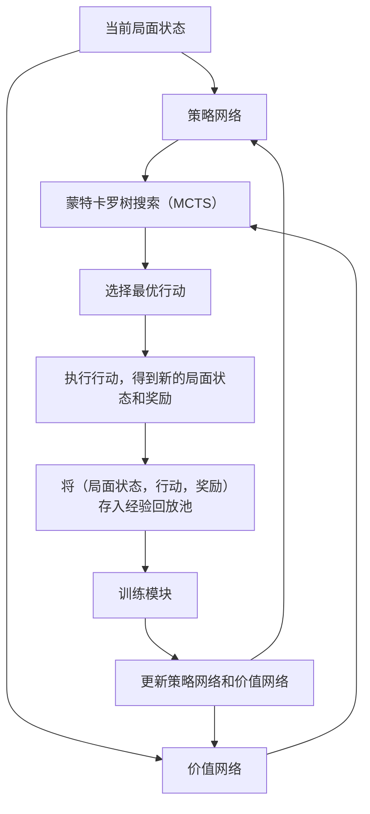

# 自我对弈:AI持续进化的有效途径

> 关键词：自我对弈、AI进化、强化学习、策略网络、价值网络
> 摘要：本文深入探讨了自我对弈作为AI持续进化的有效途径。详细介绍了自我对弈的背景知识，包括其目的、预期读者、文档结构和相关术语。阐述了自我对弈的核心概念、算法原理、数学模型，通过Python代码进行了原理展示。给出了项目实战案例，涵盖开发环境搭建、代码实现与解读。分析了自我对弈在多个领域的实际应用场景，推荐了相关的学习资源、开发工具和论文著作。最后总结了自我对弈的未来发展趋势与挑战，并提供了常见问题解答和扩展阅读参考资料。

## 1. 背景介绍 
### 1.1 目的和范围
在人工智能的发展历程中，如何让AI实现持续进化一直是研究者们关注的焦点。自我对弈作为一种独特的训练方法，为AI的持续进化提供了一条有效的途径。本文的目的在于全面深入地介绍自我对弈的原理、实现方法、应用场景以及未来发展趋势，帮助读者理解自我对弈在AI进化中的重要作用。范围涵盖了自我对弈的基本概念、核心算法、数学模型、项目实战、实际应用等多个方面。

### 1.2 预期读者
本文预期读者包括人工智能领域的研究者、开发者、学生以及对AI技术感兴趣的爱好者。对于有一定编程基础和机器学习知识的读者，能够深入理解自我对弈的技术细节；对于初学者，也可以通过本文初步了解自我对弈的基本概念和应用价值。

### 1.3 文档结构概述
本文将按照以下结构进行阐述：首先介绍自我对弈的背景知识，包括目的、预期读者和文档结构等；接着详细讲解自我对弈的核心概念和相关联系，通过文本示意图和Mermaid流程图进行直观展示；然后阐述核心算法原理和具体操作步骤，并使用Python源代码进行详细说明；再介绍自我对弈的数学模型和公式，通过举例进行详细讲解；之后给出项目实战案例，包括开发环境搭建、源代码实现和代码解读；分析自我对弈的实际应用场景；推荐相关的工具和资源；最后总结自我对弈的未来发展趋势与挑战，提供常见问题解答和扩展阅读参考资料。

### 1.4 术语表
#### 1.4.1 核心术语定义
- **自我对弈**：指AI系统自己与自己进行对抗性的博弈，通过不断地模拟对局来学习和优化自身的策略。
- **强化学习**：一种机器学习方法，智能体通过与环境进行交互，根据环境反馈的奖励信号来学习最优策略。
- **策略网络**：在自我对弈中，用于生成下一步行动策略的神经网络模型。
- **价值网络**：用于评估当前局面优劣的神经网络模型。

#### 1.4.2 相关概念解释
- **蒙特卡罗树搜索（MCTS）**：一种在博弈树中进行搜索的算法，通过模拟大量的随机走法来评估每个节点的价值，从而选择最优的行动。
- **经验回放**：在强化学习中，将智能体与环境交互的经验存储在经验池中，然后随机从中采样进行训练，以提高训练的效率和稳定性。

#### 1.4.3 缩略词列表
- **MCTS**：蒙特卡罗树搜索（Monte Carlo Tree Search）
- **RL**：强化学习（Reinforcement Learning）
- **DNN**：深度神经网络（Deep Neural Network）

## 2. 核心概念与联系 
自我对弈的核心思想是让AI在没有外部对手的情况下，通过自己与自己进行博弈来不断提高自身的能力。其基本原理是利用强化学习的方法，让AI在每一局对弈中根据环境反馈的奖励信号来调整自己的策略。

### 核心概念原理
在自我对弈中，通常会使用两个神经网络：策略网络和价值网络。策略网络用于生成下一步的行动策略，它根据当前的局面状态输出每个可能行动的概率分布。价值网络则用于评估当前局面的优劣，它输出一个标量值，表示当前局面对于某一方的价值。

在对弈过程中，AI通过蒙特卡罗树搜索（MCTS）算法来选择下一步的行动。MCTS算法会在博弈树中进行搜索，通过模拟大量的随机走法来评估每个节点的价值。具体来说，MCTS算法包括四个步骤：选择、扩展、模拟和回溯。在选择步骤中，算法会根据一定的策略选择一个未被完全扩展的节点；在扩展步骤中，算法会在该节点下生成新的子节点；在模拟步骤中，算法会从该节点开始进行随机走法，直到对局结束；在回溯步骤中，算法会根据模拟的结果更新该节点及其祖先节点的价值。

### 架构的文本示意图
```plaintext
自我对弈系统架构
|-- 策略网络
|   |-- 输入：当前局面状态
|   |-- 输出：每个可能行动的概率分布
|-- 价值网络
|   |-- 输入：当前局面状态
|   |-- 输出：当前局面的价值评估
|-- 蒙特卡罗树搜索（MCTS）
|   |-- 输入：当前局面状态、策略网络、价值网络
|   |-- 输出：最优行动
|-- 经验回放池
|   |-- 存储：对弈经验（局面状态、行动、奖励）
|-- 训练模块
|   |-- 输入：经验回放池中的数据
|   |-- 输出：更新后的策略网络和价值网络
```

### Mermaid流程图


## 3. 核心算法原理 & 具体操作步骤 
### 核心算法原理
自我对弈的核心算法基于强化学习，主要包括策略梯度算法和价值函数逼近。策略梯度算法用于优化策略网络，通过最大化累积奖励来调整策略网络的参数。价值函数逼近用于训练价值网络，通过最小化预测价值与实际价值之间的误差来调整价值网络的参数。

### 具体操作步骤
以下是自我对弈的具体操作步骤：
1. **初始化策略网络和价值网络**：随机初始化策略网络和价值网络的参数。
2. **进行自我对弈**：使用当前的策略网络和价值网络，通过蒙特卡罗树搜索（MCTS）算法进行自我对弈，记录每一步的局面状态、行动和最终的奖励。
3. **存储对弈经验**：将对弈过程中的经验（局面状态、行动、奖励）存储到经验回放池中。
4. **训练网络**：从经验回放池中随机采样一批数据，使用策略梯度算法和价值函数逼近方法训练策略网络和价值网络。
5. **重复步骤2 - 4**：不断重复上述步骤，直到策略网络和价值网络收敛。

### Python源代码详细阐述
以下是一个简单的自我对弈示例代码，使用Python和PyTorch实现：
```python
import torch
import torch.nn as nn
import torch.optim as optim
import numpy as np

# 定义策略网络
class PolicyNetwork(nn.Module):
    def __init__(self, input_size, output_size):
        super(PolicyNetwork, self).__init__()
        self.fc1 = nn.Linear(input_size, 64)
        self.fc2 = nn.Linear(64, output_size)

    def forward(self, x):
        x = torch.relu(self.fc1(x))
        x = torch.softmax(self.fc2(x), dim=-1)
        return x

# 定义价值网络
class ValueNetwork(nn.Module):
    def __init__(self, input_size):
        super(ValueNetwork, self).__init__()
        self.fc1 = nn.Linear(input_size, 64)
        self.fc2 = nn.Linear(64, 1)

    def forward(self, x):
        x = torch.relu(self.fc1(x))
        x = self.fc2(x)
        return x

# 蒙特卡罗树搜索（简化版）
def mcts(state, policy_network, value_network, num_simulations=100):
    # 简单实现，仅为示例
    action_probs = policy_network(torch.tensor(state, dtype=torch.float32)).detach().numpy()
    action = np.random.choice(len(action_probs), p=action_probs)
    return action

# 自我对弈
def self_play(policy_network, value_network, num_games=10):
    experience_buffer = []
    for _ in range(num_games):
        state = np.random.rand(10)  # 随机初始化状态
        done = False
        while not done:
            action = mcts(state, policy_network, value_network)
            # 简单模拟环境反馈
            next_state = np.random.rand(10)
            reward = np.random.rand()
            done = np.random.choice([True, False], p=[0.1, 0.9])
            experience_buffer.append((state, action, reward))
            state = next_state
    return experience_buffer

# 训练网络
def train(policy_network, value_network, experience_buffer):
    policy_optimizer = optim.Adam(policy_network.parameters(), lr=0.001)
    value_optimizer = optim.Adam(value_network.parameters(), lr=0.001)
    for state, action, reward in experience_buffer:
        state = torch.tensor(state, dtype=torch.float32)
        action = torch.tensor(action, dtype=torch.long)
        reward = torch.tensor(reward, dtype=torch.float32)

        # 训练策略网络
        policy_optimizer.zero_grad()
        action_probs = policy_network(state)
        log_prob = torch.log(action_probs[action])
        loss_policy = -log_prob * reward
        loss_policy.backward()
        policy_optimizer.step()

        # 训练价值网络
        value_optimizer.zero_grad()
        value = value_network(state)
        loss_value = nn.MSELoss()(value, reward)
        loss_value.backward()
        value_optimizer.step()

# 主函数
def main():
    input_size = 10
    output_size = 5
    policy_network = PolicyNetwork(input_size, output_size)
    value_network = ValueNetwork(input_size)

    for _ in range(10):
        experience_buffer = self_play(policy_network, value_network)
        train(policy_network, value_network, experience_buffer)

if __name__ == "__main__":
    main()
```
### 代码解释
- `PolicyNetwork`：定义了策略网络，输入为当前局面状态，输出为每个可能行动的概率分布。
- `ValueNetwork`：定义了价值网络，输入为当前局面状态，输出为当前局面的价值评估。
- `mcts`：简化版的蒙特卡罗树搜索算法，根据策略网络的输出选择行动。
- `self_play`：进行自我对弈，记录每一步的局面状态、行动和奖励。
- `train`：训练策略网络和价值网络，使用策略梯度算法和均方误差损失函数。
- `main`：主函数，初始化网络，进行多轮自我对弈和训练。

## 4. 数学模型和公式 & 详细讲解 & 举例说明 
### 策略梯度算法
策略梯度算法的目标是最大化累积奖励的期望。设策略网络的参数为 $\theta$，状态为 $s$，行动为 $a$，奖励为 $r$，则策略梯度算法的目标函数为：
$$J(\theta) = \mathbb{E}_{\tau \sim \pi_{\theta}} \left[ \sum_{t=0}^{T} r(s_t, a_t) \right]$$
其中，$\tau = (s_0, a_0, s_1, a_1, \cdots, s_T, a_T)$ 表示一个轨迹，$\pi_{\theta}$ 表示参数为 $\theta$ 的策略。

根据策略梯度定理，目标函数的梯度可以表示为：
$$\nabla_{\theta} J(\theta) = \mathbb{E}_{\tau \sim \pi_{\theta}} \left[ \sum_{t=0}^{T} \nabla_{\theta} \log \pi_{\theta}(a_t | s_t) \sum_{k=t}^{T} r(s_k, a_k) \right]$$
在实际训练中，通常使用基于样本的估计来近似计算梯度：
$$\nabla_{\theta} J(\theta) \approx \frac{1}{N} \sum_{i=1}^{N} \sum_{t=0}^{T} \nabla_{\theta} \log \pi_{\theta}(a_{i,t} | s_{i,t}) \sum_{k=t}^{T} r(s_{i,k}, a_{i,k})$$
其中，$N$ 表示样本数量。

### 价值函数逼近
价值函数逼近的目标是最小化预测价值与实际价值之间的误差。设价值网络的参数为 $\phi$，状态为 $s$，实际价值为 $V(s)$，预测价值为 $\hat{V}_{\phi}(s)$，则价值函数逼近的损失函数为：
$$L(\phi) = \frac{1}{N} \sum_{i=1}^{N} \left( V(s_i) - \hat{V}_{\phi}(s_i) \right)^2$$
在实际训练中，通常使用均方误差损失函数来优化价值网络的参数。

### 举例说明
假设我们有一个简单的棋类游戏，状态 $s$ 表示棋盘上的棋子布局，行动 $a$ 表示下一步的落子位置，奖励 $r$ 表示这一步行动的得分。策略网络 $\pi_{\theta}(a | s)$ 输出每个落子位置的概率，价值网络 $\hat{V}_{\phi}(s)$ 输出当前局面的价值评估。

在自我对弈过程中，我们记录每一步的状态 $s_t$、行动 $a_t$ 和奖励 $r_t$。在训练时，对于策略网络，我们根据策略梯度算法计算梯度并更新参数 $\theta$；对于价值网络，我们根据均方误差损失函数计算损失并更新参数 $\phi$。通过不断地自我对弈和训练，策略网络和价值网络会逐渐学习到最优的策略和价值评估。

## 5. 项目实战：代码实际案例和详细解释说明 
### 5.1  开发环境搭建
#### 操作系统
建议使用Linux系统，如Ubuntu 18.04或更高版本，也可以使用Windows 10或macOS。

#### 编程语言
使用Python 3.7或更高版本。

#### 深度学习框架
使用PyTorch 1.7或更高版本。可以使用以下命令安装PyTorch：
```sh
pip install torch torchvision
```

#### 其他依赖库
安装NumPy、Matplotlib等常用库：
```sh
pip install numpy matplotlib
```

### 5.2  源代码详细实现和代码解读
以下是一个更完整的自我对弈项目示例，以井字棋游戏为例：
```python
import torch
import torch.nn as nn
import torch.optim as optim
import numpy as np
import random

# 定义井字棋游戏环境
class TicTacToe:
    def __init__(self):
        self.board = np.zeros((3, 3), dtype=int)
        self.current_player = 1

    def is_game_over(self):
        # 检查行
        for i in range(3):
            if np.all(self.board[i, :] == 1) or np.all(self.board[i, :] == 2):
                return True
        # 检查列
        for j in range(3):
            if np.all(self.board[:, j] == 1) or np.all(self.board[:, j] == 2):
                return True
        # 检查对角线
        if np.all(np.diag(self.board) == 1) or np.all(np.diag(self.board) == 2):
            return True
        if np.all(np.diag(np.fliplr(self.board)) == 1) or np.all(np.diag(np.fliplr(self.board)) == 2):
            return True
        # 检查是否平局
        if np.all(self.board!= 0):
            return True
        return False

    def get_winner(self):
        # 检查行
        for i in range(3):
            if np.all(self.board[i, :] == 1):
                return 1
            if np.all(self.board[i, :] == 2):
                return 2
        # 检查列
        for j in range(3):
            if np.all(self.board[:, j] == 1):
                return 1
            if np.all(self.board[:, j] == 2):
                return 2
        # 检查对角线
        if np.all(np.diag(self.board) == 1):
            return 1
        if np.all(np.diag(self.board) == 2):
            return 2
        if np.all(np.diag(np.fliplr(self.board)) == 1):
            return 1
        if np.all(np.diag(np.fliplr(self.board)) == 2):
            return 2
        return 0

    def get_legal_moves(self):
        return np.argwhere(self.board == 0)

    def make_move(self, move):
        i, j = move
        if self.board[i, j] == 0:
            self.board[i, j] = self.current_player
            self.current_player = 3 - self.current_player
            return True
        return False

    def get_state(self):
        return self.board.flatten()

# 定义策略网络
class PolicyNetwork(nn.Module):
    def __init__(self):
        super(PolicyNetwork, self).__init__()
        self.fc1 = nn.Linear(9, 64)
        self.fc2 = nn.Linear(64, 9)

    def forward(self, x):
        x = torch.relu(self.fc1(x))
        x = torch.softmax(self.fc2(x), dim=-1)
        return x

# 定义价值网络
class ValueNetwork(nn.Module):
    def __init__(self):
        super(ValueNetwork, self).__init__()
        self.fc1 = nn.Linear(9, 64)
        self.fc2 = nn.Linear(64, 1)

    def forward(self, x):
        x = torch.relu(self.fc1(x))
        x = self.fc2(x)
        return x

# 蒙特卡罗树搜索
class MCTS:
    def __init__(self, policy_network, value_network, num_simulations=100):
        self.policy_network = policy_network
        self.value_network = value_network
        self.num_simulations = num_simulations

    def search(self, state, env):
        root = Node(state, None, 0)
        for _ in range(self.num_simulations):
            node = root
            path = [node]
            while node.is_fully_expanded() and not node.is_terminal(env):
                node = node.select_child()
                path.append(node)
            if not node.is_terminal(env):
                node.expand(env, self.policy_network)
                node = random.choice(node.children)
                path.append(node)
            value = self.evaluate_rollout(node.state, env)
            for n in path:
                n.update(value)
        return root.get_best_child().action

    def evaluate_rollout(self, state, env):
        temp_env = TicTacToe()
        temp_env.board = state.reshape((3, 3))
        while not temp_env.is_game_over():
            legal_moves = temp_env.get_legal_moves()
            move = random.choice(legal_moves)
            temp_env.make_move(move)
        winner = temp_env.get_winner()
        if winner == 1:
            return 1
        elif winner == 2:
            return -1
        else:
            return 0

class Node:
    def __init__(self, state, action, parent):
        self.state = state
        self.action = action
        self.parent = parent
        self.children = []
        self.visit_count = 0
        self.total_value = 0
        self.prior_prob = 0

    def is_fully_expanded(self):
        return len(self.children) > 0

    def is_terminal(self, env):
        temp_env = TicTacToe()
        temp_env.board = self.state.reshape((3, 3))
        return temp_env.is_game_over()

    def select_child(self):
        ucb_scores = []
        for child in self.children:
            ucb_score = child.get_ucb_score()
            ucb_scores.append(ucb_score)
        index = np.argmax(ucb_scores)
        return self.children[index]

    def expand(self, env, policy_network):
        temp_env = TicTacToe()
        temp_env.board = self.state.reshape((3, 3))
        legal_moves = temp_env.get_legal_moves()
        state_tensor = torch.tensor(self.state, dtype=torch.float32)
        action_probs = policy_network(state_tensor).detach().numpy()
        for move in legal_moves:
            i, j = move
            action_index = i * 3 + j
            child_state = self.state.copy()
            child_state[action_index] = 1 if temp_env.current_player == 1 else 2
            child = Node(child_state, move, self)
            child.prior_prob = action_probs[action_index]
            self.children.append(child)

    def get_ucb_score(self):
        c_puct = 1.0
        if self.visit_count == 0:
            return float('inf')
        return self.total_value / self.visit_count + c_puct * self.prior_prob * np.sqrt(self.parent.visit_count) / (1 + self.visit_count)

    def update(self, value):
        self.visit_count += 1
        self.total_value += value

    def get_best_child(self):
        visit_counts = [child.visit_count for child in self.children]
        index = np.argmax(visit_counts)
        return self.children[index]

# 自我对弈
def self_play(policy_network, value_network, num_games=10):
    experience_buffer = []
    for _ in range(num_games):
        env = TicTacToe()
        mcts = MCTS(policy_network, value_network)
        states = []
        actions = []
        while not env.is_game_over():
            state = env.get_state()
            action = mcts.search(state, env)
            states.append(state)
            actions.append(action)
            env.make_move(action)
        winner = env.get_winner()
        if winner == 1:
            rewards = [1] * len(states)
        elif winner == 2:
            rewards = [-1] * len(states)
        else:
            rewards = [0] * len(states)
        for state, action, reward in zip(states, actions, rewards):
            experience_buffer.append((state, action, reward))
    return experience_buffer

# 训练网络
def train(policy_network, value_network, experience_buffer):
    policy_optimizer = optim.Adam(policy_network.parameters(), lr=0.001)
    value_optimizer = optim.Adam(value_network.parameters(), lr=0.001)
    for state, action, reward in experience_buffer:
        state = torch.tensor(state, dtype=torch.float32)
        action_index = action[0] * 3 + action[1]
        action_index = torch.tensor(action_index, dtype=torch.long)
        reward = torch.tensor(reward, dtype=torch.float32)

        # 训练策略网络
        policy_optimizer.zero_grad()
        action_probs = policy_network(state)
        log_prob = torch.log(action_probs[action_index])
        loss_policy = -log_prob * reward
        loss_policy.backward()
        policy_optimizer.step()

        # 训练价值网络
        value_optimizer.zero_grad()
        value = value_network(state)
        loss_value = nn.MSELoss()(value, reward)
        loss_value.backward()
        value_optimizer.step()

# 主函数
def main():
    policy_network = PolicyNetwork()
    value_network = ValueNetwork()

    for _ in range(100):
        experience_buffer = self_play(policy_network, value_network)
        train(policy_network, value_network, experience_buffer)

if __name__ == "__main__":
    main()
```
### 代码解读
1. **TicTacToe类**：定义了井字棋游戏的环境，包括游戏状态的初始化、判断游戏是否结束、获取合法行动、执行行动等方法。
2. **PolicyNetwork类**：定义了策略网络，输入为当前棋盘状态，输出为每个落子位置的概率分布。
3. **ValueNetwork类**：定义了价值网络，输入为当前棋盘状态，输出为当前局面的价值评估。
4. **MCTS类**：实现了蒙特卡罗树搜索算法，通过模拟大量的随机走法来选择最优行动。
5. **Node类**：表示蒙特卡罗树中的一个节点，包含节点的状态、行动、父节点、子节点、访问次数、总价值等信息。
6. **self_play函数**：进行自我对弈，记录每一步的局面状态、行动和最终的奖励。
7. **train函数**：训练策略网络和价值网络，使用策略梯度算法和均方误差损失函数。
8. **main函数**：主函数，初始化网络，进行多轮自我对弈和训练。

### 5.3  代码解读与分析
- **环境类**：`TicTacToe` 类封装了井字棋游戏的逻辑，使得代码结构更加清晰，便于维护和扩展。
- **网络模型**：`PolicyNetwork` 和 `ValueNetwork` 分别负责生成行动策略和评估局面价值，使用简单的全连接神经网络实现。
- **蒙特卡罗树搜索**：`MCTS` 类实现了蒙特卡罗树搜索算法，通过模拟大量的随机走法来选择最优行动，提高了决策的准确性。
- **自我对弈和训练**：`self_play` 函数进行自我对弈，收集经验数据；`train` 函数根据经验数据训练策略网络和价值网络，不断优化模型的性能。

## 6. 实际应用场景 
### 棋类游戏
自我对弈在棋类游戏中有着广泛的应用，如围棋、国际象棋、中国象棋等。以围棋为例，AlphaGo通过自我对弈的方式进行训练，在与人类顶尖棋手的对决中取得了优异的成绩。自我对弈可以让AI在没有人类对手的情况下，通过不断地模拟对局来学习和优化自身的策略，从而达到很高的水平。

### 电子竞技
在电子竞技领域，自我对弈也可以用于训练AI玩家。例如，在《星际争霸》《Dota 2》等游戏中，通过让AI进行自我对弈，可以提高AI的决策能力和操作水平，使其在比赛中表现更加出色。

### 机器人控制
在机器人控制领域，自我对弈可以用于训练机器人的运动策略和决策能力。例如，在机器人足球比赛中，通过让机器人进行自我对弈，可以学习到如何更好地与队友协作、如何选择最优的行动策略等。

### 资源分配和调度
在资源分配和调度问题中，自我对弈可以用于寻找最优的分配方案。例如，在云计算中，通过让不同的调度策略进行自我对弈，可以找到最适合当前环境的调度方案，提高资源的利用率和系统的性能。

## 7. 工具和资源推荐
### 7.1 学习资源推荐
#### 7.1.1 书籍推荐
- 《强化学习：原理与Python实现》：详细介绍了强化学习的基本原理和算法，并使用Python代码进行了实现，对于理解自我对弈的核心算法有很大的帮助。
- 《深度学习》：由Ian Goodfellow、Yoshua Bengio和Aaron Courville合著，是深度学习领域的经典教材，涵盖了神经网络、深度学习框架等方面的知识。
- 《人工智能：一种现代的方法》：全面介绍了人工智能的各个领域，包括搜索算法、机器学习、自然语言处理等，对于了解人工智能的整体框架和发展趋势有很大的帮助。

#### 7.1.2 在线课程
- Coursera上的“强化学习专项课程”：由DeepMind的研究员David Silver教授授课，详细介绍了强化学习的理论和实践，包括策略梯度算法、价值函数逼近等内容。
- edX上的“深度学习微硕士项目”：由加州大学伯克利分校的教授授课，涵盖了深度学习的各个方面，包括神经网络、卷积神经网络、循环神经网络等。
- 哔哩哔哩上的“莫烦Python教程”：提供了丰富的Python和机器学习教程，包括强化学习的入门教程，适合初学者学习。

#### 7.1.3 技术博客和网站
- OpenAI博客：OpenAI是人工智能领域的领先研究机构，其博客上发布了许多关于强化学习、自我对弈等方面的最新研究成果和技术文章。
- Medium上的AI相关博客：Medium上有许多人工智能领域的专家和爱好者分享自己的研究成果和经验，通过阅读这些博客可以了解到最新的技术动态和发展趋势。
- 知乎上的人工智能话题：知乎上有许多关于人工智能的讨论和分享，通过关注相关话题可以与其他爱好者交流和学习。

### 7.2 开发工具框架推荐
#### 7.2.1 IDE和编辑器
- PyCharm：是一款专门为Python开发设计的集成开发环境，提供了丰富的代码编辑、调试、测试等功能，适合开发大型的Python项目。
- Jupyter Notebook：是一种交互式的开发环境，支持Python、R等多种编程语言，可以方便地进行代码编写、数据分析和可视化等操作，适合进行实验和学习。
- Visual Studio Code：是一款轻量级的代码编辑器，支持多种编程语言和插件扩展，具有丰富的代码编辑和调试功能，适合开发小型的Python项目。

#### 7.2.2 调试和性能分析工具
- PyTorch Profiler：是PyTorch提供的性能分析工具，可以帮助开发者分析模型的训练和推理性能，找出性能瓶颈并进行优化。
- TensorBoard：是TensorFlow提供的可视化工具，可以帮助开发者可视化模型的训练过程、损失函数曲线、模型结构等信息，便于进行调试和分析。
- cProfile：是Python标准库中的性能分析工具，可以帮助开发者分析Python代码的性能，找出耗时较长的函数和代码段。

#### 7.2.3 相关框架和库
- PyTorch：是一个开源的深度学习框架，提供了丰富的神经网络模型和优化算法，支持GPU加速，适合进行深度学习模型的开发和训练。
- TensorFlow：是另一个开源的深度学习框架，具有广泛的应用和丰富的工具生态系统，适合进行大规模的深度学习项目开发。
- Gym：是OpenAI开发的一个开源的强化学习环境库，提供了各种不同类型的环境，如棋类游戏、机器人控制等，方便开发者进行强化学习算法的实验和测试。

### 7.3 相关论文著作推荐
#### 7.3.1 经典论文
- “Mastering the Game of Go with Deep Neural Networks and Tree Search”：介绍了AlphaGo的实现原理，包括深度神经网络和蒙特卡罗树搜索的结合，是自我对弈在棋类游戏中应用的经典论文。
- “Proximal Policy Optimization Algorithms”：提出了近端策略优化算法（PPO），是一种高效的策略梯度算法，在强化学习领域有着广泛的应用。
- “Deep Q-Networks”：提出了深度Q网络（DQN）算法，将深度学习和Q学习相结合，成功应用于Atari游戏等领域，开创了深度强化学习的先河。

#### 7.3.2 最新研究成果
- “Mastering Atari, Go, Chess and Shogi by Planning with a Learned Model”：介绍了MuZero算法，通过学习环境模型来进行规划，在多个领域取得了优异的成绩。
- “OpenAI Five”：OpenAI团队在《Dota 2》游戏中使用自我对弈的方法训练出了强大的AI玩家，展示了自我对弈在电子竞技领域的潜力。

#### 7.3.3 应用案例分析
- “AlphaStar: Mastering the Real-Time Strategy Game StarCraft II”：介绍了AlphaStar在《星际争霸II》游戏中的应用，通过自我对弈和多智能体学习的方法，实现了与人类顶尖玩家的对抗。
- “DeepMind's AI Beats World Champions at Poker”：介绍了DeepMind团队在扑克游戏中使用自我对弈的方法训练出的AI玩家，在复杂的不完全信息博弈中取得了优异的成绩。

## 8. 总结：未来发展趋势与挑战
### 未来发展趋势
- **多智能体自我对弈**：未来的研究可能会更加关注多智能体之间的自我对弈，通过多个智能体之间的协作和竞争，提高智能体的学习能力和适应能力。例如，在机器人团队协作、自动驾驶等领域，多智能体自我对弈可以帮助智能体学习到更好的协作策略。
- **结合其他学习方法**：自我对弈可以与其他学习方法相结合，如监督学习、无监督学习等，以提高学习的效率和效果。例如，在图像识别领域，可以先使用监督学习进行预训练，然后使用自我对弈进行进一步的优化。
- **应用于更复杂的环境**：随着技术的不断发展，自我对弈将应用于更加复杂的环境中，如医疗诊断、金融投资等。在这些领域，自我对弈可以帮助智能体学习到最优的决策策略，提高决策的准确性和效率。

### 挑战
- **计算资源需求**：自我对弈通常需要大量的计算资源，尤其是在处理复杂的环境和大规模的模型时。如何降低计算资源的需求，提高训练的效率，是一个亟待解决的问题。
- **泛化能力**：在某些情况下，自我对弈训练出的模型可能在训练环境中表现良好，但在实际应用中却无法泛化到新的环境中。如何提高模型的泛化能力，是自我对弈面临的另一个挑战。
- **伦理和安全问题**：随着AI技术的不断发展，伦理和安全问题也越来越受到关注。在自我对弈的过程中，如何确保AI的行为符合伦理和安全要求，避免出现不良后果，是一个需要认真思考的问题。

## 9. 附录：常见问题与解答
### 问题1：自我对弈和传统的强化学习有什么区别？
自我对弈是强化学习的一种特殊形式，它通过让AI自己与自己进行博弈来学习和优化策略。与传统的强化学习相比，自我对弈不需要外部的对手，可以在没有人类干预的情况下进行训练，并且可以通过不断地模拟对局来探索更多的策略空间，从而提高学习的效率和效果。

### 问题2：自我对弈一定能让AI持续进化吗？
自我对弈可以为AI的持续进化提供一种有效的途径，但并不能保证AI一定能持续进化。在实际应用中，还需要考虑很多因素，如模型的结构、训练的参数、环境的复杂度等。如果这些因素设置不当，可能会导致AI陷入局部最优解，无法实现持续进化。

### 问题3：自我对弈在实际应用中有哪些限制？
自我对弈在实际应用中存在一些限制，主要包括计算资源需求大、泛化能力有限、伦理和安全问题等。此外，自我对弈通常适用于具有明确规则和目标的对抗性环境，对于一些复杂的、不确定的环境，可能需要结合其他方法进行处理。

### 问题4：如何评估自我对弈训练出的模型的性能？
可以使用多种方法来评估自我对弈训练出的模型的性能，如与人类玩家进行对战、与其他模型进行对战、在测试集上进行评估等。此外，还可以使用一些指标来评估模型的性能，如胜率、平均奖励、策略的稳定性等。

## 10. 扩展阅读 & 参考资料
### 扩展阅读
- 《强化学习精要：核心算法与TensorFlow实现》：进一步深入介绍了强化学习的核心算法和实现方法，适合对强化学习有一定基础的读者阅读。
- 《人工智能实战：基于Python和深度学习》：通过实际案例介绍了人工智能的应用和开发，包括图像识别、自然语言处理、强化学习等方面，有助于读者将理论知识应用到实际项目中。

### 参考资料
- Silver, D., Huang, A., Maddison, C. J., et al. (2016). Mastering the game of Go with deep neural networks and tree search. Nature, 529(7587), 484-489.
- Schulman, J., Wolski, F., Dhariwal, P., et al. (2017). Proximal policy optimization algorithms. arXiv preprint arXiv:1707.06347.
- Mnih, V., Kavukcuoglu, K., Silver, D., et al. (2015). Human-level control through deep reinforcement learning. Nature, 518(7540), 529-533.

作者：AI天才研究院/AI Genius Institute & 禅与计算机程序设计艺术 /Zen And The Art of Computer Programming