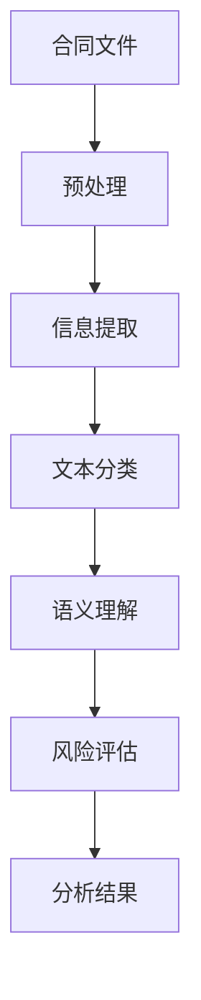

# 自然语言处理在合同文件分析中的应用

> 关键词：自然语言处理、合同文件分析、信息提取、文本分类、语义理解

> 摘要：本文深入探讨了自然语言处理（NLP）在合同文件分析领域的应用。首先介绍了相关背景，包括研究目的、预期读者等。接着阐述了自然语言处理和合同文件分析的核心概念及联系，详细讲解了核心算法原理与操作步骤，并给出了数学模型和公式。通过项目实战展示了代码的实际案例和详细解释。还分析了自然语言处理在合同文件分析中的实际应用场景，推荐了学习资源、开发工具框架和相关论文著作。最后总结了未来发展趋势与挑战，提供了常见问题解答和扩展阅读参考资料。

## 1. 背景介绍 
### 1.1 目的和范围
合同文件包含了大量的法律、商务等重要信息，传统的人工分析合同文件效率低下且容易出错。自然语言处理技术的出现为合同文件分析带来了新的解决方案。本文的目的是探讨如何利用自然语言处理技术对合同文件进行高效、准确的分析，包括信息提取、条款分类、风险评估等。研究范围涵盖了自然语言处理的主要技术在合同文件分析中的应用，以及相关的算法原理、代码实现和实际案例分析。

### 1.2 预期读者
本文预期读者包括自然语言处理领域的研究人员、软件开发者、法律专业人士以及对合同文件分析感兴趣的人士。研究人员可以从中了解自然语言处理在合同文件分析中的最新应用和研究方向；软件开发者可以获取相关的算法原理和代码实现方法；法律专业人士可以借助自然语言处理技术提高合同文件分析的效率和准确性；对合同文件分析感兴趣的人士可以全面了解该领域的技术应用和发展趋势。

### 1.3 文档结构概述
本文首先介绍自然语言处理和合同文件分析的背景知识，包括目的、预期读者和文档结构。接着阐述核心概念与联系，展示核心概念的原理和架构示意图及流程图。然后详细讲解核心算法原理和具体操作步骤，并给出Python源代码。之后介绍数学模型和公式，并举例说明。通过项目实战展示代码的实际案例和详细解释。分析自然语言处理在合同文件分析中的实际应用场景。推荐学习资源、开发工具框架和相关论文著作。最后总结未来发展趋势与挑战，提供常见问题解答和扩展阅读参考资料。

### 1.4 术语表
#### 1.4.1 核心术语定义
- **自然语言处理（Natural Language Processing，NLP）**：是一门研究如何让计算机理解、处理和生成人类自然语言的学科，涉及语言学、计算机科学、数学等多个领域。
- **合同文件分析**：对合同文件中的信息进行提取、分类、理解和评估等操作，以获取合同的关键信息、条款含义和潜在风险等。
- **信息提取**：从文本中识别和提取特定类型的信息，如合同中的当事人、金额、日期等。
- **文本分类**：将文本按照一定的规则或标准进行分类，例如将合同条款分为付款条款、违约责任条款等。
- **语义理解**：理解文本的语义含义，包括词语、句子和篇章的意义，以及它们之间的逻辑关系。

#### 1.4.2 相关概念解释
- **词法分析**：对文本进行分词、词性标注等操作，将文本拆分成一个个词语，并确定每个词语的词性。
- **句法分析**：分析句子的语法结构，确定词语之间的句法关系，如主谓宾、定状补等。
- **语义分析**：理解文本的语义信息，包括词语的语义、句子的语义和篇章的语义。
- **机器学习**：是一门多领域交叉学科，涉及概率论、统计学、逼近论、凸分析、算法复杂度理论等多门学科。它专门研究计算机怎样模拟或实现人类的学习行为，以获取新的知识或技能，重新组织已有的知识结构使之不断改善自身的性能。
- **深度学习**：是机器学习的一个分支领域，它是一种基于对数据进行表征学习的方法。深度学习通过构建具有很多层的神经网络模型，自动从数据中学习特征和模式。

#### 1.4.3 缩略词列表
- **NLP**：Natural Language Processing，自然语言处理
- **NER**：Named Entity Recognition，命名实体识别
- **TF-IDF**：Term Frequency-Inverse Document Frequency，词频 - 逆文档频率
- **CNN**：Convolutional Neural Network，卷积神经网络
- **RNN**：Recurrent Neural Network，循环神经网络
- **LSTM**：Long Short-Term Memory，长短期记忆网络

## 2. 核心概念与联系 

### 核心概念原理
#### 自然语言处理
自然语言处理的核心是让计算机能够理解和处理人类的自然语言。它主要包括以下几个方面的技术：
- **词法分析**：将文本拆分成词语，并进行词性标注。例如，对于句子“我喜欢自然语言处理”，词法分析可以将其拆分成“我”“喜欢”“自然语言处理”，并标注“我”为代词，“喜欢”为动词，“自然语言处理”为名词。
- **句法分析**：分析句子的语法结构。例如，对于句子“小明吃苹果”，句法分析可以确定“小明”是主语，“吃”是谓语，“苹果”是宾语。
- **语义分析**：理解文本的语义含义。例如，对于句子“他是一个好人”，语义分析可以理解“他”指代的对象，以及“好人”的语义概念。
- **信息提取**：从文本中识别和提取特定类型的信息。例如，从合同文件中提取当事人、金额、日期等信息。
- **文本分类**：将文本按照一定的规则或标准进行分类。例如，将新闻文章分为政治、经济、体育等类别，将合同条款分为付款条款、违约责任条款等。

#### 合同文件分析
合同文件分析的目的是从合同文件中获取关键信息、条款含义和潜在风险等。它主要包括以下几个方面的内容：
- **信息提取**：从合同文件中提取当事人、合同金额、签订日期、履行期限等关键信息。
- **条款分类**：将合同条款分为不同的类别，如付款条款、违约责任条款、保密条款等。
- **风险评估**：评估合同中存在的潜在风险，如违约风险、法律风险等。
- **语义理解**：理解合同条款的语义含义，确保合同双方对条款的理解一致。

### 架构的文本示意图
```plaintext
自然语言处理在合同文件分析中的应用架构

+----------------------+
| 合同文件             |
+----------------------+
|  |
|  v
|  预处理（分词、词性标注等）
|  |
|  v
|  信息提取（命名实体识别等）
|  |
|  v
|  文本分类（条款分类等）
|  |
|  v
|  语义理解（关系抽取等）
|  |
|  v
|  风险评估
|  |
|  v
+----------------------+
| 分析结果             |
+----------------------+
```

### Mermaid 流程图


## 3. 核心算法原理 & 具体操作步骤 

### 信息提取算法 - 命名实体识别（NER）
#### 算法原理
命名实体识别是信息提取的重要任务之一，其目的是从文本中识别出特定类型的命名实体，如人名、地名、组织机构名、日期、金额等。常见的命名实体识别算法有基于规则的方法、基于机器学习的方法和基于深度学习的方法。这里我们介绍基于深度学习的双向长短期记忆网络（BiLSTM）和条件随机场（CRF）的命名实体识别算法。

BiLSTM可以捕捉文本的上下文信息，而CRF可以考虑标签之间的转移概率，从而提高命名实体识别的准确性。具体来说，BiLSTM接收输入的词语序列，通过前向和后向的LSTM层学习词语的上下文表示，然后将这些表示输入到CRF层进行标签预测。

#### Python源代码实现
```python
import torch
import torch.nn as nn
import torch.optim as optim
from torch.utils.data import Dataset, DataLoader

# 定义数据集类
class NERDataset(Dataset):
    def __init__(self, texts, labels):
        self.texts = texts
        self.labels = labels

    def __len__(self):
        return len(self.texts)

    def __getitem__(self, idx):
        text = self.texts[idx]
        label = self.labels[idx]
        return text, label

# 定义BiLSTM-CRF模型
class BiLSTM_CRF(nn.Module):
    def __init__(self, vocab_size, tag_to_ix, embedding_dim, hidden_dim):
        super(BiLSTM_CRF, self).__init__()
        self.embedding_dim = embedding_dim
        self.hidden_dim = hidden_dim
        self.vocab_size = vocab_size
        self.tag_to_ix = tag_to_ix
        self.tagset_size = len(tag_to_ix)

        self.word_embeds = nn.Embedding(vocab_size, embedding_dim)
        self.lstm = nn.LSTM(embedding_dim, hidden_dim // 2,
                            num_layers=1, bidirectional=True)

        # 将LSTM的输出映射到标签空间
        self.hidden2tag = nn.Linear(hidden_dim, self.tagset_size)

        # CRF层的转移矩阵
        self.transitions = nn.Parameter(
            torch.randn(self.tagset_size, self.tagset_size))

        # 确保开始标签不会转移到其他标签，结束标签不会从其他标签转移过来
        self.transitions.data[tag_to_ix[START_TAG], :] = -10000
        self.transitions.data[:, tag_to_ix[STOP_TAG]] = -10000

    def _forward_alg(self, feats):
        # 前向算法计算所有可能的标签序列的分数
        init_alphas = torch.full((1, self.tagset_size), -10000.)
        # START_TAG的分数为0
        init_alphas[0][self.tag_to_ix[START_TAG]] = 0.

        forward_var = init_alphas

        for feat in feats:
            alphas_t = []
            for next_tag in range(self.tagset_size):
                emit_score = feat[next_tag].view(
                    1, -1).expand(1, self.tagset_size)
                trans_score = self.transitions[next_tag].view(1, -1)
                next_tag_var = forward_var + trans_score + emit_score
                alphas_t.append(log_sum_exp(next_tag_var).view(1))
            forward_var = torch.cat(alphas_t).view(1, -1)
        terminal_var = forward_var + self.transitions[self.tag_to_ix[STOP_TAG]]
        alpha = log_sum_exp(terminal_var)
        return alpha

    def _get_lstm_features(self, sentence):
        embeds = self.word_embeds(sentence).view(len(sentence), 1, -1)
        lstm_out, _ = self.lstm(embeds)
        lstm_out = lstm_out.view(len(sentence), self.hidden_dim)
        lstm_feats = self.hidden2tag(lstm_out)
        return lstm_feats

    def _score_sentence(self, feats, tags):
        # 计算给定标签序列的分数
        score = torch.zeros(1)
        tags = torch.cat([torch.tensor([self.tag_to_ix[START_TAG]], dtype=torch.long), tags])
        for i, feat in enumerate(feats):
            score = score + \
                    self.transitions[tags[i + 1], tags[i]] + feat[tags[i + 1]]
        score = score + self.transitions[self.tag_to_ix[STOP_TAG], tags[-1]]
        return score

    def _viterbi_decode(self, feats):
        # Viterbi算法解码最优标签序列
        backpointers = []

        init_vvars = torch.full((1, self.tagset_size), -10000.)
        init_vvars[0][self.tag_to_ix[START_TAG]] = 0

        forward_var = init_vvars
        for feat in feats:
            bptrs_t = []
            viterbivars_t = []

            for next_tag in range(self.tagset_size):
                next_tag_var = forward_var + self.transitions[next_tag]
                best_tag_id = argmax(next_tag_var)
                bptrs_t.append(best_tag_id)
                viterbivars_t.append(next_tag_var[0][best_tag_id].view(1))
            forward_var = (torch.cat(viterbivars_t) + feat).view(1, -1)
            backpointers.append(bptrs_t)

        terminal_var = forward_var + self.transitions[self.tag_to_ix[STOP_TAG]]
        best_tag_id = argmax(terminal_var)
        path_score = terminal_var[0][best_tag_id]

        best_path = [best_tag_id]
        for bptrs_t in reversed(backpointers):
            best_tag_id = bptrs_t[best_tag_id]
            best_path.append(best_tag_id)
        start = best_path.pop()
        assert start == self.tag_to_ix[START_TAG]
        best_path.reverse()
        return path_score, best_path

    def neg_log_likelihood(self, sentence, tags):
        feats = self._get_lstm_features(sentence)
        forward_score = self._forward_alg(feats)
        gold_score = self._score_sentence(feats, tags)
        return forward_score - gold_score

    def forward(self, sentence):
        # 前向传播，得到最优标签序列
        lstm_feats = self._get_lstm_features(sentence)
        score, tag_seq = self._viterbi_decode(lstm_feats)
        return score, tag_seq

# 辅助函数
def argmax(vec):
    _, idx = torch.max(vec, 1)
    return idx.item()

def log_sum_exp(vec):
    max_score = vec[0, argmax(vec)]
    return max_score + \
           torch.log(torch.sum(torch.exp(vec - max_score)))

# 训练模型
START_TAG = "<START>"
STOP_TAG = "<STOP>"
EMBEDDING_DIM = 5
HIDDEN_DIM = 4

# 示例数据
training_data = [
    ("the wall street journal reported today that apple corporation made money".split(),
     "B I I I O O O B I O O".split()),
    ("georgia tech is a university in georgia".split(),
     "B I O O O O B".split())
]

# 创建词汇表和标签表
word_to_ix = {}
tag_to_ix = {START_TAG: 0, STOP_TAG: 1}
for sent, tags in training_data:
    for word in sent:
        if word not in word_to_ix:
            word_to_ix[word] = len(word_to_ix)
    for tag in tags:
        if tag not in tag_to_ix:
            tag_to_ix[tag] = len(tag_to_ix)

model = BiLSTM_CRF(len(word_to_ix), tag_to_ix, EMBEDDING_DIM, HIDDEN_DIM)
optimizer = optim.SGD(model.parameters(), lr=0.01, weight_decay=1e-4)

for epoch in range(300):
    for sentence, tags in training_data:
        model.zero_grad()

        sentence_in = prepare_sequence(sentence, word_to_ix)
        targets = torch.tensor([tag_to_ix[t] for t in tags], dtype=torch.long)

        loss = model.neg_log_likelihood(sentence_in, targets)

        loss.backward()
        optimizer.step()

# 测试模型
with torch.no_grad():
    precheck_sent = prepare_sequence(training_data[0][0], word_to_ix)
    print(model(precheck_sent))

# 辅助函数，将句子转换为索引序列
def prepare_sequence(seq, to_ix):
    idxs = [to_ix[w] for w in seq]
    return torch.tensor(idxs, dtype=torch.long)
```

### 文本分类算法 - 朴素贝叶斯分类器
#### 算法原理
朴素贝叶斯分类器是一种基于贝叶斯定理和特征条件独立假设的分类算法。在文本分类中，假设文本的各个特征（词语）之间是相互独立的。给定一个文本 $x=(x_1,x_2,\cdots,x_n)$，其中 $x_i$ 表示文本中的第 $i$ 个词语，要将其分类到类别 $c_j$ 中，根据贝叶斯定理有：

$P(c_j|x)=\frac{P(x|c_j)P(c_j)}{P(x)}$

由于对于所有的类别 $c_j$，$P(x)$ 是相同的，因此只需要比较 $P(x|c_j)P(c_j)$ 的大小，选择最大的 $P(x|c_j)P(c_j)$ 对应的类别 $c_j$ 作为文本的分类结果。

$P(x|c_j)$ 可以根据特征条件独立假设进行计算：

$P(x|c_j)=\prod_{i=1}^{n}P(x_i|c_j)$

$P(c_j)$ 是类别 $c_j$ 的先验概率，可以通过训练数据中类别 $c_j$ 的样本数量除以总样本数量得到。$P(x_i|c_j)$ 是词语 $x_i$ 在类别 $c_j$ 中的条件概率，可以通过类别 $c_j$ 中词语 $x_i$ 的出现次数除以类别 $c_j$ 中所有词语的出现次数得到。

#### Python源代码实现
```python
import numpy as np
from collections import defaultdict

class NaiveBayesClassifier:
    def __init__(self):
        self.class_prior = {}
        self.word_count = defaultdict(lambda: defaultdict(int))
        self.total_words_per_class = defaultdict(int)
        self.vocab = set()

    def fit(self, X, y):
        num_samples = len(X)
        num_classes = len(set(y))

        # 计算每个类别的先验概率
        for c in set(y):
            self.class_prior[c] = np.sum(np.array(y) == c) / num_samples

        # 统计每个词语在每个类别中的出现次数
        for i in range(num_samples):
            for word in X[i]:
                self.word_count[y[i]][word] += 1
                self.total_words_per_class[y[i]] += 1
                self.vocab.add(word)

    def predict(self, X):
        predictions = []
        for doc in X:
            max_prob = -float('inf')
            best_class = None
            for c in self.class_prior:
                prob = np.log(self.class_prior[c])
                for word in doc:
                    if word in self.vocab:
                        count = self.word_count[c].get(word, 0) + 1
                        total = self.total_words_per_class[c] + len(self.vocab)
                        prob += np.log(count / total)
                if prob > max_prob:
                    max_prob = prob
                    best_class = c
            predictions.append(best_class)
        return predictions

# 示例数据
X_train = [["apple", "banana"], ["orange", "grape"], ["carrot", "tomato"]]
y_train = ["fruit", "fruit", "vegetable"]
X_test = [["apple", "grape"]]

# 训练模型
clf = NaiveBayesClassifier()
clf.fit(X_train, y_train)

# 预测
predictions = clf.predict(X_test)
print(predictions)
```

## 4. 数学模型和公式 & 详细讲解 & 举例说明 

### 命名实体识别中的数学模型
#### 条件随机场（CRF）的目标函数
在命名实体识别中，使用条件随机场（CRF）作为模型的输出层。CRF的目标是最大化给定输入序列 $x=(x_1,x_2,\cdots,x_n)$ 下，正确标签序列 $y=(y_1,y_2,\cdots,y_n)$ 的条件概率 $P(y|x)$。

条件概率 $P(y|x)$ 可以表示为：

$P(y|x)=\frac{\exp(\sum_{i=1}^{n} \sum_{k=1}^{K} \lambda_k t_k(y_{i - 1}, y_i, x, i)+\sum_{i=1}^{n} \sum_{l=1}^{L} \mu_l s_l(y_i, x, i))}{\sum_{y' \in Y(x)} \exp(\sum_{i=1}^{n} \sum_{k=1}^{K} \lambda_k t_k(y_{i - 1}', y_i', x, i)+\sum_{i=1}^{n} \sum_{l=1}^{L} \mu_l s_l(y_i', x, i))}$

其中，$t_k(y_{i - 1}, y_i, x, i)$ 是转移特征函数，用于表示标签 $y_{i - 1}$ 到标签 $y_i$ 的转移概率；$s_l(y_i, x, i)$ 是状态特征函数，用于表示在位置 $i$ 处标签 $y_i$ 的概率；$\lambda_k$ 和 $\mu_l$ 是对应的特征权重；$Y(x)$ 是所有可能的标签序列集合。

#### 详细讲解
- **转移特征函数**：$t_k(y_{i - 1}, y_i, x, i)$ 通常表示标签之间的转移关系，例如从“B-PER”（人名开始）到“I-PER”（人名中间）的转移。转移特征函数的权重 $\lambda_k$ 表示这种转移的重要性。
- **状态特征函数**：$s_l(y_i, x, i)$ 表示在位置 $i$ 处标签 $y_i$ 与输入序列 $x$ 的关系，例如词语“张三”对应标签“B-PER”的概率。状态特征函数的权重 $\mu_l$ 表示这种对应关系的重要性。

#### 举例说明
假设输入序列 $x$ 是“张三 是 一名 医生”，标签集合为 $\{B-PER, I-PER, O\}$（B-PER 表示人名开始，I-PER 表示人名中间，O 表示其他）。对于正确的标签序列 $y=(B-PER, O, O, O)$，计算 $P(y|x)$ 的分子部分：

$\sum_{i=1}^{4} \sum_{k=1}^{K} \lambda_k t_k(y_{i - 1}, y_i, x, i)+\sum_{i=1}^{4} \sum_{l=1}^{L} \mu_l s_l(y_i, x, i)$

例如，当 $i = 1$ 时，$y_0$ 是 START_TAG，$y_1 = B-PER$，$t_k(y_0, y_1, x, 1)$ 表示从 START_TAG 到 B-PER 的转移特征函数值，$s_l(y_1, x, 1)$ 表示在位置 1 处标签为 B-PER 的状态特征函数值。

### 文本分类中的数学模型
#### 朴素贝叶斯分类器的概率计算
在文本分类中，使用朴素贝叶斯分类器。给定一个文本 $x=(x_1,x_2,\cdots,x_n)$，要将其分类到类别 $c_j$ 中，根据贝叶斯定理：

$P(c_j|x)=\frac{P(x|c_j)P(c_j)}{P(x)}$

由于 $P(x)$ 对于所有类别 $c_j$ 是相同的，因此只需要比较 $P(x|c_j)P(c_j)$ 的大小。

$P(x|c_j)=\prod_{i=1}^{n}P(x_i|c_j)$

$P(c_j)$ 是类别 $c_j$ 的先验概率，$P(x_i|c_j)$ 是词语 $x_i$ 在类别 $c_j$ 中的条件概率。

#### 详细讲解
- **先验概率 $P(c_j)$**：表示在没有任何文本信息的情况下，文本属于类别 $c_j$ 的概率。可以通过训练数据中类别 $c_j$ 的样本数量除以总样本数量得到。
- **条件概率 $P(x_i|c_j)$**：表示在类别 $c_j$ 中词语 $x_i$ 出现的概率。可以通过类别 $c_j$ 中词语 $x_i$ 的出现次数除以类别 $c_j$ 中所有词语的出现次数得到。为了避免出现概率为 0 的情况，通常使用拉普拉斯平滑：

$P(x_i|c_j)=\frac{count(x_i, c_j) + 1}{\sum_{w \in V} count(w, c_j)+|V|}$

其中，$count(x_i, c_j)$ 是词语 $x_i$ 在类别 $c_j$ 中的出现次数，$V$ 是词汇表，$|V|$ 是词汇表的大小。

#### 举例说明
假设训练数据中有两个类别：“水果”和“蔬菜”，词汇表为 $\{apple, banana, orange, grape, carrot, tomato\}$。类别“水果”的样本有 ["apple", "banana"] 和 ["orange", "grape"]，类别“蔬菜”的样本有 ["carrot", "tomato"]。

- **计算先验概率**：
  - $P(水果)=\frac{2}{3}$
  - $P(蔬菜)=\frac{1}{3}$

- **计算条件概率**：
  - 对于词语“apple”在类别“水果”中的条件概率：
    - $count(apple, 水果)=1$
    - $\sum_{w \in V} count(w, 水果)=4$
    - $|V| = 6$
    - $P(apple|水果)=\frac{1 + 1}{4+6}=\frac{2}{10}$

  - 对于词语“apple”在类别“蔬菜”中的条件概率：
    - $count(apple, 蔬菜)=0$
    - $\sum_{w \in V} count(w, 蔬菜)=2$
    - $|V| = 6$
    - $P(apple|蔬菜)=\frac{0 + 1}{2+6}=\frac{1}{8}$

假设测试文本为 ["apple", "grape"]，计算 $P(水果|["apple", "grape"])$ 和 $P(蔬菜|["apple", "grape"])$：

$P(水果|["apple", "grape"]) \propto P(水果)P(apple|水果)P(grape|水果)=\frac{2}{3} \times \frac{2}{10} \times \frac{1}{10}$

$P(蔬菜|["apple", "grape"]) \propto P(蔬菜)P(apple|蔬菜)P(grape|蔬菜)=\frac{1}{3} \times \frac{1}{8} \times \frac{0 + 1}{2+6}=\frac{1}{3} \times \frac{1}{8} \times \frac{1}{8}$

比较两者大小，选择概率大的类别作为分类结果。

## 5. 项目实战：代码实际案例和详细解释说明 

### 5.1  开发环境搭建
#### 操作系统
建议使用 Linux 或 macOS 系统，因为这些系统对 Python 和相关开发工具的支持较好。如果使用 Windows 系统，也可以进行开发，但可能会遇到一些兼容性问题。

#### Python 环境
安装 Python 3.6 及以上版本。可以从 Python 官方网站（https://www.python.org/downloads/）下载安装包进行安装。安装完成后，建议使用虚拟环境来管理项目的依赖。可以使用 `venv` 或 `conda` 来创建虚拟环境。

使用 `venv` 创建虚拟环境的命令如下：

```bash
python -m venv myenv
source myenv/bin/activate  # Linux/macOS
myenv\Scripts\activate  # Windows
```

#### 依赖库安装
在虚拟环境中安装项目所需的依赖库，主要包括 `torch`、`numpy`、`scikit-learn` 等。可以使用 `pip` 进行安装：

```bash
pip install torch numpy scikit-learn
```

### 5.2  源代码详细实现和代码解读
#### 信息提取（命名实体识别）
```python
import torch
import torch.nn as nn
import torch.optim as optim
from torch.utils.data import Dataset, DataLoader

# 定义数据集类
class NERDataset(Dataset):
    def __init__(self, texts, labels):
        self.texts = texts
        self.labels = labels

    def __len__(self):
        return len(self.texts)

    def __getitem__(self, idx):
        text = self.texts[idx]
        label = self.labels[idx]
        return text, label

# 定义BiLSTM-CRF模型
class BiLSTM_CRF(nn.Module):
    def __init__(self, vocab_size, tag_to_ix, embedding_dim, hidden_dim):
        super(BiLSTM_CRF, self).__init__()
        self.embedding_dim = embedding_dim
        self.hidden_dim = hidden_dim
        self.vocab_size = vocab_size
        self.tag_to_ix = tag_to_ix
        self.tagset_size = len(tag_to_ix)

        self.word_embeds = nn.Embedding(vocab_size, embedding_dim)
        self.lstm = nn.LSTM(embedding_dim, hidden_dim // 2,
                            num_layers=1, bidirectional=True)

        # 将LSTM的输出映射到标签空间
        self.hidden2tag = nn.Linear(hidden_dim, self.tagset_size)

        # CRF层的转移矩阵
        self.transitions = nn.Parameter(
            torch.randn(self.tagset_size, self.tagset_size))

        # 确保开始标签不会转移到其他标签，结束标签不会从其他标签转移过来
        self.transitions.data[tag_to_ix[START_TAG], :] = -10000
        self.transitions.data[:, tag_to_ix[STOP_TAG]] = -10000

    def _forward_alg(self, feats):
        # 前向算法计算所有可能的标签序列的分数
        init_alphas = torch.full((1, self.tagset_size), -10000.)
        # START_TAG的分数为0
        init_alphas[0][self.tag_to_ix[START_TAG]] = 0.

        forward_var = init_alphas

        for feat in feats:
            alphas_t = []
            for next_tag in range(self.tagset_size):
                emit_score = feat[next_tag].view(
                    1, -1).expand(1, self.tagset_size)
                trans_score = self.transitions[next_tag].view(1, -1)
                next_tag_var = forward_var + trans_score + emit_score
                alphas_t.append(log_sum_exp(next_tag_var).view(1))
            forward_var = torch.cat(alphas_t).view(1, -1)
        terminal_var = forward_var + self.transitions[self.tag_to_ix[STOP_TAG]]
        alpha = log_sum_exp(terminal_var)
        return alpha

    def _get_lstm_features(self, sentence):
        embeds = self.word_embeds(sentence).view(len(sentence), 1, -1)
        lstm_out, _ = self.lstm(embeds)
        lstm_out = lstm_out.view(len(sentence), self.hidden_dim)
        lstm_feats = self.hidden2tag(lstm_out)
        return lstm_feats

    def _score_sentence(self, feats, tags):
        # 计算给定标签序列的分数
        score = torch.zeros(1)
        tags = torch.cat([torch.tensor([self.tag_to_ix[START_TAG]], dtype=torch.long), tags])
        for i, feat in enumerate(feats):
            score = score + \
                    self.transitions[tags[i + 1], tags[i]] + feat[tags[i + 1]]
        score = score + self.transitions[self.tag_to_ix[STOP_TAG], tags[-1]]
        return score

    def _viterbi_decode(self, feats):
        # Viterbi算法解码最优标签序列
        backpointers = []

        init_vvars = torch.full((1, self.tagset_size), -10000.)
        init_vvars[0][self.tag_to_ix[START_TAG]] = 0

        forward_var = init_vvars
        for feat in feats:
            bptrs_t = []
            viterbivars_t = []

            for next_tag in range(self.tagset_size):
                next_tag_var = forward_var + self.transitions[next_tag]
                best_tag_id = argmax(next_tag_var)
                bptrs_t.append(best_tag_id)
                viterbivars_t.append(next_tag_var[0][best_tag_id].view(1))
            forward_var = (torch.cat(viterbivars_t) + feat).view(1, -1)
            backpointers.append(bptrs_t)

        terminal_var = forward_var + self.transitions[self.tag_to_ix[STOP_TAG]]
        best_tag_id = argmax(terminal_var)
        path_score = terminal_var[0][best_tag_id]

        best_path = [best_tag_id]
        for bptrs_t in reversed(backpointers):
            best_tag_id = bptrs_t[best_tag_id]
            best_path.append(best_tag_id)
        start = best_path.pop()
        assert start == self.tag_to_ix[START_TAG]
        best_path.reverse()
        return path_score, best_path

    def neg_log_likelihood(self, sentence, tags):
        feats = self._get_lstm_features(sentence)
        forward_score = self._forward_alg(feats)
        gold_score = self._score_sentence(feats, tags)
        return forward_score - gold_score

    def forward(self, sentence):
        # 前向传播，得到最优标签序列
        lstm_feats = self._get_lstm_features(sentence)
        score, tag_seq = self._viterbi_decode(lstm_feats)
        return score, tag_seq

# 辅助函数
def argmax(vec):
    _, idx = torch.max(vec, 1)
    return idx.item()

def log_sum_exp(vec):
    max_score = vec[0, argmax(vec)]
    return max_score + \
           torch.log(torch.sum(torch.exp(vec - max_score)))

# 训练模型
START_TAG = "<START>"
STOP_TAG = "<STOP>"
EMBEDDING_DIM = 5
HIDDEN_DIM = 4

# 示例数据
training_data = [
    ("the wall street journal reported today that apple corporation made money".split(),
     "B I I I O O O B I O O".split()),
    ("georgia tech is a university in georgia".split(),
     "B I O O O O B".split())
]

# 创建词汇表和标签表
word_to_ix = {}
tag_to_ix = {START_TAG: 0, STOP_TAG: 1}
for sent, tags in training_data:
    for word in sent:
        if word not in word_to_ix:
            word_to_ix[word] = len(word_to_ix)
    for tag in tags:
        if tag not in tag_to_ix:
            tag_to_ix[tag] = len(tag_to_ix)

model = BiLSTM_CRF(len(word_to_ix), tag_to_ix, EMBEDDING_DIM, HIDDEN_DIM)
optimizer = optim.SGD(model.parameters(), lr=0.01, weight_decay=1e-4)

for epoch in range(300):
    for sentence, tags in training_data:
        model.zero_grad()

        sentence_in = prepare_sequence(sentence, word_to_ix)
        targets = torch.tensor([tag_to_ix[t] for t in tags], dtype=torch.long)

        loss = model.neg_log_likelihood(sentence_in, targets)

        loss.backward()
        optimizer.step()

# 测试模型
with torch.no_grad():
    precheck_sent = prepare_sequence(training_data[0][0], word_to_ix)
    print(model(precheck_sent))

# 辅助函数，将句子转换为索引序列
def prepare_sequence(seq, to_ix):
    idxs = [to_ix[w] for w in seq]
    return torch.tensor(idxs, dtype=torch.long)
```

#### 代码解读
1. **NERDataset 类**：继承自 `torch.utils.data.Dataset`，用于封装训练数据。`__init__` 方法初始化数据集，`__len__` 方法返回数据集的长度，`__getitem__` 方法根据索引返回对应的文本和标签。
2. **BiLSTM_CRF 类**：定义了 BiLSTM-CRF 模型。`__init__` 方法初始化模型的参数，包括词嵌入层、LSTM 层、线性层和 CRF 层的转移矩阵。`_forward_alg` 方法实现了前向算法，用于计算所有可能的标签序列的分数。`_get_lstm_features` 方法将输入的句子通过词嵌入层和 LSTM 层，得到 LSTM 的输出特征。`_score_sentence` 方法计算给定标签序列的分数。`_viterbi_decode` 方法使用 Viterbi 算法解码最优标签序列。`neg_log_likelihood` 方法计算负对数似然损失，用于模型训练。`forward` 方法实现了前向传播，得到最优标签序列。
3. **辅助函数**：`argmax` 函数用于返回向量中最大值的索引，`log_sum_exp` 函数用于计算向量的对数求和指数。
4. **训练和测试**：创建词汇表和标签表，初始化模型和优化器，进行 300 个 epoch 的训练。训练完成后，使用测试数据进行测试，输出最优标签序列。

#### 文本分类（朴素贝叶斯分类器）
```python
import numpy as np
from collections import defaultdict

class NaiveBayesClassifier:
    def __init__(self):
        self.class_prior = {}
        self.word_count = defaultdict(lambda: defaultdict(int))
        self.total_words_per_class = defaultdict(int)
        self.vocab = set()

    def fit(self, X, y):
        num_samples = len(X)
        num_classes = len(set(y))

        # 计算每个类别的先验概率
        for c in set(y):
            self.class_prior[c] = np.sum(np.array(y) == c) / num_samples

        # 统计每个词语在每个类别中的出现次数
        for i in range(num_samples):
            for word in X[i]:
                self.word_count[y[i]][word] += 1
                self.total_words_per_class[y[i]] += 1
                self.vocab.add(word)

    def predict(self, X):
        predictions = []
        for doc in X:
            max_prob = -float('inf')
            best_class = None
            for c in self.class_prior:
                prob = np.log(self.class_prior[c])
                for word in doc:
                    if word in self.vocab:
                        count = self.word_count[c].get(word, 0) + 1
                        total = self.total_words_per_class[c] + len(self.vocab)
                        prob += np.log(count / total)
                if prob > max_prob:
                    max_prob = prob
                    best_class = c
            predictions.append(best_class)
        return predictions

# 示例数据
X_train = [["apple", "banana"], ["orange", "grape"], ["carrot", "tomato"]]
y_train = ["fruit", "fruit", "vegetable"]
X_test = [["apple", "grape"]]

# 训练模型
clf = NaiveBayesClassifier()
clf.fit(X_train, y_train)

# 预测
predictions = clf.predict(X_test)
print(predictions)
```

#### 代码解读
1. **NaiveBayesClassifier 类**：实现了朴素贝叶斯分类器。`__init__` 方法初始化分类器的参数，包括类先验概率、词语计数、每个类别的总词语数和词汇表。`fit` 方法用于训练模型，计算每个类别的先验概率，统计每个词语在每个类别中的出现次数。`predict` 方法用于预测输入文本的类别，对于每个输入文本，计算每个类别的概率，选择概率最大的类别作为预测结果。
2. **示例数据和训练测试**：定义了训练数据和测试数据，创建分类器实例，调用 `fit` 方法进行训练，调用 `predict` 方法进行预测，输出预测结果。

### 5.3  代码解读与分析
#### 信息提取（命名实体识别）
- **优点**：
  - BiLSTM 可以捕捉文本的上下文信息，能够更好地处理长距离依赖问题。
  - CRF 可以考虑标签之间的转移概率，提高命名实体识别的准确性。
  - 基于深度学习的方法可以自动学习文本的特征，无需手动设计特征。
- **缺点**：
  - 训练时间较长，需要大量的计算资源。
  - 对训练数据的质量和数量要求较高。
  - 模型的可解释性较差。

#### 文本分类（朴素贝叶斯分类器）
- **优点**：
  - 算法简单，易于实现和理解。
  - 训练速度快，对大规模数据的处理能力较强。
  - 对数据的分布要求不高，具有较好的鲁棒性。
- **缺点**：
  - 特征条件独立假设在实际应用中往往不成立，可能会影响分类的准确性。
  - 对文本的语义理解能力较弱，无法处理复杂的语义关系。

## 6. 实际应用场景 
### 合同信息提取
从合同文件中提取关键信息，如当事人、合同金额、签订日期、履行期限等。这可以帮助企业快速了解合同的核心内容，提高合同管理的效率。例如，在大型企业中，每天可能会收到大量的合同文件，通过自然语言处理技术进行信息提取，可以自动将合同信息录入到企业的合同管理系统中，减少人工录入的工作量和错误率。

### 合同条款分类
将合同条款分为不同的类别，如付款条款、违约责任条款、保密条款等。这有助于企业对合同条款进行分类管理和审查。例如，企业的法务部门可以根据条款分类，重点审查关键条款，确保合同符合企业的利益和法律法规的要求。

### 合同风险评估
评估合同中存在的潜在风险，如违约风险、法律风险等。通过对合同文本的语义理解和分析，识别合同中的风险条款，并给出相应的风险评估报告。例如，对于一份包含高额违约金条款的合同，系统可以识别出违约风险较高，并提醒企业在签订合同时谨慎考虑。

### 合同文本比较
比较两份或多份合同文本的差异，帮助企业发现合同中的修改和变更。这在合同续签、合同变更等场景中非常有用。例如，当企业需要续签合同时，通过比较新旧合同文本的差异，可以快速了解合同条款的变化情况，确保企业的利益不受影响。

## 7. 工具和资源推荐
### 7.1 学习资源推荐
#### 7.1.1 书籍推荐
- 《自然语言处理入门》：作者何晗，这本书适合初学者，系统地介绍了自然语言处理的基础知识和常用算法，包括分词、词性标注、命名实体识别、文本分类等。
- 《Python自然语言处理》：作者Steven Bird、Ewan Klein和Edward Loper，这本书以Python为工具，详细介绍了自然语言处理的各个方面，包括语料库、词法分析、句法分析、语义分析等。
- 《深度学习》：作者Ian Goodfellow、Yoshua Bengio和Aaron Courville，这本书是深度学习领域