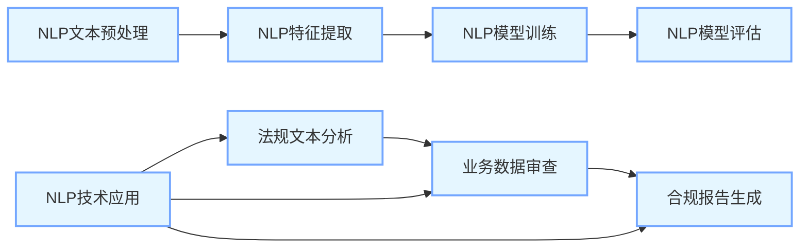

# 自然语言处理在监管合规自动化中的应用

> 关键词：自然语言处理、监管合规自动化、文本分析、机器学习、合规检测

> 摘要：本文深入探讨了自然语言处理（NLP）在监管合规自动化领域的应用。首先介绍了该研究的背景，包括目的、预期读者、文档结构和相关术语。接着阐述了自然语言处理和监管合规自动化的核心概念及它们之间的联系，并给出了相应的文本示意图和 Mermaid 流程图。详细讲解了核心算法原理，通过 Python 代码进行了说明，同时介绍了相关的数学模型和公式。通过项目实战，展示了代码的实际案例及详细解释。分析了自然语言处理在监管合规自动化中的实际应用场景，推荐了相关的学习资源、开发工具框架和论文著作。最后总结了未来发展趋势与挑战，并对常见问题进行了解答。

## 1. 背景介绍 
### 1.1 目的和范围
随着全球监管环境的日益复杂和严格，企业面临着越来越大的合规压力。手动处理大量的监管文件和业务数据以确保合规性不仅效率低下，而且容易出错。自然语言处理（NLP）技术的出现为监管合规自动化提供了强大的解决方案。本文章的目的是全面介绍自然语言处理在监管合规自动化中的应用，涵盖从核心概念到实际应用的各个方面，包括算法原理、数学模型、项目实战等，帮助读者深入理解和掌握如何利用 NLP 技术实现监管合规自动化。

### 1.2 预期读者
本文的预期读者包括从事金融、医疗、法律等受严格监管行业的合规管理人员、IT 专业人员、对自然语言处理和监管合规感兴趣的研究人员以及相关领域的学生。这些读者可能希望了解如何利用先进的技术手段提高监管合规工作的效率和准确性，或者对 NLP 在监管合规领域的应用有进一步的研究需求。

### 1.3 文档结构概述
本文将按照以下结构进行组织：首先介绍自然语言处理和监管合规自动化的核心概念及其联系，包括原理和架构的文本示意图和 Mermaid 流程图。接着详细讲解核心算法原理，并使用 Python 源代码进行说明。然后介绍相关的数学模型和公式，并通过举例进行详细讲解。通过项目实战展示代码的实际案例和详细解释。分析自然语言处理在监管合规自动化中的实际应用场景。推荐相关的学习资源、开发工具框架和论文著作。最后总结未来发展趋势与挑战，解答常见问题，并提供扩展阅读和参考资料。

### 1.4 术语表
#### 1.4.1 核心术语定义
- **自然语言处理（Natural Language Processing，NLP）**：是计算机科学、人工智能和语言学的交叉领域，旨在让计算机理解、处理和生成人类语言。它包括文本分类、命名实体识别、情感分析、机器翻译等多个任务。
- **监管合规自动化（Regulatory Compliance Automation）**：利用技术手段自动执行监管合规任务，减少人工干预，提高合规效率和准确性。这些任务包括法规文本分析、业务数据审查、合规报告生成等。
- **文本分类（Text Classification）**：将文本分配到预定义的类别中的任务，例如将法规文本分类为不同的监管领域。
- **命名实体识别（Named Entity Recognition，NER）**：识别文本中提及的命名实体，如人名、地名、组织机构名、日期等。

#### 1.4.2 相关概念解释
- **机器学习（Machine Learning）**：是一门多领域交叉学科，涉及概率论、统计学、逼近论、凸分析、算法复杂度理论等多门学科。它专门研究计算机怎样模拟或实现人类的学习行为，以获取新的知识或技能，重新组织已有的知识结构使之不断改善自身的性能。在自然语言处理中，机器学习算法常用于训练模型以完成各种任务。
- **深度学习（Deep Learning）**：是机器学习的一个分支领域，它是一种基于对数据进行表征学习的方法。深度学习通过构建具有很多层的神经网络模型，自动从大量数据中学习特征和模式。在自然语言处理中，深度学习模型如循环神经网络（RNN）、长短期记忆网络（LSTM）、Transformer 等取得了很好的效果。

#### 1.4.3 缩略词列表
- **NLP**：Natural Language Processing（自然语言处理）
- **NER**：Named Entity Recognition（命名实体识别）
- **RNN**：Recurrent Neural Network（循环神经网络）
- **LSTM**：Long Short-Term Memory（长短期记忆网络）
- **API**：Application Programming Interface（应用程序编程接口）

## 2. 核心概念与联系 

### 自然语言处理核心概念
自然语言处理的核心目标是让计算机能够理解和处理人类语言。它主要包括以下几个关键任务：
- **文本预处理**：对原始文本进行清洗、分词、词性标注等操作，将文本转换为适合计算机处理的格式。
- **特征提取**：从预处理后的文本中提取有意义的特征，例如词频、词向量等。
- **模型训练**：使用机器学习或深度学习算法对提取的特征进行训练，得到能够完成特定任务的模型。
- **模型评估**：使用测试数据对训练好的模型进行评估，衡量模型的性能。

### 监管合规自动化核心概念
监管合规自动化是指利用技术手段自动执行监管合规任务。其核心步骤包括：
- **法规文本分析**：对监管法规文本进行解读和分析，提取关键信息和合规要求。
- **业务数据审查**：对企业的业务数据进行审查，检查是否符合法规要求。
- **合规报告生成**：根据法规要求和业务数据审查结果，生成合规报告。

### 两者之间的联系
自然语言处理技术为监管合规自动化提供了强大的工具。通过 NLP 技术，可以对大量的法规文本和业务数据进行自动分析和处理，实现法规文本的理解、业务数据的合规检测和合规报告的自动生成。例如，使用文本分类技术可以将法规文本分类到不同的监管领域，使用命名实体识别技术可以识别法规文本中的关键实体和业务数据中的相关信息，从而提高监管合规工作的效率和准确性。

### 文本示意图
```plaintext
自然语言处理
|-- 文本预处理
|   |-- 清洗
|   |-- 分词
|   |-- 词性标注
|-- 特征提取
|   |-- 词频
|   |-- 词向量
|-- 模型训练
|   |-- 机器学习
|   |-- 深度学习
|-- 模型评估

监管合规自动化
|-- 法规文本分析
|   |-- 解读
|   |-- 提取要求
|-- 业务数据审查
|   |-- 检查合规
|-- 合规报告生成

联系：自然语言处理技术应用于监管合规自动化的各个环节
```

### Mermaid 流程图


## 3. 核心算法原理 & 具体操作步骤 

### 文本分类算法原理
文本分类是自然语言处理中的一个重要任务，常用于将法规文本分类到不同的监管领域。常见的文本分类算法包括朴素贝叶斯、支持向量机和深度学习模型等。这里我们以朴素贝叶斯算法为例进行讲解。

朴素贝叶斯算法基于贝叶斯定理，假设特征之间相互独立。其基本思想是通过计算文本属于每个类别的概率，选择概率最大的类别作为文本的分类结果。

### 具体操作步骤
1. **数据准备**：收集法规文本数据，并将其划分为训练集和测试集。
2. **文本预处理**：对文本进行清洗、分词等操作。
3. **特征提取**：计算文本中每个词的词频，作为特征。
4. **模型训练**：使用训练集数据训练朴素贝叶斯模型。
5. **模型评估**：使用测试集数据评估模型的性能。

### Python 代码实现
```python
import numpy as np
from sklearn.feature_extraction.text import CountVectorizer
from sklearn.naive_bayes import MultinomialNB
from sklearn.model_selection import train_test_split
from sklearn.metrics import accuracy_score

# 示例数据
corpus = [
    "This is a financial regulation text about banking.",
    "This is a healthcare regulation text about patient privacy.",
    "Another financial text related to investment.",
    "A healthcare text about medical device safety."
]
labels = ["financial", "healthcare", "financial", "healthcare"]

# 划分训练集和测试集
X_train, X_test, y_train, y_test = train_test_split(corpus, labels, test_size=0.2, random_state=42)

# 文本特征提取
vectorizer = CountVectorizer()
X_train_vec = vectorizer.fit_transform(X_train)
X_test_vec = vectorizer.transform(X_test)

# 模型训练
clf = MultinomialNB()
clf.fit(X_train_vec, y_train)

# 模型预测
y_pred = clf.predict(X_test_vec)

# 模型评估
accuracy = accuracy_score(y_test, y_pred)
print(f"Accuracy: {accuracy}")
```

### 命名实体识别算法原理
命名实体识别是识别文本中提及的命名实体的任务。常见的命名实体识别算法包括基于规则的方法、基于机器学习的方法和基于深度学习的方法。这里我们以基于深度学习的 BiLSTM-CRF 模型为例进行讲解。

BiLSTM-CRF 模型结合了双向长短期记忆网络（BiLSTM）和条件随机场（CRF）。BiLSTM 用于学习文本的上下文信息，CRF 用于考虑标签之间的依赖关系，从而提高命名实体识别的准确性。

### 具体操作步骤
1. **数据准备**：收集包含命名实体标注的文本数据，并将其划分为训练集和测试集。
2. **文本预处理**：对文本进行分词等操作。
3. **特征编码**：将文本和标签转换为数字编码。
4. **模型构建**：构建 BiLSTM-CRF 模型。
5. **模型训练**：使用训练集数据训练模型。
6. **模型评估**：使用测试集数据评估模型的性能。

### Python 代码实现
```python
import numpy as np
import tensorflow as tf
from tensorflow.keras.preprocessing.sequence import pad_sequences
from tensorflow.keras.utils import to_categorical
from sklearn.model_selection import train_test_split
from seqeval.metrics import accuracy_score

# 示例数据
sentences = [
    ["This", "is", "a", "financial", "regulation"],
    ["Patient", "privacy", "is", "important", "in", "healthcare"]
]
tags = [
    ["O", "O", "O", "B-financial", "I-financial"],
    ["B-patient", "I-patient", "O", "O", "O", "B-healthcare"]
]

# 构建词汇表和标签表
word2idx = {}
tag2idx = {}
for sentence in sentences:
    for word in sentence:
        if word not in word2idx:
            word2idx[word] = len(word2idx)
for tag_list in tags:
    for tag in tag_list:
        if tag not in tag2idx:
            tag2idx[tag] = len(tag2idx)

# 文本和标签编码
X = [[word2idx[word] for word in sentence] for sentence in sentences]
y = [[tag2idx[tag] for tag in tag_list] for tag_list in tags]

# 填充序列
max_length = max([len(sentence) for sentence in sentences])
X = pad_sequences(X, maxlen=max_length, padding='post')
y = pad_sequences(y, maxlen=max_length, padding='post')

# 标签独热编码
y = [to_categorical(i, num_classes=len(tag2idx)) for i in y]

# 划分训练集和测试集
X_train, X_test, y_train, y_test = train_test_split(X, y, test_size=0.2, random_state=42)

# 构建 BiLSTM-CRF 模型
from tensorflow.keras.models import Model
from tensorflow.keras.layers import Input, Embedding, Bidirectional, LSTM, TimeDistributed, Dense
from tensorflow_addons.layers import CRF

input_layer = Input(shape=(max_length,))
embedding_layer = Embedding(input_dim=len(word2idx), output_dim=100)(input_layer)
bilstm_layer = Bidirectional(LSTM(units=100, return_sequences=True))(embedding_layer)
dense_layer = TimeDistributed(Dense(len(tag2idx)))(bilstm_layer)
crf_layer = CRF(len(tag2idx))
output_layer = crf_layer(dense_layer)

model = Model(input_layer, output_layer)
model.compile(optimizer='adam', loss=crf_layer.loss_function, metrics=[crf_layer.accuracy])

# 模型训练
model.fit(np.array(X_train), np.array(y_train), epochs=10, batch_size=1)

# 模型预测
y_pred = model.predict(np.array(X_test))
y_pred = np.argmax(y_pred, axis=-1)
y_test = np.argmax(y_test, axis=-1)

# 模型评估
y_pred_tags = []
y_test_tags = []
for i in range(len(y_pred)):
    pred_tags = [list(tag2idx.keys())[tag] for tag in y_pred[i] if tag!= 0]
    test_tags = [list(tag2idx.keys())[tag] for tag in y_test[i] if tag!= 0]
    y_pred_tags.append(pred_tags)
    y_test_tags.append(test_tags)

accuracy = accuracy_score(y_test_tags, y_pred_tags)
print(f"Accuracy: {accuracy}")
```

## 4. 数学模型和公式 & 详细讲解 & 举例说明 

### 朴素贝叶斯算法数学模型和公式
朴素贝叶斯算法基于贝叶斯定理，其公式为：
$$P(C|D)=\frac{P(D|C)P(C)}{P(D)}$$
其中，$P(C|D)$ 表示在给定文本 $D$ 的情况下，文本属于类别 $C$ 的概率；$P(D|C)$ 表示在类别 $C$ 下，文本 $D$ 出现的概率；$P(C)$ 表示类别 $C$ 出现的先验概率；$P(D)$ 表示文本 $D$ 出现的概率。

由于对于所有类别 $C$，$P(D)$ 是相同的，因此在进行分类时可以忽略 $P(D)$，只需要比较 $P(D|C)P(C)$ 的大小。

假设文本 $D$ 由词 $w_1, w_2, \cdots, w_n$ 组成，根据朴素贝叶斯的独立性假设，$P(D|C)$ 可以表示为：
$$P(D|C)=\prod_{i=1}^{n}P(w_i|C)$$

### 详细讲解
- $P(C)$ 可以通过训练数据中类别 $C$ 出现的频率来估计。
- $P(w_i|C)$ 可以通过训练数据中类别 $C$ 下词 $w_i$ 出现的频率来估计。

### 举例说明
假设有两个类别 $C_1$（金融）和 $C_2$（医疗），训练数据如下：
| 文本 | 类别 |
| --- | --- |
| This is a financial regulation | $C_1$ |
| Patient privacy is important in healthcare | $C_2$ |

计算先验概率：
- $P(C_1)=\frac{1}{2}$
- $P(C_2)=\frac{1}{2}$

假设要分类的文本为 “This is a financial text”，计算 $P(D|C_1)P(C_1)$ 和 $P(D|C_2)P(C_2)$：
- 对于 $C_1$：
  - $P(D|C_1)=P(this|C_1)P(is|C_1)P(a|C_1)P(financial|C_1)P(text|C_1)$
  - 通过训练数据估计概率，例如 $P(financial|C_1)=\frac{1}{5}$（在 $C_1$ 类文本中 “financial” 出现的频率）
  - 计算 $P(D|C_1)P(C_1)$ 的值。
- 对于 $C_2$：
  - 同样计算 $P(D|C_2)P(C_2)$ 的值。

比较 $P(D|C_1)P(C_1)$ 和 $P(D|C_2)P(C_2)$ 的大小，选择概率大的类别作为文本的分类结果。

### BiLSTM-CRF 模型数学模型和公式
#### BiLSTM 部分
双向长短期记忆网络（BiLSTM）通过正向和反向的 LSTM 单元来学习文本的上下文信息。LSTM 单元的核心公式如下：
- 输入门：
$$i_t=\sigma(W_{ii}x_t + W_{hi}h_{t-1}+b_i)$$
- 遗忘门：
$$f_t=\sigma(W_{if}x_t + W_{hf}h_{t-1}+b_f)$$
- 细胞状态更新：
$$\tilde{C}_t=\tanh(W_{ic}x_t + W_{hc}h_{t-1}+b_c)$$
$$C_t=f_t\odot C_{t-1}+i_t\odot\tilde{C}_t$$
- 输出门：
$$o_t=\sigma(W_{io}x_t + W_{ho}h_{t-1}+b_o)$$
$$h_t=o_t\odot\tanh(C_t)$$
其中，$x_t$ 是输入向量，$h_{t-1}$ 是上一时刻的隐藏状态，$C_{t-1}$ 是上一时刻的细胞状态，$W$ 是权重矩阵，$b$ 是偏置向量，$\sigma$ 是 sigmoid 函数，$\tanh$ 是双曲正切函数，$\odot$ 表示逐元素相乘。

#### CRF 部分
条件随机场（CRF）用于考虑标签之间的依赖关系。假设输入序列为 $x=(x_1, x_2, \cdots, x_n)$，输出标签序列为 $y=(y_1, y_2, \cdots, y_n)$，CRF 的得分函数为：
$$s(x,y)=\sum_{i=1}^{n}U(x,i,y_i)+\sum_{i=1}^{n-1}T(y_i,y_{i+1})$$
其中，$U(x,i,y_i)$ 是输入 $x$ 在位置 $i$ 时标签为 $y_i$ 的非转移得分，$T(y_i,y_{i+1})$ 是从标签 $y_i$ 转移到标签 $y_{i+1}$ 的转移得分。

CRF 的概率函数为：
$$P(y|x)=\frac{\exp(s(x,y))}{\sum_{y'\in\mathcal{Y}}\exp(s(x,y'))}$$
其中，$\mathcal{Y}$ 是所有可能的标签序列集合。

### 详细讲解
- BiLSTM 部分通过正向和反向的 LSTM 单元捕捉文本的上下文信息，输出每个时刻的隐藏状态。
- CRF 部分利用这些隐藏状态计算标签序列的得分和概率，选择得分最高的标签序列作为最终的命名实体识别结果。

### 举例说明
假设有输入序列 “This is a financial regulation”，经过 BiLSTM 处理后得到每个词的隐藏状态。CRF 模型根据这些隐藏状态计算不同标签序列的得分，例如 “O O O B-financial I-financial” 和 “O O O B-healthcare I-healthcare” 的得分，选择得分最高的标签序列作为最终的命名实体识别结果。

## 5. 项目实战：代码实际案例和详细解释说明 

### 5.1  开发环境搭建
#### 安装 Python
首先需要安装 Python 环境，建议使用 Python 3.7 及以上版本。可以从 Python 官方网站（https://www.python.org/downloads/）下载并安装。

#### 安装必要的库
使用以下命令安装必要的 Python 库：
```bash
pip install numpy scikit-learn tensorflow tensorflow-addons seqeval
```

### 5.2  源代码详细实现和代码解读
#### 文本分类项目
```python
import numpy as np
from sklearn.feature_extraction.text import CountVectorizer
from sklearn.naive_bayes import MultinomialNB
from sklearn.model_selection import train_test_split
from sklearn.metrics import accuracy_score

# 示例数据
corpus = [
    "This is a financial regulation text about banking.",
    "This is a healthcare regulation text about patient privacy.",
    "Another financial text related to investment.",
    "A healthcare text about medical device safety."
]
labels = ["financial", "healthcare", "financial", "healthcare"]

# 划分训练集和测试集
X_train, X_test, y_train, y_test = train_test_split(corpus, labels, test_size=0.2, random_state=42)

# 文本特征提取
vectorizer = CountVectorizer()
X_train_vec = vectorizer.fit_transform(X_train)
X_test_vec = vectorizer.transform(X_test)

# 模型训练
clf = MultinomialNB()
clf.fit(X_train_vec, y_train)

# 模型预测
y_pred = clf.predict(X_test_vec)

# 模型评估
accuracy = accuracy_score(y_test, y_pred)
print(f"Accuracy: {accuracy}")
```
#### 代码解读
1. **数据准备**：定义了一个包含法规文本和对应标签的示例数据集，使用 `train_test_split` 函数将数据集划分为训练集和测试集。
2. **文本特征提取**：使用 `CountVectorizer` 类将文本转换为词频矩阵，以便机器学习模型能够处理。
3. **模型训练**：使用 `MultinomialNB` 类创建一个朴素贝叶斯分类器，并使用训练集数据进行训练。
4. **模型预测**：使用训练好的模型对测试集数据进行预测。
5. **模型评估**：使用 `accuracy_score` 函数计算模型的准确率。

#### 命名实体识别项目
```python
import numpy as np
import tensorflow as tf
from tensorflow.keras.preprocessing.sequence import pad_sequences
from tensorflow.keras.utils import to_categorical
from sklearn.model_selection import train_test_split
from seqeval.metrics import accuracy_score

# 示例数据
sentences = [
    ["This", "is", "a", "financial", "regulation"],
    ["Patient", "privacy", "is", "important", "in", "healthcare"]
]
tags = [
    ["O", "O", "O", "B-financial", "I-financial"],
    ["B-patient", "I-patient", "O", "O", "O", "B-healthcare"]
]

# 构建词汇表和标签表
word2idx = {}
tag2idx = {}
for sentence in sentences:
    for word in sentence:
        if word not in word2idx:
            word2idx[word] = len(word2idx)
for tag_list in tags:
    for tag in tag_list:
        if tag not in tag2idx:
            tag2idx[tag] = len(tag2idx)

# 文本和标签编码
X = [[word2idx[word] for word in sentence] for sentence in sentences]
y = [[tag2idx[tag] for tag in tag_list] for tag_list in tags]

# 填充序列
max_length = max([len(sentence) for sentence in sentences])
X = pad_sequences(X, maxlen=max_length, padding='post')
y = pad_sequences(y, maxlen=max_length, padding='post')

# 标签独热编码
y = [to_categorical(i, num_classes=len(tag2idx)) for i in y]

# 划分训练集和测试集
X_train, X_test, y_train, y_test = train_test_split(X, y, test_size=0.2, random_state=42)

# 构建 BiLSTM-CRF 模型
from tensorflow.keras.models import Model
from tensorflow.keras.layers import Input, Embedding, Bidirectional, LSTM, TimeDistributed, Dense
from tensorflow_addons.layers import CRF

input_layer = Input(shape=(max_length,))
embedding_layer = Embedding(input_dim=len(word2idx), output_dim=100)(input_layer)
bilstm_layer = Bidirectional(LSTM(units=100, return_sequences=True))(embedding_layer)
dense_layer = TimeDistributed(Dense(len(tag2idx)))(bilstm_layer)
crf_layer = CRF(len(tag2idx))
output_layer = crf_layer(dense_layer)

model = Model(input_layer, output_layer)
model.compile(optimizer='adam', loss=crf_layer.loss_function, metrics=[crf_layer.accuracy])

# 模型训练
model.fit(np.array(X_train), np.array(y_train), epochs=10, batch_size=1)

# 模型预测
y_pred = model.predict(np.array(X_test))
y_pred = np.argmax(y_pred, axis=-1)
y_test = np.argmax(y_test, axis=-1)

# 模型评估
y_pred_tags = []
y_test_tags = []
for i in range(len(y_pred)):
    pred_tags = [list(tag2idx.keys())[tag] for tag in y_pred[i] if tag!= 0]
    test_tags = [list(tag2idx.keys())[tag] for tag in y_test[i] if tag!= 0]
    y_pred_tags.append(pred_tags)
    y_test_tags.append(test_tags)

accuracy = accuracy_score(y_test_tags, y_pred_tags)
print(f"Accuracy: {accuracy}")
```
#### 代码解读
1. **数据准备**：定义了一个包含句子和对应标签的示例数据集，构建词汇表和标签表，将文本和标签转换为数字编码。
2. **序列填充和独热编码**：使用 `pad_sequences` 函数将序列填充到相同的长度，使用 `to_categorical` 函数将标签进行独热编码。
3. **划分训练集和测试集**：使用 `train_test_split` 函数将数据集划分为训练集和测试集。
4. **模型构建**：构建 BiLSTM-CRF 模型，包括输入层、嵌入层、双向 LSTM 层、全连接层和 CRF 层。
5. **模型编译和训练**：使用 `adam` 优化器编译模型，使用训练集数据进行训练。
6. **模型预测和评估**：使用训练好的模型对测试集数据进行预测，将预测结果和真实标签转换为标签序列，使用 `accuracy_score` 函数计算准确率。

### 5.3  代码解读与分析
#### 文本分类项目
- **优点**：朴素贝叶斯算法简单易懂，训练速度快，在小规模数据集上表现良好。
- **缺点**：朴素贝叶斯的独立性假设在实际应用中可能不成立，导致模型性能受到影响。
- **改进方向**：可以尝试使用更复杂的特征提取方法，如 TF-IDF 或词向量，以及更强大的分类器，如支持向量机或深度学习模型。

#### 命名实体识别项目
- **优点**：BiLSTM-CRF 模型能够有效地捕捉文本的上下文信息和标签之间的依赖关系，在命名实体识别任务中取得了很好的效果。
- **缺点**：模型训练时间较长，需要大量的标注数据。
- **改进方向**：可以尝试使用预训练的语言模型，如 BERT，来提高模型的性能和泛化能力。

## 6. 实际应用场景 
### 法规文本分析
自然语言处理技术可以用于对大量的法规文本进行自动分析和解读。通过文本分类、命名实体识别等任务，可以将法规文本分类到不同的监管领域，识别法规文本中的关键实体和合规要求。例如，在金融行业，可以将法规文本分类为银行监管、证券监管、保险监管等领域，识别法规文本中的监管机构、监管对象、监管措施等关键信息。

### 业务数据审查
企业的业务数据通常以文本形式存在，如合同、报告、邮件等。自然语言处理技术可以用于对这些业务数据进行审查，检查是否符合法规要求。例如，使用命名实体识别技术可以识别业务数据中的关键实体，如客户信息、交易金额、交易时间等，然后与法规要求进行比对，检查是否存在违规行为。

### 合规报告生成
根据法规要求和业务数据审查结果，自然语言处理技术可以自动生成合规报告。通过文本生成技术，可以将审查结果以清晰、准确的语言表达出来，减少人工编写报告的工作量。例如，在医疗行业，可以根据法规要求和患者病历审查结果，自动生成合规报告，说明医院是否遵守了患者隐私保护法规。

### 风险预警
自然语言处理技术可以实时监测法规变化和企业业务数据，及时发现潜在的合规风险。通过对法规文本和业务数据的实时分析，当发现法规变化或业务数据中存在违规迹象时，系统可以自动发出预警，提醒企业采取相应的措施。例如，在金融行业，当新的监管法规出台时，系统可以自动分析法规内容，评估对企业业务的影响，并及时发出预警。

## 7. 工具和资源推荐
### 7.1 学习资源推荐
#### 7.1.1 书籍推荐
- 《自然语言处理入门》：何晗著，本书系统地介绍了自然语言处理的基础知识和常用技术，包括分词、词性标注、命名实体识别等，适合初学者入门。
- 《深度学习》：Ian Goodfellow、Yoshua Bengio 和 Aaron Courville 著，本书是深度学习领域的经典教材，介绍了深度学习的基本概念、算法和应用，对于理解自然语言处理中的深度学习模型有很大帮助。
- 《Python 自然语言处理》：Steven Bird、Ewan Klein 和 Edward Loper 著，本书通过 Python 代码示例介绍了自然语言处理的各种技术和应用，是一本实践性很强的书籍。

#### 7.1.2 在线课程
- Coursera 上的 “Natural Language Processing Specialization”：由 DeepLearning.AI 提供，该课程涵盖了自然语言处理的各个方面，包括文本分类、命名实体识别、机器翻译等，通过视频讲解、编程作业和项目实践，帮助学习者掌握自然语言处理的技术和应用。
- edX 上的 “Introduction to Natural Language Processing”：由哥伦比亚大学提供，该课程介绍了自然语言处理的基本概念、算法和应用，适合初学者入门。
- 网易云课堂上的 “Python 自然语言处理实战”：该课程通过实际项目案例，介绍了如何使用 Python 和相关库进行自然语言处理，包括文本预处理、特征提取、模型训练等。

#### 7.1.3 技术博客和网站
- Medium 上的 “Towards Data Science”：该博客上有很多关于自然语言处理的文章，包括技术介绍、案例分析、研究成果等，是学习自然语言处理的重要资源。
- 开源中国（https://www.oschina.net/）：该网站上有很多关于自然语言处理的开源项目和技术文章，对于了解自然语言处理的最新技术和应用有很大帮助。
- 自然语言处理社区（https://www.nlpchina.org/）：该社区是国内自然语言处理领域的专业社区，提供了丰富的技术资源和交流平台。

### 7.2 开发工具框架推荐
#### 7.2.1 IDE和编辑器
- PyCharm：是一款专门为 Python 开发设计的集成开发环境（IDE），具有代码编辑、调试、版本控制等功能，支持多种 Python 库和框架，是开发自然语言处理项目的首选工具。
- Jupyter Notebook：是一个基于 Web 的交互式计算环境，支持 Python、R 等多种编程语言，适合进行数据探索、模型训练和结果展示，在自然语言处理领域得到了广泛应用。
- Visual Studio Code：是一款轻量级的代码编辑器，支持多种编程语言和插件，具有丰富的扩展功能，适合开发小型自然语言处理项目。

#### 7.2.2 调试和性能分析工具
- TensorBoard：是 TensorFlow 提供的一个可视化工具，用于监控模型训练过程中的各种指标，如损失函数、准确率等，还可以可视化模型的结构和参数分布，帮助开发者调试和优化模型。
- Py-Spy：是一个用于分析 Python 程序性能的工具，可以实时监测 Python 程序的 CPU 使用率、内存使用率等指标，找出程序中的性能瓶颈。
- cProfile：是 Python 标准库中的一个性能分析工具，可以统计 Python 程序中各个函数的调用次数、执行时间等信息，帮助开发者优化代码性能。

#### 7.2.3 相关框架和库
- NLTK（Natural Language Toolkit）：是 Python 中最常用的自然语言处理库之一，提供了丰富的文本处理工具和数据集，包括分词、词性标注、命名实体识别等功能，适合初学者入门。
- SpaCy：是一个快速、高效的自然语言处理库，提供了预训练的模型和简单易用的 API，支持多种语言，适合处理大规模的文本数据。
- Transformers：是 Hugging Face 开发的一个用于自然语言处理的深度学习库，提供了多种预训练的语言模型，如 BERT、GPT-2 等，支持文本分类、命名实体识别、文本生成等多种任务。

### 7.3 相关论文著作推荐
#### 7.3.1 经典论文
- “A Neural Probabilistic Language Model”：Yoshua Bengio 等人发表的论文，提出了神经概率语言模型，开创了深度学习在自然语言处理中的应用。
- “Long Short-Term Memory”：Sepp Hochreiter 和 Jürgen Schmidhuber 发表的论文，提出了长短期记忆网络（LSTM），解决了循环神经网络中的梯度消失问题。
- “Attention Is All You Need”：Ashish Vaswani 等人发表的论文，提出了 Transformer 模型，引入了注意力机制，在自然语言处理领域取得了巨大成功。

#### 7.3.2 最新研究成果
- 每年的 ACL（Association for Computational Linguistics）会议、EMNLP（Conference on Empirical Methods in Natural Language Processing）会议等自然语言处理领域的顶级学术会议上都会发表很多最新的研究成果，可以关注这些会议的论文集。
- arXiv（https://arxiv.org/）是一个预印本平台，上面有很多关于自然语言处理的最新研究论文，可以及时了解该领域的最新动态。

#### 7.3.3 应用案例分析
- 《金融科技前沿：监管科技》：该书介绍了监管科技在金融领域的应用案例，包括自然语言处理在监管合规自动化中的应用，对于了解自然语言处理在实际业务中的应用有很大帮助。
- 一些行业报告和研究机构的分析文章也会介绍自然语言处理在监管合规自动化中的应用案例，可以关注相关的行业媒体和研究机构的网站。

## 8. 总结：未来发展趋势与挑战
### 未来发展趋势
#### 多模态融合
未来，自然语言处理在监管合规自动化中的应用将不仅仅局限于文本数据，还将与图像、音频、视频等多模态数据进行融合。例如，在医疗行业，除了对病历文本进行合规审查外，还可以对医学影像进行分析，检查是否存在违规操作。

#### 预训练模型的广泛应用
预训练模型如 BERT、GPT 等在自然语言处理领域取得了巨大成功，未来将在监管合规自动化中得到更广泛的应用。这些预训练模型可以在大规模无标注数据上进行预训练，然后在特定的监管合规任务上进行微调，从而提高模型的性能和泛化能力。

#### 自动化程度的提高
随着技术的不断发展，监管合规自动化的程度将不断提高。未来，系统将能够自动完成法规文本的更新和解读、业务数据的实时监测和审查、合规报告的自动生成等任务，减少人工干预，提高合规效率和准确性。

#### 与区块链技术的结合
区块链技术具有去中心化、不可篡改、可追溯等特点，与自然语言处理技术结合，可以提高监管合规数据的安全性和可信度。例如，将法规文本和业务数据存储在区块链上，使用自然语言处理技术对其进行分析和审查，可以确保数据的真实性和完整性。

### 挑战
#### 法规的复杂性和多变性
监管法规通常非常复杂，而且不断变化。自然语言处理系统需要能够准确理解和解读法规文本，及时跟上法规的变化，这对系统的性能和适应性提出了很高的要求。

#### 数据质量和标注成本
自然语言处理模型的性能很大程度上依赖于数据的质量和数量。在监管合规领域，数据通常具有敏感性和保密性，获取高质量的数据比较困难。此外，标注数据需要专业的知识和技能，标注成本较高。

#### 模型的可解释性
在监管合规领域，模型的可解释性非常重要。监管机构和企业需要了解模型的决策过程和依据，以确保合规性。然而，深度学习模型通常是黑盒模型，其决策过程难以解释，这给模型的应用带来了一定的挑战。

#### 安全和隐私问题
监管合规数据通常包含敏感信息，如客户信息、交易数据等。自然语言处理系统需要确保数据的安全和隐私，防止数据泄露和滥用。同时，系统本身也需要具备一定的安全性，防止受到攻击和破坏。

## 9. 附录：常见问题与解答
### 问题 1：自然语言处理技术在监管合规自动化中的应用是否能够完全替代人工？
答：目前自然语言处理技术在监管合规自动化中的应用还不能完全替代人工。虽然自然语言处理技术可以自动处理大量的法规文本和业务数据，提高合规效率和准确性，但在一些复杂的情况下，如法规的解释和判断、业务场景的理解等，还需要人工的参与。未来，随着技术的不断发展，自然语言处理技术将与人工更好地结合，实现更高效的监管合规自动化。

### 问题 2：如何选择适合的自然语言处理算法和模型？
答：选择适合的自然语言处理算法和模型需要考虑多个因素，如任务类型、数据规模、数据质量、计算资源等。对于简单的文本分类任务，可以选择朴素贝叶斯、支持向量机等传统机器学习算法；对于复杂的命名实体识别、文本生成等任务，可以选择深度学习模型，如 BiLSTM-CRF、Transformer 等。同时，还可以参考相关的研究成果和实践经验，选择在特定任务上表现较好的算法和模型。

### 问题 3：如何评估自然语言处理模型在监管合规自动化中的性能？
答：评估自然语言处理模型在监管合规自动化中的性能可以使用多种指标，如准确率、召回率、F1 值等。对于文本分类任务，可以使用分类准确率来评估模型的性能；对于命名实体识别任务，可以使用实体级别的准确率、召回率和 F1 值来评估模型的性能。此外，还可以结合实际业务需求，评估模型的误报率、漏报率等指标，以确保模型在实际应用中的有效性。

### 问题 4：自然语言处理技术在监管合规自动化中的应用是否存在法律风险？
答：自然语言处理技术在监管合规自动化中的应用本身不存在法律风险，但在使用过程中需要遵守相关的法律法规和监管要求。例如，在处理敏感数据时，需要确保数据的安全和隐私，遵守数据保护法规；在使用模型进行决策时，需要确保模型的决策过程和依据符合法律规定。此外，还需要对模型的性能和准确性进行验证和评估，以确保其在实际应用中的可靠性。

## 10. 扩展阅读 & 参考资料
### 扩展阅读
- 《自然语言处理实战：基于 Python 和深度学习》：本书通过实际项目案例，介绍了如何使用 Python 和深度学习技术进行自然语言处理，包括文本分类、命名实体识别、情感分析等任务。
- 《人工智能时代的监管科技》：该书介绍了监管科技在人工智能时代的发展趋势和应用场景，包括自然语言处理在监管合规自动化中的应用。
- 《金融科技：监管与创新》：本书探讨了金融科技领域的监管问题和创新模式，包括自然语言处理技术在金融监管中的应用。

### 参考资料
- 相关的学术论文和研究报告，如 ACL、EMNLP 等会议的论文集。
- 自然语言处理相关的开源项目和代码库，如 NLTK、SpaCy、Transformers 等。
- 监管机构发布的法规文件和指导意见，如金融监管机构、医疗监管机构等发布的相关文件。

作者：AI天才研究院/AI Genius Institute & 禅与计算机程序设计艺术 /Zen And The Art of Computer Programming