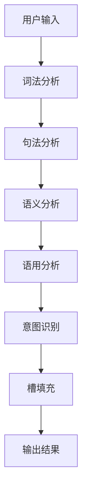

# 自然语言理解在智能客户服务中的应用

> 关键词：自然语言理解、智能客户服务、语义分析、对话管理、知识图谱

> 摘要：本文围绕自然语言理解在智能客户服务中的应用展开深入探讨。首先介绍自然语言理解及智能客户服务的背景知识，为后续讨论奠定基础。接着阐述自然语言理解的核心概念、算法原理和数学模型，详细说明其工作机制。通过项目实战展示自然语言理解在智能客户服务中的具体实现过程，并分析代码。探讨自然语言理解在智能客户服务中的多种实际应用场景。推荐相关的学习资源、开发工具和论文著作，帮助读者深入学习和研究。最后总结自然语言理解在智能客户服务领域的未来发展趋势与挑战，旨在为该领域的研究和实践提供全面且深入的参考。

## 1. 背景介绍 
### 1.1 目的和范围
随着互联网和电子商务的快速发展，客户服务的需求急剧增加。传统的人工客户服务面临着效率低、成本高、难以应对高峰时段等问题。智能客户服务系统的出现为解决这些问题提供了有效的途径。自然语言理解作为智能客户服务的核心技术之一，能够使计算机理解用户的自然语言输入，从而实现智能的交互和服务。本文的目的是深入探讨自然语言理解在智能客户服务中的应用，包括其原理、算法、实际案例等方面，范围涵盖自然语言理解的基本概念、相关技术以及在智能客户服务中的具体应用场景。

### 1.2 预期读者
本文预期读者包括对自然语言处理、人工智能、智能客户服务等领域感兴趣的研究人员、开发人员、企业管理人员以及相关专业的学生。希望通过本文，读者能够对自然语言理解在智能客户服务中的应用有更深入的了解，为相关领域的研究和实践提供参考。

### 1.3 文档结构概述
本文将按照以下结构进行阐述：首先介绍自然语言理解和智能客户服务的背景知识，包括目的、预期读者和文档结构概述等内容；接着详细讲解自然语言理解的核心概念、算法原理和数学模型；通过项目实战展示自然语言理解在智能客户服务中的具体实现过程，并对代码进行详细解读和分析；探讨自然语言理解在智能客户服务中的实际应用场景；推荐相关的学习资源、开发工具和论文著作；最后总结自然语言理解在智能客户服务领域的未来发展趋势与挑战，并提供常见问题与解答以及扩展阅读和参考资料。

### 1.4 术语表
#### 1.4.1 核心术语定义
- **自然语言理解（Natural Language Understanding, NLU）**：是指让计算机能够理解人类使用的自然语言，包括分析语言的语法、语义和语用等信息，从而实现与人类的自然语言交互。
- **智能客户服务（Intelligent Customer Service）**：利用人工智能技术，如自然语言理解、机器学习、知识图谱等，实现自动化、智能化的客户服务，提高客户服务的效率和质量。
- **语义分析（Semantic Analysis）**：对文本的语义信息进行分析，包括词汇语义、句子语义和篇章语义等，以理解文本的真实含义。
- **对话管理（Dialogue Management）**：负责管理对话的流程和状态，根据用户的输入和系统的历史对话，生成合适的回复，实现自然流畅的对话交互。
- **知识图谱（Knowledge Graph）**：一种语义网络，用于表示实体之间的关系和知识，为自然语言理解和智能客户服务提供知识支持。

#### 1.4.2 相关概念解释
- **词性标注（Part-of-Speech Tagging）**：给文本中的每个词标注其词性，如名词、动词、形容词等，有助于后续的语法分析和语义理解。
- **命名实体识别（Named Entity Recognition, NER）**：识别文本中的命名实体，如人名、地名、组织机构名等，对于理解文本的主题和信息非常重要。
- **意图识别（Intent Recognition）**：确定用户输入的意图，如查询信息、提出请求、表达意见等，是自然语言理解的重要环节。
- **槽填充（Slot Filling）**：在意图识别的基础上，提取用户输入中的关键信息，如时间、地点、产品名称等，用于完成具体的任务。

#### 1.4.3 缩略词列表
- **NLU**：Natural Language Understanding（自然语言理解）
- **NER**：Named Entity Recognition（命名实体识别）
- **RNN**：Recurrent Neural Network（循环神经网络）
- **LSTM**：Long Short-Term Memory（长短期记忆网络）
- **GRU**：Gated Recurrent Unit（门控循环单元）
- **BERT**：Bidirectional Encoder Representations from Transformers（基于变换器的双向编码器表示）

## 2. 核心概念与联系 
自然语言理解的核心目标是让计算机理解人类的自然语言，这涉及到多个层次的处理，包括词法分析、句法分析、语义分析和语用分析等。其原理是通过对自然语言文本进行一系列的处理和转换，将其转换为计算机能够理解和处理的形式。

### 核心概念原理
- **词法分析**：对文本进行分词和词性标注，将文本分解为一个个的词，并确定每个词的词性。例如，对于句子“我爱北京天安门”，词法分析会将其分解为“我”“爱”“北京”“天安门”，并标注“我”为代词，“爱”为动词，“北京”为地名，“天安门”为地名。
- **句法分析**：分析句子的语法结构，确定词与词之间的关系。例如，对于句子“我吃饭”，句法分析会确定“我”是主语，“吃”是谓语，“饭”是宾语。
- **语义分析**：理解文本的语义信息，包括词汇语义、句子语义和篇章语义等。例如，对于句子“苹果是一种水果”，语义分析会理解“苹果”和“水果”之间的语义关系。
- **语用分析**：考虑语言使用的上下文和语境，理解用户的真实意图和语用含义。例如，在不同的语境中，“你好”可能有不同的语用含义。

### 架构的文本示意图
自然语言理解的架构可以分为输入层、处理层和输出层。输入层接收用户的自然语言输入，处理层包括词法分析、句法分析、语义分析和语用分析等模块，对输入进行处理和转换，输出层将处理结果转换为计算机能够理解和处理的形式，如意图、槽值等。

### Mermaid 流程图


## 3. 核心算法原理 & 具体操作步骤 
### 核心算法原理
自然语言理解中常用的算法包括基于规则的算法、基于统计的算法和基于深度学习的算法。

- **基于规则的算法**：通过手工编写规则来实现自然语言理解。例如，对于简单的问答系统，可以编写一系列的规则来匹配用户的输入，并给出相应的回答。这种算法的优点是解释性强，缺点是需要大量的人工编写规则，且难以处理复杂的语言现象。
- **基于统计的算法**：利用大量的语料库进行统计学习，如隐马尔可夫模型（HMM）、条件随机场（CRF）等。这些算法通过学习语料库中的统计规律来实现自然语言理解。例如，HMM 可以用于词性标注，CRF 可以用于命名实体识别。
- **基于深度学习的算法**：利用深度神经网络来实现自然语言理解，如循环神经网络（RNN）、长短期记忆网络（LSTM）、门控循环单元（GRU）和基于变换器的模型（如 BERT）等。这些算法能够自动学习语言的特征和模式，具有较高的准确性和泛化能力。

### 具体操作步骤
以下以基于深度学习的意图识别为例，介绍自然语言理解的具体操作步骤。

#### 步骤 1：数据准备
收集和整理训练数据，包括用户的自然语言输入和对应的意图标签。例如，对于一个电商客服系统，训练数据可能包括用户的咨询问题和对应的问题类别，如“商品咨询”“订单查询”“售后问题”等。

#### 步骤 2：数据预处理
对训练数据进行预处理，包括分词、词性标注、去除停用词等操作。例如，使用 Python 的 jieba 库进行中文分词。

```python
import jieba

text = "我想买一件衣服"
words = jieba.lcut(text)
print(words)
```

#### 步骤 3：特征提取
将预处理后的文本转换为计算机能够处理的特征向量。常用的方法包括词袋模型（Bag of Words）、词嵌入（Word Embedding）等。例如，使用 Python 的 sklearn 库实现词袋模型。

```python
from sklearn.feature_extraction.text import CountVectorizer

corpus = ["我想买一件衣服", "我想查询订单"]
vectorizer = CountVectorizer()
X = vectorizer.fit_transform(corpus)
print(X.toarray())
```

#### 步骤 4：模型训练
选择合适的深度学习模型，如 LSTM、GRU 或 BERT 等，并使用训练数据进行模型训练。例如，使用 Keras 库实现一个简单的 LSTM 模型。

```python
from keras.models import Sequential
from keras.layers import Embedding, LSTM, Dense
from keras.preprocessing.text import Tokenizer
from keras.preprocessing.sequence import pad_sequences
import numpy as np

# 数据
texts = ["我想买一件衣服", "我想查询订单"]
labels = [0, 1]

# 分词和编码
tokenizer = Tokenizer()
tokenizer.fit_on_texts(texts)
sequences = tokenizer.texts_to_sequences(texts)

# 填充序列
max_length = max([len(seq) for seq in sequences])
padded_sequences = pad_sequences(sequences, maxlen=max_length)

# 构建模型
model = Sequential()
model.add(Embedding(input_dim=len(tokenizer.word_index) + 1, output_dim=100, input_length=max_length))
model.add(LSTM(100))
model.add(Dense(1, activation='sigmoid'))

# 编译模型
model.compile(optimizer='adam', loss='binary_crossentropy', metrics=['accuracy'])

# 训练模型
model.fit(padded_sequences, np.array(labels), epochs=10, batch_size=1)
```

#### 步骤 5：模型评估
使用测试数据对训练好的模型进行评估，计算模型的准确率、召回率、F1 值等指标。

#### 步骤 6：模型预测
使用训练好的模型对新的用户输入进行预测，得到用户的意图标签。

```python
new_text = "我想看看商品详情"
new_sequence = tokenizer.texts_to_sequences([new_text])
new_padded_sequence = pad_sequences(new_sequence, maxlen=max_length)
prediction = model.predict(new_padded_sequence)
print(prediction)
```

## 4. 数学模型和公式 & 详细讲解 & 举例说明 
### 词嵌入的数学模型
词嵌入是将词转换为低维向量的技术，常用的词嵌入模型包括 Word2Vec 和 GloVe。

#### Word2Vec
Word2Vec 是一种基于神经网络的词嵌入模型，包括 CBOW（Continuous Bag-of-Words）和 Skip-gram 两种模型。

- **CBOW 模型**：根据上下文词预测目标词。其数学模型可以表示为：
$$
P(w_O|w_{I_1}, w_{I_2}, \cdots, w_{I_C}) = \frac{\exp(v_{w_O}'^T \cdot \frac{1}{C} \sum_{i=1}^{C} v_{w_{I_i}})}{\sum_{w=1}^{V} \exp(v_w'^T \cdot \frac{1}{C} \sum_{i=1}^{C} v_{w_{I_i}})}
$$
其中，$w_O$ 是目标词，$w_{I_1}, w_{I_2}, \cdots, w_{I_C}$ 是上下文词，$v_{w_O}'$ 是目标词的输出向量，$v_{w_{I_i}}$ 是上下文词的输入向量，$V$ 是词汇表的大小。

- **Skip-gram 模型**：根据目标词预测上下文词。其数学模型可以表示为：
$$
P(w_{O_1}, w_{O_2}, \cdots, w_{O_C}|w_I) = \prod_{i=1}^{C} \frac{\exp(v_{w_{O_i}}'^T \cdot v_{w_I})}{\sum_{w=1}^{V} \exp(v_w'^T \cdot v_{w_I})}
$$
其中，$w_I$ 是目标词，$w_{O_1}, w_{O_2}, \cdots, w_{O_C}$ 是上下文词，$v_{w_{O_i}}'$ 是上下文词的输出向量，$v_{w_I}$ 是目标词的输入向量，$V$ 是词汇表的大小。

#### GloVe
GloVe 是一种基于全局词频统计的词嵌入模型。其数学模型可以表示为：
$$
J = \sum_{i,j=1}^{V} f(X_{ij}) (w_i^T \tilde{w}_j + b_i + \tilde{b}_j - \log X_{ij})^2
$$
其中，$X_{ij}$ 是词 $i$ 和词 $j$ 在语料库中共同出现的次数，$w_i$ 和 $\tilde{w}_j$ 是词 $i$ 和词 $j$ 的嵌入向量，$b_i$ 和 $\tilde{b}_j$ 是偏置项，$f(X_{ij})$ 是权重函数。

### 举例说明
以下是使用 Python 的 gensim 库实现 Word2Vec 词嵌入的示例代码：

```python
from gensim.models import Word2Vec
import numpy as np

# 训练数据
sentences = [["我", "想", "买", "一件", "衣服"], ["我", "想", "查询", "订单"]]

# 训练 Word2Vec 模型
model = Word2Vec(sentences, min_count=1)

# 获取词向量
vector = model.wv["衣服"]
print(vector)
```

## 5. 项目实战：代码实际案例和详细解释说明 
### 5.1  开发环境搭建
- **Python 环境**：建议使用 Python 3.6 及以上版本。
- **开发工具**：可以使用 PyCharm、Jupyter Notebook 等开发工具。
- **相关库**：安装必要的 Python 库，如 jieba、sklearn、keras、gensim 等。可以使用以下命令进行安装：
```sh
pip install jieba sklearn keras gensim
```

### 5.2  源代码详细实现和代码解读
以下是一个简单的智能客户服务系统的实现代码，使用自然语言理解技术实现意图识别和槽填充。

```python
import jieba
from sklearn.feature_extraction.text import CountVectorizer
from sklearn.naive_bayes import MultinomialNB

# 训练数据
texts = ["我想买一件衣服", "我想查询订单", "我要退货"]
labels = ["商品咨询", "订单查询", "售后问题"]

# 分词
words_list = []
for text in texts:
    words = jieba.lcut(text)
    words_list.append(" ".join(words))

# 特征提取
vectorizer = CountVectorizer()
X = vectorizer.fit_transform(words_list)

# 模型训练
model = MultinomialNB()
model.fit(X, labels)

# 预测函数
def predict_intent(text):
    words = jieba.lcut(text)
    words_str = " ".join(words)
    X_test = vectorizer.transform([words_str])
    intent = model.predict(X_test)[0]
    return intent

# 测试
test_text = "我想看看商品详情"
intent = predict_intent(test_text)
print("用户意图：", intent)
```

### 5.3  代码解读与分析
- **数据准备**：定义了训练数据 `texts` 和对应的意图标签 `labels`。
- **分词**：使用 jieba 库对训练数据进行分词，并将分词结果用空格连接成字符串。
- **特征提取**：使用 `CountVectorizer` 进行特征提取，将文本转换为词袋模型的特征向量。
- **模型训练**：使用 `MultinomialNB` 朴素贝叶斯分类器进行模型训练。
- **预测函数**：定义了 `predict_intent` 函数，用于对新的用户输入进行意图预测。
- **测试**：对测试文本进行意图预测，并输出预测结果。

## 6. 实际应用场景 
### 在线客服
自然语言理解技术可以应用于在线客服系统，实现自动回答用户的问题。例如，用户在电商网站上咨询商品信息、订单状态、售后问题等，智能客服系统可以通过自然语言理解技术理解用户的问题，并给出相应的回答。

### 智能语音助手
在智能语音助手中，自然语言理解技术可以将用户的语音输入转换为文本，并理解用户的意图。例如，用户对智能音箱说“播放周杰伦的歌曲”，智能语音助手可以通过自然语言理解技术识别用户的意图，并播放相应的歌曲。

### 智能邮件处理
自然语言理解技术可以应用于智能邮件处理系统，自动分类和处理邮件。例如，根据邮件的主题和内容，将邮件分类为重要邮件、普通邮件、垃圾邮件等，并根据用户的设置进行相应的处理。

### 智能知识库查询
在智能知识库系统中，自然语言理解技术可以帮助用户快速查询所需的知识。例如，用户输入自然