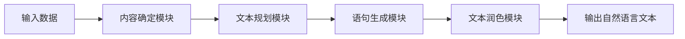

# 自然语言生成：提升AI Agent的表达能力

> 关键词：自然语言生成、AI Agent、表达能力、语言模型、文本生成算法

> 摘要：本文围绕自然语言生成技术如何提升AI Agent的表达能力展开深入探讨。首先介绍了自然语言生成的背景，包括目的、预期读者、文档结构和相关术语。接着阐述了自然语言生成的核心概念与联系，展示了其原理和架构的文本示意图及Mermaid流程图。详细讲解了核心算法原理及具体操作步骤，并用Python代码进行了示例。分析了相关的数学模型和公式，并举例说明。通过项目实战展示了代码的实际案例及详细解释。探讨了自然语言生成在不同场景的实际应用，推荐了学习资源、开发工具框架和相关论文著作。最后总结了未来发展趋势与挑战，提供了常见问题解答和扩展阅读参考资料，旨在帮助读者全面了解自然语言生成技术对提升AI Agent表达能力的重要作用。

## 1. 背景介绍 
### 1.1 目的和范围
自然语言生成（Natural Language Generation，NLG）是人工智能领域的一个重要分支，其目的在于让计算机系统自动生成自然流畅的人类语言文本。在当今数字化时代，随着人工智能技术的飞速发展，AI Agent在各个领域的应用越来越广泛，如智能客服、智能写作助手、虚拟主播等。提升AI Agent的表达能力对于增强其与用户的交互效果、提高用户体验至关重要。

本文的范围涵盖了自然语言生成的基本概念、核心算法原理、数学模型、实际应用案例等方面，旨在全面深入地探讨如何通过自然语言生成技术提升AI Agent的表达能力。

### 1.2 预期读者
本文的预期读者包括人工智能领域的研究人员、开发者、对自然语言处理技术感兴趣的技术爱好者以及希望了解如何提升AI Agent性能的相关从业者。无论是初学者还是有一定经验的专业人士，都能从本文中获取有价值的信息。

### 1.3 文档结构概述
本文将按照以下结构进行组织：
- 核心概念与联系：介绍自然语言生成的基本概念、原理和架构。
- 核心算法原理 & 具体操作步骤：详细讲解自然语言生成的核心算法，并给出Python代码示例。
- 数学模型和公式 & 详细讲解 & 举例说明：分析自然语言生成中涉及的数学模型和公式，并通过具体例子进行说明。
- 项目实战：代码实际案例和详细解释说明：通过一个实际项目展示自然语言生成的具体实现过程。
- 实际应用场景：探讨自然语言生成在不同领域的实际应用。
- 工具和资源推荐：推荐学习自然语言生成的相关资源、开发工具和论文著作。
- 总结：未来发展趋势与挑战：总结自然语言生成技术的未来发展趋势和面临的挑战。
- 附录：常见问题与解答：提供常见问题的解答。
- 扩展阅读 & 参考资料：提供相关的扩展阅读材料和参考资料。

### 1.4 术语表
#### 1.4.1 核心术语定义
- **自然语言生成（Natural Language Generation，NLG）**：是指计算机将非语言形式的数据（如结构化数据、知识图谱等）转换为自然语言文本的过程。
- **AI Agent**：是指能够感知环境、做出决策并采取行动的人工智能实体。
- **语言模型**：是一种用于计算语言序列概率的统计模型，它可以预测下一个词出现的概率。
- **文本生成算法**：是指用于生成自然语言文本的具体算法，如基于规则的算法、基于统计的算法、基于深度学习的算法等。

#### 1.4.2 相关概念解释
- **结构化数据**：是指具有一定格式和规则的数据，如数据库中的表格数据、JSON格式的数据等。
- **知识图谱**：是一种用于表示实体之间关系的图结构，它可以帮助计算机更好地理解和处理知识。
- **深度学习**：是一种基于神经网络的机器学习方法，它可以自动从大量数据中学习特征和模式。

#### 1.4.3 缩略词列表
- **NLG**：Natural Language Generation（自然语言生成）
- **AI**：Artificial Intelligence（人工智能）
- **RNN**：Recurrent Neural Network（循环神经网络）
- **LSTM**：Long Short-Term Memory（长短期记忆网络）
- **GRU**：Gated Recurrent Unit（门控循环单元）
- **Transformer**：一种基于注意力机制的深度学习模型

## 2. 核心概念与联系 

### 自然语言生成的基本原理
自然语言生成的基本原理是将非语言形式的信息转换为自然语言文本。这个过程通常包括以下几个步骤：
1. **内容确定**：确定要生成的文本的主题和内容。这可以基于输入的数据、用户的需求或系统的目标来确定。
2. **文本规划**：对生成的文本进行结构规划，确定文本的段落、句子和词汇的组织方式。
3. **语句生成**：根据文本规划的结果，生成具体的语句。这涉及到词汇选择、语法结构的构建等。
4. **文本润色**：对生成的文本进行润色，使其更加流畅、自然和符合语言习惯。

### 自然语言生成与AI Agent的联系
AI Agent需要具备良好的表达能力才能与用户进行有效的交互。自然语言生成技术可以为AI Agent提供生成自然语言文本的能力，从而提升其表达能力。例如，在智能客服场景中，AI Agent可以使用自然语言生成技术自动生成回答用户问题的文本；在智能写作助手场景中，AI Agent可以根据用户的需求生成文章、报告等文本。

### 核心概念原理和架构的文本示意图
```plaintext
输入数据（结构化数据、知识图谱等）
        |
        v
内容确定模块
        |
        v
文本规划模块
        |
        v
语句生成模块
        |
        v
文本润色模块
        |
        v
输出自然语言文本
```

### Mermaid流程图


## 3. 核心算法原理 & 具体操作步骤 

### 基于规则的算法
基于规则的算法是最早用于自然语言生成的算法之一。它通过预先定义的规则来生成文本。例如，在生成天气预报文本时，可以定义以下规则：
- 如果天气是晴天，生成“今天天气晴朗，阳光明媚。”
- 如果天气是雨天，生成“今天有雨，出门请携带雨具。”

以下是一个简单的基于规则的自然语言生成的Python代码示例：
```python
def generate_weather_text(weather):
    if weather == "晴天":
        return "今天天气晴朗，阳光明媚。"
    elif weather == "雨天":
        return "今天有雨，出门请携带雨具。"
    else:
        return "今天的天气情况未知。"

# 测试代码
weather = "晴天"
text = generate_weather_text(weather)
print(text)
```

### 基于统计的算法
基于统计的算法通过对大量文本数据的统计分析来生成文本。例如，N-gram模型是一种常用的基于统计的语言模型，它通过统计文本中连续N个词出现的概率来生成文本。

以下是一个简单的基于N-gram模型的自然语言生成的Python代码示例：
```python
import random
from collections import defaultdict

def build_ngram_model(texts, n):
    model = defaultdict(list)
    for text in texts:
        tokens = text.split()
        for i in range(len(tokens) - n + 1):
            ngram = tuple(tokens[i:i + n - 1])
            next_word = tokens[i + n - 1]
            model[ngram].append(next_word)
    return model

def generate_text(model, n, start_ngram, max_length=100):
    current_ngram = start_ngram
    text = list(current_ngram)
    for _ in range(max_length):
        if current_ngram in model:
            next_word = random.choice(model[current_ngram])
            text.append(next_word)
            current_ngram = tuple(text[-n + 1:])
        else:
            break
    return " ".join(text)

# 示例文本数据
texts = [
    "我爱自然语言处理",
    "自然语言处理很有趣",
    "我喜欢学习自然语言处理"
]

# 构建2-gram模型
n = 2
model = build_ngram_model(texts, n)

# 生成文本
start_ngram = ("我爱",)
generated_text = generate_text(model, n, start_ngram)
print(generated_text)
```

### 基于深度学习的算法
基于深度学习的算法在自然语言生成领域取得了巨大的成功。其中，Transformer模型是一种非常流行的深度学习模型，它基于注意力机制，可以有效地处理长序列数据。

以下是一个使用Hugging Face的Transformers库进行文本生成的Python代码示例：
```python
from transformers import GPT2LMHeadModel, GPT2Tokenizer

# 加载预训练模型和分词器
model_name = "gpt2"
tokenizer = GPT2Tokenizer.from_pretrained(model_name)
model = GPT2LMHeadModel.from_pretrained(model_name)

# 输入文本
input_text = "今天天气不错，"

# 对输入文本进行分词
input_ids = tokenizer.encode(input_text, return_tensors="pt")

# 生成文本
output = model.generate(input_ids, max_length=100, num_beams=5, no_repeat_ngram_size=2, early_stopping=True)

# 解码生成的文本
generated_text = tokenizer.decode(output[0], skip_special_tokens=True)
print(generated_text)
```

## 4. 数学模型和公式 & 详细讲解 & 举例说明 

### 语言模型的数学定义
语言模型是自然语言生成的核心概念之一。它用于计算一个语言序列 $w_1, w_2, \cdots, w_n$ 出现的概率 $P(w_1, w_2, \cdots, w_n)$。根据链式法则，这个概率可以分解为：
$$P(w_1, w_2, \cdots, w_n) = \prod_{i=1}^{n} P(w_i | w_1, w_2, \cdots, w_{i-1})$$

### N-gram模型的数学公式
N-gram模型是一种简化的语言模型，它假设一个词的出现只与前面的 $N-1$ 个词有关。因此，$P(w_i | w_1, w_2, \cdots, w_{i-1})$ 可以近似为 $P(w_i | w_{i-N+1}, w_{i-N+2}, \cdots, w_{i-1})$。

N-gram模型的概率计算公式为：
$$P(w_i | w_{i-N+1}, w_{i-N+2}, \cdots, w_{i-1}) = \frac{C(w_{i-N+1}, w_{i-N+2}, \cdots, w_{i})}{C(w_{i-N+1}, w_{i-N+2}, \cdots, w_{i-1})}$$
其中，$C(w_{i-N+1}, w_{i-N+2}, \cdots, w_{i})$ 表示词序列 $w_{i-N+1}, w_{i-N+2}, \cdots, w_{i}$ 在训练数据中出现的次数，$C(w_{i-N+1}, w_{i-N+2}, \cdots, w_{i-1})$ 表示词序列 $w_{i-N+1}, w_{i-N+2}, \cdots, w_{i-1}$ 在训练数据中出现的次数。

### 举例说明
假设我们有以下训练数据：
```
我爱自然语言处理
自然语言处理很有趣
我喜欢学习自然语言处理
```

我们要计算 $P(处理 | 自然语言)$ 的概率。在训练数据中，“自然语言处理” 出现了 3 次，“自然语言” 出现了 3 次。因此，$P(处理 | 自然语言) = \frac{3}{3} = 1$。

### Transformer模型的注意力机制
Transformer模型的核心是注意力机制。注意力机制可以让模型在生成每个词时，关注输入序列中的不同部分。

注意力机制的计算公式为：
$$Attention(Q, K, V) = softmax(\frac{QK^T}{\sqrt{d_k}})V$$
其中，$Q$ 是查询矩阵，$K$ 是键矩阵，$V$ 是值矩阵，$d_k$ 是键向量的维度。

## 5. 项目实战：代码实际案例和详细解释说明 

### 5.1  开发环境搭建
本项目使用Python语言进行开发，需要安装以下库：
- `transformers`：用于加载和使用预训练的语言模型。
- `torch`：深度学习框架，`transformers` 库依赖于 `torch`。

可以使用以下命令安装这些库：
```sh
pip install transformers torch
```

### 5.2  源代码详细实现和代码解读
以下是一个使用Hugging Face的Transformers库进行文本生成的完整代码示例：
```python
from transformers import GPT2LMHeadModel, GPT2Tokenizer

# 加载预训练模型和分词器
model_name = "gpt2"
tokenizer = GPT2Tokenizer.from_pretrained(model_name)
model = GPT2LMHeadModel.from_pretrained(model_name)

# 输入文本
input_text = "今天天气不错，"

# 对输入文本进行分词
input_ids = tokenizer.encode(input_text, return_tensors="pt")

# 生成文本
output = model.generate(
    input_ids,
    max_length=100,  # 生成文本的最大长度
    num_beams=5,  # 束搜索的束数
    no_repeat_ngram_size=2,  # 避免重复的N-gram大小
    early_stopping=True  # 是否提前停止搜索
)

# 解码生成的文本
generated_text = tokenizer.decode(output[0], skip_special_tokens=True)
print(generated_text)
```

### 代码解读与分析
1. **加载预训练模型和分词器**：使用 `GPT2Tokenizer.from_pretrained` 加载GPT-2模型的分词器，使用 `GPT2LMHeadModel.from_pretrained` 加载GPT-2模型。
2. **输入文本处理**：使用分词器对输入文本进行分词，并将分词结果转换为PyTorch张量。
3. **文本生成**：使用模型的 `generate` 方法生成文本。可以通过设置 `max_length`、`num_beams`、`no_repeat_ngram_size` 等参数来控制生成文本的质量和长度。
4. **解码生成的文本**：使用分词器的 `decode` 方法将生成的张量解码为自然语言文本，并去除特殊标记。

## 6. 实际应用场景 
### 智能客服
在智能客服场景中，自然语言生成技术可以帮助AI Agent自动生成回答用户问题的文本。例如，当用户询问产品的特点和使用方法时，AI Agent可以根据预先定义的规则或训练好的模型生成详细的回答。

### 智能写作助手
智能写作助手可以根据用户的需求生成文章、报告、文案等文本。例如，用户可以输入文章的主题和关键词，智能写作助手可以自动生成一篇完整的文章。

### 虚拟主播
虚拟主播可以使用自然语言生成技术生成台词和对话。例如，在直播过程中，虚拟主播可以根据观众的提问和互动生成相应的回答，与观众进行实时交流。

### 数据可视化报告生成
在数据分析和可视化领域，自然语言生成技术可以将数据分析的结果转换为自然语言文本，生成数据可视化报告。例如，根据销售数据生成销售分析报告，根据用户行为数据生成用户画像报告等。

## 7. 工具和资源推荐
### 7.1 学习资源推荐
#### 7.1.1 书籍推荐
- 《自然语言处理入门》：作者何晗，本书适合自然语言处理的初学者，介绍了自然语言处理的基本概念和常用算法。
- 《深度学习》：作者Ian Goodfellow、Yoshua Bengio和Aaron Courville，本书是深度学习领域的经典教材，介绍了深度学习的基本原理和应用。
- 《Python自然语言处理》：作者Steven Bird、Ewan Klein和Edward Loper，本书介绍了如何使用Python进行自然语言处理，包括文本处理、语言模型、信息提取等内容。

#### 7.1.2 在线课程
- Coursera上的“Natural Language Processing Specialization”：由斯坦福大学的教授授课，介绍了自然语言处理的各个方面，包括词法分析、句法分析、语义分析、文本生成等。
- edX上的“Introduction to Artificial Intelligence”：由麻省理工学院的教授授课，介绍了人工智能的基本概念和方法，包括自然语言处理、机器学习、深度学习等。
- 哔哩哔哩上的“自然语言处理入门课程”：由一些知名的自然语言处理专家授课，内容涵盖了自然语言处理的基础知识和实践技巧。

#### 7.1.3 技术博客和网站
- Hugging Face博客：提供了关于自然语言处理和深度学习的最新研究成果和技术文章。
- Medium上的“Towards Data Science”：有很多关于自然语言处理和机器学习的高质量文章。
- 开源中国：有很多关于自然语言处理的开源项目和技术分享。

### 7.2 开发工具框架推荐
#### 7.2.1 IDE和编辑器
- PyCharm：是一款专门为Python开发设计的集成开发环境，具有代码编辑、调试、版本控制等功能。
- Visual Studio Code：是一款轻量级的代码编辑器，支持多种编程语言，有丰富的插件可以扩展功能。
- Jupyter Notebook：是一个交互式的开发环境，适合进行数据分析和模型训练，支持Python、R等多种编程语言。

#### 7.2.2 调试和性能分析工具
- TensorBoard：是TensorFlow的可视化工具，可以用于可视化模型的训练过程、损失函数的变化等。
- Py-Spy：是一个Python性能分析工具，可以用于分析Python程序的性能瓶颈。
- cProfile：是Python标准库中的性能分析模块，可以用于分析Python程序的函数调用时间和内存使用情况。

#### 7.2.3 相关框架和库
- Transformers：是Hugging Face开发的一个深度学习框架，提供了多种预训练的语言模型，如GPT-2、BERT等，方便进行自然语言处理任务。
- PyTorch：是一个开源的深度学习框架，具有动态图的特点，易于使用和调试。
- NLTK：是一个Python的自然语言处理工具包，提供了多种自然语言处理的功能，如分词、词性标注、命名实体识别等。

### 7.3 相关论文著作推荐
#### 7.3.1 经典论文
- “Attention Is All You Need”：介绍了Transformer模型，是自然语言处理领域的经典论文。
- “Generating Text with Recurrent Neural Networks”：介绍了基于循环神经网络的文本生成方法。
- “Neural Machine Translation by Jointly Learning to Align and Translate”：介绍了基于注意力机制的神经机器翻译方法。

#### 7.3.2 最新研究成果
- 每年的ACL（Association for Computational Linguistics）会议论文集：包含了自然语言处理领域的最新研究成果。
- arXiv上的自然语言处理相关论文：可以及时了解到最新的研究动态。

#### 7.3.3 应用案例分析
- 《自然语言处理实战：基于Transformer的文本分类与生成》：介绍了如何使用Transformer模型进行文本分类和生成的实际应用案例。
- 《智能客服实战：从原理到实现》：介绍了智能客服系统的原理和实现方法，包括自然语言生成技术在智能客服中的应用。

## 8. 总结：未来发展趋势与挑战
### 未来发展趋势
- **多模态融合**：未来的自然语言生成技术将与图像、音频等多模态数据进行融合，实现更加丰富和生动的表达。例如，生成带有图片和语音的新闻报道、故事等。
- **个性化生成**：根据用户的个性化需求和偏好生成文本，提高文本的针对性和吸引力。例如，智能写作助手可以根据用户的写作风格和喜好生成文章。
- **知识增强**：结合知识图谱等知识资源，使生成的文本更加准确和有深度。例如，在生成科技文章时，可以引用相关的科学知识和研究成果。

### 挑战
- **语义理解**：虽然自然语言生成技术在生成流畅文本方面取得了很大进展，但在语义理解方面仍然存在挑战。例如，理解文本的隐含意义、上下文信息等。
- **伦理和安全问题**：自然语言生成技术可能会被用于生成虚假信息、恶意言论等，带来伦理和安全问题。需要加强对技术的监管和控制。
- **计算资源需求**：基于深度学习的自然语言生成模型通常需要大量的计算资源进行训练和推理，这限制了技术的应用范围。需要开发更加高效的算法和模型。

## 9. 附录：常见问题与解答
### 问题1：自然语言生成技术和自然语言处理技术有什么区别？
自然语言处理技术是一个更广泛的概念，它包括自然语言生成、自然语言理解、机器翻译等多个方面。自然语言生成技术是自然语言处理技术的一个分支，主要关注如何将非语言形式的数据转换为自然语言文本。

### 问题2：如何评估自然语言生成的质量？
评估自然语言生成的质量可以从多个方面进行，如语法正确性、语义连贯性、流畅性、与输入数据的一致性等。常用的评估指标包括BLEU、ROUGE等。

### 问题3：自然语言生成技术可以应用于哪些领域？
自然语言生成技术可以应用于智能客服、智能写作助手、虚拟主播、数据可视化报告生成等多个领域。

### 问题4：如何选择适合的自然语言生成算法？
选择适合的自然语言生成算法需要考虑多个因素，如任务的复杂度、数据的规模、计算资源的限制等。对于简单的任务，可以使用基于规则的算法；对于复杂的任务，可以使用基于深度学习的算法。

## 10. 扩展阅读 & 参考资料
### 扩展阅读
- 《自然语言处理综论》：本书是自然语言处理领域的权威著作，全面介绍了自然语言处理的各个方面。
- 《人工智能：现代方法》：本书是人工智能领域的经典教材，介绍了人工智能的基本概念、方法和应用。
- 《深度学习进阶：自然语言处理》：本书深入介绍了深度学习在自然语言处理中的应用，包括语言模型、机器翻译、文本分类等。

### 参考资料
- Hugging Face官方文档：https://huggingface.co/docs
- TensorFlow官方文档：https://www.tensorflow.org/api_docs
- PyTorch官方文档：https://pytorch.org/docs/stable/index.html

作者：AI天才研究院/AI Genius Institute & 禅与计算机程序设计艺术 /Zen And The Art of Computer Programming