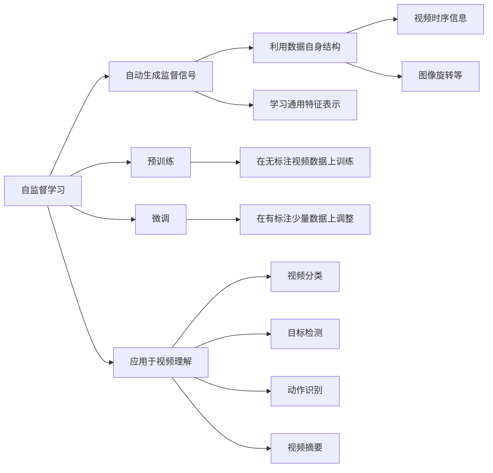

# 自监督学习在视频理解中的应用进展

> 关键词：自监督学习、视频理解、应用进展、无监督学习、计算机视觉

> 摘要：本文深入探讨了自监督学习在视频理解中的应用进展。首先介绍了自监督学习和视频理解的背景知识，包括目的、预期读者等。接着阐述了自监督学习和视频理解的核心概念及联系，给出了相应的文本示意图和Mermaid流程图。详细讲解了自监督学习用于视频理解的核心算法原理，并使用Python代码进行说明。同时介绍了相关的数学模型和公式，辅以举例说明。通过项目实战展示了代码的实际案例及详细解释。分析了自监督学习在视频理解中的实际应用场景，推荐了学习资源、开发工具框架以及相关论文著作。最后总结了未来发展趋势与挑战，并提供了常见问题与解答以及扩展阅读和参考资料。

## 1. 背景介绍 
### 1.1 目的和范围
本文章的主要目的是全面且深入地介绍自监督学习在视频理解领域的应用进展。在计算机视觉技术不断发展的当下，视频理解作为其重要分支，面临着标注数据成本高、数据规模大等挑战。自监督学习以其无需大量人工标注数据的优势，为视频理解提供了新的解决方案。本文将详细阐述自监督学习在视频理解中的原理、算法、应用场景等内容，旨在为相关研究人员、开发者和爱好者提供一个系统的知识体系和技术参考。

### 1.2 预期读者
本文的预期读者主要包括计算机视觉、人工智能领域的研究人员，他们可以从文中获取自监督学习在视频理解方面的最新研究动态和技术思路，为其研究工作提供参考；软件开发工程师和开发者，他们可以借鉴文中的算法和代码实现，将自监督学习应用到实际的视频理解项目中；以及对计算机视觉和人工智能感兴趣的学生和爱好者，帮助他们了解自监督学习和视频理解的基本概念和应用方法。

### 1.3 文档结构概述
本文共分为十个部分。第一部分为背景介绍，包括目的和范围、预期读者、文档结构概述和术语表。第二部分阐述自监督学习和视频理解的核心概念与联系，并给出文本示意图和Mermaid流程图。第三部分详细讲解核心算法原理，并使用Python代码进行说明。第四部分介绍相关的数学模型和公式，并举例说明。第五部分通过项目实战展示代码的实际案例及详细解释。第六部分分析自监督学习在视频理解中的实际应用场景。第七部分推荐学习资源、开发工具框架以及相关论文著作。第八部分总结未来发展趋势与挑战。第九部分为附录，提供常见问题与解答。第十部分给出扩展阅读和参考资料。

### 1.4 术语表
#### 1.4.1 核心术语定义
- **自监督学习（Self-Supervised Learning）**：是一种无监督学习方法，它通过自动生成监督信号来学习数据的特征表示，无需人工标注大量的数据。
- **视频理解（Video Understanding）**：指计算机对视频内容进行分析、解释和推理的能力，包括视频分类、目标检测、动作识别等任务。
- **预训练（Pretraining）**：在大规模无标注数据上进行模型训练，以学习通用的特征表示，为后续的具体任务提供初始化参数。
- **微调（Fine-tuning）**：在预训练模型的基础上，使用少量标注数据对模型进行进一步训练，以适应特定的任务。

#### 1.4.2 相关概念解释
- **无监督学习（Unsupervised Learning）**：是机器学习的一种类型，处理的是未标注的数据，旨在发现数据中的内在结构和模式。自监督学习是无监督学习的一种特殊形式。
- **计算机视觉（Computer Vision）**：是一门研究如何使计算机“看”的科学，通过对图像和视频的处理和分析，让计算机理解视觉信息。视频理解是计算机视觉的一个重要研究方向。

#### 1.4.3 缩略词列表
- **CNN（Convolutional Neural Network）**：卷积神经网络，是一种常用的深度学习模型，在图像和视频处理中广泛应用。
- **RNN（Recurrent Neural Network）**：循环神经网络，用于处理序列数据，在视频理解中可用于处理视频帧的时序信息。
- **Transformer**：一种基于注意力机制的深度学习模型，在自然语言处理和计算机视觉领域都取得了很好的效果。

## 2. 核心概念与联系 

### 自监督学习核心概念
自监督学习的核心思想是利用数据本身的结构和信息自动生成监督信号。例如，在图像领域，可以通过旋转图像并预测旋转角度来生成监督信号；在视频领域，可以利用视频的时序信息，如预测视频帧的顺序来进行学习。自监督学习的优势在于可以利用大量的无标注数据，从而学习到更通用的特征表示。

### 视频理解核心概念
视频理解是计算机视觉中的一个复杂任务，它需要处理视频中的空间和时间信息。视频理解的任务包括视频分类、目标检测、动作识别、视频摘要等。例如，视频分类是将视频分为不同的类别，如体育、电影、新闻等；动作识别是识别视频中人物的动作，如跑步、跳跃、挥手等。

### 自监督学习与视频理解的联系
自监督学习为视频理解提供了一种有效的解决方案。由于视频数据量巨大，人工标注成本高，自监督学习可以在无标注的视频数据上进行预训练，学习到视频的通用特征表示。然后，在有标注的少量数据上进行微调，以适应具体的视频理解任务。这样可以提高模型的性能，减少对标注数据的依赖。

### 文本示意图
```plaintext
自监督学习
|-- 自动生成监督信号
|   |-- 利用数据自身结构
|   |   |-- 视频时序信息
|   |   |-- 图像旋转等
|   |-- 学习通用特征表示
|
|-- 预训练
|   |-- 在无标注视频数据上训练
|
|-- 微调
|   |-- 在有标注少量数据上调整
|
|-- 应用于视频理解
    |-- 视频分类
    |-- 目标检测
    |-- 动作识别
    |-- 视频摘要
```

### Mermaid流程图


## 3. 核心算法原理 & 具体操作步骤 

### 基于对比学习的自监督学习算法原理
对比学习是自监督学习中常用的一种方法，其核心思想是将相似的数据样本拉近，不相似的数据样本推远。在视频理解中，对比学习可以利用视频的时序信息，将相邻的视频帧视为相似样本，不相邻的视频帧视为不相似样本。

以下是一个基于对比学习的自监督学习算法的Python代码示例：

```python
import torch
import torch.nn as nn
import torch.optim as optim
from torch.utils.data import DataLoader
import torchvision.transforms as transforms
from torchvision.datasets import VideoFolder

# 定义编码器网络
class Encoder(nn.Module):
    def __init__(self):
        super(Encoder, self).__init__()
        self.conv1 = nn.Conv3d(3, 64, kernel_size=(3, 3, 3), padding=(1, 1, 1))
        self.relu = nn.ReLU(inplace=True)
        self.pool = nn.MaxPool3d(kernel_size=(1, 2, 2), stride=(1, 2, 2))
        self.fc = nn.Linear(64 * 16 * 16, 128)

    def forward(self, x):
        x = self.conv1(x)
        x = self.relu(x)
        x = self.pool(x)
        x = x.view(-1, 64 * 16 * 16)
        x = self.fc(x)
        return x

# 定义对比损失函数
class ContrastiveLoss(nn.Module):
    def __init__(self, margin=2.0):
        super(ContrastiveLoss, self).__init__()
        self.margin = margin

    def forward(self, output1, output2, label):
        euclidean_distance = nn.functional.pairwise_distance(output1, output2)
        loss_contrastive = torch.mean((1 - label) * torch.pow(euclidean_distance, 2) +
                                      label * torch.pow(torch.clamp(self.margin - euclidean_distance, min=0.0), 2))
        return loss_contrastive

# 数据预处理
transform = transforms.Compose([
    transforms.Resize((64, 64)),
    transforms.ToTensor()
])

# 加载视频数据集
dataset = VideoFolder(root='path/to/video/dataset', transform=transform)
dataloader = DataLoader(dataset, batch_size=32, shuffle=True)

# 初始化编码器和损失函数
encoder = Encoder()
criterion = ContrastiveLoss()
optimizer = optim.Adam(encoder.parameters(), lr=0.001)

# 训练模型
num_epochs = 10
for epoch in range(num_epochs):
    running_loss = 0.0
    for i, (videos, _) in enumerate(dataloader):
        # 生成相似和不相似样本对
        batch_size = videos.size(0)
        indices = torch.randperm(batch_size)
        similar_pairs = (videos, videos[indices])
        labels = torch.zeros(batch_size)

        # 计算编码器输出
        output1 = encoder(similar_pairs[0])
        output2 = encoder(similar_pairs[1])

        # 计算损失
        loss = criterion(output1, output2, labels)

        # 反向传播和优化
        optimizer.zero_grad()
        loss.backward()
        optimizer.step()

        running_loss += loss.item()

    print(f'Epoch {epoch + 1}, Loss: {running_loss / len(dataloader)}')
```

### 具体操作步骤
1. **数据准备**：收集无标注的视频数据，并进行预处理，如调整视频大小、转换为张量等。
2. **模型定义**：定义编码器网络，用于提取视频的特征表示。
3. **损失函数定义**：定义对比损失函数，用于衡量相似和不相似样本对的距离。
4. **数据加载**：使用`DataLoader`加载视频数据集，方便批量处理。
5. **模型训练**：在无标注的视频数据上进行预训练，通过最小化对比损失来学习视频的特征表示。
6. **微调**：在有标注的少量数据上对预训练模型进行微调，以适应具体的视频理解任务。

## 4. 数学模型和公式 & 详细讲解 & 举例说明 

### 对比损失函数的数学模型和公式
对比损失函数的数学公式为：

$$
L_{contrastive} = \frac{1}{N} \sum_{i=1}^{N} (1 - y_i) d_i^2 + y_i \max(0, m - d_i)^2
$$

其中，$N$ 是样本对的数量，$y_i$ 是样本对的标签（$y_i = 0$ 表示相似样本对，$y_i = 1$ 表示不相似样本对），$d_i$ 是样本对之间的欧几里得距离，$m$ 是边际值。

### 详细讲解
- 对于相似样本对（$y_i = 0$），损失函数为 $d_i^2$，即样本对之间的欧几里得距离的平方。这意味着我们希望相似样本对的特征表示尽可能接近。
- 对于不相似样本对（$y_i = 1$），损失函数为 $\max(0, m - d_i)^2$。如果样本对之间的距离 $d_i$ 小于边际值 $m$，则损失函数不为零，我们希望将不相似样本对的特征表示推远；如果 $d_i$ 大于等于 $m$，则损失函数为零，说明不相似样本对已经足够远。

### 举例说明
假设我们有两个样本对：
- 样本对 1：相似样本对，特征表示分别为 $x_1 = [1, 2, 3]$ 和 $x_2 = [1.1, 2.1, 3.1]$，欧几里得距离 $d_1 = \sqrt{(1 - 1.1)^2 + (2 - 2.1)^2 + (3 - 3.1)^2} \approx 0.173$，标签 $y_1 = 0$。
- 样本对 2：不相似样本对，特征表示分别为 $x_3 = [1, 2, 3]$ 和 $x_4 = [5, 6, 7]$，欧几里得距离 $d_2 = \sqrt{(1 - 5)^2 + (2 - 6)^2 + (3 - 7)^2} \approx 6.93$，标签 $y_2 = 1$，边际值 $m = 2$。

则对比损失函数的值为：

$$
L_{contrastive} = \frac{1}{2} \times (0 \times 0.173^2 + 1 \times \max(0, 2 - 6.93)^2) = \frac{1}{2} \times 4.93^2 \approx 12.15
$$

## 5. 项目实战：代码实际案例和详细解释说明 

### 5.1  开发环境搭建
- **操作系统**：推荐使用Ubuntu 18.04或更高版本，也可以使用Windows 10。
- **Python环境**：安装Python 3.7或更高版本。
- **深度学习框架**：安装PyTorch，可根据自己的CUDA版本选择合适的安装方式。例如，使用以下命令安装PyTorch：
```bash
pip install torch torchvision torchaudio
```
- **其他依赖库**：安装`torchvision`、`numpy`、`matplotlib`等库。
```bash
pip install torchvision numpy matplotlib
```

### 5.2  源代码详细实现和代码解读
以下是一个完整的自监督学习在视频理解中的项目实战代码示例：

```python
import torch
import torch.nn as nn
import torch.optim as optim
from torch.utils.data import DataLoader
import torchvision.transforms as transforms
from torchvision.datasets import VideoFolder

# 定义编码器网络
class Encoder(nn.Module):
    def __init__(self):
        super(Encoder, self).__init__()
        self.conv1 = nn.Conv3d(3, 64, kernel_size=(3, 3, 3), padding=(1, 1, 1))
        self.relu = nn.ReLU(inplace=True)
        self.pool = nn.MaxPool3d(kernel_size=(1, 2, 2), stride=(1, 2, 2))
        self.fc = nn.Linear(64 * 16 * 16, 128)

    def forward(self, x):
        x = self.conv1(x)
        x = self.relu(x)
        x = self.pool(x)
        x = x.view(-1, 64 * 16 * 16)
        x = self.fc(x)
        return x

# 定义对比损失函数
class ContrastiveLoss(nn.Module):
    def __init__(self, margin=2.0):
        super(ContrastiveLoss, self).__init__()
        self.margin = margin

    def forward(self, output1, output2, label):
        euclidean_distance = nn.functional.pairwise_distance(output1, output2)
        loss_contrastive = torch.mean((1 - label) * torch.pow(euclidean_distance, 2) +
                                      label * torch.pow(torch.clamp(self.margin - euclidean_distance, min=0.0), 2))
        return loss_contrastive

# 数据预处理
transform = transforms.Compose([
    transforms.Resize((64, 64)),
    transforms.ToTensor()
])

# 加载视频数据集
dataset = VideoFolder(root='path/to/video/dataset', transform=transform)
dataloader = DataLoader(dataset, batch_size=32, shuffle=True)

# 初始化编码器和损失函数
encoder = Encoder()
criterion = ContrastiveLoss()
optimizer = optim.Adam(encoder.parameters(), lr=0.001)

# 训练模型
num_epochs = 10
for epoch in range(num_epochs):
    running_loss = 0.0
    for i, (videos, _) in enumerate(dataloader):
        # 生成相似和不相似样本对
        batch_size = videos.size(0)
        indices = torch.randperm(batch_size)
        similar_pairs = (videos, videos[indices])
        labels = torch.zeros(batch_size)

        # 计算编码器输出
        output1 = encoder(similar_pairs[0])
        output2 = encoder(similar_pairs[1])

        # 计算损失
        loss = criterion(output1, output2, labels)

        # 反向传播和优化
        optimizer.zero_grad()
        loss.backward()
        optimizer.step()

        running_loss += loss.item()

    print(f'Epoch {epoch + 1}, Loss: {running_loss / len(dataloader)}')

# 微调模型（假设用于视频分类任务）
from torchvision.models import resnet18

# 加载预训练的ResNet18模型
pretrained_model = resnet18(pretrained=False)
pretrained_model.fc = nn.Linear(pretrained_model.fc.in_features, 10)  # 假设分类类别为10类

# 将编码器的参数复制到ResNet18的卷积层
pretrained_model.conv1.weight.data = encoder.conv1.weight.data

# 定义微调的数据集和数据加载器
fine_tune_dataset = VideoFolder(root='path/to/fine_tune/dataset', transform=transform)
fine_tune_dataloader = DataLoader(fine_tune_dataset, batch_size=32, shuffle=True)

# 定义微调的损失函数和优化器
criterion_fine_tune = nn.CrossEntropyLoss()
optimizer_fine_tune = optim.Adam(pretrained_model.parameters(), lr=0.0001)

# 微调模型
num_fine_tune_epochs = 5
for epoch in range(num_fine_tune_epochs):
    running_loss = 0.0
    for i, (videos, labels) in enumerate(fine_tune_dataloader):
        outputs = pretrained_model(videos)
        loss = criterion_fine_tune(outputs, labels)

        optimizer_fine_tune.zero_grad()
        loss.backward()
        optimizer_fine_tune.step()

        running_loss += loss.item()

    print(f'Fine-tune Epoch {epoch + 1}, Loss: {running_loss / len(fine_tune_dataloader)}')
```

### 代码解读与分析
- **编码器网络**：`Encoder`类定义了一个简单的3D卷积神经网络，用于提取视频的特征表示。
- **对比损失函数**：`ContrastiveLoss`类实现了对比损失函数，用于衡量相似和不相似样本对的距离。
- **数据预处理**：使用`torchvision.transforms`对视频数据进行预处理，包括调整大小和转换为张量。
- **数据加载**：使用`VideoFolder`和`DataLoader`加载视频数据集，方便批量处理。
- **模型训练**：在无标注的视频数据上进行预训练，通过最小化对比损失来学习视频的特征表示。
- **微调模型**：加载预训练的ResNet18模型，并将编码器的参数复制到ResNet18的卷积层。然后在有标注的少量数据上进行微调，以适应视频分类任务。

## 6. 实际应用场景 
### 视频监控
在视频监控领域，自监督学习可以用于异常行为检测。通过在大量无标注的监控视频数据上进行预训练，模型可以学习到正常行为的特征表示。然后在有标注的异常行为数据上进行微调，从而能够准确地检测出监控视频中的异常行为，如盗窃、打架等。

### 智能交通
在智能交通系统中，自监督学习可以用于交通流量分析和车辆行为识别。通过对大量的交通视频数据进行自监督学习，模型可以学习到车辆的运动模式、交通标志和信号灯的特征。这有助于实现交通流量的实时监测、交通事故的预警和自动驾驶车辆的环境感知。

### 视频推荐
在视频推荐系统中，自监督学习可以用于视频内容理解和用户兴趣建模。通过对视频内容进行自监督学习，模型可以提取视频的语义特征，从而更好地理解视频的主题和内容。同时，结合用户的历史观看记录和交互行为，使用自监督学习可以更准确地建模用户的兴趣，提高视频推荐的准确性和个性化程度。

### 体育分析
在体育领域，自监督学习可以用于运动员动作分析和比赛结果预测。通过对大量的体育视频数据进行自监督学习，模型可以学习到运动员的各种动作特征和比赛的规律。这有助于教练对运动员的训练进行评估和指导，以及预测比赛的结果。

## 7. 工具和资源推荐
### 7.1 学习资源推荐
#### 7.1.1 书籍推荐
- 《深度学习》（Deep Learning）：由Ian Goodfellow、Yoshua Bengio和Aaron Courville撰写，是深度学习领域的经典教材，涵盖了深度学习的基本原理、算法和应用。
- 《计算机视觉：算法与应用》（Computer Vision: Algorithms and Applications）：由Richard Szeliski撰写，全面介绍了计算机视觉的各种算法和应用，包括视频理解相关的内容。
- 《动手学深度学习》（Dive into Deep Learning）：由阿斯顿·张、李沐等撰写，以动手实践为导向，详细介绍了深度学习的原理和实现，适合初学者学习。

#### 7.1.2 在线课程
- Coursera上的“深度学习专项课程”（Deep Learning Specialization）：由Andrew Ng教授授课，涵盖了深度学习的各个方面，包括卷积神经网络、循环神经网络等。
- edX上的“计算机视觉基础”（Foundations of Computer Vision）：由UC Berkeley的教授授课，介绍了计算机视觉的基本概念和算法。
- B站（哔哩哔哩）上有许多关于深度学习和计算机视觉的教学视频，如李沐的“动手学深度学习”系列视频，讲解详细，适合初学者。

#### 7.1.3 技术博客和网站
- Medium：是一个技术博客平台，有许多关于深度学习和计算机视觉的优秀文章，如Towards Data Science板块。
- arXiv：是一个预印本论文平台，提供了最新的学术研究成果，包括自监督学习和视频理解领域的论文。
- GitHub：是一个开源代码托管平台，有许多关于自监督学习和视频理解的开源项目，可以参考学习。

### 7.2 开发工具框架推荐
#### 7.2.1 IDE和编辑器
- PyCharm：是一款专业的Python集成开发环境，提供了丰富的代码编辑、调试和项目管理功能，适合Python深度学习项目的开发。
- Jupyter Notebook：是一个交互式的开发环境，可以将代码、文本和可视化结果整合在一起，方便进行数据分析和模型实验。
- Visual Studio Code：是一款轻量级的代码编辑器，支持多种编程语言和插件，适合快速开发和调试代码。

#### 7.2.2 调试和性能分析工具
- PyTorch Profiler：是PyTorch自带的性能分析工具，可以帮助开发者分析模型的运行时间、内存使用等情况，优化模型性能。
- TensorBoard：是TensorFlow的可视化工具，也可以与PyTorch结合使用，用于可视化模型的训练过程、损失曲线等。
- cProfile：是Python的内置性能分析工具，可以分析代码的执行时间和函数调用次数，帮助开发者找出代码中的性能瓶颈。

#### 7.2.3 相关框架和库
- PyTorch：是一个开源的深度学习框架，提供了丰富的神经网络层和优化算法，支持GPU加速，广泛应用于计算机视觉和自然语言处理领域。
- OpenCV：是一个开源的计算机视觉库，提供了各种图像处理和视频处理的函数和工具，如视频读取、图像滤波、特征提取等。
- FFmpeg：是一个开源的音视频处理工具，可用于视频的解码、编码、剪辑等操作，在视频理解项目中经常会用到。

### 7.3 相关论文著作推荐
#### 7.3.1 经典论文
- “A Simple Framework for Contrastive Learning of Visual Representations”：提出了一种简单的对比学习框架，在图像表示学习中取得了很好的效果，也为视频理解中的自监督学习提供了思路。
- “Self-Supervised Video Representation Learning with Odd-One-Out Networks”：介绍了一种基于“Odd-One-Out”网络的自监督学习方法，用于视频表示学习。
- “Long-Term Feature Banks for Detailed Video Understanding”：提出了一种长期特征库的方法，用于详细的视频理解，提高了模型对视频中长时序信息的处理能力。

#### 7.3.2 最新研究成果
- 可以关注arXiv上最新的研究论文，搜索关键词如“Self-Supervised Learning in Video Understanding”，了解该领域的最新研究动态和技术进展。
- 参加计算机视觉领域的顶级学术会议，如CVPR、ICCV、ECCV等，这些会议会收录该领域的最新研究成果。

#### 7.3.3 应用案例分析
- 可以在ACM Digital Library、IEEE Xplore等学术数据库中搜索关于自监督学习在视频理解中的应用案例分析论文，了解实际应用中的问题和解决方案。
- 一些知名科技公司的技术博客，如Google AI Blog、Facebook AI Research等，也会分享他们在自监督学习和视频理解方面的应用案例和研究成果。

## 8. 总结：未来发展趋势与挑战
### 未来发展趋势
- **多模态融合**：未来自监督学习在视频理解中的应用将更加注重多模态融合，如结合音频、文本等信息，以更全面地理解视频内容。例如，在视频分类任务中，同时考虑视频的视觉信息和音频信息，可以提高分类的准确性。
- **大规模预训练模型**：随着计算资源的不断提升，大规模预训练模型将在视频理解中发挥更大的作用。通过在更大规模的无标注视频数据上进行预训练，可以学习到更通用和强大的特征表示，从而在各种视频理解任务中取得更好的性能。
- **可解释性研究**：自监督学习模型的可解释性将成为未来的研究热点。由于视频理解任务往往涉及到安全和决策等重要领域，需要模型能够解释其决策过程和结果。因此，研究如何提高自监督学习模型的可解释性具有重要的现实意义。
- **实时视频理解**：在一些实时应用场景中，如智能监控、自动驾驶等，需要模型能够实时处理视频数据。未来的研究将致力于提高自监督学习模型的实时处理能力，以满足这些应用场景的需求。

### 挑战
- **数据质量和多样性**：虽然自监督学习可以利用大量的无标注数据，但数据的质量和多样性仍然是一个挑战。低质量的数据可能会导致模型学习到错误的特征表示，而数据的多样性不足可能会限制模型的泛化能力。
- **计算资源需求**：大规模预训练模型需要大量的计算资源，包括GPU和内存等。这对于一些小型研究机构和开发者来说是一个很大的挑战。如何在有限的计算资源下进行高效的自监督学习是一个需要解决的问题。
- **模型评估指标**：目前，自监督学习在视频理解中的评估指标还不够完善。传统的评估指标往往是基于有监督学习的，不能很好地反映自监督学习模型的性能。因此，需要研究和开发更适合自监督学习的评估指标。
- **隐私和安全问题**：在使用大量的视频数据进行自监督学习时，可能会涉及到隐私和安全问题。例如，视频数据中可能包含个人敏感信息，需要采取有效的措施来保护数据的隐私和安全。

## 9. 附录：常见问题与解答
### 问题1：自监督学习和有监督学习有什么区别？
答：有监督学习需要大量的人工标注数据，模型通过学习标注数据的特征和标签之间的关系来进行预测。而自监督学习无需人工标注数据，它通过自动生成监督信号来学习数据的特征表示。自监督学习可以利用大量的无标注数据，从而学习到更通用的特征表示。

### 问题2：自监督学习在视频理解中的应用有哪些优势？
答：自监督学习在视频理解中的应用具有以下优势：
- 减少对标注数据的依赖：视频数据量巨大，人工标注成本高。自监督学习可以在无标注的视频数据上进行预训练，减少了对标注数据的需求。
- 学习更通用的特征表示：通过在大规模无标注数据上学习，自监督学习可以学习到更通用的特征表示，从而在各种视频理解任务中取得更好的性能。
- 提高模型的泛化能力：自监督学习可以学习到数据的内在结构和模式，提高模型的泛化能力，使其在未见过的数据上也能有较好的表现。

### 问题3：如何选择合适的自监督学习算法用于视频理解？
答：选择合适的自监督学习算法需要考虑以下因素：
- 数据特点：不同的自监督学习算法适用于不同类型的数据。例如，基于对比学习的算法适用于具有相似和不相似样本对的数据；基于预测的算法适用于具有时序信息的数据。
- 任务需求：不同的视频理解任务对模型的要求不同。例如，视频分类任务更注重全局特征的学习，而动作识别任务更注重时序特征的学习。
- 计算资源：一些自监督学习算法需要大量的计算资源，如大规模预训练模型。在选择算法时，需要考虑自己的计算资源是否能够支持。

### 问题4：自监督学习模型的训练时间通常需要多长？
答：自监督学习模型的训练时间取决于多个因素，如数据规模、模型复杂度、计算资源等。一般来说，在大规模无标注数据上进行预训练可能需要数天甚至数周的时间。而在有标注的少量数据上进行微调的时间相对较短，可能只需要几个小时到几天的时间。

## 10. 扩展阅读 & 参考资料
### 扩展阅读
- 《深度学习进阶：自然语言处理》：深入介绍了深度学习在自然语言处理领域的应用，其中一些技术和思想也可以借鉴到视频理解中。
- 《人工智能：现代方法》：全面介绍了人工智能的基本概念、算法和应用，对理解自监督学习和视频理解的背景知识有很大帮助。
- 《视觉SLAM十四讲：从理论到实践》：介绍了视觉同步定位与地图构建（SLAM）的相关知识，与视频理解中的场景理解和目标跟踪等任务有一定的关联。

### 参考资料
- Goodfellow, I., Bengio, Y., & Courville, A. (2016). Deep Learning. MIT Press.
- Szeliski, R. (2010). Computer Vision: Algorithms and Applications. Springer.
- Zhang, A., Lipton, Z. C., Li, M., & Smola, A. J. (2020). Dive into Deep Learning. 
- Chen, T., Kornblith, S., Norouzi, M., & Hinton, G. (2020). A Simple Framework for Contrastive Learning of Visual Representations. arXiv preprint arXiv:2002.05709.
- Misra, I., & Maaten, L. v. d. (2019). Self-Supervised Video Representation Learning with Odd-One-Out Networks. arXiv preprint arXiv:1901.09697.
- Zhou, C., Kalantidis, Y., Rodriguez, M., & Karatzas, D. (2019). Long-Term Feature Banks for Detailed Video Understanding. arXiv preprint arXiv:1904.06833.

作者：AI天才研究院/AI Genius Institute & 禅与计算机程序设计艺术 /Zen And The Art of Computer Programming