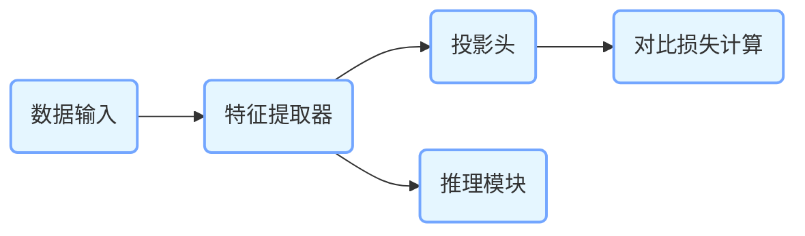

# 自监督对比学习在表示学习推理中的应用

> 关键词：自监督对比学习、表示学习、推理、特征提取、无监督学习

> 摘要：本文深入探讨了自监督对比学习在表示学习推理中的应用。首先介绍了自监督对比学习和表示学习推理的背景知识，包括其目的、预期读者和文档结构。接着阐述了核心概念与联系，通过文本示意图和Mermaid流程图展示了自监督对比学习与表示学习推理的架构。详细讲解了核心算法原理，并给出Python源代码示例。通过数学模型和公式进一步分析其原理，同时举例说明。在项目实战部分，搭建开发环境，给出实际代码案例并进行详细解读。还介绍了自监督对比学习在表示学习推理中的实际应用场景，推荐了相关的学习资源、开发工具框架和论文著作。最后总结了未来发展趋势与挑战，解答了常见问题，并提供扩展阅读和参考资料。

## 1. 背景介绍 
### 1.1 目的和范围
自监督对比学习是近年来机器学习领域的研究热点，它旨在通过设计合适的对比损失函数，让模型在无监督或弱监督的情况下学习到数据的有效表示。表示学习推理则是利用这些学习到的表示进行后续的推理任务，如分类、预测等。本文的目的是全面介绍自监督对比学习在表示学习推理中的应用，包括其原理、算法、实际应用场景等，范围涵盖理论基础、算法实现和实际项目应用。

### 1.2 预期读者
本文预期读者为对机器学习、深度学习有一定基础的研究人员、工程师和学生。读者需要了解基本的神经网络知识，如卷积神经网络（CNN）、循环神经网络（RNN）等，以及常见的损失函数和优化算法。

### 1.3 文档结构概述
本文首先介绍自监督对比学习和表示学习推理的相关背景知识，包括术语定义和概念解释。然后详细阐述核心概念与联系，通过文本示意图和Mermaid流程图展示其架构。接着讲解核心算法原理，并给出Python源代码示例。通过数学模型和公式进一步分析原理并举例说明。在项目实战部分，搭建开发环境，给出实际代码案例并进行详细解读。介绍实际应用场景，推荐相关学习资源、开发工具框架和论文著作。最后总结未来发展趋势与挑战，解答常见问题，提供扩展阅读和参考资料。

### 1.4 术语表
#### 1.4.1 核心术语定义
- **自监督对比学习（Self-supervised Contrastive Learning）**：一种无监督学习方法，通过对比正样本对和负样本对的特征表示，让模型学习到数据的有效特征。
- **表示学习（Representation Learning）**：自动从原始数据中学习到有用的特征表示，使得这些表示能够更好地用于后续的任务。
- **推理（Inference）**：利用学习到的模型和特征表示，对新的数据进行预测或分类等任务。
- **正样本对（Positive Pairs）**：在自监督对比学习中，具有相似语义信息的数据对。
- **负样本对（Negative Pairs）**：在自监督对比学习中，具有不同语义信息的数据对。

#### 1.4.2 相关概念解释
- **对比损失（Contrastive Loss）**：用于衡量正样本对和负样本对之间的相似度差异，促使模型学习到能够区分不同样本的特征表示。
- **特征提取器（Feature Extractor）**：用于从原始数据中提取特征的神经网络模型。
- **投影头（Projection Head）**：在自监督对比学习中，用于将特征提取器输出的特征映射到一个低维空间，以便进行对比学习。

#### 1.4.3 缩略词列表
- **CNN（Convolutional Neural Network）**：卷积神经网络
- **RNN（Recurrent Neural Network）**：循环神经网络
- **MLP（Multi-Layer Perceptron）**：多层感知机
- **SGD（Stochastic Gradient Descent）**：随机梯度下降

## 2. 核心概念与联系 

### 核心概念原理
自监督对比学习的核心思想是通过构建正样本对和负样本对，让模型学习到能够区分不同样本的特征表示。具体来说，对于一个输入样本，通过数据增强等方式生成其正样本，同时从数据集中随机选取其他样本作为负样本。模型的目标是让正样本对的特征表示在特征空间中更加接近，而负样本对的特征表示更加远离。

表示学习推理则是在自监督对比学习学习到的特征表示基础上，进行后续的推理任务。例如，将学习到的特征输入到分类器中进行分类，或者用于预测任务。

### 架构的文本示意图
自监督对比学习在表示学习推理中的架构主要包括以下几个部分：
1. **数据输入**：原始的输入数据，如图像、文本等。
2. **特征提取器**：对输入数据进行特征提取，得到高维的特征表示。
3. **投影头**：将特征提取器输出的特征映射到一个低维空间，以便进行对比学习。
4. **对比损失计算**：计算正样本对和负样本对之间的对比损失。
5. **推理模块**：利用学习到的特征表示进行后续的推理任务，如分类、预测等。

### Mermaid流程图


## 3. 核心算法原理 & 具体操作步骤 

### 核心算法原理
自监督对比学习的核心算法通常基于对比损失函数，常见的对比损失函数有InfoNCE（Info Noise Contrastive Estimation）损失。InfoNCE损失的目标是最大化正样本对之间的相似度，同时最小化负样本对之间的相似度。

假设我们有一个样本 $x$，通过数据增强生成其正样本 $x^+$，同时从数据集中随机选取 $N$ 个负样本 $x_1^-, x_2^-, \cdots, x_N^-$。设特征提取器和投影头的组合为 $f$，则 $f(x)$、$f(x^+)$ 和 $f(x_i^-)$ 分别表示样本 $x$、正样本 $x^+$ 和负样本 $x_i^-$ 的特征表示。

InfoNCE损失的计算公式为：
$$
\mathcal{L}_{InfoNCE} = -\log \frac{\exp(\text{sim}(f(x), f(x^+)) / \tau)}{\exp(\text{sim}(f(x), f(x^+)) / \tau) + \sum_{i=1}^{N} \exp(\text{sim}(f(x), f(x_i^-)) / \tau)}
$$
其中，$\text{sim}(\cdot, \cdot)$ 表示相似度函数，通常使用余弦相似度；$\tau$ 是温度参数，用于控制相似度的分布。

### 具体操作步骤
1. **数据准备**：准备输入数据集，并进行数据增强，生成正样本对和负样本对。
2. **模型初始化**：初始化特征提取器和投影头的参数。
3. **训练过程**：
    - 对于每个训练批次，计算正样本对和负样本对的特征表示。
    - 计算InfoNCE损失。
    - 使用优化算法（如SGD、Adam等）更新模型参数。
4. **推理过程**：
    - 训练完成后，固定特征提取器的参数。
    - 将学习到的特征输入到推理模块中进行后续的推理任务。

### Python源代码示例
```python
import torch
import torch.nn as nn
import torch.optim as optim
import torch.nn.functional as F

# 定义特征提取器
class FeatureExtractor(nn.Module):
    def __init__(self):
        super(FeatureExtractor, self).__init__()
        self.conv1 = nn.Conv2d(3, 64, kernel_size=3, padding=1)
        self.pool = nn.MaxPool2d(2, 2)
        self.conv2 = nn.Conv2d(64, 128, kernel_size=3, padding=1)
        self.fc1 = nn.Linear(128 * 8 * 8, 256)

    def forward(self, x):
        x = self.pool(F.relu(self.conv1(x)))
        x = self.pool(F.relu(self.conv2(x)))
        x = x.view(-1, 128 * 8 * 8)
        x = F.relu(self.fc1(x))
        return x

# 定义投影头
class ProjectionHead(nn.Module):
    def __init__(self):
        super(ProjectionHead, self).__init__()
        self.fc1 = nn.Linear(256, 128)
        self.fc2 = nn.Linear(128, 64)

    def forward(self, x):
        x = F.relu(self.fc1(x))
        x = self.fc2(x)
        return x

# 定义InfoNCE损失函数
def info_nce_loss(features, temperature=0.1):
    labels = torch.arange(features.shape[0] // 2, dtype=torch.long).to(features.device)
    features = F.normalize(features, dim=1)
    similarity_matrix = torch.matmul(features, features.T)
    positive_mask = torch.eye(features.shape[0], dtype=torch.bool).to(features.device)
    positive_mask = positive_mask | positive_mask.T
    negative_mask = ~positive_mask
    positive_similarities = similarity_matrix[positive_mask].view(features.shape[0], 1)
    negative_similarities = similarity_matrix[negative_mask].view(features.shape[0], -1)
    logits = torch.cat([positive_similarities, negative_similarities], dim=1)
    logits /= temperature
    loss = F.cross_entropy(logits, labels)
    return loss

# 训练过程
def train(model, feature_extractor, projection_head, optimizer, train_loader, num_epochs=10):
    model.train()
    for epoch in range(num_epochs):
        running_loss = 0.0
        for inputs, _ in train_loader:
            inputs = inputs.to(device)
            features = feature_extractor(inputs)
            projected_features = projection_head(features)
            loss = info_nce_loss(projected_features)
            optimizer.zero_grad()
            loss.backward()
            optimizer.step()
            running_loss += loss.item()
        print(f'Epoch {epoch + 1}, Loss: {running_loss / len(train_loader)}')

# 推理过程
def inference(model, feature_extractor, test_loader):
    model.eval()
    correct = 0
    total = 0
    with torch.no_grad():
        for inputs, labels in test_loader:
            inputs = inputs.to(device)
            labels = labels.to(device)
            features = feature_extractor(inputs)
            outputs = model(features)
            _, predicted = torch.max(outputs.data, 1)
            total += labels.size(0)
            correct += (predicted == labels).sum().item()
    print(f'Accuracy: {100 * correct / total}%')

# 主函数
if __name__ == '__main__':
    device = torch.device("cuda" if torch.cuda.is_available() else "cpu")
    feature_extractor = FeatureExtractor().to(device)
    projection_head = ProjectionHead().to(device)
    model = nn.Linear(256, 10).to(device)  # 假设是10分类任务
    optimizer = optim.Adam(list(feature_extractor.parameters()) + list(projection_head.parameters()), lr=0.001)

    # 这里假设已经有了训练和测试数据加载器
    train_loader = None
    test_loader = None

    train(model, feature_extractor, projection_head, optimizer, train_loader)
    inference(model, feature_extractor, test_loader)
```

## 4. 数学模型和公式 & 详细讲解 & 举例说明 

### 数学模型和公式
#### InfoNCE损失公式
如前文所述，InfoNCE损失的计算公式为：
$$
\mathcal{L}_{InfoNCE} = -\log \frac{\exp(\text{sim}(f(x), f(x^+)) / \tau)}{\exp(\text{sim}(f(x), f(x^+)) / \tau) + \sum_{i=1}^{N} \exp(\text{sim}(f(x), f(x_i^-)) / \tau)}
$$
其中，$\text{sim}(a, b)$ 表示向量 $a$ 和 $b$ 的余弦相似度，计算公式为：
$$
\text{sim}(a, b) = \frac{a \cdot b}{\|a\| \|b\|}
$$
$\tau$ 是温度参数，用于控制相似度的分布。当 $\tau$ 较小时，相似度的分布会更加尖锐，模型会更加关注正样本对和负样本对之间的差异；当 $\tau$ 较大时，相似度的分布会更加平滑，模型会更加关注整体的特征表示。

### 详细讲解
InfoNCE损失的目标是最大化正样本对之间的相似度，同时最小化负样本对之间的相似度。通过对数函数的作用，将相似度的比值转化为损失值，使得模型在训练过程中能够朝着正确的方向进行优化。

具体来说，分子 $\exp(\text{sim}(f(x), f(x^+)) / \tau)$ 表示正样本对之间的相似度得分，分母 $\exp(\text{sim}(f(x), f(x^+)) / \tau) + \sum_{i=1}^{N} \exp(\text{sim}(f(x), f(x_i^-)) / \tau)$ 表示正样本对和所有负样本对之间的相似度得分之和。通过取对数和取负号，将最大化正样本对相似度和最小化负样本对相似度的问题转化为最小化损失函数的问题。

### 举例说明
假设我们有一个样本 $x$，其正样本为 $x^+$，负样本为 $x_1^-$ 和 $x_2^-$。特征提取器和投影头输出的特征表示分别为 $f(x) = [0.1, 0.2, 0.3]$，$f(x^+) = [0.11, 0.21, 0.31]$，$f(x_1^-) = [0.4, 0.5, 0.6]$，$f(x_2^-) = [0.7, 0.8, 0.9]$。温度参数 $\tau = 0.1$。

首先计算余弦相似度：
$$
\text{sim}(f(x), f(x^+)) = \frac{0.1 \times 0.11 + 0.2 \times 0.21 + 0.3 \times 0.31}{\sqrt{0.1^2 + 0.2^2 + 0.3^2} \sqrt{0.11^2 + 0.21^2 + 0.31^2}} \approx 0.99
$$
$$
\text{sim}(f(x), f(x_1^-)) = \frac{0.1 \times 0.4 + 0.2 \times 0.5 + 0.3 \times 0.6}{\sqrt{0.1^2 + 0.2^2 + 0.3^2} \sqrt{0.4^2 + 0.5^2 + 0.6^2}} \approx 0.8
$$
$$
\text{sim}(f(x), f(x_2^-)) = \frac{0.1 \times 0.7 + 0.2 \times 0.8 + 0.3 \times 0.9}{\sqrt{0.1^2 + 0.2^2 + 0.3^2} \sqrt{0.7^2 + 0.8^2 + 0.9^2}} \approx 0.7
$$

然后计算InfoNCE损失：
$$
\mathcal{L}_{InfoNCE} = -\log \frac{\exp(0.99 / 0.1)}{\exp(0.99 / 0.1) + \exp(0.8 / 0.1) + \exp(0.7 / 0.1)}
$$

## 5. 项目实战：代码实际案例和详细解释说明 

### 5.1  开发环境搭建
#### 操作系统
推荐使用Linux系统，如Ubuntu 18.04或更高版本。

#### Python环境
使用Python 3.7或更高版本。可以使用Anaconda来管理Python环境，具体步骤如下：
1. 下载并安装Anaconda：https://www.anaconda.com/products/individual
2. 创建一个新的Python环境：
```bash
conda create -n self_supervised_learning python=3.8
conda activate self_supervised_learning
```

#### 深度学习框架
使用PyTorch作为深度学习框架，安装命令如下：
```bash
pip install torch torchvision
```

#### 其他依赖库
安装其他必要的依赖库，如NumPy、Matplotlib等：
```bash
pip install numpy matplotlib
```

### 5.2  源代码详细实现和代码解读
#### 数据加载
```python
import torch
from torchvision import datasets, transforms

# 定义数据增强
train_transform = transforms.Compose([
    transforms.RandomResizedCrop(32),
    transforms.RandomHorizontalFlip(p=0.5),
    transforms.ToTensor(),
    transforms.Normalize((0.5, 0.5, 0.5), (0.5, 0.5, 0.5))
])

# 加载训练数据集
train_dataset = datasets.CIFAR10(root='./data', train=True,
                                 download=True, transform=train_transform)
train_loader = torch.utils.data.DataLoader(train_dataset, batch_size=64,
                                           shuffle=True)

# 加载测试数据集
test_transform = transforms.Compose([
    transforms.ToTensor(),
    transforms.Normalize((0.5, 0.5, 0.5), (0.5, 0.5, 0.5))
])
test_dataset = datasets.CIFAR10(root='./data', train=False,
                                download=True, transform=test_transform)
test_loader = torch.utils.data.DataLoader(test_dataset, batch_size=64,
                                          shuffle=False)
```
代码解读：
- 定义了训练集和测试集的数据增强方式，训练集使用了随机裁剪和水平翻转等增强操作。
- 使用`torchvision.datasets.CIFAR10`加载CIFAR-10数据集。
- 使用`torch.utils.data.DataLoader`创建数据加载器，方便批量加载数据。

#### 模型定义
```python
import torch.nn as nn

# 定义特征提取器
class FeatureExtractor(nn.Module):
    def __init__(self):
        super(FeatureExtractor, self).__init__()
        self.conv1 = nn.Conv2d(3, 64, kernel_size=3, padding=1)
        self.pool = nn.MaxPool2d(2, 2)
        self.conv2 = nn.Conv2d(64, 128, kernel_size=3, padding=1)
        self.fc1 = nn.Linear(128 * 8 * 8, 256)

    def forward(self, x):
        x = self.pool(nn.functional.relu(self.conv1(x)))
        x = self.pool(nn.functional.relu(self.conv2(x)))
        x = x.view(-1, 128 * 8 * 8)
        x = nn.functional.relu(self.fc1(x))
        return x

# 定义投影头
class ProjectionHead(nn.Module):
    def __init__(self):
        super(ProjectionHead, self).__init__()
        self.fc1 = nn.Linear(256, 128)
        self.fc2 = nn.Linear(128, 64)

    def forward(self, x):
        x = nn.functional.relu(self.fc1(x))
        x = self.fc2(x)
        return x

# 定义分类器
class Classifier(nn.Module):
    def __init__(self):
        super(Classifier, self).__init__()
        self.fc = nn.Linear(256, 10)

    def forward(self, x):
        x = self.fc(x)
        return x
```
代码解读：
- `FeatureExtractor`是一个简单的卷积神经网络，用于提取图像的特征。
- `ProjectionHead`是一个多层感知机，用于将特征提取器输出的特征映射到一个低维空间。
- `Classifier`是一个全连接层，用于将特征提取器输出的特征进行分类。

#### 训练过程
```python
import torch.optim as optim

# 初始化模型
feature_extractor = FeatureExtractor()
projection_head = ProjectionHead()
classifier = Classifier()

# 定义优化器
optimizer = optim.Adam(list(feature_extractor.parameters()) + list(projection_head.parameters()), lr=0.001)

# 定义损失函数
def info_nce_loss(features, temperature=0.1):
    labels = torch.arange(features.shape[0] // 2, dtype=torch.long)
    features = nn.functional.normalize(features, dim=1)
    similarity_matrix = torch.matmul(features, features.T)
    positive_mask = torch.eye(features.shape[0], dtype=torch.bool)
    positive_mask = positive_mask | positive_mask.T
    negative_mask = ~positive_mask
    positive_similarities = similarity_matrix[positive_mask].view(features.shape[0], 1)
    negative_similarities = similarity_matrix[negative_mask].view(features.shape[0], -1)
    logits = torch.cat([positive_similarities, negative_similarities], dim=1)
    logits /= temperature
    loss = nn.functional.cross_entropy(logits, labels)
    return loss

# 训练自监督对比学习模型
num_epochs = 10
for epoch in range(num_epochs):
    running_loss = 0.0
    for inputs, _ in train_loader:
        optimizer.zero_grad()
        features = feature_extractor(inputs)
        projected_features = projection_head(features)
        loss = info_nce_loss(projected_features)
        loss.backward()
        optimizer.step()
        running_loss += loss.item()
    print(f'Epoch {epoch + 1}, Loss: {running_loss / len(train_loader)}')

# 固定特征提取器的参数
for param in feature_extractor.parameters():
    param.requires_grad = False

# 训练分类器
optimizer = optim.Adam(classifier.parameters(), lr=0.001)
criterion = nn.CrossEntropyLoss()
num_epochs = 5
for epoch in range(num_epochs):
    running_loss = 0.0
    for inputs, labels in train_loader:
        optimizer.zero_grad()
        features = feature_extractor(inputs)
        outputs = classifier(features)
        loss = criterion(outputs, labels)
        loss.backward()
        optimizer.step()
        running_loss += loss.item()
    print(f'Epoch {epoch + 1}, Loss: {running_loss / len(train_loader)}')
```
代码解读：
- 初始化特征提取器、投影头和分类器。
- 定义优化器和InfoNCE损失函数。
- 训练自监督对比学习模型，通过InfoNCE损失函数让模型学习到数据的有效特征表示。
- 固定特征提取器的参数，只训练分类器，将学习到的特征用于分类任务。

#### 测试过程
```python
correct = 0
total = 0
with torch.no_grad():
    for inputs, labels in test_loader:
        features = feature_extractor(inputs)
        outputs = classifier(features)
        _, predicted = torch.max(outputs.data, 1)
        total += labels.size(0)
        correct += (predicted == labels).sum().item()

print(f'Accuracy: {100 * correct / total}%')
```
代码解读：
- 在测试集上进行测试，计算分类准确率。

### 5.3  代码解读与分析
#### 自监督对比学习阶段
在自监督对比学习阶段，模型的目标是学习到数据的有效特征表示。通过InfoNCE损失函数，模型尝试让正样本对的特征表示在特征空间中更加接近，而负样本对的特征表示更加远离。在训练过程中，不断更新特征提取器和投影头的参数，使得模型能够学习到更好的特征表示。

#### 分类阶段
在分类阶段，固定特征提取器的参数，只训练分类器。将学习到的特征输入到分类器中，通过交叉熵损失函数进行训练，使得分类器能够根据特征进行准确的分类。

#### 整体效果
通过自监督对比学习，模型能够在无监督的情况下学习到数据的有效特征表示，然后将这些特征用于分类任务，提高了分类的准确率。同时，自监督对比学习可以减少对标注数据的依赖，降低了数据标注的成本。

## 6. 实际应用场景 
### 计算机视觉领域
- **图像分类**：在大规模图像数据集上进行自监督对比学习，学习到的特征可以用于图像分类任务。例如，在ImageNet数据集上进行预训练，然后将学习到的特征迁移到其他图像分类任务中，提高分类的准确率。
- **目标检测**：自监督对比学习可以学习到图像中物体的特征表示，这些特征可以用于目标检测任务。例如，在Faster R-CNN等目标检测模型中，使用自监督对比学习学习到的特征作为输入，提高目标检测的性能。
- **图像分割**：在图像分割任务中，自监督对比学习可以学习到图像中不同区域的特征表示，从而提高图像分割的准确性。例如，在U-Net等图像分割模型中，使用自监督对比学习学习到的特征作为输入，提高图像分割的效果。

### 自然语言处理领域
- **文本分类**：在大规模文本数据集上进行自监督对比学习，学习到的文本特征可以用于文本分类任务。例如，在IMDB影评数据集上进行预训练，然后将学习到的特征迁移到其他文本分类任务中，提高分类的准确率。
- **情感分析**：自监督对比学习可以学习到文本中的情感特征，从而用于情感分析任务。例如，在社交媒体数据上进行自监督对比学习，学习到的特征可以用于判断文本的情感倾向。
- **机器翻译**：在机器翻译任务中，自监督对比学习可以学习到源语言和目标语言的特征表示，从而提高机器翻译的质量。例如，在WMT等机器翻译数据集上进行预训练，然后将学习到的特征用于机器翻译模型中。

### 音频处理领域
- **语音识别**：在大规模语音数据集上进行自监督对比学习，学习到的语音特征可以用于语音识别任务。例如，在LibriSpeech等语音数据集上进行预训练，然后将学习到的特征迁移到其他语音识别任务中，提高语音识别的准确率。
- **音频分类**：自监督对比学习可以学习到音频的特征表示，从而用于音频分类任务。例如，在UrbanSound8K等音频数据集上进行自监督对比学习，学习到的特征可以用于判断音频的类别。
- **音乐推荐**：在音乐推荐系统中，自监督对比学习可以学习到音乐的特征表示，从而提高音乐推荐的准确性。例如，根据用户的音乐历史记录和偏好，使用自监督对比学习学习到的特征进行音乐推荐。

## 7. 工具和资源推荐
### 7.1 学习资源推荐
#### 7.1.1 书籍推荐
- 《深度学习》（Deep Learning）：由Ian Goodfellow、Yoshua Bengio和Aaron Courville所著，是深度学习领域的经典教材，涵盖了深度学习的基本概念、算法和应用。
- 《动手学深度学习》（Dive into Deep Learning）：由李沐等人所著，以实战为导向，通过大量的代码示例和详细的解释，帮助读者快速掌握深度学习的知识和技能。
- 《机器学习》（Machine Learning）：由周志华所著，是机器学习领域的优秀教材，系统地介绍了机器学习的基本概念、算法和应用。

#### 7.1.2 在线课程
- Coursera上的“深度学习专项课程”（Deep Learning Specialization）：由Andrew Ng教授主讲，包括五门课程，涵盖了深度学习的基础知识、卷积神经网络、循环神经网络等内容。
- edX上的“使用Python进行数据科学”（Data Science with Python）：介绍了Python在数据科学中的应用，包括数据处理、机器学习、深度学习等内容。
- 哔哩哔哩上的“李宏毅机器学习课程”：由李宏毅教授主讲，课程内容生动有趣，适合初学者学习机器学习和深度学习的知识。

#### 7.1.3 技术博客和网站
- Medium：一个技术博客平台，上面有很多关于机器学习、深度学习的优质文章。
- arXiv：一个预印本论文平台，上面有很多最新的机器学习、深度学习研究成果。
- Kaggle：一个数据科学竞赛平台，上面有很多数据集和开源代码，可以帮助读者学习和实践机器学习和深度学习的知识。

### 7.2 开发工具框架推荐
#### 7.2.1 IDE和编辑器
- PyCharm：一个专业的Python集成开发环境，提供了丰富的功能，如代码编辑、调试、版本控制等。
- Jupyter Notebook：一个交互式的开发环境，适合进行数据分析和模型实验，支持Python、R等多种编程语言。
- Visual Studio Code：一个轻量级的代码编辑器，支持多种编程语言和插件，具有丰富的扩展功能。

#### 7.2.2 调试和性能分析工具
- PyTorch Profiler：PyTorch自带的性能分析工具，可以帮助用户分析模型的性能瓶颈，如计算时间、内存使用等。
- TensorBoard：一个可视化工具，可以帮助用户可视化模型的训练过程和性能指标，如损失函数、准确率等。
- cProfile：Python自带的性能分析工具，可以帮助用户分析Python代码的性能瓶颈，如函数调用时间、内存使用等。

#### 7.2.3 相关框架和库
- PyTorch：一个开源的深度学习框架，提供了丰富的深度学习模型和工具，支持GPU加速，易于使用和扩展。
- TensorFlow：一个开源的深度学习框架，由Google开发，提供了丰富的深度学习模型和工具，支持分布式训练，广泛应用于工业界和学术界。
- Scikit-learn：一个开源的机器学习库，提供了丰富的机器学习算法和工具，如分类、回归、聚类等，易于使用和集成。

### 7.3 相关论文著作推荐
#### 7.3.1 经典论文
- “A Simple Framework for Contrastive Learning of Visual Representations”（SimCLR）：提出了一种简单的自监督对比学习框架，在图像表示学习中取得了很好的效果。
- “Momentum Contrast for Unsupervised Visual Representation Learning”（MoCo）：提出了一种基于动量对比的自监督对比学习方法，通过维护一个动态的字典来提高对比学习的效率。
- “BERT: Pre-training of Deep Bidirectional Transformers for Language Understanding”（BERT）：提出了一种基于Transformer的预训练语言模型，在自然语言处理任务中取得了很好的效果。

#### 7.3.2 最新研究成果
- 关注arXiv上关于自监督对比学习和表示学习推理的最新论文，了解该领域的最新研究动态和技术进展。
- 参加相关的学术会议，如NeurIPS、ICML、CVPR等，听取最新的研究报告和成果分享。

#### 7.3.3 应用案例分析
- 分析Kaggle上的相关竞赛和项目，了解自监督对比学习在实际应用中的实现方法和技巧。
- 阅读相关的技术博客和文章，了解自监督对比学习在不同领域的应用案例和实践经验。

## 8. 总结：未来发展趋势与挑战
### 未来发展趋势
- **多模态融合**：将自监督对比学习应用于多模态数据，如图像、文本、音频等，学习到更加丰富和全面的特征表示，提高模型在多模态任务中的性能。
- **强化学习结合**：将自监督对比学习与强化学习相结合，让模型在无监督的情况下学习到环境的动态特征和最优策略，提高强化学习的效率和性能。
- **大规模预训练**：继续进行大规模的预训练，使用更多的数据和更强的计算资源，学习到更加通用和强大的特征表示，然后将这些特征迁移到各种下游任务中。

### 挑战
- **计算资源需求**：自监督对比学习通常需要大量的计算资源和时间，特别是在大规模数据集上进行训练时。如何降低计算资源需求，提高训练效率是一个亟待解决的问题。
- **数据质量和多样性**：自监督对比学习的性能很大程度上依赖于数据的质量和多样性。如何获取高质量和多样化的数据，以及如何处理数据中的噪声和偏差是一个挑战。
- **理论基础研究**：虽然自监督对比学习在实践中取得了很好的效果，但其理论基础还不够完善。如何深入理解自监督对比学习的原理和机制，建立更加完善的理论体系是一个重要的研究方向。

## 9. 附录：常见问题与解答
### 问题1：自监督对比学习和有监督学习有什么区别？
自监督对比学习是一种无监督学习方法，不需要标注数据，通过构建正样本对和负样本对，让模型学习到数据的有效特征表示。有监督学习则需要标注数据，通过最小化预测结果和标注结果之间的损失函数来训练模型。

### 问题2：自监督对比学习的温度参数 $\tau$ 有什么作用？
温度参数 $\tau$ 用于控制相似度的分布。当 $\tau$ 较小时，相似度的分布会更加尖锐，模型会更加关注正样本对和负样本对之间的差异；当 $\tau$ 较大时，相似度的分布会更加平滑，模型会更加关注整体的特征表示。

### 问题3：自监督对比学习可以应用于哪些领域？
自监督对比学习可以应用于计算机视觉、自然语言处理、音频处理等多个领域，如图像分类、目标检测、文本分类、语音识别等。

### 问题4：如何选择合适的特征提取器和投影头？
特征提取器和投影头的选择通常取决于具体的任务和数据集。一般来说，可以选择一些经典的神经网络架构作为特征提取器，如ResNet、VGG等。投影头可以选择一个简单的多层感知机。在实际应用中，可以通过实验来选择合适的特征提取器和投影头。

### 问题5：自监督对比学习的训练时间和计算资源需求如何？
自监督对比学习的训练时间和计算资源需求通常比较大，特别是在大规模数据集上进行训练时。可以通过使用GPU加速、分布式训练等方法来提高训练效率，降低计算资源需求。

## 10. 扩展阅读 & 参考资料
### 扩展阅读
- 《深度学习进阶：自然语言处理》：深入介绍了深度学习在自然语言处理中的应用，包括词向量、循环神经网络、Transformer等内容。
- 《计算机视觉：算法与应用》：系统地介绍了计算机视觉的基本概念、算法和应用，包括图像特征提取、目标检测、图像分割等内容。
- 《音频信号处理与合成》：介绍了音频信号处理的基本概念、算法和应用，包括语音识别、音频分类、音乐合成等内容。

### 参考资料
- Goodfellow, I., Bengio, Y., & Courville, A. (2016). Deep Learning. MIT Press.
- Li, M., et al. (2020). Dive into Deep Learning.
- Zhou, Z. H. (2016). Machine Learning. Tsinghua University Press.
- Chen, T., et al. (2020). A Simple Framework for Contrastive Learning of Visual Representations. arXiv preprint arXiv:2002.05709.
- He, K., et al. (2020). Momentum Contrast for Unsupervised Visual Representation Learning. Proceedings of the IEEE/CVF Conference on Computer Vision and Pattern Recognition.
- Devlin, J., et al. (2019). BERT: Pre-training of Deep Bidirectional Transformers for Language Understanding. arXiv preprint arXiv:1810.04805.

作者：AI天才研究院/AI Genius Institute & 禅与计算机程序设计艺术 /Zen And The Art of Computer Programming