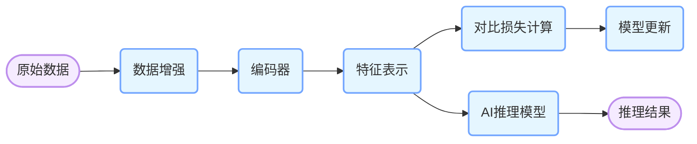

# 自监督对比学习提升AI推理的特征表示

> 关键词：自监督对比学习、AI推理、特征表示、对比损失、预训练模型

> 摘要：本文深入探讨了自监督对比学习在提升AI推理特征表示方面的重要作用。首先介绍了自监督对比学习和AI推理特征表示的背景知识，包括目的、预期读者、文档结构和相关术语。接着详细阐述了核心概念及其联系，通过文本示意图和Mermaid流程图进行清晰展示。核心算法原理部分使用Python代码进行详细说明，同时给出了相关的数学模型和公式，并举例解释。项目实战环节展示了代码实际案例，包括开发环境搭建、源代码实现与解读。分析了自监督对比学习在图像识别、自然语言处理等领域的实际应用场景。最后推荐了学习资源、开发工具框架和相关论文著作，总结了未来发展趋势与挑战，并给出常见问题解答和扩展阅读参考资料，旨在为读者全面理解和应用自监督对比学习提升AI推理特征表示提供深入的技术指导。

## 1. 背景介绍 
### 1.1 目的和范围
在当今人工智能领域，特征表示的质量对于AI系统的推理能力起着关键作用。传统的监督学习方法需要大量的标注数据，这不仅成本高昂，而且在某些场景下难以获取。自监督对比学习作为一种新兴的学习范式，无需大量标注数据，通过对比不同样本之间的特征表示来学习有用的特征，从而提升AI推理的性能。本文的目的在于深入探讨自监督对比学习如何提升AI推理的特征表示，涵盖自监督对比学习的原理、算法实现、实际应用等方面，为相关研究和实践提供全面的技术参考。

### 1.2 预期读者
本文预期读者包括人工智能领域的研究人员、开发者、学生以及对自监督对比学习和AI推理感兴趣的技术爱好者。对于有一定机器学习基础的读者，本文可以帮助他们深入理解自监督对比学习的原理和应用；对于初学者，本文也提供了详细的基础知识介绍和代码示例，便于他们入门和学习。

### 1.3 文档结构概述
本文将按照以下结构进行阐述：首先介绍相关的核心概念和术语，帮助读者建立基本的知识体系；然后详细讲解自监督对比学习的核心算法原理和具体操作步骤，使用Python代码进行示例；接着给出相关的数学模型和公式，并通过具体例子进行说明；之后通过项目实战展示代码的实际应用和详细解读；分析自监督对比学习在不同领域的实际应用场景；推荐学习资源、开发工具框架和相关论文著作；最后总结未来发展趋势与挑战，给出常见问题解答和扩展阅读参考资料。

### 1.4 术语表
#### 1.4.1 核心术语定义
- **自监督对比学习（Self-Supervised Contrastive Learning）**：一种无监督学习方法，通过构建对比任务，让模型学习区分不同样本的特征表示，从而自动学习到数据的内在结构和特征。
- **AI推理（AI Inference）**：指在训练好的AI模型基础上，对新的输入数据进行预测和判断的过程。
- **特征表示（Feature Representation）**：将原始数据转换为一种更具代表性和可区分性的向量表示，以便于机器学习模型进行处理和分析。
- **对比损失（Contrastive Loss）**：用于衡量不同样本特征表示之间的相似度或差异性，是自监督对比学习中常用的损失函数。
- **预训练模型（Pretrained Model）**：在大规模无标注数据上进行预训练得到的模型，其学习到的特征表示可以迁移到其他具体任务中。

#### 1.4.2 相关概念解释
- **无监督学习（Unsupervised Learning）**：在没有标注数据的情况下，让模型自动发现数据中的模式和结构的学习方法。自监督对比学习属于无监督学习的一种特殊形式。
- **数据增强（Data Augmentation）**：通过对原始数据进行各种变换，如旋转、缩放、裁剪等，生成更多的训练样本，从而提高模型的泛化能力。在自监督对比学习中，数据增强常用于构建对比样本。
- **嵌入空间（Embedding Space）**：将原始数据映射到的低维向量空间，在这个空间中，相似的样本特征表示更接近，不同的样本特征表示更远离。

#### 1.4.3 缩略词列表
- **SSL**：Self-Supervised Learning，自监督学习
- **CL**：Contrastive Learning，对比学习
- **SSL-CL**：Self-Supervised Contrastive Learning，自监督对比学习
- **CNN**：Convolutional Neural Network，卷积神经网络
- **Transformer**：一种基于注意力机制的深度学习模型架构

## 2. 核心概念与联系 

### 核心概念原理
自监督对比学习的核心思想是通过对比不同样本的特征表示，让模型学习到数据的内在结构和特征。具体来说，它通过构建对比任务，将正样本对（相似样本）的特征表示拉近，将负样本对（不相似样本）的特征表示推远。在自监督学习的场景下，由于没有标注信息，正样本对通常通过对同一个样本进行不同的数据增强操作得到，而负样本对则从其他样本中选取。

AI推理的特征表示则是将原始数据转换为一种更具代表性和可区分性的向量表示，以便于模型进行推理和决策。良好的特征表示能够提高模型的性能和泛化能力。自监督对比学习通过学习到的数据内在结构和特征，可以为AI推理提供更优质的特征表示，从而提升推理的准确性和效率。

### 架构的文本示意图
以下是自监督对比学习提升AI推理特征表示的架构示意图：

原始数据 -> 数据增强 -> 编码器（如CNN、Transformer） -> 特征表示 -> 对比损失计算 -> 模型更新
特征表示 -> AI推理模型 -> 推理结果

### Mermaid流程图


在这个流程图中，原始数据首先经过数据增强得到多个不同的样本，然后通过编码器将这些样本转换为特征表示。对比损失计算根据特征表示计算损失，用于更新模型。同时，特征表示被输入到AI推理模型中，得到最终的推理结果。

## 3. 核心算法原理 & 具体操作步骤 

### 核心算法原理
自监督对比学习的核心算法通常基于对比损失函数，常见的对比损失函数有InfoNCE（Info Noise Contrastive Estimation）损失。InfoNCE损失的目标是最大化正样本对的相似度，同时最小化负样本对的相似度。

给定一个样本 $x$，经过数据增强得到两个不同的视图 $x_i$ 和 $x_j$，将它们分别输入到编码器 $f$ 中，得到特征表示 $z_i = f(x_i)$ 和 $z_j = f(x_j)$。对于一个包含 $N$ 个样本的批次，除了 $(x_i, x_j)$ 这对正样本外，其他样本都作为负样本。

InfoNCE损失的计算公式为：

$$
\mathcal{L}_{i,j} = -\log \frac{\exp(\text{sim}(z_i, z_j) / \tau)}{\sum_{k=1}^{2N-1} \exp(\text{sim}(z_i, z_k) / \tau)}
$$

其中，$\text{sim}(z_i, z_j)$ 表示特征表示 $z_i$ 和 $z_j$ 之间的相似度，通常使用余弦相似度；$\tau$ 是温度参数，用于控制分布的平滑程度。

整个批次的损失为所有正样本对损失的平均值：

$$
\mathcal{L} = \frac{1}{2N} \sum_{i=1}^{N} (\mathcal{L}_{i,j} + \mathcal{L}_{j,i})
$$

### 具体操作步骤
以下是使用Python和PyTorch实现自监督对比学习的具体操作步骤：

```python
import torch
import torch.nn as nn
import torch.optim as optim
import torchvision.transforms as transforms
from torch.utils.data import DataLoader
from torchvision.datasets import CIFAR10

# 定义编码器
class Encoder(nn.Module):
    def __init__(self):
        super(Encoder, self).__init__()
        self.conv1 = nn.Conv2d(3, 64, kernel_size=3, stride=1, padding=1)
        self.relu = nn.ReLU()
        self.pool = nn.MaxPool2d(kernel_size=2, stride=2)
        self.fc = nn.Linear(64 * 16 * 16, 128)

    def forward(self, x):
        x = self.conv1(x)
        x = self.relu(x)
        x = self.pool(x)
        x = x.view(-1, 64 * 16 * 16)
        x = self.fc(x)
        return x

# 定义数据增强
transform = transforms.Compose([
    transforms.RandomResizedCrop(32),
    transforms.RandomHorizontalFlip(),
    transforms.ToTensor(),
    transforms.Normalize((0.5, 0.5, 0.5), (0.5, 0.5, 0.5))
])

# 加载数据集
train_dataset = CIFAR10(root='./data', train=True, download=True, transform=transform)
train_loader = DataLoader(train_dataset, batch_size=32, shuffle=True)

# 初始化编码器和优化器
encoder = Encoder()
optimizer = optim.Adam(encoder.parameters(), lr=0.001)

# 定义对比损失函数
criterion = nn.CrossEntropyLoss()

# 训练模型
num_epochs = 10
for epoch in range(num_epochs):
    for images, _ in train_loader:
        # 数据增强得到两个视图
        images_i = transforms.RandomResizedCrop(32)(images)
        images_j = transforms.RandomHorizontalFlip()(images)

        # 计算特征表示
        z_i = encoder(images_i)
        z_j = encoder(images_j)

        # 计算相似度矩阵
        batch_size = images.size(0)
        z = torch.cat([z_i, z_j], dim=0)
        similarity_matrix = torch.nn.functional.cosine_similarity(z.unsqueeze(1), z.unsqueeze(0), dim=2)

        # 构建正样本和负样本的标签
        labels = torch.arange(batch_size).to(images.device)
        labels = torch.cat([labels + batch_size, labels], dim=0)

        # 计算对比损失
        temperature = 0.1
        similarity_matrix = similarity_matrix / temperature
        loss = criterion(similarity_matrix, labels)

        # 反向传播和优化
        optimizer.zero_grad()
        loss.backward()
        optimizer.step()

    print(f'Epoch {epoch+1}/{num_epochs}, Loss: {loss.item()}')
```

### 代码解释
1. **编码器定义**：定义了一个简单的卷积神经网络作为编码器，将输入的图像转换为特征表示。
2. **数据增强**：使用`torchvision.transforms`对图像进行随机裁剪和水平翻转，得到两个不同的视图。
3. **数据集加载**：使用`CIFAR10`数据集进行训练，通过`DataLoader`批量加载数据。
4. **损失计算**：计算特征表示之间的余弦相似度矩阵，根据InfoNCE损失的思想构建正样本和负样本的标签，使用`CrossEntropyLoss`计算对比损失。
5. **模型训练**：通过反向传播和优化器更新编码器的参数。

## 4. 数学模型和公式 & 详细讲解 & 举例说明 

### 数学模型和公式
#### InfoNCE损失公式
如前面所述，InfoNCE损失的计算公式为：

$$
\mathcal{L}_{i,j} = -\log \frac{\exp(\text{sim}(z_i, z_j) / \tau)}{\sum_{k=1}^{2N-1} \exp(\text{sim}(z_i, z_k) / \tau)}
$$

其中，$\text{sim}(z_i, z_j)$ 是特征表示 $z_i$ 和 $z_j$ 之间的余弦相似度，计算公式为：

$$
\text{sim}(z_i, z_j) = \frac{z_i \cdot z_j}{\|z_i\| \|z_j\|}
$$

整个批次的损失为：

$$
\mathcal{L} = \frac{1}{2N} \sum_{i=1}^{N} (\mathcal{L}_{i,j} + \mathcal{L}_{j,i})
$$

### 详细讲解
InfoNCE损失的核心思想是通过最大化正样本对的相似度和最小化负样本对的相似度来学习特征表示。分子 $\exp(\text{sim}(z_i, z_j) / \tau)$ 表示正样本对的相似度得分，分母 $\sum_{k=1}^{2N-1} \exp(\text{sim}(z_i, z_k) / \tau)$ 表示所有样本（包括正样本和负样本）的相似度得分之和。通过取对数和取负号，将最大化正样本对相似度的问题转化为最小化损失的问题。

温度参数 $\tau$ 控制了相似度得分的分布平滑程度。当 $\tau$ 较小时，相似度得分的分布更加尖锐，模型更注重区分正样本和负样本；当 $\tau$ 较大时，相似度得分的分布更加平滑，模型对正负样本的区分度相对较低。

### 举例说明
假设我们有一个批次包含 $N = 2$ 个样本，经过数据增强得到 $2N = 4$ 个视图。特征表示分别为 $z_1, z_2, z_3, z_4$，其中 $(z_1, z_3)$ 和 $(z_2, z_4)$ 是正样本对。

首先计算相似度矩阵：

$$
\text{Sim} = 
\begin{bmatrix}
\text{sim}(z_1, z_1) & \text{sim}(z_1, z_2) & \text{sim}(z_1, z_3) & \text{sim}(z_1, z_4) \\
\text{sim}(z_2, z_1) & \text{sim}(z_2, z_2) & \text{sim}(z_2, z_3) & \text{sim}(z_2, z_4) \\
\text{sim}(z_3, z_1) & \text{sim}(z_3, z_2) & \text{sim}(z_3, z_3) & \text{sim}(z_3, z_4) \\
\text{sim}(z_4, z_1) & \text{sim}(z_4, z_2) & \text{sim}(z_4, z_3) & \text{sim}(z_4, z_4)
\end{bmatrix}
$$

对于正样本对 $(z_1, z_3)$，其损失为：

$$
\mathcal{L}_{1,3} = -\log \frac{\exp(\text{sim}(z_1, z_3) / \tau)}{\exp(\text{sim}(z_1, z_1) / \tau) + \exp(\text{sim}(z_1, z_2) / \tau) + \exp(\text{sim}(z_1, z_3) / \tau) + \exp(\text{sim}(z_1, z_4) / \tau)}
$$

同理，计算其他正样本对的损失，最后求平均值得到整个批次的损失。

## 5. 项目实战：代码实际案例和详细解释说明 

### 5.1  开发环境搭建
- **操作系统**：推荐使用Ubuntu 18.04或更高版本，也可以使用Windows 10或macOS。
- **Python环境**：建议使用Python 3.7或更高版本，可以使用Anaconda进行Python环境的管理。
- **深度学习框架**：使用PyTorch 1.7或更高版本，可以通过以下命令安装：
```sh
pip install torch torchvision
```
- **其他依赖库**：安装`numpy`、`matplotlib`等常用库：
```sh
pip install numpy matplotlib
```

### 5.2  源代码详细实现和代码解读
以下是一个完整的自监督对比学习提升图像分类模型特征表示的项目代码：

```python
import torch
import torch.nn as nn
import torch.optim as optim
import torchvision.transforms as transforms
from torch.utils.data import DataLoader
from torchvision.datasets import CIFAR10
import matplotlib.pyplot as plt

# 定义编码器
class Encoder(nn.Module):
    def __init__(self):
        super(Encoder, self).__init__()
        self.conv1 = nn.Conv2d(3, 64, kernel_size=3, stride=1, padding=1)
        self.relu = nn.ReLU()
        self.pool = nn.MaxPool2d(kernel_size=2, stride=2)
        self.fc = nn.Linear(64 * 16 * 16, 128)

    def forward(self, x):
        x = self.conv1(x)
        x = self.relu(x)
        x = self.pool(x)
        x = x.view(-1, 64 * 16 * 16)
        x = self.fc(x)
        return x

# 定义分类器
class Classifier(nn.Module):
    def __init__(self, input_dim=128, num_classes=10):
        super(Classifier, self).__init__()
        self.fc = nn.Linear(input_dim, num_classes)

    def forward(self, x):
        return self.fc(x)

# 定义数据增强
transform = transforms.Compose([
    transforms.RandomResizedCrop(32),
    transforms.RandomHorizontalFlip(),
    transforms.ToTensor(),
    transforms.Normalize((0.5, 0.5, 0.5), (0.5, 0.5, 0.5))
])

# 加载数据集
train_dataset = CIFAR10(root='./data', train=True, download=True, transform=transform)
train_loader = DataLoader(train_dataset, batch_size=32, shuffle=True)

test_dataset = CIFAR10(root='./data', train=False, download=True, transform=transform)
test_loader = DataLoader(test_dataset, batch_size=32, shuffle=False)

# 初始化编码器和分类器
encoder = Encoder()
classifier = Classifier()

# 初始化优化器
optimizer_encoder = optim.Adam(encoder.parameters(), lr=0.001)
optimizer_classifier = optim.Adam(classifier.parameters(), lr=0.001)

# 定义对比损失函数和分类损失函数
contrastive_criterion = nn.CrossEntropyLoss()
classification_criterion = nn.CrossEntropyLoss()

# 自监督预训练
num_pretrain_epochs = 10
pretrain_losses = []
for epoch in range(num_pretrain_epochs):
    running_loss = 0.0
    for images, _ in train_loader:
        # 数据增强得到两个视图
        images_i = transforms.RandomResizedCrop(32)(images)
        images_j = transforms.RandomHorizontalFlip()(images)

        # 计算特征表示
        z_i = encoder(images_i)
        z_j = encoder(images_j)

        # 计算相似度矩阵
        batch_size = images.size(0)
        z = torch.cat([z_i, z_j], dim=0)
        similarity_matrix = torch.nn.functional.cosine_similarity(z.unsqueeze(1), z.unsqueeze(0), dim=2)

        # 构建正样本和负样本的标签
        labels = torch.arange(batch_size).to(images.device)
        labels = torch.cat([labels + batch_size, labels], dim=0)

        # 计算对比损失
        temperature = 0.1
        similarity_matrix = similarity_matrix / temperature
        contrastive_loss = contrastive_criterion(similarity_matrix, labels)

        # 反向传播和优化
        optimizer_encoder.zero_grad()
        contrastive_loss.backward()
        optimizer_encoder.step()

        running_loss += contrastive_loss.item()

    epoch_loss = running_loss / len(train_loader)
    pretrain_losses.append(epoch_loss)
    print(f'Pretrain Epoch {epoch+1}/{num_pretrain_epochs}, Loss: {epoch_loss}')

# 绘制预训练损失曲线
plt.plot(pretrain_losses)
plt.xlabel('Epoch')
plt.ylabel('Loss')
plt.title('Pretrain Loss')
plt.show()

# 微调分类器
num_finetune_epochs = 10
finetune_losses = []
finetune_accuracies = []
for epoch in range(num_finetune_epochs):
    running_loss = 0.0
    correct = 0
    total = 0
    for images, labels in train_loader:
        # 计算特征表示
        features = encoder(images)

        # 计算分类结果
        outputs = classifier(features)

        # 计算分类损失
        classification_loss = classification_criterion(outputs, labels)

        # 反向传播和优化
        optimizer_classifier.zero_grad()
        classification_loss.backward()
        optimizer_classifier.step()

        running_loss += classification_loss.item()
        _, predicted = torch.max(outputs.data, 1)
        total += labels.size(0)
        correct += (predicted == labels).sum().item()

    epoch_loss = running_loss / len(train_loader)
    epoch_accuracy = correct / total
    finetune_losses.append(epoch_loss)
    finetune_accuracies.append(epoch_accuracy)
    print(f'Finetune Epoch {epoch+1}/{num_finetune_epochs}, Loss: {epoch_loss}, Accuracy: {epoch_accuracy}')

# 绘制微调损失和准确率曲线
plt.figure(figsize=(12, 5))
plt.subplot(1, 2, 1)
plt.plot(finetune_losses)
plt.xlabel('Epoch')
plt.ylabel('Loss')
plt.title('Finetune Loss')

plt.subplot(1, 2, 2)
plt.plot(finetune_accuracies)
plt.xlabel('Epoch')
plt.ylabel('Accuracy')
plt.title('Finetune Accuracy')
plt.show()

# 测试模型
correct = 0
total = 0
with torch.no_grad():
    for images, labels in test_loader:
        features = encoder(images)
        outputs = classifier(features)
        _, predicted = torch.max(outputs.data, 1)
        total += labels.size(0)
        correct += (predicted == labels).sum().item()

test_accuracy = correct / total
print(f'Test Accuracy: {test_accuracy}')
```

### 5.3  代码解读与分析
1. **模型定义**：
    - `Encoder`：定义了一个简单的卷积神经网络作为编码器，用于将输入图像转换为特征表示。
    - `Classifier`：定义了一个全连接层作为分类器，用于对特征表示进行分类。
2. **数据加载和增强**：
    - 使用`CIFAR10`数据集进行训练和测试，通过`DataLoader`批量加载数据。
    - 对图像进行随机裁剪和水平翻转等数据增强操作，得到不同的视图。
3. **自监督预训练**：
    - 在预训练阶段，使用InfoNCE损失函数进行自监督对比学习，让编码器学习到数据的内在结构和特征。
    - 记录每个epoch的损失，并绘制损失曲线。
4. **微调分类器**：
    - 在预训练完成后，固定编码器的参数，微调分类器的参数。
    - 使用交叉熵损失函数进行分类训练，记录每个epoch的损失和准确率，并绘制相应的曲线。
5. **模型测试**：
    - 在测试集上评估模型的性能，计算测试准确率。

通过这个项目实战，我们可以看到自监督对比学习可以提升编码器学习到的特征表示的质量，从而提高分类模型的性能。

## 6. 实际应用场景 
### 图像识别
在图像识别领域，自监督对比学习可以用于预训练图像特征提取器。由于图像数据通常包含大量的无标注信息，使用自监督对比学习可以充分利用这些无标注数据，学习到更具代表性和通用性的图像特征。例如，在人脸识别任务中，通过自监督对比学习可以让模型学习到人脸的特征表示，从而提高人脸识别的准确率。在物体检测和图像分类任务中，预训练的特征提取器可以迁移到具体的任务中，减少对标注数据的依赖，提高模型的训练效率和性能。

### 自然语言处理
在自然语言处理领域，自监督对比学习可以用于预训练语言模型。通过构建对比任务，如句子对的相似度判断、词向量的对比学习等，让模型学习到语言的语义和语法信息。例如，在文本分类任务中，预训练的语言模型可以提供更优质的文本特征表示，从而提高分类的准确率。在机器翻译任务中，自监督对比学习可以帮助模型学习到不同语言之间的语义对应关系，提高翻译的质量。

### 音频处理
在音频处理领域，自监督对比学习可以用于音频特征提取和分类。例如，在语音识别任务中，通过对语音信号进行不同的变换和增强，构建对比样本，让模型学习到语音的特征表示。在音乐分类任务中，自监督对比学习可以帮助模型学习到音乐的风格和特征，提高分类的准确性。

### 医疗影像分析
在医疗影像分析领域，标注数据通常比较稀缺，自监督对比学习可以发挥重要作用。通过对医疗影像数据进行自监督学习，模型可以学习到影像的特征表示，用于疾病诊断、病灶检测等任务。例如，在X光片、CT图像等医疗影像的分析中，自监督对比学习可以帮助医生更准确地发现疾病和病变。

## 7. 工具和资源推荐
### 7.1 学习资源推荐
#### 7.1.1 书籍推荐
- 《深度学习》（Deep Learning）：由Ian Goodfellow、Yoshua Bengio和Aaron Courville所著，是深度学习领域的经典教材，涵盖了深度学习的基本原理、算法和应用。
- 《动手学深度学习》（Dive into Deep Learning）：由 Aston Zhang、Zachary C. Lipton、Mu Li和Alexander J. Smola所著，提供了丰富的代码示例和实践项目，适合初学者入门。
- 《Python深度学习》（Deep Learning with Python）：由Francois Chollet所著，结合Keras框架介绍了深度学习的应用，适合有一定Python基础的读者。

#### 7.1.2 在线课程
- Coursera上的“深度学习专项课程”（Deep Learning Specialization）：由Andrew Ng教授授课，系统地介绍了深度学习的各个方面，包括神经网络、卷积神经网络、循环神经网络等。
- edX上的“使用PyTorch进行深度学习”（Introduction to Deep Learning with PyTorch）：详细介绍了PyTorch的使用方法和深度学习的基本原理。
- B站（哔哩哔哩）上有许多关于自监督学习和对比学习的视频教程，适合初学者快速入门。

#### 7.1.3 技术博客和网站
- arXiv：是一个收集物理学、数学、计算机科学等领域预印本论文的网站，提供了最新的研究成果和技术动态。
- Medium：有许多技术博客和文章，涵盖了人工智能、机器学习等领域的最新进展和实践经验。
- 机器之心、新智元等中文科技媒体网站，会及时报道人工智能领域的前沿技术和研究成果。

### 7.2 开发工具框架推荐
#### 7.2.1 IDE和编辑器
- PyCharm：是一款专门为Python开发设计的集成开发环境，提供了丰富的代码编辑、调试和分析功能。
- Jupyter Notebook：是一个交互式的开发环境，适合进行数据探索、模型训练和结果展示。
- Visual Studio Code：是一款轻量级的代码编辑器，支持多种编程语言和插件扩展，可用于Python开发。

#### 7.2.2 调试和性能分析工具
- PyTorch Profiler：是PyTorch自带的性能分析工具，可以帮助开发者分析模型的运行时间、内存使用等情况。
- TensorBoard：是TensorFlow和PyTorch都支持的可视化工具，可以用于可视化模型的训练过程、损失曲线、准确率等信息。
- NVIDIA Nsight Systems：是NVIDIA提供的性能分析工具，可用于分析GPU的性能和优化代码。

#### 7.2.3 相关框架和库
- PyTorch：是一个开源的深度学习框架，提供了丰富的神经网络层和优化算法，易于使用和扩展。
- TensorFlow：是另一个广泛使用的深度学习框架，具有强大的分布式训练和部署能力。
- Scikit-learn：是一个用于机器学习的Python库，提供了各种机器学习算法和工具，可用于数据预处理、模型选择和评估等。

### 7.3 相关论文著作推荐
#### 7.3.1 经典论文
- “A Simple Framework for Contrastive Learning of Visual Representations”（SimCLR）：提出了一种简单有效的自监督对比学习框架，在图像表示学习方面取得了很好的效果。
- “Momentum Contrast for Unsupervised Visual Representation Learning”（MoCo）：提出了动量对比学习的方法，通过维护一个动态的字典来提高对比学习的效率。
- “BERT: Pre-training of Deep Bidirectional Transformers for Language Understanding”（BERT）：是自然语言处理领域的经典论文，提出了基于Transformer的预训练语言模型，在多个自然语言处理任务中取得了显著的性能提升。

#### 7.3.2 最新研究成果
- 关注arXiv上关于自监督对比学习和AI推理的最新论文，了解该领域的最新研究动态和技术进展。
- 参加国际顶级的人工智能会议，如NeurIPS、ICML、CVPR等，获取最新的研究成果和学术交流机会。

#### 7.3.3 应用案例分析
- 可以在相关的学术期刊和会议论文中查找自监督对比学习在不同领域的应用案例，了解其实际应用效果和挑战。
- 一些开源项目和技术博客也会分享自监督对比学习的应用案例和实践经验，可以从中学习和借鉴。

## 8. 总结：未来发展趋势与挑战
### 未来发展趋势
- **多模态融合**：未来的自监督对比学习将不仅仅局限于单一模态的数据，如图像、文本或音频，而是会向多模态融合的方向发展。通过将不同模态的数据进行联合学习，可以学习到更丰富和全面的特征表示，提高AI推理的性能。例如，在视频理解任务中，将视频的图像、音频和文本信息进行融合，利用自监督对比学习可以更好地理解视频的内容和语义。
- **大规模预训练模型**：随着计算资源的不断增加和数据量的不断扩大，大规模预训练模型将成为未来的发展趋势。通过在大规模无标注数据上进行自监督对比学习，可以学习到更强大和通用的特征表示，然后将这些预训练模型迁移到各种具体任务中，实现快速高效的模型训练和部署。例如，OpenAI的GPT系列模型在自然语言处理领域取得了巨大的成功，未来可能会出现更多类似的大规模预训练模型。
- **自适应对比学习**：目前的对比学习方法通常使用固定的对比策略和损失函数，未来的研究可能会探索自适应对比学习方法，根据不同的数据和任务自动调整对比策略和损失函数，以提高学习效率和性能。例如，根据数据的分布和特征动态调整温度参数，或者根据任务的难度和要求选择不同的对比样本。
- **强化学习与对比学习的结合**：强化学习和对比学习都在人工智能领域有着重要的应用，将两者结合起来可以发挥各自的优势。例如，在强化学习中，使用对比学习来学习环境的特征表示，提高智能体的决策能力和学习效率；在对比学习中，使用强化学习来优化对比策略和损失函数，提高特征表示的质量。

### 挑战
- **计算资源需求**：自监督对比学习通常需要大量的计算资源和时间来进行训练，尤其是在处理大规模数据和复杂模型时。如何降低计算成本，提高训练效率，是一个亟待解决的问题。例如，研究更高效的算法和优化方法，利用分布式计算和并行计算技术来加速训练过程。
- **对比样本的选择**：对比样本的选择对对比学习的性能有着重要影响。如何选择合适的对比样本，提高正样本对的相似度和负样本对的差异性，是一个挑战。例如，在数据分布不均衡的情况下，如何选择具有代表性的负样本，避免模型陷入局部最优解。
- **特征表示的可解释性**：虽然自监督对比学习可以学习到高质量的特征表示，但这些特征表示往往缺乏可解释性。在一些对安全性和可靠性要求较高的领域，如医疗、金融等，需要对模型的决策过程进行解释和理解。如何提高特征表示的可解释性，是未来研究的一个重要方向。
- **泛化能力的提升**：自监督对比学习在某些数据集和任务上取得了很好的效果，但在不同的数据集和任务之间的泛化能力还需要进一步提升。如何让模型学习到更通用和鲁棒的特征表示，适应不同的应用场景，是一个挑战。例如，研究跨领域、跨模态的特征表示学习方法，提高模型的泛化能力。

## 9. 附录：常见问题与解答
### 自监督对比学习和监督学习有什么区别？
监督学习需要大量的标注数据，通过标注信息来指导模型的学习。而自监督对比学习是一种无监督学习方法，无需标注数据，通过构建对比任务，让模型自动学习到数据的内在结构和特征。自监督对比学习可以利用大量的无标注数据，减少对标注数据的依赖，提高模型的训练效率和泛化能力。

### 对比损失函数有哪些常见的类型？
常见的对比损失函数有InfoNCE损失、Triplet损失、Contrastive损失等。InfoNCE损失通过最大化正样本对的相似度和最小化负样本对的相似度来学习特征表示；Triplet损失通过要求锚样本与正样本的距离小于锚样本与负样本的距离来学习特征表示；Contrastive损失则是直接定义正样本对和负样本对的损失函数。

### 自监督对比学习的训练时间通常需要多久？
自监督对比学习的训练时间取决于多个因素，如数据集的大小、模型的复杂度、计算资源等。在小规模数据集和简单模型的情况下，训练时间可能只需要几个小时；而在大规模数据集和复杂模型的情况下，训练时间可能需要数天甚至数周。可以通过使用分布式计算和并行计算技术来加速训练过程。

### 如何评估自监督对比学习得到的特征表示的质量？
可以通过以下几种方法评估特征表示的质量：
- **下游任务性能**：将学习到的特征表示应用到具体的下游任务中，如分类、检测等，评估下游任务的性能。如果下游任务的性能较好，说明特征表示的质量较高。
- **可视化分析**：将特征表示可视化，观察相似样本的特征表示是否更接近，不同样本的特征表示是否更远离。
- **聚类分析**：对特征表示进行聚类分析，评估聚类的效果。如果聚类结果与数据的真实类别或语义信息相符，说明特征表示的质量较高。

## 10. 扩展阅读 & 参考资料
- Goodfellow, I., Bengio, Y., & Courville, A. (2016). Deep Learning. MIT Press.
- Zhang, A., Lipton, Z. C., Li, M., & Smola, A. J. (2020). Dive into Deep Learning.
- Chollet, F. (2017). Deep Learning with Python. Manning Publications.
- Chen, T., Kornblith, S., Norouzi, M., & Hinton, G. (2020). A Simple Framework for Contrastive Learning of Visual Representations. arXiv preprint arXiv:2002.05709.
- He, K., Fan, H., Wu, Y., Xie, S., & Girshick, R. (2020). Momentum Contrast for Unsupervised Visual Representation Learning. In Proceedings of the IEEE/CVF Conference on Computer Vision and Pattern Recognition (pp. 9729-9738).
- Devlin, J., Chang, M. W., Lee, K., & Toutanova, K. (2019). BERT: Pre-training of Deep Bidirectional Transformers for Language Understanding. arXiv preprint arXiv:1810.04805.

作者：AI天才研究院/AI Genius Institute & 禅与计算机程序设计艺术 /Zen And The Art of Computer Programming