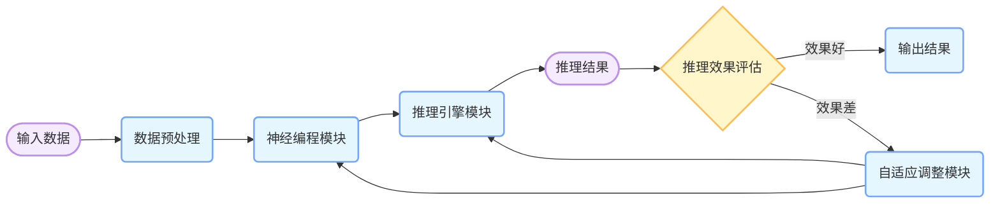

# 自适应推理算法设计中神经编程的创新方法

> 关键词：自适应推理算法、神经编程、创新方法、深度学习、人工智能

> 摘要：本文聚焦于自适应推理算法设计中神经编程的创新方法。首先介绍了相关背景知识，包括目的范围、预期读者等内容。接着详细阐述了核心概念与联系，给出了原理和架构的文本示意图以及Mermaid流程图。通过Python源代码深入讲解核心算法原理和具体操作步骤，同时辅以数学模型和公式进行理论支持。以实际项目为例，展示了代码的实现和解读。分析了该领域的实际应用场景，推荐了学习、开发工具和相关论文著作。最后总结了未来发展趋势与挑战，并提供了常见问题解答和扩展阅读参考资料，旨在为相关领域的研究者和开发者提供全面且深入的技术指导。

## 1. 背景介绍 
### 1.1 目的和范围
在当今人工智能领域，自适应推理算法在诸多实际应用中发挥着关键作用，如智能机器人、自动驾驶、自然语言处理等。然而，传统的推理算法往往缺乏灵活性和适应性，难以应对复杂多变的环境和任务需求。神经编程作为一种新兴的技术手段，为自适应推理算法的设计带来了新的思路和方法。本文的目的在于探讨神经编程在自适应推理算法设计中的创新方法，深入研究其原理、实现步骤以及实际应用，为相关领域的研究和开发提供理论支持和实践指导。

本文的范围涵盖了神经编程的基本概念、核心算法原理、数学模型、实际项目案例以及应用场景分析等方面。通过全面的研究和分析，揭示神经编程在自适应推理算法设计中的优势和潜力，为推动该领域的发展提供有益的参考。

### 1.2 预期读者
本文预期读者包括人工智能领域的研究者、开发者、学生以及对自适应推理算法和神经编程感兴趣的技术爱好者。对于研究者而言，本文可以为他们的学术研究提供新的思路和方向；对于开发者来说，能够帮助他们掌握神经编程在自适应推理算法设计中的具体实现方法；对于学生而言，有助于他们深入理解相关领域的知识和技术；对于技术爱好者，本文可以激发他们对该领域的兴趣和探索欲望。

### 1.3 文档结构概述
本文共分为十个部分，具体结构如下：
1. 背景介绍：阐述文章的目的和范围、预期读者、文档结构概述以及相关术语表。
2. 核心概念与联系：介绍神经编程和自适应推理算法的核心概念，给出原理和架构的文本示意图以及Mermaid流程图。
3. 核心算法原理 & 具体操作步骤：使用Python源代码详细讲解核心算法原理和具体操作步骤。
4. 数学模型和公式 & 详细讲解 & 举例说明：运用latex格式的数学公式进行理论支持，并通过具体例子进行说明。
5. 项目实战：代码实际案例和详细解释说明，包括开发环境搭建、源代码详细实现和代码解读。
6. 实际应用场景：分析神经编程在自适应推理算法设计中的实际应用场景。
7. 工具和资源推荐：推荐学习资源、开发工具框架以及相关论文著作。
8. 总结：未来发展趋势与挑战：总结该领域的未来发展趋势和面临的挑战。
9. 附录：常见问题与解答：提供常见问题的解答。
10. 扩展阅读 & 参考资料：列出扩展阅读的资料和参考文献。

### 1.4 术语表
#### 1.4.1 核心术语定义
- **自适应推理算法**：一种能够根据不同的环境和任务需求自动调整推理策略的算法，具有较强的灵活性和适应性。
- **神经编程**：结合神经网络和编程概念的一种技术，通过神经网络来学习和生成程序，实现复杂的计算任务。
- **深度学习**：一种基于人工神经网络的机器学习方法，通过多层神经网络自动学习数据的特征和模式。
- **强化学习**：一种通过智能体与环境进行交互，根据环境反馈的奖励信号来学习最优行为策略的机器学习方法。

#### 1.4.2 相关概念解释
- **神经网络**：由大量神经元组成的计算模型，能够模拟人类神经系统的信息处理过程，用于学习数据的特征和模式。
- **推理**：从已知信息中得出结论的过程，在人工智能领域中常用于根据输入数据生成输出结果。
- **程序生成**：根据特定的需求和规则自动生成计算机程序的过程。

#### 1.4.3 缩略词列表
- **AI**：Artificial Intelligence，人工智能
- **ML**：Machine Learning，机器学习
- **DL**：Deep Learning，深度学习
- **RL**：Reinforcement Learning，强化学习

## 2. 核心概念与联系 

### 核心概念原理
#### 神经编程
神经编程是将神经网络与编程相结合的一种技术。传统的编程是由程序员手动编写代码来实现特定的功能，而神经编程则是通过神经网络自动学习和生成程序。神经网络可以学习数据中的模式和规律，并根据这些信息生成相应的程序代码。例如，在图像识别任务中，神经编程可以通过学习大量的图像数据，生成一个能够准确识别图像中物体的程序。

#### 自适应推理算法
自适应推理算法是一种能够根据不同的环境和任务需求自动调整推理策略的算法。在实际应用中，环境和任务往往是复杂多变的，传统的推理算法可能无法适应这些变化。自适应推理算法通过引入反馈机制，根据环境的反馈信息实时调整推理策略，从而提高推理的准确性和效率。例如，在智能机器人导航任务中，自适应推理算法可以根据机器人所处的环境（如障碍物的位置、地形等）自动调整导航策略，确保机器人能够安全、高效地到达目标位置。

### 架构的文本示意图
以下是神经编程在自适应推理算法设计中的架构示意图：

输入数据首先经过数据预处理模块，对数据进行清洗、归一化等操作，以提高数据的质量和可用性。预处理后的数据输入到神经编程模块，神经编程模块通过神经网络学习数据中的模式和规律，并生成相应的推理程序。推理程序在推理引擎模块中执行，根据输入数据进行推理，生成推理结果。推理结果反馈到自适应调整模块，自适应调整模块根据反馈信息对神经编程模块和推理引擎模块进行调整，以优化推理策略，提高推理的准确性和效率。

### Mermaid流程图


## 3. 核心算法原理 & 具体操作步骤 

### 核心算法原理
在自适应推理算法设计中，神经编程的核心算法可以基于强化学习来实现。强化学习是一种通过智能体与环境进行交互，根据环境反馈的奖励信号来学习最优行为策略的机器学习方法。在神经编程中，智能体可以看作是一个神经网络，环境是需要解决的任务，奖励信号是推理结果的准确性和效率。

具体来说，神经网络通过不断地与环境进行交互，尝试不同的推理程序，根据环境反馈的奖励信号来调整自身的参数，使得生成的推理程序能够获得更高的奖励。例如，在图像识别任务中，神经网络可以尝试不同的特征提取方法和分类器，根据识别结果的准确性来调整自身的参数，最终学习到一个最优的推理程序。

### 具体操作步骤
以下是基于强化学习的神经编程在自适应推理算法设计中的具体操作步骤：

#### 步骤1：定义环境和状态空间
首先，需要定义环境和状态空间。环境是需要解决的任务，例如图像识别、自然语言处理等。状态空间是环境的所有可能状态的集合，例如在图像识别任务中，状态可以是图像的像素值、特征向量等。

#### 步骤2：定义动作空间
动作空间是智能体可以采取的所有可能动作的集合。在神经编程中，动作可以是生成的推理程序的不同参数或结构。例如，在图像识别任务中，动作可以是不同的卷积核大小、层数等。

#### 步骤3：定义奖励函数
奖励函数是根据智能体的动作和环境的反馈来计算奖励的函数。奖励函数的设计需要根据具体的任务来确定，通常奖励函数与推理结果的准确性和效率相关。例如，在图像识别任务中，奖励函数可以是识别准确率。

#### 步骤4：初始化神经网络
初始化一个神经网络作为智能体，神经网络的输入是环境的状态，输出是动作的概率分布。

#### 步骤5：训练神经网络
通过强化学习算法（如策略梯度算法）训练神经网络，使得神经网络能够根据环境的状态选择最优的动作，从而生成最优的推理程序。

#### 步骤6：评估和调整
在训练过程中，需要不断地评估推理程序的性能，并根据评估结果调整神经网络的参数和奖励函数，以提高推理的准确性和效率。

### Python源代码实现
以下是一个简单的基于强化学习的神经编程示例代码：

```python
import numpy as np
import torch
import torch.nn as nn
import torch.optim as optim

# 定义环境和状态空间
state_size = 10
action_size = 5

# 定义神经网络
class NeuralProgramming(nn.Module):
    def __init__(self, state_size, action_size):
        super(NeuralProgramming, self).__init__()
        self.fc1 = nn.Linear(state_size, 20)
        self.fc2 = nn.Linear(20, action_size)

    def forward(self, x):
        x = torch.relu(self.fc1(x))
        x = torch.softmax(self.fc2(x), dim=1)
        return x

# 初始化神经网络
model = NeuralProgramming(state_size, action_size)
optimizer = optim.Adam(model.parameters(), lr=0.001)

# 定义奖励函数
def reward_function(action, state):
    # 这里简单假设奖励是动作和状态的点积
    return np.dot(action, state)

# 训练神经网络
num_episodes = 1000
for episode in range(num_episodes):
    # 生成随机状态
    state = np.random.randn(state_size)
    state = torch.FloatTensor(state).unsqueeze(0)

    # 前向传播
    action_probs = model(state)
    action = torch.multinomial(action_probs, 1).item()

    # 计算奖励
    action_one_hot = np.zeros(action_size)
    action_one_hot[action] = 1
    reward = reward_function(action_one_hot, state.numpy()[0])

    # 计算损失
    log_prob = torch.log(action_probs.squeeze(0)[action])
    loss = -log_prob * reward

    # 反向传播
    optimizer.zero_grad()
    loss.backward()
    optimizer.step()

    if episode % 100 == 0:
        print(f'Episode {episode}: Loss = {loss.item()}')
```

## 4. 数学模型和公式 & 详细讲解 & 举例说明 

### 数学模型和公式
在基于强化学习的神经编程中，核心的数学模型是策略梯度算法。策略梯度算法通过优化策略网络的参数来最大化累积奖励的期望。

#### 策略网络
策略网络 $\pi_{\theta}(a|s)$ 是一个参数为 $\theta$ 的神经网络，它根据环境的状态 $s$ 输出动作 $a$ 的概率分布。即：

$$\pi_{\theta}(a|s) = P(A = a|S = s; \theta)$$

其中，$A$ 是动作随机变量，$S$ 是状态随机变量。

#### 累积奖励
在一个episode中，智能体从初始状态 $s_0$ 开始，依次采取动作 $a_0, a_1, \cdots, a_T$，得到奖励 $r_0, r_1, \cdots, r_T$。累积奖励 $R$ 定义为：

$$R = \sum_{t=0}^{T} \gamma^t r_t$$

其中，$\gamma \in [0, 1]$ 是折扣因子，用于权衡近期奖励和远期奖励。

#### 目标函数
策略梯度算法的目标是最大化累积奖励的期望 $J(\theta)$：

$$J(\theta) = E_{s_0, a_0, \cdots, a_T} [R]$$

#### 策略梯度
根据策略梯度定理，目标函数 $J(\theta)$ 关于参数 $\theta$ 的梯度可以表示为：

$$\nabla_{\theta} J(\theta) = E_{s_0, a_0, \cdots, a_T} \left[ \sum_{t=0}^{T} \nabla_{\theta} \log \pi_{\theta}(a_t|s_t) R_t \right]$$

其中，$R_t$ 是从时间步 $t$ 开始的累积奖励。

### 详细讲解
策略梯度算法的核心思想是通过调整策略网络的参数 $\theta$，使得智能体采取能够获得更高累积奖励的动作。具体来说，当智能体采取一个动作 $a$ 并获得奖励 $r$ 时，策略梯度算法会增加该动作的概率（如果奖励为正）或减少该动作的概率（如果奖励为负）。

在实际实现中，通常使用随机梯度上升算法来更新策略网络的参数。即：

$$\theta \leftarrow \theta + \alpha \nabla_{\theta} J(\theta)$$

其中，$\alpha$ 是学习率。

### 举例说明
假设我们有一个简单的环境，状态空间是一维的，动作空间是二维的。策略网络是一个简单的全连接神经网络，输入是状态，输出是动作的概率分布。

在一个episode中，智能体从初始状态 $s_0 = 1$ 开始，采取动作 $a_0 = [0.5, 0.5]$，得到奖励 $r_0 = 1$。然后，根据策略梯度算法，计算策略网络的梯度 $\nabla_{\theta} J(\theta)$，并更新策略网络的参数 $\theta$。通过不断地与环境进行交互，智能体逐渐学习到能够获得更高累积奖励的策略。

## 5. 项目实战：代码实际案例和详细解释说明 

### 5.1  开发环境搭建
为了实现基于神经编程的自适应推理算法，我们需要搭建相应的开发环境。以下是具体的搭建步骤：

#### 安装Python
首先，需要安装Python。建议使用Python 3.7及以上版本。可以从Python官方网站（https://www.python.org/downloads/）下载并安装Python。

#### 安装深度学习框架
我们使用PyTorch作为深度学习框架。可以使用以下命令安装PyTorch：

```sh
pip install torch torchvision
```

#### 安装其他依赖库
还需要安装一些其他的依赖库，如NumPy、Matplotlib等。可以使用以下命令安装：

```sh
pip install numpy matplotlib
```

### 5.2  源代码详细实现和代码解读
以下是一个基于神经编程的自适应推理算法的实际项目案例，以图像分类任务为例：

```python
import torch
import torch.nn as nn
import torch.optim as optim
import torchvision
import torchvision.transforms as transforms

# 数据预处理
transform = transforms.Compose(
    [transforms.ToTensor(),
     transforms.Normalize((0.5, 0.5, 0.5), (0.5, 0.5, 0.5))])

# 加载数据集
trainset = torchvision.datasets.CIFAR10(root='./data', train=True,
                                        download=True, transform=transform)
trainloader = torch.utils.data.DataLoader(trainset, batch_size=4,
                                          shuffle=True, num_workers=2)

testset = torchvision.datasets.CIFAR10(root='./data', train=False,
                                       download=True, transform=transform)
testloader = torch.utils.data.DataLoader(testset, batch_size=4,
                                         shuffle=False, num_workers=2)

classes = ('plane', 'car', 'bird', 'cat',
           'deer', 'dog', 'frog', 'horse', 'ship', 'truck')

# 定义神经网络
class NeuralProgrammingNet(nn.Module):
    def __init__(self):
        super(NeuralProgrammingNet, self).__init__()
        self.conv1 = nn.Conv2d(3, 6, 5)
        self.pool = nn.MaxPool2d(2, 2)
        self.conv2 = nn.Conv2d(6, 16, 5)
        self.fc1 = nn.Linear(16 * 5 * 5, 120)
        self.fc2 = nn.Linear(120, 84)
        self.fc3 = nn.Linear(84, 10)

    def forward(self, x):
        x = self.pool(torch.relu(self.conv1(x)))
        x = self.pool(torch.relu(self.conv2(x)))
        x = x.view(-1, 16 * 5 * 5)
        x = torch.relu(self.fc1(x))
        x = torch.relu(self.fc2(x))
        x = self.fc3(x)
        return x

net = NeuralProgrammingNet()

# 定义损失函数和优化器
criterion = nn.CrossEntropyLoss()
optimizer = optim.SGD(net.parameters(), lr=0.001, momentum=0.9)

# 训练神经网络
for epoch in range(2):  # 训练2个epoch
    running_loss = 0.0
    for i, data in enumerate(trainloader, 0):
        # 获取输入数据
        inputs, labels = data

        # 梯度清零
        optimizer.zero_grad()

        # 前向传播 + 反向传播 + 优化
        outputs = net(inputs)
        loss = criterion(outputs, labels)
        loss.backward()
        optimizer.step()

        # 打印统计信息
        running_loss += loss.item()
        if i % 2000 == 1999:    # 每2000个小批量打印一次
            print(f'[{epoch + 1}, {i + 1:5d}] loss: {running_loss / 2000:.3f}')
            running_loss = 0.0

print('Finished Training')

# 测试神经网络
correct = 0
total = 0
with torch.no_grad():
    for data in testloader:
        images, labels = data
        outputs = net(images)
        _, predicted = torch.max(outputs.data, 1)
        total += labels.size(0)
        correct += (predicted == labels).sum().item()

print(f'Accuracy of the network on the 10000 test images: {100 * correct / total}%')
```

### 代码解读与分析
#### 数据预处理
使用`transforms.Compose`函数定义了数据预处理的步骤，包括将图像转换为张量和归一化操作。

#### 数据集加载
使用`torchvision.datasets.CIFAR10`加载CIFAR-10数据集，并使用`torch.utils.data.DataLoader`创建数据加载器。

#### 神经网络定义
定义了一个简单的卷积神经网络`NeuralProgrammingNet`，包括两个卷积层、两个全连接层和一个输出层。

#### 损失函数和优化器
使用交叉熵损失函数`nn.CrossEntropyLoss`和随机梯度下降优化器`optim.SGD`。

#### 训练过程
通过循环遍历训练数据集，进行前向传播、反向传播和参数更新操作。每2000个小批量打印一次损失值。

#### 测试过程
使用测试数据集对训练好的神经网络进行测试，计算分类准确率。

## 6. 实际应用场景 
神经编程在自适应推理算法设计中的创新方法具有广泛的实际应用场景，以下是一些典型的应用场景：

### 智能机器人
在智能机器人领域，自适应推理算法可以帮助机器人根据不同的环境和任务需求自动调整行为策略。例如，在机器人导航任务中，神经编程可以学习不同环境下的最优导航策略，使机器人能够避开障碍物，高效地到达目标位置。在机器人操作任务中，神经编程可以根据物体的形状、位置和材质等信息，生成最优的操作程序，实现精确的抓取和操作。

### 自动驾驶
在自动驾驶领域，自适应推理算法可以提高车辆的安全性和性能。例如，神经编程可以学习不同路况和交通场景下的驾驶策略，使车辆能够自动调整车速、车道保持和转向等操作。在遇到突发情况时，自适应推理算法可以快速做出反应，采取最优的避险措施。

### 自然语言处理
在自然语言处理领域，自适应推理算法可以提高语言模型的理解和生成能力。例如，在机器翻译任务中，神经编程可以根据源语言和目标语言的特点，自动调整翻译策略，提高翻译的准确性和流畅性。在问答系统中，自适应推理算法可以根据用户的问题和上下文信息，生成最优的答案。

### 医疗诊断
在医疗诊断领域，自适应推理算法可以辅助医生进行疾病诊断和治疗方案制定。例如，神经编程可以学习大量的医学数据，包括病历、影像资料等，根据患者的症状和检查结果，自动生成可能的疾病诊断和治疗建议。在疾病预测方面，自适应推理算法可以根据患者的历史数据和当前状态，预测疾病的发生风险和发展趋势。

## 7. 工具和资源推荐
### 7.1 学习资源推荐
#### 7.1.1 书籍推荐
- 《深度学习》（Deep Learning）：由Ian Goodfellow、Yoshua Bengio和Aaron Courville所著，是深度学习领域的经典教材，全面介绍了深度学习的基本概念、算法和应用。
- 《强化学习：原理与Python实现》（Reinforcement Learning: An Introduction）：由Richard S. Sutton和Andrew G. Barto所著，是强化学习领域的权威书籍，详细介绍了强化学习的理论和算法。
- 《Python深度学习》（Deep Learning with Python）：由Francois Chollet所著，结合Keras框架介绍了深度学习的实践方法，适合初学者快速入门。

#### 7.1.2 在线课程
- Coursera上的“深度学习专项课程”（Deep Learning Specialization）：由Andrew Ng教授授课，包括深度学习基础、卷积神经网络、循环神经网络等多个主题，是学习深度学习的优质课程。
- edX上的“强化学习基础”（Foundations of Reinforcement Learning）：由Pieter Abbeel教授授课，系统介绍了强化学习的基本概念和算法。
- 吴恩达老师在B站上发布的《机器学习》课程：内容丰富，讲解详细，适合初学者入门。

#### 7.1.3 技术博客和网站
- Medium：是一个技术博客平台，有很多关于人工智能、深度学习和神经编程的优质文章。
- arXiv：是一个预印本平台，提供了大量最新的学术研究论文，涵盖了人工智能的各个领域。
- 机器之心：是一个专注于人工智能领域的媒体平台，提供了最新的技术资讯、研究成果和应用案例。

### 7.2 开发工具框架推荐
#### 7.2.1 IDE和编辑器
- PyCharm：是一款专业的Python集成开发环境，提供了代码编辑、调试、版本控制等功能，适合开发大型的Python项目。
- Jupyter Notebook：是一个交互式的笔记本环境，支持代码、文本、图像等多种格式的展示，适合进行数据探索和模型实验。
- Visual Studio Code：是一款轻量级的代码编辑器，支持多种编程语言，通过安装插件可以实现Python开发的各种功能。

#### 7.2.2 调试和性能分析工具
- PyTorch Profiler：是PyTorch提供的性能分析工具，可以帮助开发者分析模型的运行时间、内存使用等情况，优化模型性能。
- TensorBoard：是TensorFlow提供的可视化工具，也可以与PyTorch结合使用，用于可视化模型的训练过程、损失曲线等信息。
- pdb：是Python内置的调试器，可以帮助开发者在代码中设置断点，逐步调试程序。

#### 7.2.3 相关框架和库
- PyTorch：是一个开源的深度学习框架，提供了丰富的神经网络层和优化算法，支持GPU加速，易于使用和扩展。
- TensorFlow：是另一个广泛使用的深度学习框架，具有强大的分布式训练能力和可视化工具。
- Gym：是OpenAI开发的强化学习环境库，提供了多种经典的强化学习环境，方便开发者进行算法实验。

### 7.3 相关论文著作推荐
#### 7.3.1 经典论文
- “Playing Atari with Deep Reinforcement Learning”：介绍了深度Q网络（DQN）算法，是强化学习领域的经典论文，开启了深度强化学习的研究热潮。
- “Neural Turing Machines”：提出了神经图灵机的概念，将神经网络与图灵机相结合，为神经编程提供了新的思路。
- “Attention Is All You Need”：提出了Transformer模型，在自然语言处理领域取得了巨大的成功，为神经编程在序列处理任务中的应用提供了有力的工具。

#### 7.3.2 最新研究成果
- 关注arXiv上关于神经编程和自适应推理算法的最新研究论文，了解该领域的最新技术和发展趋势。
- 参加人工智能领域的顶级学术会议，如NeurIPS、ICML、CVPR等，获取最新的研究成果和学术动态。

#### 7.3.3 应用案例分析
- 研究一些实际应用案例，如智能机器人、自动驾驶、自然语言处理等领域的应用案例，了解神经编程在实际项目中的应用方法和技巧。
- 参考一些开源项目，如OpenAI的Gym、DeepMind的AlphaGo等，学习其代码实现和算法设计思路。

## 8. 总结：未来发展趋势与挑战
### 未来发展趋势
#### 融合多模态信息
未来的自适应推理算法将融合多模态信息，如视觉、听觉、触觉等，以提高推理的准确性和可靠性。例如，在智能机器人领域，机器人可以同时利用视觉和触觉信息来更好地感知环境和操作物体。

#### 与知识图谱结合
将神经编程与知识图谱相结合，可以利用知识图谱中的结构化知识来辅助推理，提高推理的效率和可解释性。例如，在自然语言处理领域，知识图谱可以提供实体之间的关系和语义信息，帮助语言模型更好地理解文本。

#### 强化学习与模仿学习的结合
强化学习和模仿学习各有优缺点，将两者结合可以充分发挥它们的优势。例如，在自动驾驶领域，可以先使用模仿学习从人类驾驶员的行为中学习基本的驾驶策略，然后使用强化学习进一步优化策略，提高自动驾驶的性能。

### 面临的挑战
#### 可解释性问题
神经编程模型通常是黑盒模型，其决策过程难以解释。在一些对安全性和可靠性要求较高的应用场景中，如医疗诊断和自动驾驶，可解释性问题是一个亟待解决的挑战。

#### 数据效率问题
神经编程通常需要大量的数据进行训练，数据效率较低。在实际应用中，获取大量标注数据往往是困难和昂贵的。因此，提高数据效率是神经编程面临的另一个挑战。

#### 计算资源问题
神经编程模型通常比较复杂，需要大量的计算资源进行训练和推理。在一些资源受限的设备上，如移动设备和嵌入式系统，计算资源问题是一个需要解决的挑战。

## 9. 附录：常见问题与解答
### 问题1：神经编程与传统编程有什么区别？
传统编程是由程序员手动编写代码来实现特定的功能，而神经编程则是通过神经网络自动学习和生成程序。神经编程具有更强的适应性和灵活性，能够根据不同的数据和任务自动调整程序的结构和参数。

### 问题2：自适应推理算法的应用场景有哪些限制？
自适应推理算法的应用场景受到数据质量、计算资源和模型可解释性等因素的限制。例如，在一些对数据隐私和安全性要求较高的应用场景中，可能无法获取足够的高质量数据进行训练；在一些资源受限的设备上，可能无法运行复杂的自适应推理算法；在一些对决策过程可解释性要求较高的应用场景中，神经编程的黑盒模型可能无法满足需求。

### 问题3：如何提高神经编程模型的可解释性？
可以采用以下方法提高神经编程模型的可解释性：
- 使用可解释的模型结构，如决策树、线性模型等。
- 引入注意力机制，解释模型对输入数据的关注重点。
- 进行模型可视化，直观展示模型的决策过程。

### 问题4：如何解决神经编程的数据效率问题？
可以采用以下方法解决神经编程的数据效率问题：
- 使用迁移学习，利用预训练模型在少量数据上进行微调。
- 采用主动学习策略，选择最有价值的数据进行标注和训练。
- 设计高效的数据增强方法，增加数据的多样性。

## 10. 扩展阅读 & 参考资料
### 扩展阅读
- 《人工智能：现代方法》（Artificial Intelligence: A Modern Approach）：全面介绍了人工智能的各个领域，包括搜索算法、知识表示、推理、机器学习等。
- 《深度学习实战》（Deep Learning in Practice）：结合实际案例介绍了深度学习的应用方法和技巧，适合有一定基础的读者进一步学习。
- 《强化学习实战》（Reinforcement Learning in Practice）：通过实际项目介绍了强化学习的算法和应用，帮助读者掌握强化学习的实践技能。

### 参考资料
- Goodfellow, I., Bengio, Y., & Courville, A. (2016). Deep Learning. MIT Press.
- Sutton, R. S., & Barto, A. G. (2018). Reinforcement Learning: An Introduction. MIT Press.
- Chollet, F. (2018). Deep Learning with Python. Manning Publications.

作者：AI天才研究院/AI Genius Institute & 禅与计算机程序设计艺术 /Zen And The Art of Computer Programming