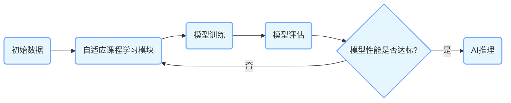

# 自适应课程学习优化AI推理的学习曲线

> 关键词：自适应课程学习、AI推理、学习曲线优化、机器学习、智能教育

> 摘要：本文聚焦于自适应课程学习在优化AI推理学习曲线方面的应用。首先介绍了相关背景，包括目的、预期读者等信息。接着阐述了核心概念与联系，详细讲解了自适应课程学习和AI推理的原理及架构，并通过Mermaid流程图进行直观展示。在核心算法原理部分，使用Python代码进行了详细阐述。同时给出了数学模型和公式，并举例说明。通过项目实战，展示了如何搭建开发环境、实现源代码以及对代码进行解读分析。还探讨了实际应用场景，推荐了相关的学习资源、开发工具框架和论文著作。最后总结了未来发展趋势与挑战，提供了常见问题解答和扩展阅读参考资料，旨在为读者全面深入地介绍自适应课程学习优化AI推理学习曲线的相关知识。

## 1. 背景介绍 
### 1.1 目的和范围
在人工智能领域，如何提高AI推理的效率和准确性一直是研究的重点。学习曲线反映了模型在训练过程中的性能变化，优化学习曲线可以使模型更快地收敛到最优解，减少训练时间和资源消耗。自适应课程学习作为一种有效的学习策略，能够根据模型的当前状态动态调整学习内容和顺序，从而优化学习曲线。本文的目的是深入探讨自适应课程学习在优化AI推理学习曲线方面的原理、方法和应用，涵盖从理论基础到实际项目的各个方面。

### 1.2 预期读者
本文预期读者包括人工智能领域的研究人员、开发者、学生以及对自适应学习和AI推理感兴趣的技术爱好者。对于有一定机器学习基础的读者，本文可以帮助他们深入理解自适应课程学习的原理和应用；对于初学者，本文可以作为一个系统的学习资料，引导他们进入这个领域。

### 1.3 文档结构概述
本文将按照以下结构进行组织：首先介绍核心概念与联系，包括自适应课程学习和AI推理的基本原理和架构；然后详细讲解核心算法原理和具体操作步骤，使用Python代码进行说明；接着给出数学模型和公式，并通过举例进行详细讲解；通过项目实战展示如何在实际中应用自适应课程学习优化AI推理的学习曲线；探讨实际应用场景；推荐相关的学习资源、开发工具框架和论文著作；最后总结未来发展趋势与挑战，提供常见问题解答和扩展阅读参考资料。

### 1.4 术语表
#### 1.4.1 核心术语定义
- **自适应课程学习（Adaptive Curriculum Learning）**：一种学习策略，根据学习者（模型）的当前状态动态调整学习内容和顺序，使学习者能够更有效地学习。
- **AI推理（AI Inference）**：指在训练好的人工智能模型上进行预测或决策的过程。
- **学习曲线（Learning Curve）**：描述了模型在训练过程中性能（如准确率、损失函数值等）随训练时间或训练样本数量的变化情况。

#### 1.4.2 相关概念解释
- **课程学习（Curriculum Learning）**：是自适应课程学习的基础，它按照一定的顺序安排学习任务，通常从简单任务开始，逐渐过渡到复杂任务。
- **模型收敛（Model Convergence）**：指模型在训练过程中，其性能（如损失函数值）逐渐稳定并接近最优值的过程。

#### 1.4.3 缩略词列表
- **ML（Machine Learning）**：机器学习
- **DL（Deep Learning）**：深度学习
- **CNN（Convolutional Neural Network）**：卷积神经网络
- **RNN（Recurrent Neural Network）**：循环神经网络

## 2. 核心概念与联系 
### 2.1 自适应课程学习原理
自适应课程学习的核心思想是根据模型的当前状态动态调整学习内容和顺序。传统的课程学习通常按照预先定义的顺序安排学习任务，而自适应课程学习则能够实时评估模型的学习进度和能力，选择最适合当前模型的学习任务。例如，当模型在某个类型的任务上表现较好时，自适应课程学习会逐渐引入更具挑战性的任务；当模型遇到困难时，会适当降低任务难度，提供更多的基础训练。

### 2.2 AI推理原理
AI推理是在训练好的模型上进行预测或决策的过程。在训练阶段，模型通过学习大量的数据来调整自身的参数，以最小化预测结果与真实结果之间的误差。在推理阶段，模型接收新的输入数据，并根据训练得到的参数进行预测。例如，在图像分类任务中，训练好的CNN模型可以对输入的图像进行分类，输出图像所属的类别。

### 2.3 核心概念架构
自适应课程学习和AI推理之间存在着紧密的联系。自适应课程学习可以优化AI推理模型的学习曲线，使模型更快地收敛到最优解，从而提高推理的效率和准确性。具体架构如下：



在这个架构中，初始数据首先进入自适应课程学习模块，该模块根据模型的当前状态选择合适的学习任务。然后进行模型训练，训练完成后对模型进行评估。如果模型性能达标，则可以进行AI推理；否则，自适应课程学习模块会调整学习任务，继续进行训练。

## 3. 核心算法原理 & 具体操作步骤 
### 3.1 自适应课程学习算法原理
自适应课程学习的算法原理主要基于模型的性能评估和任务难度调整。以下是一个简单的自适应课程学习算法的Python实现：

```python
import numpy as np

# 定义任务列表
tasks = [{"difficulty": 1, "data": np.random.rand(100, 10)},
         {"difficulty": 2, "data": np.random.rand(100, 10)},
         {"difficulty": 3, "data": np.random.rand(100, 10)}]

# 初始化模型
model =...

# 定义性能评估函数
def evaluate_model(model, data):
    # 这里简单返回随机准确率作为示例
    return np.random.rand()

# 自适应课程学习算法
current_task_index = 0
for epoch in range(10):
    current_task = tasks[current_task_index]
    data = current_task["data"]
    # 训练模型
   ...
    # 评估模型性能
    performance = evaluate_model(model, data)
    if performance > 0.8:
        # 如果性能达标，选择更难的任务
        if current_task_index < len(tasks) - 1:
            current_task_index += 1
    else:
        # 如果性能不达标，选择更简单的任务
        if current_task_index > 0:
            current_task_index -= 1
```

### 3.2 具体操作步骤
1. **定义任务列表**：将学习任务按照难度进行排序，每个任务包含相应的数据。
2. **初始化模型**：选择合适的模型结构，并初始化模型参数。
3. **定义性能评估函数**：用于评估模型在当前任务上的性能。
4. **开始训练**：从最简单的任务开始，对模型进行训练。
5. **评估性能**：在每个训练周期结束后，使用性能评估函数评估模型的性能。
6. **调整任务**：根据模型的性能，动态调整下一个学习任务的难度。
7. **重复训练**：重复步骤4-6，直到模型性能达标。

## 4. 数学模型和公式 & 详细讲解 & 举例说明 
### 4.1 学习曲线的数学模型
学习曲线通常可以用一个函数来表示，例如指数衰减函数：

$$L(t) = L_0 \cdot e^{-\alpha t}$$

其中，$L(t)$ 表示在时间 $t$ 时的损失函数值，$L_0$ 是初始损失函数值，$\alpha$ 是衰减系数。这个公式表示随着训练时间的增加，损失函数值逐渐减小，模型性能逐渐提高。

### 4.2 自适应课程学习的数学模型
自适应课程学习可以通过调整任务难度来优化学习曲线。假设任务难度用 $d$ 表示，模型在任务 $d$ 上的学习效率用 $\eta(d)$ 表示。自适应课程学习的目标是最大化学习效率：

$$\max_{d} \eta(d)$$

在实际应用中，$\eta(d)$ 可以通过模型在任务 $d$ 上的性能评估来计算。例如，可以定义 $\eta(d)$ 为模型在任务 $d$ 上的准确率：

$$\eta(d) = \text{Accuracy}(d)$$

### 4.3 举例说明
假设我们有三个任务，难度分别为 $d_1 = 1$，$d_2 = 2$，$d_3 = 3$。在训练过程中，我们通过评估模型在每个任务上的准确率来调整任务难度。初始时，模型从任务 $d_1$ 开始学习。如果模型在任务 $d_1$ 上的准确率达到了 $0.8$，则切换到任务 $d_2$；如果在任务 $d_2$ 上的准确率低于 $0.6$，则切换回任务 $d_1$。通过这种方式，自适应课程学习可以使模型在不同难度的任务之间动态调整，从而优化学习曲线。

## 5. 项目实战：代码实际案例和详细解释说明 
### 5.1  开发环境搭建
#### 5.1.1 安装Python
首先需要安装Python，建议使用Python 3.7及以上版本。可以从Python官方网站（https://www.python.org/downloads/）下载安装包进行安装。

#### 5.1.2 安装必要的库
在本项目中，需要使用一些常见的机器学习库，如NumPy、Pandas、Scikit-learn和TensorFlow。可以使用以下命令进行安装：

```bash
pip install numpy pandas scikit-learn tensorflow
```

### 5.2  源代码详细实现和代码解读
以下是一个使用自适应课程学习优化AI推理学习曲线的完整Python代码示例：

```python
import numpy as np
import tensorflow as tf
from sklearn.model_selection import train_test_split

# 生成数据集
def generate_data(num_samples, num_features, difficulty):
    if difficulty == 1:
        # 简单任务数据
        X = np.random.randn(num_samples, num_features)
        y = (X[:, 0] > 0).astype(int)
    elif difficulty == 2:
        # 中等难度任务数据
        X = np.random.randn(num_samples, num_features)
        y = ((X[:, 0] + X[:, 1]) > 0).astype(int)
    else:
        # 复杂任务数据
        X = np.random.randn(num_samples, num_features)
        y = ((X[:, 0] * X[:, 1] + X[:, 2]) > 0).astype(int)
    return X, y

# 定义模型
def build_model(num_features):
    model = tf.keras.Sequential([
        tf.keras.layers.Dense(64, activation='relu', input_shape=(num_features,)),
        tf.keras.layers.Dense(1, activation='sigmoid')
    ])
    model.compile(optimizer='adam', loss='binary_crossentropy', metrics=['accuracy'])
    return model

# 自适应课程学习
tasks = [1, 2, 3]
current_task_index = 0
num_features = 10
model = build_model(num_features)

for epoch in range(20):
    difficulty = tasks[current_task_index]
    X, y = generate_data(1000, num_features, difficulty)
    X_train, X_test, y_train, y_test = train_test_split(X, y, test_size=0.2)
    
    # 训练模型
    history = model.fit(X_train, y_train, epochs=1, validation_data=(X_test, y_test))
    
    # 评估模型性能
    accuracy = history.history['val_accuracy'][-1]
    if accuracy > 0.8:
        # 如果性能达标，选择更难的任务
        if current_task_index < len(tasks) - 1:
            current_task_index += 1
    else:
        # 如果性能不达标，选择更简单的任务
        if current_task_index > 0:
            current_task_index -= 1

# 进行AI推理
new_X = np.random.randn(10, num_features)
predictions = model.predict(new_X)
print(predictions)
```

### 5.3  代码解读与分析
#### 5.3.1 数据集生成
`generate_data` 函数根据任务难度生成不同复杂度的数据集。简单任务只依赖于第一个特征，中等难度任务依赖于前两个特征的和，复杂任务依赖于前两个特征的乘积和第三个特征的和。

#### 5.3.2 模型构建
`build_model` 函数构建了一个简单的神经网络模型，包含一个64个神经元的隐藏层和一个输出层，使用sigmoid激活函数进行二分类。

#### 5.3.3 自适应课程学习
在训练过程中，根据模型的性能动态调整任务难度。如果模型在当前任务上的准确率达到了 $0.8$，则选择更难的任务；否则，选择更简单的任务。

#### 5.3.4 AI推理
训练完成后，使用训练好的模型对新的数据进行预测。

## 6. 实际应用场景 
### 6.1 智能教育
在智能教育领域，自适应课程学习可以根据学生的学习进度和能力动态调整学习内容和难度。例如，智能辅导系统可以通过评估学生在不同知识点上的掌握情况，为学生提供个性化的学习任务，从而提高学习效率和效果。

### 6.2 自动驾驶
在自动驾驶领域，AI推理需要处理各种复杂的路况和场景。自适应课程学习可以帮助自动驾驶模型更快地学习和适应不同的路况，提高推理的准确性和可靠性。例如，在训练自动驾驶模型时，可以从简单的路况（如空旷的道路）开始，逐渐引入复杂的路况（如拥堵的城市道路）。

### 6.3 医疗诊断
在医疗诊断领域，AI推理可以帮助医生进行疾病诊断和预测。自适应课程学习可以根据患者的病情和特征，为模型提供合适的学习任务，从而提高诊断的准确性和效率。例如，在训练医疗诊断模型时，可以从常见疾病的诊断开始，逐渐引入罕见疾病的诊断。

## 7. 工具和资源推荐
### 7.1 学习资源推荐
#### 7.1.1 书籍推荐
- 《深度学习》（Deep Learning）：由Ian Goodfellow、Yoshua Bengio和Aaron Courville撰写，是深度学习领域的经典教材。
- 《机器学习》（Machine Learning）：由Tom Mitchell撰写，是机器学习领域的入门经典。
- 《自适应学习系统》（Adaptive Learning Systems）：介绍了自适应学习的原理、方法和应用。

#### 7.1.2 在线课程
- Coursera上的“深度学习专项课程”（Deep Learning Specialization）：由Andrew Ng教授授课，是深度学习领域的经典在线课程。
- edX上的“人工智能基础”（Fundamentals of Artificial Intelligence）：介绍了人工智能的基本概念、算法和应用。

#### 7.1.3 技术博客和网站
- Medium上的“Towards Data Science”：是一个专注于数据科学和机器学习的技术博客，提供了大量的优质文章和教程。
- Kaggle：是一个数据科学竞赛平台，上面有很多优秀的开源项目和代码示例，可以学习到很多实用的技巧和方法。

### 7.2 开发工具框架推荐
#### 7.2.1 IDE和编辑器
- PyCharm：是一个专业的Python集成开发环境，提供了丰富的功能和插件，适合开发Python项目。
- Jupyter Notebook：是一个交互式的开发环境，适合进行数据探索和模型实验。

#### 7.2.2 调试和性能分析工具
- TensorBoard：是TensorFlow提供的一个可视化工具，可以用于监控模型的训练过程、分析模型的性能等。
- Py-Spy：是一个Python性能分析工具，可以帮助开发者找出代码中的性能瓶颈。

#### 7.2.3 相关框架和库
- TensorFlow：是一个开源的深度学习框架，提供了丰富的工具和接口，适合开发各种深度学习模型。
- PyTorch：是另一个流行的深度学习框架，具有简洁易用的特点，受到很多研究者的喜爱。

### 7.3 相关论文著作推荐
#### 7.3.1 经典论文
- “Curriculum Learning”：由Yoshua Bengio等人发表，首次提出了课程学习的概念。
- “Adaptive Curriculum Learning for Neural Networks”：介绍了自适应课程学习在神经网络中的应用。

#### 7.3.2 最新研究成果
- 可以关注顶级学术会议（如NeurIPS、ICML、CVPR等）上的相关论文，了解自适应课程学习和AI推理领域的最新研究进展。

#### 7.3.3 应用案例分析
- 可以参考一些实际应用案例的论文，了解自适应课程学习在不同领域的应用方法和效果。

## 8. 总结：未来发展趋势与挑战
### 8.1 未来发展趋势
- **个性化学习**：自适应课程学习将更加注重个性化，根据每个学习者的特点和需求提供更加精准的学习内容和策略。
- **多模态学习**：结合多种模态的数据（如图像、文本、语音等）进行学习，提高模型的学习能力和泛化能力。
- **与强化学习的结合**：将自适应课程学习与强化学习相结合，实现更加智能的学习和决策。

### 8.2 挑战
- **任务难度评估**：如何准确评估任务的难度是自适应课程学习面临的一个挑战。不同的学习者对同一任务的难度感受可能不同，需要开发更加准确的难度评估方法。
- **数据质量和数量**：自适应课程学习需要大量高质量的数据来支持。如何获取和处理这些数据是一个需要解决的问题。
- **计算资源消耗**：自适应课程学习需要不断地调整学习任务和模型参数，计算资源消耗较大。如何优化算法和模型结构，降低计算资源消耗是一个重要的研究方向。

## 9. 附录：常见问题与解答
### 9.1 自适应课程学习和传统课程学习有什么区别？
传统课程学习通常按照预先定义的顺序安排学习任务，而自适应课程学习能够根据模型的当前状态动态调整学习内容和顺序，更加灵活和高效。

### 9.2 自适应课程学习一定能优化学习曲线吗？
不一定。自适应课程学习的效果取决于任务难度评估的准确性、模型的选择和训练方法等因素。如果这些因素处理不当，可能无法达到优化学习曲线的效果。

### 9.3 如何选择合适的性能评估指标？
选择合适的性能评估指标需要根据具体的任务和应用场景来决定。常见的性能评估指标包括准确率、召回率、F1值、损失函数值等。

## 10. 扩展阅读 & 参考资料
- [1] Bengio, Y., Louradour, J., Collobert, R., & Weston, J. (2009). Curriculum learning. In Proceedings of the 26th annual international conference on machine learning (pp. 41-48).
- [2] Graves, A., Wayne, G., & Danihelka, I. (2014). Neural Turing machines. arXiv preprint arXiv:1410.5401.
- [3] Goodfellow, I. J., Bengio, Y., & Courville, A. (2016). Deep learning. MIT press.

作者：AI天才研究院/AI Genius Institute & 禅与计算机程序设计艺术 /Zen And The Art of Computer Programming