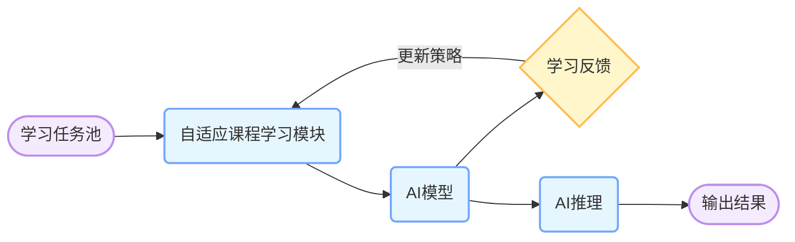

# 自适应课程学习优化AI推理的知识获取效率

> 关键词：自适应课程学习、AI推理、知识获取效率、机器学习、课程设计

> 摘要：本文围绕自适应课程学习优化AI推理的知识获取效率展开。详细介绍了自适应课程学习和AI推理的核心概念及其联系，阐述了相关核心算法原理并给出Python代码示例，深入分析了其数学模型和公式。通过项目实战展示了如何在实际中应用自适应课程学习来提高AI推理的知识获取效率，探讨了其实际应用场景。同时，推荐了相关的学习资源、开发工具框架以及论文著作。最后总结了未来发展趋势与挑战，并给出常见问题解答和扩展阅读参考资料，旨在为相关领域的研究和实践提供全面的技术指导。

## 1. 背景介绍 
### 1.1 目的和范围
在人工智能领域，提高AI推理的知识获取效率一直是研究的重点。传统的学习方法往往采用固定的训练顺序和数据分布，这可能导致AI在学习过程中陷入局部最优，无法高效地获取知识。自适应课程学习作为一种新兴的学习策略，通过动态地调整学习内容和顺序，能够根据AI当前的学习状态提供最适合的学习任务，从而优化知识获取效率。本文的目的在于深入探讨自适应课程学习如何优化AI推理的知识获取效率，涵盖了从核心概念、算法原理到实际应用的各个方面。

### 1.2 预期读者
本文预期读者包括人工智能领域的研究人员、开发者、学生以及对AI推理和自适应学习感兴趣的技术爱好者。对于研究人员，本文可以提供新的研究思路和方法；对于开发者，能够指导他们在实际项目中应用自适应课程学习来提高AI系统的性能；对于学生，有助于他们深入理解相关技术原理和应用场景。

### 1.3 文档结构概述
本文首先介绍自适应课程学习和AI推理的核心概念及其联系，通过文本示意图和Mermaid流程图进行直观展示。接着详细阐述核心算法原理，并使用Python源代码进行说明。然后分析其数学模型和公式，结合具体例子进行讲解。之后通过项目实战展示如何在实际中应用自适应课程学习，包括开发环境搭建、源代码实现和代码解读。再探讨其实际应用场景，推荐相关的学习资源、开发工具框架以及论文著作。最后总结未来发展趋势与挑战，给出常见问题解答和扩展阅读参考资料。

### 1.4 术语表
#### 1.4.1 核心术语定义
- **自适应课程学习（Adaptive Curriculum Learning）**：一种动态调整学习内容和顺序的学习策略，根据学习者的当前状态和能力，选择最适合的学习任务，以提高学习效率。
- **AI推理（AI Inference）**：指人工智能系统根据已学习的知识对新输入数据进行预测、分类或决策的过程。
- **知识获取效率（Knowledge Acquisition Efficiency）**：衡量AI系统在学习过程中获取新知识的速度和质量的指标。

#### 1.4.2 相关概念解释
- **课程设计（Curriculum Design）**：在自适应课程学习中，课程设计是指确定学习任务的顺序和难度级别，以引导学习者逐步掌握知识和技能。
- **元学习（Meta - Learning）**：一种学习如何学习的方法，通过在多个任务上进行训练，使模型能够快速适应新的任务。自适应课程学习可以与元学习相结合，提高学习的灵活性和适应性。

#### 1.4.3 缩略词列表
- **ML（Machine Learning）**：机器学习
- **DL（Deep Learning）**：深度学习
- **RL（Reinforcement Learning）**：强化学习

## 2. 核心概念与联系 

### 核心概念原理
自适应课程学习的核心原理是根据AI系统当前的学习状态，动态地选择最适合的学习任务。在传统的学习方法中，训练数据通常是随机或按照固定顺序呈现给模型的，这可能导致模型在学习过程中遇到困难，例如过拟合或欠拟合。而自适应课程学习通过对模型的性能进行评估，选择那些既不过于简单也不过于困难的任务进行学习，从而提高学习效率。

AI推理是指AI系统在学习完成后，对新输入数据进行处理和决策的过程。推理的准确性和效率取决于模型在学习过程中获取的知识和技能。自适应课程学习可以通过优化知识获取过程，提高AI推理的性能。

### 架构的文本示意图
自适应课程学习优化AI推理的知识获取效率的架构可以描述如下：

首先，有一个学习任务池，其中包含了不同难度和类型的学习任务。自适应课程学习模块根据AI模型当前的学习状态，从任务池中选择最适合的任务。AI模型对选择的任务进行学习，学习过程中会产生一些反馈信息，如损失函数值、准确率等。自适应课程学习模块根据这些反馈信息调整任务选择策略，不断优化学习过程。最后，经过学习的AI模型进行推理，对新输入的数据进行处理和决策。

### Mermaid流程图


## 3. 核心算法原理 & 具体操作步骤 

### 算法原理
自适应课程学习的一种常见算法是基于强化学习的方法。在这种方法中，将任务选择问题看作一个马尔可夫决策过程（MDP）。MDP由状态（State）、动作（Action）、奖励（Reward）和转移概率（Transition Probability）四个要素组成。

- **状态（State）**：表示AI模型当前的学习状态，可以用模型的参数、损失函数值、准确率等指标来表示。
- **动作（Action）**：表示从学习任务池中选择一个任务进行学习。
- **奖励（Reward）**：根据模型在学习任务上的表现给予奖励，例如，如果模型在某个任务上的准确率提高，则给予正奖励；如果准确率下降，则给予负奖励。
- **转移概率（Transition Probability）**：表示在执行某个动作后，模型从一个状态转移到另一个状态的概率。

通过强化学习算法，如Q - learning或Policy Gradient，自适应课程学习模块可以学习到最优的任务选择策略，从而提高AI推理的知识获取效率。

### Python源代码示例
```python
import numpy as np

# 定义学习任务池
task_pool = [
    {"difficulty": 1, "reward": 0.1},
    {"difficulty": 2, "reward": 0.2},
    {"difficulty": 3, "reward": 0.3},
    {"difficulty": 4, "reward": 0.4},
    {"difficulty": 5, "reward": 0.5}
]

# 初始化Q表
q_table = np.zeros((len(task_pool),))

# 定义超参数
alpha = 0.1  # 学习率
gamma = 0.9  # 折扣因子
epsilon = 0.1  # 探索率
num_episodes = 100

# 自适应课程学习过程
for episode in range(num_episodes):
    # 随机初始化状态
    state = np.random.randint(0, len(task_pool))

    for step in range(10):
        # 选择动作
        if np.random.uniform(0, 1) < epsilon:
            action = np.random.randint(0, len(task_pool))  # 探索
        else:
            action = np.argmax(q_table)  # 利用

        # 执行动作，获取奖励
        reward = task_pool[action]["reward"]

        # 更新Q表
        q_table[state] = (1 - alpha) * q_table[state] + alpha * (reward + gamma * np.max(q_table))

        # 更新状态
        state = action

# 选择最优任务
best_task_index = np.argmax(q_table)
best_task = task_pool[best_task_index]
print(f"最优任务难度: {best_task['difficulty']}, 奖励: {best_task['reward']}")
```

### 具体操作步骤
1. **初始化**：初始化学习任务池、Q表、超参数（学习率、折扣因子、探索率等）。
2. **选择动作**：根据当前状态，使用epsilon - greedy策略选择一个动作（即选择一个学习任务）。
3. **执行动作**：让AI模型学习选择的任务，获取奖励。
4. **更新Q表**：根据奖励和下一个状态的最大Q值，更新当前状态的Q值。
5. **更新状态**：将当前状态更新为执行动作后的状态。
6. **重复步骤2 - 5**：直到达到最大步数或满足终止条件。
7. **选择最优任务**：在学习结束后，选择Q值最大的任务作为最优任务。

## 4. 数学模型和公式 & 详细讲解 & 举例说明 

### 马尔可夫决策过程（MDP）
马尔可夫决策过程可以用一个五元组 $(S, A, P, R, \gamma)$ 表示，其中：
- $S$ 是状态集合，表示AI模型的所有可能学习状态。
- $A$ 是动作集合，表示从学习任务池中选择任务的所有可能动作。
- $P: S \times A \times S \to [0, 1]$ 是转移概率函数，表示在状态 $s$ 执行动作 $a$ 后转移到状态 $s'$ 的概率，即 $P(s'|s, a)$。
- $R: S \times A \to \mathbb{R}$ 是奖励函数，表示在状态 $s$ 执行动作 $a$ 后获得的奖励，即 $R(s, a)$。
- $\gamma \in [0, 1]$ 是折扣因子，用于权衡当前奖励和未来奖励的重要性。

### Q - learning算法
Q - learning是一种无模型的强化学习算法，用于学习最优的动作价值函数 $Q(s, a)$，表示在状态 $s$ 执行动作 $a$ 后获得的期望累积奖励。Q - learning的更新公式如下：
$$
Q(s_t, a_t) \leftarrow (1 - \alpha)Q(s_t, a_t) + \alpha\left[R(s_t, a_t) + \gamma \max_{a} Q(s_{t + 1}, a)\right]
$$
其中：
- $s_t$ 是当前状态。
- $a_t$ 是当前动作。
- $R(s_t, a_t)$ 是执行动作 $a_t$ 后获得的奖励。
- $s_{t + 1}$ 是下一个状态。
- $\alpha$ 是学习率，控制每次更新的步长。
- $\gamma$ 是折扣因子。

### 举例说明
假设AI模型有三种可能的状态 $S = \{s_1, s_2, s_3\}$，学习任务池中有两个任务 $A = \{a_1, a_2\}$。转移概率和奖励函数如下：

| $s$ | $a$ | $s'$ | $P(s'|s, a)$ | $R(s, a)$ |
| --- | --- | --- | --- | --- |
| $s_1$ | $a_1$ | $s_2$ | 0.8 | 1 |
| $s_1$ | $a_1$ | $s_3$ | 0.2 | -1 |
| $s_1$ | $a_2$ | $s_2$ | 0.3 | 2 |
| $s_1$ | $a_2$ | $s_3$ | 0.7 | -2 |

初始时，$Q(s, a)$ 表的值都为0。假设当前状态 $s_t = s_1$，选择动作 $a_t = a_1$，执行动作后转移到状态 $s_{t + 1} = s_2$，获得奖励 $R(s_t, a_t) = 1$。学习率 $\alpha = 0.1$，折扣因子 $\gamma = 0.9$。

根据Q - learning更新公式：
$$
Q(s_1, a_1) \leftarrow (1 - 0.1) \times 0 + 0.1\times\left[1 + 0.9\times\max_{a} Q(s_2, a)\right]
$$
由于初始时 $Q(s_2, a)$ 都为0，所以 $Q(s_1, a_1) = 0.1$。

## 5. 项目实战：代码实际案例和详细解释说明 

### 5.1 开发环境搭建
本项目使用Python语言进行开发，需要安装以下库：
- **NumPy**：用于数值计算。
- **TensorFlow** 或 **PyTorch**：用于构建和训练AI模型。

可以使用以下命令安装这些库：
```bash
pip install numpy tensorflow
```
或者
```bash
pip install numpy torch torchvision
```

### 5.2 源代码详细实现和代码解读
以下是一个使用自适应课程学习优化AI推理的完整代码示例，以手写数字识别任务为例：

```python
import numpy as np
import tensorflow as tf
from tensorflow.keras.datasets import mnist
from tensorflow.keras.models import Sequential
from tensorflow.keras.layers import Dense, Flatten

# 加载MNIST数据集
(x_train, y_train), (x_test, y_test) = mnist.load_data()

# 数据预处理
x_train = x_train / 255.0
x_test = x_test / 255.0

# 定义学习任务池
task_pool = [
    {"difficulty": 1, "num_samples": 1000},
    {"difficulty": 2, "num_samples": 3000},
    {"difficulty": 3, "num_samples": 5000},
    {"difficulty": 4, "num_samples": 7000},
    {"difficulty": 5, "num_samples": 9000}
]

# 初始化Q表
q_table = np.zeros((len(task_pool),))

# 定义超参数
alpha = 0.1  # 学习率
gamma = 0.9  # 折扣因子
epsilon = 0.1  # 探索率
num_episodes = 10

# 自适应课程学习过程
for episode in range(num_episodes):
    # 随机初始化状态
    state = np.random.randint(0, len(task_pool))

    # 构建AI模型
    model = Sequential([
        Flatten(input_shape=(28, 28)),
        Dense(128, activation='relu'),
        Dense(10, activation='softmax')
    ])

    model.compile(optimizer='adam',
                  loss='sparse_categorical_crossentropy',
                  metrics=['accuracy'])

    for step in range(10):
        # 选择动作
        if np.random.uniform(0, 1) < epsilon:
            action = np.random.randint(0, len(task_pool))  # 探索
        else:
            action = np.argmax(q_table)  # 利用

        # 获取任务数据
        num_samples = task_pool[action]["num_samples"]
        x_task = x_train[:num_samples]
        y_task = y_train[:num_samples]

        # 训练模型
        history = model.fit(x_task, y_task, epochs=1, verbose=0)

        # 评估模型
        _, accuracy = model.evaluate(x_test, y_test, verbose=0)

        # 计算奖励
        reward = accuracy

        # 更新Q表
        q_table[state] = (1 - alpha) * q_table[state] + alpha * (reward + gamma * np.max(q_table))

        # 更新状态
        state = action

# 选择最优任务
best_task_index = np.argmax(q_table)
best_task = task_pool[best_task_index]
print(f"最优任务难度: {best_task['difficulty']}, 样本数量: {best_task['num_samples']}")

# 使用最优任务数据训练最终模型
num_samples = best_task["num_samples"]
x_final = x_train[:num_samples]
y_final = y_train[:num_samples]

final_model = Sequential([
    Flatten(input_shape=(28, 28)),
    Dense(128, activation='relu'),
    Dense(10, activation='softmax')
])

final_model.compile(optimizer='adam',
                    loss='sparse_categorical_crossentropy',
                    metrics=['accuracy'])

final_model.fit(x_final, y_final, epochs=5)

# 评估最终模型
_, final_accuracy = final_model.evaluate(x_test, y_test)
print(f"最终模型准确率: {final_accuracy}")
```

### 代码解读与分析
1. **数据加载和预处理**：使用 `tensorflow.keras.datasets.mnist` 加载MNIST手写数字识别数据集，并将像素值归一化到 [0, 1] 范围内。
2. **定义学习任务池**：学习任务池包含不同难度的任务，这里用样本数量来表示难度。
3. **初始化Q表**：Q表用于存储每个任务的动作价值。
4. **自适应课程学习过程**：
    - 在每个episode中，随机初始化状态。
    - 使用epsilon - greedy策略选择动作（即选择一个学习任务）。
    - 获取任务数据，训练AI模型。
    - 评估模型在测试集上的准确率，将准确率作为奖励。
    - 根据奖励和Q - learning更新公式更新Q表。
    - 更新状态。
5. **选择最优任务**：在学习结束后，选择Q值最大的任务作为最优任务。
6. **训练最终模型**：使用最优任务的数据训练最终模型，并评估其在测试集上的准确率。

通过自适应课程学习，模型可以根据自身的学习状态选择最合适的任务进行学习，从而提高知识获取效率和最终的推理准确率。

## 6. 实际应用场景 
自适应课程学习优化AI推理的知识获取效率在许多实际场景中都有广泛的应用：

### 教育领域
在智能教育系统中，自适应课程学习可以根据学生的学习进度和能力，动态地调整学习内容和难度。例如，对于数学课程，系统可以根据学生在不同知识点上的掌握情况，为学生提供最适合的练习题和学习材料，从而提高学生的学习效率和成绩。

### 医疗领域
在医学图像识别中，AI模型需要学习大量的医学图像数据来提高诊断准确率。自适应课程学习可以根据模型的当前性能，选择不同难度的医学图像进行训练，例如从简单的正常图像到复杂的病变图像，从而加速模型的学习过程，提高诊断的准确性和效率。

### 自动驾驶领域
自动驾驶系统需要学习各种复杂的驾驶场景和规则。自适应课程学习可以根据车辆的当前行驶状态和环境条件，为模型提供最适合的训练任务，例如在不同的天气、路况和交通场景下进行模拟训练，从而提高自动驾驶系统的安全性和可靠性。

### 游戏领域
在游戏AI中，自适应课程学习可以让AI玩家根据对手的实力和游戏局势，动态地调整学习策略。例如，在策略游戏中，AI玩家可以从简单的对手开始学习，逐渐挑战更强大的对手，从而提高自己的游戏水平。

## 7. 工具和资源推荐
### 7.1 学习资源推荐
#### 7.1.1 书籍推荐
- 《深度学习》（Deep Learning）：由Ian Goodfellow、Yoshua Bengio和Aaron Courville撰写，是深度学习领域的经典教材，涵盖了深度学习的基本概念、算法和应用。
- 《强化学习：原理与Python实现》（Reinforcement Learning: An Introduction）：由Richard S. Sutton和Andrew G. Barto撰写，是强化学习领域的权威书籍，详细介绍了强化学习的理论和算法。
- 《自适应课程学习》（Adaptive Curriculum Learning）：专门介绍自适应课程学习的相关理论和方法，适合深入研究该领域的读者。

#### 7.1.2 在线课程
- Coursera上的“深度学习专项课程”（Deep Learning Specialization）：由Andrew Ng教授授课，涵盖了深度学习的各个方面，包括神经网络、卷积神经网络、循环神经网络等。
- edX上的“强化学习基础”（Fundamentals of Reinforcement Learning）：介绍了强化学习的基本概念、算法和应用，通过实践项目帮助学习者掌握强化学习的技能。
- Udemy上的“自适应课程学习实战”（Adaptive Curriculum Learning in Practice）：结合实际案例，讲解如何在项目中应用自适应课程学习。

#### 7.1.3 技术博客和网站
- Medium：有许多关于人工智能和机器学习的技术博客，其中不乏关于自适应课程学习的文章。
- arXiv：是一个预印本平台，提供了大量关于人工智能研究的最新论文，包括自适应课程学习的相关研究成果。
- Towards Data Science：专注于数据科学和人工智能领域的技术分享，有很多关于自适应课程学习的实践经验和案例分析。

### 7.2 开发工具框架推荐
#### 7.2.1 IDE和编辑器
- PyCharm：是一款专业的Python集成开发环境，提供了丰富的代码编辑、调试和项目管理功能，适合开发基于Python的AI项目。
- Jupyter Notebook：是一个交互式的开发环境，支持Python、R等多种编程语言，方便进行数据分析和模型训练的实验。
- Visual Studio Code：是一款轻量级的代码编辑器，具有丰富的插件生态系统，可以扩展其功能，支持Python开发和调试。

#### 7.2.2 调试和性能分析工具
- TensorBoard：是TensorFlow提供的可视化工具，可以用于监控模型的训练过程，分析模型的性能指标，如损失函数值、准确率等。
- PyTorch Profiler：是PyTorch提供的性能分析工具，可以帮助开发者找出代码中的性能瓶颈，优化模型的训练和推理速度。
- NVIDIA Nsight Systems：是一款针对NVIDIA GPU的性能分析工具，可以深入分析GPU的使用情况，优化GPU代码的性能。

#### 7.2.3 相关框架和库
- TensorFlow：是Google开发的开源深度学习框架，提供了丰富的工具和接口，支持各种深度学习模型的构建和训练。
- PyTorch：是Facebook开发的开源深度学习框架，具有动态图的特点，易于使用和调试，在学术界和工业界都有广泛的应用。
- Stable Baselines3：是一个基于PyTorch的强化学习库，提供了多种强化学习算法的实现，方便开发者进行强化学习实验。

### 7.3 相关论文著作推荐
#### 7.3.1 经典论文
- “Curriculum Learning”：由Yoshua Bengio等人发表，首次提出了课程学习的概念，为自适应课程学习的研究奠定了基础。
- “Adaptive Curriculum Learning for Deep Neural Networks”：详细介绍了自适应课程学习在深度神经网络中的应用和方法。
- “Meta - Curriculum Learning”：探讨了元学习与课程学习的结合，提出了元课程学习的概念。

#### 7.3.2 最新研究成果
- 在arXiv上搜索“Adaptive Curriculum Learning”可以找到最新的研究论文，了解该领域的前沿动态。
- 参加人工智能领域的顶级会议，如NeurIPS、ICML、CVPR等，这些会议上会有很多关于自适应课程学习的最新研究成果发表。

#### 7.3.3 应用案例分析
- 一些工业界的技术博客和论文会分享自适应课程学习在实际项目中的应用案例，例如自动驾驶、医疗诊断等领域。通过学习这些案例，可以了解自适应课程学习在实际应用中的挑战和解决方案。

## 8. 总结：未来发展趋势与挑战
### 未来发展趋势
- **与元学习的深度融合**：元学习可以让模型快速适应新的任务，自适应课程学习与元学习的结合将进一步提高模型的学习能力和泛化能力。例如，通过元学习学习到最优的课程设计策略，使自适应课程学习更加智能和高效。
- **多模态自适应课程学习**：随着人工智能技术的发展，多模态数据（如图像、文本、音频等）的处理变得越来越重要。未来的自适应课程学习将能够处理多模态数据，根据不同模态数据的特点和模型的学习状态，动态地调整学习任务和顺序。
- **在复杂系统中的应用**：自适应课程学习将在更复杂的系统中得到应用，如智能城市、工业自动化等。在这些系统中，模型需要处理大量的实时数据和复杂的环境变化，自适应课程学习可以帮助模型快速适应这些变化，提高系统的性能和可靠性。

### 挑战
- **状态表示的困难**：在自适应课程学习中，准确地表示AI模型的学习状态是一个挑战。目前的方法通常使用模型的参数、损失函数值等指标来表示状态，但这些指标可能无法全面反映模型的学习能力和知识水平。需要研究更有效的状态表示方法，以提高自适应课程学习的性能。
- **奖励设计的难题**：奖励函数的设计直接影响自适应课程学习的效果。如何设计一个合理的奖励函数，能够准确地反映模型在学习任务上的表现，是一个需要解决的问题。不合理的奖励函数可能导致模型陷入局部最优，无法达到全局最优的学习效果。
- **计算资源的需求**：自适应课程学习通常需要进行多次模型训练和评估，这对计算资源的需求较大。在实际应用中，如何在有限的计算资源下实现高效的自适应课程学习，是一个需要解决的挑战。

## 9. 附录：常见问题与解答
### 1. 自适应课程学习与传统学习方法有什么区别？
传统学习方法通常采用固定的训练顺序和数据分布，而自适应课程学习根据AI模型的当前学习状态，动态地选择最适合的学习任务。自适应课程学习可以避免模型在学习过程中陷入局部最优，提高学习效率和知识获取质量。

### 2. 如何选择合适的超参数（如学习率、折扣因子等）？
超参数的选择通常需要通过实验来确定。可以采用网格搜索、随机搜索等方法，在一定的参数范围内进行搜索，选择使模型性能最优的超参数组合。也可以参考相关的研究论文和实践经验，选择一些常用的超参数值作为初始值，然后根据实验结果进行调整。

### 3. 自适应课程学习是否适用于所有类型的AI模型？
自适应课程学习适用于大多数类型的AI模型，包括神经网络、决策树、支持向量机等。但不同类型的模型可能需要根据其特点进行适当的调整和优化。例如，对于深度神经网络，需要考虑网络的结构和训练算法对自适应课程学习的影响。

### 4. 如何评估自适应课程学习的效果？
可以通过以下指标来评估自适应课程学习的效果：
- **知识获取效率**：比较自适应课程学习和传统学习方法在相同时间内模型获取的知识量和质量。
- **推理准确率**：在测试集上评估模型的推理准确率，比较自适应课程学习和传统学习方法的准确率差异。
- **学习曲线**：绘制模型在学习过程中的损失函数值、准确率等指标随时间的变化曲线，观察自适应课程学习是否能够加速模型的学习过程。

## 10. 扩展阅读 & 参考资料
- Bengio, Y., Louradour, J., Collobert, R., & Weston, J. (2009). Curriculum learning. In Proceedings of the 26th annual international conference on machine learning (pp. 41 - 48).
- Schulman, J., Levine, S., Abbeel, P., Jordan, M., & Moritz, P. (2015). Trust region policy optimization. In Advances in neural information processing systems (pp. 1889 - 1897).
- Finn, C., Abbeel, P., & Levine, S. (2017). Model - agnostic meta - learning for fast adaptation of deep networks. In Proceedings of the 34th International Conference on Machine Learning - Volume 70 (pp. 1126 - 1135).

作者：AI天才研究院/AI Genius Institute & 禅与计算机程序设计艺术 /Zen And The Art of Computer Programming