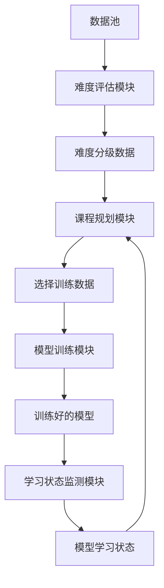

# 自适应课程学习优化AI推理的难度递进

> 关键词：自适应课程学习、AI推理、难度递进、优化算法、学习策略

> 摘要：本文围绕自适应课程学习优化AI推理的难度递进展开深入探讨。首先介绍了相关背景知识，包括目的范围、预期读者等内容。接着阐述了核心概念与联系，通过文本示意图和Mermaid流程图清晰展示其原理和架构。详细讲解了核心算法原理，结合Python源代码进行具体操作步骤的说明。同时给出了相关数学模型和公式，并举例加以说明。通过项目实战部分，展示了代码实际案例及详细解释。分析了该技术的实际应用场景，推荐了学习所需的工具和资源，包括书籍、在线课程等。最后总结了未来发展趋势与挑战，还提供了常见问题解答及扩展阅读参考资料，旨在全面深入地为读者呈现自适应课程学习优化AI推理难度递进的相关知识与技术。

## 1. 背景介绍 
### 1.1 目的和范围
自适应课程学习优化AI推理的难度递进这一研究的主要目的在于提升AI系统的学习效率和推理能力。在传统的AI学习过程中，模型往往是按照固定的数据集和顺序进行训练，这种方式可能导致模型在面对复杂任务时学习效率低下，难以快速适应不同难度的问题。通过自适应课程学习，能够根据模型当前的学习状态动态调整学习内容的难度，使模型逐步提升推理能力。

本研究的范围涵盖了自适应课程学习的基本理论、相关算法的实现、在不同AI领域（如计算机视觉、自然语言处理等）的应用，以及对其未来发展趋势的探讨。

### 1.2 预期读者
本文预期读者包括AI领域的研究人员、工程师、程序员以及对AI技术感兴趣的学生和爱好者。对于研究人员来说，本文提供了自适应课程学习的前沿理论和研究方向；对于工程师和程序员，文中包含的算法实现和项目实战部分可以帮助他们在实际项目中应用相关技术；而对于学生和爱好者，本文则可以作为一个系统学习自适应课程学习的资料，帮助他们了解该领域的基本概念和技术应用。

### 1.3 文档结构概述
本文首先介绍背景知识，让读者对自适应课程学习优化AI推理的难度递进有一个初步的了解。接着阐述核心概念与联系，通过直观的示意图和流程图展示其原理和架构。然后详细讲解核心算法原理和具体操作步骤，结合Python代码进行说明。之后给出数学模型和公式，并举例说明其应用。项目实战部分通过实际案例展示代码的实现和解读。分析实际应用场景，让读者了解该技术在现实中的应用价值。推荐相关的工具和资源，帮助读者进一步学习和研究。最后总结未来发展趋势与挑战，提供常见问题解答和扩展阅读参考资料。

### 1.4 术语表
#### 1.4.1 核心术语定义
- **自适应课程学习（Adaptive Curriculum Learning）**：是一种机器学习策略，它根据模型当前的学习状态动态地选择训练数据，使得模型从简单到复杂逐步学习，就像学生在课程学习中从基础内容逐步过渡到高级内容一样。
- **AI推理（AI Inference）**：指的是在训练好的AI模型上对新的数据进行预测和判断的过程。例如，在图像识别中，将一张新的图片输入到训练好的模型中，模型输出该图片所代表的物体类别，这个过程就是AI推理。
- **难度递进（Difficulty Progression）**：在自适应课程学习中，按照一定的规则和策略，让模型学习的任务难度逐步增加，以提高模型的学习效果和推理能力。

#### 1.4.2 相关概念解释
- **课程学习（Curriculum Learning）**：是自适应课程学习的基础概念，它强调按照一定的顺序安排训练数据，使得模型从简单的任务开始学习，逐渐过渡到复杂的任务。与自适应课程学习不同的是，课程学习的顺序通常是预先设定好的，而自适应课程学习可以根据模型的学习状态动态调整。
- **元学习（Meta - Learning）**：元学习是一种学习如何学习的方法，它可以快速适应新的任务和环境。自适应课程学习可以借鉴元学习的思想，通过学习不同难度任务的学习策略，更好地实现难度递进。

#### 1.4.3 缩略词列表
- **ML（Machine Learning）**：机器学习
- **DL（Deep Learning）**：深度学习
- **NLP（Natural Language Processing）**：自然语言处理
- **CV（Computer Vision）**：计算机视觉

## 2. 核心概念与联系 

### 核心概念原理
自适应课程学习优化AI推理的难度递进的核心原理是基于模型的学习状态动态地选择训练数据，让模型从简单到复杂逐步学习。在传统的机器学习中，模型通常是对所有的训练数据进行随机或顺序的学习，这样可能会导致模型在面对复杂任务时学习效率低下。而自适应课程学习通过对训练数据进行难度分级，根据模型当前的学习能力选择合适难度的训练数据，使得模型在每个阶段都能够有效地学习，逐步提升推理能力。

例如，在图像分类任务中，开始时可以让模型学习一些简单的图像分类，如区分猫和狗的图片。随着模型学习能力的提升，逐渐引入更复杂的图像分类任务，如区分不同品种的猫和狗。这样可以让模型在学习过程中不断挑战自己，提高学习效果。

### 架构的文本示意图
自适应课程学习优化AI推理的难度递进的架构主要包括以下几个部分：
1. **数据池**：包含不同难度级别的训练数据，这些数据可以是图像、文本、语音等。
2. **难度评估模块**：对数据池中的数据进行难度评估，将数据划分为不同的难度级别。
3. **学习状态监测模块**：实时监测模型的学习状态，如准确率、损失值等。
4. **课程规划模块**：根据模型的学习状态和数据的难度级别，动态地选择合适的训练数据。
5. **模型训练模块**：使用选择的训练数据对模型进行训练。

### Mermaid流程图


## 3. 核心算法原理 & 具体操作步骤 

### 核心算法原理
自适应课程学习优化AI推理的难度递进的核心算法主要包括数据难度评估算法和课程规划算法。

#### 数据难度评估算法
数据难度评估算法的目的是对数据池中的数据进行难度评估，将数据划分为不同的难度级别。一种常见的方法是基于模型在数据上的表现来评估难度。例如，对于图像分类任务，可以使用一个预训练的模型对数据进行分类，根据分类的准确率来评估数据的难度。准确率越低，说明数据越难。

#### 课程规划算法
课程规划算法根据模型的学习状态和数据的难度级别，动态地选择合适的训练数据。一种简单的课程规划算法是基于模型的准确率来选择数据。当模型的准确率较低时，选择难度较低的训练数据；当模型的准确率较高时，选择难度较高的训练数据。

### 具体操作步骤及Python源代码
以下是一个简单的自适应课程学习的Python示例，假设我们有一个图像分类任务，数据池中的数据已经按照难度级别进行了划分。

```python
import numpy as np

# 模拟数据池，每个元素代表一个难度级别的数据
data_pool = [
    np.random.rand(100, 10),  # 难度级别1的数据
    np.random.rand(100, 10),  # 难度级别2的数据
    np.random.rand(100, 10),  # 难度级别3的数据
]

# 模拟模型
class Model:
    def __init__(self):
        self.weights = np.random.rand(10, 1)

    def predict(self, X):
        return np.dot(X, self.weights)

    def train(self, X, y, learning_rate=0.01):
        predictions = self.predict(X)
        error = predictions - y
        gradient = np.dot(X.T, error)
        self.weights -= learning_rate * gradient

# 学习状态监测函数，这里简单使用准确率作为学习状态指标
def monitor_learning_state(model, X, y):
    predictions = model.predict(X)
    correct_predictions = (predictions > 0.5) == (y > 0.5)
    accuracy = np.mean(correct_predictions)
    return accuracy

# 课程规划函数，根据准确率选择合适难度的数据
def curriculum_planning(accuracy):
    if accuracy < 0.3:
        return 0  # 选择难度级别1的数据
    elif accuracy < 0.7:
        return 1  # 选择难度级别2的数据
    else:
        return 2  # 选择难度级别3的数据

# 主训练循环
model = Model()
num_epochs = 10
for epoch in range(num_epochs):
    # 生成随机标签
    y = np.random.randint(0, 2, (100, 1))

    # 监测学习状态
    accuracy = monitor_learning_state(model, data_pool[0], y)

    # 课程规划，选择合适难度的数据
    data_index = curriculum_planning(accuracy)
    X = data_pool[data_index]

    # 训练模型
    model.train(X, y)

    print(f"Epoch {epoch + 1}: Accuracy = {accuracy}")
```

在这个示例中，我们首先定义了一个数据池，包含不同难度级别的数据。然后定义了一个简单的模型，包括预测和训练方法。学习状态监测函数使用准确率作为学习状态指标，课程规划函数根据准确率选择合适难度的数据。在主训练循环中，我们不断监测学习状态，选择合适的数据进行训练，并打印出每个epoch的准确率。

## 4. 数学模型和公式 & 详细讲解 & 举例说明 

### 数据难度评估的数学模型
假设我们有一个数据集 $D = \{x_1, x_2, \cdots, x_n\}$，其中 $x_i$ 表示第 $i$ 个数据样本。我们使用一个预训练的模型 $f$ 对数据进行分类，分类结果为 $\hat{y}_i = f(x_i)$，真实标签为 $y_i$。数据样本 $x_i$ 的难度可以定义为：

$$d(x_i) = 1 - I(\hat{y}_i = y_i)$$

其中 $I(\cdot)$ 是指示函数，当 $\hat{y}_i = y_i$ 时，$I(\hat{y}_i = y_i) = 1$，否则 $I(\hat{y}_i = y_i) = 0$。数据集 $D$ 的平均难度可以定义为：

$$\bar{d}(D) = \frac{1}{n} \sum_{i = 1}^{n} d(x_i)$$

### 课程规划的数学模型
假设模型的准确率为 $a$，数据的难度级别集合为 $L = \{l_1, l_2, \cdots, l_m\}$，其中 $l_i$ 表示第 $i$ 个难度级别。课程规划函数 $C(a)$ 可以定义为：

$$C(a) = \begin{cases}
l_1, & a < t_1 \\
l_2, & t_1 \leq a < t_2 \\
\cdots \\
l_m, & a \geq t_{m - 1}
\end{cases}$$

其中 $t_1, t_2, \cdots, t_{m - 1}$ 是预先设定的准确率阈值。

### 举例说明
假设我们有一个图像分类任务，数据集包含1000张图片，使用一个预训练的图像分类模型对这些图片进行分类。分类结果显示，有800张图片分类正确，200张图片分类错误。那么数据集的平均难度为：

$$\bar{d}(D) = \frac{1}{1000} \times (1000 - 800) = 0.2$$

假设我们将数据的难度级别分为三个级别：$l_1$（简单），$l_2$（中等），$l_3$（困难），准确率阈值设定为 $t_1 = 0.3$，$t_2 = 0.7$。如果模型的准确率为 $a = 0.4$，根据课程规划函数 $C(a)$，应该选择难度级别为 $l_2$ 的数据进行训练。

## 5. 项目实战：代码实际案例和详细解释说明 

### 5.1  开发环境搭建
#### 操作系统
可以选择常见的操作系统，如Windows、Linux（如Ubuntu）或macOS。

#### 编程语言和库
- **Python**：选择Python 3.x版本。
- **深度学习框架**：可以选择TensorFlow、PyTorch等。这里以PyTorch为例，安装命令如下：
```sh
pip install torch torchvision
```
- **其他辅助库**：如NumPy、Matplotlib等，安装命令如下：
```sh
pip install numpy matplotlib
```

### 5.2  源代码详细实现和代码解读
以下是一个基于PyTorch的自适应课程学习的图像分类项目示例。

```python
import torch
import torch.nn as nn
import torch.optim as optim
from torchvision import datasets, transforms
import numpy as np

# 定义简单的卷积神经网络模型
class SimpleCNN(nn.Module):
    def __init__(self):
        super(SimpleCNN, self).__init__()
        self.conv1 = nn.Conv2d(1, 10, kernel_size=5)
        self.conv2 = nn.Conv2d(10, 20, kernel_size=5)
        self.fc1 = nn.Linear(320, 50)
        self.fc2 = nn.Linear(50, 10)

    def forward(self, x):
        x = nn.functional.relu(nn.functional.max_pool2d(self.conv1(x), 2))
        x = nn.functional.relu(nn.functional.max_pool2d(self.conv2(x), 2))
        x = x.view(-1, 320)
        x = nn.functional.relu(self.fc1(x))
        x = self.fc2(x)
        return nn.functional.log_softmax(x, dim=1)

# 数据预处理
transform = transforms.Compose([
    transforms.ToTensor(),
    transforms.Normalize((0.1307,), (0.3081,))
])

# 加载MNIST数据集
train_dataset = datasets.MNIST('data', train=True, download=True, transform=transform)
test_dataset = datasets.MNIST('data', train=False, transform=transform)

# 数据难度评估，这里简单将数据按标签分为不同难度级别
easy_indices = []
medium_indices = []
hard_indices = []
for i in range(len(train_dataset)):
    label = train_dataset[i][1]
    if label in [0, 1, 2]:
        easy_indices.append(i)
    elif label in [3, 4, 5]:
        medium_indices.append(i)
    else:
        hard_indices.append(i)

easy_dataset = torch.utils.data.Subset(train_dataset, easy_indices)
medium_dataset = torch.utils.data.Subset(train_dataset, medium_indices)
hard_dataset = torch.utils.data.Subset(train_dataset, hard_indices)

# 定义数据加载器
easy_loader = torch.utils.data.DataLoader(easy_dataset, batch_size=64, shuffle=True)
medium_loader = torch.utils.data.DataLoader(medium_dataset, batch_size=64, shuffle=True)
hard_loader = torch.utils.data.DataLoader(hard_dataset, batch_size=64, shuffle=True)
test_loader = torch.utils.data.DataLoader(test_dataset, batch_size=64, shuffle=False)

# 初始化模型、损失函数和优化器
model = SimpleCNN()
criterion = nn.NLLLoss()
optimizer = optim.SGD(model.parameters(), lr=0.01, momentum=0.5)

# 学习状态监测函数
def monitor_learning_state(model, test_loader):
    model.eval()
    correct = 0
    total = 0
    with torch.no_grad():
        for data, target in test_loader:
            output = model(data)
            _, predicted = torch.max(output.data, 1)
            total += target.size(0)
            correct += (predicted == target).sum().item()
    accuracy = correct / total
    return accuracy

# 课程规划函数
def curriculum_planning(accuracy):
    if accuracy < 0.6:
        return easy_loader
    elif accuracy < 0.8:
        return medium_loader
    else:
        return hard_loader

# 主训练循环
num_epochs = 10
for epoch in range(num_epochs):
    # 监测学习状态
    accuracy = monitor_learning_state(model, test_loader)

    # 课程规划，选择合适难度的数据加载器
    train_loader = curriculum_planning(accuracy)

    model.train()
    for batch_idx, (data, target) in enumerate(train_loader):
        optimizer.zero_grad()
        output = model(data)
        loss = criterion(output, target)
        loss.backward()
        optimizer.step()

    print(f"Epoch {epoch + 1}: Accuracy = {accuracy}")
```

### 5.3  代码解读与分析
1. **模型定义**：定义了一个简单的卷积神经网络 `SimpleCNN`，包含两个卷积层和两个全连接层。
2. **数据预处理**：使用 `transforms` 对数据进行预处理，包括转换为张量