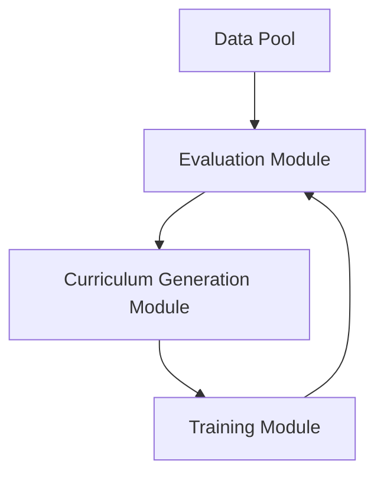

# 自适应课程学习优化AI推理训练过程

> 关键词：自适应课程学习、AI推理训练、优化策略、学习效率、模型性能

> 摘要：本文围绕自适应课程学习优化AI推理训练过程展开深入探讨。首先介绍了相关背景，包括目的、预期读者、文档结构和术语等。接着阐述了自适应课程学习的核心概念及其联系，给出了原理和架构的示意图与流程图。详细讲解了核心算法原理，并使用Python代码进行说明，同时介绍了相关的数学模型和公式。通过项目实战展示了代码实际案例及详细解释。分析了自适应课程学习在不同场景下的实际应用，推荐了学习资源、开发工具框架和相关论文著作。最后总结了未来发展趋势与挑战，并给出常见问题解答和扩展阅读参考资料，旨在帮助读者全面理解自适应课程学习在优化AI推理训练过程中的重要作用和应用方法。

## 1. 背景介绍 
### 1.1 目的和范围
随着人工智能技术的飞速发展，AI推理训练的复杂性和计算成本不断增加。传统的训练方法往往缺乏灵活性，难以根据模型的学习状态和数据特点进行动态调整。自适应课程学习作为一种新兴的训练策略，旨在通过动态调整训练数据的顺序和难度，提高AI模型的学习效率和性能。本文的目的是深入探讨自适应课程学习在优化AI推理训练过程中的原理、方法和应用，涵盖了从基本概念到实际项目实战的各个方面，为读者提供全面而系统的知识体系。

### 1.2 预期读者
本文主要面向对人工智能、机器学习和深度学习感兴趣的技术人员，包括程序员、数据科学家、算法工程师和研究人员等。同时，对于希望了解自适应课程学习在AI推理训练中应用的相关专业学生和从业者也具有一定的参考价值。

### 1.3 文档结构概述
本文共分为十个部分。第一部分为背景介绍，阐述了文章的目的、预期读者和文档结构。第二部分介绍自适应课程学习的核心概念与联系，包括原理和架构的示意图与流程图。第三部分详细讲解核心算法原理，并使用Python代码进行说明。第四部分介绍相关的数学模型和公式，并给出举例说明。第五部分通过项目实战展示代码实际案例及详细解释。第六部分分析自适应课程学习的实际应用场景。第七部分推荐学习资源、开发工具框架和相关论文著作。第八部分总结未来发展趋势与挑战。第九部分为附录，给出常见问题与解答。第十部分提供扩展阅读和参考资料。

### 1.4 术语表
#### 1.4.1 核心术语定义
- **自适应课程学习（Adaptive Curriculum Learning）**：一种动态调整训练数据顺序和难度的学习策略，使模型能够根据自身的学习状态逐步学习更复杂的数据。
- **AI推理训练（AI Inference Training）**：指在人工智能领域中，对模型进行训练以使其能够进行准确推理的过程。
- **学习效率（Learning Efficiency）**：衡量模型在训练过程中学习新知识的速度和质量的指标。
- **模型性能（Model Performance）**：指模型在特定任务上的表现，如准确率、召回率等。

#### 1.4.2 相关概念解释
- **课程学习（Curriculum Learning）**：是一种模仿人类学习过程的训练方法，先让模型学习简单的数据，再逐渐引入复杂的数据。自适应课程学习是课程学习的进一步发展，它能够根据模型的实时反馈动态调整课程。
- **动态调整（Dynamic Adjustment）**：在训练过程中，根据模型的学习状态、数据特点等因素实时改变训练策略，如调整学习率、数据顺序等。

#### 1.4.3 缩略词列表
- **AI**：Artificial Intelligence，人工智能
- **ML**：Machine Learning，机器学习
- **DL**：Deep Learning，深度学习

## 2. 核心概念与联系 

### 核心概念原理
自适应课程学习的核心思想是根据模型的学习状态动态地选择和安排训练数据，使得模型能够以最优的顺序学习不同难度的数据。在传统的训练方法中，数据通常是随机或按照固定顺序输入模型进行训练的，这种方式可能导致模型在学习初期接触到过于复杂的数据，从而增加学习难度和训练时间。而自适应课程学习则通过评估模型在不同数据上的表现，优先选择模型容易学习的数据进行训练，随着模型能力的提升，逐渐引入更复杂的数据。

### 架构的文本示意图
自适应课程学习的架构主要包括以下几个部分：
1. **数据池（Data Pool）**：存储所有的训练数据，这些数据按照难度或其他特征进行分类。
2. **评估模块（Evaluation Module）**：定期评估模型在不同数据子集上的表现，如准确率、损失值等。
3. **课程生成模块（Curriculum Generation Module）**：根据评估模块的结果，动态生成训练课程，确定下一批要训练的数据。
4. **训练模块（Training Module）**：使用课程生成模块生成的训练课程对模型进行训练。

```plaintext
+-----------------+
|    Data Pool    |
+-----------------+
       |
       v
+-----------------+
| Evaluation Module |
+-----------------+
       |
       v
+-----------------+
| Curriculum Generation Module |
+-----------------+
       |
       v
+-----------------+
|  Training Module  |
+-----------------+
```

### Mermaid流程图


该流程图展示了自适应课程学习的循环过程。首先，评估模块从数据池中选择部分数据对模型进行评估，然后课程生成模块根据评估结果生成训练课程，训练模块使用该课程对模型进行训练。训练完成后，再次进行评估，如此循环，直到模型达到满意的性能。

## 3. 核心算法原理 & 具体操作步骤 

### 核心算法原理
自适应课程学习的核心算法通常基于强化学习或启发式方法。下面以基于启发式方法的自适应课程学习算法为例进行说明。

该算法的基本思想是根据模型在不同数据子集上的损失值来动态调整训练顺序。具体步骤如下：
1. 将训练数据划分为多个子集，每个子集具有不同的难度级别。
2. 初始化模型和训练参数。
3. 对于每个训练轮次：
    - 计算模型在每个数据子集上的损失值。
    - 根据损失值对数据子集进行排序，优先选择损失值较小的数据子集进行训练。
    - 使用选择的数据子集对模型进行训练。
4. 重复步骤3，直到达到预定的训练轮数或模型性能满足要求。

### Python源代码详细阐述
```python
import numpy as np
import torch
import torch.nn as nn
import torch.optim as optim

# 定义一个简单的神经网络模型
class SimpleModel(nn.Module):
    def __init__(self, input_size, hidden_size, output_size):
        super(SimpleModel, self).__init__()
        self.fc1 = nn.Linear(input_size, hidden_size)
        self.relu = nn.ReLU()
        self.fc2 = nn.Linear(hidden_size, output_size)

    def forward(self, x):
        out = self.fc1(x)
        out = self.relu(out)
        out = self.fc2(out)
        return out

# 生成示例数据
input_size = 10
hidden_size = 20
output_size = 2
num_samples = 100
data = torch.randn(num_samples, input_size)
labels = torch.randint(0, output_size, (num_samples,))

# 将数据划分为多个子集
num_subsets = 5
subset_size = num_samples // num_subsets
data_subsets = [data[i * subset_size:(i + 1) * subset_size] for i in range(num_subsets)]
label_subsets = [labels[i * subset_size:(i + 1) * subset_size] for i in range(num_subsets)]

# 初始化模型、损失函数和优化器
model = SimpleModel(input_size, hidden_size, output_size)
criterion = nn.CrossEntropyLoss()
optimizer = optim.Adam(model.parameters(), lr=0.001)

# 自适应课程学习训练过程
num_epochs = 10
for epoch in range(num_epochs):
    # 计算每个子集的损失值
    losses = []
    for i in range(num_subsets):
        outputs = model(data_subsets[i])
        loss = criterion(outputs, label_subsets[i])
        losses.append(loss.item())

    # 根据损失值对数据子集进行排序
    sorted_indices = np.argsort(losses)

    # 按排序后的顺序训练模型
    for index in sorted_indices:
        optimizer.zero_grad()
        outputs = model(data_subsets[index])
        loss = criterion(outputs, label_subsets[index])
        loss.backward()
        optimizer.step()

    print(f'Epoch {epoch + 1}/{num_epochs}, Loss: {np.mean(losses)}')
```

### 代码解释
1. **定义模型**：定义了一个简单的两层神经网络模型 `SimpleModel`。
2. **生成示例数据**：生成了100个样本的输入数据和对应的标签，并将数据划分为5个子集。
3. **初始化模型、损失函数和优化器**：使用 `Adam` 优化器和交叉熵损失函数。
4. **自适应课程学习训练过程**：
    - 每个训练轮次，计算模型在每个数据子集上的损失值。
    - 根据损失值对数据子集进行排序，优先选择损失值较小的数据子集进行训练。
    - 使用选择的数据子集对模型进行训练，并更新模型参数。

## 4. 数学模型和公式 & 详细讲解 & 举例说明 

### 数学模型和公式
在自适应课程学习中，常用的数学模型和公式如下：

#### 损失函数
假设我们有一个分类任务，使用交叉熵损失函数来衡量模型的预测结果与真实标签之间的差异。对于一个样本 $(x_i, y_i)$，其中 $x_i$ 是输入数据，$y_i$ 是真实标签，模型的预测结果为 $\hat{y}_i$，交叉熵损失函数的定义为：

$$
L(y_i, \hat{y}_i) = - \sum_{j=1}^{C} y_{ij} \log(\hat{y}_{ij})
$$

其中 $C$ 是类别数，$y_{ij}$ 是真实标签的第 $j$ 个分量，$\hat{y}_{ij}$ 是模型预测结果的第 $j$ 个分量。

#### 模型更新公式
在训练过程中，使用梯度下降法来更新模型的参数。对于一个参数 $\theta$，其更新公式为：

$$
\theta_{t+1} = \theta_t - \alpha \frac{\partial L}{\partial \theta}
$$

其中 $\theta_t$ 是第 $t$ 次迭代时的参数值，$\alpha$ 是学习率，$\frac{\partial L}{\partial \theta}$ 是损失函数关于参数 $\theta$ 的梯度。

### 详细讲解
交叉熵损失函数是分类任务中常用的损失函数，它衡量了模型预测结果与真实标签之间的概率分布差异。当模型的预测结果与真实标签完全一致时，交叉熵损失函数的值为0；当预测结果与真实标签差异较大时，损失函数的值会增大。

梯度下降法是一种优化算法，通过不断地沿着损失函数的负梯度方向更新模型的参数，使得损失函数的值逐渐减小。学习率 $\alpha$ 控制了每次更新的步长，过大的学习率可能导致模型无法收敛，而过小的学习率会导致训练速度缓慢。

### 举例说明
假设我们有一个二分类任务，真实标签 $y = [1, 0]$，模型的预测结果 $\hat{y} = [0.8, 0.2]$。根据交叉熵损失函数的公式，计算损失值为：

$$
L(y, \hat{y}) = - (1 \times \log(0.8) + 0 \times \log(0.2)) \approx 0.223
$$

假设模型的一个参数 $\theta$ 的初始值为 $\theta_0 = 0.5$，学习率 $\alpha = 0.1$，损失函数关于 $\theta$ 的梯度为 $\frac{\partial L}{\partial \theta} = 0.2$。根据模型更新公式，更新后的参数值为：

$$
\theta_1 = \theta_0 - \alpha \frac{\partial L}{\partial \theta} = 0.5 - 0.1 \times 0.2 = 0.48
$$

## 5. 项目实战：代码实际案例和详细解释说明 

### 5.1  开发环境搭建
#### 安装Python
首先需要安装Python，建议使用Python 3.7及以上版本。可以从Python官方网站（https://www.python.org/downloads/）下载并安装。

#### 安装深度学习框架
本文使用PyTorch作为深度学习框架，可以使用以下命令进行安装：
```bash
pip install torch torchvision
```

#### 安装其他依赖库
还需要安装一些其他的依赖库，如NumPy、Matplotlib等，可以使用以下命令进行安装：
```bash
pip install numpy matplotlib
```

### 5.2  源代码详细实现和代码解读
```python
import numpy as np
import torch
import torch.nn as nn
import torch.optim as optim
import matplotlib.pyplot as plt

# 定义一个更复杂的神经网络模型
class ComplexModel(nn.Module):
    def __init__(self, input_size, hidden_size1, hidden_size2, output_size):
        super(ComplexModel, self).__init__()
        self.fc1 = nn.Linear(input_size, hidden_size1)
        self.relu1 = nn.ReLU()
        self.fc2 = nn.Linear(hidden_size1, hidden_size2)
        self.relu2 = nn.ReLU()
        self.fc3 = nn.Linear(hidden_size2, output_size)

    def forward(self, x):
        out = self.fc1(x)
        out = self.relu1(out)
        out = self.fc2(out)
        out = self.relu2(out)
        out = self.fc3(out)
        return out

# 生成更复杂的示例数据
input_size = 20
hidden_size1 = 50
hidden_size2 = 30
output_size = 3
num_samples = 200
data = torch.randn(num_samples, input_size)
labels = torch.randint(0, output_size, (num_samples,))

# 将数据划分为多个子集
num_subsets = 4
subset_size = num_samples // num_subsets
data_subsets = [data[i * subset_size:(i + 1) * subset_size] for i in range(num_subsets)]
label_subsets = [labels[i * subset_size:(i + 1) * subset_size] for i in range(num_subsets)]

# 初始化模型、损失函数和优化器
model = ComplexModel(input_size, hidden_size1, hidden_size2, output_size)
criterion = nn.CrossEntropyLoss()
optimizer = optim.SGD(model.parameters(), lr=0.01, momentum=0.9)

# 自适应课程学习训练过程
num_epochs = 20
loss_history = []
for epoch in range(num_epochs):
    # 计算每个子集的损失值
    losses = []
    for i in range(num_subsets):
        outputs = model(data_subsets[i])
        loss = criterion(outputs, label_subsets[i])
        losses.append(loss.item())

    # 根据损失值对数据子集进行排序
    sorted_indices = np.argsort(losses)

    # 按排序后的顺序训练模型
    epoch_loss = 0
    for index in sorted_indices:
        optimizer.zero_grad()
        outputs = model(data_subsets[index])
        loss = criterion(outputs, label_subsets[index])
        loss.backward()
        optimizer.step()
        epoch_loss += loss.item()

    epoch_loss /= num_subsets
    loss_history.append(epoch_loss)
    print(f'Epoch {epoch + 1}/{num_epochs}, Loss: {epoch_loss}')

# 绘制损失曲线
plt.plot(loss_history)
plt.xlabel('Epoch')
plt.ylabel('Loss')
plt.title('Adaptive Curriculum Learning Loss Curve')
plt.show()
```

### 代码解读与分析
1. **定义模型**：定义了一个三层的神经网络模型 `ComplexModel`，包含两个隐藏层。
2. **生成示例数据**：生成了200个样本的输入数据和对应的标签，并将数据划分为4个子集。
3. **初始化模型、损失函数和优化器**：使用随机梯度下降（SGD）优化器和交叉熵损失函数。
4. **自适应课程学习训练过程**：
    - 每个训练轮次，计算模型在每个数据子集上的损失值。
    - 根据损失值对数据子集进行排序，优先选择损失值较小的数据子集进行训练。
    - 使用选择的数据子集对模型进行训练，并更新模型参数。
    - 记录每个训练轮次的平均损失值。
5. **绘制损失曲线**：使用Matplotlib库绘制训练过程中的损失曲线，直观地展示模型的训练效果。

## 6. 实际应用场景 
### 图像识别
在图像识别任务中，自适应课程学习可以根据图像的复杂程度动态调整训练顺序。例如，先让模型学习简单的图像，如纯色背景下的单一物体图像，然后逐渐引入复杂的图像，如多物体、背景复杂的图像。这样可以提高模型的学习效率，减少过拟合的风险。

### 自然语言处理
在自然语言处理任务中，如文本分类、机器翻译等，自适应课程学习可以根据文本的难度和语义复杂度调整训练数据的顺序。例如，先让模型学习简单的句子，然后逐渐引入复杂的句子和段落。这有助于模型更好地理解语言的结构和语义，提高模型的性能。

### 强化学习
在强化学习中，自适应课程学习可以根据环境的难度和智能体的学习状态动态调整训练任务。例如，先让智能体在简单的环境中学习基本的策略，然后逐渐引入复杂的环境和任务。这可以加快智能体的学习速度，提高其在复杂环境中的性能。

## 7. 工具和资源推荐
### 7.1 学习资源推荐
#### 7.1.1 书籍推荐
- 《深度学习》（Deep Learning）：由Ian Goodfellow、Yoshua Bengio和Aaron Courville所著，是深度学习领域的经典教材，涵盖了深度学习的基本原理、算法和应用。
- 《机器学习》（Machine Learning）：由Tom M. Mitchell所著，是机器学习领域的经典教材，介绍了机器学习的基本概念、算法和模型。
- 《Python深度学习》（Deep Learning with Python）：由Francois Chollet所著，结合Python和Keras框架，详细介绍了深度学习的实践方法。

#### 7.1.2 在线课程
- Coursera上的“深度学习专项课程”（Deep Learning Specialization）：由Andrew Ng教授授课，涵盖了深度学习的各个方面，包括神经网络、卷积神经网络、循环神经网络等。
- edX上的“人工智能基础”（Introduction to Artificial Intelligence）：由麻省理工学院（MIT）的教授授课，介绍了人工智能的基本概念、算法和应用。
- Udemy上的“Python for Data Science and Machine Learning Bootcamp”：介绍了Python在数据科学和机器学习中的应用，包括数据处理、数据分析、机器学习算法等。

#### 7.1.3 技术博客和网站
- Medium：是一个技术博客平台，有很多关于人工智能、机器学习和深度学习的优秀文章。
- Towards Data Science：是一个专注于数据科学和机器学习的博客网站，提供了很多实用的教程和案例。
- arXiv：是一个预印本数据库，收录了很多人工智能领域的最新研究成果。

### 7.2 开发工具框架推荐
#### 7.2.1 IDE和编辑器
- PyCharm：是一款专门为Python开发设计的集成开发环境（IDE），提供了丰富的功能和插件，如代码调试、代码分析、版本控制等。
- Jupyter Notebook：是一个基于Web的交互式计算环境，支持Python、R等多种编程语言，适合进行数据探索、模型训练和结果展示。
- Visual Studio Code：是一款轻量级的代码编辑器，支持多种编程语言和插件，具有强大的代码编辑和调试功能。

#### 7.2.2 调试和性能分析工具
- PyTorch Profiler：是PyTorch提供的性能分析工具，可以帮助用户分析模型的训练时间、内存使用情况等，找出性能瓶颈。
- TensorBoard：是TensorFlow提供的可视化工具，也可以用于PyTorch模型的可视化，支持查看模型的训练过程、损失曲线、参数分布等。
- cProfile：是Python标准库中的性能分析工具，可以帮助用户分析Python代码的运行时间和函数调用情况。

#### 7.2.3 相关框架和库
- PyTorch：是一个开源的深度学习框架，具有动态计算图、易于使用等优点，广泛应用于图像识别、自然语言处理等领域。
- TensorFlow：是另一个开源的深度学习框架，具有强大的分布式训练和部署能力，被很多大型科技公司所采用。
- Scikit-learn：是一个用于机器学习的Python库，提供了丰富的机器学习算法和工具，如分类、回归、聚类等。

### 7.3 相关论文著作推荐
#### 7.3.1 经典论文
- "Curriculum Learning"：由Yoshua Bengio等人发表，首次提出了课程学习的概念，并证明了课程学习可以提高模型的学习效率和泛化能力。
- "Adaptive Curriculum Learning for Neural Networks"：进一步研究了自适应课程学习的方法和应用，提出了基于强化学习的自适应课程学习算法。

#### 7.3.2 最新研究成果
可以关注NeurIPS、ICML、CVPR等人工智能领域的顶级会议，以及相关的学术期刊，如Journal of Artificial Intelligence Research（JAIR）、Artificial Intelligence等，获取最新的研究成果。

#### 7.3.3 应用案例分析
可以参考一些开源项目和实际应用案例，了解自适应课程学习在不同领域的具体应用和实践经验。例如，在GitHub上搜索相关的项目，或者阅读一些技术博客和报告。

## 8. 总结：未来发展趋势与挑战
### 未来发展趋势
- **与其他技术的融合**：自适应课程学习将与强化学习、迁移学习、元学习等技术相结合，进一步提高模型的学习能力和适应性。
- **应用领域的拓展**：自适应课程学习将在更多的领域得到应用，如医疗保健、金融、交通等，为这些领域的智能化发展提供支持。
- **自动化和智能化**：未来的自适应课程学习系统将更加自动化和智能化，能够自动根据模型的学习状态和数据特点生成最优的训练课程。

### 挑战
- **数据难度评估**：如何准确地评估数据的难度是自适应课程学习面临的一个挑战。目前的方法大多基于经验或简单的特征，难以准确地反映数据的真实难度。
- **计算资源需求**：自适应课程学习需要频繁地评估模型在不同数据子集上的表现，这会增加计算资源的需求。如何在有限的计算资源下实现高效的自适应课程学习是一个亟待解决的问题。
- **模型通用性**：不同的模型和任务可能需要不同的自适应课程学习策略，如何设计通用的自适应课程学习方法，使其适用于各种模型和任务，是一个具有挑战性的问题。

## 9. 附录：常见问题与解答
### 问题1：自适应课程学习与传统课程学习有什么区别？
答：传统课程学习是按照预先定义好的顺序让模型学习不同难度的数据，而自适应课程学习能够根据模型的实时反馈动态地调整训练数据的顺序和难度，更加灵活和高效。

### 问题2：自适应课程学习一定能提高模型的性能吗？
答：自适应课程学习通常可以提高模型的学习效率和性能，但并不是在所有情况下都能取得更好的效果。其效果取决于数据的特点、模型的结构和训练参数等因素。在某些情况下，如果数据的难度分布比较均匀，或者模型已经具有较强的学习能力，自适应课程学习可能不会带来明显的提升。

### 问题3：如何选择合适的评估指标来评估模型在不同数据子集上的表现？
答：选择合适的评估指标需要根据具体的任务来确定。对于分类任务，常用的评估指标包括准确率、召回率、F1值等；对于回归任务，常用的评估指标包括均方误差（MSE）、平均绝对误差（MAE）等。此外，还可以根据任务的特点和需求选择其他的评估指标。

## 10. 扩展阅读 & 参考资料
### 扩展阅读
- "Meta-Curriculum Learning"：探讨了元课程学习的概念和方法，通过学习如何生成最优的课程来提高模型的学习能力。
- "Self-Paced Curriculum Learning"：提出了自定进度的课程学习方法，让模型根据自身的学习速度自动调整训练课程。

### 参考资料
- Goodfellow, I., Bengio, Y., & Courville, A. (2016). Deep Learning. MIT Press.
- Mitchell, T. M. (1997). Machine Learning. McGraw-Hill.
- Chollet, F. (2018). Deep Learning with Python. Manning Publications.

作者：AI天才研究院/AI Genius Institute & 禅与计算机程序设计艺术 /Zen And The Art of Computer Programming