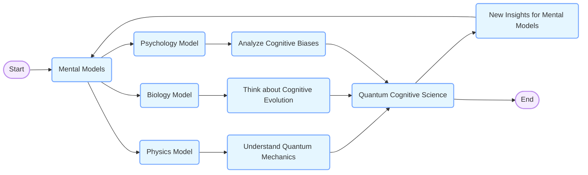

# 芒格的“mental models”在量子认知科学研究中的应用

> 关键词：芒格、mental models、量子认知科学、应用、认知模型

> 摘要：本文深入探讨了芒格的“mental models”在量子认知科学研究中的应用。首先介绍了研究的背景，包括目的、预期读者、文档结构和相关术语。接着阐述了核心概念与联系，分析了“mental models”和量子认知科学的原理及架构，并给出了相应的示意图和流程图。详细讲解了核心算法原理和具体操作步骤，通过Python源代码进行了示例。运用数学模型和公式进一步说明相关理论，并举例解释。通过项目实战展示了如何在实际中运用相关知识，包括开发环境搭建、源代码实现与解读。探讨了实际应用场景，推荐了相关的学习资源、开发工具框架和论文著作。最后总结了未来发展趋势与挑战，解答了常见问题，并提供了扩展阅读和参考资料。旨在为相关领域的研究者和从业者提供全面而深入的参考。

## 1. 背景介绍 
### 1.1 目的和范围
本研究的主要目的是探索芒格的“mental models”在量子认知科学研究中的具体应用。“mental models”是查理·芒格提出的一种重要思维方式，它涵盖了多个学科的知识和思维模式，有助于人们更全面、深入地理解和解决问题。量子认知科学则是一门新兴的交叉学科，研究量子力学原理在认知过程中的应用。将两者结合起来，旨在挖掘新的研究视角和方法，为量子认知科学的发展提供新的思路，同时也拓展“mental models”的应用领域。

研究范围包括对“mental models”和量子认知科学核心概念的分析，探讨两者之间的联系和相互作用；研究如何将“mental models”的思维方式融入量子认知科学的研究中，包括算法设计、模型构建等方面；通过实际案例展示这种应用的可行性和有效性；并对相关的学习资源、工具和未来发展趋势进行探讨。

### 1.2 预期读者
本文预期读者主要包括以下几类人群：
- 量子认知科学领域的研究者：他们可以从本文中获得新的研究思路和方法，将芒格的“mental models”引入到自己的研究中，拓展研究的深度和广度。
- 对思维方式和认知科学感兴趣的学者：了解“mental models”在量子认知科学中的应用，有助于他们从不同学科的交叉角度思考问题，丰富自己的知识体系。
- 人工智能和计算机科学领域的从业者：量子认知科学与这些领域密切相关，借鉴“mental models”的应用可以为他们在算法设计、模型优化等方面提供新的启示。
- 学生群体：无论是学习物理学、认知科学还是其他相关专业的学生，本文可以帮助他们拓宽视野，了解学科交叉的魅力和应用前景。

### 1.3 文档结构概述
本文将按照以下结构进行阐述：
- 核心概念与联系：介绍“mental models”和量子认知科学的核心概念，分析它们之间的联系，并给出相应的文本示意图和Mermaid流程图。
- 核心算法原理 & 具体操作步骤：详细讲解将“mental models”应用于量子认知科学研究中的核心算法原理，并给出具体的操作步骤，同时使用Python源代码进行示例。
- 数学模型和公式 & 详细讲解 & 举例说明：运用数学模型和公式进一步说明相关理论，并通过具体例子进行解释。
- 项目实战：代码实际案例和详细解释说明：通过一个实际项目，展示如何在实际中运用相关知识，包括开发环境搭建、源代码实现与解读。
- 实际应用场景：探讨“mental models”在量子认知科学研究中的实际应用场景。
- 工具和资源推荐：推荐相关的学习资源、开发工具框架和论文著作。
- 总结：未来发展趋势与挑战：总结研究成果，分析未来的发展趋势和面临的挑战。
- 附录：常见问题与解答：解答读者可能遇到的常见问题。
- 扩展阅读 & 参考资料：提供相关的扩展阅读材料和参考资料。

### 1.4 术语表
#### 1.4.1 核心术语定义
- **Mental models**：由查理·芒格提出，指的是人们在认识世界和解决问题时所采用的一系列思维模式和知识框架，这些模式和框架来源于不同的学科，如物理学、生物学、心理学等。
- **量子认知科学**：是一门交叉学科，将量子力学的原理和方法应用于认知科学的研究中，试图解释人类认知过程中的一些复杂现象，如决策、判断、记忆等。
- **量子态**：在量子力学中，量子态是描述量子系统状态的数学对象，它包含了系统所有可能的信息。在量子认知科学中，量子态可以用来表示认知状态。
- **叠加态**：量子系统的一种特殊状态，系统可以同时处于多个不同的状态，直到进行测量时才会塌缩到一个确定的状态。在量子认知科学中，叠加态可以用来解释人类在决策过程中的不确定性。

#### 1.4.2 相关概念解释
- **学科交叉**：指的是不同学科之间相互融合、相互渗透，形成新的研究领域和方法。在本研究中，“mental models”涉及多个学科的知识，量子认知科学本身就是物理学和认知科学的交叉学科，两者的结合体现了学科交叉的特点。
- **认知过程**：包括感知、注意、记忆、思维、语言等一系列心理活动，是人类认识世界和解决问题的基础。量子认知科学试图从量子力学的角度来解释这些认知过程。
- **思维模式**：是人们思考问题的方式和习惯，不同的思维模式会导致不同的认知结果。“mental models”强调从多个学科的角度来构建思维模式，以提高解决问题的能力。

#### 1.4.3 缩略词列表
- **QM**：Quantum Mechanics，量子力学
- **QCS**：Quantum Cognitive Science，量子认知科学

## 2. 核心概念与联系 

### 2.1 “mental models”原理
“mental models”的核心思想是通过整合多个学科的知识和思维模式，构建一个全面、系统的认知框架。芒格认为，不同学科的知识可以相互补充、相互印证，帮助人们更准确地理解和解决问题。例如，物理学中的牛顿力学可以教会我们如何分析物体的运动和相互作用；生物学中的进化论可以让我们理解生物的演化和适应机制；心理学中的认知偏差理论可以帮助我们认识到自己在思考过程中可能存在的错误。

通过学习和运用这些不同学科的“mental models”，人们可以避免只从单一角度看待问题，从而提高决策的质量和效率。例如，在投资决策中，不仅要考虑经济和财务因素，还要考虑政治、社会、技术等多个方面的因素。

### 2.2 量子认知科学原理
量子认知科学基于量子力学的原理，试图解释人类认知过程中的一些复杂现象。量子力学的一些特性，如叠加态、纠缠态、不确定性原理等，与人类认知过程中的一些现象具有相似性。

例如，叠加态可以用来解释人类在决策过程中的不确定性。在面临多个选择时，人们可能同时处于多种不同的认知状态，直到做出决策时才会确定下来。纠缠态可以用来描述认知过程中不同信息之间的相互关联和影响。不确定性原理则可以解释人类在认知过程中存在的一定程度的模糊性和不可预测性。

### 2.3 两者的联系
“mental models”和量子认知科学之间存在着紧密的联系。一方面，“mental models”提供了一种多学科的思维方式，有助于我们从不同的角度来理解量子认知科学中的复杂概念和现象。例如，物理学中的“mental models”可以帮助我们理解量子力学的基本原理，生物学中的“mental models”可以让我们从进化的角度来思考认知的起源和发展。

另一方面，量子认知科学的研究成果也可以丰富“mental models”的内涵。量子认知科学中提出的一些新的概念和理论，如量子决策模型、量子记忆模型等，可以为“mental models”提供新的思维模式和方法。

### 2.4 文本示意图
```plaintext
              +------------------+
              |  Mental Models   |
              |  (Multiple Disciplines) |
              +------------------+
                     |
                     |  Provides multi - disciplinary thinking
                     |
              +------------------+
              | Quantum Cognitive |
              |    Science        |
              +------------------+
```
这个示意图展示了“mental models”为量子认知科学提供多学科的思维方式，两者相互关联。

### 2.5 Mermaid流程图

这个流程图展示了“mental models”中的不同学科模型如何帮助理解量子认知科学，以及量子认知科学如何为“mental models”提供新的见解，形成一个循环的过程。

## 3. 核心算法原理 & 具体操作步骤 

### 3.1 核心算法原理
在将“mental models”应用于量子认知科学研究中，一个核心的算法思想是通过多学科知识的融合来构建量子认知模型。具体来说，可以采用以下步骤：
1. **知识提取**：从不同学科的“mental models”中提取与量子认知科学相关的知识和信息。例如，从物理学中提取量子力学的基本原理，从心理学中提取认知偏差的理论。
2. **模型构建**：将提取的知识和信息整合到一个统一的量子认知模型中。这个模型可以基于量子态的表示和演化来描述认知过程。
3. **模型验证**：使用实验数据或实际案例对构建的模型进行验证和优化。通过比较模型的预测结果和实际观察结果，调整模型的参数和结构，提高模型的准确性和可靠性。

### 3.2 具体操作步骤
#### 3.2.1 知识提取
- **确定学科范围**：根据研究的问题和目标，确定需要涉及的学科范围，如物理学、生物学、心理学、经济学等。
- **筛选相关知识**：在每个学科中，筛选出与量子认知科学相关的知识和理论。例如，在物理学中，筛选出量子态的表示、量子测量等知识；在心理学中，筛选出决策理论、认知偏差等知识。
- **整理知识信息**：将筛选出的知识信息进行整理和分类，形成一个知识图谱或知识库，以便后续的模型构建使用。

#### 3.2.2 模型构建
- **选择量子态表示**：根据研究的问题和数据特点，选择合适的量子态表示方法。例如，可以使用向量空间中的向量来表示量子态，或者使用密度矩阵来表示混合态。
- **定义量子操作**：根据提取的知识和信息，定义量子态的演化和测量操作。例如，可以定义量子门来描述量子态的演化，定义测量算子来描述量子测量的过程。
- **构建量子认知模型**：将量子态表示和量子操作组合起来，构建一个完整的量子认知模型。这个模型可以用数学公式或算法来描述。

#### 3.2.3 模型验证
- **收集实验数据**：通过实验或实际案例收集与量子认知相关的数据，如决策结果、认知反应时间等。
- **运行模型并比较结果**：使用收集到的数据运行构建的量子认知模型，并将模型的预测结果与实际观察结果进行比较。
- **优化模型参数和结构**：根据比较结果，调整模型的参数和结构，提高模型的准确性和可靠性。可以使用优化算法，如梯度下降法、遗传算法等。

### 3.3 Python源代码示例
```python
import numpy as np

# 定义量子态
def create_quantum_state():
    # 简单示例：创建一个二维量子态
    state = np.array([1/np.sqrt(2), 1/np.sqrt(2)])
    return state

# 定义量子操作（简单的旋转门）
def quantum_operation(state, theta):
    # 旋转门矩阵
    rotation_matrix = np.array([[np.cos(theta), -np.sin(theta)],
                                [np.sin(theta), np.cos(theta)]])
    new_state = np.dot(rotation_matrix, state)
    return new_state

# 定义量子测量
def quantum_measurement(state):
    probabilities = np.abs(state)**2
    measurement_result = np.random.choice([0, 1], p=probabilities)
    return measurement_result

# 构建量子认知模型
def quantum_cognitive_model():
    # 初始化量子态
    state = create_quantum_state()
    # 定义量子操作的参数
    theta = np.pi/4
    # 进行量子操作
    new_state = quantum_operation(state, theta)
    # 进行量子测量
    result = quantum_measurement(new_state)
    return result

# 运行模型多次并统计结果
num_trials = 1000
results = []
for _ in range(num_trials):
    result = quantum_cognitive_model()
    results.append(result)

# 统计测量结果的频率
count_0 = results.count(0)
count_1 = results.count(1)
print(f"Measurement result 0 frequency: {count_0/num_trials}")
print(f"Measurement result 1 frequency: {count_1/num_trials}")
```
在这个示例中，我们首先定义了一个简单的量子态，然后定义了一个量子操作（旋转门）和一个量子测量操作。接着，我们构建了一个量子认知模型，该模型包括量子态的初始化、量子操作和量子测量。最后，我们运行模型多次，并统计测量结果的频率。

## 4. 数学模型和公式 & 详细讲解 & 举例说明 

### 4.1 量子态的表示
在量子力学中，量子态可以用向量空间中的向量来表示。对于一个二维的量子系统，其量子态可以表示为：
$$|\psi\rangle = \alpha|0\rangle + \beta|1\rangle$$
其中，$|\psi\rangle$ 表示量子态，$\alpha$ 和 $\beta$ 是复数，满足 $|\alpha|^2 + |\beta|^2 = 1$，$|0\rangle$ 和 $|1\rangle$ 是基态。

例如，一个简单的量子态 $|\psi\rangle = \frac{1}{\sqrt{2}}|0\rangle + \frac{1}{\sqrt{2}}|1\rangle$ 表示系统处于 $|0\rangle$ 和 $|1\rangle$ 的等概率叠加态。

### 4.2 量子操作
量子操作可以用幺正矩阵来描述。对于一个二维的量子系统，一个常见的量子操作是旋转门，其矩阵表示为：
$$R(\theta) = \begin{bmatrix}
\cos(\theta) & -\sin(\theta) \\
\sin(\theta) & \cos(\theta)
\end{bmatrix}$$
其中，$\theta$ 是旋转角度。

当一个量子态 $|\psi\rangle$ 经过旋转门 $R(\theta)$ 作用后，新的量子态 $|\psi'\rangle$ 可以表示为：
$$|\psi'\rangle = R(\theta)|\psi\rangle$$

例如，对于量子态 $|\psi\rangle = \frac{1}{\sqrt{2}}|0\rangle + \frac{1}{\sqrt{2}}|1\rangle$，当 $\theta = \frac{\pi}{4}$ 时，旋转门矩阵为：
$$R(\frac{\pi}{4}) = \begin{bmatrix}
\frac{1}{\sqrt{2}} & -\frac{1}{\sqrt{2}} \\
\frac{1}{\sqrt{2}} & \frac{1}{\sqrt{2}}
\end{bmatrix}$$
则新的量子态为：
$$|\psi'\rangle = R(\frac{\pi}{4})|\psi\rangle = \begin{bmatrix}
\frac{1}{\sqrt{2}} & -\frac{1}{\sqrt{2}} \\
\frac{1}{\sqrt{2}} & \frac{1}{\sqrt{2}}
\end{bmatrix}
\begin{bmatrix}
\frac{1}{\sqrt{2}} \\
\frac{1}{\sqrt{2}}
\end{bmatrix}
= \begin{bmatrix}
0 \\
1
\end{bmatrix}$$

### 4.3 量子测量
量子测量是将量子态塌缩到一个确定的基态的过程。对于一个量子态 $|\psi\rangle = \alpha|0\rangle + \beta|1\rangle$，测量结果为 $|0\rangle$ 的概率为 $|\alpha|^2$，测量结果为 $|1\rangle$ 的概率为 $|\beta|^2$。

例如，对于量子态 $|\psi\rangle = \frac{1}{\sqrt{2}}|0\rangle + \frac{1}{\sqrt{2}}|1\rangle$，测量结果为 $|0\rangle$ 的概率为 $|\frac{1}{\sqrt{2}}|^2 = \frac{1}{2}$，测量结果为 $|1\rangle$ 的概率也为 $\frac{1}{2}$。

### 4.4 量子认知模型中的应用
在量子认知模型中，我们可以用上述的量子态表示、量子操作和量子测量来描述认知过程。例如，我们可以用量子态来表示认知状态，用量子操作来表示认知状态的演化，用量子测量来表示决策结果。

假设我们有一个简单的决策问题，有两个选项 $A$ 和 $B$。我们可以用一个二维的量子态来表示决策者的认知状态，$|0\rangle$ 表示倾向于选择 $A$，$|1\rangle$ 表示倾向于选择 $B$。在决策过程中，决策者的认知状态会受到各种因素的影响而发生演化，我们可以用一个量子操作来描述这种演化。最后，当决策者做出决策时，相当于进行了一次量子测量，测量结果就是决策者的选择。

## 5. 项目实战：代码实际案例和详细解释说明 

### 5.1  开发环境搭建
#### 5.1.1 安装Python
首先，需要安装Python编程语言。可以从Python官方网站（https://www.python.org/downloads/）下载适合自己操作系统的Python版本，并按照安装向导进行安装。建议安装Python 3.x版本。

#### 5.1.2 安装必要的库
在本项目中，我们需要使用NumPy库来进行数值计算。可以使用以下命令来安装NumPy：
```sh
pip install numpy
```
如果你使用的是Anaconda环境，可以使用以下命令来安装：
```sh
conda install numpy
```

### 5.2  源代码详细实现和代码解读
```python
import numpy as np

# 定义量子态
def create_quantum_state():
    """
    创建一个二维量子态，初始状态为等概率叠加态
    """
    state = np.array([1/np.sqrt(2), 1/np.sqrt(2)])
    return state

# 定义量子操作（简单的旋转门）
def quantum_operation(state, theta):
    """
    对量子态进行旋转操作
    :param state: 输入的量子态
    :param theta: 旋转角度
    :return: 操作后的量子态
    """
    # 旋转门矩阵
    rotation_matrix = np.array([[np.cos(theta), -np.sin(theta)],
                                [np.sin(theta), np.cos(theta)]])
    new_state = np.dot(rotation_matrix, state)
    return new_state

# 定义量子测量
def quantum_measurement(state):
    """
    对量子态进行测量，返回测量结果
    :param state: 输入的量子态
    :return: 测量结果（0或1）
    """
    probabilities = np.abs(state)**2
    measurement_result = np.random.choice([0, 1], p=probabilities)
    return measurement_result

# 构建量子认知模型
def quantum_cognitive_model():
    """
    构建一个简单的量子认知模型，包括量子态初始化、量子操作和量子测量
    """
    # 初始化量子态
    state = create_quantum_state()
    # 定义量子操作的参数
    theta = np.pi/4
    # 进行量子操作
    new_state = quantum_operation(state, theta)
    # 进行量子测量
    result = quantum_measurement(new_state)
    return result

# 运行模型多次并统计结果
num_trials = 1000
results = []
for _ in range(num_trials):
    result = quantum_cognitive_model()
    results.append(result)

# 统计测量结果的频率
count_0 = results.count(0)
count_1 = results.count(1)
print(f"Measurement result 0 frequency: {count_0/num_trials}")
print(f"Measurement result 1 frequency: {count_1/num_trials}")
```
### 5.3  代码解读与分析
#### 5.3.1 量子态的创建
`create_quantum_state` 函数用于创建一个二维的量子态，初始状态为等概率叠加态。通过 `np.array` 函数创建一个包含两个元素的数组，每个元素的值为 $\frac{1}{\sqrt{2}}$，满足量子态的归一化条件。

#### 5.3.2 量子操作
`quantum_operation` 函数实现了一个简单的旋转门操作。根据旋转角度 $\theta$ 构建旋转门矩阵，然后使用 `np.dot` 函数将旋转门矩阵与输入的量子态相乘，得到操作后的量子态。

#### 5.3.3 量子测量
`quantum_measurement` 函数实现了量子测量操作。首先计算测量结果为 $|0\rangle$ 和 $|1\rangle$ 的概率，然后使用 `np.random.choice` 函数根据概率随机选择一个测量结果。

#### 5.3.4 量子认知模型的构建
`quantum_cognitive_model` 函数将量子态的创建、量子操作和量子测量组合起来，构建了一个简单的量子认知模型。在函数中，首先调用 `create_quantum_state` 函数创建量子态，然后调用 `quantum_operation` 函数进行量子操作，最后调用 `quantum_measurement` 函数进行量子测量，并返回测量结果。

#### 5.3.5 模型运行和结果统计
在主程序中，我们运行量子认知模型 `num_trials` 次，并将每次的测量结果存储在 `results` 列表中。然后使用 `count` 方法统计测量结果为 $0$ 和 $1$ 的次数，并计算它们的频率。

通过多次运行模型并统计结果，我们可以观察到测量结果的频率是否符合理论预期，从而验证模型的正确性。

## 6. 实际应用场景 
### 6.1 决策分析
在决策分析中，人们常常面临多个选择，并且决策过程中存在不确定性。量子认知科学中的叠加态和不确定性原理可以很好地描述这种情况。结合芒格的“mental models”，我们可以从多个学科的角度来分析决策问题。

例如，在投资决策中，不仅要考虑经济和财务因素（经济学的“mental models”），还要考虑市场趋势、行业竞争等因素（市场营销和战略管理的“mental models”）。同时，量子认知模型可以用来描述投资者在决策过程中的认知状态的演化和不确定性。通过量子测量来模拟投资者最终的决策结果，从而为投资决策提供更科学的依据。

### 6.2 认知心理学研究
在认知心理学研究中，量子认知科学可以帮助解释人类认知过程中的一些复杂现象，如认知偏差、记忆的不确定性等。芒格的“mental models”可以提供不同学科的视角来理解这些现象。

例如，心理学中的认知偏差理论可以与量子认知模型相结合，解释为什么人们在决策过程中会出现系统性的偏差。从物理学的角度来看，量子态的叠加和塌缩可以类比为人类认知状态的不确定性和最终决策的确定。通过构建量子认知模型，可以更深入地研究人类认知的机制。

### 6.3 人工智能与机器学习
在人工智能和机器学习领域，量子认知科学可以为算法设计和模型优化提供新的思路。结合芒格的“mental models”，可以从多个学科的角度来改进现有的算法和模型。

例如，在量子机器学习中，量子态的表示和演化可以用来设计新的机器学习算法。同时，生物学中的进化算法可以与量子机器学习相结合，提高算法的搜索效率和优化能力。通过将不同学科的“mental models”融合到量子认知模型中，可以开发出更强大的人工智能系统。

### 6.4 自然语言处理
在自然语言处理中，量子认知科学可以帮助处理语言的模糊性和不确定性。芒格的“mental models”可以提供语言学、心理学、数学等多个学科的知识来构建更有效的语言模型。

例如，量子态的叠加可以用来表示词语的多义性，量子操作可以用来描述词语之间的语义关系的演化。通过结合不同学科的“mental models”，可以开发出更准确、更智能的自然语言处理系统。

## 7. 工具和资源推荐
### 7.1 学习资源推荐
#### 7.1.1 书籍推荐
- 《穷查理宝典：查理·芒格的智慧箴言录》：这是了解芒格的“mental models”的经典书籍，书中包含了芒格的演讲、文章和访谈，详细阐述了他的思维方式和投资哲学。
- 《量子认知与决策的数学》：这本书系统地介绍了量子认知科学的数学基础和理论模型，对于深入理解量子认知科学非常有帮助。
- 《认知心理学》：经典的认知心理学教材，涵盖了人类认知过程的各个方面，为量子认知科学的研究提供了心理学基础。

#### 7.1.2 在线课程
- Coursera上的“Quantum Mechanics for Everyone”：该课程适合初学者，介绍了量子力学的基本概念和原理，为学习量子认知科学打下基础。
- edX上的“Cognitive Science: The Science of the Mind”：课程从多个学科的角度介绍了认知科学的研究方法和理论，有助于拓宽对认知科学的理解。
- Udemy上的“Mental Models: The Best Way to Make Intelligent Decisions”：课程专门讲解了芒格的“mental models”，并通过实际案例展示了如何应用这些思维模式。

#### 7.1.3 技术博客和网站
- arXiv（https://arxiv.org/）：一个预印本服务器，提供了大量关于量子认知科学、物理学、认知心理学等领域的最新研究论文。
- Towards Data Science（https://towardsdatascience.com/）：一个数据科学和人工智能领域的技术博客，经常发布关于量子认知科学、机器学习等方面的文章。
- Farnam Street（https://fs.blog/）：该网站专注于介绍芒格的“mental models”和其他思维方式，提供了丰富的学习资源和案例分析。

### 7.2 开发工具框架推荐
#### 7.2.1 IDE和编辑器
- PyCharm：一款功能强大的Python集成开发环境，提供了代码编辑、调试、版本控制等多种功能，适合开发量子认知科学相关的Python代码。
- Jupyter Notebook：一个交互式的开发环境，可以在浏览器中编写和运行代码，同时还可以添加文本说明和可视化结果，非常适合进行数据分析和模型验证。

#### 7.2.2 调试和性能分析工具
- PDB：Python自带的调试工具，可以帮助我们在代码中设置断点、查看变量值等，方便调试代码。
- cProfile：Python的性能分析工具，可以统计代码中各个函数的执行时间和调用次数，帮助我们找出代码中的性能瓶颈。

#### 7.2.3 相关框架和库
- NumPy：一个用于科学计算的Python库，提供了高效的数组操作和数学函数，是开发量子认知科学相关代码的基础库。
- Qiskit：一个开源的量子计算框架，提供了量子电路的构建、模拟和运行等功能，方便我们进行量子认知模型的实验和验证。

### 7.3 相关论文著作推荐
#### 7.3.1 经典论文
- "Quantum probability from subjective likelihood: Improving on Deutsch's proof of the probability rule" by David Wallace：该论文探讨了量子概率的基础和证明，对于理解量子认知科学中的概率概念非常重要。
- "A quantum probability model of causal reasoning" by Jennifer S. Trueblood and Jerome R. Busemeyer：论文提出了一个基于量子概率的因果推理模型，为量子认知科学在推理领域的应用提供了重要的参考。

#### 7.3.2 最新研究成果
- 关注相关学术期刊，如《Journal of Mathematical Psychology》、《Quantum Studies: Mathematics and Foundations》等，这些期刊经常发表量子认知科学领域的最新研究成果。
- 参加相关的学术会议，如量子认知科学国际会议等，了解该领域的最新研究动态和趋势。

#### 7.3.3 应用案例分析
- "Quantum cognition: A new theoretical approach to psychology" by Jerome R. Busemeyer and Peter D. Bruza：书中包含了多个量子认知科学在心理学领域的应用案例分析，展示了量子认知模型的实际应用效果。
- 一些关于量子机器学习、量子自然语言处理等领域的研究论文，也提供了很多实际应用案例和分析。

## 8. 总结：未来发展趋势与挑战
### 8.1 未来发展趋势
#### 8.1.1 跨学科融合加深
随着研究的深入，芒格的“mental models”和量子认知科学的跨学科融合将更加深入。不仅会涉及物理学、认知心理学、经济学等传统学科，还会与生物学、神经科学、计算机科学等更多学科进行交叉融合，形成更加综合、全面的研究体系。

#### 8.1.2 应用领域拓展
量子认知科学在决策分析、认知心理学、人工智能等领域的应用将不断拓展。例如，在金融领域，量子认知模型可以用于风险评估、资产定价等方面；在医疗领域，可以用于疾病诊断、治疗方案选择等方面。

#### 8.1.3 技术创新推动
随着量子计算技术的不断发展，量子认知科学的研究和应用将得到进一步推动。量子计算机的强大计算能力可以帮助我们更高效地模拟和验证量子认知模型，加速相关研究的进展。

### 8.2 挑战
#### 8.2.1 理论基础不完善
目前，量子认知科学的理论基础还不够完善，一些概念和模型还存在争议。例如，量子态在认知过程中的具体含义和解释还需要进一步探讨，量子认知模型与传统认知模型之间的关系也需要进一步研究。

#### 8.2.2 实验验证困难
量子认知科学的实验验证相对困难，因为量子系统的测量和控制需要高精度的实验设备和技术。同时，人类认知过程的复杂性也增加了实验设计和数据收集的难度。

#### 8.2.3 人才短缺
跨学科研究需要具备多个学科知识和技能的人才，目前这方面的人才相对短缺。培养既懂量子力学又懂认知科学和其他相关学科的复合型人才是推动该领域发展的关键。

## 9. 附录：常见问题与解答
### 9.1 什么是“mental models”？
“mental models”是查理·芒格提出的一种思维方式，它指的是人们在认识世界和解决问题时所采用的一系列思维模式和知识框架，这些模式和框架来源于不同的学科，如物理学、生物学、心理学等。通过学习和运用多个学科的“mental models”，可以更全面、深入地理解和解决问题。

### 9.2 量子认知科学与传统认知科学有什么区别？
传统认知科学主要基于经典物理学和心理学的理论和方法，来研究人类的认知过程。而量子认知科学则将量子力学的原理和方法应用于认知科学的研究中，试图解释人类认知过程中的一些复杂现象，如决策的不确定性、认知偏差等。量子认知科学强调认知状态的叠加、纠缠和不确定性，与传统认知科学的确定性和线性思维有所不同。

### 9.3 如何将“mental models”应用于量子认知科学研究中？
可以从以下几个方面将“mental models”应用于量子认知科学研究中：
- 知识提取：从不同学科的“mental models”中提取与量子认知科学相关的知识和信息。
- 模型构建：将提取的知识和信息整合到一个统一的量子认知模型中。
- 模型验证：使用实验数据或实际案例对构建的模型进行验证和优化。

### 9.4 学习量子认知科学需要具备哪些基础知识？
学习量子认知科学需要具备一定的物理学、数学和认知心理学基础知识。具体来说，需要了解量子力学的基本概念，如量子态、叠加态、测量等；掌握线性代数、概率论等数学知识；了解认知心理学的基本理论和研究方法。

### 9.5 量子认知科学有哪些实际应用价值？
量子认知科学在多个领域具有实际应用价值，如决策分析、认知心理学研究、人工智能与机器学习、自然语言处理等。在决策分析中，可以提供更科学的决策依据；在认知心理学研究中，可以解释人类认知过程中的复杂现象；在人工智能和机器学习领域，可以为算法设计和模型优化提供新的思路；在自然语言处理中，可以处理语言的模糊性和不确定性。

## 10. 扩展阅读 & 参考资料
### 10.1 扩展阅读
- 《思考，快与慢》：作者丹尼尔·卡尼曼是诺贝尔经济学奖获得者，书中介绍了人类思维的两种模式，以及在决策过程中可能出现的认知偏差，与量子认知科学中的决策研究有一定的关联。
- 《复杂》：这本书探讨了复杂系统的基本概念和研究方法，对于理解量子认知科学中的复杂现象和跨学科研究有一定的帮助。
- 《人工智能：一种现代的方法》：经典的人工智能教材，涵盖了人工智能的各个领域，包括机器学习、自然语言处理等，与量子认知科学在人工智能领域的应用有一定的联系。

### 10.2 参考资料
- Munger, C. T. (2005). Poor Charlie's Almanack: The Wit and Wisdom of Charles T. Munger. Donning Company Publishers.
- Busemeyer, J. R., & Bruza, P. D. (2012). Quantum Cognition and Decision Making. Cambridge University Press.
- Nielsen, M. A., & Chuang, I. L. (2010). Quantum Computation and Quantum Information. Cambridge University Press.

作者：AI天才研究院/AI Genius Institute & 禅与计算机程序设计艺术 /Zen And The Art of Computer Programming