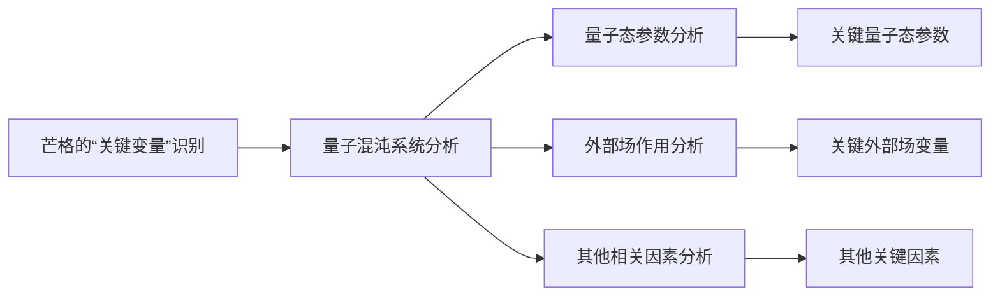

# 芒格的"关键变量"识别在量子混沌系统分析中的运用

> 关键词：芒格；关键变量识别；量子混沌系统；分析运用；复杂系统

> 摘要：本文旨在探讨芒格提出的“关键变量”识别方法在量子混沌系统分析中的应用。首先介绍了研究的背景、目的、预期读者、文档结构及相关术语。接着阐述了核心概念及其联系，包括芒格“关键变量”理论和量子混沌系统的原理，并给出相应的示意图和流程图。详细讲解了核心算法原理和具体操作步骤，同时运用Python代码进行阐述。通过数学模型和公式深入剖析了该方法在量子混沌系统中的应用，辅以具体例子说明。给出了项目实战案例，包括开发环境搭建、源代码实现与解读。分析了该方法在实际中的应用场景，推荐了相关的学习资源、开发工具框架和论文著作。最后总结了未来发展趋势与挑战，并解答常见问题，提供扩展阅读和参考资料。

## 1. 背景介绍 
### 1.1 目的和范围
本研究的主要目的是探索如何将芒格的“关键变量”识别方法有效地应用于量子混沌系统的分析中。量子混沌系统是一个高度复杂且充满不确定性的研究领域，传统的分析方法在处理此类系统时往往面临诸多挑战。芒格的“关键变量”识别方法强调从众多变量中找出对系统行为起关键作用的因素，这为量子混沌系统的分析提供了一种新的视角和思路。

本研究的范围涵盖了量子混沌系统的基本概念、芒格“关键变量”识别方法的原理，以及将二者结合的具体算法和实际应用案例。通过理论分析和实际项目的验证，试图揭示这种结合在解决量子混沌系统分析问题上的有效性和潜力。

### 1.2 预期读者
本文预期读者主要包括从事量子物理、混沌理论研究的科研人员，他们可以从本文中获取新的分析方法和思路，为其研究工作提供参考；计算机科学领域中对量子计算和复杂系统模拟感兴趣的程序员和研究人员，能够了解如何将经典的分析方法应用于量子领域的计算和模拟；对跨学科研究有兴趣的学者，通过阅读本文可以了解不同领域知识的融合和应用。

### 1.3 文档结构概述
本文将按照以下结构展开：首先介绍背景知识，包括研究目的、预期读者和文档结构等；接着阐述核心概念，解释芒格“关键变量”识别和量子混沌系统的原理及其联系；详细讲解核心算法原理和具体操作步骤，并给出Python代码实现；通过数学模型和公式进一步分析该方法在量子混沌系统中的应用；提供项目实战案例，包括开发环境搭建、源代码实现与解读；分析实际应用场景；推荐相关的学习资源、开发工具框架和论文著作；最后总结未来发展趋势与挑战，解答常见问题并提供扩展阅读和参考资料。

### 1.4 术语表
#### 1.4.1 核心术语定义
- **芒格的“关键变量”识别**：由查理·芒格提出的一种分析方法，旨在从复杂系统的众多变量中识别出对系统行为和结果产生关键影响的变量，通过聚焦这些关键变量来更好地理解和预测系统的运行。
- **量子混沌系统**：量子力学和混沌理论相结合的研究领域，描述量子系统中呈现出类似经典混沌系统的不规则、不可预测行为的系统。在量子混沌系统中，量子态的演化表现出高度的敏感性和复杂性。

#### 1.4.2 相关概念解释
- **量子力学**：研究微观粒子运动规律的物理学分支，它描述了粒子在微观尺度下的行为，如量子态的叠加、纠缠等特性。
- **混沌理论**：研究确定性系统中出现的随机行为的理论，其核心特点是系统对初始条件的极度敏感性，即“蝴蝶效应”。
- **变量**：在系统中可以变化的因素，对于量子混沌系统来说，变量可能包括量子态的参数、外部场的强度等。

#### 1.4.3 缩略词列表
- **QCS**：Quantum Chaotic System，量子混沌系统

## 2. 核心概念与联系 
### 2.1 芒格的“关键变量”识别原理
芒格认为，在分析复杂系统时，不能对所有变量进行同等程度的关注，因为大多数系统中存在少数几个变量对系统的行为和结果起着决定性的作用。识别这些关键变量需要综合运用多学科的知识和经验，通过对系统的深入观察和分析，找出那些与系统核心目标紧密相关、对系统变化影响显著的变量。

例如，在一个商业系统中，销售额可能受到多种因素的影响，如产品价格、市场需求、竞争对手策略等。通过分析可以发现，在某些情况下，产品价格可能是影响销售额的关键变量，因为价格的微小变动可能会导致市场需求的大幅变化。

### 2.2 量子混沌系统原理
量子混沌系统是量子力学和混沌理论的交叉领域。在量子力学中，微观粒子的状态由波函数描述，波函数的演化遵循薛定谔方程：
$$i\hbar\frac{\partial}{\partial t}\Psi(\mathbf{r},t)=\hat{H}\Psi(\mathbf{r},t)$$
其中，$i$ 是虚数单位，$\hbar$ 是约化普朗克常数，$\Psi(\mathbf{r},t)$ 是波函数，$\hat{H}$ 是哈密顿算符。

在量子混沌系统中，由于系统的非线性和对初始条件的敏感性，量子态的演化会表现出复杂的行为。例如，在某些量子系统中，即使初始状态的微小差异，经过一段时间的演化后也会导致量子态的巨大差异，类似于经典混沌系统中的“蝴蝶效应”。

### 2.3 核心概念的联系
将芒格的“关键变量”识别方法应用于量子混沌系统分析的核心思想是，在量子混沌系统众多的变量（如量子态的参数、外部场的强度等）中找出对系统混沌行为起关键作用的变量。通过识别这些关键变量，可以简化对量子混沌系统的分析，提高对系统行为的预测能力。

例如，在一个受外部磁场作用的量子自旋系统中，外部磁场的强度和方向、量子自旋的初始状态等都是变量。通过芒格的方法识别出其中对系统混沌行为影响最大的变量，如外部磁场的强度，就可以将研究重点聚焦在这个变量上，从而更深入地理解系统的混沌特性。

### 2.4 文本示意图
```plaintext
                芒格的“关键变量”识别
                      |
                      | 应用于
                      v
              量子混沌系统分析
       /           |           \
量子态参数分析  外部场作用分析  其他相关因素分析
       |           |           |
       |           |           | 找出关键变量
       v           v           v
 关键量子态参数  关键外部场变量  其他关键因素
```

### 2.5 Mermaid 流程图


## 3. 核心算法原理 & 具体操作步骤 
### 3.1 核心算法原理
将芒格的“关键变量”识别方法应用于量子混沌系统分析的核心算法基于对系统变量的敏感性分析。具体来说，通过改变系统中的各个变量，观察量子混沌系统的某些关键指标（如量子态的保真度、混沌程度等）的变化情况，找出那些对关键指标影响最大的变量，即为关键变量。

### 3.2 具体操作步骤
#### 步骤 1：定义量子混沌系统
首先，需要定义量子混沌系统的哈密顿算符 $\hat{H}$，根据具体的物理模型确定其形式。例如，对于一个简单的量子自旋系统，哈密顿算符可以表示为：
$$\hat{H} = - \frac{\hbar}{2}\sum_{i=1}^{N} \mathbf{B}_i \cdot \boldsymbol{\sigma}_i$$
其中，$\mathbf{B}_i$ 是第 $i$ 个自旋所处的外部磁场，$\boldsymbol{\sigma}_i$ 是第 $i$ 个自旋的泡利矩阵。

#### 步骤 2：初始化系统状态
选择一个初始的量子态 $\Psi_0$，可以是基态或其他特定的量子态。

#### 步骤 3：设定变量范围和步长
确定需要分析的变量（如外部磁场的强度、方向等）的取值范围和步长。

#### 步骤 4：进行敏感性分析
对于每个变量，按照设定的步长改变其值，同时保持其他变量不变，求解薛定谔方程得到不同变量值下的量子态 $\Psi(t)$。计算关键指标（如量子态的保真度 $F = |\langle\Psi_0|\Psi(t)\rangle|^2$）的变化情况。

#### 步骤 5：识别关键变量
根据关键指标的变化幅度，找出对关键指标影响最大的变量，即为关键变量。

### 3.3 Python 源代码实现
```python
import numpy as np
from scipy.integrate import solve_ivp

# 定义泡利矩阵
sigma_x = np.array([[0, 1], [1, 0]])
sigma_y = np.array([[0, -1j], [1j, 0]])
sigma_z = np.array([[1, 0], [0, -1]])

# 定义量子混沌系统的哈密顿算符
def hamiltonian(Bx, By, Bz):
    return -0.5 * (Bx * sigma_x + By * sigma_y + Bz * sigma_z)

# 定义薛定谔方程
def schrodinger_eq(t, psi, Bx, By, Bz):
    H = hamiltonian(Bx, By, Bz)
    return -1j * H @ psi

# 初始化系统状态
psi0 = np.array([1, 0])

# 设定变量范围和步长
Bx_range = np.linspace(0, 1, 10)
By = 0
Bz = 0

# 进行敏感性分析
fidelity_changes = []
for Bx in Bx_range:
    # 求解薛定谔方程
    sol = solve_ivp(schrodinger_eq, [0, 10], psi0, args=(Bx, By, Bz))
    psi_t = sol.y[:, -1]
    # 计算量子态的保真度
    fidelity = np.abs(np.dot(psi0.conj(), psi_t))**2
    fidelity_changes.append(fidelity)

# 识别关键变量（这里仅考虑 Bx）
max_change_index = np.argmax(np.abs(np.diff(fidelity_changes)))
key_variable = Bx_range[max_change_index]

print(f"关键变量 Bx 的值为: {key_variable}")
```

## 4. 数学模型和公式 & 详细讲解 & 举例说明 
### 4.1 数学模型
在量子混沌系统分析中，我们主要关注量子态的演化和关键指标的变化。量子态的演化由薛定谔方程描述：
$$i\hbar\frac{\partial}{\partial t}\Psi(\mathbf{r},t)=\hat{H}\Psi(\mathbf{r},t)$$
其中，$\hat{H}$ 是哈密顿算符，它包含了系统的各种相互作用和外部影响。

为了衡量量子态的变化，我们引入量子态的保真度 $F$，定义为：
$$F = |\langle\Psi_0|\Psi(t)\rangle|^2$$
其中，$\Psi_0$ 是初始量子态，$\Psi(t)$ 是经过时间 $t$ 演化后的量子态。

### 4.2 详细讲解
在进行“关键变量”识别时，我们通过改变系统中的变量 $x$，观察保真度 $F$ 的变化。设初始变量值为 $x_0$，对应的保真度为 $F_0$，改变变量值为 $x_1$ 后，对应的保真度为 $F_1$，则保真度的变化量为：
$$\Delta F = |F_1 - F_0|$$
我们通过比较不同变量引起的 $\Delta F$ 的大小，找出对保真度影响最大的变量，即为关键变量。

### 4.3 举例说明
考虑一个简单的量子二能级系统，其哈密顿算符为：
$$\hat{H} = \frac{\hbar}{2}(\omega\sigma_z + \Omega\sigma_x)$$
其中，$\omega$ 是能级间距，$\Omega$ 是外部驱动场的强度。

假设初始量子态为 $\Psi_0 = |0\rangle$，经过时间 $t$ 后，量子态 $\Psi(t)$ 可以通过求解薛定谔方程得到。我们分别改变 $\omega$ 和 $\Omega$ 的值，计算保真度的变化。

设初始 $\omega = \omega_0$，$\Omega = \Omega_0$，对应的保真度为 $F_0$。当改变 $\omega$ 为 $\omega_1$ 时，保真度变为 $F_{\omega}$，则 $\Delta F_{\omega} = |F_{\omega} - F_0|$；当改变 $\Omega$ 为 $\Omega_1$ 时，保真度变为 $F_{\Omega}$，则 $\Delta F_{\Omega} = |F_{\Omega} - F_0|$。

如果 $\Delta F_{\omega} > \Delta F_{\Omega}$，则说明 $\omega$ 是对系统保真度影响更大的关键变量；反之，$\Omega$ 是关键变量。

## 5. 项目实战：代码实际案例和详细解释说明 
### 5.1 开发环境搭建
#### 操作系统
本项目可以在 Windows、Linux 或 macOS 操作系统上进行开发。建议使用 Linux 系统，因为它对科学计算和编程环境的支持较好。

#### 编程语言和版本
使用 Python 3.x 版本，建议使用 Python 3.7 及以上版本，因为这些版本包含了许多新的特性和优化。

#### 安装必要的库
在命令行中使用以下命令安装必要的库：
```bash
pip install numpy scipy
```
- `numpy`：用于数值计算和数组操作。
- `scipy`：提供了科学计算的工具，如求解常微分方程。

### 5.2 源代码详细实现和代码解读
```python
import numpy as np
from scipy.integrate import solve_ivp

# 定义泡利矩阵
sigma_x = np.array([[0, 1], [1, 0]])
sigma_y = np.array([[0, -1j], [1j, 0]])
sigma_z = np.array([[1, 0], [0, -1]])

# 定义量子混沌系统的哈密顿算符
def hamiltonian(Bx, By, Bz):
    return -0.5 * (Bx * sigma_x + By * sigma_y + Bz * sigma_z)

# 定义薛定谔方程
def schrodinger_eq(t, psi, Bx, By, Bz):
    H = hamiltonian(Bx, By, Bz)
    return -1j * H @ psi

# 初始化系统状态
psi0 = np.array([1, 0])

# 设定变量范围和步长
Bx_range = np.linspace(0, 1, 10)
By = 0
Bz = 0

# 进行敏感性分析
fidelity_changes = []
for Bx in Bx_range:
    # 求解薛定谔方程
    sol = solve_ivp(schrodinger_eq, [0, 10], psi0, args=(Bx, By, Bz))
    psi_t = sol.y[:, -1]
    # 计算量子态的保真度
    fidelity = np.abs(np.dot(psi0.conj(), psi_t))**2
    fidelity_changes.append(fidelity)

# 识别关键变量（这里仅考虑 Bx）
max_change_index = np.argmax(np.abs(np.diff(fidelity_changes)))
key_variable = Bx_range[max_change_index]

print(f"关键变量 Bx 的值为: {key_variable}")
```

### 5.3 代码解读与分析
#### 导入必要的库
```python
import numpy as np
from scipy.integrate import solve_ivp
```
导入 `numpy` 库用于数值计算，`scipy.integrate.solve_ivp` 函数用于求解常微分方程。

#### 定义泡利矩阵
```python
sigma_x = np.array([[0, 1], [1, 0]])
sigma_y = np.array([[0, -1j], [1j, 0]])
sigma_z = np.array([[1, 0], [0, -1]])
```
定义了三个泡利矩阵 $\sigma_x$、$\sigma_y$ 和 $\sigma_z$，它们是量子力学中描述自旋的基本矩阵。

#### 定义量子混沌系统的哈密顿算符
```python
def hamiltonian(Bx, By, Bz):
    return -0.5 * (Bx * sigma_x + By * sigma_y + Bz * sigma_z)
```
根据外部磁场的分量 $Bx$、$By$ 和 $Bz$ 定义了量子混沌系统的哈密顿算符。

#### 定义薛定谔方程
```python
def schrodinger_eq(t, psi, Bx, By, Bz):
    H = hamiltonian(Bx, By, Bz)
    return -1j * H @ psi
```
定义了薛定谔方程的右侧，用于求解量子态的演化。

#### 初始化系统状态
```python
psi0 = np.array([1, 0])
```
初始化量子态为 $|0\rangle$。

#### 设定变量范围和步长
```python
Bx_range = np.linspace(0, 1, 10)
By = 0
Bz = 0
```
设定外部磁场的 $Bx$ 分量的取值范围为 $[0, 1]$，并将其等分为 10 个点，同时将 $By$ 和 $Bz$ 固定为 0。

#### 进行敏感性分析
```python
fidelity_changes = []
for Bx in Bx_range:
    # 求解薛定谔方程
    sol = solve_ivp(schrodinger_eq, [0, 10], psi0, args=(Bx, By, Bz))
    psi_t = sol.y[:, -1]
    # 计算量子态的保真度
    fidelity = np.abs(np.dot(psi0.conj(), psi_t))**2
    fidelity_changes.append(fidelity)
```
遍历 $Bx$ 的取值范围，对于每个 $Bx$ 值，求解薛定谔方程得到演化后的量子态 $\psi_t$，并计算量子态的保真度。将保真度的变化存储在 `fidelity_changes` 列表中。

#### 识别关键变量
```python
max_change_index = np.argmax(np.abs(np.diff(fidelity_changes)))
key_variable = Bx_range[max_change_index]

print(f"关键变量 Bx 的值为: {key_variable}")
```
通过计算保真度变化的差值，找出变化最大的位置，对应的 $Bx$ 值即为关键变量。最后打印出关键变量的值。

## 6. 实际应用场景 
### 6.1 量子计算优化
在量子计算中，量子比特的状态容易受到各种噪声和干扰的影响，导致计算结果的准确性降低。通过运用芒格的“关键变量”识别方法，可以找出对量子比特状态稳定性影响最大的关键变量，如外部磁场的波动、温度变化等。针对这些关键变量进行优化和控制，可以提高量子计算的稳定性和准确性。

### 6.2 量子通信安全
量子通信利用量子态的特性实现信息的安全传输。然而，量子信道中的噪声和干扰可能会导致量子态的失真，从而影响通信的安全性。通过识别关键变量，可以采取相应的措施来减少这些变量对量子态的影响，提高量子通信的安全性和可靠性。

### 6.3 量子材料研究
在研究量子材料的性质和行为时，量子混沌系统的分析起着重要的作用。通过识别关键变量，可以更好地理解量子材料的物理机制，预测其性能，并为材料的设计和制备提供指导。

## 7. 工具和资源推荐
### 7.1 学习资源推荐
#### 7.1.1 书籍推荐
- 《量子力学导论》（David J. Griffiths 著）：这本书是量子力学领域的经典教材，详细介绍了量子力学的基本概念、理论和方法，适合初学者入门。
- 《混沌理论基础》（Allan M. Strogatz 著）：全面介绍了混沌理论的基本概念、数学模型和应用，对理解量子混沌系统有很大的帮助。
- 《穷查理宝典：查理·芒格的智慧箴言录》（Peter D. Kaufman 编）：书中收录了查理·芒格的演讲和文章，详细阐述了他的“关键变量”识别方法和多学科思维方式。

#### 7.1.2 在线课程
- Coursera 上的“量子力学基础”课程：由知名高校的教授授课，系统地介绍了量子力学的基本理论和应用。
- edX 上的“混沌与非线性动力学”课程：深入讲解了混沌理论的数学原理和实际应用。

#### 7.1.3 技术博客和网站
- arXiv：一个开放获取的预印本数据库，提供了大量关于量子物理、混沌理论等领域的最新研究成果。
- Physics Stack Exchange：一个物理学领域的问答社区，可以在这里与其他研究者交流和讨论问题。

### 7.2 开发工具框架推荐
#### 7.2.1 IDE和编辑器
- PyCharm：一款功能强大的 Python 集成开发环境，提供了代码编辑、调试、版本控制等功能，适合开发 Python 程序。
- Jupyter Notebook：一个交互式的编程环境，可以在浏览器中编写和运行代码，同时还可以插入文本、图片等，方便进行数据分析和可视化。

#### 7.2.2 调试和性能分析工具
- Py-Spy：一个用于 Python 程序性能分析的工具，可以实时监测程序的 CPU 使用率、函数调用时间等信息。
- pdb：Python 内置的调试器，可以帮助开发者定位和解决代码中的问题。

#### 7.2.3 相关框架和库
- Qiskit：一个开源的量子计算框架，提供了量子电路的设计、模拟和优化等功能。
- QuTiP：一个用于量子光学和量子信息处理的 Python 库，提供了量子态的表示、演化和测量等功能。

### 7.3 相关论文著作推荐
#### 7.3.1 经典论文
- “Quantum Chaos: An Introduction”（F. Haake 著）：这篇论文是量子混沌领域的经典综述，系统地介绍了量子混沌的基本概念、理论和实验进展。
- “The Concept of a Variable in Complex Systems”（C. Munger 著）：查理·芒格关于“关键变量”识别方法的重要论文，阐述了该方法的原理和应用。

#### 7.3.2 最新研究成果
- 在 arXiv 上搜索“Quantum Chaos”和“Key Variable Identification”等关键词，可以获取关于量子混沌系统分析和“关键变量”识别方法的最新研究成果。

#### 7.3.3 应用案例分析
- 在 IEEE Xplore、ACM Digital Library 等数据库中搜索相关的应用案例，了解芒格的“关键变量”识别方法在量子混沌系统分析中的实际应用。

## 8. 总结：未来发展趋势与挑战
### 8.1 未来发展趋势
- **跨学科融合加深**：随着科学技术的发展，量子混沌系统分析将与更多的学科进行融合，如生物学、经济学等。芒格的“关键变量”识别方法作为一种跨学科的分析方法，将在这些交叉领域中发挥更大的作用。
- **量子计算技术的推动**：量子计算技术的不断发展将为量子混沌系统分析提供更强大的计算能力。通过量子计算机，可以更高效地求解量子混沌系统的演化方程，提高“关键变量”识别的准确性和效率。
- **实际应用拓展**：芒格的“关键变量”识别方法在量子混沌系统分析中的应用将从理论研究向实际应用拓展，如在量子通信、量子材料等领域的大规模应用。

### 8.2 挑战
- **量子系统的复杂性**：量子混沌系统具有高度的复杂性和不确定性，其变量之间的相互作用非常复杂，给“关键变量”的识别带来了很大的挑战。
- **数据获取和处理**：在量子混沌系统分析中，需要获取大量的实验数据来支持“关键变量”的识别。然而，量子实验数据的获取和处理难度较大，需要开发更先进的实验技术和数据处理方法。
- **理论模型的完善**：目前，关于量子混沌系统的理论模型还不够完善，需要进一步深入研究量子混沌的本质和规律，为“关键变量”识别方法提供更坚实的理论基础。

## 9. 附录：常见问题与解答
### 问题 1：芒格的“关键变量”识别方法是否适用于所有的量子混沌系统？
解答：芒格的“关键变量”识别方法的基本思想是具有普适性的，但并不是适用于所有的量子混沌系统。不同的量子混沌系统具有不同的特点和复杂性，需要根据具体情况进行调整和优化。在一些非常复杂的量子混沌系统中，可能需要结合其他的分析方法来提高“关键变量”识别的准确性。

### 问题 2：如何验证识别出的关键变量的正确性？
解答：可以通过以下几种方法来验证识别出的关键变量的正确性。一是进行数值模拟，通过改变关键变量的值，观察量子混沌系统的关键指标的变化情况，与理论预测进行对比。二是进行实验验证，在实际的量子实验中，控制关键变量的值，观察系统的行为是否与理论分析一致。三是与其他已有的分析方法进行比较，验证识别结果的一致性。

### 问题 3：在实际应用中，如何选择合适的关键指标来衡量量子混沌系统的变化？
解答：选择合适的关键指标需要根据具体的应用场景和研究目的来确定。常见的关键指标包括量子态的保真度、混沌程度、纠缠熵等。在量子计算优化中，可以选择量子态的保真度作为关键指标，因为它直接反映了量子比特状态的稳定性。在量子通信安全中，可以选择纠缠熵作为关键指标，因为它与量子通信的安全性密切相关。

## 10. 扩展阅读 & 参考资料
### 扩展阅读
- 《量子物理史话：上帝掷骰子吗？》（曹天元 著）：以生动有趣的方式讲述了量子物理的发展历程，适合对量子物理感兴趣的读者阅读。
- 《思考，快与慢》（Daniel Kahneman 著）：介绍了人类思维的两种模式，对理解芒格的多学科思维方式有一定的帮助。

### 参考资料
- Griffiths, D. J. (2018). Introduction to Quantum Mechanics. Cambridge University Press.
- Strogatz, A. M. (2014). Nonlinear Dynamics and Chaos: With Applications to Physics, Biology, Chemistry, and Engineering. Westview Press.
- Kaufman, P. D. (2005). Poor Charlie's Almanack: The Wit and Wisdom of Charles T. Munger. Donning Company Publishers.

作者：AI天才研究院/AI Genius Institute & 禅与计算机程序设计艺术 /Zen And The Art of Computer Programming