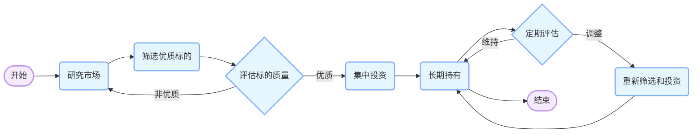

# 芒格的"关键少数"原则在投资组合管理中的应用

> 关键词：芒格、关键少数原则、投资组合管理、集中投资、风险收益

> 摘要：本文深入探讨了芒格的“关键少数”原则在投资组合管理中的应用。首先介绍了“关键少数”原则的背景及相关概念，接着详细阐述了其核心原理与架构，包括与投资组合管理的联系。通过Python代码展示了核心算法原理及具体操作步骤，同时给出了相应的数学模型和公式并举例说明。结合项目实战，对代码案例进行详细解读。分析了该原则在实际投资中的应用场景，推荐了相关的学习资源、开发工具框架以及论文著作。最后总结了未来发展趋势与挑战，并对常见问题进行解答，为投资者在投资组合管理中运用“关键少数”原则提供全面而深入的指导。

## 1. 背景介绍 
### 1.1 目的和范围
本文章旨在深入探讨芒格的“关键少数”原则在投资组合管理领域的应用。通过对该原则的理论分析、算法实现、实际案例研究等多方面的阐述，帮助投资者理解如何运用这一原则优化投资组合，提高投资收益，降低风险。文章的范围涵盖了“关键少数”原则的基本概念、与投资组合管理的结合方式、具体的操作方法、实际应用场景以及相关的学习资源和未来发展趋势等内容。

### 1.2 预期读者
本文预期读者主要包括对投资组合管理感兴趣的投资者，无论是个人投资者还是专业投资机构的从业者。同时，对于金融专业的学生、研究人员以及对投资理论和实践有深入研究需求的人群也具有一定的参考价值。

### 1.3 文档结构概述
本文将按照以下结构进行阐述：首先介绍背景信息，包括目的、预期读者和文档结构概述以及相关术语。接着阐述“关键少数”原则的核心概念与联系，展示其原理和架构。然后详细讲解核心算法原理和具体操作步骤，并给出相应的数学模型和公式。通过项目实战部分，展示代码实际案例并进行详细解释。分析该原则在实际投资中的应用场景，推荐相关的工具和资源。最后总结未来发展趋势与挑战，解答常见问题并提供扩展阅读和参考资料。

### 1.4 术语表
#### 1.4.1 核心术语定义
- **关键少数原则**：也称为帕累托原则或80/20法则，即在许多情况下，80%的结果是由20%的因素所决定的。在投资领域，意味着少数优质的投资标的可能贡献了大部分的投资收益。
- **投资组合管理**：是指投资者根据自身的投资目标、风险承受能力等因素，将资金分配到不同的投资标的上，以实现投资收益最大化和风险最小化的过程。
- **集中投资**：是指将大部分资金集中投资于少数经过精心挑选的投资标的上，与分散投资相对。

#### 1.4.2 相关概念解释
- **风险收益权衡**：在投资中，风险和收益是相互关联的。一般来说，高收益往往伴随着高风险，投资者需要在追求收益的同时考虑承担的风险水平，找到两者之间的平衡。
- **投资标的**：是指投资者进行投资的对象，如股票、债券、基金、房地产等。

#### 1.4.3 缩略词列表
- **ROI**：Return on Investment，投资回报率
- **VAR**：Value at Risk，风险价值

## 2. 核心概念与联系 
### 2.1 关键少数原则的核心思想
关键少数原则，即80/20法则，由意大利经济学家帕累托提出。其核心思想是在众多的因素中，少数关键因素对结果起着决定性的作用。在投资领域，芒格将这一原则应用于投资组合管理，认为投资者应该聚焦于少数具有卓越品质和潜力的投资标的，而不是分散投资于大量平庸的资产。

### 2.2 关键少数原则与投资组合管理的联系
传统的投资组合理论强调分散投资，通过将资金分散到不同的资产类别和投资标的上，降低单一资产的风险对整个投资组合的影响。然而，芒格的“关键少数”原则则认为，过度分散投资可能会导致投资者无法充分把握真正具有潜力的投资机会，降低投资组合的整体收益。

在投资组合管理中运用“关键少数”原则，投资者需要深入研究和分析市场，筛选出少数具有竞争优势、财务状况良好、管理层优秀的投资标的，并将大部分资金集中投资于这些标的上。这样可以在控制风险的前提下，提高投资组合的收益潜力。

### 2.3 核心概念原理和架构的文本示意图
```plaintext
关键少数原则
|
|-- 聚焦少数优质投资标的
|   |-- 深入研究和分析市场
|   |-- 筛选具有竞争优势的公司
|   |-- 评估财务状况和管理层能力
|
|-- 集中投资策略
|   |-- 将大部分资金投入少数标的
|   |-- 长期持有优质资产
|
|-- 风险控制
|   |-- 设定止损点
|   |-- 定期评估投资组合
```

### 2.4 Mermaid流程图


## 3. 核心算法原理 & 具体操作步骤 
### 3.1 核心算法原理
在投资组合管理中运用“关键少数”原则的核心算法原理是基于对投资标的的评估和筛选，找出少数具有高潜力的标的，并根据其风险收益特征进行资金分配。具体来说，可以通过以下几个步骤实现：

1. **数据收集**：收集投资标的的相关数据，包括财务报表、行业数据、市场数据等。
2. **指标计算**：根据收集到的数据，计算一系列评估指标，如市盈率（PE）、市净率（PB）、净资产收益率（ROE）等。
3. **综合评估**：运用多指标综合评估方法，对投资标的进行打分，筛选出得分较高的少数标的。
4. **资金分配**：根据筛选出的标的的风险收益特征，运用优化算法确定资金分配比例。

### 3.2 Python源代码详细阐述
```python
import pandas as pd
import numpy as np

# 模拟收集投资标的数据
def collect_data():
    data = {
        'stock': ['A', 'B', 'C', 'D', 'E', 'F', 'G', 'H', 'I', 'J'],
        'PE': [10, 20, 15, 25, 30, 12, 18, 22, 28, 16],
        'PB': [1.5, 2.0, 1.8, 2.2, 2.5, 1.6, 1.9, 2.1, 2.4, 1.7],
        'ROE': [0.15, 0.2, 0.18, 0.22, 0.25, 0.16, 0.19, 0.21, 0.24, 0.17]
    }
    df = pd.DataFrame(data)
    return df

# 计算综合评分
def calculate_score(df):
    # 对指标进行标准化处理
    df['PE_norm'] = (df['PE'] - df['PE'].min()) / (df['PE'].max() - df['PE'].min())
    df['PB_norm'] = (df['PB'] - df['PB'].min()) / (df['PB'].max() - df['PB'].min())
    df['ROE_norm'] = (df['ROE'] - df['ROE'].min()) / (df['ROE'].max() - df['ROE'].min())
    
    # 设定指标权重
    pe_weight = 0.3
    pb_weight = 0.3
    roe_weight = 0.4
    
    # 计算综合评分
    df['score'] = pe_weight * df['PE_norm'] + pb_weight * df['PB_norm'] + roe_weight * df['ROE_norm']
    
    return df

# 筛选优质标的
def select_top_stocks(df, top_n):
    df = df.sort_values(by='score', ascending=False)
    top_stocks = df.head(top_n)
    return top_stocks

# 资金分配
def allocate_funds(top_stocks):
    total_score = top_stocks['score'].sum()
    top_stocks['allocation'] = top_stocks['score'] / total_score
    return top_stocks

# 主函数
def main():
    # 收集数据
    data = collect_data()
    
    # 计算综合评分
    scored_data = calculate_score(data)
    
    # 筛选优质标的
    top_n = 3
    top_stocks = select_top_stocks(scored_data, top_n)
    
    # 资金分配
    allocated_stocks = allocate_funds(top_stocks)
    
    print(allocated_stocks[['stock', 'allocation']])

if __name__ == "__main__":
    main()
```

### 3.3 具体操作步骤
1. **数据收集**：调用`collect_data`函数，模拟收集投资标的的相关数据，包括市盈率、市净率和净资产收益率等。
2. **指标计算和综合评估**：调用`calculate_score`函数，对收集到的数据进行标准化处理，并根据设定的权重计算综合评分。
3. **筛选优质标的**：调用`select_top_stocks`函数，根据综合评分筛选出得分较高的少数标的。
4. **资金分配**：调用`allocate_funds`函数，根据筛选出的标的的综合评分确定资金分配比例。
5. **输出结果**：打印出筛选出的标的及其对应的资金分配比例。

## 4. 数学模型和公式 & 详细讲解 & 举例说明 
### 4.1 指标标准化公式
在计算综合评分之前，需要对各个评估指标进行标准化处理，以消除不同指标之间的量纲差异。常用的标准化公式为：

$$x_{norm}=\frac{x - x_{min}}{x_{max}-x_{min}}$$

其中，$x$ 是原始指标值，$x_{min}$ 是该指标的最小值，$x_{max}$ 是该指标的最大值，$x_{norm}$ 是标准化后的指标值。

### 4.2 综合评分公式
综合评分是根据各个标准化指标的权重计算得出的，公式如下：

$$Score = w_1x_{1_{norm}}+w_2x_{2_{norm}}+w_3x_{3_{norm}}$$

其中，$w_1$、$w_2$、$w_3$ 分别是各个指标的权重，$x_{1_{norm}}$、$x_{2_{norm}}$、$x_{3_{norm}}$ 分别是标准化后的指标值。

### 4.3 资金分配公式
资金分配比例是根据筛选出的标的的综合评分确定的，公式如下：

$$Allocation_i=\frac{Score_i}{\sum_{j=1}^{n}Score_j}$$

其中，$Allocation_i$ 是第 $i$ 个标的的资金分配比例，$Score_i$ 是第 $i$ 个标的的综合评分，$n$ 是筛选出的标的的数量。

### 4.4 举例说明
假设我们有三个投资标的 A、B、C，其市盈率、市净率和净资产收益率如下表所示：

| 标的 | PE | PB | ROE |
|------|----|----|-----|
| A    | 10 | 1.5 | 0.15 |
| B    | 20 | 2.0 | 0.2 |
| C    | 15 | 1.8 | 0.18 |

设定市盈率、市净率和净资产收益率的权重分别为 0.3、0.3 和 0.4。

1. **指标标准化**：
    - 市盈率：$PE_{A_{norm}}=\frac{10 - 10}{20 - 10}=0$，$PE_{B_{norm}}=\frac{20 - 10}{20 - 10}=1$，$PE_{C_{norm}}=\frac{15 - 10}{20 - 10}=0.5$
    - 市净率：$PB_{A_{norm}}=\frac{1.5 - 1.5}{2.0 - 1.5}=0$，$PB_{B_{norm}}=\frac{2.0 - 1.5}{2.0 - 1.5}=1$，$PB_{C_{norm}}=\frac{1.8 - 1.5}{2.0 - 1.5}=0.6$
    - 净资产收益率：$ROE_{A_{norm}}=\frac{0.15 - 0.15}{0.2 - 0.15}=0$，$ROE_{B_{norm}}=\frac{0.2 - 0.15}{0.2 - 0.15}=1$，$ROE_{C_{norm}}=\frac{0.18 - 0.15}{0.2 - 0.15}=0.6$

2. **计算综合评分**：
    - 标的 A：$Score_A = 0.3\times0 + 0.3\times0 + 0.4\times0 = 0$
    - 标的 B：$Score_B = 0.3\times1 + 0.3\times1 + 0.4\times1 = 1$
    - 标的 C：$Score_C = 0.3\times0.5 + 0.3\times0.6 + 0.4\times0.6 = 0.57$

3. **资金分配**：
    - 总评分：$\sum_{j=1}^{3}Score_j = 0 + 1 + 0.57 = 1.57$
    - 标的 A：$Allocation_A=\frac{0}{1.57}=0$
    - 标的 B：$Allocation_B=\frac{1}{1.57}\approx0.637$
    - 标的 C：$Allocation_C=\frac{0.57}{1.57}\approx0.363$

因此，根据计算结果，应该将约 63.7% 的资金分配给标的 B，约 36.3% 的资金分配给标的 C，不投资标的 A。

## 5. 项目实战：代码实际案例和详细解释说明 
### 5.1  开发环境搭建
要运行上述代码，需要安装以下 Python 库：
- **pandas**：用于数据处理和分析。
- **numpy**：用于数值计算。

可以使用以下命令安装这些库：
```sh
pip install pandas numpy
```

### 5.2  源代码详细实现和代码解读
```python
import pandas as pd
import numpy as np

# 模拟收集投资标的数据
def collect_data():
    data = {
        'stock': ['A', 'B', 'C', 'D', 'E', 'F', 'G', 'H', 'I', 'J'],
        'PE': [10, 20, 15, 25, 30, 12, 18, 22, 28, 16],
        'PB': [1.5, 2.0, 1.8, 2.2, 2.5, 1.6, 1.9, 2.1, 2.4, 1.7],
        'ROE': [0.15, 0.2, 0.18, 0.22, 0.25, 0.16, 0.19, 0.21, 0.24, 0.17]
    }
    df = pd.DataFrame(data)
    return df
```
- **代码解读**：`collect_data`函数模拟收集了 10 个投资标的的市盈率、市净率和净资产收益率数据，并将其存储在一个 Pandas DataFrame 中返回。

```python
# 计算综合评分
def calculate_score(df):
    # 对指标进行标准化处理
    df['PE_norm'] = (df['PE'] - df['PE'].min()) / (df['PE'].max() - df['PE'].min())
    df['PB_norm'] = (df['PB'] - df['PB'].min()) / (df['PB'].max() - df['PB'].min())
    df['ROE_norm'] = (df['ROE'] - df['ROE'].min()) / (df['ROE'].max() - df['ROE'].min())
    
    # 设定指标权重
    pe_weight = 0.3
    pb_weight = 0.3
    roe_weight = 0.4
    
    # 计算综合评分
    df['score'] = pe_weight * df['PE_norm'] + pb_weight * df['PB_norm'] + roe_weight * df['ROE_norm']
    
    return df
```
- **代码解读**：`calculate_score`函数接收一个 DataFrame 作为输入，首先对市盈率、市净率和净资产收益率进行标准化处理，然后根据设定的权重计算综合评分，并将结果添加到 DataFrame 中返回。

```python
# 筛选优质标的
def select_top_stocks(df, top_n):
    df = df.sort_values(by='score', ascending=False)
    top_stocks = df.head(top_n)
    return top_stocks
```
- **代码解读**：`select_top_stocks`函数接收一个 DataFrame 和一个整数`top_n`作为输入，根据综合评分对 DataFrame 进行降序排序，然后选取前`top_n`个标的返回。

```python
# 资金分配
def allocate_funds(top_stocks):
    total_score = top_stocks['score'].sum()
    top_stocks['allocation'] = top_stocks['score'] / total_score
    return top_stocks
```
- **代码解读**：`allocate_funds`函数接收一个包含筛选出的优质标的的 DataFrame 作为输入，计算这些标的的总评分，然后根据每个标的的评分计算资金分配比例，并将结果添加到 DataFrame 中返回。

```python
# 主函数
def main():
    # 收集数据
    data = collect_data()
    
    # 计算综合评分
    scored_data = calculate_score(data)
    
    # 筛选优质标的
    top_n = 3
    top_stocks = select_top_stocks(scored_data, top_n)
    
    # 资金分配
    allocated_stocks = allocate_funds(top_stocks)
    
    print(allocated_stocks[['stock', 'allocation']])

if __name__ == "__main__":
    main()
```
- **代码解读**：`main`函数是程序的入口，依次调用`collect_data`、`calculate_score`、`select_top_stocks`和`allocate_funds`函数，完成数据收集、综合评分计算、优质标的筛选和资金分配的过程，最后打印出筛选出的标的及其对应的资金分配比例。

### 5.3  代码解读与分析
通过上述代码，我们可以看到如何运用“关键少数”原则进行投资组合管理。首先，通过收集和分析投资标的的相关数据，计算综合评分，筛选出少数优质标的。然后，根据这些标的的综合评分进行资金分配，实现集中投资。

在实际应用中，我们可以根据需要调整评估指标和权重，以适应不同的投资策略和市场环境。同时，还可以引入更多的风险控制措施，如设定止损点、定期评估投资组合等，以降低投资风险。

## 6. 实际应用场景 
### 6.1 个人投资者
对于个人投资者来说，芒格的“关键少数”原则可以帮助他们更加聚焦于少数优质的投资标的，避免过度分散投资导致的收益低下。个人投资者可以通过深入研究和分析，选择自己熟悉和信任的行业和公司进行投资。例如，投资者可以关注那些具有长期竞争优势、稳定现金流和优秀管理层的公司，将大部分资金集中投资于这些公司的股票上。

### 6.2 专业投资机构
专业投资机构也可以运用“关键少数”原则优化投资组合。在进行大规模资金管理时，投资机构可以通过专业的研究团队和分析工具，筛选出少数具有高潜力的投资标的。例如，对冲基金可以运用量化分析方法，对大量的投资标的进行评估和筛选，将资金集中投资于少数表现优异的标的上，以获取超额收益。

### 6.3 长期投资策略
“关键少数”原则特别适合长期投资策略。长期投资注重的是企业的内在价值和长期发展潜力，而不是短期的市场波动。通过聚焦于少数优质的投资标的，投资者可以长期持有这些资产，分享企业成长带来的收益。例如，巴菲特长期持有可口可乐、富国银行等优质公司的股票，获得了丰厚的回报。

### 6.4 新兴行业投资
在新兴行业投资中，由于行业发展前景不确定，投资风险较大，运用“关键少数”原则可以帮助投资者降低风险。投资者可以通过深入研究新兴行业的发展趋势和竞争格局，筛选出少数具有核心竞争力和创新能力的公司进行投资。例如，在人工智能、新能源汽车等新兴行业中，投资者可以选择那些在技术研发、市场份额等方面具有优势的公司进行投资。

## 7. 工具和资源推荐
### 7.1 学习资源推荐
#### 7.1.1 书籍推荐
- 《穷查理宝典：查理·芒格的智慧箴言录》：本书收录了芒格的演讲、文章和名言等，全面展示了芒格的投资理念和人生智慧。
- 《聪明的投资者》：作者是本杰明·格雷厄姆，被誉为“价值投资之父”，本书是价值投资领域的经典著作，对投资者具有重要的指导意义。
- 《巴菲特致股东的信：投资者和公司高管教程》：本书收录了巴菲特历年致股东的信，通过这些信件可以了解巴菲特的投资策略和管理理念。

#### 7.1.2 在线课程
- Coursera 上的“投资学原理”：该课程由知名高校的教授授课，系统地介绍了投资学的基本原理和方法。
- edX 上的“金融市场”：课程涵盖了金融市场的各个方面，包括股票市场、债券市场、衍生品市场等，对投资者了解金融市场有很大帮助。

#### 7.1.3 技术博客和网站
- 雪球网：是一个投资社交平台，汇聚了众多投资者和投资专家，用户可以在上面交流投资经验、分享研究报告。
- 东方财富网：提供了丰富的金融资讯和数据，包括股票行情、基金净值、财经新闻等，是投资者获取信息的重要渠道。

### 7.2 开发工具框架推荐
#### 7.2.1 IDE和编辑器
- PyCharm：是一款专门为 Python 开发设计的集成开发环境，具有代码编辑、调试、自动完成等功能，提高开发效率。
- Jupyter Notebook：是一个交互式的开发环境，适合进行数据分析和模型开发，支持多种编程语言，包括 Python。

#### 7.2.2 调试和性能分析工具
- pdb：是 Python 自带的调试工具，可以帮助开发者定位和解决代码中的问题。
- cProfile：是 Python 的性能分析工具，可以分析代码的运行时间和函数调用情况，帮助开发者优化代码性能。

#### 7.2.3 相关框架和库
- Pandas：是一个强大的数据处理和分析库，提供了丰富的数据结构和函数，方便进行数据清洗、转换和分析。
- NumPy：是 Python 的数值计算库，提供了高效的数组操作和数学函数，是许多科学计算和数据分析库的基础。
- Scikit-learn：是一个机器学习库，提供了各种机器学习算法和工具，如分类、回归、聚类等，方便进行投资模型的开发和评估。

### 7.3 相关论文著作推荐
#### 7.3.1 经典论文
- Markowitz, H. M. (1952). Portfolio Selection. The Journal of Finance, 7(1), 77-91. 该论文提出了现代投资组合理论，为投资组合管理提供了重要的理论基础。
- Fama, E. F., & French, K. R. (1992). The Cross-Section of Expected Stock Returns. The Journal of Finance, 47(2), 427-465. 该论文提出了三因子模型，解释了股票收益率的差异。

#### 7.3.2 最新研究成果
- 在学术数据库如 IEEE Xplore、ACM Digital Library 等上搜索关于投资组合管理和“关键少数”原则的最新研究论文，了解该领域的前沿动态。

#### 7.3.3 应用案例分析
- 可以参考一些投资机构的研究报告和案例分析，了解他们如何运用“关键少数”原则进行投资组合管理，以及取得的实际效果。

## 8. 总结：未来发展趋势与挑战
### 8.1 未来发展趋势
- **智能化投资**：随着人工智能和机器学习技术的不断发展，未来投资组合管理将更加智能化。通过运用大数据分析、深度学习等技术，投资者可以更准确地评估投资标的的价值和风险，实现更加精准的投资决策。
- **跨领域融合**：投资组合管理将与其他领域如科技、医疗、环保等进行更深入的融合。投资者将更加关注那些具有创新能力和社会责任感的企业，将资金投向这些领域的优质标的。
- **全球化投资**：随着全球经济一体化的加速，投资者将有更多的机会进行全球化投资。芒格的“关键少数”原则可以帮助投资者在全球范围内筛选出少数优质的投资标的，实现资产的全球配置。

### 8.2 挑战
- **信息过载**：在信息爆炸的时代，投资者面临着大量的信息，如何从海量信息中筛选出有价值的信息，是一个巨大的挑战。投资者需要具备更强的信息分析和处理能力。
- **市场不确定性**：金融市场充满了不确定性，如宏观经济波动、政策变化、突发事件等，这些因素都会对投资组合的收益产生影响。投资者需要不断调整投资策略，以适应市场的变化。
- **风险控制**：集中投资虽然可以提高投资组合的收益潜力，但也会增加风险。投资者需要建立有效的风险控制机制，如设定止损点、分散投资等，以降低投资风险。

## 9. 附录：常见问题与解答
### 9.1 什么是“关键少数”原则？
“关键少数”原则也称为帕累托原则或80/20法则，即在许多情况下，80%的结果是由20%的因素所决定的。在投资领域，意味着少数优质的投资标的可能贡献了大部分的投资收益。

### 9.2 “关键少数”原则与分散投资矛盾吗？
不矛盾。传统的分散投资强调将资金分散到不同的资产类别和投资标的上，以降低单一资产的风险对整个投资组合的影响。而“关键少数”原则强调聚焦于少数优质的投资标的，通过深入研究和分析，选择具有高潜力的标的进行集中投资。在实际应用中，可以在一定程度上结合两者，即在控制风险的前提下，适当集中投资于少数优质标的。

### 9.3 如何筛选优质投资标的？
可以从以下几个方面筛选优质投资标的：
- **基本面分析**：分析公司的财务状况、盈利能力、竞争优势等。
- **行业前景**：选择具有良好发展前景的行业。
- **管理层能力**：评估公司管理层的管理能力和决策水平。
- **估值水平**：选择估值合理的标的。

### 9.4 如何控制集中投资的风险？
可以通过以下方法控制集中投资的风险：
- **设定止损点**：当投资标的的价格下跌到一定程度时，及时卖出，避免损失进一步扩大。
- **定期评估投资组合**：定期对投资组合进行评估，根据市场情况和标的表现及时调整投资组合。
- **分散行业和资产类别**：虽然是集中投资，但可以在不同的行业和资产类别中选择少数优质标的，以降低行业风险和系统性风险。

## 10. 扩展阅读 & 参考资料
- 《投资最重要的事》，霍华德·马克斯著
- 《金融炼金术》，乔治·索罗斯著
- 财经杂志如《财新》《证券市场周刊》等
- 金融学术期刊如《金融研究》《经济学季刊》等

作者：AI天才研究院/AI Genius Institute & 禅与计算机程序设计艺术 /Zen And The Art of Computer Programming