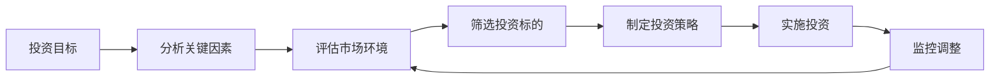

# 芒格的“反向工程”思维在投资中的应用

> 关键词：芒格、反向工程思维、投资应用、决策分析、风险规避

> 摘要：本文深入探讨了芒格的“反向工程”思维在投资领域的具体应用。首先介绍了“反向工程”思维的背景和相关概念，剖析其核心原理。接着阐述了该思维在投资决策中的核心算法原理，并结合 Python 代码进行详细说明。通过数学模型和公式进一步解释其在投资中的作用机制。然后通过项目实战案例，展示如何运用该思维进行投资分析。同时列举了“反向工程”思维在不同投资场景中的实际应用，还推荐了相关的学习资源、开发工具和论文著作。最后总结了“反向工程”思维在投资中的未来发展趋势与挑战，并对常见问题进行了解答。

## 1. 背景介绍 
### 1.1 目的和范围
本文的目的是深入剖析芒格的“反向工程”思维在投资领域的应用。通过系统地介绍这一思维模式的原理、操作步骤以及实际应用案例，帮助投资者更好地理解和运用该思维进行投资决策，提升投资的准确性和成功率。范围涵盖了从“反向工程”思维的基本概念到具体的投资实践，以及与之相关的学习资源和未来发展趋势等方面。

### 1.2 预期读者
本文预期读者主要包括各类投资者，无论是专业的投资机构从业者，还是个人投资者。同时，对投资理论和决策方法感兴趣的金融专业学生、研究人员也可以从本文中获取有价值的信息。

### 1.3 文档结构概述
本文首先对“反向工程”思维的背景进行介绍，包括目的、预期读者和文档结构等。接着阐述核心概念与联系，展示其原理和架构。然后详细讲解核心算法原理和具体操作步骤，并结合 Python 代码进行说明。通过数学模型和公式进一步分析其在投资中的应用。之后通过项目实战案例展示实际操作过程。随后列举实际应用场景和推荐相关工具与资源。最后总结未来发展趋势与挑战，解答常见问题并提供扩展阅读和参考资料。

### 1.4 术语表
#### 1.4.1 核心术语定义
- **反向工程思维**：是一种从目标或结果出发，反向推导实现该目标所需的步骤和条件的思维方式。在投资中，就是先明确投资目标，然后反向分析需要满足哪些条件才能实现该目标。
- **投资决策**：指投资者为了实现投资目标，在众多投资机会中选择合适的投资对象和投资方式的过程。
- **风险规避**：通过各种手段降低投资过程中可能面临的风险，以保护投资者的资金安全和收益稳定。

#### 1.4.2 相关概念解释
- **正向思维**：与反向工程思维相对，是从已知的条件出发，逐步推导出结果的思维方式。在投资中，正向思维通常是根据现有的市场信息和公司基本面，预测未来的投资收益。
- **目标导向**：以明确的目标为指引，所有的行动和决策都围绕着实现该目标展开。在投资中，目标导向意味着投资者首先要确定自己的投资目标，如资产增值、获取稳定收益等。

#### 1.4.3 缩略词列表
无

## 2. 核心概念与联系 
### 核心概念原理
芒格的“反向工程”思维的核心原理是先确定想要达到的投资目标，然后从这个目标出发，反向思考为了实现该目标需要解决哪些问题、满足哪些条件。例如，如果投资目标是在未来五年内实现资产翻倍，那么就需要思考什么样的投资组合、投资回报率以及风险控制措施能够帮助实现这一目标。

### 架构示意图
以下是“反向工程”思维在投资中的架构文本示意图：
投资目标 -> 分析实现目标的关键因素 -> 评估市场环境和投资机会 -> 筛选符合条件的投资标的 -> 制定投资策略 -> 实施投资并监控调整

### Mermaid 流程图


这个流程图展示了“反向工程”思维在投资中的应用过程。从确定投资目标开始，依次进行关键因素分析、市场环境评估、投资标的筛选、投资策略制定和投资实施，最后通过监控调整不断优化投资过程，形成一个闭环。

## 3. 核心算法原理 & 具体操作步骤 
### 核心算法原理
“反向工程”思维在投资中的核心算法原理可以概括为以下几个步骤：
1. **确定投资目标**：明确投资的预期收益、投资期限和风险承受能力等目标参数。
2. **反向推导条件**：根据投资目标，反向分析需要满足的条件，如投资回报率、资产配置比例等。
3. **筛选投资标的**：根据推导出来的条件，在市场中筛选符合要求的投资标的。
4. **评估和优化**：对筛选出的投资标的进行评估，根据评估结果优化投资策略。

### Python 代码实现
以下是一个简单的 Python 代码示例，演示如何运用“反向工程”思维进行投资目标的反向推导：

```python
# 定义投资目标
target_return = 2  # 目标资产翻倍
investment_period = 5  # 投资期限为 5 年

# 反向推导年均回报率
annual_return = (target_return ** (1 / investment_period)) - 1

print(f"为了在 {investment_period} 年内实现资产翻倍，年均回报率需要达到 {annual_return * 100:.2f}%")

# 假设市场上有不同的投资标的，每个标的有不同的预期回报率和风险
investment_opportunities = [
    {"name": "标的 A", "expected_return": 0.15, "risk": 0.2},
    {"name": "标的 B", "expected_return": 0.2, "risk": 0.3},
    {"name": "标的 C", "expected_return": 0.1, "risk": 0.1}
]

# 筛选符合年均回报率要求的投资标的
qualified_opportunities = [
    opportunity for opportunity in investment_opportunities
    if opportunity["expected_return"] >= annual_return
]

print("符合年均回报率要求的投资标的：")
for opportunity in qualified_opportunities:
    print(f"{opportunity['name']}: 预期回报率 {opportunity['expected_return'] * 100:.2f}%，风险 {opportunity['risk'] * 100:.2f}%")
```

### 代码解释
1. **定义投资目标**：设定了目标资产翻倍和投资期限为 5 年。
2. **反向推导年均回报率**：使用公式 $r = (\text{目标回报率})^{\frac{1}{\text{投资期限}}} - 1$ 计算出年均回报率。
3. **筛选投资标的**：根据计算出的年均回报率，筛选出市场上预期回报率大于等于该值的投资标的。

## 4. 数学模型和公式 & 详细讲解 & 举例说明 
### 投资回报率公式
在“反向工程”思维中，常用的投资回报率公式为：
$$R = \left(\frac{V_f}{V_i}\right)^{\frac{1}{n}} - 1$$
其中，$R$ 表示年均回报率，$V_f$ 表示最终资产价值，$V_i$ 表示初始资产价值，$n$ 表示投资期限（年）。

### 详细讲解
这个公式的原理是基于复利计算的思想。假设初始资产为 $V_i$，每年以固定的回报率 $R$ 增长，经过 $n$ 年后，资产价值变为 $V_f$。通过反向推导，可以根据目标最终资产价值 $V_f$ 和初始资产价值 $V_i$ 以及投资期限 $n$ 计算出所需的年均回报率 $R$。

### 举例说明
假设投资者初始投资 10 万元，目标是在 3 年后资产达到 15 万元。则根据上述公式计算年均回报率：
$$R = \left(\frac{15}{10}\right)^{\frac{1}{3}} - 1 \approx 0.1447$$
即年均回报率需要达到约 14.47% 才能实现目标。

### 资产配置公式
在投资中，合理的资产配置可以降低风险并提高收益。常见的资产配置公式可以基于现代投资组合理论，如马科维茨的均值 - 方差模型。该模型的目标是在给定的风险水平下最大化预期收益，或者在给定的预期收益下最小化风险。

假设有两种资产 $A$ 和 $B$，其预期回报率分别为 $R_A$ 和 $R_B$，风险（标准差）分别为 $\sigma_A$ 和 $\sigma_B$，资产 $A$ 的权重为 $w_A$，资产 $B$ 的权重为 $w_B = 1 - w_A$。则投资组合的预期回报率 $R_p$ 和风险 $\sigma_p$ 可以通过以下公式计算：
$$R_p = w_A R_A + w_B R_B$$
$$\sigma_p^2 = w_A^2 \sigma_A^2 + w_B^2 \sigma_B^2 + 2 w_A w_B \rho_{AB} \sigma_A \sigma_B$$
其中，$\rho_{AB}$ 表示资产 $A$ 和 $B$ 之间的相关系数。

### 举例说明
假设资产 $A$ 的预期回报率为 10%，风险为 20%；资产 $B$ 的预期回报率为 15%，风险为 30%，两者的相关系数为 0.5。如果投资者将资产 $A$ 的权重设置为 0.6，资产 $B$ 的权重设置为 0.4，则投资组合的预期回报率和风险计算如下：
$$R_p = 0.6 \times 0.1 + 0.4 \times 0.15 = 0.12$$
$$\sigma_p^2 = 0.6^2 \times 0.2^2 + 0.4^2 \times 0.3^2 + 2 \times 0.6 \times 0.4 \times 0.5 \times 0.2 \times 0.3 \approx 0.0336$$
$$\sigma_p \approx 0.1833$$
即投资组合的预期回报率为 12%，风险约为 18.33%。

## 5. 项目实战：代码实际案例和详细解释说明 
### 5.1  开发环境搭建
为了实现“反向工程”思维在投资中的应用，我们可以使用 Python 编程语言。以下是搭建开发环境的步骤：
1. **安装 Python**：从 Python 官方网站（https://www.python.org/downloads/）下载并安装适合你操作系统的 Python 版本。建议选择 Python 3.7 及以上版本。
2. **安装必要的库**：我们需要使用一些 Python 库来进行数据处理和分析，如 `pandas`、`numpy` 等。可以使用以下命令进行安装：
```sh
pip install pandas numpy
```

### 5.2  源代码详细实现和代码解读
以下是一个更复杂的 Python 代码示例，用于模拟运用“反向工程”思维进行投资组合的优化：

```python
import pandas as pd
import numpy as np

# 定义投资目标
target_return = 0.15  # 目标年均回报率
investment_period = 3  # 投资期限为 3 年

# 假设市场上有不同的投资标的，每个标的有不同的预期回报率、风险和初始价格
investment_opportunities = [
    {"name": "标的 A", "expected_return": 0.12, "risk": 0.2, "initial_price": 100},
    {"name": "标的 B", "expected_return": 0.18, "risk": 0.3, "initial_price": 200},
    {"name": "标的 C", "expected_return": 0.1, "risk": 0.15, "initial_price": 150}
]

# 生成所有可能的资产配置组合
num_opportunities = len(investment_opportunities)
weights = []
for i in range(101):
    for j in range(101 - i):
        k = 100 - i - j
        weights.append([i / 100, j / 100, k / 100])

# 筛选符合目标回报率的资产配置组合
qualified_portfolios = []
for weight in weights:
    portfolio_return = sum([
        weight[i] * investment_opportunities[i]["expected_return"]
        for i in range(num_opportunities)
    ])
    if portfolio_return >= target_return:
        qualified_portfolios.append(weight)

# 计算每个合格投资组合的风险
portfolio_risks = []
for portfolio in qualified_portfolios:
    # 简单假设风险是各资产风险的加权平均
    risk = sum([
        portfolio[i] * investment_opportunities[i]["risk"]
        for i in range(num_opportunities)
    ])
    portfolio_risks.append(risk)

# 选择风险最小的投资组合
min_risk_index = np.argmin(portfolio_risks)
optimal_portfolio = qualified_portfolios[min_risk_index]

# 输出结果
print("最优投资组合：")
for i in range(num_opportunities):
    print(f"{investment_opportunities[i]['name']}: 权重 {optimal_portfolio[i] * 100:.2f}%")
print(f"预期回报率：{sum([optimal_portfolio[i] * investment_opportunities[i]['expected_return'] for i in range(num_opportunities)]) * 100:.2f}%")
print(f"风险：{portfolio_risks[min_risk_index] * 100:.2f}%")
```

### 5.3  代码解读与分析
1. **定义投资目标**：设定了目标年均回报率为 15% 和投资期限为 3 年。
2. **生成所有可能的资产配置组合**：通过嵌套循环生成所有可能的资产配置组合，每个组合的权重之和为 1。
3. **筛选符合目标回报率的资产配置组合**：计算每个组合的预期回报率，筛选出预期回报率大于等于目标回报率的组合。
4. **计算每个合格投资组合的风险**：简单假设风险是各资产风险的加权平均，计算每个合格组合的风险。
5. **选择风险最小的投资组合**：选择风险最小的组合作为最优投资组合，并输出结果。

## 6. 实际应用场景 
### 股票投资
在股票投资中，“反向工程”思维可以帮助投资者从投资目标出发，反向筛选股票。例如，如果投资者的目标是获取稳定的股息收益，那么可以从股息率、公司盈利能力等方面反向分析，筛选出符合条件的股票。同时，通过反向思考可能导致投资失败的因素，如行业竞争加剧、公司财务造假等，提前做好风险防范措施。

### 基金投资
对于基金投资，投资者可以先确定自己的投资目标，如资产保值增值、追求高收益等。然后反向分析不同类型基金的特点和风险，选择适合自己目标的基金。例如，如果目标是在控制风险的前提下获取一定的收益，可以反向筛选那些投资风格稳健、业绩表现稳定的基金。

### 房地产投资
在房地产投资中，“反向工程”思维同样适用。投资者可以先明确自己的投资目标，如短期套利、长期租赁收益等。然后反向分析房地产市场的供需情况、地理位置、租金回报率等因素，选择合适的房地产项目进行投资。同时，考虑到房地产市场的不确定性，反向思考可能面临的风险，如政策调控、市场波动等，制定相应的应对策略。

### 创业投资
在创业投资领域，投资者可以从预期的投资回报出发，反向评估创业项目的可行性。例如，分析创业项目的商业模式、市场前景、团队能力等因素，判断该项目是否有可能实现预期的回报。同时，反向思考可能导致项目失败的风险因素，如技术难题、市场竞争等，提前做好风险评估和应对措施。

## 7. 工具和资源推荐
### 7.1 学习资源推荐
#### 7.1.1 书籍推荐
- 《穷查理宝典：查理·芒格的智慧箴言录》：这本书详细介绍了芒格的投资理念和思维方式，包括“反向工程”思维等，是学习芒格思想的经典读物。
- 《聪明的投资者》：本杰明·格雷厄姆的经典著作，阐述了价值投资的基本原理和方法，对投资者的思维培养有很大帮助。
- 《金融炼金术》：乔治·索罗斯的著作，介绍了他的投资哲学和市场分析方法，有助于投资者拓宽投资视野。

#### 7.1.2 在线课程
- Coursera 上的“投资学原理”课程：由知名高校教授授课，系统介绍了投资学的基本理论和方法。
- 网易云课堂上的“价值投资实战课程”：结合实际案例，讲解价值投资的具体操作和应用。

#### 7.1.3 技术博客和网站
- 雪球网：国内知名的投资社区，汇聚了众多投资者的经验分享和投资分析，是学习投资知识和交流投资心得的好去处。
-  Seeking Alpha：国外的投资分析网站，提供专业的股票分析和投资建议。

### 7.2 开发工具框架推荐
#### 7.2.1 IDE和编辑器
- PyCharm：功能强大的 Python 集成开发环境，提供代码编辑、调试、版本控制等功能，适合进行 Python 投资分析代码的开发。
- Jupyter Notebook：交互式的开发环境，支持代码、文本、图表等多种形式的展示，方便进行数据探索和分析。

#### 7.2.2 调试和性能分析工具
- pdb：Python 自带的调试工具，可以帮助开发者定位代码中的问题。
- cProfile：Python 的性能分析工具，可以分析代码的运行时间和函数调用情况，帮助优化代码性能。

#### 7.2.3 相关框架和库
- pandas：强大的数据处理和分析库，提供了丰富的数据结构和函数，方便进行投资数据的处理和分析。
- numpy：用于科学计算的 Python 库，提供了高效的数组操作和数学函数，在投资分析中经常用于数据计算和模型构建。
- scikit-learn：机器学习库，提供了各种机器学习算法和工具，可用于投资预测和风险评估等方面。

### 7.3 相关论文著作推荐
#### 7.3.1 经典论文
- Markowitz, H. M. (1952). Portfolio Selection. The Journal of Finance, 7(1), 77 - 91. 这篇论文提出了现代投资组合理论，为投资组合的优化提供了理论基础。
- Fama, E. F., & French, K. R. (1992). The Cross - Section of Expected Stock Returns. The Journal of Finance, 47(2), 427 - 465. 该论文提出了三因子模型，对股票收益率的影响因素进行了深入分析。

#### 7.3.2 最新研究成果
可以关注《Journal of Financial Economics》、《Review of Financial Studies》等金融领域的顶级学术期刊，获取投资领域的最新研究成果。

#### 7.3.3 应用案例分析
一些知名的投资机构和研究机构会发布投资案例分析报告，如高盛、摩根大通等。这些报告可以帮助投资者了解实际投资中的应用场景和决策过程。

## 8. 总结：未来发展趋势与挑战
### 未来发展趋势
- **智能化应用**：随着人工智能和机器学习技术的不断发展，“反向工程”思维在投资中的应用将更加智能化。例如，利用深度学习算法对大量的投资数据进行分析和预测，辅助投资者进行更准确的决策。
- **跨领域融合**：投资领域将与其他领域如科技、医疗、环保等进行更深入的融合。“反向工程”思维可以帮助投资者从不同领域的发展趋势出发，反向挖掘投资机会。
- **个性化投资**：投资者对个性化投资的需求将不断增加。“反向工程”思维可以根据投资者的不同目标和风险偏好，为其量身定制投资策略。

### 挑战
- **数据质量和可用性**：投资决策需要大量准确的数据支持。然而，数据的质量和可用性可能存在问题，如数据缺失、错误等，这会影响“反向工程”思维的应用效果。
- **市场不确定性**：金融市场具有高度的不确定性，各种因素如政策变化、突发事件等都可能导致市场波动。“反向工程”思维虽然可以帮助投资者提前做好准备，但难以完全预测和应对所有的不确定性。
- **投资者认知局限**：部分投资者可能对“反向工程”思维的理解和应用存在困难，缺乏必要的知识和技能。这需要加强投资者教育，提高投资者的认知水平。

## 9. 附录：常见问题与解答
### 问题 1：“反向工程”思维与传统投资思维有什么区别？
解答：传统投资思维通常是从现有的市场信息和公司基本面出发，预测未来的投资收益。而“反向工程”思维是从投资目标出发，反向推导实现该目标所需的条件和步骤。前者更注重对现有信息的分析和预测，后者更强调目标导向和逆向思考。

### 问题 2：在实际投资中，如何运用“反向工程”思维进行风险控制？
解答：可以先明确投资目标，然后反向思考可能导致投资失败的风险因素。针对这些风险因素，制定相应的风险控制措施。例如，如果担心市场波动风险，可以通过分散投资、设置止损点等方式来降低风险。

### 问题 3：“反向工程”思维在投资中一定能取得成功吗？
解答：不能保证一定能取得成功。虽然“反向工程”思维可以帮助投资者更系统地分析投资问题和制定投资策略，但金融市场具有不确定性，各种因素都可能影响投资结果。“反向工程”思维只是一种工具和方法，投资者还需要结合自身的经验和判断，不断调整和优化投资策略。

## 10. 扩展阅读 & 参考资料
### 扩展阅读
- 《投资最重要的事》：霍华德·马克斯的著作，分享了他在投资领域的经验和智慧，对投资者的思维提升有很大帮助。
- 《漫步华尔街》：伯顿·马尔基尔的经典著作，介绍了股票市场的运行规律和投资策略，适合投资者深入学习。

### 参考资料
- 《穷查理宝典：查理·芒格的智慧箴言录》
- Markowitz, H. M. (1952). Portfolio Selection. The Journal of Finance, 7(1), 77 - 91.
- Fama, E. F., & French, K. R. (1992). The Cross - Section of Expected Stock Returns. The Journal of Finance, 47(2), 427 - 465.

作者：AI天才研究院/AI Genius Institute & 禅与计算机程序设计艺术 /Zen And The Art of Computer Programming