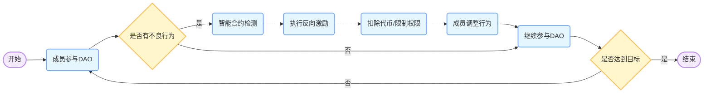

# 芒格的"反向激励"分析在去中心化自治组织(DAO)中的应用

> 关键词：芒格、反向激励、去中心化自治组织（DAO）、激励机制、组织治理

> 摘要：本文旨在探讨芒格的“反向激励”分析在去中心化自治组织（DAO）中的应用。首先介绍了相关背景，包括目的范围、预期读者等内容。接着阐述了“反向激励”与DAO的核心概念及联系，通过文本示意图和Mermaid流程图进行直观展示。详细讲解了核心算法原理，用Python代码进行了示例说明，并给出了相关数学模型和公式。通过项目实战，呈现了代码实际案例及详细解释。分析了反向激励在DAO中的实际应用场景，推荐了学习资源、开发工具框架以及相关论文著作。最后总结了未来发展趋势与挑战，解答了常见问题，并列出了扩展阅读和参考资料，以期为DAO的激励机制设计和治理提供新的思路和方法。

## 1. 背景介绍 
### 1.1 目的和范围
本研究的主要目的是深入探究芒格的“反向激励”分析如何应用于去中心化自治组织（DAO）。具体而言，我们将分析“反向激励”理论的核心要点，并结合DAO的特点，探讨其在DAO成员激励、决策制定、资源分配等方面的应用方式和效果。研究范围涵盖了“反向激励”的基本原理、DAO的运作机制，以及两者结合的具体策略和实践案例。通过本研究，我们希望为DAO的发展提供新的激励机制思路，促进DAO更加高效、公平地运行。

### 1.2 预期读者
本文的预期读者包括对区块链技术、去中心化组织感兴趣的开发者、研究者，以及参与DAO治理和运营的相关人员。对于那些希望深入了解DAO激励机制设计和优化的人员，本文将提供有价值的参考和启示。同时，对芒格的投资和管理思想感兴趣，并想探索其在新兴领域应用的读者也能从本文中获得一定的收获。

### 1.3 文档结构概述
本文将按照以下结构进行阐述：首先介绍核心概念，包括“反向激励”和DAO的定义、原理及联系；接着详细讲解核心算法原理和具体操作步骤，并用Python代码进行示例；然后给出相关的数学模型和公式，并举例说明；通过项目实战展示代码实际案例和详细解释；分析“反向激励”在DAO中的实际应用场景；推荐学习资源、开发工具框架和相关论文著作；最后总结未来发展趋势与挑战，解答常见问题，并列出扩展阅读和参考资料。

### 1.4 术语表
#### 1.4.1 核心术语定义
- **反向激励**：由查理·芒格提出的一种激励思想，它不是直接奖励某种期望的行为，而是通过惩罚不良行为来达到激励的目的，促使个体或组织避免负面结果，从而间接地推动积极行为的发生。
- **去中心化自治组织（DAO）**：一种基于区块链技术的组织形式，其决策和运营规则以智能合约的形式编码在区块链上，成员通过持有代币参与组织的治理和决策，实现组织的自治和去中心化管理。

#### 1.4.2 相关概念解释
- **区块链**：一种分布式账本技术，通过密码学算法将数据块按时间顺序链接成链条，具有去中心化、不可篡改、公开透明等特点。
- **智能合约**：一种以计算机代码形式编写的合约，一旦满足预设条件，合约将自动执行，无需第三方干预。

#### 1.4.3 缩略词列表
- **DAO**：Decentralized Autonomous Organization（去中心化自治组织）

## 2. 核心概念与联系 

### 2.1 反向激励的核心原理
反向激励的核心在于通过设置负面反馈机制，让个体或组织意识到不良行为将带来的损失，从而主动调整自己的行为。例如，在传统企业管理中，如果员工经常迟到会扣除相应的奖金，这种惩罚措施会促使员工尽量避免迟到，以获得全额奖金。芒格认为，反向激励可以更有效地约束人们的行为，因为人们往往对损失更为敏感。

### 2.2 去中心化自治组织（DAO）的架构与特点
DAO是一种基于区块链技术构建的新型组织形式，其架构主要包括以下几个部分：
- **成员**：持有DAO代币的个体或组织，他们有权参与DAO的决策和治理。
- **智能合约**：记录DAO的规则和决策流程，自动执行成员的投票结果和资源分配。
- **区块链网络**：提供去中心化的存储和计算环境，确保DAO的运行不受单一机构的控制。

DAO的特点包括去中心化、自治性、透明性和开放性。去中心化意味着没有中央权威机构，所有决策由成员共同参与；自治性体现在组织的运行由智能合约自动执行，无需人工干预；透明性是指所有交易和决策都记录在区块链上，可被成员公开查询；开放性则允许任何人在符合一定条件的情况下加入DAO。

### 2.3 反向激励与DAO的联系
在DAO中，成员的行为直接影响组织的发展和利益。由于DAO的去中心化特点，传统的集中式管理和激励方式难以有效实施。反向激励可以通过智能合约在DAO中实现自动化执行，对成员的不良行为进行及时惩罚，从而维护DAO的正常运行秩序。例如，如果成员在DAO的决策过程中恶意投票或泄露机密信息，智能合约可以自动扣除其代币作为惩罚，这种惩罚机制可以有效约束成员的行为，提高DAO的治理效率。

### 2.4 文本示意图
```plaintext
反向激励
|
|-- 惩罚不良行为
|   |
|   |-- 扣除代币
|   |-- 限制权限
|
|-- 促使积极行为
    |
    |-- 遵守规则
    |-- 积极参与决策

去中心化自治组织（DAO）
|
|-- 成员
|   |
|   |-- 持有代币
|   |-- 参与决策
|
|-- 智能合约
|   |
|   |-- 记录规则
|   |-- 自动执行
|
|-- 区块链网络
    |
    |-- 去中心化存储
    |-- 公开透明

反向激励与DAO的联系
|
|-- 智能合约实现反向激励
|   |
|   |-- 检测不良行为
|   |-- 自动惩罚
|
|-- 维护DAO运行秩序
    |
    |-- 提高治理效率
    |-- 促进成员合作
```

### 2.5 Mermaid流程图


## 3. 核心算法原理 & 具体操作步骤 

### 3.1 核心算法原理
在DAO中实现反向激励的核心算法主要包括不良行为检测和惩罚执行两个部分。不良行为检测算法通过对成员的行为数据进行实时监测和分析，判断成员是否存在不良行为。惩罚执行算法则根据检测结果，按照预设的规则对违规成员进行惩罚。

### 3.2 具体操作步骤
1. **数据收集**：收集成员在DAO中的各种行为数据，如投票记录、提案提交情况、资源使用情况等。
2. **规则定义**：在智能合约中定义不良行为的类型和相应的惩罚规则，例如，恶意投票扣除10%的代币，泄露机密信息限制参与决策权限一周。
3. **行为检测**：使用算法对收集到的数据进行分析，判断成员是否存在不良行为。可以采用机器学习算法，如分类算法，对行为数据进行分类，识别出不良行为。
4. **惩罚执行**：如果检测到成员存在不良行为，智能合约自动执行相应的惩罚规则，扣除代币或限制权限。
5. **结果通知**：将惩罚结果通知给违规成员，同时在区块链上公开记录，以保证透明度。

### 3.3 Python源代码示例
```python
# 模拟DAO成员信息
members = {
    "member1": {"tokens": 100, "voting_history": [], "violation_count": 0},
    "member2": {"tokens": 200, "voting_history": [], "violation_count": 0}
}

# 定义不良行为检测函数
def detect_violation(member_id, voting_history):
    # 简单示例：如果连续两次投反对票，则视为不良行为
    if len(voting_history) >= 2 and voting_history[-1] == "no" and voting_history[-2] == "no":
        return True
    return False

# 定义惩罚执行函数
def execute_punishment(member_id):
    global members
    # 扣除10%的代币
    members[member_id]["tokens"] = int(members[member_id]["tokens"] * 0.9)
    members[member_id]["violation_count"] += 1
    print(f"Member {member_id} has been punished. New token balance: {members[member_id]['tokens']}")

# 模拟成员投票过程
def vote(member_id, vote_result):
    global members
    members[member_id]["voting_history"].append(vote_result)
    if detect_violation(member_id, members[member_id]["voting_history"]):
        execute_punishment(member_id)

# 测试投票过程
vote("member1", "yes")
vote("member1", "no")
vote("member1", "no")
```

## 4. 数学模型和公式 & 详细讲解 & 举例说明 

### 4.1 数学模型
我们可以用一个简单的数学模型来描述反向激励在DAO中的应用。假设DAO中有 $n$ 个成员，每个成员 $i$ 有一个代币数量 $T_i$ 和一个违规次数 $V_i$。设惩罚函数 $P(V_i)$ 表示根据违规次数对成员进行的惩罚，例如，扣除代币的比例。则成员 $i$ 在经过一次惩罚后的代币数量 $T_i'$ 可以表示为：

$$T_i' = T_i - P(V_i) \times T_i$$

### 4.2 详细讲解
惩罚函数 $P(V_i)$ 可以根据不同的规则进行定义。例如，我们可以采用线性惩罚函数：

$$P(V_i) = k \times V_i$$

其中 $k$ 是一个常数，表示每次违规扣除代币的比例。例如，当 $k = 0.1$ 时，每次违规扣除10%的代币。

### 4.3 举例说明
假设成员 $A$ 初始代币数量 $T_A = 100$，违规次数 $V_A = 0$。当成员 $A$ 第一次违规时，$V_A$ 变为1，根据线性惩罚函数 $P(V_A) = 0.1 \times 1 = 0.1$，则惩罚后成员 $A$ 的代币数量为：

$$T_A' = 100 - 0.1 \times 100 = 90$$

当成员 $A$ 第二次违规时，$V_A$ 变为2，$P(V_A) = 0.1 \times 2 = 0.2$，惩罚后成员 $A$ 的代币数量为：

$$T_A' = 90 - 0.2 \times 90 = 72$$

通过这种方式，随着违规次数的增加，成员的代币损失也会逐渐增加，从而起到反向激励的作用。

## 5. 项目实战：代码实际案例和详细解释说明 

### 5.1  开发环境搭建
#### 5.1.1 安装Python
首先，确保你已经安装了Python 3.x版本。可以从Python官方网站（https://www.python.org/downloads/）下载并安装适合你操作系统的Python版本。

#### 5.1.2 安装必要的库
在本项目中，我们主要使用Python的内置库，无需额外安装其他库。

### 5.2  源代码详细实现和代码解读
```python
# 模拟DAO成员信息
members = {
    "member1": {"tokens": 100, "voting_history": [], "violation_count": 0},
    "member2": {"tokens": 200, "voting_history": [], "violation_count": 0}
}

# 代码解读：定义一个字典members，用于存储DAO成员的信息，包括代币数量、投票历史和违规次数。

# 定义不良行为检测函数
def detect_violation(member_id, voting_history):
    # 简单示例：如果连续两次投反对票，则视为不良行为
    if len(voting_history) >= 2 and voting_history[-1] == "no" and voting_history[-2] == "no":
        return True
    return False

# 代码解读：定义一个函数detect_violation，用于检测成员是否存在不良行为。通过检查投票历史，判断成员是否连续两次投反对票。

# 定义惩罚执行函数
def execute_punishment(member_id):
    global members
    # 扣除10%的代币
    members[member_id]["tokens"] = int(members[member_id]["tokens"] * 0.9)
    members[member_id]["violation_count"] += 1
    print(f"Member {member_id} has been punished. New token balance: {members[member_id]['tokens']}")

# 代码解读：定义一个函数execute_punishment，用于执行惩罚操作。扣除成员10%的代币，并增加违规次数，同时打印惩罚信息。

# 模拟成员投票过程
def vote(member_id, vote_result):
    global members
    members[member_id]["voting_history"].append(vote_result)
    if detect_violation(member_id, members[member_id]["voting_history"]):
        execute_punishment(member_id)

# 代码解读：定义一个函数vote，用于模拟成员的投票过程。将投票结果添加到投票历史中，并调用detect_violation函数检测是否存在不良行为，如果存在则执行惩罚操作。

# 测试投票过程
vote("member1", "yes")
vote("member1", "no")
vote("member1", "no")

# 代码解读：调用vote函数进行测试，模拟成员1的投票过程，当成员1连续两次投反对票时，会触发惩罚操作。
```

### 5.3  代码解读与分析
通过上述代码，我们实现了一个简单的DAO反向激励系统。在这个系统中，我们模拟了DAO成员的投票过程，并通过不良行为检测和惩罚执行函数，对成员的不良行为进行惩罚。

代码的优点在于简单易懂，通过几个函数的组合，实现了基本的反向激励功能。但也存在一些局限性，例如，不良行为的检测规则比较简单，只考虑了连续两次投反对票的情况；惩罚方式也比较单一，只采用了扣除代币的方式。在实际应用中，可以根据具体需求对代码进行扩展和优化，例如，增加更多的不良行为检测规则和惩罚方式。

## 6. 实际应用场景 
### 6.1 决策投票场景
在DAO的决策投票过程中，反向激励可以防止成员恶意投票。例如，一些成员可能为了个人利益而故意投反对票，阻碍决策的通过。通过设置反向激励机制，如对连续多次投反对票的成员扣除代币或限制其投票权限，可以促使成员更加理性地参与投票，提高决策的效率和质量。

### 6.2 资源分配场景
在DAO的资源分配过程中，反向激励可以防止成员滥用资源。例如，一些成员可能会过度申请资源，导致资源分配不均衡。通过对滥用资源的成员进行惩罚，如扣除代币或限制其未来的资源申请权限，可以促使成员合理使用资源，提高资源的利用效率。

### 6.3 项目协作场景
在DAO的项目协作过程中，反向激励可以提高成员的参与度和责任心。例如，一些成员可能会拖延项目进度或不履行自己的职责。通过对这些成员进行惩罚，如扣除代币或降低其在项目中的声誉，可以促使成员积极参与项目协作，保证项目的顺利进行。

## 7. 工具和资源推荐
### 7.1 学习资源推荐
#### 7.1.1 书籍推荐
- 《穷查理宝典：查理·芒格的智慧箴言录》：这本书收录了查理·芒格的演讲、文章和名言，全面介绍了他的投资理念、思维方式和人生智慧，对于理解反向激励的思想来源有很大帮助。
- 《区块链：从数字货币到信用社会》：本书系统地介绍了区块链的基本原理、技术架构和应用场景，对于深入了解DAO的技术基础和运作机制非常有价值。

#### 7.1.2 在线课程
- Coursera上的“区块链基础”课程：该课程由知名高校的教授授课，内容涵盖了区块链的基本概念、密码学原理、智能合约等方面的知识，适合初学者学习。
- Udemy上的“去中心化自治组织（DAO）开发实战”课程：该课程通过实际案例，详细介绍了DAO的开发过程和技术要点，对于想从事DAO开发的人员有很大的帮助。

#### 7.1.3 技术博客和网站
- Medium：上面有很多关于区块链和DAO的技术文章和观点分享，可以关注一些知名的区块链博主，如Andreas M. Antonopoulos等。
- Ethereum官方博客：以太坊是DAO的主要技术平台之一，其官方博客会发布最新的技术进展和应用案例，对于了解DAO的发展动态非常有帮助。

### 7.2 开发工具框架推荐
#### 7.2.1 IDE和编辑器
- Visual Studio Code：一款功能强大的开源代码编辑器，支持多种编程语言和插件扩展，适合用于DAO的开发。
- Remix：以太坊官方推荐的在线智能合约开发环境，提供了代码编辑、编译、部署和调试等功能，方便开发者进行智能合约的开发和测试。

#### 7.2.2 调试和性能分析工具
- Truffle：一个流行的以太坊开发框架，提供了项目管理、合约编译、部署和测试等功能，同时还支持调试和性能分析。
- Ganache：一个个人区块链，用于快速搭建以太坊开发环境，方便开发者进行智能合约的调试和测试。

#### 7.2.3 相关框架和库
- Web3.py：一个Python库，用于与以太坊区块链进行交互，提供了丰富的API，方便开发者进行DAO的开发。
- OpenZeppelin：一个智能合约开发框架，提供了一系列安全可靠的智能合约模板和工具，可用于快速开发DAO的智能合约。

### 7.3 相关论文著作推荐
#### 7.3.1 经典论文
- “Bitcoin: A Peer-to-Peer Electronic Cash System”：比特币的白皮书，介绍了比特币的基本原理和技术架构，为区块链和DAO的发展奠定了基础。
- “The DAO's Whitepaper”：去中心化自治组织（DAO）的白皮书，详细介绍了DAO的概念、运作机制和应用场景。

#### 7.3.2 最新研究成果
- 可以关注IEEE、ACM等计算机领域的顶级学术会议和期刊，如IEEE Transactions on Blockchain和ACM SIGCOMM等，上面会发表关于区块链和DAO的最新研究成果。

#### 7.3.3 应用案例分析
- 可以参考一些知名的DAO项目，如MakerDAO、Aragon等的官方文档和研究报告，了解它们的激励机制设计和应用实践。

## 8. 总结：未来发展趋势与挑战
### 8.1 未来发展趋势
- **更复杂的激励机制**：随着DAO的发展，反向激励机制将变得更加复杂和多样化。除了扣除代币和限制权限外，可能会出现更多的惩罚方式，如声誉损失、社交隔离等。同时，激励机制也将与更多的行为指标相结合，如成员的贡献度、创新能力等，以更全面地激励成员的积极行为。
- **与其他技术的融合**：DAO将与人工智能、物联网等技术进行深度融合。例如，利用人工智能算法对成员的行为进行更精准的分析和预测，实现更智能的反向激励。物联网技术可以为DAO提供更多的实时数据，用于不良行为的检测和惩罚执行。
- **跨链DAO的发展**：随着区块链技术的发展，跨链互操作性将得到提升，跨链DAO将成为未来的发展趋势。反向激励机制将在跨链环境中发挥重要作用，确保不同区块链上的成员能够遵守共同的规则，促进跨链DAO的健康发展。

### 8.2 挑战
- **法律和监管问题**：DAO的去中心化特点使其在法律和监管方面面临挑战。反向激励机制的实施可能涉及到财产权益的剥夺和限制，需要在法律框架内进行规范。目前，各国对于DAO的法律地位和监管政策还不明确，这给反向激励机制的应用带来了一定的不确定性。
- **技术安全问题**：DAO的运行依赖于区块链技术和智能合约，技术安全是其面临的重要挑战。如果智能合约存在漏洞，可能会导致反向激励机制被恶意利用，造成成员的损失。因此，需要加强技术安全防护，确保反向激励机制的可靠运行。
- **成员认知和接受度问题**：反向激励机制与传统的正向激励机制有所不同，成员可能对其认知和接受度存在差异。一些成员可能不理解反向激励的原理和目的，甚至会对惩罚措施产生抵触情绪。因此，需要加强对成员的教育和宣传，提高成员对反向激励机制的认知和接受度。

## 9. 附录：常见问题与解答
### 9.1 反向激励会不会打击成员的积极性？
反向激励的目的是通过惩罚不良行为来促进积极行为的发生，而不是单纯地打击成员的积极性。在设计反向激励机制时，需要合理设置惩罚规则，确保惩罚的程度与不良行为的严重程度相匹配。同时，可以结合正向激励机制，对表现优秀的成员进行奖励，以提高成员的整体积极性。

### 9.2 如何确保反向激励机制的公平性？
为了确保反向激励机制的公平性，需要做到以下几点：一是明确不良行为的定义和惩罚规则，避免模糊和歧义；二是采用客观的数据和指标来判断成员的行为，避免主观因素的干扰；三是建立申诉机制，允许成员对惩罚结果提出异议，确保惩罚结果的公正性。

### 9.3 反向激励机制在不同类型的DAO中是否适用？
反向激励机制在不同类型的DAO中都具有一定的适用性。但具体的应用方式和效果可能会因DAO的性质、目标和成员特点的不同而有所差异。例如，在以投资为主要目的的DAO中，反向激励机制可以重点关注成员的投资决策行为；在以社区建设为主要目的的DAO中，反向激励机制可以关注成员的社区参与度和贡献度。

## 10. 扩展阅读 & 参考资料
### 扩展阅读
- 《创新者的窘境》：这本书探讨了企业在面对技术变革时的创新困境和应对策略，对于理解DAO在发展过程中可能面临的挑战和机遇有一定的启示。
- 《失控：全人类的最终命运和结局》：本书介绍了分布式系统的原理和应用，对于深入理解DAO的去中心化特点和自治机制有很大的帮助。

### 参考资料
- 查理·芒格的演讲和文章
- 以太坊官方文档和技术博客
- 相关的学术论文和研究报告

作者：AI天才研究院/AI Genius Institute & 禅与计算机程序设计艺术 /Zen And The Art of Computer Programming