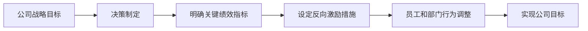

# 芒格的"反向激励"分析：理解公司决策背后的动机

> 关键词：芒格、反向激励、公司决策、动机分析、激励机制

> 摘要：本文深入探讨了芒格提出的“反向激励”概念，旨在帮助读者理解公司决策背后的动机。通过对反向激励的核心概念、算法原理、数学模型等方面的详细阐述，结合项目实战案例和实际应用场景分析，揭示了反向激励在公司决策中的重要作用。同时，推荐了相关的学习资源、开发工具和论文著作，最后对未来发展趋势与挑战进行了总结，并提供了常见问题解答和参考资料，为读者全面了解和应用反向激励理论提供了丰富的知识和实践指导。

## 1. 背景介绍 
### 1.1 目的和范围
本文的目的在于深入剖析芒格的“反向激励”理论，并将其应用于理解公司决策背后的动机。通过对这一理论的研究和实践案例的分析，帮助读者掌握如何运用反向激励的思维方式来解读公司的战略决策、资源分配、管理措施等行为。范围涵盖了反向激励理论的基本概念、相关算法和数学模型，以及在不同行业和企业规模中的实际应用。

### 1.2 预期读者
本文预期读者包括企业管理者、投资者、经济学研究者、商学院学生以及对公司决策和激励机制感兴趣的人士。无论是希望提升决策能力的企业从业者，还是致力于研究经济现象的学者，都能从本文中获得有价值的信息和启示。

### 1.3 文档结构概述
本文首先介绍了反向激励的背景和相关术语，为读者建立起基本的知识框架。接着详细阐述了反向激励的核心概念、算法原理和数学模型，使读者深入理解其理论基础。通过项目实战案例，展示了反向激励在实际应用中的具体操作和效果。然后分析了反向激励在不同场景下的应用，为读者提供了更多的实践参考。随后推荐了相关的学习资源、开发工具和论文著作，帮助读者进一步深入学习。最后对未来发展趋势与挑战进行了总结，并提供了常见问题解答和参考资料，方便读者查阅和应用。

### 1.4 术语表
#### 1.4.1 核心术语定义
- **反向激励**：与传统正向激励相对，通过设置负面后果或惩罚机制来促使个体或组织改变行为，以达到预期的目标。
- **公司决策**：公司为实现特定目标，在多种方案中进行选择和确定行动方案的过程。
- **动机**：引起个体或组织采取行动的内在原因和动力。

#### 1.4.2 相关概念解释
- **正向激励**：通过给予奖励、表扬等积极方式来鼓励个体或组织采取某种行为，以提高工作积极性和绩效。
- **激励机制**：组织为实现其目标，通过一套理性化的制度来激发、引导、保持和规范组织成员行为的机制。

#### 1.4.3 缩略词列表
无

## 2. 核心概念与联系 

### 2.1 反向激励的概念原理
反向激励的核心思想是利用人们对负面后果的恐惧来驱动行为改变。在公司决策中，当管理者发现员工或部门的行为不符合公司的战略目标或价值观时，可以通过设置明确的负面后果，如惩罚、降级、减少资源分配等，来促使他们调整行为。例如，如果公司设定了降低成本的目标，但某个部门的费用持续超支，管理者可以警告该部门如果不采取措施降低成本，将面临预算削减或人员裁减的后果。这种负面压力会促使该部门积极寻找降低成本的方法，从而实现公司的目标。

### 2.2 反向激励与公司决策的联系
反向激励在公司决策中起着重要的作用。它可以作为一种有效的管理工具，帮助公司实现战略目标。通过反向激励，公司可以引导员工和部门的行为，使其与公司的整体利益保持一致。例如，在市场竞争激烈的情况下，公司可能会决定采取降价策略以提高市场份额。为了确保各部门能够积极配合这一决策，公司可以设置反向激励措施，如如果某个部门未能按时完成成本控制目标，将影响其绩效考核和奖金发放。这样可以促使各部门积极采取措施降低成本，支持公司的降价决策。

### 2.3 文本示意图
反向激励与公司决策的关系可以用以下文本示意图表示：

公司战略目标 -> 决策制定 -> 明确关键绩效指标 -> 设定反向激励措施 -> 员工和部门行为调整 -> 实现公司目标

### 2.4 Mermaid 流程图


## 3. 核心算法原理 & 具体操作步骤 

### 3.1 核心算法原理
反向激励的核心算法原理可以用以下 Python 代码来表示：

```python
# 定义公司目标和关键绩效指标
company_goal = 100  # 假设公司目标是实现 100 的业绩
key_performance_indicator = 80  # 关键绩效指标设定为 80

# 定义员工或部门的当前绩效
current_performance = 60

# 定义反向激励函数
def reverse_incentive(current_performance, key_performance_indicator, penalty_factor=0.1):
    if current_performance < key_performance_indicator:
        # 计算惩罚值
        penalty = (key_performance_indicator - current_performance) * penalty_factor
        # 输出惩罚信息
        print(f"由于当前绩效 {current_performance} 低于关键绩效指标 {key_performance_indicator}，将面临 {penalty} 的惩罚。")
    else:
        print("当前绩效达到或超过关键绩效指标，无需惩罚。")

# 调用反向激励函数
reverse_incentive(current_performance, key_performance_indicator)
```

### 3.2 具体操作步骤
1. **确定公司目标**：明确公司在一定时期内要实现的具体目标，如销售额增长、成本降低、市场份额扩大等。
2. **设定关键绩效指标**：根据公司目标，为各个部门或岗位设定具体的、可衡量的关键绩效指标（KPI）。这些指标应该与公司目标紧密相关，并且具有可操作性。
3. **制定反向激励措施**：根据关键绩效指标，制定相应的反向激励措施。这些措施可以包括罚款、降级、减少奖金、取消晋升机会等。反向激励措施应该明确、具体，并且具有可执行性。
4. **沟通和培训**：将公司目标、关键绩效指标和反向激励措施向员工和部门进行充分的沟通和培训，确保他们理解公司的期望和要求。
5. **定期评估和反馈**：定期对员工和部门的绩效进行评估，并及时给予反馈。如果绩效未达到关键绩效指标，按照反向激励措施进行相应的处理。同时，为员工和部门提供改进的建议和支持。
6. **调整和优化**：根据评估结果和实际情况，对反向激励措施进行调整和优化。确保反向激励措施的有效性和合理性，避免过度惩罚或惩罚不当。

## 4. 数学模型和公式 & 详细讲解 & 举例说明 

### 4.1 数学模型和公式
设公司目标为 $G$，关键绩效指标为 $K$，员工或部门的当前绩效为 $P$，惩罚因子为 $\alpha$（$0 < \alpha < 1$）。

当 $P < K$ 时，惩罚值 $C$ 的计算公式为：

$$C = \alpha \times (K - P)$$

当 $P \geq K$ 时，$C = 0$。

### 4.2 详细讲解
这个数学模型和公式描述了反向激励的基本原理。惩罚因子 $\alpha$ 表示在绩效未达到关键绩效指标时，每降低一个单位绩效所对应的惩罚程度。通过调整惩罚因子的大小，可以控制反向激励的强度。当员工或部门的当前绩效 $P$ 低于关键绩效指标 $K$ 时，根据公式计算出相应的惩罚值 $C$，对其进行惩罚。当绩效达到或超过关键绩效指标时，不进行惩罚。

### 4.3 举例说明
假设公司目标是实现年销售额 1000 万元，为销售部门设定的关键绩效指标是年销售额 800 万元，惩罚因子 $\alpha = 0.05$。如果销售部门的实际年销售额为 700 万元，根据公式计算惩罚值：

$$C = 0.05 \times (800 - 700) = 5$$

这意味着销售部门将面临 5 万元的惩罚，例如减少奖金或扣除绩效工资。

## 5. 项目实战：代码实际案例和详细解释说明 

### 5.1 开发环境搭建
本项目实战使用 Python 语言进行开发，开发环境可以选择以下几种：
- **Anaconda**：是一个开源的 Python 发行版本，包含了 Python 解释器、常用的科学计算库和开发工具。可以从 Anaconda 官方网站（https://www.anaconda.com/） 下载并安装适合自己操作系统的版本。
- **PyCharm**：是一款专业的 Python 集成开发环境（IDE），提供了代码编辑、调试、版本控制等功能。可以从 JetBrains 官方网站（https://www.jetbrains.com/pycharm/） 下载并安装社区版或专业版。

### 5.2 源代码详细实现和代码解读
以下是一个完整的 Python 代码示例，用于模拟反向激励在公司决策中的应用：

```python
# 定义公司目标和关键绩效指标
company_goal = 1000  # 公司目标是实现 1000 的业绩
key_performance_indicator = 800  # 关键绩效指标设定为 800

# 定义部门列表和每个部门的当前绩效
departments = {
    "销售部": 750,
    "研发部": 850,
    "生产部": 700
}

# 定义惩罚因子
penalty_factor = 0.05

# 定义反向激励函数
def reverse_incentive(departments, key_performance_indicator, penalty_factor):
    for department, performance in departments.items():
        if performance < key_performance_indicator:
            # 计算惩罚值
            penalty = (key_performance_indicator - performance) * penalty_factor
            # 输出惩罚信息
            print(f"{department} 由于当前绩效 {performance} 低于关键绩效指标 {key_performance_indicator}，将面临 {penalty} 的惩罚。")
        else:
            print(f"{department} 当前绩效达到或超过关键绩效指标，无需惩罚。")

# 调用反向激励函数
reverse_incentive(departments, key_performance_indicator, penalty_factor)
```

### 5.3 代码解读与分析
1. **定义公司目标和关键绩效指标**：`company_goal` 表示公司的整体目标，`key_performance_indicator` 表示各个部门需要达到的关键绩效指标。
2. **定义部门列表和每个部门的当前绩效**：使用字典 `departments` 存储各个部门的名称和当前绩效。
3. **定义惩罚因子**：`penalty_factor` 表示在绩效未达到关键绩效指标时，每降低一个单位绩效所对应的惩罚程度。
4. **定义反向激励函数**：`reverse_incentive` 函数接受部门列表、关键绩效指标和惩罚因子作为参数，遍历每个部门的绩效，根据绩效是否低于关键绩效指标计算并输出惩罚信息。
5. **调用反向激励函数**：调用 `reverse_incentive` 函数，对各个部门的绩效进行评估，并输出相应的惩罚信息。

通过这个代码示例，可以清晰地看到反向激励在公司决策中的应用过程。根据部门的绩效情况，对未达到关键绩效指标的部门进行惩罚，从而促使部门积极改进绩效，实现公司的目标。

## 6. 实际应用场景 
### 6.1 成本控制
在企业的成本控制中，反向激励可以发挥重要作用。例如，公司设定了年度成本降低 10% 的目标，并为各个部门设定了相应的成本控制指标。如果某个部门的成本超支，公司可以采取反向激励措施，如扣除该部门的奖金、减少其下一年度的预算等。这样可以促使部门积极寻找降低成本的方法，如优化采购流程、提高生产效率等，从而实现公司的成本控制目标。

### 6.2 质量保证
在产品质量保证方面，反向激励也可以起到很好的效果。公司可以设定产品质量合格率的目标，并为生产部门和质量控制部门设定相应的关键绩效指标。如果产品质量合格率未达到指标要求，公司可以对相关部门进行惩罚，如罚款、降级等。同时，要求部门进行原因分析和改进措施的制定，以提高产品质量。

### 6.3 市场份额提升
为了提升市场份额，公司可以制定相应的销售目标和市场推广计划。如果销售部门未能完成销售目标，或者市场推广部门未能达到预期的市场覆盖率，公司可以采取反向激励措施，如调整销售团队的人员结构、减少市场推广费用等。这样可以促使部门积极改进销售策略和市场推广方法，提高市场份额。

### 6.4 创新与研发
在创新与研发领域，反向激励同样可以激励团队积极投入工作。公司可以设定研发项目的时间节点和技术指标，如果研发团队未能按时完成项目或达到技术指标要求，公司可以对团队进行惩罚，如减少研发资金、取消项目奖励等。同时，鼓励团队进行技术创新和改进，提高研发效率和质量。

## 7. 工具和资源推荐
### 7.1 学习资源推荐
#### 7.1.1 书籍推荐
- 《穷查理宝典：查理·芒格的智慧箴言录》：本书收录了查理·芒格的演讲、文章和书信等，全面展示了他的投资理念、思维方式和人生智慧，其中包含了关于反向激励等重要思想的阐述。
- 《激励理论与管理》：系统介绍了各种激励理论及其在管理中的应用，对理解反向激励的理论基础和实践应用有很大帮助。
- 《公司战略与风险管理》：涵盖了公司战略制定、决策分析和风险管理等方面的内容，有助于读者从战略层面理解反向激励在公司决策中的作用。

#### 7.1.2 在线课程
- Coursera 平台上的“组织行为学”课程：该课程深入探讨了组织中的个体行为、群体行为和领导行为等方面的内容，其中包括激励理论和实践的讲解。
- edX 平台上的“管理经济学”课程：从经济学的角度分析管理决策，介绍了激励机制在企业中的应用原理和方法。
- 中国大学 MOOC 平台上的“人力资源管理”课程：详细讲解了人力资源管理的各个模块，包括激励管理，对理解反向激励在人力资源管理中的应用有很大帮助。

#### 7.1.3 技术博客和网站
- 哈佛商业评论（https://hbr.org/）：提供了大量关于管理、领导力、战略等方面的前沿文章和研究成果，其中不乏关于激励机制和公司决策的深入分析。
- 麦肯锡季刊（https://www.mckinsey.com/）：是全球知名的管理咨询公司麦肯锡发布的商业期刊，包含了许多关于企业管理和战略决策的优秀案例和研究报告。
- 知乎（https://www.zhihu.com/）：在知乎上搜索“反向激励”、“公司决策”等关键词，可以找到许多相关的讨论和经验分享，有助于拓宽视野和深入思考。

### 7.2 开发工具框架推荐
#### 7.2.1 IDE和编辑器
- PyCharm：功能强大的 Python 集成开发环境，提供了代码编辑、调试、版本控制等丰富的功能，适合开发各种 Python 项目。
- Visual Studio Code：轻量级的代码编辑器，支持多种编程语言，具有丰富的插件扩展功能，可以方便地进行 Python 代码的开发和调试。
- Jupyter Notebook：交互式的开发环境，适合进行数据分析、模型训练和算法验证等工作，方便展示代码和结果。

#### 7.2.2 调试和性能分析工具
- PDB：Python 自带的调试器，可以在代码中设置断点，逐步执行代码，查看变量的值和程序的执行流程，帮助调试代码。
- cProfile：Python 标准库中的性能分析工具，可以统计代码中各个函数的执行时间和调用次数，帮助找出性能瓶颈。
- Py-Spy：一个轻量级的性能分析工具，可以实时监测 Python 程序的性能，生成火焰图等可视化结果，方便分析性能问题。

#### 7.2.3 相关框架和库
- Pandas：用于数据处理和分析的 Python 库，提供了丰富的数据结构和函数，方便对公司绩效数据进行处理和分析。
- NumPy：Python 中用于科学计算的基础库，提供了高效的数组操作和数学函数，可用于实现反向激励算法中的数学计算。
- Matplotlib：用于数据可视化的 Python 库，可以将公司绩效数据和反向激励结果以图表的形式展示出来，方便直观地分析和理解。

### 7.3 相关论文著作推荐
#### 7.3.1 经典论文
- “The Economics of Incentives in Organizations”（组织中的激励经济学）：该论文从经济学的角度深入分析了组织中的激励机制，探讨了正向激励和反向激励的原理和应用。
- “Incentive Theory: An Overview”（激励理论概述）：系统介绍了各种激励理论的发展历程和主要内容，为理解反向激励提供了理论基础。
- “The Role of Incentives in Corporate Decision-Making”（激励在公司决策中的作用）：研究了激励机制对公司决策的影响，分析了如何通过合理的激励措施提高公司决策的效率和质量。

#### 7.3.2 最新研究成果
- 关注顶级学术期刊如《Journal of Financial Economics》（金融