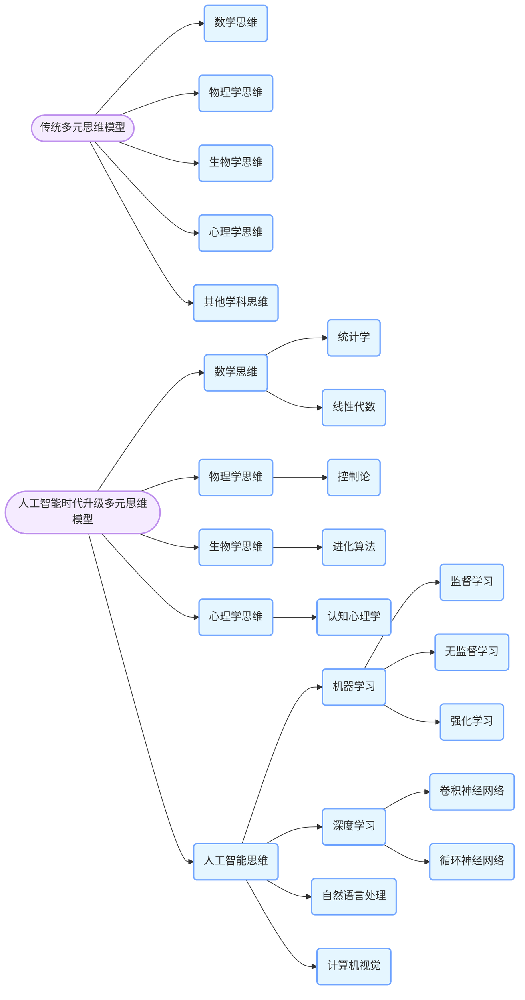

# 芒格的"多元思维模型"在人工智能时代的升级

> 关键词：芒格、多元思维模型、人工智能时代、升级、跨学科融合

> 摘要：本文聚焦于芒格的“多元思维模型”在人工智能时代的升级。首先介绍了“多元思维模型”的背景以及本文的目的、预期读者、文档结构等内容。接着深入阐述核心概念与联系，分析其原理和架构，并给出相应的文本示意图和 Mermaid 流程图。详细讲解了相关核心算法原理，用 Python 代码进行示例说明，同时给出数学模型和公式并举例。通过项目实战，展示代码实际案例并进行详细解释。探讨了该模型在人工智能时代的实际应用场景，推荐了相关的工具和资源，包括学习资源、开发工具框架以及论文著作等。最后总结了未来发展趋势与挑战，解答常见问题，并提供扩展阅读和参考资料，旨在帮助读者理解“多元思维模型”在人工智能时代的演变和应用。

## 1. 背景介绍 
### 1.1 目的和范围
查理·芒格提出的“多元思维模型”强调通过融合多个学科的知识和思维方式来解决复杂问题，这种思维方式在传统的商业、投资等领域已经展现出巨大的价值。然而，随着人工智能时代的到来，科技的飞速发展带来了新的挑战和机遇。本文的目的在于探讨如何将芒格的“多元思维模型”进行升级，以适应人工智能时代的特点和需求。范围涵盖了从核心概念的解析到实际应用场景的分析，以及相关工具和资源的推荐等方面，旨在为读者提供一个全面且深入的视角来理解和应用升级后的“多元思维模型”。

### 1.2 预期读者
本文预期读者包括对人工智能和投资、决策等领域感兴趣的专业人士，如人工智能开发者、数据分析师、投资者、企业管理者等。同时，也适合对跨学科知识融合和思维方式提升有需求的广大学习爱好者，无论是在校学生还是职场人士，都可以从本文中获得启发，学习如何在人工智能时代运用升级后的“多元思维模型”进行问题解决和决策制定。

### 1.3 文档结构概述
本文将按照以下结构进行阐述：首先介绍核心概念与联系，包括“多元思维模型”的基本原理、在人工智能时代的升级架构，并通过文本示意图和 Mermaid 流程图进行直观展示；接着详细讲解核心算法原理和具体操作步骤，使用 Python 代码进行详细阐述；然后给出相关的数学模型和公式，并举例说明其应用；通过项目实战展示代码实际案例并进行详细解释；探讨实际应用场景；推荐相关的工具和资源，包括学习资源、开发工具框架和论文著作等；最后总结未来发展趋势与挑战，解答常见问题，并提供扩展阅读和参考资料。

### 1.4 术语表
#### 1.4.1 核心术语定义
- **多元思维模型**：指将多个不同学科（如数学、物理学、生物学、心理学等）的知识和思维方式结合起来，形成一个综合的思维框架，用于分析和解决复杂问题。
- **人工智能时代**：以人工智能技术的广泛应用和快速发展为主要特征的时代，涉及机器学习、深度学习、自然语言处理、计算机视觉等多个领域。
- **跨学科融合**：将不同学科的理论、方法和技术进行有机结合，以创造新的知识和解决复杂问题。

#### 1.4.2 相关概念解释
- **机器学习**：人工智能的一个分支，通过让计算机从数据中学习模式和规律，从而实现预测和决策等任务。
- **深度学习**：一种基于神经网络的机器学习方法，通过构建多层神经网络来自动提取数据中的特征，在图像识别、语音识别等领域取得了显著成果。
- **决策树**：一种常用的机器学习算法，通过构建树形结构来进行决策，每个内部节点表示一个属性上的测试，每个分支是一个测试输出，每个叶节点是一个类别或值。

#### 1.4.3 缩略词列表
- **AI**：Artificial Intelligence，人工智能
- **ML**：Machine Learning，机器学习
- **DL**：Deep Learning，深度学习

## 2. 核心概念与联系 

### 核心概念原理
芒格的“多元思维模型”核心在于打破学科之间的界限，从多个角度看待问题。在传统领域，它帮助人们避免单一思维的局限性，更全面地分析问题。在人工智能时代，这种思维方式需要进一步升级。因为人工智能技术的发展使得数据量呈爆炸式增长，问题的复杂性也不断提高。升级后的“多元思维模型”需要融合人工智能相关的知识，如机器学习、深度学习等，同时结合传统学科的思维方式，形成一个更加高效、全面的思维体系。

例如，在处理复杂的商业决策问题时，不仅要运用经济学、管理学的知识，还要考虑人工智能技术如何影响市场趋势、客户需求等因素。通过机器学习算法对大量市场数据进行分析，结合心理学知识理解消费者行为，从而做出更准确的决策。

### 架构的文本示意图
```
多元思维模型（传统）
|-- 数学思维
|-- 物理学思维
|-- 生物学思维
|-- 心理学思维
|-- ......

多元思维模型（人工智能时代升级）
|-- 数学思维
|   |-- 统计学（用于机器学习数据处理）
|   |-- 线性代数（用于神经网络计算）
|-- 物理学思维
|   |-- 控制论（用于智能系统控制）
|-- 生物学思维
|   |-- 进化算法（用于优化问题）
|-- 心理学思维
|   |-- 认知心理学（用于人机交互设计）
|-- 人工智能思维
|   |-- 机器学习
|   |   |-- 监督学习
|   |   |-- 无监督学习
|   |   |-- 强化学习
|   |-- 深度学习
|   |   |-- 卷积神经网络
|   |   |-- 循环神经网络
|   |-- 自然语言处理
|   |-- 计算机视觉
```

### Mermaid 流程图


## 3. 核心算法原理 & 具体操作步骤 

### 以决策树算法为例
决策树是一种常用的机器学习算法，它可以用于分类和回归问题。下面我们详细讲解决策树算法的原理和具体操作步骤，并使用 Python 代码进行实现。

#### 算法原理
决策树的基本思想是通过对数据集的特征进行划分，构建一个树形结构。每个内部节点表示一个特征上的测试，每个分支是一个测试输出，每个叶节点是一个类别或值。决策树的构建过程是一个递归的过程，主要包括以下几个步骤：
1. **特征选择**：选择一个最优的特征作为当前节点的划分特征。常用的特征选择指标有信息增益、信息增益比、基尼指数等。
2. **数据集划分**：根据选择的特征对数据集进行划分，得到不同的子集。
3. **递归构建子树**：对每个子集递归地执行步骤 1 和步骤 2，直到满足停止条件，如子集为空、所有样本属于同一类别等。

#### 具体操作步骤
1. **初始化决策树**：创建一个根节点。
2. **选择最优特征**：计算每个特征的信息增益（或其他指标），选择信息增益最大的特征作为当前节点的划分特征。
3. **划分数据集**：根据选择的特征对数据集进行划分，得到不同的子集。
4. **递归构建子树**：对每个子集递归地执行步骤 2 和步骤 3，直到满足停止条件。
5. **返回决策树**：当所有子集都处理完毕后，返回构建好的决策树。

#### Python 源代码实现
```python
import numpy as np

def entropy(y):
    """计算熵"""
    classes, counts = np.unique(y, return_counts=True)
    probabilities = counts / len(y)
    return -np.sum(probabilities * np.log2(probabilities))

def information_gain(X, y, feature_index):
    """计算信息增益"""
    parent_entropy = entropy(y)
    n = len(y)
    unique_values = np.unique(X[:, feature_index])
    weighted_entropy = 0
    for value in unique_values:
        subset_indices = X[:, feature_index] == value
        subset_y = y[subset_indices]
        subset_entropy = entropy(subset_y)
        weighted_entropy += (len(subset_y) / n) * subset_entropy
    return parent_entropy - weighted_entropy

def best_feature(X, y):
    """选择最优特征"""
    num_features = X.shape[1]
    best_info_gain = 0
    best_feature_index = -1
    for i in range(num_features):
        info_gain = information_gain(X, y, i)
        if info_gain > best_info_gain:
            best_info_gain = info_gain
            best_feature_index = i
    return best_feature_index

def create_tree(X, y):
    """创建决策树"""
    if len(np.unique(y)) == 1:
        return np.unique(y)[0]
    if X.shape[1] == 0:
        return np.bincount(y).argmax()
    best_feature_index = best_feature(X, y)
    tree = {best_feature_index: {}}
    unique_values = np.unique(X[:, best_feature_index])
    for value in unique_values:
        subset_indices = X[:, best_feature_index] == value
        subset_X = X[subset_indices]
        subset_y = y[subset_indices]
        tree[best_feature_index][value] = create_tree(subset_X, subset_y)
    return tree

# 示例数据
X = np.array([[0, 0], [0, 1], [1, 0], [1, 1]])
y = np.array([0, 0, 1, 1])

# 构建决策树
tree = create_tree(X, y)
print(tree)
```

### 代码解释
1. **entropy 函数**：用于计算数据集的熵，熵是衡量数据集纯度的指标。
2. **information_gain 函数**：计算某个特征的信息增益，信息增益表示使用该特征进行划分后，数据集纯度的提升程度。
3. **best_feature 函数**：选择信息增益最大的特征作为最优特征。
4. **create_tree 函数**：递归地构建决策树，直到满足停止条件。
5. **示例数据和构建决策树**：使用示例数据调用 `create_tree` 函数构建决策树，并打印结果。

## 4. 数学模型和公式 & 详细讲解 & 举例说明 

### 熵的数学模型和公式
熵是信息论中的一个重要概念，用于衡量数据集的不确定性或纯度。设数据集 $D$ 中共有 $n$ 个样本，分为 $k$ 个类别，第 $i$ 个类别的样本数为 $n_i$，则数据集 $D$ 的熵 $H(D)$ 定义为：
$$
H(D) = -\sum_{i=1}^{k} p_i \log_2 p_i
$$
其中，$p_i = \frac{n_i}{n}$ 表示第 $i$ 个类别的样本在数据集中所占的比例。

#### 详细讲解
熵的值越大，表示数据集的不确定性越高，纯度越低；熵的值越小，表示数据集的不确定性越低，纯度越高。当数据集 $D$ 中所有样本都属于同一类别时，熵的值为 0；当数据集 $D$ 中各个类别样本均匀分布时，熵的值达到最大值 $\log_2 k$。

#### 举例说明
假设有一个数据集 $D$ 包含 10 个样本，分为 2 个类别，其中类别 1 有 6 个样本，类别 2 有 4 个样本。则：
$$
p_1 = \frac{6}{10} = 0.6, \quad p_2 = \frac{4}{10} = 0.4
$$
数据集 $D$ 的熵为：
$$
H(D) = - (0.6 \log_2 0.6 + 0.4 \log_2 0.4) \approx 0.971
$$

### 信息增益的数学模型和公式
信息增益是在决策树算法中用于选择最优特征的指标。设数据集 $D$ 关于特征 $A$ 的条件熵为 $H(D|A)$，则特征 $A$ 对数据集 $D$ 的信息增益 $g(D, A)$ 定义为：
$$
g(D, A) = H(D) - H(D|A)
$$
其中，条件熵 $H(D|A)$ 表示在已知特征 $A$ 的取值情况下，数据集 $D$ 的不确定性。设特征 $A$ 有 $v$ 个不同的取值 $\{a_1, a_2, \cdots, a_v\}$，将数据集 $D$ 划分为 $v$ 个子集 $\{D_1, D_2, \cdots, D_v\}$，其中 $D_j$ 表示特征 $A$ 取值为 $a_j$ 的样本子集，则条件熵 $H(D|A)$ 可以表示为：
$$
H(D|A) = \sum_{j=1}^{v} \frac{|D_j|}{|D|} H(D_j)
$$
其中，$|D|$ 表示数据集 $D$ 的样本数，$|D_j|$ 表示子集 $D_j$ 的样本数。

#### 详细讲解
信息增益表示使用特征 $A$ 对数据集 $D$ 进行划分后，数据集纯度的提升程度。信息增益越大，说明使用该特征进行划分后，数据集的不确定性降低得越多，该特征就越适合作为当前节点的划分特征。

#### 举例说明
假设有一个数据集 $D$ 包含 10 个样本，分为 2 个类别，特征 $A$ 有 2 个不同的取值 $\{a_1, a_2\}$，将数据集 $D$ 划分为 2 个子集 $D_1$ 和 $D_2$，其中 $D_1$ 包含 6 个样本，类别 1 有 4 个样本，类别 2 有 2 个样本；$D_2$ 包含 4 个样本，类别 1 有 2 个样本，类别 2 有 2 个样本。

首先计算数据集 $D$ 的熵 $H(D)$：
$$
p_1 = \frac{6}{10} = 0.6, \quad p_2 = \frac{4}{10} = 0.4
$$
$$
H(D) = - (0.6 \log_2 0.6 + 0.4 \log_2 0.4) \approx 0.971
$$

然后计算子集 $D_1$ 和 $D_2$ 的熵：
对于 $D_1$：
$$
p_{11} = \frac{4}{6} \approx 0.667, \quad p_{12} = \frac{2}{6} \approx 0.333
$$
$$
H(D_1) = - (0.667 \log_2 0.667 + 0.333 \log_2 0.333) \approx 0.918
$$
对于 $D_2$：
$$
p_{21} = \frac{2}{4} = 0.5, \quad p_{22} = \frac{2}{4} = 0.5
$$
$$
H(D_2) = - (0.5 \log_2 0.5 + 0.5 \log_2 0.5) = 1
$$

接着计算条件熵 $H(D|A)$：
$$
H(D|A) = \frac{6}{10} H(D_1) + \frac{4}{10} H(D_2) = \frac{6}{10} \times 0.918 + \frac{4}{10} \times 1 \approx 0.951
$$

最后计算信息增益 $g(D, A)$：
$$
g(D, A) = H(D) - H(D|A) = 0.971 - 0.951 = 0.02
$$

## 5. 项目实战：代码实际案例和详细解释说明 

### 5.1  开发环境搭建
为了实现基于决策树的分类项目，我们需要搭建相应的开发环境。以下是具体的步骤：

#### 安装 Python
首先，确保你已经安装了 Python。建议使用 Python 3.6 及以上版本。你可以从 Python 官方网站（https://www.python.org/downloads/）下载并安装适合你操作系统的 Python 版本。

#### 安装必要的库
我们需要安装一些必要的 Python 库，如 `numpy`、`pandas`、`scikit-learn` 等。可以使用 `pip` 命令进行安装：
```sh
pip install numpy pandas scikit-learn
```

### 5.2  源代码详细实现和代码解读
以下是一个使用 `scikit-learn` 库实现决策树分类的完整代码示例：
```python
import numpy as np
import pandas as pd
from sklearn.datasets import load_iris
from sklearn.model_selection import train_test_split
from sklearn.tree import DecisionTreeClassifier
from sklearn.metrics import accuracy_score

# 加载数据集
iris = load_iris()
X = iris.data
y = iris.target

# 划分训练集和测试集
X_train, X_test, y_train, y_test = train_test_split(X, y, test_size=0.2, random_state=42)

# 创建决策树分类器
clf = DecisionTreeClassifier()

# 训练模型
clf.fit(X_train, y_train)

# 预测
y_pred = clf.predict(X_test)

# 计算准确率
accuracy = accuracy_score(y_test, y_pred)
print(f"Accuracy: {accuracy}")
```

### 代码解读与分析
1. **加载数据集**：使用 `load_iris` 函数从 `scikit-learn` 库中加载鸢尾花数据集。该数据集包含 150 个样本，分为 3 个类别，每个样本有 4 个特征。
2. **划分训练集和测试集**：使用 `train_test_split` 函数将数据集划分为训练集和测试集，其中测试集占总数据集的 20%。`random_state` 参数用于确保每次划分的结果相同，以便于结果的复现。
3. **创建决策树分类器**：使用 `DecisionTreeClassifier` 类创建一个决策树分类器对象。
4. **训练模型**：调用 `fit` 方法对决策树分类器进行训练，将训练集的特征和标签作为输入。
5. **预测**：使用训练好的模型对测试集进行预测，调用 `predict` 方法得到预测结果。
6. **计算准确率**：使用 `accuracy_score` 函数计算预测结果的准确率，即预测正确的样本数占总样本数的比例。

通过这个项目实战，我们可以看到如何使用决策树算法进行分类任务，并且可以通过调整决策树的参数（如树的深度、最小样本数等）来优化模型的性能。

## 6. 实际应用场景 
### 金融领域
在金融领域，升级后的“多元思维模型”可以用于风险评估和投资决策。例如，银行在进行贷款审批时，不仅要考虑借款人的财务状况（经济学知识），还要分析其信用历史数据（机器学习算法），同时考虑宏观经济环境（经济学和统计学知识）和行业发展趋势（行业研究和数据分析）。通过综合运用这些知识和方法，可以更准确地评估贷款风险，做出更明智的投资决策。

### 医疗领域
在医疗领域，“多元思维模型”可以帮助医生进行疾病诊断和治疗方案制定。医生可以结合生物学知识了解疾病的发病机制，使用机器学习算法分析患者的病历数据、影像数据等，同时考虑心理学因素对患者治疗依从性的影响。通过跨学科的综合分析，可以提高疾病诊断的准确性，制定更个性化的治疗方案。

### 市场营销领域
在市场营销领域，升级后的“多元思维模型”可以用于市场细分、客户画像和营销策略制定。通过运用统计学和机器学习算法对市场数据进行分析，了解不同客户群体的需求和行为特征（心理学知识），结合经济学原理制定合理的价格策略和促销活动。同时，考虑技术发展趋势（人工智能和计算机科学知识），如利用社交媒体和移动应用进行精准营销。

### 交通领域
在交通领域，“多元思维模型”可以用于交通流量预测和智能交通系统的设计。结合物理学知识分析车辆的运动规律，使用机器学习算法对交通数据进行建模和预测，同时考虑城市规划和社会因素对交通需求的影响。通过综合运用这些知识，可以优化交通信号灯的控制策略，提高交通效率，减少拥堵。

## 7. 工具和资源推荐
### 7.1 学习资源推荐
#### 7.1.1 书籍推荐
- 《穷查理宝典：查理·芒格的智慧箴言录》：这是了解芒格“多元思维模型”的经典书籍，书中包含了芒格的演讲、文章和访谈等内容，详细阐述了他的思维方式和投资哲学。
- 《机器学习》（周志华）：一本全面介绍机器学习算法的经典教材，涵盖了决策树、神经网络、支持向量机等多种算法的原理和实现。
- 《深度学习》（Ian Goodfellow、Yoshua Bengio 和 Aaron Courville）：深度学习领域的权威著作，对深度学习的基本原理、模型结构和应用进行了深入讲解。

#### 7.1.2 在线课程
- Coursera 上的“机器学习”课程（Andrew Ng 教授）：这是一门非常受欢迎的机器学习入门课程，通过视频讲解、编程作业和测验等方式，帮助学习者掌握机器学习的基本概念和算法。
- edX 上的“深度学习”课程（由多个知名高校和机构提供）：涵盖了深度学习的各个方面，包括卷积神经网络、循环神经网络、生成对抗网络等。
- 中国大学 MOOC 上的相关课程：国内众多高校提供了丰富的人工智能和机器学习相关课程，如清华大学的“人工智能基础”、浙江大学的“机器学习”等。

#### 7.1.3 技术博客和网站
- Medium：一个技术博客平台，有很多人工智能和机器学习领域的专家和从业者分享他们的经验和见解。
- Towards Data Science：专注于数据科学和机器学习领域的博客网站，提供了大量的教程、案例分析和研究成果。
- Kaggle：一个数据科学竞赛平台，不仅可以参与竞赛提升实践能力，还可以在论坛上学习其他选手的经验和代码。

### 7.2 开发工具框架推荐
#### 7.2.1 IDE和编辑器
- PyCharm：一款专门为 Python 开发设计的集成开发环境，提供了代码编辑、调试、版本控制等功能，非常适合开发人工智能和机器学习项目。
- Jupyter Notebook：一种交互式的开发环境，可以在浏览器中编写和运行代码，同时可以添加文本说明和可视化结果，方便进行数据分析和模型实验。
- Visual Studio Code：一款轻量级的代码编辑器，支持多种编程语言和插件扩展，安装相关插件后可以很好地用于 Python 开发。

#### 7.2.2 调试和性能分析工具
- PySnooper：一个简单易用的 Python 调试工具，可以自动记录函数的调用过程和变量的值，方便排查代码中的问题。
- cProfile：Python 内置的性能分析工具，可以分析代码的运行时间和函数调用次数，帮助优化代码性能。
- TensorBoard：TensorFlow 提供的可视化工具，可以用于监控模型的训练过程、可视化模型结构和分析训练数据。

#### 7.2.3 相关框架和库
- Scikit-learn：一个简单易用的机器学习库，提供了多种机器学习算法的实现，如决策树、支持向量机、聚类算法等，适合初学者快速上手。
- TensorFlow：一个开源的深度学习框架，由 Google 开发，提供了丰富的工具和接口，支持分布式训练和模型部署。
- PyTorch：另一个流行的深度学习框架，具有动态图的特点，易于使用和调试，在学术界和工业界都有广泛的应用。

### 7.3 相关论文著作推荐
#### 7.3.1 经典论文
- “A Decision-Theoretic Generalization of On-Line Learning and an Application to Boosting”（Yoav Freund 和 Robert E. Schapire）：介绍了 AdaBoost 算法，这是一种强大的集成学习算法，在机器学习领域有重要的影响。
- “ImageNet Classification with Deep Convolutional Neural Networks”（Alex Krizhevsky、Ilya Sutskever 和 Geoffrey E. Hinton）：提出了 AlexNet 模型，开启了深度学习在计算机视觉领域的革命。
- “Long Short-Term Memory”（Sepp Hochreiter 和 Jürgen Schmidhuber）：介绍了长短期记忆网络（LSTM），解决了传统循环神经网络的梯度消失问题，在自然语言处理和时间序列分析等领域有广泛的应用。

#### 7.3.2 最新研究成果
- 关注顶级学术会议如 NeurIPS（神经信息处理系统大会）、ICML（国际机器学习会议）、CVPR（计算机视觉与模式识别会议）等的论文，这些会议收录了人工智能领域的最新研究成果。
- 查阅知名学术期刊如 Journal of Artificial Intelligence Research（JAIR）、Artificial Intelligence 等的文章，了解领域内的前沿理论和技术。

#### 7.3.3 应用案例分析
- 《人工智能时代的金融科技》：介绍了人工智能在金融领域的应用案例，包括风险评估、投资决策、客户服务等方面。
- 《医疗人工智能：技术、应用与挑战》：探讨了人工智能在医疗领域的应用现状和发展趋势，分析了多个实际案例。

## 8. 总结：未来发展趋势与挑战
### 未来发展趋势
- **深度跨学科融合**：未来，“多元思维模型”将进一步与人工智能技术深度融合，不仅涉及传统学科与人工智能的结合，还将拓展到更多新兴学科领域，如量子计算、生物信息学等，形成更加复杂和强大的思维体系。
- **自动化决策系统**：随着人工智能技术的发展，基于升级后的“多元思维模型”的自动化决策系统将得到更广泛的应用。这些系统可以实时处理大量数据，综合考虑多个因素，做出更加准确和高效的决策，应用于金融、医疗、交通等各个领域。
- **人机协作增强**：人类与人工智能将形成更加紧密的协作关系。人类利用自身的创造力、判断力和情感理解能力，与人工智能的计算能力、数据处理能力相结合，共同解决复杂问题。例如，在医疗诊断中，医生可以借助人工智能系统的分析结果，结合自己的临床经验做出更准确的诊断。

### 挑战
- **知识融合难度大**：不同学科的知识体系和思维方式差异较大，实现深度的跨学科融合需要克服知识壁垒和沟通障碍。同时，随着学科的不断细分和发展，知识更新速度加快，保持对多个学科的了解和掌握变得更加困难。
- **数据隐私和安全问题**：在人工智能时代，数据是核心资源。基于“多元思维模型”的应用需要大量的数据进行分析和建模，但数据隐私和安全问题也日益突出。如何在保证数据安全和隐私的前提下，充分利用数据进行有效的决策是一个亟待解决的问题。
- **伦理和法律问题**：随着自动化决策系统的广泛应用，伦理和法律问题也逐渐凸显。例如，当人工智能系统做出错误决策导致损失时，责任如何界定；人工智能系统的决策过程如何保证公平和透明等。这些问题需要建立相应的伦理准则和法律法规来规范。

## 9. 附录：常见问题与解答
### 问题 1：如何开始学习升级后的“多元思维模型”？
解答：可以从阅读相关书籍和文章开始，了解芒格的“多元思维模型”的基本概念和传统应用，同时学习人工智能和机器学习的基础知识。然后选择一个具体的领域进行深入研究，结合实际案例进行实践和应用。还可以参加相关的在线课程和培训，与其他学习者交流和分享经验。

### 问题 2：升级后的“多元思维模型”是否适用于所有领域？
解答：升级后的“多元思维模型”具有广泛的适用性，但并不是适用于所有领域。在一些简单和单一的任务中，可能不需要复杂的跨学科思维。然而，在面对复杂的问题和挑战时，如复杂系统的管理、创新产品的研发等，升级后的“多元思维模型”可以提供更全面和深入的分析视角，帮助做出更明智的决策。

### 问题 3：如何评估升级后的“多元思维模型”的效果？
解答：可以从多个方面评估升级后的“多元思维模型”的效果。在实际应用中，可以通过比较使用该模型前后的决策质量、问题解决效率等指标来评估。例如，在投资领域，可以比较投资回报率的变化；在医疗领域，可以比较疾病诊断的准确率和治疗效果。此外，还可以通过用户反馈和专家评估来综合评价模型的效果。

### 问题 4：学习人工智能和机器学习需要具备哪些基础知识？
解答：学习人工智能和机器学习需要具备一定的数学基础，包括线性代数、概率论与数理统计、微积分等。同时，需要掌握一门编程语言，如 Python，了解基本的数据结构和算法。此外，对计算机科学的基础知识，如操作系统、数据库等也有一定的了解会更有帮助。

## 10. 扩展阅读 & 参考资料
### 扩展阅读
- 《思考，快与慢》（丹尼尔·卡尼曼）：介绍了人类思维的两种模式，帮助读者了解人类决策过程中的认知偏差，与“多元思维模型”中的心理学思维相关。
- 《复杂》（梅拉妮·米歇尔）：探讨了复杂系统的基本概念和研究方法，对于理解跨学科问题和复杂问题的解决有很大的启发。
- 《技术的本质》（布莱恩·阿瑟）：分析了技术的本质和发展规律，有助于从更宏观的角度理解人工智能技术的发展和应用。

### 参考资料
- 查理·芒格的演讲和文章：可以从官方网站或相关书籍中获取，深入了解他的“多元思维模型”的原始思想。
- 学术论文数据库：如 IEEE Xplore、ACM Digital Library 等，查找人工智能和机器学习领域的最新研究成果和技术报告。
- 相关技术社区和论坛：如 Stack Overflow、GitHub 等，获取开源代码和技术交流的机会。

作者：AI天才研究院/AI Genius Institute & 禅与计算机程序设计艺术 /Zen And The Art of Computer Programming