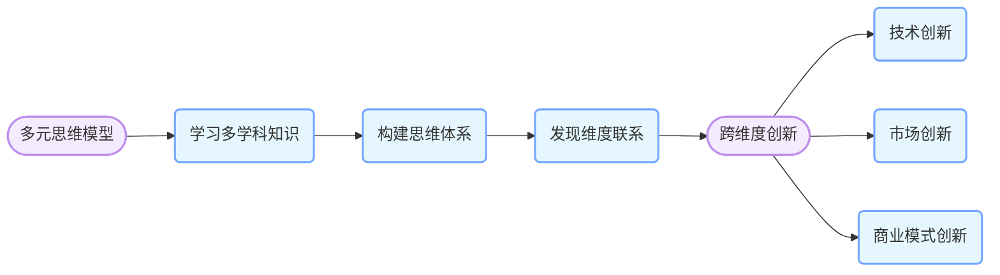

# 芒格的“多元思维模型”在跨维度创新中的运用

> 关键词：芒格、多元思维模型、跨维度创新、思维方式、创新方法

> 摘要：本文深入探讨了芒格的“多元思维模型”在跨维度创新中的运用。首先介绍了多元思维模型和跨维度创新的背景知识，包括其目的、预期读者等内容。接着阐述了核心概念与联系，通过文本示意图和 Mermaid 流程图展示其原理和架构。详细讲解了相关的核心算法原理及具体操作步骤，利用 Python 代码进行了示例。同时给出了数学模型和公式并进行举例说明。通过项目实战，展示了如何在实际中运用该思维模型进行跨维度创新，包括开发环境搭建、源代码实现与解读等。分析了其实际应用场景，推荐了相关的工具和资源，如学习资源、开发工具框架、论文著作等。最后总结了未来发展趋势与挑战，还提供了常见问题与解答以及扩展阅读和参考资料，旨在帮助读者全面理解和运用芒格的多元思维模型进行跨维度创新。

## 1. 背景介绍 
### 1.1 目的和范围
查理·芒格（Charlie Munger）是全球知名的投资家，他所倡导的“多元思维模型”对众多领域产生了深远影响。本文章的目的在于深入剖析芒格的“多元思维模型”，并探讨其在跨维度创新中的具体运用。范围涵盖了多元思维模型的理论基础、跨维度创新的概念，以及如何将两者结合以实现创新突破。通过实际案例和详细分析，帮助读者理解和掌握这一创新方法，提升在不同领域的创新能力。

### 1.2 预期读者
本文预期读者广泛，包括但不限于创业者、企业管理者、科研人员、投资者以及对创新思维和方法感兴趣的人士。创业者可以借助多元思维模型在激烈的市场竞争中找到独特的商业机会；企业管理者能够运用该思维模型优化企业战略，推动企业创新发展；科研人员可以从不同学科的角度思考问题，突破科研瓶颈；投资者可以更全面地评估投资项目，降低投资风险。对于对创新思维和方法感兴趣的人士，本文也能提供有价值的思考和启发。

### 1.3 文档结构概述
本文首先介绍背景知识，包括目的、预期读者和文档结构概述等内容。接着阐述核心概念与联系，通过文本示意图和 Mermaid 流程图展示多元思维模型与跨维度创新的原理和架构。然后详细讲解核心算法原理及具体操作步骤，利用 Python 代码进行示例。给出数学模型和公式并举例说明。通过项目实战展示实际应用，包括开发环境搭建、源代码实现与解读。分析实际应用场景，推荐相关工具和资源。最后总结未来发展趋势与挑战，提供常见问题与解答以及扩展阅读和参考资料。

### 1.4 术语表
#### 1.4.1 核心术语定义
- **多元思维模型**：芒格认为，一个人需要掌握多种学科的重要理论和方法，并将其融会贯通，形成一个相互联系的思维框架。通过这个框架，人们可以从多个角度看待问题，避免单一思维的局限性。
- **跨维度创新**：指突破传统的思维和行业边界，从不同的维度（如技术、市场、商业模式等）进行创新，创造出全新的产品、服务或商业模式。

#### 1.4.2 相关概念解释
- **学科融合**：将不同学科的知识、方法和理论相互结合，形成新的知识体系和研究方法。在多元思维模型中，学科融合是实现跨维度创新的重要途径。
- **创新生态系统**：由企业、科研机构、高校、政府等多种主体组成的生态系统，通过资源共享、协同创新等方式，促进创新的产生和发展。

#### 1.4.3 缩略词列表
目前本文中暂无缩略词。

## 2. 核心概念与联系 

### 多元思维模型原理
多元思维模型的核心在于广泛吸收不同学科的知识和方法，构建一个全面、系统的思维体系。芒格强调，要掌握重要学科的重要理论，如数学、物理学、生物学、心理学、经济学等。这些学科的理论和方法相互关联、相互影响，可以帮助我们更全面地理解和解决问题。

例如，在投资领域，我们不仅需要运用经济学的理论来分析市场趋势和企业价值，还需要运用心理学的知识来理解投资者的行为和心理。通过多元思维模型，我们可以避免只从单一学科的角度看待问题，从而做出更明智的决策。

### 跨维度创新原理
跨维度创新是一种突破传统思维和行业边界的创新方式。它通过整合不同维度的资源和要素，创造出全新的产品、服务或商业模式。跨维度创新可以从技术、市场、商业模式等多个维度进行。

例如，共享经济就是一种跨维度创新的商业模式。它通过整合互联网技术、闲置资源和市场需求，创造出了一种全新的经济模式。共享经济不仅改变了人们的消费方式，也对传统行业产生了巨大的冲击。

### 多元思维模型与跨维度创新的联系
多元思维模型为跨维度创新提供了理论基础和思维方法。通过多元思维模型，我们可以从不同学科的角度看待问题，发现不同维度之间的联系和机会，从而实现跨维度创新。

跨维度创新则是多元思维模型的实践应用。在跨维度创新的过程中，我们需要运用多元思维模型来分析问题、寻找解决方案，从而实现创新突破。

### 文本示意图
多元思维模型与跨维度创新的关系可以用以下文本示意图表示：

多元思维模型（数学、物理学、生物学、心理学、经济学等学科知识） -> 发现不同维度之间的联系和机会 -> 跨维度创新（技术创新、市场创新、商业模式创新等）

### Mermaid 流程图


## 3. 核心算法原理 & 具体操作步骤 

### 核心算法原理
多元思维模型在跨维度创新中的核心算法原理可以概括为以下几个步骤：

1. **知识获取**：广泛学习不同学科的重要理论和方法，包括数学、物理学、生物学、心理学、经济学等。可以通过阅读书籍、参加培训、与专家交流等方式获取知识。
2. **知识整合**：将获取的不同学科的知识进行整合，构建一个相互联系的思维体系。可以通过绘制思维导图、建立知识框架等方式进行知识整合。
3. **问题分析**：运用多元思维模型对问题进行分析，从不同学科的角度看待问题，发现问题的本质和潜在的解决方案。
4. **创新生成**：基于问题分析的结果，结合不同维度的资源和要素，生成创新的解决方案。可以通过头脑风暴、团队协作等方式进行创新生成。
5. **方案评估**：对生成的创新方案进行评估，从技术可行性、市场需求、商业价值等多个角度进行评估，选择最优方案。
6. **方案实施**：将选择的最优方案付诸实施，在实施过程中不断优化和调整方案。

### 具体操作步骤及 Python 代码示例
以下是一个简单的 Python 代码示例，演示了如何运用多元思维模型进行问题分析和创新生成。

```python
# 定义不同学科的知识模块
class MathKnowledge:
    def analyze(self, problem):
        # 运用数学方法分析问题
        print("运用数学方法分析问题：", problem)

class PhysicsKnowledge:
    def analyze(self, problem):
        # 运用物理学方法分析问题
        print("运用物理学方法分析问题：", problem)

class PsychologyKnowledge:
    def analyze(self, problem):
        # 运用心理学方法分析问题
        print("运用心理学方法分析问题：", problem)

# 定义多元思维模型类
class MultidisciplinaryThinkingModel:
    def __init__(self):
        self.knowledge_modules = [MathKnowledge(), PhysicsKnowledge(), PsychologyKnowledge()]

    def analyze_problem(self, problem):
        # 从不同学科的角度分析问题
        for module in self.knowledge_modules:
            module.analyze(problem)

    def generate_innovation(self, problem):
        # 生成创新方案
        print("基于多元思维模型生成创新方案：", problem)

# 主程序
if __name__ == "__main__":
    problem = "如何提高产品的用户满意度"
    model = MultidisciplinaryThinkingModel()
    model.analyze_problem(problem)
    model.generate_innovation(problem)
```

### 代码解释
1. **知识模块定义**：定义了三个不同学科的知识模块，分别是数学、物理学和心理学。每个模块都有一个 `analyze` 方法，用于从该学科的角度分析问题。
2. **多元思维模型类**：定义了一个 `MultidisciplinaryThinkingModel` 类，该类包含一个知识模块列表。`analyze_problem` 方法用于从不同学科的角度分析问题，`generate_innovation` 方法用于生成创新方案。
3. **主程序**：创建一个 `MultidisciplinaryThinkingModel` 对象，定义一个问题，调用 `analyze_problem` 方法从不同学科的角度分析问题，调用 `generate_innovation` 方法生成创新方案。

## 4. 数学模型和公式 & 详细讲解 & 举例说明 

### 数学模型
在多元思维模型和跨维度创新中，可以运用一些数学模型来辅助分析和决策。例如，决策树模型可以用于评估不同创新方案的优劣，线性回归模型可以用于预测市场需求等。

### 决策树模型
决策树是一种常用的分类和预测模型，它通过构建一个树形结构来表示决策过程。决策树的每个内部节点表示一个属性上的测试，每个分支表示一个测试输出，每个叶节点表示一个类别或值。

决策树的构建过程可以分为以下几个步骤：

1. **选择最优属性**：从所有属性中选择一个最优属性作为当前节点的测试属性。
2. **划分数据集**：根据测试属性的取值，将数据集划分为多个子集。
3. **递归构建子树**：对每个子集递归地构建子树，直到满足终止条件。

### 决策树模型公式
决策树的构建过程可以用以下公式表示：

设数据集为 $D$，属性集为 $A$，选择的最优属性为 $a$，属性 $a$ 的取值为 $v$，则划分后的子集为 $D_v$。

信息增益公式：

$$
Gain(D, a) = Ent(D) - \sum_{v \in Values(a)} \frac{|D_v|}{|D|} Ent(D_v)
$$

其中，$Ent(D)$ 表示数据集 $D$ 的信息熵，$Values(a)$ 表示属性 $a$ 的取值集合。

### 举例说明
假设有一个数据集，包含三个属性：天气、温度、湿度，以及一个类别标签：是否适合户外运动。数据集如下：

| 天气 | 温度 | 湿度 | 是否适合户外运动 |
| ---- | ---- | ---- | ---------------- |
| 晴天 | 高温 | 高湿度 | 否 |
| 晴天 | 高温 | 低湿度 | 是 |
| 阴天 | 中温 | 高湿度 | 是 |
| 阴天 | 低温 | 低湿度 | 是 |
| 雨天 | 低温 | 高湿度 | 否 |

我们可以使用决策树模型来预测是否适合户外运动。首先，计算每个属性的信息增益，选择信息增益最大的属性作为根节点。然后，根据该属性的取值划分数据集，递归地构建子树。

以下是使用 Python 的 `scikit-learn` 库实现决策树模型的代码示例：

```python
from sklearn import tree
import pandas as pd
from sklearn.preprocessing import LabelEncoder

# 定义数据集
data = {
    '天气': ['晴天', '晴天', '阴天', '阴天', '雨天'],
    '温度': ['高温', '高温', '中温', '低温', '低温'],
    '湿度': ['高湿度', '低湿度', '高湿度', '低湿度', '高湿度'],
    '是否适合户外运动': ['否', '是', '是', '是', '否']
}

df = pd.DataFrame(data)

# 对分类特征进行编码
le_weather = LabelEncoder()
le_temperature = LabelEncoder()
le_humidity = LabelEncoder()
le_outdoor = LabelEncoder()

df['天气'] = le_weather.fit_transform(df['天气'])
df['温度'] = le_temperature.fit_transform(df['温度'])
df['湿度'] = le_humidity.fit_transform(df['湿度'])
df['是否适合户外运动'] = le_outdoor.fit_transform(df['是否适合户外运动'])

# 划分特征和标签
X = df[['天气', '温度', '湿度']]
y = df['是否适合户外运动']

# 创建决策树模型
clf = tree.DecisionTreeClassifier()
clf = clf.fit(X, y)

# 预测新数据
new_data = [[le_weather.transform(['晴天'])[0], le_temperature.transform(['高温'])[0], le_humidity.transform(['高湿度'])[0]]]
prediction = clf.predict(new_data)
print("预测结果：", le_outdoor.inverse_transform(prediction)[0])
```

### 代码解释
1. **数据预处理**：使用 `pandas` 库读取数据集，并使用 `LabelEncoder` 对分类特征进行编码。
2. **划分特征和标签**：将数据集划分为特征矩阵 $X$ 和标签向量 $y$。
3. **创建决策树模型**：使用 `DecisionTreeClassifier` 创建决策树模型，并使用 `fit` 方法训练模型。
4. **预测新数据**：使用训练好的模型对新数据进行预测，并使用 `inverse_transform` 方法将预测结果转换为原始标签。

## 5. 项目实战：代码实际案例和详细解释说明 

### 5.1  开发环境搭建
在进行项目实战之前，需要搭建相应的开发环境。以下是搭建开发环境的步骤：

1. **安装 Python**：从 Python 官方网站（https://www.python.org/downloads/）下载并安装 Python 3.x 版本。
2. **安装开发工具**：推荐使用 PyCharm 或 Visual Studio Code 作为开发工具。可以从官方网站下载并安装相应的开发工具。
3. **安装必要的库**：在命令行中使用 `pip` 命令安装必要的库，如 `pandas`、`scikit-learn` 等。

```sh
pip install pandas scikit-learn
```

### 5.2  源代码详细实现和代码解读
以下是一个使用多元思维模型进行跨维度创新的项目实战案例：智能健康监测系统。

#### 项目背景
随着人们对健康的关注度不断提高，智能健康监测系统越来越受到人们的青睐。传统的健康监测系统主要关注生理指标的监测，如心率、血压等。而本项目旨在运用多元思维模型，从医学、心理学、计算机科学等多个学科的角度出发，开发一个更加全面、智能的健康监测系统。

#### 源代码实现
```python
import pandas as pd
from sklearn.linear_model import LinearRegression
from sklearn.preprocessing import StandardScaler
import matplotlib.pyplot as plt

# 读取数据集
data = pd.read_csv('health_data.csv')

# 数据预处理
X = data[['年龄', '体重', '运动量']]
y = data['健康指数']

# 数据标准化
scaler = StandardScaler()
X_scaled = scaler.fit_transform(X)

# 创建线性回归模型
model = LinearRegression()
model.fit(X_scaled, y)

# 预测新数据
new_data = [[30, 70, 5]]
new_data_scaled = scaler.transform(new_data)
prediction = model.predict(new_data_scaled)
print("预测的健康指数：", prediction[0])

# 可视化结果
plt.scatter(X['年龄'], y, color='blue', label='实际数据')
plt.plot(X['年龄'], model.predict(X_scaled), color='red', linewidth=2, label='预测数据')
plt.xlabel('年龄')
plt.ylabel('健康指数')
plt.title('智能健康监测系统')
plt.legend()
plt.show()
```

#### 代码解读
1. **数据读取**：使用 `pandas` 库读取存储健康数据的 CSV 文件。
2. **数据预处理**：提取特征矩阵 $X$ 和标签向量 $y$，并使用 `StandardScaler` 对特征矩阵进行标准化处理。
3. **模型训练**：创建线性回归模型，并使用训练数据对模型进行训练。
4. **预测新数据**：对新数据进行标准化处理，并使用训练好的模型进行预测。
5. **可视化结果**：使用 `matplotlib` 库绘制实际数据和预测数据的散点图和折线图，直观地展示模型的预测效果。

### 5.3  代码解读与分析
#### 多元思维模型的应用
在这个项目中，我们运用了多元思维模型，从医学、心理学、计算机科学等多个学科的角度出发。医学知识帮助我们理解健康指标的含义和影响因素；心理学知识可以帮助我们考虑用户的心理状态对健康的影响；计算机科学知识则用于实现数据处理、模型训练和预测等功能。

#### 模型选择与优化
选择线性回归模型是因为它简单易懂，并且在处理线性关系的数据时具有较好的效果。在实际应用中，可以根据数据的特点和需求选择更合适的模型，如决策树、神经网络等。同时，可以对模型进行优化，如调整模型参数、增加特征等，以