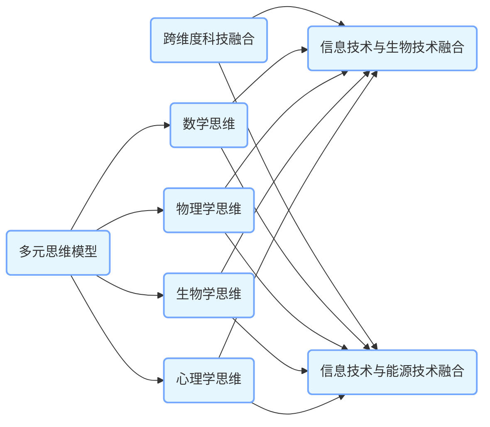

# 芒格的“多元思维模型”在跨维度科技融合中的运用

> 关键词：多元思维模型、跨维度科技融合、科技应用、思维方法、科技创新

> 摘要：本文深入探讨了芒格的“多元思维模型”在跨维度科技融合中的运用。首先介绍了背景信息，包括目的、预期读者、文档结构和相关术语。接着阐述了核心概念与联系，通过示意图和流程图呈现。详细讲解了核心算法原理和操作步骤，结合Python代码。给出了相关数学模型和公式，并举例说明。通过项目实战展示代码案例及解读。分析了实际应用场景，推荐了学习、开发工具和相关论文著作。最后总结了未来发展趋势与挑战，提供常见问题解答和扩展阅读资料。旨在帮助读者理解如何运用多元思维模型推动跨维度科技融合，促进科技创新。

## 1. 背景介绍 
### 1.1 目的和范围
本文章的目的在于深入探究查理·芒格所提出的“多元思维模型”在跨维度科技融合领域的具体运用。随着科技的飞速发展，不同领域的科技相互交织、融合的趋势愈发明显。跨维度科技融合不仅涉及到技术层面的整合，更需要创新的思维方式来推动。芒格的多元思维模型为我们提供了一种综合性的思考框架，能够帮助我们从多个角度审视科技融合中的问题和机遇。

本文的范围将涵盖多元思维模型的基本概念、在跨维度科技融合中的核心算法原理、相关数学模型，还会通过具体的项目实战案例进行详细分析，探讨其在实际应用场景中的表现，最后给出学习资源、开发工具以及相关论文著作的推荐。

### 1.2 预期读者
本文预期读者主要包括科技领域的从业者，如程序员、软件架构师、CTO等，他们在日常工作中面临着科技融合的挑战，需要新的思维方式来解决问题。同时，对科技创新和思维方法感兴趣的研究者、学生以及创业者也能从本文中获得启发。无论是希望在跨维度科技融合中寻找突破点的专业人士，还是对科技发展趋势有深入了解需求的人群，都能从本文的内容中受益。

### 1.3 文档结构概述
本文将按照以下结构进行阐述：首先介绍背景信息，让读者了解文章的目的、预期读者和文档整体结构。接着详细讲解核心概念与联系，通过文本示意图和Mermaid流程图直观展示多元思维模型与跨维度科技融合的关系。在核心算法原理部分，使用Python源代码详细阐述具体的操作步骤。数学模型和公式部分会给出相关理论支持，并举例说明。项目实战部分将展示实际的代码案例，并进行详细的解读和分析。然后探讨实际应用场景，介绍多元思维模型在不同领域的应用。之后推荐学习资源、开发工具和相关论文著作。最后总结未来发展趋势与挑战，提供常见问题解答和扩展阅读资料。

### 1.4 术语表
#### 1.4.1 核心术语定义
- **多元思维模型**：由查理·芒格提出，指的是整合多个不同学科（如数学、物理学、生物学、心理学等）的思维方式和原理，形成一个综合性的思维框架，用于更全面、深入地分析和解决问题。
- **跨维度科技融合**：将不同领域、不同层次的科技进行整合和创新，打破传统科技领域的界限，创造出具有新功能、新特性的科技产品或解决方案。

#### 1.4.2 相关概念解释
- **科技融合**：通常指将两种或多种不同的科技进行结合，以实现更强大的功能或更好的性能。而跨维度科技融合在此基础上，更强调跨越不同维度的科技整合，维度可以是技术层面、应用场景层面、行业层面等。
- **思维模型**：是一种对事物进行抽象和简化的思考方式，它能够帮助我们理解事物的本质和规律，预测事物的发展趋势。

#### 1.4.3 缩略词列表
本文在撰写过程中暂不涉及缩略词。

## 2. 核心概念与联系 

### 核心概念原理
芒格的多元思维模型强调从多个不同学科的角度去看待问题，因为现实世界中的问题往往是复杂的，单一学科的思维方式可能无法全面、准确地解决问题。例如，在跨维度科技融合中，一个涉及到智能医疗设备的项目，不仅需要计算机科学的知识来实现设备的数据处理和算法运行，还需要生物学知识来理解人体的生理结构和疾病机制，以及心理学知识来考虑用户的使用体验和接受程度。

通过整合不同学科的思维模型，我们可以形成一个更加全面、立体的视角，发现不同科技领域之间潜在的联系和协同效应。这有助于我们在跨维度科技融合中找到创新的切入点，避免陷入单一思维的局限。

### 架构的文本示意图
```plaintext
多元思维模型
|-- 数学思维模型
|   |-- 数据分析
|   |-- 优化算法
|-- 物理学思维模型
|   |-- 能量守恒
|   |-- 信号传播
|-- 生物学思维模型
|   |-- 进化原理
|   |-- 生态系统
|-- 心理学思维模型
|   |-- 用户行为分析
|   |-- 认知偏差
|--...

跨维度科技融合
|-- 信息技术与生物技术融合
|   |-- 智能医疗设备
|   |-- 基因数据分析
|-- 信息技术与能源技术融合
|   |-- 智能电网
|   |-- 能源管理系统
|--...

多元思维模型与跨维度科技融合的联系：多元思维模型为跨维度科技融合提供了思考框架和方法，帮助我们从多个学科角度分析和解决科技融合中的问题，促进不同科技领域的协同创新。
```

### Mermaid流程图


## 3. 核心算法原理 & 具体操作步骤 

### 核心算法原理
在跨维度科技融合中运用多元思维模型的核心算法原理可以类比为一个多维度的搜索和匹配过程。我们可以将不同学科的知识和方法看作是不同维度的信息空间，而跨维度科技融合的问题则是在这些信息空间中寻找合适的组合和关联。

例如，我们可以将每个学科的知识表示为一个向量空间，向量的每个维度代表该学科的一个特定概念或方法。当我们面对一个跨维度科技融合的问题时，我们可以通过计算不同向量之间的相似度或相关性，来找到可能的解决方案。

### 具体操作步骤
以下是运用多元思维模型进行跨维度科技融合的具体操作步骤：

#### 步骤1：问题定义
明确跨维度科技融合的具体问题，例如开发一款新型的智能家居系统，需要融合信息技术、传感器技术和能源管理技术。

#### 步骤2：学科知识收集
收集与问题相关的不同学科的知识和方法。对于智能家居系统的例子，我们需要收集计算机科学中的人工智能算法、传感器技术中的各类传感器原理、能源管理中的节能策略等知识。

#### 步骤3：知识向量表示
将收集到的知识表示为向量形式。例如，对于计算机科学中的人工智能算法，可以将其不同的参数和性能指标作为向量的维度。

#### 步骤4：相似度计算
计算不同学科知识向量之间的相似度。可以使用余弦相似度等方法来衡量向量之间的相似程度。

#### 步骤5：组合筛选
根据相似度计算的结果，筛选出可能的知识组合。对于相似度较高的组合，进一步分析其在解决问题中的可行性。

#### 步骤6：方案验证
对筛选出的知识组合进行实验和验证，评估其在实际应用中的效果。如果效果不理想，则返回步骤2，重新收集知识或调整向量表示方法。

### Python源代码实现
```python
import numpy as np

# 步骤3：知识向量表示
# 假设我们有两个学科的知识，分别用向量表示
knowledge_1 = np.array([1, 2, 3, 4])  # 学科1的知识向量
knowledge_2 = np.array([2, 3, 4, 5])  # 学科2的知识向量

# 步骤4：相似度计算
def cosine_similarity(vector1, vector2):
    dot_product = np.dot(vector1, vector2)
    norm_vector1 = np.linalg.norm(vector1)
    norm_vector2 = np.linalg.norm(vector2)
    similarity = dot_product / (norm_vector1 * norm_vector2)
    return similarity

similarity = cosine_similarity(knowledge_1, knowledge_2)
print(f"两个学科知识向量的余弦相似度为: {similarity}")

# 步骤5：组合筛选
# 假设相似度阈值为0.8
threshold = 0.8
if similarity > threshold:
    print("这两个知识组合可能是可行的，需要进一步分析。")
else:
    print("这两个知识组合的相似度较低，需要重新考虑。")
```

## 4. 数学模型和公式 & 详细讲解 & 举例说明 

### 数学模型
在跨维度科技融合中运用多元思维模型的数学模型可以基于向量空间模型。假设我们有 $n$ 个学科的知识，每个学科的知识可以表示为一个 $m$ 维的向量 $\mathbf{v}_i=(v_{i1}, v_{i2}, \cdots, v_{im})$，其中 $i = 1, 2, \cdots, n$。

我们的目标是找到不同学科知识向量之间的相关性，以确定可能的融合方案。可以使用向量的内积和范数来计算向量之间的相似度。

### 数学公式
#### 向量内积
两个向量 $\mathbf{v}_1$ 和 $\mathbf{v}_2$ 的内积定义为：
$$\mathbf{v}_1 \cdot \mathbf{v}_2 = \sum_{j = 1}^{m} v_{1j} v_{2j}$$

#### 向量范数
向量 $\mathbf{v}$ 的 $L_2$ 范数（欧几里得范数）定义为：
$$\|\mathbf{v}\|_2 = \sqrt{\sum_{j = 1}^{m} v_{j}^2}$$

#### 余弦相似度
两个向量 $\mathbf{v}_1$ 和 $\mathbf{v}_2$ 的余弦相似度定义为：
$$\text{cosine similarity} = \frac{\mathbf{v}_1 \cdot \mathbf{v}_2}{\|\mathbf{v}_1\|_2 \|\mathbf{v}_2\|_2}$$

### 详细讲解
向量内积反映了两个向量在方向上的一致性程度。如果两个向量的内积越大，说明它们在方向上越接近。向量范数则表示向量的长度。余弦相似度通过将内积除以两个向量的范数的乘积，消除了向量长度的影响，只考虑向量的方向。余弦相似度的取值范围在 $[-1, 1]$ 之间，值越接近 1 表示两个向量越相似，值越接近 -1 表示两个向量越相反。

### 举例说明
假设我们有两个学科的知识向量：
$\mathbf{v}_1=(1, 2, 3)$ 和 $\mathbf{v}_2=(2, 4, 6)$

首先计算向量内积：
$$\mathbf{v}_1 \cdot \mathbf{v}_2 = 1\times2 + 2\times4 + 3\times6 = 2 + 8 + 18 = 28$$

然后计算向量范数：
$$\|\mathbf{v}_1\|_2 = \sqrt{1^2 + 2^2 + 3^2} = \sqrt{1 + 4 + 9} = \sqrt{14}$$
$$\|\mathbf{v}_2\|_2 = \sqrt{2^2 + 4^2 + 6^2} = \sqrt{4 + 16 + 36} = \sqrt{56} = 2\sqrt{14}$$

最后计算余弦相似度：
$$\text{cosine similarity} = \frac{28}{\sqrt{14} \times 2\sqrt{14}} = \frac{28}{2\times14} = 1$$

这说明两个向量完全相似，在跨维度科技融合中，这两个学科的知识可能具有很强的协同效应，可以进一步考虑它们的融合方案。

## 5. 项目实战：代码实际案例和详细解释说明 

### 5.1  开发环境搭建
为了实现一个跨维度科技融合的项目，我们以开发一个基于人工智能和物联网的智能农业系统为例。以下是开发环境的搭建步骤：

#### 硬件环境
- **传感器节点**：选择适合农业环境的传感器，如土壤湿度传感器、光照传感器、温度传感器等。
- **网关设备**：用于收集传感器节点的数据，并将数据传输到云端服务器。可以选择树莓派等开发板作为网关设备。
- **服务器**：用于存储和处理传感器数据，以及运行人工智能算法。可以选择云服务器，如阿里云、腾讯云等。

#### 软件环境
- **操作系统**：在网关设备上安装Linux操作系统，如Raspbian。在服务器上安装合适的操作系统，如Ubuntu Server。
- **编程语言**：选择Python作为主要的编程语言，因为Python具有丰富的库和工具，适合数据处理和人工智能开发。
- **开发框架**：使用Flask作为Web开发框架，用于搭建服务器端的接口。使用TensorFlow或PyTorch作为人工智能开发框架，用于训练和部署机器学习模型。

### 5.2  源代码详细实现和代码解读

#### 传感器数据采集代码
```python
import time
import random

# 模拟传感器数据采集
def read_soil_moisture():
    # 模拟土壤湿度数据，范围在0-100之间
    return random.randint(0, 100)

def read_light_intensity():
    # 模拟光照强度数据，范围在0-1000之间
    return random.randint(0, 1000)

def read_temperature():
    # 模拟温度数据，范围在0-50之间
    return random.randint(0, 50)

while True:
    soil_moisture = read_soil_moisture()
    light_intensity = read_light_intensity()
    temperature = read_temperature()
    print(f"土壤湿度: {soil_moisture}%，光照强度: {light_intensity}lux，温度: {temperature}°C")
    time.sleep(5)  # 每5秒采集一次数据
```
代码解读：这段代码模拟了传感器数据的采集过程。定义了三个函数分别用于读取土壤湿度、光照强度和温度数据。使用`random.randint`函数生成随机数据来模拟传感器的实际输出。在主循环中，每隔5秒采集一次数据并打印出来。

#### 服务器端数据接收和处理代码
```python
from flask import Flask, request
import json

app = Flask(__name__)

# 存储传感器数据的列表
sensor_data = []

@app.route('/sensor-data', methods=['POST'])
def receive_sensor_data():
    data = request.get_json()
    sensor_data.append(data)
    print(f"收到传感器数据: {data}")
    return json.dumps({'status': 'success'})

if __name__ == '__main__':
    app.run(host='0.0.0.0', port=5000)
```
代码解读：这段代码使用Flask框架搭建了一个简单的Web服务器，用于接收传感器数据。定义了一个路由`/sensor-data`，当客户端发送POST请求时，服务器将请求中的JSON数据添加到`sensor_data`列表中，并返回一个成功的响应。

#### 人工智能模型训练代码
```python
import numpy as np
from sklearn.linear_model import LinearRegression

# 模拟训练数据
X = np.array([[1, 2], [2, 3], [3, 4], [4, 5]])  # 输入特征
y = np.array([3, 5, 7, 9])  # 目标值

# 创建线性回归模型
model = LinearRegression()

# 训练模型
model.fit(X, y)

# 预测新数据
new_X = np.array([[5, 6]])
prediction = model.predict(new_X)
print(f"预测结果: {prediction}")
```
代码解读：这段代码使用`sklearn`库中的`LinearRegression`模型进行线性回归训练。首先定义了训练数据`X`和`y`，然后创建了线性回归模型并进行训练。最后使用训练好的模型对新数据进行预测并打印预测结果。

### 5.3  代码解读与分析
通过以上代码，我们实现了一个简单的智能农业系统的基本功能。传感器数据采集代码模拟了传感器的工作过程，将采集到的数据发送到服务器。服务器端代码负责接收和存储传感器数据。人工智能模型训练代码展示了如何使用机器学习模型对数据进行分析和预测。

在这个项目中，我们运用了多元思维模型。从物联网的角度来看，我们需要了解传感器的工作原理和数据传输协议，确保传感器能够准确地采集和传输数据。从人工智能的角度来看，我们需要选择合适的机器学习模型，并对数据进行预处理和训练，以实现对农业生产的智能决策。同时，从农业科学的角度来看，我们需要了解农作物的生长环境和需求，以便更好地解释和应用传感器数据和预测结果。

## 6. 实际应用场景 
### 智能医疗领域
在智能医疗领域，跨维度科技融合可以将信息技术、生物技术和医学知识相结合。例如，通过可穿戴设备收集患者的生理数据（如心率、血压、睡眠质量等），运用人工智能算法对这些数据进行分析和预测，帮助医生提前发现潜在的健康问题。同时，结合基因测序技术，了解患者的基因信息，为个性化医疗提供依据。多元思维模型在这个场景中发挥着重要作用，需要综合运用生物学、医学、计算机科学等多个学科的知识，从不同角度分析患者的健康状况，制定更精准的治疗方案。

### 智能交通领域
智能交通领域涉及到信息技术、电子工程、交通工程等多个学科的融合。例如，自动驾驶技术需要结合传感器技术（如激光雷达、摄像头等）、人工智能算法（如目标检测、路径规划等）和交通规则知识，实现车辆的自主行驶。同时，智能交通系统还需要考虑交通流量的优化、能源的高效利用等问题。多元思维模型可以帮助我们从不同学科的角度分析交通系统中的问题，提出创新的解决方案，如智能交通信号控制、共享出行模式等。

### 智能家居领域
智能家居领域将信息技术、传感器技术、能源管理技术等融合在一起。通过安装各种传感器（如门窗传感器、温度传感器、光照传感器等），实现对家居环境的实时监测和控制。运用人工智能算法，根据用户的习惯和环境条件自动调节家居设备的运行状态，提高家居的舒适度和能源利用效率。在这个场景中，需要运用多元思维模型，综合考虑用户的需求、技术的可行性和能源的可持续性等因素，设计出更加智能、便捷的智能家居系统。

## 7. 工具和资源推荐
### 7.1 学习资源推荐
#### 7.1.1 书籍推荐
- 《穷查理宝典：查理·芒格的智慧箴言录》：这是了解芒格多元思维模型的经典书籍，书中详细介绍了芒格的投资理念和思维方法，对跨维度科技融合的思维培养具有重要的启示作用。
- 《人工智能：一种现代方法》：全面介绍了人工智能的基本概念、算法和应用，是学习人工智能技术的经典教材。
- 《物联网：技术、应用与创新》：系统阐述了物联网的技术原理、应用场景和发展趋势，对于理解跨维度科技融合在物联网领域的应用具有重要的参考价值。

#### 7.1.2 在线课程
- Coursera上的“Machine Learning”课程：由斯坦福大学的Andrew Ng教授讲授，是学习机器学习的经典在线课程，涵盖了机器学习的基本算法和应用。
- edX上的“Artificial Intelligence Nanodegree”课程：提供了全面的人工智能学习路径，包括深度学习、自然语言处理等多个领域的知识和实践项目。
- Udemy上的“IoT (Internet of Things) - The Complete Developer's Guide”课程：详细介绍了物联网的开发流程和技术，适合初学者快速入门。

#### 7.1.3 技术博客和网站
- Medium：是一个汇聚了众多科技领域专家和爱好者的博客平台，上面有很多关于跨维度科技融合、人工智能、物联网等方面的优质文章。
- arXiv：是一个预印本服务器，提供了大量的学术论文，涵盖了计算机科学、物理学、生物学等多个学科，对于了解最新的科技研究成果非常有帮助。
- Hacker News：是一个科技新闻和社区网站，上面有很多关于科技行业的最新动态和技术讨论，能够帮助我们了解行业的发展趋势和创新方向。

### 7.2 开发工具框架推荐
#### 7.2.1 IDE和编辑器
- PyCharm：是一款专门为Python开发设计的集成开发环境（IDE），具有强大的代码编辑、调试和自动补全功能，适合开发人工智能和物联网项目。
- Visual Studio Code：是一款轻量级的代码编辑器，支持多种编程语言和插件扩展，具有丰富的开发工具和社区资源，广泛应用于各种软件开发项目。
- Jupyter Notebook：是一个交互式的编程环境，适合进行数据探索、模型训练和结果展示，在人工智能和数据分析领域应用广泛。

#### 7.2.2 调试和性能分析工具
- Py-Spy：是一个Python性能分析工具，可以实时监测Python程序的CPU使用率和函数调用情况，帮助我们找出程序中的性能瓶颈。
- TensorBoard：是TensorFlow框架自带的可视化工具，可以用于可视化模型的训练过程、损失函数曲线和网络结构等，方便我们对模型进行调试和优化。
- Wireshark：是一个网络协议分析工具，可以捕获和分析网络数据包，帮助我们调试物联网设备之间的数据传输问题。

#### 7.2.3 相关框架和库
- TensorFlow：是一个开源的人工智能框架，提供了丰富的机器学习和深度学习算法库，支持分布式训练和模型部署，广泛应用于图像识别、自然语言处理等领域。
- PyTorch：是另一个流行的人工智能框架，具有动态计算图和简洁的API，适合快速开发和实验深度学习模型。
- Flask：是一个轻量级的Python Web开发框架，易于上手和扩展，适合搭建物联网和人工智能应用的服务器端接口。

### 7.3 相关论文著作推荐
#### 7.3.1 经典论文
- “A Logical Calculus of the Ideas Immanent in Nervous Activity” by Warren S. McCulloch and Walter Pitts：这篇论文提出了人工神经网络的基本模型，为人工智能的发展奠定了基础。
- “The Hedonic Treadmill: Revising the Adaptation Theory of Well-Being” by Brickman and Campbell：虽然这篇论文主要涉及心理学领域，但它所提出的“享乐跑步机”理论对于理解用户在科技产品中的心理需求和满意度具有重要的启示作用，在跨维度科技融合中可以从心理学角度进行思考。
- “The Internet of Things: A Survey” by Atzori, Iera, and Morabito：全面介绍了物联网的概念、技术架构和应用场景，是物联网领域的经典综述论文。

#### 7.3.2 最新研究成果
- 关注ACM、IEEE等计算机科学领域的顶级会议和期刊，如ACM SIGKDD（知识发现与数据挖掘会议）、IEEE Transactions on Pattern Analysis and Machine Intelligence（模式分析与机器智能汇刊）等，这些会议和期刊上发表了很多关于人工智能、物联网等领域的最新研究成果。
- 关注各大高校和科研机构的研究团队，他们通常会在自己的网站上发布最新的研究论文和项目成果。

#### 7.3.3 应用案例分析
- 《AI Superpowers: China, Silicon Valley, and the New World Order》 by Kai-Fu Lee：书中分析了人工智能在不同行业的应用案例，以及中美两国在人工智能领域的发展现状和竞争态势，对于了解人工智能在跨维度科技融合中的应用具有重要的参考价值。
- 《The Second Machine Age: Work, Progress, and Prosperity in a Time of Brilliant Technologies》 by Erik Brynjolfsson and Andrew McAfee：探讨了科技进步对社会和经济的影响，通过多个实际案例分析了信息技术、人工智能等新技术在不同领域的应用和创新，为跨维度科技融合的实践提供了有益的借鉴。

## 8. 总结：未来发展趋势与挑战
### 未来发展趋势
#### 深度融合趋势
未来，跨维度科技融合将朝着更加深度的方向发展。不同学科的技术将不再是简单的叠加，而是在底层原理和算法层面进行深度融合。例如，人工智能与量子计算的融合，将为解决复杂的科学问题和优化问题提供更强大的计算能力。

#### 行业跨界趋势
跨维度科技融合将打破传统行业的界限，催生更多的跨界行业。例如，医疗与金融的融合，可能会出现基于健康数据的保险产品和金融服务；农业与电商的融合，将实现农产品的精准营销和供应链优化。

#### 智能化趋势
随着人工智能技术的不断发展，跨维度科技融合的产物将更加智能化。智能机器人、智能城市、智能医疗等领域将得到更广泛的应用和发展，为人们的生活和工作带来更多的便利和创新。

### 挑战
#### 知识融合难度大
跨维度科技融合需要综合运用多个学科的知识，而不同学科的知识体系和思维方式差异较大，知识融合的难度较高。例如，计算机科学家和生物学家在交流和合作时，可能会面临术语不统一、思维方式不同等问题，需要花费更多的时间和精力来进行沟通和协调。

#### 技术标准不统一
不同领域的技术标准和规范存在差异，这给跨维度科技融合带来了一定的挑战。例如，在物联网领域，不同厂商的传感器和设备可能采用不同的通信协议和数据格式，导致数据的共享和交互困难。需要建立统一的技术标准和规范，促进跨维度科技融合的发展。

#### 伦理和法律问题
跨维度科技融合的发展也带来了一系列的伦理和法律问题。例如，人工智能的决策过程可能不透明，导致决策结果的公正性和可解释性受到质疑；生物科技的发展可能会引发基因编辑、克隆等伦理争议。需要建立相应的伦理和法律框架，规范跨维度科技融合的发展。

## 9. 附录：常见问题与解答
### 问题1：如何学习和掌握多元思维模型？
解答：学习和掌握多元思维模型需要从多个方面入手。首先，要广泛阅读不同学科的书籍和文献，了解各个学科的基本概念、原理和方法。其次，要注重实践，将不同学科的知识应用到实际问题的解决中，通过实践来加深对多元思维模型的理解和运用。此外，还可以参加相关的培训课程和研讨会，与其他学习者和专家进行交流和分享。

### 问题2：跨维度科技融合对人才的要求有哪些？
解答：跨维度科技融合对人才的要求较高，需要具备多学科的知识和技能。首先，要掌握相关学科的基础知识，如计算机科学、物理学、生物学等。其次，要具备创新思维和解决问题的能力，能够从不同学科的角度分析和解决问题。此外，还需要具备良好的沟通和团队合作能力，能够与不同学科背景的人员进行有效的沟通和协作。

### 问题3：在跨维度科技融合项目中，如何选择合适的技术和方法？
解答：在选择合适的技术和方法时，需要综合考虑多个因素。首先，要明确项目的目标和需求，根据项目的具体情况选择最适合的技术和方法。其次，要考虑技术的可行性和成熟度，选择已经经过实践验证的技术和方法。此外，还要考虑技术的成本和效益，选择能够在满足项目需求的前提下，实现成本效益最大化的技术和方法。

## 10. 扩展阅读 & 参考资料
### 扩展阅读
- 《人类简史：从动物到上帝》 by Yuval Noah Harari：这本书从人类进化的角度探讨了人类的发展历程和未来趋势，对于理解科技发展对人类社会的影响具有重要的启示作用。
- 《创新者的窘境》 by Clayton M. Christensen：书中提出了“颠覆性创新”的概念，分析了企业在面对技术变革时的困境和应对策略，对于跨维度科技融合中的创新管理具有重要的参考价值。

### 参考资料
- 《穷查理宝典：查理·芒格的智慧箴言录》，彼得·考夫曼编著，李继宏译，中信出版社，2016年。
- 《人工智能：一种现代方法》（第3版），Stuart Russell、Peter Norvig著，殷建平、祝恩等译，清华大学出版社，2013年。
- 《物联网：技术、应用与创新》，胡向东、唐晓庆编著，电子工业出版社，2017年。

作者：AI天才研究院/AI Genius Institute & 禅与计算机程序设计艺术 /Zen And The Art of Computer Programming