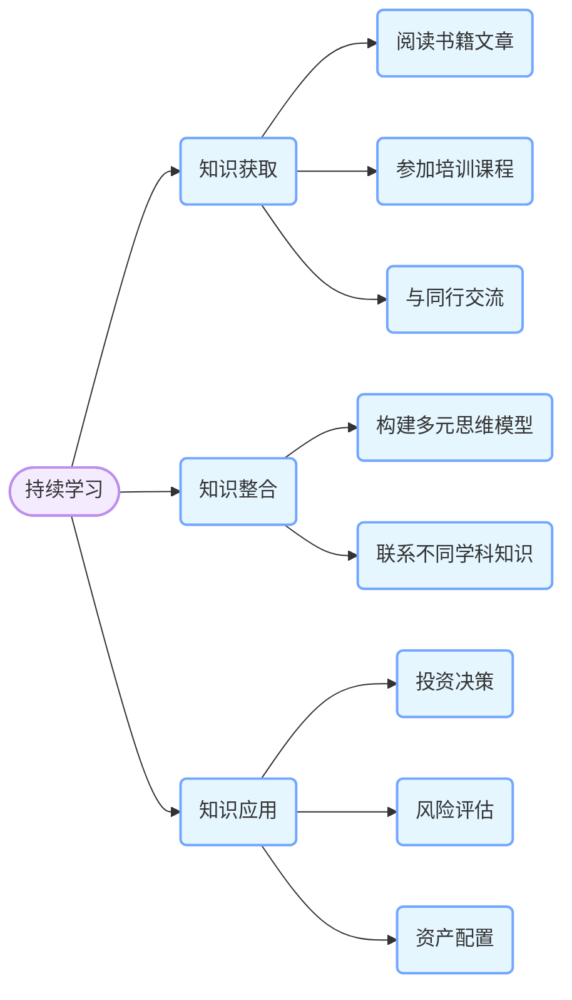

# 芒格的"学习机器"理念：持续学习在投资中的重要性

> 关键词：芒格、学习机器理念、持续学习、投资、重要性

> 摘要：本文深入探讨了芒格的“学习机器”理念，剖析了持续学习在投资领域的重要意义。通过介绍背景知识，阐述核心概念，分析核心算法原理（以模拟持续学习在投资决策中的运用为例），结合数学模型和公式，给出项目实战案例，探讨实际应用场景，推荐相关工具和资源，最后总结未来发展趋势与挑战，并对常见问题进行解答。旨在帮助投资者理解持续学习的价值，掌握通过持续学习提升投资能力的方法。

## 1. 背景介绍 
### 1.1 目的和范围
本文的目的在于全面解析芒格的“学习机器”理念，并详细阐述持续学习在投资过程中的重要性。范围涵盖了对该理念的理论分析、投资实践中的应用、相关工具和资源的推荐，以及对未来发展趋势的展望。通过深入探讨，帮助投资者认识到持续学习对于投资成功的关键作用，并为他们提供具体的学习方法和思路。

### 1.2 预期读者
本文预期读者主要包括对投资感兴趣的个人投资者、金融从业者、投资领域的研究人员以及希望提升自身知识和技能的学习者。无论你是投资新手还是有一定经验的专业人士，都能从本文中获得有价值的信息和启发。

### 1.3 文档结构概述
本文将按照以下结构展开：首先介绍背景知识，包括目的、预期读者和文档结构概述以及相关术语表；接着阐述核心概念与联系，通过文本示意图和 Mermaid 流程图展示；然后详细讲解核心算法原理和具体操作步骤，使用 Python 源代码进行说明；再介绍数学模型和公式，并举例说明；之后通过项目实战给出代码实际案例和详细解释；探讨实际应用场景；推荐相关的工具和资源；最后总结未来发展趋势与挑战，解答常见问题，并提供扩展阅读和参考资料。

### 1.4 术语表
#### 1.4.1 核心术语定义
- **学习机器理念**：由查理·芒格提出，强调个人应像一台高效的学习机器一样，不断获取新知识、更新认知，并将所学应用于实际决策中，以适应不断变化的环境。
- **持续学习**：指个体在整个生命周期内，持续不断地进行知识获取、技能提升和能力发展的过程，不局限于特定的时间和空间。
- **投资**：指投资者为了在未来获得收益，将资金投入到各种资产（如股票、债券、基金、房地产等）中的经济行为。

#### 1.4.2 相关概念解释
- **多元思维模型**：芒格倡导的一种思维方式，即通过学习多个不同学科（如数学、物理学、生物学、心理学等）的重要理论和方法，构建一个综合的思维框架，以便从多个角度分析和解决问题。
- **价值投资**：一种投资策略，强调通过分析企业的内在价值，寻找被低估的股票，并长期持有，以获得企业成长带来的收益。

#### 1.4.3 缩略词列表
- **ROE**：Return on Equity，净资产收益率，衡量企业盈利能力的重要指标。
- **PE**：Price-to-Earnings Ratio，市盈率，反映股票价格与每股收益之间的关系。

## 2. 核心概念与联系 

### 核心概念原理
芒格的“学习机器”理念基于一个简单而深刻的认识：世界是不断变化的，投资环境也在持续演变。为了在投资中取得成功，投资者需要不断学习新知识、掌握新技能，以适应这种变化。持续学习不仅仅是获取信息，更重要的是将所学知识融会贯通，形成多元思维模型，从而能够从不同角度分析投资问题，做出更明智的决策。

例如，在分析一家公司时，投资者不仅需要了解财务报表等基本信息，还需要运用经济学、管理学、心理学等多学科知识，评估公司的竞争力、管理层能力、市场前景等因素。通过持续学习，投资者可以不断拓展自己的知识边界，提高对投资机会的敏感度和判断力。

### 架构的文本示意图
```plaintext
持续学习
|
|--知识获取
|   |--阅读书籍、文章
|   |--参加培训课程
|   |--与同行交流
|
|--知识整合
|   |--构建多元思维模型
|   |--将不同学科知识联系起来
|
|--知识应用
|   |--投资决策
|   |--风险评估
|   |--资产配置
```

### Mermaid 流程图


## 3. 核心算法原理 & 具体操作步骤 

### 核心算法原理
我们可以将持续学习在投资中的应用抽象为一个迭代优化的算法过程。假设投资者的投资决策能力可以用一个数值 $S$ 表示，初始值为 $S_0$。在每个学习周期 $t$ 内，投资者通过获取新知识、整合知识和应用知识，使自己的投资决策能力得到提升。设学习效率为 $\eta$，新知识对投资决策能力的影响因子为 $\alpha$，则在第 $t$ 个学习周期后，投资者的投资决策能力可以表示为：

$S_{t+1} = S_t + \eta \cdot \alpha \cdot \Delta K_t$

其中，$\Delta K_t$ 表示第 $t$ 个学习周期内获取的新知识量。

### 具体操作步骤
以下是使用 Python 代码实现上述算法的示例：

```python
# 初始化参数
S_0 = 10  # 初始投资决策能力
eta = 0.1  # 学习效率
alpha = 0.5  # 新知识对投资决策能力的影响因子
num_cycles = 10  # 学习周期数

# 存储每个周期的投资决策能力
S = [S_0]

# 模拟学习过程
for t in range(num_cycles):
    # 假设每个周期获取的新知识量为 1
    delta_K = 1
    # 计算下一个周期的投资决策能力
    S_next = S[t] + eta * alpha * delta_K
    # 将新的投资决策能力添加到列表中
    S.append(S_next)

# 输出每个周期的投资决策能力
for i, s in enumerate(S):
    print(f"第 {i} 个学习周期后的投资决策能力: {s}")
```

### 代码解释
1. **初始化参数**：设置初始投资决策能力 $S_0$、学习效率 $\eta$、新知识影响因子 $\alpha$ 和学习周期数 `num_cycles`。
2. **存储投资决策能力**：使用列表 `S` 存储每个学习周期后的投资决策能力。
3. **模拟学习过程**：通过循环模拟每个学习周期，计算每个周期获取的新知识量 $\Delta K$，并根据公式更新投资决策能力 $S_{t+1}$。
4. **输出结果**：打印每个学习周期后的投资决策能力。

## 4. 数学模型和公式 & 详细讲解 & 举例说明 

### 数学模型和公式
#### 投资组合的预期收益率
假设一个投资组合包含 $n$ 种资产，每种资产的权重为 $w_i$，预期收益率为 $r_i$，则投资组合的预期收益率 $R_p$ 可以表示为：

$$R_p = \sum_{i=1}^{n} w_i r_i$$

其中，$\sum_{i=1}^{n} w_i = 1$。

#### 投资组合的风险（方差）
投资组合的风险可以用方差 $\sigma_p^2$ 来衡量，公式如下：

$$\sigma_p^2 = \sum_{i=1}^{n} \sum_{j=1}^{n} w_i w_j \sigma_{ij}$$

其中，$\sigma_{ij}$ 是资产 $i$ 和资产 $j$ 的协方差。当 $i = j$ 时，$\sigma_{ij} = \sigma_i^2$，即资产 $i$ 的方差。

### 详细讲解
- **预期收益率公式**：该公式表明投资组合的预期收益率是每种资产预期收益率的加权平均值，权重为每种资产在投资组合中的占比。通过合理调整资产权重，可以优化投资组合的预期收益率。
- **风险公式**：投资组合的风险不仅取决于每种资产的风险（方差），还取决于资产之间的相关性（协方差）。当资产之间的相关性较低时，投资组合可以通过分散投资降低风险。

### 举例说明
假设一个投资组合包含两种资产 A 和 B，资产 A 的权重 $w_A = 0.6$，预期收益率 $r_A = 0.1$，方差 $\sigma_A^2 = 0.04$；资产 B 的权重 $w_B = 0.4$，预期收益率 $r_B = 0.15$，方差 $\sigma_B^2 = 0.09$，资产 A 和 B 的协方差 $\sigma_{AB} = 0.02$。

#### 计算投资组合的预期收益率
$$R_p = w_A r_A + w_B r_B = 0.6 \times 0.1 + 0.4 \times 0.15 = 0.12$$

#### 计算投资组合的风险（方差）
$$\sigma_p^2 = w_A^2 \sigma_A^2 + w_B^2 \sigma_B^2 + 2 w_A w_B \sigma_{AB}$$
$$= 0.6^2 \times 0.04 + 0.4^2 \times 0.09 + 2 \times 0.6 \times 0.4 \times 0.02$$
$$= 0.0144 + 0.0144 + 0.0096 = 0.0384$$

投资组合的标准差 $\sigma_p = \sqrt{0.0384} \approx 0.196$。

通过这个例子可以看出，通过合理配置资产权重，可以在一定程度上平衡投资组合的预期收益率和风险。

## 5. 项目实战：代码实际案例和详细解释说明 

### 5.1  开发环境搭建
为了完成本项目实战，我们需要搭建一个 Python 开发环境。以下是具体步骤：

1. **安装 Python**：访问 Python 官方网站（https://www.python.org/downloads/），下载并安装适合你操作系统的 Python 版本。建议选择 Python 3.7 及以上版本。
2. **安装必要的库**：我们需要使用 `pandas`、`numpy` 和 `matplotlib` 等库进行数据处理和可视化。可以使用以下命令进行安装：
```sh
pip install pandas numpy matplotlib
```
3. **选择 IDE**：可以选择 PyCharm、Jupyter Notebook 等 IDE 进行代码开发。这里我们选择 Jupyter Notebook，因为它方便代码的编写和调试。可以使用以下命令安装 Jupyter Notebook：
```sh
pip install jupyter notebook
```
安装完成后，在命令行中输入 `jupyter notebook` 启动 Jupyter Notebook 服务器。

### 5.2  源代码详细实现和代码解读
以下是一个使用 Python 实现简单投资组合优化的代码示例：

```python
import pandas as pd
import numpy as np
import matplotlib.pyplot as plt

# 模拟三种资产的历史收益率数据
np.random.seed(0)
num_periods = 100
returns = pd.DataFrame({
    'Asset1': np.random.normal(0.01, 0.02, num_periods),
    'Asset2': np.random.normal(0.015, 0.03, num_periods),
    'Asset3': np.random.normal(0.02, 0.04, num_periods)
})

# 计算每种资产的平均收益率和协方差矩阵
mean_returns = returns.mean()
cov_matrix = returns.cov()

# 定义投资组合优化函数
def portfolio_returns(weights, mean_returns):
    return np.dot(weights, mean_returns)

def portfolio_volatility(weights, cov_matrix):
    return np.sqrt(np.dot(weights.T, np.dot(cov_matrix, weights)))

# 生成随机投资组合
num_portfolios = 1000
portfolios = []
for _ in range(num_portfolios):
    weights = np.random.random(len(mean_returns))
    weights /= np.sum(weights)
    ret = portfolio_returns(weights, mean_returns)
    vol = portfolio_volatility(weights, cov_matrix)
    portfolios.append([ret, vol, weights])

# 将投资组合数据转换为 DataFrame
portfolios_df = pd.DataFrame(portfolios, columns=['Return', 'Volatility', 'Weights'])

# 绘制有效前沿
plt.figure(figsize=(10, 6))
plt.scatter(portfolios_df['Volatility'], portfolios_df['Return'], marker='o', s=10, alpha=0.3)
plt.xlabel('Volatility')
plt.ylabel('Return')
plt.title('Efficient Frontier')
plt.show()
```

### 代码解读与分析
1. **数据模拟**：使用 `numpy` 生成三种资产的历史收益率数据，并将其存储在 `pandas` 的 `DataFrame` 中。
2. **计算统计量**：计算每种资产的平均收益率和协方差矩阵，这些统计量是投资组合优化的基础。
3. **定义投资组合函数**：定义 `portfolio_returns` 和 `portfolio_volatility` 函数，分别用于计算投资组合的预期收益率和风险（标准差）。
4. **生成随机投资组合**：通过随机生成投资组合的权重，计算每个投资组合的预期收益率和风险，并将结果存储在 `portfolios` 列表中。
5. **绘制有效前沿**：将投资组合数据转换为 `DataFrame`，并使用 `matplotlib` 绘制有效前沿图，展示不同风险水平下的预期收益率。

通过这个项目实战，我们可以直观地看到不同投资组合的预期收益率和风险之间的关系，帮助投资者选择最优的投资组合。

## 6. 实际应用场景 
### 股票投资
在股票投资中，持续学习可以帮助投资者更好地分析公司基本面、行业趋势和宏观经济环境。通过学习财务报表分析方法，投资者可以评估公司的盈利能力、偿债能力和成长潜力；学习行业分析知识，投资者可以了解行业的竞争格局、发展趋势和政策环境；关注宏观经济数据和政策变化，投资者可以把握市场整体走势，调整投资策略。

例如，投资者通过学习发现某家公司的 ROE 持续提高，且所处行业处于快速发展阶段，同时宏观经济环境也有利于该行业的发展，那么就可以考虑增加对该公司股票的投资。

### 基金投资
对于基金投资，持续学习可以帮助投资者选择合适的基金产品。投资者需要了解不同类型基金的特点、投资策略和风险收益特征，学习基金评级方法和业绩评估指标，以便筛选出优质的基金。此外，持续学习还可以帮助投资者根据市场变化调整基金投资组合，实现资产的合理配置。

例如，当市场处于牛市时，投资者可以增加股票型基金的配置比例；当市场处于熊市时，可以适当增加债券型基金或货币型基金的配置比例。

### 房地产投资
在房地产投资中，持续学习可以帮助投资者了解房地产市场的供需关系、价格走势和政策法规。投资者需要学习房地产评估方法、市场分析技巧和投资策略，以便做出明智的投资决策。同时，持续学习还可以帮助投资者关注房地产市场的新兴趋势，如长租公寓、共享办公等，把握新的投资机会。

例如，投资者通过学习发现某地区的人口流入增加、基础设施不断完善，且房地产政策支持住房租赁市场发展，那么就可以考虑投资该地区的长租公寓项目。

## 7. 工具和资源推荐
### 7.1 学习资源推荐
#### 7.1.1 书籍推荐
- 《穷查理宝典：查理·芒格的智慧箴言录》：全面介绍了芒格的投资理念、思维方式和人生智慧，是学习芒格思想的必读之书。
- 《聪明的投资者》：由本杰明·格雷厄姆所著，是价值投资领域的经典之作，对投资者树立正确的投资观念和方法具有重要指导意义。
- 《金融炼金术》：乔治·索罗斯的代表作，阐述了他的反身性理论和投资哲学，对理解金融市场的运行机制和投资策略有很大帮助。

#### 7.1.2 在线课程
- Coursera 上的“投资学原理”：由知名大学教授授课，系统介绍了投资学的基本原理、方法和实践。
- 网易云课堂上的“价值投资实战课程”：结合实际案例，深入讲解价值投资的理念和方法，适合有一定投资基础的学习者。
- 雪球投资学院的在线课程：提供丰富的投资知识和实战经验分享，内容涵盖股票、基金、债券等多个领域。

#### 7.3.3 技术博客和网站
- 雪球网：国内知名的投资交流社区，汇聚了众多投资者和投资专家，提供丰富的投资资讯、研究报告和投资策略分享。
- 东方财富网：提供全面的金融市场数据、财经新闻和投资分析工具，是投资者获取信息的重要渠道。
- Seeking Alpha：国外知名的投资研究网站，提供全球金融市场的分析报告和投资建议，适合有一定英语基础的投资者。

### 7.2 开发工具框架推荐
#### 7.2.1 IDE和编辑器
- PyCharm：功能强大的 Python IDE，提供代码编辑、调试、版本控制等一系列功能，适合专业 Python 开发者。
- Jupyter Notebook：交互式的代码编辑环境，支持多种编程语言，方便代码的编写、调试和展示，适合数据科学和投资分析领域的学习者和研究者。
- Visual Studio Code：轻量级的代码编辑器，支持多种编程语言和插件扩展，具有良好的用户体验和社区支持。

#### 7.2.2 调试和性能分析工具
- `pdb`：Python 内置的调试器，可用于调试 Python 代码，定位和解决代码中的问题。
- `cProfile`：Python 标准库中的性能分析工具，可用于分析代码的运行时间和函数调用情况，帮助优化代码性能。
- Py-Spy：一个简单易用的 Python 性能分析工具，可实时监控 Python 程序的运行情况，找出性能瓶颈。

#### 7.2.3 相关框架和库
- `pandas`：强大的数据处理和分析库，提供了丰富的数据结构和函数，可用于处理和分析金融数据。
- `numpy`：Python 的数值计算库，提供了高效的数组操作和数学函数，是数据分析和科学计算的基础。
- `matplotlib`：Python 的绘图库，可用于绘制各种类型的图表，如折线图、柱状图、散点图等，帮助可视化数据和分析结果。

### 7.3 相关论文著作推荐
#### 7.3.1 经典论文
- Markowitz, H. M. (1952). Portfolio Selection. The Journal of Finance, 7(1), 77-91. 该论文提出了现代投资组合理论，奠定了投资组合优化的基础。
- Fama, E. F., & French, K. R. (1992). The Cross-Section of Expected Stock Returns. The Journal of Finance, 47(2), 427-465. 提出了 Fama-French 三因子模型，对股票收益率的解释能力有了很大提升。

#### 7.3.2 最新研究成果
- 关注顶尖学术期刊如 The Journal of Finance、The Review of Financial Studies 等，了解投资领域的最新研究动态和成果。

#### 7.3.3 应用案例分析
- 可以参考一些知名投资机构的研究报告和案例分析，如巴菲特的伯克希尔·哈撒韦公司的年报，了解他们的投资策略和决策过程。

## 8. 总结：未来发展趋势与挑战
### 未来发展趋势
- **科技驱动的投资创新**：随着人工智能、大数据、区块链等技术的不断发展，投资领域将迎来更多的创新。例如，智能投顾可以根据投资者的风险偏好和投资目标，自动为其制定投资组合；区块链技术可以提高交易的透明度和安全性，降低交易成本。
- **全球投资视野**：随着经济全球化的深入发展，投资者将更加关注全球市场的投资机会。跨市场、跨资产类别的投资将成为趋势，投资者需要具备更广阔的视野和更丰富的知识。
- **可持续投资兴起**：越来越多的投资者开始关注企业的社会责任和环境影响，可持续投资将成为未来投资的重要方向。投资者将更加注重投资标的的 ESG（环境、社会和治理）表现，推动企业实现可持续发展。

### 挑战
- **知识更新速度加快**：科技的快速发展和市场环境的不断变化，使得知识更新速度加快。投资者需要不断学习新知识、掌握新技能，以适应这种变化。否则，可能会因为知识滞后而错过投资机会或做出错误的决策。
- **信息过载**：互联网的普及使得信息传播速度加快，投资者面临着海量的信息。如何从众多信息中筛选出有价值的信息，成为投资者面临的一大挑战。
- **市场不确定性增加**：全球政治经济形势的不确定性增加，如贸易摩擦、地缘政治冲突等，给投资市场带来了更多的风险和挑战。投资者需要具备更强的风险管理能力，应对市场的不确定性。

## 9. 附录：常见问题与解答
### 问题 1：如何开始持续学习投资知识？
答：可以从阅读经典投资书籍开始，如《穷查理宝典》《聪明的投资者》等，建立基本的投资理念和知识体系。同时，可以关注财经新闻、投资社区和专业网站，了解市场动态和投资案例。此外，还可以参加线上或线下的投资培训课程，与其他投资者交流学习。

### 问题 2：持续学习需要投入多少时间和精力？
答：持续学习的时间和精力投入因人而异，取决于个人的学习目标、学习能力和投资需求。一般来说，建议投资者每周至少花几个小时学习投资知识，不断积累和更新自己的知识。随着投资经验的增加，可以适当增加学习时间和深度。

### 问题 3：如何判断所学的投资知识是否有用？
答：可以通过实践来检验所学的投资知识是否有用。将所学知识应用到实际投资中，观察投资效果和决策质量是否得到提升。同时，也可以参考其他投资者的经验和评价，了解所学知识在实际应用中的有效性。

### 问题 4：持续学习是否一定能提高投资收益？
答：持续学习可以提高投资者的知识水平和决策能力，但并不能保证一定能提高投资收益。投资收益还受到市场环境、运气等多种因素的影响。然而，通过持续学习，投资者可以更好地应对市场变化，降低投资风险，提高投资成功的概率。

## 10. 扩展阅读 & 参考资料
### 扩展阅读
- 《原则》，作者瑞·达利欧，介绍了作者的生活和工作原则，对投资者的思维方式和决策方法有很大启发。
- 《黑天鹅：如何应对不可预知的未来》，作者纳西姆·尼古拉斯·塔勒布，探讨了极端不确定性事件对投资和生活的影响，帮助投资者提高风险意识。

### 参考资料
- 《穷查理宝典：查理·芒格的智慧箴言录》，彼得·考夫曼编著
- 《聪明的投资者》，本杰明·格雷厄姆著
- 《金融炼金术》，乔治·索罗斯著
- Markowitz, H. M. (1952). Portfolio Selection. The Journal of Finance, 7(1), 77-91.
- Fama, E. F., & French, K. R. (1992). The Cross-Section of Expected Stock Returns. The Journal of Finance, 47(2), 427-465.

作者：AI天才研究院/AI Genius Institute & 禅与计算机程序设计艺术 /Zen And The Art of Computer Programming