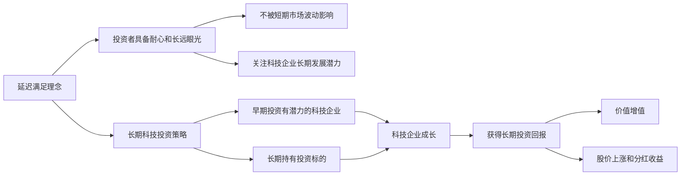

# 芒格的"延迟满足"理念在长期科技投资中的应用

> 关键词：芒格、延迟满足理念、长期科技投资、投资策略、价值投资

> 摘要：本文深入探讨了芒格的“延迟满足”理念在长期科技投资中的应用。首先介绍了该理念的背景以及文章的目的、预期读者等信息。接着阐述了“延迟满足”理念与科技投资的核心概念及联系，详细讲解了相关算法原理和具体操作步骤，通过数学模型和公式进一步分析。在项目实战部分，给出了代码实际案例并进行详细解释。同时探讨了该理念在实际中的应用场景，推荐了学习资源、开发工具框架和相关论文著作。最后总结了未来发展趋势与挑战，解答了常见问题，并提供了扩展阅读和参考资料。

## 1. 背景介绍 
### 1.1 目的和范围
本文章的目的在于深入剖析芒格的“延迟满足”理念，并探究其在长期科技投资领域的具体应用。随着科技行业的快速发展，投资机会众多，但同时也伴随着高度的不确定性和风险。芒格的“延迟满足”理念为投资者提供了一种独特的视角和策略，有助于在复杂多变的科技投资环境中做出更明智的决策。本文将涵盖“延迟满足”理念的理论基础、在科技投资中的应用原理、实际操作步骤、相关数学模型以及具体的项目实战案例等方面，旨在为投资者提供全面而深入的指导。

### 1.2 预期读者
本文预期读者主要包括对科技投资感兴趣的个人投资者、专业投资机构的从业人员、金融领域的研究人员以及希望深入了解投资理念和策略的相关人士。无论是初涉投资领域的新手，还是具有一定投资经验的专业人士，都能从本文中获得有价值的信息和启发。

### 1.3 文档结构概述
本文将按照以下结构进行阐述：首先介绍背景信息，包括目的、预期读者和文档结构概述；接着讲解“延迟满足”理念与科技投资的核心概念及联系，通过文本示意图和 Mermaid 流程图进行直观展示；然后详细分析核心算法原理和具体操作步骤，并使用 Python 源代码进行说明；随后介绍相关的数学模型和公式，并举例说明；在项目实战部分，给出代码实际案例并进行详细解释；之后探讨该理念在实际中的应用场景；再推荐学习资源、开发工具框架和相关论文著作；最后总结未来发展趋势与挑战，解答常见问题，并提供扩展阅读和参考资料。

### 1.4 术语表
#### 1.4.1 核心术语定义
- **延迟满足**：是指一种甘愿为更有价值的长远结果而放弃即时满足的抉择取向，以及在等待期中展示的自我控制能力。在投资领域，表现为投资者不追求短期的投资收益，而是着眼于长期的价值增长。
- **长期科技投资**：指投资者将资金投入到科技行业，并持有相关资产较长时间，以获取科技企业在长期发展过程中所带来的价值增值。
- **价值投资**：一种投资策略，强调通过分析企业的内在价值，寻找被低估的资产进行投资，以获取长期的投资回报。

#### 1.4.2 相关概念解释
- **科技行业的不确定性**：科技行业发展迅速，技术创新不断涌现，企业面临着技术更新换代快、市场竞争激烈、政策法规变化等多种不确定因素，这使得科技企业的未来发展具有较大的不确定性。
- **投资风险**：指投资者在投资过程中面临的可能损失的可能性，包括市场风险、行业风险、企业风险等。在科技投资中，由于行业的不确定性较高，投资风险相对较大。

#### 1.4.3 缩略词列表
- **AI**：Artificial Intelligence，人工智能
- **VR**：Virtual Reality，虚拟现实
- **AR**：Augmented Reality，增强现实

## 2. 核心概念与联系 

### 核心概念原理
“延迟满足”理念的核心在于投资者要有耐心和长远的眼光，不被短期的市场波动和即时的投资回报所迷惑。在长期科技投资中，科技企业的发展通常需要经历较长的周期，从技术研发、产品推广到市场份额的扩大和盈利的实现，往往需要数年甚至数十年的时间。投资者如果能够运用“延迟满足”理念，在科技企业发展的早期阶段进行投资，并长期持有其股份，就有可能在企业成长为行业巨头后获得巨大的投资回报。

例如，早期投资亚马逊的投资者，在公司成立后的很长一段时间内，亚马逊一直处于亏损状态，股价也没有明显的上涨。然而，那些具有“延迟满足”精神的投资者坚持持有亚马逊的股票，随着亚马逊在电商、云计算等领域的不断发展和壮大，其股价也大幅上涨，这些投资者获得了丰厚的回报。

### 架构的文本示意图
```plaintext
延迟满足理念
|
|-- 投资者具备耐心和长远眼光
|   |
|   |-- 不被短期市场波动影响
|   |-- 关注科技企业长期发展潜力
|
|-- 长期科技投资策略
|   |
|   |-- 早期投资有潜力的科技企业
|   |-- 长期持有投资标的
|
|-- 获得长期投资回报
|   |
|   |-- 科技企业成长带来的价值增值
|   |-- 股价上涨和分红收益
```

### Mermaid 流程图


## 3. 核心算法原理 & 具体操作步骤 

### 核心算法原理
在长期科技投资中运用“延迟满足”理念，核心算法原理可以基于价值投资的思想。投资者需要评估科技企业的内在价值，并与当前的市场价格进行比较。如果企业的内在价值高于市场价格，且企业具有良好的长期发展潜力，那么投资者可以考虑进行投资。

以下是一个简单的价值评估算法示例：
假设我们使用现金流折现模型（DCF）来评估科技企业的内在价值。该模型的基本思想是将企业未来的现金流折现到当前时刻，以得到企业的内在价值。

### 具体操作步骤
1. **确定预测期**：确定一个合理的预测期，通常为 5 - 10 年。在这个预测期内，我们需要预测企业的自由现金流。
2. **预测自由现金流**：根据企业的历史财务数据、行业发展趋势和企业的战略规划，预测企业在预测期内每年的自由现金流。自由现金流的计算公式为：
   自由现金流 = 经营活动现金流量 - 资本支出
3. **确定折现率**：折现率反映了投资者对投资的风险要求。一般来说，科技行业的风险较高，折现率也相对较高。可以使用资本资产定价模型（CAPM）来确定折现率，公式如下：
   $r = r_f + \beta \times (r_m - r_f)$
   其中，$r$ 为折现率，$r_f$ 为无风险利率，$\beta$ 为企业的贝塔系数，$r_m$ 为市场收益率。
4. **计算预测期内现金流的现值**：将预测期内每年的自由现金流按照折现率折现到当前时刻，计算公式为：
   $PV = \frac{FCF_1}{(1 + r)^1} + \frac{FCF_2}{(1 + r)^2} + \cdots + \frac{FCF_n}{(1 + r)^n}$
   其中，$PV$ 为预测期内现金流的现值，$FCF_i$ 为第 $i$ 年的自由现金流，$r$ 为折现率，$n$ 为预测期的年数。
5. **计算终值**：在预测期结束后，企业仍然会持续经营，我们需要估算企业在预测期结束后的终值。可以使用永续增长模型来计算终值，公式如下：
   $TV = \frac{FCF_{n + 1}}{r - g}$
   其中，$TV$ 为终值，$FCF_{n + 1}$ 为预测期结束后第一年的自由现金流，$r$ 为折现率，$g$ 为永续增长率。
6. **计算企业的内在价值**：将预测期内现金流的现值和终值相加，得到企业的内在价值，公式如下：
   $V = PV + \frac{TV}{(1 + r)^n}$
   其中，$V$ 为企业的内在价值，$PV$ 为预测期内现金流的现值，$TV$ 为终值，$r$ 为折现率，$n$ 为预测期的年数。
7. **比较内在价值和市场价格**：如果企业的内在价值高于市场价格，且企业具有良好的长期发展潜力，那么投资者可以考虑进行投资。

### Python 源代码实现
```python
import numpy as np

def calculate_present_value(free_cash_flows, discount_rate):
    """
    计算预测期内现金流的现值
    :param free_cash_flows: 预测期内每年的自由现金流列表
    :param discount_rate: 折现率
    :return: 预测期内现金流的现值
    """
    n = len(free_cash_flows)
    present_values = []
    for i in range(n):
        pv = free_cash_flows[i] / ((1 + discount_rate) ** (i + 1))
        present_values.append(pv)
    return sum(present_values)

def calculate_terminal_value(last_fcf, discount_rate, growth_rate):
    """
    计算终值
    :param last_fcf: 预测期结束后第一年的自由现金流
    :param discount_rate: 折现率
    :param growth_rate: 永续增长率
    :return: 终值
    """
    return last_fcf / (discount_rate - growth_rate)

def calculate_intrinsic_value(free_cash_flows, discount_rate, growth_rate):
    """
    计算企业的内在价值
    :param free_cash_flows: 预测期内每年的自由现金流列表
    :param discount_rate: 折现率
    :param growth_rate: 永续增长率
    :return: 企业的内在价值
    """
    pv = calculate_present_value(free_cash_flows, discount_rate)
    last_fcf = free_cash_flows[-1] * (1 + growth_rate)
    tv = calculate_terminal_value(last_fcf, discount_rate, growth_rate)
    n = len(free_cash_flows)
    tv_pv = tv / ((1 + discount_rate) ** n)
    return pv + tv_pv

# 示例数据
free_cash_flows = [100, 120, 150, 180, 200]  # 预测期内每年的自由现金流
discount_rate = 0.1  # 折现率
growth_rate = 0.03  # 永续增长率

intrinsic_value = calculate_intrinsic_value(free_cash_flows, discount_rate, growth_rate)
print(f"企业的内在价值为: {intrinsic_value}")
```

## 4. 数学模型和公式 & 详细讲解 & 举例说明 

### 现金流折现模型（DCF）
现金流折现模型是一种常用的企业价值评估方法，其基本思想是将企业未来的现金流折现到当前时刻，以得到企业的内在价值。该模型的数学公式如下：

$$V = \sum_{i = 1}^{n} \frac{FCF_i}{(1 + r)^i} + \frac{TV}{(1 + r)^n}$$

其中：
- $V$ 为企业的内在价值
- $FCF_i$ 为第 $i$ 年的自由现金流
- $r$ 为折现率
- $n$ 为预测期的年数
- $TV$ 为终值

### 详细讲解
1. **预测期内现金流的现值**：$\sum_{i = 1}^{n} \frac{FCF_i}{(1 + r)^i}$ 表示将预测期内每年的自由现金流按照折现率折现到当前时刻的总和。折现的目的是考虑到货币的时间价值，即未来的现金流量在当前时刻的价值会低于其实际金额。
2. **终值**：$TV$ 表示企业在预测期结束后的价值。由于企业在预测期结束后仍然会持续经营，我们需要估算其未来的价值。通常使用永续增长模型来计算终值，公式为 $TV = \frac{FCF_{n + 1}}{r - g}$，其中 $FCF_{n + 1}$ 为预测期结束后第一年的自由现金流，$g$ 为永续增长率。
3. **折现率**：$r$ 反映了投资者对投资的风险要求。折现率越高，说明投资者对风险的厌恶程度越高，对未来现金流量的折现程度也越大。

### 举例说明
假设我们要评估一家科技企业的内在价值，预测期为 5 年，预测期内每年的自由现金流分别为 100 万元、120 万元、150 万元、180 万元和 200 万元。折现率为 10%，永续增长率为 3%。

首先，计算预测期内现金流的现值：
$$PV = \frac{100}{(1 + 0.1)^1} + \frac{120}{(1 + 0.1)^2} + \frac{150}{(1 + 0.1)^3} + \frac{180}{(1 + 0.1)^4} + \frac{200}{(1 + 0.1)^5} \approx 588.64$$（万元）

然后，计算预测期结束后第一年的自由现金流：
$FCF_{6} = 200 \times (1 + 0.03) = 206$（万元）

接着，计算终值：
$$TV = \frac{206}{0.1 - 0.03} \approx 2942.86$$（万元）

最后，计算终值的现值：
$$PV_{TV} = \frac{2942.86}{(1 + 0.1)^5} \approx 1822.77$$（万元）

企业的内在价值为：
$V = PV + PV_{TV} = 588.64 + 1822.77 = 2411.41$（万元）

如果该企业的当前市场价格低于 2411.41 万元，且具有良好的长期发展潜力，那么投资者可以考虑进行投资。

## 5. 项目实战：代码实际案例和详细解释说明 

### 5.1  开发环境搭建
在进行项目实战之前，我们需要搭建相应的开发环境。以下是具体的步骤：
1. **安装 Python**：可以从 Python 官方网站（https://www.python.org/downloads/）下载并安装最新版本的 Python。
2. **安装必要的库**：在本项目中，我们主要使用了 NumPy 库来进行数值计算。可以使用以下命令来安装 NumPy：
   ```sh
   pip install numpy
   ```
3. **选择开发工具**：可以选择使用 PyCharm、Jupyter Notebook 等开发工具来编写和运行代码。

### 5.2  源代码详细实现和代码解读
以下是一个完整的 Python 代码示例，用于评估科技企业的内在价值：
```python
import numpy as np

def calculate_present_value(free_cash_flows, discount_rate):
    """
    计算预测期内现金流的现值
    :param free_cash_flows: 预测期内每年的自由现金流列表
    :param discount_rate: 折现率
    :return: 预测期内现金流的现值
    """
    n = len(free_cash_flows)
    present_values = []
    for i in range(n):
        pv = free_cash_flows[i] / ((1 + discount_rate) ** (i + 1))
        present_values.append(pv)
    return sum(present_values)

def calculate_terminal_value(last_fcf, discount_rate, growth_rate):
    """
    计算终值
    :param last_fcf: 预测期结束后第一年的自由现金流
    :param discount_rate: 折现率
    :param growth_rate: 永续增长率
    :return: 终值
    """
    return last_fcf / (discount_rate - growth_rate)

def calculate_intrinsic_value(free_cash_flows, discount_rate, growth_rate):
    """
    计算企业的内在价值
    :param free_cash_flows: 预测期内每年的自由现金流列表
    :param discount_rate: 折现率
    :param growth_rate: 永续增长率
    :return: 企业的内在价值
    """
    pv = calculate_present_value(free_cash_flows, discount_rate)
    last_fcf = free_cash_flows[-1] * (1 + growth_rate)
    tv = calculate_terminal_value(last_fcf, discount_rate, growth_rate)
    n = len(free_cash_flows)
    tv_pv = tv / ((1 + discount_rate) ** n)
    return pv + tv_pv

# 示例数据
free_cash_flows = [100, 120, 150, 180, 200]  # 预测期内每年的自由现金流
discount_rate = 0.1  # 折现率
growth_rate = 0.03  # 永续增长率

intrinsic_value = calculate_intrinsic_value(free_cash_flows, discount_rate, growth_rate)
print(f"企业的内在价值为: {intrinsic_value}")
```
### 代码解读与分析
1. **calculate_present_value 函数**：该函数用于计算预测期内现金流的现值。它接受两个参数：预测期内每年的自由现金流列表 `free_cash_flows` 和折现率 `discount_rate`。在函数内部，使用循环遍历每个年份的自由现金流，并将其按照折现率折现到当前时刻，最后将所有折现后的现金流相加得到预测期内现金流的现值。
2. **calculate_terminal_value 函数**：该函数用于计算终值。它接受三个参数：预测期结束后第一年的自由现金流 `last_fcf`、折现率 `discount_rate` 和永续增长率 `growth_rate`。根据永续增长模型的公式，计算出终值。
3. **calculate_intrinsic_value 函数**：该函数用于计算企业的内在价值。它接受三个参数：预测期内每年的自由现金流列表 `free_cash_flows`、折现率 `discount_rate` 和永续增长率 `growth_rate`。在函数内部，首先调用 `calculate_present_value` 函数计算预测期内现金流的现值，然后计算预测期结束后第一年的自由现金流，再调用 `calculate_terminal_value` 函数计算终值，最后将终值折现到当前时刻，并与预测期内现金流的现值相加得到企业的内在价值。
4. **主程序**：在主程序中，我们定义了示例数据，包括预测期内每年的自由现金流、折现率和永续增长率。然后调用 `calculate_intrinsic_value` 函数计算企业的内在价值，并将结果打印输出。

## 6. 实际应用场景 
### 早期科技企业投资
在科技行业中，许多有潜力的早期企业在发展初期往往面临着资金短缺、市场认可度低等问题，其股价或估值相对较低。投资者如果能够运用“延迟满足”理念，在企业发展的早期阶段进行投资，并长期持有其股份，就有可能在企业成长为行业巨头后获得巨大的投资回报。例如，早期投资谷歌、苹果等科技巨头的投资者，通过长期持有其股票，获得了丰厚的收益。

### 科技行业的并购投资
在科技行业的并购活动中，投资者也可以运用“延迟满足”理念。当一家科技企业进行并购时，短期内可能会面临整合困难、业绩下滑等问题，导致股价下跌。然而，如果并购的战略方向正确，且企业具有较强的整合能力，那么从长期来看，并购可能会带来协同效应，提升企业的竞争力和价值。投资者可以在并购后股价下跌时买入股票，并长期持有，等待企业价值的提升。

### 科技主题基金投资
投资者可以通过投资科技主题基金来间接参与科技投资。科技主题基金通常会投资于多个科技企业的股票，分散了投资风险。投资者在选择科技主题基金时，应该选择具有良好业绩和投资策略的基金，并长期持有。在市场波动时，不要轻易赎回基金，而是要相信基金经理的投资能力和“延迟满足”理念，等待基金净值的长期增长。

## 7. 工具和资源推荐
### 7.1 学习资源推荐
#### 7.1.1 书籍推荐
- 《穷查理宝典：查理·芒格的智慧箴言录》：本书收录了查理·芒格的演讲、文章和访谈等内容，全面展示了他的投资理念、思维方式和人生智慧。
- 《聪明的投资者》：作者是本杰明·格雷厄姆，被誉为“价值投资之父”。本书是价值投资领域的经典著作，对投资者具有重要的指导意义。
- 《科技投资的艺术》：详细介绍了科技投资的策略、方法和案例，帮助投资者更好地理解科技行业的投资机会和风险。

#### 7.1.2 在线课程
- Coursera 上的“投资学原理”课程：由知名高校的教授授课，系统地介绍了投资学的基本原理和方法。
- edX 上的“科技创业与投资”课程：聚焦于科技行业的创业和投资，提供了丰富的案例分析和实践经验。

#### 7.1.3 技术博客和网站
- Seeking Alpha：一个知名的金融投资博客网站，提供了大量的股票分析、投资策略和市场评论等内容。
- TechCrunch：专注于科技行业的新闻和分析，及时报道科技领域的最新动态和趋势。

### 7.2 开发工具框架推荐
#### 7.2.1 IDE和编辑器
- PyCharm：一款专业的 Python 集成开发环境，具有强大的代码编辑、调试和分析功能。
- Jupyter Notebook：一个交互式的开发环境，适合进行数据探索、模型验证和代码演示等工作。

#### 7.2.2 调试和性能分析工具
- Py-Spy：一个轻量级的 Python 性能分析工具，可以帮助开发者找出代码中的性能瓶颈。
- PDB：Python 自带的调试工具，可以在代码中设置断点，逐步调试程序。

#### 7.2.3 相关框架和库
- NumPy：一个用于科学计算的 Python 库，提供了高效的数组操作和数学函数。
- Pandas：一个用于数据处理和分析的 Python 库，提供了丰富的数据结构和数据处理方法。

### 7.3 相关论文著作推荐
#### 7.3.1 经典论文
- Eugene F. Fama 和 Kenneth R. French 的《The Cross - Section of Expected Stock Returns》：提出了著名的三因子模型，对股票收益率的影响因素进行了深入研究。
- Burton G. Malkiel 的《Random Walks in Stock Market Prices》：阐述了股票市场价格的随机游走理论，对有效市场假说进行了重要的贡献。

#### 7.3.2 最新研究成果
- 关注顶级金融学术期刊，如《Journal of Finance》、《Review of Financial Studies》等，了解科技投资领域的最新研究成果。

#### 7.3.3 应用案例分析
- 可以参考一些知名投资机构的研究报告和案例分析，学习他们在科技投资中的策略和方法。

## 8. 总结：未来发展趋势与挑战
### 未来发展趋势
- **科技行业的持续创新**：随着人工智能、区块链、物联网等新兴技术的不断发展，科技行业将继续保持快速创新的态势。这将为长期科技投资带来更多的机会，投资者可以通过运用“延迟满足”理念，投资于具有创新能力和发展潜力的科技企业，分享科技进步带来的红利。
- **全球化投资趋势**：科技行业的全球化发展趋势日益明显，跨国科技企业的影响力不断扩大。投资者可以通过全球配置的方式，投资于不同国家和地区的科技企业，分散投资风险，提高投资回报。
- **社会责任投资的兴起**：越来越多的投资者开始关注企业的社会责任和可持续发展。在科技投资中，投资者可能会更加倾向于投资那些具有良好社会形象、注重环境保护和员工福利的科技企业。

### 挑战
- **科技行业的不确定性增加**：科技行业的快速发展也带来了更高的不确定性。技术创新的速度加快，市场竞争激烈，科技企业面临着技术更新换代快、产品生命周期短等问题。投资者需要具备更强的分析能力和判断力，才能准确评估科技企业的长期发展潜力。
- **市场波动加剧**：科技行业的股票价格通常具有较高的波动性。市场情绪、宏观经济环境等因素都可能导致科技股价格的大幅波动。投资者需要具备较强的心理素质和风险承受能力，不被短期的市场波动所影响，坚持“延迟满足”理念。
- **监管政策的变化**：科技行业的发展受到监管政策的影响较大。政府可能会出台新的法律法规，对科技企业的经营和发展产生影响。投资者需要密切关注监管政策的变化，及时调整投资策略。

## 9. 附录：常见问题与解答
### 问题 1：“延迟满足”理念在科技投资中一定能获得成功吗？
解答：“延迟满足”理念并不能保证在科技投资中一定获得成功。科技行业具有较高的不确定性，即使投资者选择了有潜力的科技企业并长期持有，也可能因为技术创新失败、市场竞争加剧等原因导致投资失败。然而，“延迟满足”理念可以帮助投资者避免短期的市场波动和投机行为，更关注企业的长期发展，从而提高投资成功的概率。

### 问题 2：如何判断科技企业是否具有长期发展潜力？
解答：判断科技企业是否具有长期发展潜力需要综合考虑多个因素，包括企业的技术实力、创新能力、市场竞争力、管理团队、财务状况等。投资者可以通过研究企业的研发投入、专利数量、产品市场份额、营收和利润增长情况等指标来评估企业的发展潜力。此外，还可以关注行业的发展趋势和政策环境，选择符合行业发展方向和政策支持的科技企业。

### 问题 3：在长期科技投资中，应该如何控制风险？
解答：在长期科技投资中，可以通过以下方式控制风险：
- **分散投资**：不要把所有的资金都投资于一家科技企业，而是选择投资于多个不同的科技企业或科技主题基金，分散投资风险。
- **定期评估投资组合**：定期对投资组合进行评估，根据企业的发展情况和市场变化，及时调整投资组合。
- **设置止损点**：在投资过程中，可以设置止损点，当股票价格下跌到一定程度时，及时卖出股票，避免损失进一步扩大。

## 10. 扩展阅读 & 参考资料
### 扩展阅读
- 《创新者的窘境》：探讨了科技企业在面对技术创新和市场变化时所面临的挑战和机遇。
- 《从 0 到 1》：讲述了科技创业的方法和理念，对投资者了解科技企业的发展过程具有重要的参考价值。

### 参考资料
- 查理·芒格的相关演讲和文章
- 金融学术期刊上的研究论文
- 科技行业的研究报告和统计数据

作者：AI天才研究院/AI Genius Institute & 禅与计算机程序设计艺术 /Zen And The Art of Computer Programming