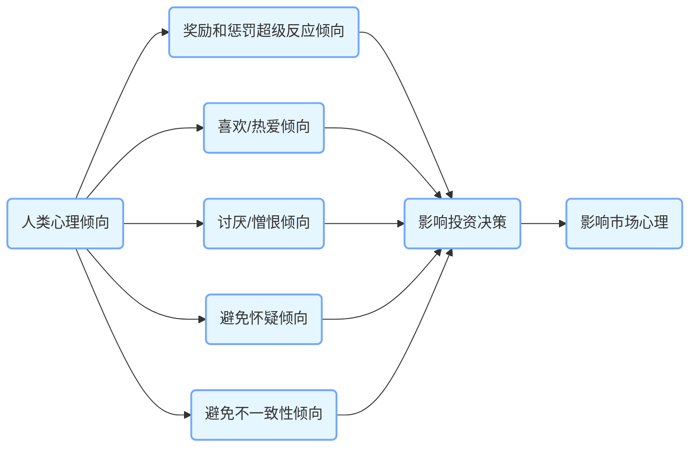

# 芒格的"心理倾向"理论：理解并利用市场心理

> 关键词：芒格、心理倾向理论、市场心理、行为金融学、投资决策

> 摘要：本文深入探讨了芒格的“心理倾向”理论，旨在剖析该理论的核心概念、算法原理，并结合数学模型进行详细阐述。通过项目实战案例展示如何在实际中应用这一理论理解并利用市场心理。同时，分析其在不同实际场景中的应用，推荐相关学习资源、开发工具及参考论文，最后总结该理论的未来发展趋势与挑战，为投资者和相关研究人员提供全面的知识体系和实践指导。

## 1. 背景介绍 
### 1.1 目的和范围
芒格的“心理倾向”理论是行为金融学领域的重要理论之一。本文的目的在于全面深入地研究这一理论，详细解析其原理、应用及影响。范围涵盖该理论的核心概念、相关算法、数学模型，以及在市场心理分析和投资决策中的实际应用，旨在帮助读者更好地理解市场行为，提升投资决策的准确性。

### 1.2 预期读者
本文预期读者包括投资者、金融从业者、行为金融学研究人员以及对市场心理和投资决策感兴趣的广大人群。无论是专业人士寻求理论的深入研究，还是普通投资者希望获取实用的投资决策方法，都能从本文中获得有价值的信息。

### 1.3 文档结构概述
本文首先介绍芒格“心理倾向”理论的背景信息，包括目的、预期读者和文档结构。接着阐述核心概念与联系，通过文本示意图和 Mermaid 流程图展示理论架构。然后详细讲解核心算法原理及具体操作步骤，结合 Python 源代码进行说明。之后介绍数学模型和公式，并举例说明。再通过项目实战案例，包括开发环境搭建、源代码实现和代码解读，展示理论的实际应用。随后分析实际应用场景，推荐相关工具和资源。最后总结未来发展趋势与挑战，提供常见问题解答和扩展阅读参考资料。

### 1.4 术语表
#### 1.4.1 核心术语定义
- **芒格的“心理倾向”理论**：由查理·芒格提出的一系列关于人类心理倾向的理论，描述了人类在决策过程中受到的各种心理因素的影响。
- **市场心理**：指参与市场的投资者群体在特定时期内的心理状态和行为倾向，影响着市场的走势和资产价格。
- **行为金融学**：将心理学、社会学等学科的理论与金融学相结合，研究投资者的实际决策行为及其对金融市场的影响。

#### 1.4.2 相关概念解释
- **认知偏差**：指人们在认知过程中由于各种心理因素的影响而产生的偏离理性判断的现象。例如，过度自信、锚定效应等。
- **羊群效应**：指投资者在信息不确定的情况下，受到其他投资者行为的影响，盲目跟随他人进行投资决策的现象。

#### 1.4.3 缩略词列表
- **BF**：Behavioral Finance（行为金融学）

## 2. 核心概念与联系 
芒格的“心理倾向”理论包含了多种人类心理倾向，这些倾向相互作用，影响着投资者的决策和市场心理。以下是核心概念的文本示意图：

人类心理倾向包括：
- **奖励和惩罚超级反应倾向**：人们对奖励和惩罚的反应会影响其行为和决策。例如，在投资中，投资者可能会因为预期的高额回报而冒险投资，或者因为害怕损失而过于保守。
- **喜欢/热爱倾向**：人们倾向于喜欢和热爱某些人、事物或观念，并因此对其产生过度的信任和支持。在市场中，投资者可能会因为喜欢某个公司的品牌或管理层而过度投资该公司的股票。
- **讨厌/憎恨倾向**：与喜欢/热爱倾向相反，人们会因为讨厌某些人、事物或观念而对其产生偏见和排斥。这可能导致投资者忽视某些有潜力的投资机会。
- **避免怀疑倾向**：人类在面对不确定性时，倾向于尽快做出决策以避免怀疑和焦虑。在市场波动时，投资者可能会因为急于做出决策而忽略了充分的分析。
- **避免不一致性倾向**：人们倾向于保持自己的观点和行为的一致性，不愿意轻易改变。这可能导致投资者在市场情况发生变化时，仍然坚持原有的投资策略。

以下是 Mermaid 流程图：


## 3. 核心算法原理 & 具体操作步骤 
### 核心算法原理
我们可以通过一个简单的算法来模拟心理倾向对投资决策的影响。假设我们有一个投资者，他的投资决策受到多种心理倾向的影响。我们可以用以下 Python 代码来实现：

```python
import random

# 定义心理倾向的权重
reward_punish_weight = 0.3
like_love_weight = 0.2
hate_dislike_weight = 0.1
avoid_doubt_weight = 0.2
avoid_inconsistency_weight = 0.2

# 模拟不同心理倾向的影响
def reward_punish_effect():
    # 奖励和惩罚超级反应倾向，随机生成一个影响值
    return random.uniform(-1, 1) * reward_punish_weight

def like_love_effect():
    # 喜欢/热爱倾向，随机生成一个影响值
    return random.uniform(-1, 1) * like_love_weight

def hate_dislike_effect():
    # 讨厌/憎恨倾向，随机生成一个影响值
    return random.uniform(-1, 1) * hate_dislike_weight

def avoid_doubt_effect():
    # 避免怀疑倾向，随机生成一个影响值
    return random.uniform(-1, 1) * avoid_doubt_weight

def avoid_inconsistency_effect():
    # 避免不一致性倾向，随机生成一个影响值
    return random.uniform(-1, 1) * avoid_inconsistency_weight

# 计算总的心理倾向影响
def total_psychological_effect():
    return (reward_punish_effect() + like_love_effect() + hate_dislike_effect() +
            avoid_doubt_effect() + avoid_inconsistency_effect())

# 模拟投资决策
def investment_decision(initial_decision):
    psychological_effect = total_psychological_effect()
    # 根据心理倾向的影响调整初始决策
    final_decision = initial_decision + psychological_effect
    return final_decision

# 示例
initial_decision = 0.5  # 初始投资决策，取值范围 0 - 1
final_decision = investment_decision(initial_decision)
print(f"初始投资决策: {initial_decision}")
print(f"最终投资决策: {final_decision}")
```

### 具体操作步骤
1. **定义心理倾向的权重**：根据不同心理倾向的重要程度，为每个心理倾向分配一个权重。
2. **模拟不同心理倾向的影响**：通过随机数生成每个心理倾向的影响值。
3. **计算总的心理倾向影响**：将每个心理倾向的影响值相加，得到总的心理倾向影响。
4. **模拟投资决策**：根据总的心理倾向影响，调整初始投资决策，得到最终投资决策。

## 4. 数学模型和公式 & 详细讲解 & 举例说明 
### 数学模型和公式
设 $I_0$ 为初始投资决策，$R$ 为奖励和惩罚超级反应倾向的影响值，$L$ 为喜欢/热爱倾向的影响值，$H$ 为讨厌/憎恨倾向的影响值，$D$ 为避免怀疑倾向的影响值，$C$ 为避免不一致性倾向的影响值，$I_f$ 为最终投资决策。则有：

$$I_f = I_0 + R + L + H + D + C$$

其中，$R = w_R \times r_R$，$L = w_L \times r_L$，$H = w_H \times r_H$，$D = w_D \times r_D$，$C = w_C \times r_C$。$w_R$、$w_L$、$w_H$、$w_D$、$w_C$ 分别为各心理倾向的权重，$r_R$、$r_L$、$r_H$、$r_D$、$r_C$ 分别为各心理倾向的随机影响值，取值范围为 $[-1, 1]$。

### 详细讲解
这个数学模型描述了心理倾向对投资决策的影响机制。初始投资决策 $I_0$ 是投资者在没有受到心理倾向影响时的决策。各心理倾向的影响值是通过权重和随机影响值的乘积得到的。最终投资决策 $I_f$ 是在初始投资决策的基础上，加上各心理倾向的影响值得到的。

### 举例说明
假设初始投资决策 $I_0 = 0.6$，各心理倾向的权重分别为 $w_R = 0.3$，$w_L = 0.2$，$w_H = 0.1$，$w_D = 0.2$，$w_C = 0.2$。各心理倾向的随机影响值分别为 $r_R = 0.5$，$r_L = -0.3$，$r_H = -0.1$，$r_D = 0.2$，$r_C = 0.4$。

则各心理倾向的影响值分别为：
$R = w_R \times r_R = 0.3 \times 0.5 = 0.15$
$L = w_L \times r_L = 0.2 \times (-0.3) = -0.06$
$H = w_H \times r_H = 0.1 \times (-0.1) = -0.01$
$D = w_D \times r_D = 0.2 \times 0.2 = 0.04$
$C = w_C \times r_C = 0.2 \times 0.4 = 0.08$

最终投资决策为：
$I_f = I_0 + R + L + H + D + C = 0.6 + 0.15 - 0.06 - 0.01 + 0.04 + 0.08 = 0.79$

## 5. 项目实战：代码实际案例和详细解释说明 
### 5.1  开发环境搭建
- **Python 安装**：从 Python 官方网站（https://www.python.org/downloads/）下载并安装 Python 3.x 版本。
- **开发工具**：可以选择 PyCharm、VS Code 等集成开发环境（IDE），或者使用 Jupyter Notebook 进行代码开发和测试。

### 5.2  源代码详细实现和代码解读
以下是一个更完整的项目实战代码示例，用于模拟多个投资者在不同心理倾向影响下的投资决策，并分析市场心理的变化：

```python
import random
import matplotlib.pyplot as plt

# 定义心理倾向的权重
reward_punish_weight = 0.3
like_love_weight = 0.2
hate_dislike_weight = 0.1
avoid_doubt_weight = 0.2
avoid_inconsistency_weight = 0.2

# 模拟不同心理倾向的影响
def reward_punish_effect():
    return random.uniform(-1, 1) * reward_punish_weight

def like_love_effect():
    return random.uniform(-1, 1) * like_love_weight

def hate_dislike_effect():
    return random.uniform(-1, 1) * hate_dislike_weight

def avoid_doubt_effect():
    return random.uniform(-1, 1) * avoid_doubt_weight

def avoid_inconsistency_effect():
    return random.uniform(-1, 1) * avoid_inconsistency_weight

# 计算总的心理倾向影响
def total_psychological_effect():
    return (reward_punish_effect() + like_love_effect() + hate_dislike_effect() +
            avoid_doubt_effect() + avoid_inconsistency_effect())

# 模拟投资决策
def investment_decision(initial_decision):
    psychological_effect = total_psychological_effect()
    final_decision = initial_decision + psychological_effect
    # 确保最终决策在 0 - 1 范围内
    final_decision = max(0, min(final_decision, 1))
    return final_decision

# 模拟多个投资者的投资决策
def simulate_investors(num_investors, initial_decision_mean=0.5, initial_decision_std=0.1):
    decisions = []
    for _ in range(num_investors):
        initial_decision = random.normalvariate(initial_decision_mean, initial_decision_std)
        final_decision = investment_decision(initial_decision)
        decisions.append(final_decision)
    return decisions

# 分析市场心理
def analyze_market_psychology(decisions):
    average_decision = sum(decisions) / len(decisions)
    return average_decision

# 主函数
if __name__ == "__main__":
    num_investors = 100
    decisions = simulate_investors(num_investors)
    market_psychology = analyze_market_psychology(decisions)

    # 绘制投资者决策分布图
    plt.hist(decisions, bins=20, edgecolor='black')
    plt.title('Investor Decisions Distribution')
    plt.xlabel('Investment Decision')
    plt.ylabel('Number of Investors')
    plt.show()

    print(f"市场心理（平均投资决策）: {market_psychology}")
```

### 代码解读与分析
- **心理倾向影响函数**：`reward_punish_effect`、`like_love_effect`、`hate_dislike_effect`、`avoid_doubt_effect`、`avoid_inconsistency_effect` 函数分别模拟了不同心理倾向的影响，通过随机数生成影响值。
- **总心理倾向影响函数**：`total_psychological_effect` 函数将各心理倾向的影响值相加，得到总的心理倾向影响。
- **投资决策函数**：`investment_decision` 函数根据总的心理倾向影响，调整初始投资决策，得到最终投资决策，并确保最终决策在 0 - 1 范围内。
- **模拟投资者函数**：`simulate_investors` 函数模拟了多个投资者的投资决策，每个投资者的初始决策服从正态分布。
- **市场心理分析函数**：`analyze_market_psychology` 函数计算所有投资者的平均投资决策，作为市场心理的指标。
- **主函数**：在主函数中，我们模拟了 100 个投资者的投资决策，分析了市场心理，并绘制了投资者决策的分布图。

## 6. 实际应用场景 
### 投资决策
投资者可以利用芒格的“心理倾向”理论，识别自己和其他投资者的心理倾向，避免因心理偏差而做出错误的投资决策。例如，在市场过热时，投资者可能会受到奖励和惩罚超级反应倾向的影响，过度追涨；而在市场低迷时，可能会受到讨厌/憎恨倾向和避免怀疑倾向的影响，过度杀跌。通过认识到这些心理倾向，投资者可以保持理性，做出更明智的投资决策。

### 市场趋势分析
分析师可以通过观察市场参与者的行为，推断他们的心理倾向，从而预测市场趋势。例如，如果市场参与者普遍表现出喜欢/热爱倾向，对某个行业或公司过度追捧，可能预示着该行业或公司的股价存在泡沫；而如果市场参与者普遍表现出讨厌/憎恨倾向，对某个行业或公司过度悲观，可能意味着该行业或公司存在被低估的投资机会。

### 风险管理
金融机构可以利用“心理倾向”理论，评估投资者的风险承受能力和投资行为，制定更有效的风险管理策略。例如，对于容易受到避免怀疑倾向影响的投资者，金融机构可以提供更详细的信息和分析，帮助他们做出更理性的决策；对于容易受到羊群效应影响的投资者，金融机构可以加强风险提示，引导他们避免盲目跟风。

## 7. 工具和资源推荐
### 7.1 学习资源推荐
#### 7.1.1 书籍推荐
- 《穷查理宝典：查理·芒格的智慧箴言录》：全面介绍了芒格的投资理念和“心理倾向”理论，是学习芒格思想的经典著作。
- 《思考，快与慢》：作者丹尼尔·卡尼曼是行为经济学领域的大师，该书深入探讨了人类的认知偏差和决策过程，与芒格的“心理倾向”理论有很多相通之处。
- 《行为金融学》：系统介绍了行为金融学的理论和方法，有助于读者深入理解市场心理和投资者行为。

#### 7.1.2 在线课程
- Coursera 上的“Behavioral Finance”课程：由知名教授授课，内容涵盖行为金融学的基本理论和应用。
- edX 上的“Introduction to Behavioral Economics”课程：介绍了行为经济学的基本概念和研究方法，对理解市场心理有很大帮助。

#### 7.1.3 技术博客和网站
- Seeking Alpha：一个提供金融分析和投资建议的网站，有很多关于市场心理和投资者行为的文章。
- Behavioral Finance Network：专注于行为金融学研究和交流的网站，提供最新的研究成果和学术