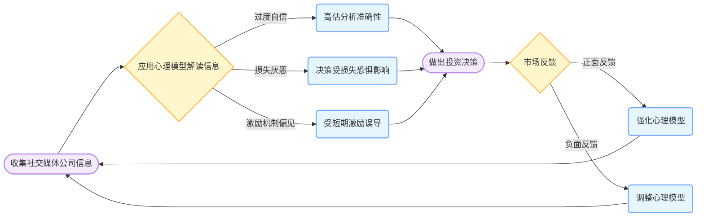

# 芒格的"心理模型"在社交媒体投资分析中的应用

> 关键词：芒格、心理模型、社交媒体、投资分析、行为金融学

> 摘要：本文旨在探讨查理·芒格所提出的“心理模型”在社交媒体投资分析领域的应用。通过深入剖析心理模型的核心概念及其与社交媒体投资的内在联系，详细阐述相关算法原理、数学模型，结合具体的项目实战案例进行分析，明确社交媒体投资中常见的应用场景。同时，推荐相关的学习资源、开发工具和研究论文，最后对未来发展趋势与挑战进行总结，并给出常见问题解答及扩展阅读参考资料，为投资者在社交媒体投资分析中运用心理模型提供全面且深入的指导。

## 1. 背景介绍 
### 1.1 目的和范围
本文章的主要目的是深入研究并阐述芒格的“心理模型”在社交媒体投资分析中的具体应用。随着社交媒体行业的迅速发展，其在全球经济和投资领域的影响力日益增强。然而，社交媒体行业具有独特的特点，如用户行为的复杂性、信息传播的快速性和不确定性等，传统的投资分析方法可能无法完全适应。芒格的心理模型提供了一种从人类心理和行为角度出发的分析视角，有助于投资者更好地理解社交媒体公司的价值、风险和发展趋势。本文的范围涵盖了心理模型的基本概念、在社交媒体投资分析中的具体应用方法、相关案例分析以及未来发展趋势等方面。

### 1.2 预期读者
本文预期读者主要包括对社交媒体投资感兴趣的投资者，无论是个人投资者还是专业投资机构的从业者；金融分析人员，希望通过引入新的分析视角来提升对社交媒体行业的分析能力；以及对行为金融学和投资心理学有研究兴趣的学者和学生。

### 1.3 文档结构概述
本文将按照以下结构进行阐述：首先介绍心理模型的核心概念以及与社交媒体投资分析的联系，并通过示意图和流程图进行直观展示；接着详细讲解核心算法原理和具体操作步骤，结合 Python 代码进行说明；然后介绍相关的数学模型和公式，并举例说明其在投资分析中的应用；通过具体的项目实战案例，包括开发环境搭建、源代码实现和代码解读，深入分析心理模型在实际投资中的应用；探讨心理模型在社交媒体投资中的实际应用场景；推荐相关的学习资源、开发工具和研究论文；最后总结未来发展趋势与挑战，给出常见问题解答和扩展阅读参考资料。

### 1.4 术语表
#### 1.4.1 核心术语定义
- **心理模型**：芒格所提出的概念，指人们在认知世界、做出决策时所依据的一系列思维模式和认知框架，这些模式和框架受到人类心理、情感、认知偏差等因素的影响。
- **社交媒体投资分析**：对社交媒体公司进行价值评估、风险分析和投资决策的过程，考虑社交媒体行业的特点，如用户规模、用户活跃度、信息传播等因素。
- **行为金融学**：将心理学、社会学等学科的理论和方法引入金融学研究，研究投资者在金融市场中的行为和决策过程，以及这些行为对金融市场价格和资产定价的影响。

#### 1.4.2 相关概念解释
- **认知偏差**：人类在认知过程中由于心理、情感等因素的影响而产生的偏离理性判断的现象，如过度自信、损失厌恶、羊群效应等。
- **用户粘性**：指社交媒体用户对平台的依赖程度和忠诚度，通常通过用户的使用频率、使用时长、参与度等指标来衡量。
- **网络效应**：指社交媒体平台的价值随着用户数量的增加而增加的现象，用户之间的互动和信息传播使得平台对新用户更具吸引力。

#### 1.4.3 缩略词列表
- **SNS**：Social Networking Service，社交网络服务
- **P/E**：Price-to-Earnings Ratio，市盈率

## 2. 核心概念与联系 
### 核心概念原理
芒格的心理模型是基于人类的认知和行为规律构建的一系列思维工具。这些模型反映了人类在决策过程中常见的心理偏差和行为模式。例如，“激励机制引起的偏见”模型指出，人们往往会受到激励因素的影响而做出不理性的决策。在社交媒体投资分析中，这可能表现为投资者受到社交媒体公司短期业绩激励措施的影响，而忽视了公司的长期发展潜力。

另一个重要的心理模型是“损失厌恶”模型。人类天生对损失更为敏感，损失带来的痛苦往往大于同等收益带来的快乐。在社交媒体投资中，投资者可能因为害怕损失而过早卖出股票，错过潜在的上涨机会；或者在股票下跌时不愿意止损，导致损失进一步扩大。

### 架构的文本示意图
我们可以将心理模型在社交媒体投资分析中的应用架构表示如下：

投资者通过对社交媒体公司的多方面信息进行收集和分析，包括公司的财务报表、用户数据、行业动态等。在这个过程中，投资者的心理模型会对信息的解读和决策产生影响。例如，投资者的“过度自信”心理模型可能导致其对自己的分析能力过于自信，从而忽视了一些重要的风险因素。最终，投资者根据自己的心理模型和分析结果做出投资决策，而这些决策又会受到市场反馈的影响，进一步影响投资者的心理和后续决策。

### Mermaid 流程图


这个流程图展示了心理模型在社交媒体投资分析中的动态应用过程。投资者首先收集信息，然后应用心理模型进行解读，根据解读结果做出投资决策。市场反馈会对投资者的心理模型产生影响，促使其强化或调整心理模型，从而影响下一次的投资分析和决策过程。

## 3. 核心算法原理 & 具体操作步骤 
### 算法原理讲解
在社交媒体投资分析中应用心理模型，我们可以构建一个基于规则的算法。该算法的核心思想是根据不同的心理模型设定相应的规则，对社交媒体公司的各项指标进行评估和分析，从而辅助投资决策。

以下是一个简化的 Python 代码示例，用于说明如何应用“过度自信”和“损失厌恶”心理模型进行投资分析：

```python
# 定义社交媒体公司的相关指标
class SocialMediaCompany:
    def __init__(self, user_growth_rate, revenue_growth_rate, stock_price):
        self.user_growth_rate = user_growth_rate
        self.revenue_growth_rate = revenue_growth_rate
        self.stock_price = stock_price

# 定义过度自信心理模型规则
def overconfidence_model(company):
    # 假设过度自信的投资者会高估用户增长对股价的影响
    expected_stock_price = company.stock_price * (1 + company.user_growth_rate * 1.2)
    return expected_stock_price

# 定义损失厌恶心理模型规则
def loss_aversion_model(company, purchase_price):
    # 假设损失厌恶的投资者在股价下跌 10% 时会考虑卖出
    if company.stock_price < purchase_price * 0.9:
        return "考虑卖出"
    else:
        return "继续持有"

# 示例使用
if __name__ == "__main__":
    # 创建一个社交媒体公司实例
    company = SocialMediaCompany(user_growth_rate=0.1, revenue_growth_rate=0.05, stock_price=100)
    # 应用过度自信心理模型
    expected_price_overconfidence = overconfidence_model(company)
    print(f"过度自信模型预测的股价: {expected_price_overconfidence}")
    # 假设购买价格为 100
    purchase_price = 100
    # 应用损失厌恶心理模型
    decision_loss_aversion = loss_aversion_model(company, purchase_price)
    print(f"损失厌恶模型的投资决策: {decision_loss_aversion}")
```

### 具体操作步骤
1. **数据收集**：收集社交媒体公司的相关数据，包括用户增长数据、营收数据、股价数据等。这些数据可以从公司的财务报表、行业报告、数据提供商等渠道获取。
2. **心理模型选择**：根据投资者自身的特点和投资目标，选择合适的心理模型进行应用。例如，如果投资者容易过度自信，可以重点关注过度自信心理模型；如果投资者比较厌恶损失，可以重点应用损失厌恶心理模型。
3. **规则设定**：根据所选的心理模型，设定相应的分析规则。例如，在过度自信心理模型中，可以设定高估用户增长对股价影响的系数；在损失厌恶心理模型中，可以设定股价下跌的阈值。
4. **指标评估**：将收集到的数据代入设定的规则中，对社交媒体公司的各项指标进行评估。例如，计算过度自信模型下的预期股价，根据损失厌恶模型判断是否需要卖出股票。
5. **投资决策**：根据指标评估的结果，结合其他因素（如市场整体情况、行业竞争态势等），做出投资决策。

## 4. 数学模型和公式 & 详细讲解 & 举例说明 
### 数学模型和公式
#### 1. 过度自信心理模型下的股价预测公式
设当前股价为 $P_0$，用户增长率为 $g_u$，过度自信系数为 $\alpha$（$\alpha > 1$），则过度自信心理模型下预测的股价 $P_1$ 为：
$$P_1 = P_0\times(1 + \alpha\times g_u)$$

这个公式的含义是，过度自信的投资者会高估用户增长对股价的影响，通过乘以一个大于 1 的过度自信系数 $\alpha$ 来体现这种高估。

#### 2. 损失厌恶心理模型下的决策阈值公式
设购买价格为 $P_b$，损失厌恶阈值为 $\beta$（$0 < \beta < 1$），当前股价为 $P_c$，则当 $P_c < \beta\times P_b$ 时，损失厌恶的投资者会考虑卖出股票。

### 详细讲解
- **过度自信心理模型**：在社交媒体行业，用户增长通常被认为是公司发展的重要指标之一。然而，过度自信的投资者可能会过于看重用户增长，而忽视了其他因素（如营收增长、盈利能力等）对股价的影响。通过引入过度自信系数 $\alpha$，可以量化这种高估的程度。例如，当 $\alpha = 1.2$ 时，意味着投资者认为用户增长对股价的影响比实际情况高 20%。
- **损失厌恶心理模型**：损失厌恶是人类普遍存在的心理特征。在投资中，损失厌恶的投资者会对股价下跌更为敏感。损失厌恶阈值 $\beta$ 表示投资者能够承受的最大损失比例。当股价下跌超过这个比例时，投资者会因为害怕进一步损失而考虑卖出股票。

### 举例说明
假设某社交媒体公司当前股价 $P_0 = 100$ 元，用户增长率 $g_u = 0.1$，过度自信系数 $\alpha = 1.2$。根据过度自信心理模型下的股价预测公式，可得预测股价 $P_1$ 为：
$$P_1 = 100\times(1 + 1.2\times0.1) = 100\times(1 + 0.12) = 112$$（元）

这意味着过度自信的投资者会认为该公司的股价会上涨到 112 元，而实际上可能由于其他因素的影响，股价无法达到这个水平。

再假设投资者以 $P_b = 100$ 元的价格买入该股票，损失厌恶阈值 $\beta = 0.9$。当当前股价 $P_c$ 下跌到 $P_c = 90$ 元时，即 $P_c = 90 < 0.9\times100 = 90$，损失厌恶的投资者会考虑卖出股票，以避免进一步的损失。

## 5. 项目实战：代码实际案例和详细解释说明 
### 5.1  开发环境搭建
为了实现心理模型在社交媒体投资分析中的应用，我们可以使用 Python 语言进行开发。以下是搭建开发环境的具体步骤：

1. **安装 Python**：从 Python 官方网站（https://www.python.org/downloads/）下载并安装适合你操作系统的 Python 版本。建议安装 Python 3.7 及以上版本。
2. **安装必要的库**：我们需要安装一些常用的 Python 库，如 `pandas` 用于数据处理，`numpy` 用于数值计算。可以使用以下命令进行安装：
```sh
pip install pandas numpy
```
3. **选择开发工具**：可以选择使用集成开发环境（IDE），如 PyCharm、Jupyter Notebook 等。这里我们推荐使用 Jupyter Notebook，它可以方便地进行代码编写、调试和文档记录。

### 5.2  源代码详细实现和代码解读
以下是一个更完整的 Python 代码示例，用于结合多个心理模型进行社交媒体投资分析：

```python
import pandas as pd
import numpy as np

# 定义社交媒体公司类
class SocialMediaCompany:
    def __init__(self, user_growth_rate, revenue_growth_rate, stock_price):
        self.user_growth_rate = user_growth_rate
        self.revenue_growth_rate = revenue_growth_rate
        self.stock_price = stock_price

# 过度自信心理模型
def overconfidence_model(company, alpha=1.2):
    expected_stock_price = company.stock_price * (1 + alpha * company.user_growth_rate)
    return expected_stock_price

# 损失厌恶心理模型
def loss_aversion_model(company, purchase_price, beta=0.9):
    if company.stock_price < beta * purchase_price:
        return "考虑卖出"
    else:
        return "继续持有"

# 羊群效应心理模型
def herd_behavior_model(market_sentiment, company):
    # 假设市场情绪为正，投资者跟随买入；市场情绪为负，投资者跟随卖出
    if market_sentiment == "positive":
        return "买入"
    elif market_sentiment == "negative":
        return "卖出"
    else:
        return "观望"

# 综合分析函数
def comprehensive_analysis(company, purchase_price, market_sentiment):
    # 应用过度自信模型
    expected_price_overconfidence = overconfidence_model(company)
    # 应用损失厌恶模型
    decision_loss_aversion = loss_aversion_model(company, purchase_price)
    # 应用羊群效应模型
    decision_herd_behavior = herd_behavior_model(market_sentiment, company)

    # 打印分析结果
    print(f"过度自信模型预测的股价: {expected_price_overconfidence}")
    print(f"损失厌恶模型的投资决策: {decision_loss_aversion}")
    print(f"羊群效应模型的投资决策: {decision_herd_behavior}")

    # 简单的综合决策：如果三个模型都建议买入，则买入；如果都建议卖出，则卖出；否则观望
    if decision_loss_aversion == "买入" and decision_herd_behavior == "买入" and expected_price_overconfidence > company.stock_price:
        return "买入"
    elif decision_loss_aversion == "卖出" and decision_herd_behavior == "卖出" and expected_price_overconfidence < company.stock_price:
        return "卖出"
    else:
        return "观望"

# 示例使用
if __name__ == "__main__":
    # 创建一个社交媒体公司实例
    company = SocialMediaCompany(user_growth_rate=0.1, revenue_growth_rate=0.05, stock_price=100)
    # 假设购买价格为 100
    purchase_price = 100
    # 假设市场情绪为正
    market_sentiment = "positive"

    # 进行综合分析
    final_decision = comprehensive_analysis(company, purchase_price, market_sentiment)
    print(f"综合投资决策: {final_decision}")
```

### 代码解读与分析
- **类定义**：`SocialMediaCompany` 类用于表示社交媒体公司，包含用户增长率、营收增长率和股价三个属性。
- **心理模型函数**：
  - `overconfidence_model`：实现了过度自信心理模型，通过乘以过度自信系数 $\alpha$ 来高估用户增长对股价的影响。
  - `loss_aversion_model`：实现了损失厌恶心理模型，根据当前股价与购买价格的比较，判断是否需要卖出股票。
  - `herd_behavior_model`：实现了羊群效应心理模型，根据市场情绪做出投资决策。
- **综合分析函数**：`comprehensive_analysis` 函数将三个心理模型的分析结果进行综合，给出最终的投资决策。这里采用了简单的决策规则，即如果三个模型都建议买入，则买入；如果都建议卖出，则卖出；否则观望。
- **示例使用**：创建一个社交媒体公司实例，设定购买价格和市场情绪，调用 `comprehensive_analysis` 函数进行综合分析，并打印最终的投资决策。

通过这个代码示例，我们可以看到如何将多个心理模型结合起来，进行更全面的社交媒体投资分析。

## 6. 实际应用场景 
### 公司估值
在对社交媒体公司进行估值时，心理模型可以帮助投资者更全面地考虑各种因素。例如，过度自信心理模型可以提醒投资者避免高估用户增长对公司价值的影响，从而更准确地评估公司的实际价值。同时，损失厌恶心理模型可以帮助投资者在估值过程中考虑到风险因素，避免因为追求高估值而忽视潜在的损失。

### 投资决策
在做出投资决策时，心理模型可以为投资者提供参考。当投资者受到市场情绪的影响时，羊群效应心理模型可以提醒他们保持理性，避免盲目跟风。损失厌恶心理模型可以帮助投资者设定合理的止损点，控制投资风险。而过度自信心理模型可以让投资者反思自己的分析是否过于乐观，从而做出更谨慎的投资决策。

### 风险管理
心理模型在社交媒体投资的风险管理中也具有重要作用。通过应用损失厌恶心理模型，投资者可以提前设定风险容忍度，当股价下跌超过一定阈值时，及时采取止损措施。同时，过度自信心理模型可以帮助投资者识别潜在的风险因素，避免因为过度乐观而忽视了公司的基本面变化和市场风险。

### 行业趋势分析
在分析社交媒体行业趋势时，心理模型可以帮助投资者理解市场参与者的行为和心理。例如，羊群效应心理模型可以解释为什么在社交媒体行业出现热门趋势时，会有大量投资者跟风投资。通过分析这种心理现象，投资者可以更好地把握行业趋势的发展和变化，提前做出投资布局。

## 7. 工具和资源推荐
### 7.1 学习资源推荐
#### 7.1.1 书籍推荐
- 《穷查理宝典：查理·芒格的智慧箴言录》：这是了解芒格思想和心理模型的经典书籍，书中详细介绍了芒格的投资理念、思维方式和多种心理模型，对投资者具有很高的参考价值。
- 《思考，快与慢》：作者丹尼尔·卡尼曼是行为金融学领域的重要人物，本书介绍了人类思维的两种模式——快思考和慢思考，以及在决策过程中常见的认知偏差，为理解心理模型提供了理论基础。
- 《行为金融学》：系统介绍了行为金融学的理论和方法，包括投资者的心理和行为特征、市场异常现象等内容，有助于深入理解心理模型在金融投资中的应用。

#### 7.1.2 在线课程
- Coursera 上的“Behavioral Finance”课程：由知名教授授课，涵盖了行为金融学的基本理论和应用，通过案例分析和实践项目，帮助学员掌握心理模型在投资分析中的应用方法。
- edX 上的“Investment Management with Python and Machine Learning”课程：结合 Python 编程和机器学习技术，介绍了投资分析的方法和工具，其中也涉及到行为金融学和心理模型的相关内容。

#### 7.1.3 技术博客和网站
- Seeking Alpha：一个金融投资领域的知名博客网站，提供了大量关于股票投资、行业分析的文章，其中不乏应用心理模型进行投资分析的案例和观点。
- Behavioral Finance Network：专门关注行为金融学的网站，分享了最新的研究成果、学术论文和实践案例，对于了解心理模型在金融领域的应用具有重要参考价值。

### 7.2 开发工具框架推荐
#### 7.2.1 IDE和编辑器
- PyCharm：一款专业的 Python 集成开发环境，具有强大的代码编辑、调试和项目管理功能，适合开发复杂的投资分析程序。
- Jupyter Notebook：一种交互式的开发环境，支持代码编写、运行和文档记录，方便进行数据探索和分析，非常适合进行心理模型在投资分析中的应用研究。

#### 7.2.2 调试和性能分析工具
- PySnooper：一个简单易用的 Python 调试工具，可以自动记录函数的调用过程和变量的值，帮助开发者快速定位问题。
- cProfile：Python 内置的性能分析工具，可以分析程序的运行时间和函数调用次数，帮助优化代码性能。

#### 7.2.3 相关框架和库
- Pandas：一个强大的数据处理和分析库，提供了高效的数据结构和数据操作方法，适合处理社交媒体公司的财务数据、用户数据等。
- Numpy：用于数值计算的 Python 库，提供了丰富的数学函数和数组操作功能，在实现心理模型的算法时非常有用。

### 7.3 相关论文著作推荐
#### 7.3.1 经典论文
- “Prospect Theory: An Analysis of Decision under Risk” by Daniel Kahneman and Amos Tversky：这是行为金融学领域的经典论文，提出了前景理论，解释了人们在面对风险时的决策行为，为心理模型的研究奠定了基础。
- “The Limits of Arbitrage” by Andrei Shleifer and Robert W. Vishny：该论文探讨了套利的局限性，指出市场参与者的心理和行为因素会影响套利的效果，从而导致市场价格偏离基本面，对于理解心理模型在金融市场中的作用具有重要意义。

#### 7.3.2 最新研究成果
- 近年来，关于行为金融学和心理模型在投资分析中的应用研究不断涌现。可以通过学术数据库（如 IEEE Xplore、ACM Digital Library、SSRN 等）搜索相关的最新研究论文，了解该领域的前沿动态。

#### 7.3.3 应用案例分析
- 一些金融研究机构和投资公司会发布关于心理模型在实际投资中的应用案例分析报告。例如，麦肯锡、贝恩等咨询公司的研究报告，以及一些知名投资机构的投资策略分析文档，都可以为投资者提供实际应用的参考。

## 8. 总结：未来发展趋势与挑战
### 未来发展趋势
#### 与人工智能和大数据的融合
随着人工智能和大数据技术的不断发展，心理模型在社交媒体投资分析中的应用将与这些技术更加紧密地结合。通过大数据分析，可以获取更全面、更准确的社交媒体用户行为数据和市场信息，为心理模型的应用提供更丰富的输入。同时，人工智能算法可以对这些数据进行深度挖掘和分析，自动识别投资者的心理模式和行为特征，从而更精准地应用心理模型进行投资决策。

#### 跨学科研究的深入
心理模型的应用涉及到心理学、金融学、社会学等多个学科领域。未来，跨学科研究将更加深入，不同学科的理论和方法将相互融合，为心理模型的发展和应用提供更坚实的理论基础。例如，神经科学的研究成果可以帮助我们更好地理解人类决策过程中的神经机制，从而进一步完善心理模型。

#### 个性化投资分析
随着投资者对个性化投资服务的需求不断增加，心理模型将在个性化投资分析中发挥更大的作用。通过对投资者的心理特征、投资目标和风险偏好进行精准分析，结合心理模型为投资者提供个性化的投资建议和决策方案，提高投资的成功率和回报率。

### 挑战
#### 数据质量和隐私问题
在应用心理模型进行投资分析时，需要大量的数据支持。然而，社交媒体数据的质量和可靠性存在一定的问题，如数据不准确、不完整、存在噪声等。同时，随着数据隐私保护意识的增强，获取和使用用户数据面临着严格的法律法规限制，如何在保证数据隐私的前提下获取高质量的数据是一个亟待解决的问题。

#### 心理模型的复杂性和不确定性
人类的心理和行为是复杂多变的，心理模型只是对这些现象的简化和抽象。不同的投资者可能具有不同的心理特征和行为模式，同一投资者在不同的情境下也可能表现出不同的行为。因此，心理模型的应用存在一定的局限性和不确定性，如何提高心理模型的准确性和适应性是一个挑战。

#### 市场环境的变化
社交媒体行业是一个快速发展和变化的行业，市场环境、技术创新、政策法规等因素都会对行业发展和公司价值产生影响。心理模型可能无法及时适应市场环境的变化，导致投资分析和决策出现偏差。因此，需要不断更新和完善心理模型，以适应不断变化的市场环境。

## 9. 附录：常见问题与解答
### 1. 心理模型在社交媒体投资分析中的准确性如何？
心理模型是对人类心理和行为的一种简化和抽象，虽然可以提供有价值的参考，但并不能保证投资分析的绝对准确性。市场是复杂多变的，受到多种因素的影响，心理模型只是其中的一个方面。在实际应用中，需要结合其他分析方法和工具，综合考虑各种因素，以提高投资分析的准确性。

### 2. 如何确定心理模型中的参数（如过度自信系数、损失厌恶阈值等）？
心理模型中的参数可以根据历史数据、经验和研究成果进行设定。例如，过度自信系数可以通过分析历史上投资者对用户增长的高估程度来确定；损失厌恶阈值可以参考投资者的风险偏好和市场平均水平。在实际应用中，也可以根据具体情况进行调整和优化，以提高模型的适用性。

### 3. 心理模型是否适用于所有类型的投资者？
心理模型适用于大多数投资者，但不同类型的投资者可能对不同的心理模型有不同的关注程度。例如，风险偏好较高的投资者可能对过度自信心理模型更为关注，而风险偏好较低的投资者可能更重视损失厌恶心理模型。投资者可以根据自己的投资目标、风险偏好和心理特征，选择适合自己的心理模型进行应用。

### 4. 心理模型在社交媒体投资分析中的应用是否会受到市场情绪的影响？
心理模型本身就是考虑了人类心理和行为因素的分析工具，市场情绪是影响投资者心理和行为的重要因素之一。因此，心理模型在应用过程中会受到市场情绪的影响。例如，在市场情绪高涨时，投资者可能更容易表现出过度自信的心理特征；在市场情绪低迷时，投资者可能更倾向于损失厌恶。在应用心理模型时，需要充分考虑市场情绪的变化，对分析结果进行适当的调整。

## 10. 扩展阅读 & 参考资料
### 扩展阅读
- 《金融心理学：掌握市场波动的真谛》：进一步深入探讨了金融市场中的投资者心理和行为，提供了更多关于心理模型在金融投资中应用的案例和分析。
- 《聪明的投资者》：本杰明·格雷厄姆的经典著作，介绍了价值投资的理念和方法，同时也涉及到投资者的心理和行为对投资决策的影响。

### 参考资料
- 查理·芒格的演讲和访谈记录，可通过官方网站、视频平台等渠道获取。
- 行为金融学领域的学术期刊，如《Journal of Behavioral Finance》《Review of Financial Studies》等。
- 社交媒体公司的财务报表和年度报告，可从公司官方网站、证券交易所等渠道获取。

作者：AI天才研究院/AI Genius Institute & 禅与计算机程序设计艺术 /Zen And The Art of Computer Programming