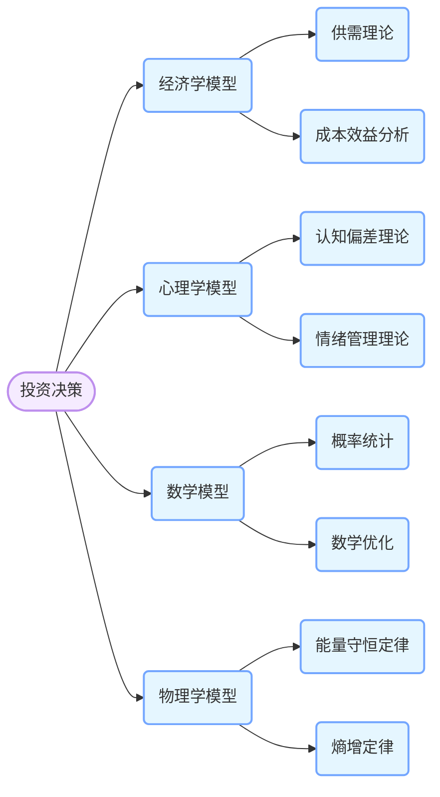

# 芒格的"心理模型"：提高投资决策的质量和效率

> 关键词：芒格、心理模型、投资决策、质量、效率

> 摘要：本文围绕芒格的“心理模型”展开，深入探讨其如何应用于投资决策以提高决策的质量和效率。首先介绍了相关背景，包括目的、预期读者等内容。接着阐述核心概念与联系，分析心理模型的原理和架构。详细讲解核心算法原理并给出 Python 源代码示例，介绍相关数学模型和公式。通过项目实战案例，对代码进行解读分析。探讨了心理模型在实际投资场景中的应用，推荐了学习、开发工具等相关资源。最后总结未来发展趋势与挑战，解答常见问题并提供扩展阅读和参考资料，旨在为投资者提供全面且深入的关于芒格心理模型在投资决策中应用的知识。

## 1. 背景介绍 
### 1.1 目的和范围
本文章的目的在于深入剖析芒格的“心理模型”，并阐述其在投资决策过程中如何提升决策的质量和效率。通过对心理模型的原理、算法、数学模型等方面的详细讲解，结合实际案例分析，帮助读者全面理解这一概念，并能够将其应用到实际的投资活动中。范围涵盖了心理模型的基本概念、核心算法、实际应用场景以及相关的学习资源和工具推荐等内容。

### 1.2 预期读者
本文预期读者主要包括对投资领域感兴趣的人士，无论是专业的投资者、金融从业者，还是初涉投资领域的新手，都能从本文中获取有价值的信息。同时，对于研究决策科学、行为经济学等相关领域的学者和学生，也具有一定的参考意义。

### 1.3 文档结构概述
本文将按照以下结构进行阐述：首先介绍背景信息，包括目的、预期读者和文档结构概述等；接着讲解核心概念与联系，通过文本示意图和 Mermaid 流程图展示心理模型的原理和架构；然后详细阐述核心算法原理并给出 Python 代码示例，介绍相关数学模型和公式；通过项目实战案例，对代码进行解读分析；探讨心理模型在实际投资场景中的应用；推荐学习、开发工具等相关资源；总结未来发展趋势与挑战；解答常见问题；最后提供扩展阅读和参考资料。

### 1.4 术语表
#### 1.4.1 核心术语定义
- **心理模型**：指的是人们在认知世界、处理信息和做出决策时所依据的一系列内在的思维模式和认知框架。芒格的心理模型是一套多元化的思维工具集合，涵盖了多个学科的知识和原理，用于辅助投资决策。
- **投资决策**：是指投资者在进行投资活动时，根据自身的投资目标、风险承受能力和市场情况等因素，对投资对象、投资时机、投资金额等方面做出的选择和判断。
- **决策质量**：衡量投资决策正确性和合理性的指标，包括对投资对象的评估准确性、风险控制能力等方面。
- **决策效率**：指在做出投资决策过程中所花费的时间和精力，以及决策过程的流畅性和及时性。

#### 1.4.2 相关概念解释
- **多元化思维**：强调从多个不同的学科和领域获取知识和视角，综合运用多种思维方式来分析和解决问题。在投资决策中，多元化思维可以帮助投资者避免单一思维模式的局限，更全面地评估投资机会。
- **认知偏差**：指人们在认知过程中由于各种因素的影响而产生的偏离客观事实的认知倾向。例如，过度自信、锚定效应、羊群效应等，这些认知偏差可能会导致投资决策的失误。

#### 1.4.3 缩略词列表
无

## 2. 核心概念与联系 
芒格的“心理模型”是一种综合性的思维工具，它融合了多个学科的知识和原理，旨在帮助投资者更全面、深入地理解投资问题，从而做出更明智的决策。其核心思想是通过建立多元化的思维模式，避免单一思维的局限性，从多个角度审视投资机会和风险。

### 心理模型的原理
心理模型的原理基于人类认知的本质。人类的认知是一个复杂的过程，受到多种因素的影响，包括个人经验、知识储备、情绪状态等。单一的思维模式往往无法全面、准确地反映客观世界，容易导致认知偏差和决策失误。芒格的心理模型通过引入多个学科的知识和原理，如经济学、心理学、数学、物理学等，构建了一个多元化的思维框架，使投资者能够从不同的角度看待问题，更全面地评估投资机会和风险。

### 心理模型的架构
心理模型的架构可以看作是一个由多个子模型组成的体系，每个子模型代表一个学科或领域的知识和原理。这些子模型相互关联、相互影响，共同构成了一个完整的思维工具集合。以下是一个简化的心理模型架构示意图：



在这个架构中，投资决策是核心目标，经济学模型、心理学模型、数学模型和物理学模型等子模型为投资决策提供了不同的视角和方法。每个子模型又包含了多个具体的理论和方法，如经济学模型中的供需理论和成本效益分析，心理学模型中的认知偏差理论和情绪管理理论等。

## 3. 核心算法原理 & 具体操作步骤 
### 核心算法原理
芒格的心理模型并没有一个固定的、统一的算法，而是一种思维方式和决策方法。其核心算法原理可以概括为以下几个步骤：

1. **问题定义**：明确投资决策的目标和问题，例如选择投资对象、确定投资时机等。
2. **知识收集**：从多个学科和领域收集相关的知识和信息，构建多元化的思维模型。
3. **分析评估**：运用不同的思维模型对投资问题进行分析和评估，从多个角度审视投资机会和风险。
4. **综合决策**：综合考虑各个思维模型的分析结果，做出最终的投资决策。

### 具体操作步骤
以下是使用 Python 代码实现一个简单的投资决策分析的示例，该示例主要运用了经济学和数学模型中的一些基本原理：

```python
# 定义投资对象类
class InvestmentObject:
    def __init__(self, name, expected_return, risk):
        self.name = name
        self.expected_return = expected_return
        self.risk = risk

    def __str__(self):
        return f"投资对象: {self.name}, 预期回报率: {self.expected_return}%, 风险: {self.risk}%"

# 定义投资决策函数
def investment_decision(investment_objects):
    best_object = None
    best_score = -float('inf')

    for obj in investment_objects:
        # 简单的评分公式：预期回报率 - 风险
        score = obj.expected_return - obj.risk
        if score > best_score:
            best_score = score
            best_object = obj

    return best_object

# 创建投资对象列表
investment_objects = [
    InvestmentObject("股票A", 15, 20),
    InvestmentObject("债券B", 8, 5),
    InvestmentObject("基金C", 12, 15)
]

# 进行投资决策
best_investment = investment_decision(investment_objects)

# 输出结果
print("最佳投资对象:")
print(best_investment)
```

### 代码解释
1. **InvestmentObject 类**：定义了一个投资对象类，包含投资对象的名称、预期回报率和风险等属性。
2. **investment_decision 函数**：实现了一个简单的投资决策算法，通过计算每个投资对象的评分（预期回报率 - 风险），选择评分最高的投资对象作为最佳投资对象。
3. **创建投资对象列表**：创建了一个包含三个投资对象的列表，分别是股票 A、债券 B 和基金 C。
4. **进行投资决策**：调用 investment_decision 函数进行投资决策，并输出最佳投资对象。

## 4. 数学模型和公式 & 详细讲解 & 举例说明 
### 数学模型和公式
在投资决策中，常用的数学模型和公式包括以下几个方面：

#### 1. 预期回报率公式
预期回报率是指投资对象在未来一段时间内预期获得的平均回报率。其计算公式为：

$$E(R) = \sum_{i=1}^{n} p_i R_i$$

其中，$E(R)$ 表示预期回报率，$p_i$ 表示第 $i$ 种可能情况发生的概率，$R_i$ 表示第 $i$ 种可能情况的回报率，$n$ 表示可能情况的总数。

#### 2. 风险度量公式
风险通常用标准差来度量，标准差反映了投资回报率的波动程度。其计算公式为：

$$\sigma = \sqrt{\sum_{i=1}^{n} p_i (R_i - E(R))^2}$$

其中，$\sigma$ 表示标准差，$p_i$、$R_i$ 和 $E(R)$ 的含义同上。

#### 3. 夏普比率公式
夏普比率是衡量投资组合风险调整后收益的指标，其计算公式为：

$$Sharpe Ratio = \frac{E(R_p) - R_f}{\sigma_p}$$

其中，$Sharpe Ratio$ 表示夏普比率，$E(R_p)$ 表示投资组合的预期回报率，$R_f$ 表示无风险利率，$\sigma_p$ 表示投资组合的标准差。

### 详细讲解
- **预期回报率公式**：该公式通过对各种可能情况的回报率进行加权平均，得到投资对象的预期回报率。权重为每种情况发生的概率，因此预期回报率反映了投资对象在不同情况下的平均收益水平。
- **风险度量公式**：标准差衡量了投资回报率相对于预期回报率的偏离程度，标准差越大，说明投资回报率的波动越大，风险也就越高。
- **夏普比率公式**：夏普比率衡量了投资组合每承担一单位风险所获得的超过无风险利率的额外收益。夏普比率越高，说明投资组合的风险调整后收益越好。

### 举例说明
假设我们有一个投资组合，包含两种股票 A 和 B，其相关信息如下：

| 股票 | 预期回报率 | 标准差 | 权重 |
| ---- | ---- | ---- | ---- |
| A | 15% | 20% | 0.6 |
| B | 10% | 15% | 0.4 |

无风险利率为 3%。

#### 1. 计算投资组合的预期回报率
根据预期回报率公式，投资组合的预期回报率为：

$$E(R_p) = 0.6 \times 15\% + 0.4 \times 10\% = 13\%$$

#### 2. 计算投资组合的标准差
假设股票 A 和 B 的相关系数为 0.5，根据投资组合标准差公式：

$$\sigma_p = \sqrt{w_A^2 \sigma_A^2 + w_B^2 \sigma_B^2 + 2 w_A w_B \rho_{AB} \sigma_A \sigma_B}$$

其中，$w_A$ 和 $w_B$ 分别为股票 A 和 B 的权重，$\sigma_A$ 和 $\sigma_B$ 分别为股票 A 和 B 的标准差，$\rho_{AB}$ 为股票 A 和 B 的相关系数。

将数据代入公式得：

$$\sigma_p = \sqrt{0.6^2 \times 0.2^2 + 0.4^2 \times 0.15^2 + 2 \times 0.6 \times 0.4 \times 0.5 \times 0.2 \times 0.15} \approx 0.16$$

#### 3. 计算投资组合的夏普比率
根据夏普比率公式，投资组合的夏普比率为：

$$Sharpe Ratio = \frac{13\% - 3\%}{0.16} = 0.625$$

通过以上计算，我们可以评估该投资组合的风险和收益情况，并与其他投资组合进行比较。

## 5. 项目实战：代码实际案例和详细解释说明 
### 5.1  开发环境搭建
为了运行本文中的 Python 代码，需要搭建以下开发环境：

1. **Python 安装**：建议安装 Python 3.7 及以上版本。可以从 Python 官方网站（https://www.python.org/downloads/）下载并安装。
2. **开发工具**：可以选择使用 PyCharm、VS Code 等集成开发环境（IDE），也可以使用 Jupyter Notebook 进行代码开发和调试。

### 5.2  源代码详细实现和代码解读
以下是一个更复杂的投资决策分析的 Python 代码示例，该示例考虑了多个因素，如预期回报率、风险、流动性等：

```python
import pandas as pd

# 定义投资对象类
class InvestmentObject:
    def __init__(self, name, expected_return, risk, liquidity):
        self.name = name
        self.expected_return = expected_return
        self.risk = risk
        self.liquidity = liquidity

    def __str__(self):
        return f"投资对象: {self.name}, 预期回报率: {self.expected_return}%, 风险: {self.risk}%, 流动性: {self.liquidity}"

# 定义投资决策函数
def investment_decision(investment_objects):
    data = []
    for obj in investment_objects:
        data.append([obj.name, obj.expected_return, obj.risk, obj.liquidity])

    df = pd.DataFrame(data, columns=['名称', '预期回报率', '风险', '流动性'])

    # 简单的评分公式：预期回报率 - 风险 + 流动性
    df['评分'] = df['预期回报率'] - df['风险'] + df['流动性']

    best_index = df['评分'].idxmax()
    best_object = investment_objects[best_index]

    return best_object

# 创建投资对象列表
investment_objects = [
    InvestmentObject("股票A", 15, 20, 3),
    InvestmentObject("债券B", 8, 5, 8),
    InvestmentObject("基金C", 12, 15, 5)
]

# 进行投资决策
best_investment = investment_decision(investment_objects)

# 输出结果
print("最佳投资对象:")
print(best_investment)
```

### 代码解读
1. **InvestmentObject 类**：定义了一个投资对象类，包含投资对象的名称、预期回报率、风险和流动性等属性。
2. **investment_decision 函数**：实现了一个更复杂的投资决策算法，通过将投资对象的信息存储在 Pandas 数据框中，计算每个投资对象的评分（预期回报率 - 风险 + 流动性），选择评分最高的投资对象作为最佳投资对象。
3. **创建投资对象列表**：创建了一个包含三个投资对象的列表，分别是股票 A、债券 B 和基金 C。
4. **进行投资决策**：调用 investment_decision 函数进行投资决策，并输出最佳投资对象。

### 5.3  代码解读与分析
通过这个代码示例，我们可以看到如何使用 Python 和 Pandas 库来实现一个更复杂的投资决策分析。在实际应用中，可以根据具体的需求和情况，调整评分公式和考虑更多的因素，如市场趋势、行业前景等。同时，还可以使用更复杂的数学模型和算法来进行投资决策分析，如机器学习算法、优化算法等。

## 6. 实际应用场景 
芒格的心理模型在实际投资决策中有广泛的应用场景，以下是一些常见的应用场景：

### 股票投资
在股票投资中，投资者可以运用心理模型从多个角度分析股票的投资价值。例如，运用经济学模型分析公司的财务状况、行业竞争格局和市场趋势；运用心理学模型分析投资者的情绪和行为，避免受到市场情绪的影响；运用数学模型计算股票的预期回报率、风险和夏普比率等指标，评估股票的投资风险和收益。

### 基金投资
在基金投资中，投资者可以运用心理模型选择合适的基金产品。例如，运用经济学模型分析基金的投资策略、资产配置和业绩表现；运用心理学模型分析基金经理的投资风格和决策过程，评估基金经理的能力和稳定性；运用数学模型计算基金的风险调整后收益和业绩排名，选择业绩优秀的基金产品。

### 债券投资
在债券投资中，投资者可以运用心理模型评估债券的信用风险和利率风险。例如，运用经济学模型分析债券发行人的财务状况、信用评级和行业前景；运用心理学模型分析市场参与者对债券的预期和情绪，判断债券价格的走势；运用数学模型计算债券的收益率、久期和凸性等指标，评估债券的投资价值和风险。

### 房地产投资
在房地产投资中，投资者可以运用心理模型分析房地产市场的供需关系、价格走势和投资风险。例如，运用经济学模型分析房地产市场的宏观经济环境、政策法规和人口趋势；运用心理学模型分析购房者和投资者的心理和行为，判断房地产市场的热度和预期；运用数学模型计算房地产的租金回报率、增值潜力和投资成本等指标，评估房地产的投资价值和风险。

## 7. 工具和资源推荐
### 7.1 学习资源推荐
#### 7.1.1 书籍推荐
- 《穷查理宝典：查理·芒格的智慧箴言录》：这本书收录了芒格的演讲、文章和访谈等内容，全面介绍了芒格的投资理念、思维方式和人生智慧，是学习芒格心理模型的必读之书。
- 《思考，快与慢》：作者丹尼尔·卡尼曼是行为经济学领域的先驱，这本书介绍了人类思维的两种模式——快思考和慢思考，并分析了认知偏差对决策的影响，对于理解芒格心理模型中的心理学原理有很大帮助。
- 《经济学原理》：作者 N·格里高利·曼昆是著名的经济学家，这本书是经济学领域的经典教材，系统介绍了经济学的基本原理和方法，对于理解芒格心理模型中的经济学原理有很大帮助。

#### 7.1.2 在线课程
- Coursera 上的“投资学”课程：该课程由知名大学的教授授课，系统介绍了投资学的基本原理和方法，包括股票投资、债券投资、基金投资等方面的内容。
- edX 上的“行为经济学”课程：该课程由著名经济学家授课，介绍了行为经济学的基本原理和应用，对于理解芒格心理模型中的心理学原理有很大帮助。

#### 7.1.3 技术博客和网站
- Seeking Alpha：这是一个专业的投资研究网站，提供了大量的股票分析、市场评论和投资策略等内容，对于投资者了解市场动态和投资机会有很大帮助。
- ValueWalk：这是一个专注于价值投资的博客网站，提供了大量的价值投资案例分析、投资理念和策略等内容，对于学习芒格的投资理念和方法有很大帮助。

### 7.2 开发工具框架推荐
#### 7.2.1 IDE和编辑器
- PyCharm：这是一款专业的 Python 集成开发环境，提供了丰富的代码编辑、调试和分析功能，适合专业的 Python 开发者使用。
- VS Code：这是一款轻量级的代码编辑器，支持多种编程语言，提供了丰富的插件和扩展功能，适合初学者和小型项目的开发。

#### 7.2.2 调试和性能分析工具
- PDB：这是 Python 自带的调试工具，提供了基本的调试功能，如设置断点、单步执行等。
- cProfile：这是 Python 自带的性能分析工具，用于分析 Python 程序的性能瓶颈，找出耗时较长的代码段。

#### 7.2.3 相关框架和库
- Pandas：这是一个强大的数据处理和分析库，提供了丰富的数据结构和数据处理方法，适合处理和分析投资数据。
- NumPy：这是一个用于科学计算的 Python 库，提供了高效的多维数组对象和数学函数，适合进行数值计算和数据分析。

### 7.3 相关论文著作推荐
#### 7.3.1 经典论文
- 《有效市场假说》：作者尤金·法玛，这篇论文提出了有效市场假说，认为市场价格已经反映了所有可用的信息，投资者无法通过分析历史数据和公开信息来获得超额收益。
- 《资本资产定价模型》：作者威廉·夏普，这篇论文提出了资本资产定价模型，用于描述资产的预期回报率与市场风险之间的关系。

#### 7.3.2 最新研究成果
- 《行为金融学：理论与实践》：该著作介绍了行为金融学的最新研究成果，分析了投资者的心理和行为对金融市场的影响。
- 《机器学习在投资决策中的应用》：该论文探讨了机器学习算法在投资决策中的应用，如股票预测、风险评估等。

#### 7.3.3 应用案例分析
- 《巴菲特的投资策略与案例分析》：该著作分析了巴菲特的投资策略和成功案例，对于学习芒格和巴菲特的投资理念和方法有很大帮助。
- 《量化投资案例分析》：该论文介绍了量化投资的基本原理和方法，并通过实际案例分析了量化投资在股票、期货等市场的应用。

## 8. 总结：未来发展趋势与挑战
### 未来发展趋势
- **多元化融合**：芒格的心理模型将与更多的学科和领域进行融合，如人工智能、大数据、区块链等，为投资决策提供更全面、深入的分析和支持。
- **智能化决策**：随着人工智能技术的发展，投资决策将越来越智能化。通过机器学习和深度学习算法，可以对大量的投资数据进行分析和挖掘，自动生成投资策略和决策建议。
- **个性化投资**：未来的投资决策将更加注重个性化。投资者可以根据自己的投资目标、风险承受能力和投资偏好，定制个性化的投资方案和策略。

### 挑战
- **数据质量和安全**：投资决策需要大量的高质量数据支持，但数据的收集、整理和分析过程中存在数据质量不高、数据安全等问题，需要加强数据管理和安全保障。
- **模型复杂性和解释性**：随着心理模型的不断发展和完善，模型的复杂性也在不断增加。如何在保证模型准确性的同时，提高模型的解释性和可理解性，是一个亟待解决的问题。
- **市场不确定性**：金融市场具有高度的不确定性，投资决策受到多种因素的影响，如宏观经济环境、政策法规、市场情绪等。如何在不确定性的市场环境中做出准确的投资决策，是投资者面临的最大挑战之一。

## 9. 附录：常见问题与解答
### 1. 芒格的心理模型适用于所有的投资领域吗？
芒格的心理模型是一种通用的思维方式和决策方法，适用于大多数投资领域。但不同的投资领域具有不同的特点和规律，在实际应用中需要根据具体情况进行调整和优化。

### 2. 如何构建自己的心理模型？
构建自己的心理模型需要不断学习和积累知识，从多个学科和领域获取知识和视角。可以通过阅读相关的书籍、文章和研究报告，参加培训课程和研讨会等方式，不断丰富自己的知识储备。同时，还需要通过实践和经验总结，不断优化和完善自己的心理模型。

### 3. 心理模型与传统的投资分析方法有什么区别？
心理模型与传统的投资分析方法的主要区别在于，心理模型更加注重从多个角度和层面分析问题，强调多元化思维和跨学科知识的应用。传统的投资分析方法往往侧重于单一的学科和方法，容易受到认知偏差和局限性的影响。

### 4. 如何评估心理模型的有效性？
评估心理模型的有效性可以从多个方面进行，如决策的准确性、风险控制能力、收益表现等。可以通过历史数据回测、模拟交易和实际投资等方式，对心理模型的有效性进行评估和验证。

## 10. 扩展阅读 & 参考资料
### 扩展阅读
- 《金融炼金术》：作者乔治·索罗斯，这本书介绍了索罗斯的投资理念和方法，对于理解投资市场的复杂性和不确定性有很大帮助。
- 《聪明的投资者》：作者本杰明·格雷厄姆，这本书是价值投资领域的经典著作，介绍了价值投资的基本原理和方法，对于学习芒格和巴菲特的投资理念有很大帮助。

### 参考资料
- 《穷查理宝典：查理·芒格的智慧箴言录》
- 《思考，快与慢》
- 《经济学原理》
- Coursera 上的“投资学”课程
- edX 上的“行为经济学”课程
- Seeking Alpha 网站
- ValueWalk 博客网站
- 《有效市场假说》论文
- 《资本资产定价模型》论文
- 《行为金融学：理论与实践》著作
- 《机器学习在投资决策中的应用》论文
- 《巴菲特的投资策略与案例分析》著作
- 《量化投资案例分析》论文

作者：AI天才研究院/AI Genius Institute & 禅与计算机程序设计艺术 /Zen And The Art of Computer Programming