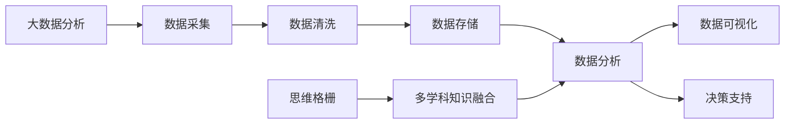

# 芒格的"思维格栅"在大数据分析中的运用

> 关键词：芒格、思维格栅、大数据分析、多学科融合、决策模型

> 摘要：本文深入探讨了芒格的“思维格栅”理论在大数据分析领域的运用。首先介绍了“思维格栅”的背景和核心概念，阐述其多学科融合的本质。接着分析了核心算法原理，通过 Python 代码展示在大数据分析中如何运用相关思维。详细讲解了涉及的数学模型和公式，并结合实际案例说明。通过项目实战，展示在大数据分析中运用“思维格栅”的具体操作和代码解读。探讨了其实际应用场景，推荐了相关学习资源、开发工具和论文著作。最后总结未来发展趋势与挑战，解答常见问题并提供扩展阅读与参考资料，旨在为大数据分析从业者提供新的思路和方法，提升分析的深度和决策的准确性。

## 1. 背景介绍 
### 1.1 目的和范围
本文章的目的在于探索芒格的“思维格栅”理论在大数据分析领域的实际应用。“思维格栅”理论强调从多学科的角度去看待问题和解决问题，而大数据分析在当今数字化时代涉及到众多领域的知识和技术。通过将两者结合，我们希望能够拓展大数据分析的思维边界，提高分析的准确性和有效性，为大数据分析提供新的理论支持和实践方法。本文的范围涵盖了“思维格栅”理论的核心概念、在大数据分析中的算法原理、数学模型、实际案例以及未来发展趋势等方面。

### 1.2 预期读者
本文预期读者包括大数据分析领域的专业人士，如数据分析师、数据科学家、算法工程师等，他们可以从“思维格栅”理论中获取新的分析思路和方法，提升自身的分析能力。同时，对大数据分析和多学科融合感兴趣的研究人员、学者也可以通过本文了解两者结合的可能性和应用前景。此外，企业的决策者和管理者也可以从中获得启示，更好地利用大数据分析进行决策。

### 1.3 文档结构概述
本文将按照以下结构进行阐述：首先介绍“思维格栅”理论的背景和相关术语，让读者对该理论有一个初步的了解。接着深入探讨“思维格栅”的核心概念及其与大数据分析的联系，通过文本示意图和 Mermaid 流程图进行直观展示。然后详细讲解在大数据分析中运用“思维格栅”的核心算法原理和具体操作步骤，结合 Python 代码进行说明。之后介绍相关的数学模型和公式，并举例说明其在实际中的应用。通过项目实战，展示在大数据分析中运用“思维格栅”的具体过程和代码解读。探讨其实际应用场景，推荐相关的学习资源、开发工具和论文著作。最后总结未来发展趋势与挑战，解答常见问题并提供扩展阅读与参考资料。

### 1.4 术语表
#### 1.4.1 核心术语定义
- **思维格栅**：由查理·芒格提出的一种思维模型，强调将不同学科的重要概念和方法整合在一起，形成一个相互关联的知识网络，用于更全面、深入地理解和解决问题。
- **大数据分析**：指对海量数据进行采集、存储、处理、分析和可视化的一系列技术和方法，以发现数据中的规律、趋势和价值。

#### 1.4.2 相关概念解释
- **多学科融合**：将不同学科的知识、方法和思维方式相互结合，打破学科界限，以解决复杂的现实问题。在“思维格栅”中，多学科融合是其核心思想，通过融合不同学科的概念和方法，能够从多个角度看待问题，提高分析的准确性和有效性。
- **决策模型**：在大数据分析中，决策模型是根据数据分析的结果，结合业务需求和目标，制定的用于指导决策的模型。“思维格栅”可以为决策模型的构建提供多学科的视角，使决策更加科学和合理。

#### 1.4.3 缩略词列表
- **AI**：Artificial Intelligence，人工智能
- **ML**：Machine Learning，机器学习
- **DL**：Deep Learning，深度学习

## 2. 核心概念与联系 

### 2.1 思维格栅的核心概念
芒格的“思维格栅”理论认为，世界是一个复杂的系统，单一学科的知识和方法往往无法全面、深入地理解和解决问题。因此，我们需要构建一个由不同学科的重要概念和方法组成的“思维格栅”，将这些知识和方法相互关联、相互融合，形成一个有机的整体。这个“思维格栅”就像一个多功能的工具包，我们可以根据不同的问题，从“思维格栅”中选取合适的工具和方法进行分析和解决。

例如，在分析一个商业问题时，我们不仅需要运用经济学的知识来分析市场供求关系和成本效益，还需要运用心理学的知识来了解消费者的行为和心理，运用社会学的知识来分析社会文化环境对商业活动的影响，运用数学的知识来进行数据分析和建模等。通过将这些不同学科的知识和方法结合起来，我们能够更全面、深入地理解商业问题，做出更准确、合理的决策。

### 2.2 大数据分析的核心概念
大数据分析是指对海量数据进行采集、存储、处理、分析和可视化的一系列技术和方法。大数据具有 4V 特征，即大量（Volume）、高速（Velocity）、多样（Variety）和价值（Value）。大数据分析的目的是从海量的数据中发现有价值的信息和知识，为企业和组织的决策提供支持。

大数据分析的流程通常包括数据采集、数据清洗、数据存储、数据分析和数据可视化等环节。在数据分析环节，常用的技术和方法包括机器学习、深度学习、统计分析、数据挖掘等。通过这些技术和方法，我们可以从数据中发现规律、趋势和异常，预测未来的发展趋势，为决策提供依据。

### 2.3 思维格栅与大数据分析的联系
思维格栅与大数据分析有着密切的联系。首先，大数据分析面临的问题往往是复杂的、多维度的，单一学科的知识和方法很难解决这些问题。而思维格栅强调多学科融合，能够为大数据分析提供更全面、深入的视角，帮助我们更好地理解和解决大数据分析中的问题。

其次，大数据分析涉及到众多领域的知识和技术，如数学、统计学、计算机科学、经济学、社会学等。思维格栅可以将这些不同领域的知识和方法整合在一起，形成一个有机的整体，使我们在进行大数据分析时能够更加灵活地运用各种知识和方法，提高分析的效率和准确性。

最后，思维格栅的决策模型可以为大数据分析的结果提供更科学、合理的解释和应用。在大数据分析中，我们通过数据分析得到了大量的信息和知识，但如何将这些信息和知识转化为实际的决策和行动，是一个关键的问题。思维格栅的决策模型可以结合多学科的知识和方法，对数据分析的结果进行综合评估和分析，为决策提供更全面、深入的支持。

### 2.4 文本示意图
思维格栅就像一个由不同学科的知识和方法组成的网格，每个网格代表一个学科的重要概念和方法。大数据分析则是在这个网格的基础上，对海量数据进行采集、存储、处理、分析和可视化的过程。在大数据分析中，我们可以从思维格栅中选取合适的工具和方法，对数据进行分析和处理，从而发现有价值的信息和知识。

### 2.5 Mermaid 流程图


## 3. 核心算法原理 & 具体操作步骤 

### 3.1 核心算法原理
在大数据分析中运用思维格栅的核心算法原理是将多学科的知识和方法融合在一起，形成一个综合的分析模型。具体来说，我们可以将不同学科的算法和模型进行组合和优化，以提高分析的准确性和有效性。

例如，在进行客户细分时，我们可以运用机器学习的聚类算法对客户数据进行聚类，同时运用心理学的知识对聚类结果进行解释和分析，了解不同客户群体的行为和心理特征。在进行市场预测时，我们可以运用统计学的时间序列分析方法对市场数据进行预测，同时运用经济学的知识对预测结果进行评估和分析，了解市场的供求关系和趋势。

### 3.2 Python 代码示例
以下是一个简单的 Python 代码示例，展示了如何运用思维格栅的思想进行客户细分。

```python
import pandas as pd
from sklearn.cluster import KMeans
from sklearn.preprocessing import StandardScaler
import matplotlib.pyplot as plt

# 读取客户数据
data = pd.read_csv('customer_data.csv')

# 数据预处理
# 选择需要分析的特征
features = ['age', 'income', 'purchase_frequency']
X = data[features]

# 数据标准化
scaler = StandardScaler()
X_scaled = scaler.fit_transform(X)

# 运用 KMeans 聚类算法进行客户细分
kmeans = KMeans(n_clusters=3, random_state=42)
kmeans.fit(X_scaled)

# 将聚类结果添加到原始数据中
data['cluster'] = kmeans.labels_

# 分析不同客户群体的特征
cluster_means = data.groupby('cluster')[features].mean()
print(cluster_means)

# 可视化聚类结果
plt.scatter(data['age'], data['income'], c=data['cluster'], cmap='viridis')
plt.xlabel('Age')
plt.ylabel('Income')
plt.title('Customer Segmentation')
plt.show()
```

### 3.3 具体操作步骤
1. **数据采集**：收集与分析问题相关的大数据，包括结构化数据和非结构化数据。
2. **数据清洗**：对采集到的数据进行清洗和预处理，去除噪声和缺失值，统一数据格式。
3. **特征选择**：根据分析问题的需求，选择合适的特征进行分析。
4. **数据标准化**：对选择的特征进行标准化处理，使不同特征具有相同的尺度。
5. **算法选择**：根据分析问题的特点，选择合适的算法和模型进行分析。
6. **模型训练**：运用选择的算法和模型对数据进行训练，得到分析结果。
7. **结果解释**：运用多学科的知识和方法对分析结果进行解释和分析，了解结果的含义和意义。
8. **决策支持**：根据分析结果和解释，为决策提供支持和建议。

## 4. 数学模型和公式 & 详细讲解 & 举例说明 

### 4.1 数学模型和公式
在大数据分析中运用思维格栅，涉及到多个学科的数学模型和公式。以下是一些常见的数学模型和公式及其详细讲解。

#### 4.1.1 线性回归模型
线性回归模型是一种常用的统计模型，用于预测一个连续变量与一个或多个自变量之间的关系。其数学公式为：

$$y = \beta_0 + \beta_1x_1 + \beta_2x_2 + \cdots + \beta_nx_n + \epsilon$$

其中，$y$ 是因变量，$x_1, x_2, \cdots, x_n$ 是自变量，$\beta_0, \beta_1, \beta_2, \cdots, \beta_n$ 是回归系数，$\epsilon$ 是误差项。

#### 4.1.2 逻辑回归模型
逻辑回归模型是一种常用的分类模型，用于预测一个离散变量与一个或多个自变量之间的关系。其数学公式为：

$$P(y = 1|x) = \frac{1}{1 + e^{-(\beta_0 + \beta_1x_1 + \beta_2x_2 + \cdots + \beta_nx_n)}}$$

其中，$P(y = 1|x)$ 是在给定自变量 $x$ 的情况下，因变量 $y$ 取值为 1 的概率，$\beta_0, \beta_1, \beta_2, \cdots, \beta_n$ 是回归系数。

#### 4.1.3 聚类算法
聚类算法是一种无监督学习算法，用于将数据集中的样本分为不同的簇。常见的聚类算法包括 KMeans 算法、层次聚类算法等。

KMeans 算法的目标是将数据集划分为 $k$ 个簇，使得每个簇内的样本相似度最高，不同簇之间的样本相似度最低。其数学公式为：

$$\min \sum_{i = 1}^{k} \sum_{x_j \in C_i} \|x_j - \mu_i\|^2$$

其中，$k$ 是簇的数量，$C_i$ 是第 $i$ 个簇，$\mu_i$ 是第 $i$ 个簇的中心，$x_j$ 是数据集中的第 $j$ 个样本。

### 4.2 详细讲解
- **线性回归模型**：线性回归模型的目标是找到一组回归系数 $\beta_0, \beta_1, \beta_2, \cdots, \beta_n$，使得预测值与实际值之间的误差最小。通常使用最小二乘法来估计回归系数。
- **逻辑回归模型**：逻辑回归模型的目标是找到一组回归系数 $\beta_0, \beta_1, \beta_2, \cdots, \beta_n$，使得预测的概率与实际的概率之间的误差最小。通常使用最大似然估计法来估计回归系数。
- **聚类算法**：聚类算法的目标是将数据集划分为不同的簇，使得每个簇内的样本相似度最高，不同簇之间的样本相似度最低。KMeans 算法通过迭代的方式不断更新簇的中心，直到收敛为止。

### 4.3 举例说明
以下是一个使用线性回归模型进行房价预测的例子。

```python
import pandas as pd
from sklearn.linear_model import LinearRegression
from sklearn.model_selection import train_test_split
from sklearn.metrics import mean_squared_error

# 读取房价数据
data = pd.read_csv('house_prices.csv')

# 选择特征和目标变量
features = ['area', 'bedrooms', 'bathrooms']
X = data[features]
y = data['price']

# 划分训练集和测试集
X_train, X_test, y_train, y_test = train_test_split(X, y, test_size=0.2, random_state=42)

# 训练线性回归模型
model = LinearRegression()
model.fit(X_train, y_train)

# 预测房价
y_pred = model.predict(X_test)

# 计算均方误差
mse = mean_squared_error(y_test, y_pred)
print('Mean Squared Error:', mse)
```

在这个例子中，我们使用线性回归模型来预测房价。首先，我们读取房价数据，选择特征和目标变量。然后，我们将数据集划分为训练集和测试集，训练线性回归模型。最后，我们使用训练好的模型对测试集进行预测，并计算均方误差。

## 5. 项目实战：代码实际案例和详细解释说明 

### 5.1  开发环境搭建
在进行大数据分析项目实战时，我们需要搭建相应的开发环境。以下是搭建开发环境的步骤：

1. **安装 Python**：Python 是一种常用的编程语言，在大数据分析领域有着广泛的应用。我们可以从 Python 官方网站下载并安装 Python。
2. **安装 Anaconda**：Anaconda 是一个开源的 Python 发行版本，包含了许多常用的数据分析库和工具。我们可以从 Anaconda 官方网站下载并安装 Anaconda。
3. **安装数据分析库**：在 Anaconda 环境中，我们可以使用 `conda` 命令或 `pip` 命令安装常用的数据分析库，如 Pandas、NumPy、Scikit-learn、Matplotlib 等。

### 5.2  源代码详细实现和代码解读
以下是一个使用思维格栅思想进行电商用户购买行为预测的项目实战案例。

```python
import pandas as pd
from sklearn.model_selection import train_test_split
from sklearn.ensemble import RandomForestClassifier
from sklearn.metrics import accuracy_score, confusion_matrix
import matplotlib.pyplot as plt
import seaborn as sns

# 读取电商用户数据
data = pd.read_csv('ecommerce_user_data.csv')

# 数据预处理
# 处理缺失值
data = data.dropna()

# 选择特征和目标变量
features = ['age', 'gender', 'purchase_frequency', 'average_order_value']
X = data[features]
y = data['will_purchase']

# 处理分类变量
X = pd.get_dummies(X)

# 划分训练集和测试集
X_train, X_test, y_train, y_test = train_test_split(X, y, test_size=0.2, random_state=42)

# 训练随机森林分类器
model = RandomForestClassifier(n_estimators=100, random_state=42)
model.fit(X_train, y_train)

# 预测用户购买行为
y_pred = model.predict(X_test)

# 评估模型性能
accuracy = accuracy_score(y_test, y_pred)
print('Accuracy:', accuracy)

# 绘制混淆矩阵
cm = confusion_matrix(y_test, y_pred)
sns.heatmap(cm, annot=True, fmt='d', cmap='Blues')
plt.xlabel('Predicted')
plt.ylabel('Actual')
plt.title('Confusion Matrix')
plt.show()
```

### 5.3  代码解读与分析
1. **数据读取**：使用 Pandas 库的 `read_csv` 函数读取电商用户数据。
2. **数据预处理**：处理缺失值，选择特征和目标变量，处理分类变量。
3. **划分训练集和测试集**：使用 `train_test_split` 函数将数据集划分为训练集和测试集。
4. **模型训练**：使用随机森林分类器对训练集进行训练