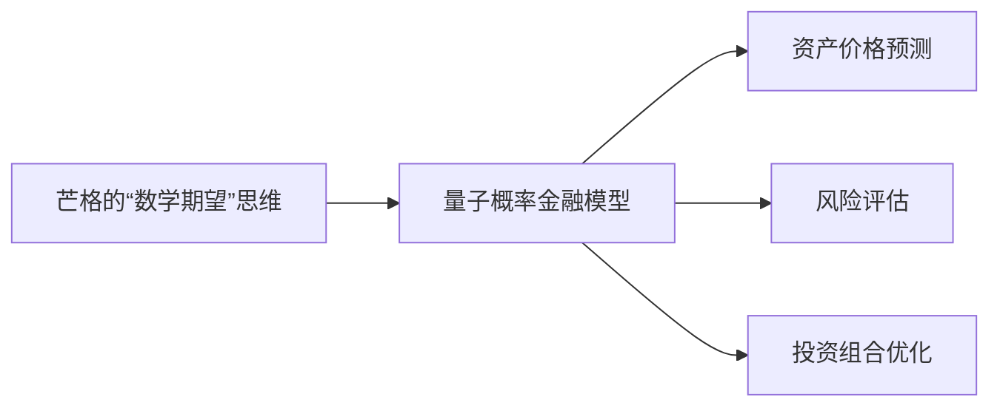

# 芒格的“数学期望”思维在量子概率金融模型中的应用

> 关键词：芒格、数学期望、量子概率、金融模型、应用

> 摘要：本文深入探讨了芒格的“数学期望”思维在量子概率金融模型中的应用。首先介绍了相关背景，包括目的范围、预期读者等。接着阐述了核心概念及联系，分析了核心算法原理并给出 Python 代码示例，详细讲解了数学模型和公式。通过项目实战展示了代码的实际应用，探讨了其在实际场景中的应用。同时推荐了学习资源、开发工具和相关论文著作。最后总结了未来发展趋势与挑战，并对常见问题进行了解答，为读者全面理解“数学期望”思维在量子概率金融模型中的应用提供了深入的指导。

## 1. 背景介绍 
### 1.1 目的和范围
本文章旨在探索芒格的“数学期望”思维在量子概率金融模型中的具体应用方式和潜在价值。通过结合经典的投资思维与前沿的量子概率理论，为金融领域的决策和建模提供新的视角和方法。范围涵盖了从理论原理的阐述到实际项目的应用，以及对相关资源的推荐和未来发展的展望。

### 1.2 预期读者
本文预期读者包括金融领域的从业者，如投资经理、分析师、交易员等，他们可以从新的思维方式和模型应用中获取灵感，优化投资决策。同时也适合对量子计算、概率理论和金融数学交叉领域感兴趣的科研人员和学生，为他们的研究和学习提供参考。

### 1.3 文档结构概述
本文首先介绍背景信息，让读者了解研究的目的和适用人群。接着阐述核心概念与联系，帮助读者建立起相关知识体系。然后详细讲解核心算法原理和数学模型，并用 Python 代码进行实现。通过项目实战展示实际应用，分析在不同场景下的可行性。随后推荐学习资源、开发工具和相关论文，为读者深入学习提供方向。最后总结未来趋势和挑战，解答常见问题，并提供扩展阅读和参考资料。

### 1.4 术语表
#### 1.4.1 核心术语定义
- **数学期望**：在概率论和统计学中，数学期望是试验中每次可能结果的概率乘以其结果的总和，它反映了随机变量取值的平均水平。对于离散型随机变量 $X$，其数学期望 $E(X)=\sum_{i}x_{i}p_{i}$，其中 $x_{i}$ 是可能的取值，$p_{i}$ 是对应取值的概率。
- **量子概率**：量子概率是基于量子力学的概率理论，与经典概率不同，它考虑了量子态的叠加和纠缠等特性，用于描述量子系统中的不确定性。
- **金融模型**：用于描述金融市场中各种变量之间关系的数学模型，可用于预测资产价格、评估风险等。

#### 1.4.2 相关概念解释
- **芒格的“数学期望”思维**：查理·芒格强调在投资决策中运用数学期望来评估潜在的收益和风险。通过计算不同投资方案的数学期望，选择具有正期望收益的项目。
- **量子概率金融模型**：结合量子概率理论构建的金融模型，利用量子态的特性来更准确地描述金融市场的不确定性和复杂性。

#### 1.4.3 缩略词列表
- **QPF 模型**：量子概率金融（Quantum Probability Finance）模型

## 2. 核心概念与联系 
### 核心概念原理
#### 数学期望原理
数学期望是对随机变量长期平均结果的一种度量。以投资为例，假设一项投资有 $n$ 种可能的结果，第 $i$ 种结果的收益为 $x_{i}$，发生的概率为 $p_{i}$，则该投资的数学期望收益 $E(X)=\sum_{i = 1}^{n}x_{i}p_{i}$。如果 $E(X)>0$，从长期来看，该投资可能是盈利的；反之，如果 $E(X)<0$，则可能亏损。

#### 量子概率原理
在量子力学中，量子系统的状态可以用波函数来描述。波函数的模的平方表示在某个测量结果出现的概率。与经典概率不同，量子概率允许态的叠加和纠缠。例如，一个量子比特可以同时处于 0 和 1 的叠加态，其概率分布由波函数决定。

#### 量子概率金融模型原理
量子概率金融模型将量子概率的概念引入金融领域，用于描述金融资产价格的波动和不确定性。通过构建量子态来表示金融市场的不同状态，利用量子概率的计算方法来预测资产价格的变化。

### 架构的文本示意图
```plaintext
              芒格的“数学期望”思维
                     |
                     | 应用于
                     v
           量子概率金融模型
           /           |           \
  资产价格预测      风险评估      投资组合优化
```

### Mermaid 流程图


## 3. 核心算法原理 & 具体操作步骤 
### 核心算法原理
在量子概率金融模型中应用数学期望思维，核心在于计算不同金融状态下的数学期望。首先，需要确定金融市场的可能状态及其对应的概率。这些状态可以是资产价格的不同取值范围，概率则可以通过量子概率模型来计算。然后，根据每个状态下的收益或损失，计算数学期望。

### 具体操作步骤
1. **定义金融市场状态**：确定金融市场可能出现的状态集合 $S=\{s_{1}, s_{2}, \cdots, s_{n}\}$，例如不同的资产价格区间。
2. **计算量子概率**：利用量子概率模型计算每个状态 $s_{i}$ 出现的概率 $p_{i}$。
3. **确定收益函数**：定义在每个状态 $s_{i}$ 下的收益 $x_{i}$，可以是投资的回报率等。
4. **计算数学期望**：根据数学期望公式 $E(X)=\sum_{i = 1}^{n}x_{i}p_{i}$ 计算投资的数学期望收益。

### Python 源代码实现
```python
import numpy as np

# 定义金融市场状态
states = [100, 110, 120, 130]

# 计算量子概率（这里简单假设概率分布）
probabilities = [0.1, 0.3, 0.4, 0.2]

# 确定收益函数（假设初始投资为 100）
returns = [state - 100 for state in states]

# 计算数学期望
expected_return = np.sum(np.array(returns) * np.array(probabilities))

print(f"投资的数学期望收益为: {expected_return}")
```

### 代码解释
1. 首先，定义了金融市场的可能状态 `states`，表示不同的资产价格。
2. 然后，假设了每个状态出现的概率 `probabilities`。在实际应用中，这些概率需要通过量子概率模型来计算。
3. 接着，根据初始投资和每个状态下的资产价格，计算了每个状态下的收益 `returns`。
4. 最后，使用 `numpy` 库计算了数学期望收益，并将结果打印输出。

## 4. 数学模型和公式 & 详细讲解 & 举例说明 
### 数学期望公式
在离散情况下，对于随机变量 $X$，其数学期望 $E(X)$ 的计算公式为：
$$E(X)=\sum_{i = 1}^{n}x_{i}p_{i}$$
其中，$x_{i}$ 是随机变量 $X$ 的第 $i$ 个可能取值，$p_{i}$ 是取值 $x_{i}$ 出现的概率，且 $\sum_{i = 1}^{n}p_{i}=1$。

### 量子概率计算
在量子力学中，假设量子系统的状态可以用波函数 $\psi$ 表示。对于一个测量结果 $m$，其出现的概率 $P(m)$ 可以通过波函数在对应本征态上的投影来计算。假设 $\psi=\sum_{j}c_{j}\varphi_{j}$，其中 $\varphi_{j}$ 是本征态，$c_{j}$ 是系数，则测量结果 $m$ 对应的本征态为 $\varphi_{m}$，其概率为 $P(m)=|c_{m}|^{2}$。

### 量子概率金融模型中的数学期望
在量子概率金融模型中，设金融市场的状态集合为 $S=\{s_{1}, s_{2}, \cdots, s_{n}\}$，每个状态 $s_{i}$ 出现的量子概率为 $p_{i}$，在状态 $s_{i}$ 下的收益为 $x_{i}$，则投资的数学期望收益为：
$$E(X)=\sum_{i = 1}^{n}x_{i}p_{i}$$

### 举例说明
假设我们有一项投资，金融市场有三种可能状态：上涨、持平、下跌。对应的资产价格分别为 120、100、80，初始投资为 100。通过量子概率模型计算得到三种状态出现的概率分别为 0.3、0.5、0.2。则每种状态下的收益分别为 20、0、 - 20。根据数学期望公式，投资的数学期望收益为：
$$E(X)=20\times0.3 + 0\times0.5+(-20)\times0.2=6 + 0 - 4 = 2$$
这意味着从长期来看，这项投资平均每次可以获得 2 的收益。

## 5. 项目实战：代码实际案例和详细解释说明 
### 5.1  开发环境搭建
#### 安装 Python
首先，确保你已经安装了 Python 3.x 版本。可以从 Python 官方网站（https://www.python.org/downloads/）下载并安装适合你操作系统的版本。

#### 安装必要的库
在本项目中，我们需要使用 `numpy` 库进行数值计算。可以使用以下命令来安装：
```sh
pip install numpy
```

### 5.2  源代码详细实现和代码解读
```python
import numpy as np

# 定义金融市场状态
states = [90, 100, 110, 120]

# 模拟量子概率计算（这里使用简单的概率分布）
def quantum_probability():
    total_states = len(states)
    # 简单假设概率均匀分布
    probabilities = [1 / total_states] * total_states
    return probabilities

# 计算每个状态下的收益
def calculate_returns(initial_investment):
    returns = [state - initial_investment for state in states]
    return returns

# 计算数学期望收益
def calculate_expected_return(probabilities, returns):
    expected_return = np.sum(np.array(returns) * np.array(probabilities))
    return expected_return

# 主函数
def main():
    initial_investment = 100
    probabilities = quantum_probability()
    returns = calculate_returns(initial_investment)
    expected_return = calculate_expected_return(probabilities, returns)
    print(f"初始投资: {initial_investment}")
    print(f"金融市场状态: {states}")
    print(f"状态概率: {probabilities}")
    print(f"每个状态下的收益: {returns}")
    print(f"投资的数学期望收益: {expected_return}")

if __name__ == "__main__":
    main()
```

### 代码解读与分析
1. **定义金融市场状态**：`states` 列表存储了金融市场可能出现的不同资产价格。
2. **模拟量子概率计算**：`quantum_probability` 函数简单地假设每个状态出现的概率是均匀分布的。在实际应用中，需要使用更复杂的量子概率模型来计算。
3. **计算每个状态下的收益**：`calculate_returns` 函数根据初始投资和每个状态下的资产价格，计算出每个状态下的收益。
4. **计算数学期望收益**：`calculate_expected_return` 函数使用 `numpy` 库计算投资的数学期望收益。
5. **主函数**：`main` 函数调用上述函数，完成整个计算过程，并将结果打印输出。

通过这个项目实战，我们可以看到如何将芒格的“数学期望”思维应用到量子概率金融模型中，通过计算数学期望收益来评估投资的可行性。

## 6. 实际应用场景 
### 资产价格预测
在资产价格预测中，量子概率金融模型可以更准确地描述市场的不确定性。通过计算不同价格状态下的数学期望，可以预测资产价格的长期趋势。例如，对于股票价格的预测，考虑到市场的各种因素，如宏观经济数据、公司业绩等，利用量子概率模型计算不同价格区间出现的概率，再结合数学期望思维，得到股票价格的预期走势。

### 风险评估
在风险评估方面，数学期望可以作为一个重要的指标。通过计算投资组合在不同市场状态下的数学期望收益，可以评估投资组合的风险水平。如果数学期望收益较低且波动较大，说明投资组合的风险较高；反之，如果数学期望收益较高且相对稳定，则风险较低。量子概率金融模型可以更精确地描述市场状态和概率分布，从而提高风险评估的准确性。

### 投资组合优化
在投资组合优化中，利用量子概率金融模型和数学期望思维，可以选择最优的投资组合。通过计算不同投资组合在各种市场状态下的数学期望收益，选择具有最大数学期望收益的投资组合。同时，考虑到风险因素，可以在一定的风险约束下，寻找最优的投资组合配置。

## 7. 工具和资源推荐
### 7.1 学习资源推荐
#### 7.1.1 书籍推荐
- 《穷查理宝典：查理·芒格的智慧箴言录》：这本书详细介绍了查理·芒格的投资理念和思维方式，包括“数学期望”思维的应用。
- 《量子力学导论》：对于理解量子概率理论有很大帮助，为学习量子概率金融模型提供基础。
- 《金融数学》：涵盖了金融领域中常用的数学模型和方法，有助于深入理解金融模型的构建和应用。

#### 7.1.2 在线课程
- Coursera 上的“Quantum Computing for Everyone”：该课程介绍了量子计算的基本概念和原理，为理解量子概率提供了基础。
- edX 上的“Financial Engineering and Risk Management”：课程涵盖了金融工程和风险管理的相关知识，包括金融模型的构建和应用。

#### 7.1.3 技术博客和网站
- arXiv.org：提供了大量的学术论文，包括量子计算、金融数学等领域的最新研究成果。
- Medium 上的金融科技相关博客：可以了解到金融领域的最新技术和应用案例。

### 7.2 开发工具框架推荐
#### 7.2.1 IDE和编辑器
- PyCharm：一款功能强大的 Python 集成开发环境，适合进行 Python 代码的开发和调试。
- Jupyter Notebook：交互式的开发环境，适合进行数据分析和模型验证。

#### 7.2.2 调试和性能分析工具
- `pdb`：Python 内置的调试工具，可以帮助定位代码中的问题。
- `cProfile`：用于分析 Python 代码的性能，找出性能瓶颈。

#### 7.2.3 相关框架和库
- `qiskit`：IBM 开发的量子计算框架，可用于实现量子概率计算。
- `pandas`：用于数据处理和分析的 Python 库，在金融数据处理中非常有用。

### 7.3 相关论文著作推荐
#### 7.3.1 经典论文
- “Quantum Probability in Financial Modeling”：该论文探讨了量子概率在金融模型中的应用，为量子概率金融模型的发展奠定了基础。
- “The Use of Mathematical Expectation in Investment Decision - Making”：介绍了数学期望在投资决策中的应用方法和重要性。

#### 7.3.2 最新研究成果
- 在 arXiv.org 上搜索“Quantum Probability Finance”可以找到该领域的最新研究论文，了解量子概率金融模型的最新发展动态。

#### 7.3.3 应用案例分析
- 一些金融科技公司的研究报告，会介绍量子概率金融模型在实际项目中的应用案例和效果评估。

## 8. 总结：未来发展趋势与挑战
### 未来发展趋势
- **更精确的模型构建**：随着量子计算技术的不断发展，量子概率金融模型将更加精确地描述金融市场的不确定性。通过结合更多的市场因素和数据，模型的预测能力将得到进一步提升。
- **跨学科融合**：量子概率金融模型将与人工智能、机器学习等领域进行更深入的融合。例如，利用机器学习算法来优化量子概率模型的参数，提高模型的性能。
- **广泛应用**：该模型将在金融领域得到更广泛的应用，包括银行、证券、保险等行业。在风险管理、投资决策、资产定价等方面发挥重要作用。

### 挑战
- **量子计算技术的限制**：目前量子计算技术还处于发展阶段，存在计算资源有限、噪声干扰等问题。这限制了量子概率金融模型的大规模应用和精确计算。
- **数据质量和隐私问题**：金融数据的质量和隐私是一个重要问题。在构建量子概率金融模型时，需要大量准确的金融数据，但同时要保护数据的隐私和安全。
- **人才短缺**：量子概率金融模型涉及量子力学、金融数学、计算机科学等多个领域的知识，目前相关的专业人才短缺，这限制了该领域的发展。

## 9. 附录：常见问题与解答
### 问题 1：量子概率和经典概率有什么区别？
量子概率考虑了量子态的叠加和纠缠等特性，与经典概率不同。在经典概率中，事件的发生是相互独立的；而在量子概率中，量子态可以同时处于多个状态的叠加，测量结果具有不确定性。

### 问题 2：如何计算量子概率？
计算量子概率需要使用量子力学的理论和方法。通常，需要构建量子态的波函数，通过波函数在对应本征态上的投影来计算测量结果的概率。在实际应用中，可以使用量子计算框架如 `qiskit` 来实现量子概率的计算。

### 问题 3：量子概率金融模型是否适用于所有金融市场？
量子概率金融模型在理论上可以应用于各种金融市场，但在实际应用中，需要考虑市场的特点和数据的可用性。对于一些复杂的金融市场，量子概率金融模型可能更能准确地描述市场的不确定性；而对于一些简单的市场，经典的金融模型可能已经足够。

### 问题 4：如何学习量子概率金融模型？
可以从学习量子力学和金融数学的基础知识开始，阅读相关的书籍和论文。同时，可以参加在线课程，学习量子计算和金融模型的构建方法。通过实践项目，加深对量子概率金融模型的理解和应用能力。

## 10. 扩展阅读 & 参考资料
### 扩展阅读
- 《从量子力学到金融市场：量子金融的崛起》
- 《金融科技前沿：量子计算在金融领域的应用》

### 参考资料
- 《量子力学原理》，作者：P. A. M. Dirac
- 《金融市场的计量经济学》，作者：Terence C. Mills

作者：AI天才研究院/AI Genius Institute & 禅与计算机程序设计艺术 /Zen And The Art of Computer Programming