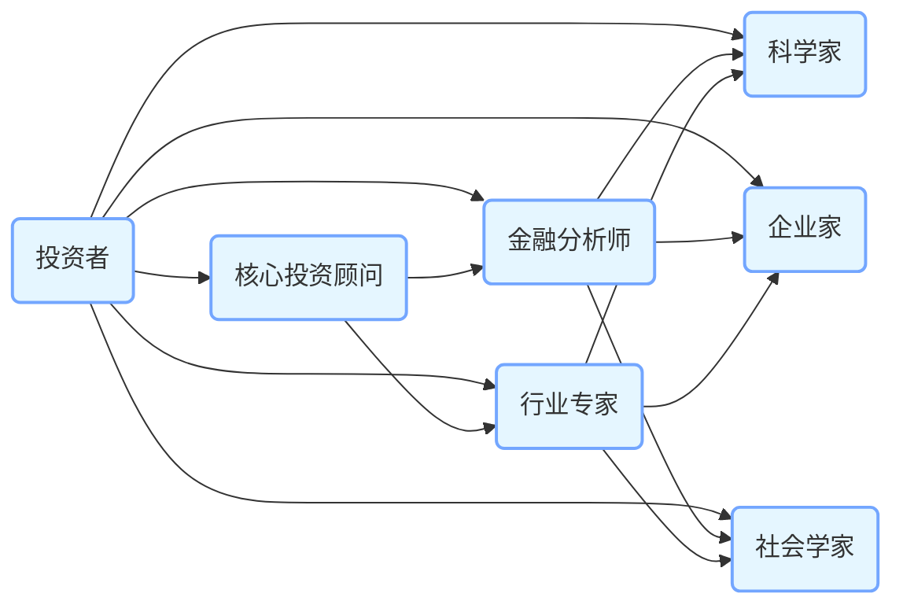

# 芒格的"智者圈"理论：如何构建你的投资智囊团

> 关键词：芒格、智者圈理论、投资智囊团、投资决策、信息整合

> 摘要：本文深入探讨了芒格的“智者圈”理论，阐述了该理论的核心概念与重要性。通过详细分析构建投资智囊团的步骤、相关算法原理以及数学模型，结合实际项目案例，揭示了如何利用这一理论优化投资决策。同时，介绍了在实际应用场景中该理论的价值，推荐了学习资源、开发工具框架和相关论文著作，最后对未来发展趋势与挑战进行了总结，并提供常见问题解答和扩展阅读参考资料，旨在帮助投资者更好地理解和运用“智者圈”理论构建有效的投资智囊团。

## 1. 背景介绍 
### 1.1 目的和范围
在当今复杂多变的投资环境中，投资者面临着海量的信息和众多的决策挑战。芒格的“智者圈”理论为投资者提供了一种有效的应对策略。本文的目的在于深入剖析“智者圈”理论的内涵，详细阐述如何基于该理论构建投资智囊团，以提高投资决策的质量和成功率。范围涵盖理论的原理、构建步骤、实际应用以及相关的学习资源和发展趋势等方面。

### 1.2 预期读者
本文预期读者包括对投资领域有兴趣的个人投资者、金融从业者、投资机构研究人员以及对芒格思想和投资策略感兴趣的学者和爱好者。无论您是初涉投资领域的新手，还是经验丰富的专业人士，都能从本文中获得有价值的信息和启发。

### 1.3 文档结构概述
本文将按照以下结构展开：首先介绍“智者圈”理论的背景和相关术语；接着阐述核心概念与联系，包括原理和架构；然后详细讲解核心算法原理和具体操作步骤，并结合数学模型和公式进行说明；通过项目实战展示代码实际案例和详细解释；探讨实际应用场景；推荐相关的工具和资源；总结未来发展趋势与挑战；提供常见问题解答和扩展阅读参考资料。

### 1.4 术语表
#### 1.4.1 核心术语定义
- **芒格的“智者圈”理论**：由查理·芒格提出的一种思想，强调投资者应构建一个由不同领域的智者组成的圈子，通过与这些智者的交流和互动，获取多元化的观点和信息，以辅助投资决策。
- **投资智囊团**：基于“智者圈”理论构建的一个团队，成员包括具有不同专业知识、经验和背景的人士，他们共同为投资决策提供建议和支持。

#### 1.4.2 相关概念解释
- **多元化观点**：指来自不同领域、不同视角的观点和看法，有助于投资者打破思维局限，全面、客观地分析投资问题。
- **信息整合**：将来自不同渠道、不同类型的信息进行筛选、整理和分析，以提取有价值的信息，为投资决策提供依据。

#### 1.4.3 缩略词列表
无

## 2. 核心概念与联系 
### 2.1 “智者圈”理论原理
芒格认为，投资决策不应仅仅依赖于单一的知识和经验，而应广泛吸收不同领域的智慧。“智者圈”就是一个汇聚了各个领域专家和智者的圈子，通过与他们的交流和互动，投资者可以获取到多元化的观点和信息，从而更全面、深入地理解投资对象和市场环境。例如，在评估一家科技公司的投资价值时，不仅需要了解该公司的技术实力和市场前景，还需要考虑行业趋势、宏观经济环境、法律法规等因素。通过与科技专家、经济学家、律师等不同领域的智者交流，可以获得更丰富的信息和更全面的观点，从而做出更明智的投资决策。

### 2.2 投资智囊团架构
投资智囊团的架构可以分为核心层、紧密层和外围层。核心层由投资者本人和几位关键的投资顾问组成，他们负责制定投资策略和决策。紧密层由与投资领域密切相关的专业人士组成，如金融分析师、行业专家等，他们为核心层提供专业的分析和建议。外围层由来自不同领域的智者组成，如科学家、企业家、社会学家等，他们为投资决策提供多元化的观点和创新的思路。

以下是投资智囊团架构的 Mermaid 流程图：


### 2.3 核心概念之间的联系
“智者圈”理论是构建投资智囊团的理论基础，投资智囊团是“智者圈”理论的具体实践形式。通过构建投资智囊团，投资者可以将“智者圈”理论应用到实际投资决策中，实现多元化观点的获取和信息的整合。同时，投资智囊团的有效运作也需要遵循“智者圈”理论的原则，即注重成员的多元化和知识的互补性，以确保能够获取到全面、客观的信息和建议。

## 3. 核心算法原理 & 具体操作步骤 
### 3.1 核心算法原理
在构建投资智囊团的过程中，可以采用一种基于信息熵的算法来评估智囊团成员的价值和贡献。信息熵是信息论中的一个概念，用于衡量信息的不确定性。在投资领域，信息熵可以用来衡量智囊团成员提供的信息的价值和多样性。具体来说，信息熵越高，说明成员提供的信息越不确定，其价值和多样性也越高。

以下是基于信息熵的算法的 Python 源代码实现：
```python
import math

def calculate_entropy(probabilities):
    entropy = 0
    for p in probabilities:
        if p > 0:
            entropy -= p * math.log2(p)
    return entropy

# 示例：假设有三位智囊团成员，他们提供的信息的概率分布分别为
probabilities_member1 = [0.2, 0.3, 0.5]
probabilities_member2 = [0.1, 0.4, 0.5]
probabilities_member3 = [0.3, 0.3, 0.4]

entropy_member1 = calculate_entropy(probabilities_member1)
entropy_member2 = calculate_entropy(probabilities_member2)
entropy_member3 = calculate_entropy(probabilities_member3)

print(f"成员1的信息熵: {entropy_member1}")
print(f"成员2的信息熵: {entropy_member2}")
print(f"成员3的信息熵: {entropy_member3}")
```
### 3.2 具体操作步骤
#### 3.2.1 确定投资目标和需求
在构建投资智囊团之前，投资者需要明确自己的投资目标和需求，例如投资的时间跨度、风险承受能力、预期收益等。这些目标和需求将决定智囊团成员的专业背景和技能要求。

#### 3.2.2 寻找潜在成员
根据投资目标和需求，投资者可以通过各种渠道寻找潜在的智囊团成员，如行业协会、专业论坛、社交网络等。在寻找成员时，应注重成员的专业知识、经验、声誉和沟通能力等方面。

#### 3.2.3 评估成员价值
利用上述基于信息熵的算法，对潜在成员提供的信息的价值和多样性进行评估。同时，还可以考虑成员的其他因素，如与团队的契合度、合作意愿等。

#### 3.2.4 组建智囊团
根据评估结果，选择合适的成员组建投资智囊团。在组建过程中，应确保成员的多元化和知识的互补性，以提高智囊团的整体效能。

#### 3.2.5 建立沟通机制
为了确保智囊团的有效运作，需要建立良好的沟通机制，如定期会议、在线交流平台等。通过沟通，成员可以分享信息、交流观点，共同为投资决策提供支持。

#### 3.2.6 持续评估和调整
投资市场是不断变化的，因此需要对投资智囊团进行持续评估和调整。根据市场变化和投资需求的变化，及时调整智囊团的成员结构和沟通机制，以确保其始终能够为投资决策提供有效的支持。

## 4. 数学模型和公式 & 详细讲解 & 举例说明 
### 4.1 信息熵公式
信息熵的计算公式为：
$$H(X)=-\sum_{i=1}^{n}p(x_i)\log_2p(x_i)$$
其中，$H(X)$ 表示随机变量 $X$ 的信息熵，$p(x_i)$ 表示随机变量 $X$ 取值为 $x_i$ 的概率，$n$ 表示随机变量 $X$ 的取值个数。

### 4.2 详细讲解
信息熵的概念源于信息论，它衡量了一个随机变量的不确定性。在投资领域，我们可以将智囊团成员提供的信息看作是一个随机变量，其取值表示不同的观点和建议。信息熵越高，说明成员提供的信息越不确定，其价值和多样性也越高。例如，一个成员提供的信息总是集中在某几个方面，其信息熵就会较低；而一个成员能够提供多种不同的观点和建议，其信息熵就会较高。

### 4.3 举例说明
假设一个投资智囊团有三位成员，他们对某一投资项目的看法分别为：
- 成员 A：认为该项目有 60% 的可能性成功，40% 的可能性失败。
- 成员 B：认为该项目有 30% 的可能性成功，70% 的可能性失败。
- 成员 C：认为该项目有 50% 的可能性成功，50% 的可能性失败。

我们可以计算出三位成员提供的信息的信息熵：
- 成员 A 的信息熵：
$$H_A=-0.6\log_20.6 - 0.4\log_20.4\approx0.971$$
- 成员 B 的信息熵：
$$H_B=-0.3\log_20.3 - 0.7\log_20.7\approx0.881$$
- 成员 C 的信息熵：
$$H_C=-0.5\log_20.5 - 0.5\log_20.5 = 1$$

从计算结果可以看出，成员 C 的信息熵最高，说明其提供的信息的不确定性最大，价值和多样性也最高。在构建投资智囊团时，我们可以更倾向于选择像成员 C 这样能够提供多元化观点的成员。

## 5. 项目实战：代码实际案例和详细解释说明 
### 5.1  开发环境搭建
在进行项目实战之前，需要搭建相应的开发环境。以下是具体的步骤：
- **安装 Python**：可以从 Python 官方网站（https://www.python.org/downloads/）下载并安装最新版本的 Python。
- **安装必要的库**：在本项目中，我们只需要使用 Python 内置的 `math` 库，因此不需要额外安装其他库。

### 5.2  源代码详细实现和代码解读
以下是一个完整的 Python 代码示例，用于构建一个简单的投资智囊团并评估成员的价值：
```python
import math

# 定义计算信息熵的函数
def calculate_entropy(probabilities):
    entropy = 0
    for p in probabilities:
        if p > 0:
            entropy -= p * math.log2(p)
    return entropy

# 定义智囊团成员类
class Member:
    def __init__(self, name, probabilities):
        self.name = name
        self.probabilities = probabilities
        self.entropy = calculate_entropy(probabilities)

    def get_entropy(self):
        return self.entropy

# 定义投资智囊团类
class InvestmentAdvisoryTeam:
    def __init__(self):
        self.members = []

    def add_member(self, member):
        self.members.append(member)

    def evaluate_members(self):
        for member in self.members:
            print(f"成员 {member.name} 的信息熵: {member.get_entropy()}")

# 创建智囊团成员实例
member1 = Member("成员1", [0.2, 0.3, 0.5])
member2 = Member("成员2", [0.1, 0.4, 0.5])
member3 = Member("成员3", [0.3, 0.3, 0.4])

# 创建投资智囊团实例
team = InvestmentAdvisoryTeam()

# 向智囊团中添加成员
team.add_member(member1)
team.add_member(member2)
team.add_member(member3)

# 评估智囊团成员的价值
team.evaluate_members()
```
### 5.3  代码解读与分析
- **`calculate_entropy` 函数**：该函数用于计算信息熵，接受一个概率分布列表作为输入，返回信息熵的值。
- **`Member` 类**：该类表示智囊团成员，包含成员的名称、概率分布和信息熵。在初始化时，会自动计算成员的信息熵。
- **`InvestmentAdvisoryTeam` 类**：该类表示投资智囊团，包含一个成员列表。可以通过 `add_member` 方法向智囊团中添加成员，通过 `evaluate_members` 方法评估成员的价值。
- **主程序**：创建了三个智囊团成员实例和一个投资智囊团实例，将成员添加到智囊团中，并评估成员的价值。

通过这个代码示例，我们可以看到如何使用 Python 实现一个简单的投资智囊团，并利用信息熵算法评估成员的价值。

## 6. 实际应用场景 
### 6.1 股票投资
在股票投资中，投资者可以构建一个包含金融分析师、行业专家、企业高管等成员的投资智囊团。金融分析师可以提供股票的基本面分析和估值建议，行业专家可以分享行业趋势和竞争格局，企业高管可以提供公司内部的信息和发展战略。通过与这些成员的交流和互动，投资者可以更全面、深入地了解股票的投资价值，做出更明智的投资决策。

### 6.2 房地产投资
在房地产投资中，投资智囊团可以包括房地产经纪人、经济学家、律师等成员。房地产经纪人可以提供房地产市场的供求信息和价格走势，经济学家可以分析宏观经济环境对房地产市场的影响，律师可以提供法律方面的建议和保障。通过整合这些成员的信息和建议，投资者可以更好地把握房地产投资的机会和风险。

### 6.3 创业投资
在创业投资中，投资智囊团可以由企业家、风险投资家、技术专家等组成。企业家可以分享创业经验和管理技巧，风险投资家可以提供投资策略和融资建议，技术专家可以评估创业项目的技术可行性和创新性。通过与这些成员的合作，投资者可以更准确地评估创业项目的潜力和风险，提高投资成功率。

## 7. 工具和资源推荐
### 7.1 学习资源推荐
#### 7.1.1 书籍推荐
- 《穷查理宝典：查理·芒格的智慧箴言录》：这是一本全面介绍查理·芒格思想和投资理念的书籍，其中包含了“智者圈”理论的相关内容。
- 《聪明的投资者》：作者本杰明·格雷厄姆是价值投资理论的奠基人，这本书对于投资者理解投资的本质和方法具有重要的指导意义。
- 《金融炼金术》：作者乔治·索罗斯是著名的投资家，这本书阐述了他的反身性理论和投资策略，对于投资者拓宽思维视野具有很大的帮助。

#### 7.1.2 在线课程
- Coursera 上的“投资学原理”：该课程由知名大学的教授授课，系统地介绍了投资学的基本原理和方法。
- edX 上的“金融市场”：这门课程深入探讨了金融市场的运行机制和投资策略，对于投资者了解金融市场具有重要的参考价值。

#### 7.1.3 技术博客和网站
- 雪球网：这是一个专注于投资领域的社交平台，投资者可以在上面分享投资经验、交流投资观点。
- 华尔街见闻：提供全球金融市场的实时资讯和分析，帮助投资者及时了解市场动态。

### 7.2 开发工具框架推荐
#### 7.2.1 IDE和编辑器
- PyCharm：一款专业的 Python 集成开发环境，具有强大的代码编辑、调试和分析功能。
- Visual Studio Code：一款轻量级的代码编辑器，支持多种编程语言，并且有丰富的插件扩展功能。

#### 7.2.2 调试和性能分析工具
- PDB：Python 内置的调试工具，可以帮助开发者定位和解决代码中的问题。
- cProfile：Python 内置的性能分析工具，可以分析代码的运行时间和资源消耗情况。

#### 7.2.3 相关框架和库
- Pandas：一个强大的数据分析库，用于数据处理和分析。
- NumPy：一个用于科学计算的库，提供了高效的数组操作和数学函数。

### 7.3 相关论文著作推荐
#### 7.3.1 经典论文
- Markowitz, H. M. (1952). Portfolio Selection. The Journal of Finance, 7(1), 77-91. 这篇论文提出了现代投资组合理论，对于投资决策具有重要的理论基础。
- Fama, E. F., & French, K. R. (1992). The Cross-Section of Expected Stock Returns. The Journal of Finance, 47(2), 427-465. 该论文提出了三因子模型，对股票收益率的解释具有重要的贡献。

#### 7.3.2 最新研究成果
可以关注《Journal of Financial Economics》、《The Review of Financial Studies》等国际知名金融学术期刊，了解投资领域的最新研究成果。

#### 7.3.3 应用案例分析
可以参考一些知名投资机构的研究报告和案例分析，了解他们在实际投资中如何应用各种理论和方法。

## 8. 总结：未来发展趋势与挑战
### 8.1 未来发展趋势
- **智能化发展**：随着人工智能和大数据技术的不断发展，投资智囊团将越来越智能化。通过利用人工智能算法和大数据分析，可以更快速、准确地处理和分析海量的信息，为投资决策提供更科学、有效的支持。
- **全球化合作**：投资市场的全球化趋势越来越明显，投资智囊团也将更加注重全球化合作。投资者可以通过与全球范围内的智者和专家合作，获取更广泛的信息和资源，提高投资决策的国际化水平。
- **多元化发展**：未来的投资智囊团将更加多元化，不仅包括传统的金融、经济领域的专家，还将包括科技、环保、社会等多个领域的智者。通过多元化的成员结构，可以获取更全面、深入的信息和观点，提高投资决策的质量。

### 8.2 挑战
- **信息过载**：随着信息的爆炸式增长，投资者面临着信息过载的问题。如何从海量的信息中筛选出有价值的信息，并进行有效的整合和分析，是投资智囊团面临的一个重要挑战。
- **成员协作困难**：投资智囊团的成员来自不同的领域和背景，他们的思维方式、工作习惯和价值观可能存在差异，这可能导致成员之间的协作困难。如何建立有效的沟通机制和协作模式，提高团队的凝聚力和战斗力，是投资智囊团需要解决的一个问题。
- **市场变化快速**：投资市场是不断变化的，市场环境和投资机会瞬息万变。投资智囊团需要及时、准确地把握市场变化，调整投资策略和决策，这对智囊团的反应速度和决策能力提出了很高的要求。

## 9. 附录：常见问题与解答
### 9.1 如何确保投资智囊团成员的质量？
可以通过多种方式确保投资智囊团成员的质量。首先，在寻找成员时，要注重成员的专业知识、经验、声誉和沟通能力等方面。可以通过查看成员的简历、作品、推荐信等方式进行初步筛选。其次，在评估成员时，可以采用多种方法，如基于信息熵的算法、面试、案例分析等，综合评估成员的价值和贡献。最后，在成员加入智囊团后，要建立有效的监督和评估机制，定期对成员的表现进行评估，及时淘汰不合格的成员。

### 9.2 投资智囊团的规模应该如何确定？
投资智囊团的规模应该根据投资目标、需求和资源等因素来确定。一般来说，智囊团的规模不宜过大，否则会导致沟通成本增加、决策效率降低；也不宜过小，否则会导致信息和观点的局限性。通常情况下，投资智囊团的核心成员可以控制在 5-10 人左右，紧密层和外围层的成员可以根据需要进行适当扩展。

### 9.3 如何建立有效的沟通机制？
建立有效的沟通机制可以从以下几个方面入手：首先，要明确沟通的目标和方式，例如定期会议、在线交流平台等。其次，要建立良好的沟通氛围，鼓励成员积极分享信息和观点，尊重不同的意见和建议。最后，要建立有效的反馈机制，及时对成员的意见和建议进行回应和处理，提高成员的参与度和积极性。

## 10. 扩展阅读 & 参考资料
### 10.1 扩展阅读
- 《投资最重要的事》：作者霍华德·马克斯是著名的投资家，这本书分享了他在投资领域的经验和心得，对于投资者提高投资水平具有重要的启示作用。
- 《黑天鹅：如何应对不可预知的未来》：作者纳西姆·尼古拉斯·塔勒布提出了黑天鹅理论，提醒投资者要关注市场中的不确定性和风险。

### 10.2 参考资料
- 查理·芒格的相关演讲和著作。
- 各类金融学术期刊和研究报告。
- 相关的投资书籍和在线课程。

作者：AI天才研究院/AI Genius Institute & 禅与计算机程序设计艺术 /Zen And The Art of Computer Programming