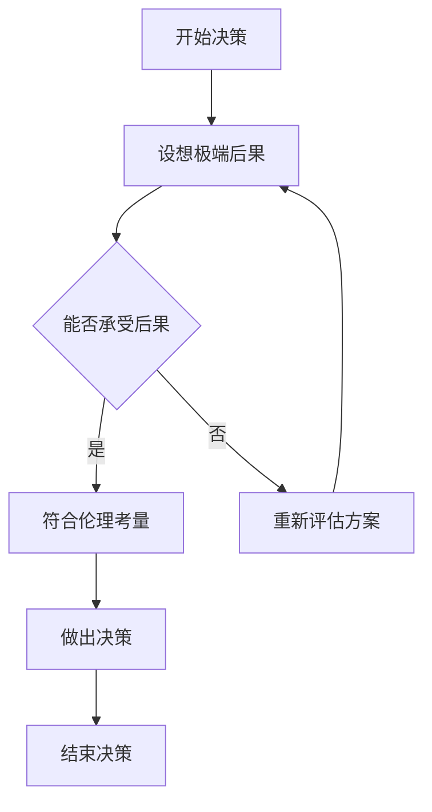

# 芒格的"极端后果"思维在量子武器伦理决策中的应用

> 关键词：芒格极端后果思维、量子武器、伦理决策、后果评估、道德考量

> 摘要：本文深入探讨了芒格的“极端后果”思维在量子武器伦理决策中的应用。首先介绍了研究的背景、目的、预期读者和文档结构，明确相关术语。接着阐述了核心概念，包括“极端后果”思维和量子武器伦理决策的原理及联系，并给出示意图和流程图。详细讲解了运用该思维进行伦理决策的核心算法原理与操作步骤，结合数学模型和公式进行分析并举例说明。通过项目实战展示代码实现与解读。分析了量子武器伦理决策的实际应用场景，推荐了相关学习资源、开发工具框架和论文著作。最后总结了未来发展趋势与挑战，解答常见问题并提供扩展阅读和参考资料，旨在为量子武器伦理决策提供新的思路和方法。

## 1. 背景介绍 
### 1.1 目的和范围
随着科技的飞速发展，量子技术逐渐从理论研究走向实际应用，量子武器的研发也成为各国关注的焦点。量子武器凭借其独特的原理和强大的威力，可能会给战争形态和国际关系带来巨大的变革。然而，量子武器的使用也引发了一系列严重的伦理问题，如对人类生命的威胁、对环境的破坏以及对国际秩序的冲击等。

本研究的目的在于探讨如何运用芒格的“极端后果”思维来辅助量子武器的伦理决策。具体范围包括分析“极端后果”思维的内涵和特点，研究量子武器伦理决策的主要考量因素，阐述如何将“极端后果”思维应用于量子武器伦理决策的过程，以及通过实际案例和数学模型来验证这种应用的有效性和可行性。

### 1.2 预期读者
本文的预期读者主要包括从事量子技术研究和开发的科研人员、军事战略家和决策者、伦理学专家、国际关系学者以及对科技伦理和军事伦理感兴趣的广大读者。科研人员可以从本文中了解到量子武器研发过程中的伦理约束和考量；军事战略家和决策者可以借助“极端后果”思维更好地进行量子武器的战略规划和使用决策；伦理学专家可以从新的视角审视量子武器带来的伦理挑战；国际关系学者可以分析量子武器对国际秩序和国际关系的影响；而广大读者可以通过本文增进对量子武器和科技伦理的认识。

### 1.3 文档结构概述
本文共分为十个部分。第一部分为背景介绍，阐述研究的目的、范围、预期读者和文档结构，同时给出相关术语的定义和解释。第二部分介绍核心概念，包括“极端后果”思维和量子武器伦理决策的原理及联系，并通过示意图和流程图进行直观展示。第三部分详细讲解运用“极端后果”思维进行量子武器伦理决策的核心算法原理和具体操作步骤，结合Python代码进行说明。第四部分引入数学模型和公式，对决策过程进行量化分析，并通过具体例子加深理解。第五部分进行项目实战，介绍开发环境搭建、源代码实现和代码解读。第六部分分析量子武器伦理决策的实际应用场景。第七部分推荐相关的学习资源、开发工具框架和论文著作。第八部分总结未来发展趋势与挑战。第九部分解答常见问题。第十部分提供扩展阅读和参考资料。

### 1.4 术语表
#### 1.4.1 核心术语定义
- **芒格的“极端后果”思维**：这是由查理·芒格提出的一种思维方式，强调在决策过程中要充分考虑到可能出现的最极端、最严重的后果，并以此为依据来评估决策的可行性和合理性。
- **量子武器**：利用量子力学原理研制的武器，如量子雷达、量子通信干扰器、量子计算机控制的精确打击武器等，具有高精度、高保密性、高能量等特点。
- **伦理决策**：在面临道德困境时，依据一定的伦理原则和价值观，对不同的行为方案进行评估和选择，以达到符合道德要求的决策结果。

#### 1.4.2 相关概念解释
- **量子力学**：物理学的一个重要分支，研究微观世界中粒子的运动和相互作用规律，为量子武器的研发提供了理论基础。
- **道德考量**：在决策过程中，考虑行为对他人、社会和环境的影响，遵循一定的道德准则和价值观，以确保决策的正当性和合理性。
- **后果评估**：对决策可能产生的各种后果进行预测、分析和评价，包括正面后果和负面后果，短期后果和长期后果等。

#### 1.4.3 缩略词列表
- QW（Quantum Weapon）：量子武器
- EC（Extreme Consequence）：极端后果
- ED（Ethical Decision）：伦理决策

## 2. 核心概念与联系 
### 2.1 “极端后果”思维原理
芒格的“极端后果”思维基于这样一种理念：在做出决策时，人们往往容易忽视那些发生概率较低但一旦发生就会带来极其严重后果的事件。这种思维方式要求决策者不仅要考虑常规情况下的后果，还要设想可能出现的最糟糕的情景，并评估自己是否能够承受这些后果。

例如，在投资决策中，投资者不仅要考虑市场正常波动时的收益和风险，还要设想经济危机、战争等极端情况下的损失。通过对极端后果的分析，决策者可以更加全面地了解决策的风险，从而做出更加谨慎和合理的选择。

### 2.2 量子武器伦理决策原理
量子武器伦理决策是一个复杂的过程，需要综合考虑多个方面的因素。首先，要考虑量子武器的使用对人类生命和健康的影响，包括直接的人员伤亡和间接的健康危害，如辐射污染等。其次，要考虑对环境的影响，量子武器的使用可能会对生态系统造成长期的破坏。此外，还需要考虑对国际秩序和国际关系的影响，量子武器的出现可能会打破现有的军事平衡，引发军备竞赛和国际冲突。

在进行量子武器伦理决策时，决策者需要依据一定的伦理原则，如尊重人权、保护生命、维护和平等，对不同的决策方案进行评估和选择。

### 2.3 核心概念联系
“极端后果”思维与量子武器伦理决策有着密切的联系。在量子武器的研发和使用过程中，运用“极端后果”思维可以帮助决策者更加全面地考虑各种可能的后果。例如，在决定是否研发某种量子武器时，决策者可以设想该武器在最极端情况下的使用后果，如引发全球性的核战争、导致人类文明的毁灭等。通过对这些极端后果的评估，决策者可以更加谨慎地权衡研发和使用该武器的利弊，从而做出更加符合伦理要求的决策。

### 2.4 文本示意图
```plaintext
         芒格的“极端后果”思维
               |
               | 应用于
               v
    量子武器伦理决策
        /       |       \
       /        |        \
  人类生命影响  环境影响  国际秩序影响
```

### 2.5 Mermaid 流程图


## 3. 核心算法原理 & 具体操作步骤 
### 3.1 核心算法原理
运用“极端后果”思维进行量子武器伦理决策的核心算法可以概括为以下几个步骤：

1. **确定决策目标**：明确在量子武器的研发、部署或使用过程中需要做出的决策，例如是否研发某种新型量子武器、是否在特定情况下使用量子武器等。
2. **列举可能的极端后果**：根据量子武器的特点和相关的伦理考量因素，设想可能出现的最极端、最严重的后果。这些后果可以分为不同的类别，如人员伤亡、环境破坏、国际冲突等。
3. **评估极端后果的严重性**：对每个极端后果的严重性进行量化评估，可以采用评分的方式，例如从 1 到 10 分，1 分表示后果轻微，10 分表示后果极其严重。
4. **评估极端后果的发生概率**：对每个极端后果的发生概率进行估计，同样可以采用百分比的方式进行量化。
5. **计算后果的综合影响**：将每个极端后果的严重性和发生概率相乘，得到该后果的综合影响得分。然后将所有后果的综合影响得分相加，得到整个决策的综合影响得分。
6. **设定伦理阈值**：根据一定的伦理原则和价值观，设定一个伦理阈值。如果决策的综合影响得分超过该阈值，则认为该决策不符合伦理要求，需要重新评估方案；如果得分低于阈值，则认为该决策在伦理上是可接受的。

### 3.2 具体操作步骤

以下是运用上述算法进行量子武器伦理决策的具体操作步骤：

#### 步骤 1：确定决策目标
假设我们需要决策是否研发一种新型的量子通信干扰器。

#### 步骤 2：列举可能的极端后果
- 后果 1：引发大规模的国际冲突，导致全球性的战争。
- 后果 2：破坏全球通信网络，使人类社会陷入混乱。
- 后果 3：导致大量无辜人员伤亡，包括平民和军人。

#### 步骤 3：评估极端后果的严重性
- 后果 1 的严重性评分为 10 分。
- 后果 2 的严重性评分为 8 分。
- 后果 3 的严重性评分为 9 分。

#### 步骤 4：评估极端后果的发生概率
- 后果 1 的发生概率估计为 10%。
- 后果 2 的发生概率估计为 15%。
- 后果 3 的发生概率估计为 20%。

#### 步骤 5：计算后果的综合影响
- 后果 1 的综合影响得分 = 10 × 0.1 = 1 分。
- 后果 2 的综合影响得分 = 8 × 0.15 = 1.2 分。
- 后果 3 的综合影响得分 = 9 × 0.2 = 1.8 分。
- 整个决策的综合影响得分 = 1 + 1.2 + 1.8 = 4 分。

#### 步骤 6：设定伦理阈值
假设我们设定的伦理阈值为 3 分。由于决策的综合影响得分 4 分超过了伦理阈值，因此认为研发这种新型量子通信干扰器在伦理上是不可接受的，需要重新评估方案。

### 3.3 Python 代码实现
```python
# 定义极端后果列表
extreme_consequences = [
    {"name": "引发大规模国际冲突", "severity": 10, "probability": 0.1},
    {"name": "破坏全球通信网络", "severity": 8, "probability": 0.15},
    {"name": "导致大量无辜人员伤亡", "severity": 9, "probability": 0.2}
]

# 计算综合影响得分
total_impact = 0
for consequence in extreme_consequences:
    impact = consequence["severity"] * consequence["probability"]
    total_impact += impact

# 设定伦理阈值
ethical_threshold = 3

# 判断决策是否符合伦理要求
if total_impact > ethical_threshold:
    print("该决策不符合伦理要求，需要重新评估方案。")
else:
    print("该决策在伦理上是可接受的。")
```

## 4. 数学模型和公式 & 详细讲解 & 举例说明 
### 4.1 数学模型和公式
设 $C_i$ 表示第 $i$ 个极端后果，$S_i$ 表示第 $i$ 个极端后果的严重性评分，$P_i$ 表示第 $i$ 个极端后果的发生概率，$n$ 表示极端后果的总数。则整个决策的综合影响得分 $I$ 可以用以下公式表示：

$$I = \sum_{i=1}^{n} S_i \times P_i$$

### 4.2 详细讲解
这个数学模型的核心思想是将每个极端后果的严重性和发生概率相结合，得到该后果的综合影响得分。通过将所有后果的综合影响得分相加，得到整个决策的综合影响得分。严重性评分 $S_i$ 反映了后果的严重程度，发生概率 $P_i$ 反映了后果发生的可能性。综合影响得分 $I$ 越高，说明决策带来的潜在风险越大。

### 4.3 举例说明
继续以上述研发新型量子通信干扰器的决策为例。

已知有 3 个极端后果，即 $n = 3$。

- 后果 1：$S_1 = 10$，$P_1 = 0.1$。
- 后果 2：$S_2 = 8$，$P_2 = 0.15$。
- 后果 3：$S_3 = 9$，$P_3 = 0.2$。

根据公式计算综合影响得分：

$$
\begin{align*}
I &= S_1 \times P_1 + S_2 \times P_2 + S_3 \times P_3 \\
&= 10 \times 0.1 + 8 \times 0.15 + 9 \times 0.2 \\
&= 1 + 1.2 + 1.8 \\
&= 4
\end{align*}
$$

这表明研发新型量子通信干扰器的决策综合影响得分为 4 分。如果设定的伦理阈值为 3 分，由于 $4 > 3$，则该决策不符合伦理要求。

## 5. 项目实战：代码实际案例和详细解释说明 
### 5.1  开发环境搭建
为了实现上述量子武器伦理决策的代码，我们可以使用 Python 语言进行开发。以下是开发环境搭建的步骤：

1. **安装 Python**：访问 Python 官方网站（https://www.python.org/downloads/），根据自己的操作系统选择合适的 Python 版本进行下载和安装。建议安装 Python 3.6 及以上版本。
2. **安装开发工具**：可以选择使用 PyCharm、VS Code 等集成开发环境（IDE）来编写和运行 Python 代码。这里以 PyCharm 为例，访问 JetBrains 官方网站（https://www.jetbrains.com/pycharm/download/），下载并安装 PyCharm Community Edition（免费版）。
3. **创建项目**：打开 PyCharm，选择“Create New Project”，选择合适的项目路径和 Python 解释器，创建一个新的 Python 项目。

### 5.2  源代码详细实现和代码解读
以下是完整的 Python 代码实现，并对代码进行详细解读：

```python
# 定义极端后果列表
extreme_consequences = [
    {"name": "引发大规模国际冲突", "severity": 10, "probability": 0.1},
    {"name": "破坏全球通信网络", "severity": 8, "probability": 0.15},
    {"name": "导致大量无辜人员伤亡", "severity": 9, "probability": 0.2}
]

# 计算综合影响得分
total_impact = 0
for consequence in extreme_consequences:
    # 计算每个极端后果的综合影响得分
    impact = consequence["severity"] * consequence["probability"]
    # 将每个后果的综合影响得分累加到总得分中
    total_impact += impact

# 设定伦理阈值
ethical_threshold = 3

# 判断决策是否符合伦理要求
if total_impact > ethical_threshold:
    print("该决策不符合伦理要求，需要重新评估方案。")
else:
    print("该决策在伦理上是可接受的。")
```

#### 代码解读：
1. **定义极端后果列表**：使用一个列表 `extreme_consequences` 来存储所有可能的极端后果。每个后果用一个字典表示，包含后果的名称、严重性评分和发生概率。
2. **计算综合影响得分**：使用一个循环遍历所有的极端后果，对于每个后果，计算其综合影响得分（严重性评分乘以发生概率），并将其累加到总得分 `total_impact` 中。
3. **设定伦理阈值**：定义一个变量 `ethical_threshold` 来表示伦理阈值。
4. **判断决策是否符合伦理要求**：使用 `if-else` 语句比较总得分和伦理阈值的大小，如果总得分大于伦理阈值，则输出决策不符合伦理要求的信息；否则，输出决策在伦理上可接受的信息。

### 5.3  代码解读与分析
这段代码实现了运用“极端后果”思维进行量子武器伦理决策的基本功能。通过将极端后果的严重性和发生概率相结合，计算出决策的综合影响得分，并与伦理阈值进行比较，从而判断决策是否符合伦理要求。

优点：
- 代码结构简单，易于理解和实现。
- 可以方便地修改极端后果列表和伦理阈值，以适应不同的决策场景。

局限性：
- 极端后果的列举可能不全面，实际情况中可能存在其他未考虑到的极端后果。
- 严重性评分和发生概率的估计具有一定的主观性，可能会影响决策的准确性。

为了提高决策的准确性，可以进一步完善极端后果的列举，邀请更多的专家参与严重性评分和发生概率的估计，或者采用更复杂的数学模型和算法。

## 6. 实际应用场景 
### 6.1 量子武器研发决策
在量子武器的研发过程中，运用“极端后果”思维进行伦理决策可以帮助科研人员和决策者更加谨慎地选择研发方向。例如，在研发一种新型的量子武器时，考虑到其可能引发的国际冲突、环境破坏等极端后果，可以评估研发该武器是否符合伦理要求。如果综合影响得分超过伦理阈值，则需要重新审视研发计划，可能需要调整研发目标或采取相应的措施来降低风险。

### 6.2 量子武器部署决策
在决定是否部署量子武器时，也需要进行伦理决策。例如，在某个地区部署量子雷达可能会引起周边国家的警惕，导致地区局势紧张，甚至可能引发军事冲突。通过运用“极端后果”思维，评估这种部署可能带来的极端后果，如引发战争、破坏地区和平等，可以帮助决策者做出更加明智的决策。

### 6.3 量子武器使用决策
在实际使用量子武器时，伦理决策尤为重要。例如，在战争中使用量子通信干扰器可能会影响到平民的通信和生活，甚至可能导致医疗救援等重要通信的中断。运用“极端后果”思维，考虑到这些极端后果，可以帮助指挥官在使用量子武器时更加谨慎，确保其使用符合国际人道法和伦理原则。

## 7. 工具和资源推荐
### 7.1 学习资源推荐
#### 7.1.1 书籍推荐
- 《穷查理宝典：查理·芒格的智慧箴言录》：本书收录了查理·芒格的演讲、文章和访谈等内容，全面介绍了他的投资理念、思维方式和人生智慧，其中包括“极端后果”思维的相关阐述。
- 《量子力学史话》：这本书以生动有趣的方式讲述了量子力学的发展历程，对于理解量子武器的理论基础具有重要的帮助。
- 《科技伦理学》：系统介绍了科技发展过程中涉及的各种伦理问题和伦理原则，为量子武器伦理决策提供了理论支持。

#### 7.1.2 在线课程
- Coursera 上的“量子力学基础”课程：由知名高校的教授授课，深入浅出地讲解量子力学的基本概念和原理。
- edX 上的“科技伦理与社会”课程：探讨科技发展对社会和伦理的影响，以及如何进行科技伦理决策。

#### 7.1.3 技术博客和网站
- 量子位（https://www.qbitai.com/）：专注于量子技术领域的资讯和深度报道，提供最新的量子技术研究成果和应用案例。
- 科学网（https://www.sciencenet.cn/）：涵盖了自然科学各个领域的科研动态和学术交流，有很多关于量子技术和科技伦理的文章和讨论。

### 7.2 开发工具框架推荐
#### 7.2.1 IDE和编辑器
- PyCharm：功能强大的 Python 集成开发环境，提供代码编辑、调试、版本控制等一系列功能，适合 Python 开发者使用。
- VS Code：轻量级的代码编辑器，支持多种编程语言，通过安装插件可以扩展其功能，是很多开发者喜爱的工具之一。

#### 7.2.2 调试和性能分析工具
- Py-Spy：用于分析 Python 程序的性能，找出程序中的瓶颈和性能问题。
- PDB：Python 自带的调试器，可以帮助开发者定位和解决代码中的错误。

#### 7.2.3 相关框架和库
- NumPy：用于科学计算的 Python 库，提供了高效的数组操作和数学函数，在处理大量数据和进行数值计算时非常有用。
- Pandas：用于数据处理和分析的 Python 库，提供了丰富的数据结构和数据操作方法，方便对极端后果数据进行管理和分析。

### 7.3 相关论文著作推荐
#### 7.3.1 经典论文
- “Quantum Computing and National Security”：探讨了量子计算对国家安全的影响，包括量子武器的研发和应用带来的挑战和机遇。
- “Ethical Issues in Emerging Technologies”：分析了新兴技术（如量子技术、人工智能等）带来的伦理问题，提出了相应的伦理原则和决策方法。

#### 7.3.2 最新研究成果
- 关注国际知名学术期刊如《Nature》《Science》《Physical Review Letters》等，这些期刊经常发表关于量子技术和科技伦理的最新研究成果。

#### 7.3.3 应用案例分析
- 可以查阅一些军事战略研究机构和智库发布的报告，了解量子武器在实际应用中的案例和分析，以及相关的伦理决策过程。

## 8. 总结：未来发展趋势与挑战
### 8.1 未来发展趋势
- **量子武器技术不断进步**：随着量子技术的不断发展，量子武器的性能将不断提高，功能将更加多样化。例如，量子雷达的探测精度将更高，量子通信干扰器的干扰效果将更强。
- **伦理决策的重要性日益凸显**：随着量子武器的威力越来越大，其使用带来的伦理问题将更加复杂和严峻。因此，伦理决策在量子武器的研发、部署和使用过程中将扮演越来越重要的角色。
- **国际合作加强**：为了应对量子武器带来的伦理挑战，国际社会将加强合作，制定统一的伦理准则和规范，共同维护全球的和平与安全。

### 8.2 挑战
- **技术不确定性**：量子技术仍处于发展阶段，存在很多技术不确定性。例如，量子武器的实际效果和影响可能难以准确预测，这给伦理决策带来了很大的困难。
- **伦理标准难以统一**：不同国家和文化背景下的伦理标准存在差异，如何制定统一的量子武器伦理标准是一个亟待解决的问题。
- **利益冲突**：量子武器的研发和应用涉及到国家的安全利益和经济利益，不同国家之间可能存在利益冲突，这也增加了伦理决策的难度。

## 9. 附录：常见问题与解答
### 9.1 问题 1：如何准确估计极端后果的发生概率？
极端后果的发生概率往往难以准确估计，因为涉及到很多不确定因素。可以采用以下方法来提高估计的准确性：
- 邀请相关领域的专家进行评估，他们具有丰富的经验和专业知识，能够提供更合理的概率估计。
- 参考历史数据和类似事件的发生概率，进行类比和推断。
- 采用情景分析的方法，设想不同的情景下极端后果的发生概率。

### 9.2 问题 2：伦理阈值的设定有什么依据？
伦理阈值的设定需要综合考虑多个因素，包括伦理原则、社会价值观、国际公约等。不同的决策场景和应用领域可能需要设定不同的伦理阈值。一般来说，可以通过专家讨论、社会调查等方式来确定合适的伦理阈值。

### 9.3 问题 3：“极端后果”思维是否适用于所有的量子武器伦理决策？
“极端后果”思维是一种有效的决策辅助工具，但并不是适用于所有的量子武器伦理决策。在一些情况下，可能还需要考虑其他因素，如短期利益、技术可行性等。因此，在实际应用中，需要将“极端后果”思维与其他决策方法相结合，综合考虑各种因素，做出更加合理的决策。

## 10. 扩展阅读 & 参考资料
### 10.1 扩展阅读
- 《人工智能时代的伦理与治理》：探讨了人工智能等新兴技术带来的伦理问题和治理挑战，与量子武器伦理决策有一定的相关性。
- 《战争伦理学》：研究了战争中的伦理问题，为量子武器的使用决策提供了更广泛的伦理视角。

### 10.2 参考资料
- 查理·芒格的演讲和文章，可在网上搜索相关资源。
- 国际原子能机构（IAEA）、国际电信联盟（ITU）等国际组织发布的相关报告和文件，涉及到量子技术和军事伦理的内容。

作者：AI天才研究院/AI Genius Institute & 禅与计算机程序设计艺术 /Zen And The Art of Computer Programming