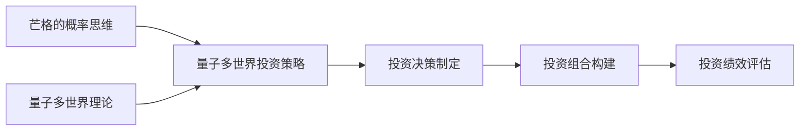

# 芒格的"概率思维"在量子多世界投资策略中的高级应用

> 关键词：芒格、概率思维、量子多世界、投资策略、高级应用

> 摘要：本文深入探讨了芒格的概率思维在量子多世界投资策略中的高级应用。首先介绍了相关背景，包括目的、预期读者、文档结构和术语表。接着阐述了核心概念及其联系，给出了原理和架构的文本示意图与 Mermaid 流程图。详细讲解了核心算法原理并结合 Python 代码说明具体操作步骤，同时介绍了相关数学模型和公式并举例。通过项目实战，展示了代码的实际案例及详细解读。分析了该应用的实际场景，推荐了学习、开发工具框架和相关论文著作。最后总结了未来发展趋势与挑战，还设置了常见问题解答和扩展阅读参考资料，旨在为投资者提供一种全新且高效的投资思路。

## 1. 背景介绍 
### 1.1 目的和范围
本研究的目的在于探索如何将芒格所倡导的概率思维融入量子多世界投资策略中，以提升投资决策的科学性和有效性。通过深入分析概率思维的本质和量子多世界理论在投资领域的应用潜力，构建一套具有实际操作价值的投资方法。研究范围涵盖了概率思维的基本原理、量子多世界理论的概念、两者在投资决策中的结合方式，以及如何运用相关算法和模型进行投资策略的制定与优化。

### 1.2 预期读者
本文主要面向专业投资者、金融分析师、投资顾问、量化投资从业者以及对投资理论和实践有深入研究兴趣的学者。这些读者通常具备一定的金融知识和投资经验，对新兴的投资理念和方法有较高的关注度，希望通过学习和应用新的思维方式来提升自己的投资绩效。

### 1.3 文档结构概述
本文将按照以下结构进行阐述：首先介绍相关的核心概念及其联系，为后续的分析奠定基础；接着详细讲解核心算法原理和具体操作步骤，并结合 Python 代码进行说明；然后介绍相关的数学模型和公式，并通过具体例子进行详细讲解；通过项目实战展示代码的实际应用和详细解读；分析该投资策略的实际应用场景；推荐相关的学习资源、开发工具框架和论文著作；最后总结未来发展趋势与挑战，设置常见问题解答和扩展阅读参考资料。

### 1.4 术语表
#### 1.4.1 核心术语定义
- **芒格的概率思维**：由投资大师查理·芒格提出的一种思维方式，强调在决策过程中运用概率来评估各种可能性，通过对不同情况发生的概率进行分析和判断，做出更合理的决策。
- **量子多世界理论**：一种量子力学的解释，认为在量子层面，每次测量都会导致宇宙分裂成多个平行世界，每个世界对应着不同的测量结果。在投资领域，可将其引申为投资决策的多种可能结果，每个结果对应一个“世界”。
- **量子多世界投资策略**：基于量子多世界理论，将投资决策看作是在多个可能的投资结果世界中进行选择的策略，通过综合考虑各种结果的概率来制定投资方案。

#### 1.4.2 相关概念解释
- **投资组合**：由多种资产组成的集合，投资者通过合理配置不同资产的比例来实现风险分散和收益最大化。
- **风险评估**：对投资过程中可能面临的各种风险进行分析和评估，包括市场风险、信用风险、流动性风险等。
- **收益预期**：投资者对投资项目可能获得的收益进行预测和估计，通常基于历史数据、市场趋势和相关分析方法。

#### 1.4.3 缩略词列表
- **MPT**：Modern Portfolio Theory，现代投资组合理论
- **CAPM**：Capital Asset Pricing Model，资本资产定价模型

## 2. 核心概念与联系 
### 核心概念原理
#### 芒格的概率思维原理
芒格的概率思维强调在决策时要充分考虑各种可能性及其发生的概率。他认为，投资者应该像一个精明的赌徒一样，在对各种情况的概率有清晰认识的基础上进行下注。例如，在评估一项投资时，要考虑到不同市场环境下投资成功或失败的概率，以及每种情况下可能获得的收益或损失。通过对概率的准确估计，投资者可以避免盲目跟风和冲动决策，做出更理性的投资选择。

#### 量子多世界理论原理
量子多世界理论源于量子力学的不确定性。在量子系统中，粒子的状态在测量之前是不确定的，处于多种可能状态的叠加态。当进行测量时，宇宙会分裂成多个平行世界，每个世界对应着一个确定的测量结果。在投资领域，这意味着每一个投资决策都可能产生多种不同的结果，就像量子系统中的多种可能状态一样。每个结果都代表着一个“投资世界”，投资者需要在这些不同的世界中进行权衡和选择。

#### 量子多世界投资策略原理
量子多世界投资策略将芒格的概率思维与量子多世界理论相结合。它认为投资者应该将投资决策看作是在多个可能的投资结果世界中进行选择的过程。首先，通过概率思维对每个可能的投资结果世界发生的概率进行评估；然后，根据不同结果世界中的收益和风险情况，制定相应的投资组合。通过这种方式，投资者可以在考虑多种可能性的基础上，实现投资收益的最大化和风险的最小化。

### 架构的文本示意图
```plaintext
             芒格的概率思维
                   |
                   v
量子多世界投资策略 <----> 量子多世界理论
                   |
                   v
             投资决策制定
                   |
                   v
             投资组合构建
                   |
                   v
             投资绩效评估
```

### Mermaid 流程图


## 3. 核心算法原理 & 具体操作步骤 
### 核心算法原理
量子多世界投资策略的核心算法主要基于概率分布和期望收益的计算。其基本思想是通过对每个可能的投资结果世界发生的概率进行估计，计算出每个投资组合在不同结果世界中的期望收益，然后选择期望收益最大的投资组合。

### 具体操作步骤
#### 步骤 1：确定投资标的和可能的结果世界
首先，投资者需要确定投资的标的，如股票、债券、基金等。然后，分析每个投资标的在不同市场环境下可能出现的结果，确定可能的结果世界。例如，对于一只股票，可能的结果世界包括上涨、下跌和持平三种情况。

#### 步骤 2：估计每个结果世界发生的概率
运用芒格的概率思维，结合历史数据、市场趋势、宏观经济环境等因素，对每个结果世界发生的概率进行估计。例如，通过分析过去一段时间内股票的涨跌情况，以及当前市场的基本面和技术面指标，估计股票上涨、下跌和持平的概率分别为 0.4、0.3 和 0.3。

#### 步骤 3：计算每个投资组合在不同结果世界中的收益
根据投资标的在每个结果世界中的表现，计算出每个投资组合在不同结果世界中的收益。例如，假设投资组合中包含股票 A 和股票 B，在股票 A 上涨、股票 B 上涨的结果世界中，投资组合的收益为股票 A 的涨幅乘以其在投资组合中的权重加上股票 B 的涨幅乘以其在投资组合中的权重。

#### 步骤 4：计算每个投资组合的期望收益
根据每个结果世界发生的概率和投资组合在该结果世界中的收益，计算出每个投资组合的期望收益。期望收益的计算公式为：
$$E(R)=\sum_{i=1}^{n}P_iR_i$$
其中，$E(R)$ 表示投资组合的期望收益，$P_i$ 表示第 $i$ 个结果世界发生的概率，$R_i$ 表示投资组合在第 $i$ 个结果世界中的收益，$n$ 表示结果世界的总数。

#### 步骤 5：选择期望收益最大的投资组合
比较不同投资组合的期望收益，选择期望收益最大的投资组合作为最终的投资方案。

### Python 代码实现
```python
import numpy as np

# 步骤 1：确定投资标的和可能的结果世界
# 假设有两个投资标的，每个标的有三种可能的结果（上涨、下跌、持平）
num_assets = 2
num_states = 3

# 步骤 2：估计每个结果世界发生的概率
probabilities = np.array([0.4, 0.3, 0.3])

# 步骤 3：计算每个投资组合在不同结果世界中的收益
# 假设已经计算出每个投资标的在不同结果世界中的收益矩阵
returns = np.array([
    [0.1, -0.05, 0],  # 投资标的 1 在三种结果世界中的收益
    [0.15, -0.08, 0.02]  # 投资标的 2 在三种结果世界中的收益
])

# 步骤 4：计算每个投资组合的期望收益
# 生成所有可能的投资组合权重（假设权重之和为 1）
num_portfolios = 100
weights = np.random.random((num_portfolios, num_assets))
weights = weights / np.sum(weights, axis=1)[:, np.newaxis]

expected_returns = []
for weight in weights:
    portfolio_returns = np.dot(weight, returns)
    expected_return = np.dot(probabilities, portfolio_returns)
    expected_returns.append(expected_return)

# 步骤 5：选择期望收益最大的投资组合
best_portfolio_index = np.argmax(expected_returns)
best_portfolio_weights = weights[best_portfolio_index]
best_portfolio_expected_return = expected_returns[best_portfolio_index]

print("最佳投资组合权重:", best_portfolio_weights)
print("最佳投资组合期望收益:", best_portfolio_expected_return)
```

## 4. 数学模型和公式 & 详细讲解 & 举例说明 
### 数学模型
量子多世界投资策略的数学模型主要基于期望收益和风险评估。期望收益用于衡量投资组合在不同结果世界中的平均收益水平，风险评估则用于衡量投资组合收益的不确定性。

### 数学公式
#### 期望收益公式
如前所述，投资组合的期望收益计算公式为：
$$E(R)=\sum_{i=1}^{n}P_iR_i$$
其中，$E(R)$ 表示投资组合的期望收益，$P_i$ 表示第 $i$ 个结果世界发生的概率，$R_i$ 表示投资组合在第 $i$ 个结果世界中的收益，$n$ 表示结果世界的总数。

#### 风险评估公式
常用的风险评估指标是方差和标准差。投资组合收益的方差计算公式为：
$$Var(R)=\sum_{i=1}^{n}P_i(R_i - E(R))^2$$
其中，$Var(R)$ 表示投资组合收益的方差，$P_i$ 表示第 $i$ 个结果世界发生的概率，$R_i$ 表示投资组合在第 $i$ 个结果世界中的收益，$E(R)$ 表示投资组合的期望收益，$n$ 表示结果世界的总数。

投资组合收益的标准差计算公式为：
$$\sigma(R)=\sqrt{Var(R)}$$
其中，$\sigma(R)$ 表示投资组合收益的标准差。

### 详细讲解
期望收益反映了投资组合在长期内的平均收益水平，是投资者选择投资组合的重要参考指标之一。方差和标准差则反映了投资组合收益的波动程度，即风险水平。方差和标准差越大，说明投资组合的收益越不稳定，风险越高；反之，方差和标准差越小，说明投资组合的收益越稳定，风险越低。

### 举例说明
假设一个投资组合包含两只股票 A 和 B，有三种可能的结果世界：上涨、下跌和持平。每种结果世界发生的概率分别为 0.4、0.3 和 0.3。在不同结果世界中，股票 A 和股票 B 的收益情况如下表所示：

| 结果世界 | 股票 A 收益 | 股票 B 收益 |
| ---- | ---- | ---- |
| 上涨 | 0.1 | 0.15 |
| 下跌 | -0.05 | -0.08 |
| 持平 | 0 | 0.02 |

假设投资组合中股票 A 的权重为 0.6，股票 B 的权重为 0.4。

#### 计算投资组合在不同结果世界中的收益
在上涨结果世界中，投资组合的收益为：
$$R_1 = 0.6\times0.1 + 0.4\times0.15 = 0.12$$
在下跌结果世界中，投资组合的收益为：
$$R_2 = 0.6\times(-0.05) + 0.4\times(-0.08) = -0.062$$
在持平结果世界中，投资组合的收益为：
$$R_3 = 0.6\times0 + 0.4\times0.02 = 0.008$$

#### 计算投资组合的期望收益
$$E(R) = 0.4\times0.12 + 0.3\times(-0.062) + 0.3\times0.008 = 0.0294$$

#### 计算投资组合收益的方差
$$Var(R) = 0.4\times(0.12 - 0.0294)^2 + 0.3\times(-0.062 - 0.0294)^2 + 0.3\times(0.008 - 0.0294)^2$$
$$= 0.4\times0.00820836 + 0.3\times0.00835396 + 0.3\times0.00045796$$
$$= 0.003283344 + 0.002506188 + 0.000137388$$
$$= 0.00592692$$

#### 计算投资组合收益的标准差
$$\sigma(R) = \sqrt{0.00592692} \approx 0.077$$

通过以上计算，我们可以得到该投资组合的期望收益为 0.0294，标准差为 0.077。这表明该投资组合在长期内的平均收益为 2.94%，收益的波动程度相对较大，风险较高。

## 5. 项目实战：代码实际案例和详细解释说明 
### 5.1  开发环境搭建
#### 安装 Python
首先，需要安装 Python 编程语言。可以从 Python 官方网站（https://www.python.org/downloads/）下载适合自己操作系统的 Python 安装包，并按照安装向导进行安装。建议安装 Python 3.7 及以上版本。

#### 安装必要的库
在本项目中，需要使用 numpy 库进行数值计算。可以使用以下命令安装 numpy 库：
```sh
pip install numpy
```

### 5.2  源代码详细实现和代码解读
```python
import numpy as np

# 步骤 1：确定投资标的和可能的结果世界
# 假设有三个投资标的，每个标的有四种可能的结果
num_assets = 3
num_states = 4

# 步骤 2：估计每个结果世界发生的概率
probabilities = np.array([0.3, 0.2, 0.4, 0.1])

# 步骤 3：计算每个投资组合在不同结果世界中的收益
# 假设已经计算出每个投资标的在不同结果世界中的收益矩阵
returns = np.array([
    [0.12, -0.08, 0.05, 0.02],  # 投资标的 1 在四种结果世界中的收益
    [0.15, -0.1, 0.06, 0.03],  # 投资标的 2 在四种结果世界中的收益
    [0.08, -0.06, 0.04, 0.01]  # 投资标的 3 在四种结果世界中的收益
])

# 步骤 4：计算每个投资组合的期望收益
# 生成所有可能的投资组合权重（假设权重之和为 1）
num_portfolios = 200
weights = np.random.random((num_portfolios, num_assets))
weights = weights / np.sum(weights, axis=1)[:, np.newaxis]

expected_returns = []
for weight in weights:
    portfolio_returns = np.dot(weight, returns)
    expected_return = np.dot(probabilities, portfolio_returns)
    expected_returns.append(expected_return)

# 步骤 5：选择期望收益最大的投资组合
best_portfolio_index = np.argmax(expected_returns)
best_portfolio_weights = weights[best_portfolio_index]
best_portfolio_expected_return = expected_returns[best_portfolio_index]

print("最佳投资组合权重:", best_portfolio_weights)
print("最佳投资组合期望收益:", best_portfolio_expected_return)
```

### 代码解读与分析
#### 导入必要的库
```python
import numpy as np
```
导入 numpy 库，用于进行数值计算。

#### 确定投资标的和可能的结果世界
```python
num_assets = 3
num_states = 4
```
设置投资标的的数量为 3，每个投资标的可能的结果世界数量为 4。

#### 估计每个结果世界发生的概率
```python
probabilities = np.array([0.3, 0.2, 0.4, 0.1])
```
使用 numpy 数组表示每个结果世界发生的概率。

#### 计算每个投资组合在不同结果世界中的收益
```python
returns = np.array([
    [0.12, -0.08, 0.05, 0.02],
    [0.15, -0.1, 0.06, 0.03],
    [0.08, -0.06, 0.04, 0.01]
])
```
使用 numpy 数组表示每个投资标的在不同结果世界中的收益矩阵。

#### 计算每个投资组合的期望收益
```python
num_portfolios = 200
weights = np.random.random((num_portfolios, num_assets))
weights = weights / np.sum(weights, axis=1)[:, np.newaxis]

expected_returns = []
for weight in weights:
    portfolio_returns = np.dot(weight, returns)
    expected_return = np.dot(probabilities, portfolio_returns)
    expected_returns.append(expected_return)
```
生成 200 个随机的投资组合权重，并确保每个投资组合的权重之和为 1。然后，计算每个投资组合在不同结果世界中的收益，并根据结果世界发生的概率计算每个投资组合的期望收益。

#### 选择期望收益最大的投资组合
```python
best_portfolio_index = np.argmax(expected_returns)
best_portfolio_weights = weights[best_portfolio_index]
best_portfolio_expected_return = expected_returns[best_portfolio_index]

print("最佳投资组合权重:", best_portfolio_weights)
print("最佳投资组合期望收益:", best_portfolio_expected_return)
```
找出期望收益最大的投资组合的索引，获取其权重和期望收益，并将结果打印输出。

## 6. 实际应用场景 
### 股票投资
在股票投资中，投资者可以运用量子多世界投资策略来选择股票和构建投资组合。通过分析不同行业、不同公司的股票在不同市场环境下的表现，估计各种可能结果世界发生的概率，计算每个投资组合的期望收益和风险，从而选择最优的投资组合。例如，在市场上涨、下跌和震荡三种不同的市场环境下，分别分析不同股票的涨跌情况，根据概率思维确定每种市场环境发生的概率，然后构建不同的投资组合，选择期望收益最大的组合进行投资。

### 基金投资
对于基金投资，投资者可以将不同类型的基金（如股票型基金、债券型基金、混合型基金等）看作不同的投资标的。通过分析各种基金在不同经济周期、市场利率、政策环境等因素下的表现，估计可能的结果世界及其概率，计算不同基金组合的期望收益和风险，选择最优的基金投资组合。例如，在经济扩张期、经济衰退期和经济平稳期三种不同的经济周期下，分别分析不同类型基金的收益情况，根据概率思维确定每种经济周期发生的概率，然后构建不同的基金投资组合，选择期望收益最大的组合进行投资。

### 资产配置
在进行资产配置时，投资者可以将股票、债券、房地产、黄金等不同资产类别纳入考虑范围。运用量子多世界投资策略，分析不同资产在不同宏观经济环境（如通货膨胀、通货紧缩、经济增长、经济衰退等）下的表现，估计各种可能结果世界发生的概率，计算不同资产配置方案的期望收益和风险，从而实现资产的合理配置。例如，在通货膨胀时期，分析股票、债券、房地产和黄金等资产的保值增值能力，根据概率思维确定通货膨胀发生的概率，然后构建不同的资产配置方案，选择期望收益最大且风险可控的方案进行投资。

## 7. 工具和资源推荐
### 7.1 学习资源推荐
#### 7.1.1 书籍推荐
- 《穷查理宝典：查理·芒格的智慧箴言录》：这本书收录了查理·芒格的演讲、文章和访谈，详细介绍了他的投资理念、思维方式和人生智慧，是学习芒格概率思维的经典读物。
- 《量子力学史话》：对量子多世界理论进行了深入浅出的介绍，帮助读者了解量子力学的基本概念和发展历程，为理解量子多世界投资策略提供理论基础。
- 《聪明的投资者》：本杰明·格雷厄姆的经典著作，阐述了价值投资的基本原理和方法，对投资者培养正确的投资思维和理念具有重要的指导意义。

#### 7.1.2 在线课程
- Coursera 上的“投资学原理”：由知名大学的教授授课，系统介绍了投资学的基本理论和方法，包括投资组合理论、资产定价模型等内容，对理解量子多世界投资策略有很大帮助。
- edX 上的“量子力学基础”：该课程详细讲解了量子力学的基本概念和原理，包括量子多世界理论，适合对量子力学感兴趣的投资者学习。

#### 7.1.3 技术博客和网站
- 雪球网：是国内知名的投资社区，提供了丰富的投资资讯、研究报告和投资者交流平台，投资者可以在这里了解到最新的市场动态和投资策略。
- 量子杂志（Quanta Magazine）：专注于报道量子科学领域的最新研究成果和发展动态，对了解量子多世界理论在投资领域的应用有一定的参考价值。

### 7.2 开发工具框架推荐
#### 7.2.1 IDE和编辑器
- PyCharm：是一款功能强大的 Python 集成开发环境，提供了代码编辑、调试、版本控制等一系列功能，适合开发量子多世界投资策略相关的 Python 代码。
- Jupyter Notebook：是一个基于网页的交互式开发环境，支持多种编程语言，特别适合进行数据分析和模型验证。在开发量子多世界投资策略时，可以使用 Jupyter Notebook 进行数据探索、模型构建和结果可视化。

#### 7.2.2 调试和性能分析工具
- PDB：Python 自带的调试工具，可以帮助开发者在代码执行过程中进行单步调试、查看变量值等操作，方便排查代码中的错误。
- cProfile：Python 标准库中的性能分析工具，可以统计代码中各个函数的执行时间和调用次数，帮助开发者找出代码中的性能瓶颈，进行优化。

#### 7.2.3 相关框架和库
- numpy：是 Python 中用于科学计算的基础库，提供了高效的多维数组对象和各种数学函数，在量子多世界投资策略的开发中，可用于进行数值计算和矩阵运算。
- pandas：是 Python 中用于数据处理和分析的库，提供了数据结构和数据分析工具，可用于处理投资数据、进行数据清洗和特征工程。
- scikit-learn：是 Python 中常用的机器学习库，提供了各种机器学习算法和工具，可用于构建投资模型和进行预测分析。

### 7.3 相关论文著作推荐
#### 7.3.1 经典论文
- “Portfolio Selection” by Harry Markowitz：这篇论文提出了现代投资组合理论（MPT），为投资组合的构建和优化提供了理论基础，对量子多世界投资策略的研究有重要的参考价值。
- “The Capital Asset Pricing Model: Theory and Evidence” by Eugene F. Fama and Kenneth R. French：该论文对资本资产定价模型（CAPM）进行了深入的研究和验证，是投资领域的经典文献之一。

#### 7.3.2 最新研究成果
- 近年来，关于量子计算在金融领域的应用研究逐渐增多，一些学术期刊和会议上发表了相关的研究论文，如《Quantum Computing for Finance: State of the Art and Future Prospects》等，这些论文探讨了量子计算技术在投资决策、风险评估等方面的应用潜力。

#### 7.3.3 应用案例分析
- 一些金融机构和研究机构发布了关于量子多世界投资策略的应用案例分析报告，通过实际案例展示了该策略在投资实践中的应用效果和优势。这些报告可以帮助投资者更好地理解和应用量子多世界投资策略。

## 8. 总结：未来发展趋势与挑战
### 未来发展趋势
#### 与量子计算技术的融合
随着量子计算技术的不断发展，量子多世界投资策略有望与量子计算技术实现更深度的融合。量子计算的强大计算能力可以帮助投资者更快速、准确地计算各种可能结果世界的概率和投资组合的期望收益，从而提高投资决策的效率和准确性。

#### 智能化投资决策系统的发展
基于量子多世界投资策略，未来有望开发出智能化的投资决策系统。这些系统可以自动收集和分析市场数据、宏观经济数据等信息，运用概率思维和量子多世界理论进行投资决策，为投资者提供更加个性化、智能化的投资建议。

#### 跨领域应用的拓展
量子多世界投资策略不仅可以应用于金融投资领域，还可以拓展到其他领域，如风险管理、项目投资评估等。通过将概率思维和量子多世界理论应用于不同领域的决策过程中，可以提高决策的科学性和有效性。

### 挑战
#### 概率估计的准确性
在量子多世界投资策略中，准确估计每个结果世界发生的概率是关键。然而，由于市场环境的复杂性和不确定性，概率估计往往存在一定的误差。如何提高概率估计的准确性，是该策略面临的一个重要挑战。

#### 数据质量和可用性
投资决策需要大量的市场数据、宏观经济数据等信息作为支撑。然而，数据的质量和可用性可能会影响投资决策的准确性。例如，数据的不完整、不准确或过时可能会导致概率估计和投资组合计算的偏差。

#### 技术实现的难度
将量子多世界理论应用于投资决策需要一定的技术支持。特别是与量子计算技术的融合，需要解决量子算法设计、量子硬件开发等一系列技术难题。如何克服这些技术实现的难度，是该策略未来发展需要解决的问题。

## 9. 附录：常见问题与解答
### 问题 1：芒格的概率思维与传统投资思维有什么区别？
答：传统投资思维往往更注重基本面分析、技术分析等方法，而芒格的概率思维强调在决策过程中运用概率来评估各种可能性。传统投资思维可能更侧重于寻找“确定性”的投资机会，而概率思维则认识到投资决策中存在不确定性，通过对不同情况发生的概率进行分析和判断，做出更合理的决策。

### 问题 2：量子多世界理论在投资领域的应用是否可靠？
答：量子多世界理论在投资领域的应用目前还处于探索和发展阶段。虽然该理论为投资决策提供了一种新的视角和方法，但由于其基于量子力学的概念，与传统投资理论有较大的差异，其可靠性还需要更多的实践验证。在应用量子多世界理论进行投资决策时，需要结合其他投资方法和经验，综合考虑各种因素。

### 问题 3：如何提高概率估计的准确性？
答：提高概率估计的准确性可以从以下几个方面入手：一是收集更多、更准确的数据，包括历史数据、市场数据、宏观经济数据等，通过对大量数据的分析和挖掘，提高对市场情况的了解和判断；二是运用多种分析方法，如基本面分析、技术分析、量化分析等，从不同角度对市场进行分析，综合考虑各种因素的影响；三是不断学习和积累经验，通过实践和总结，提高自己的分析能力和判断水平。

### 问题 4：量子多世界投资策略是否适用于所有投资者？
答：量子多世界投资策略并不适用于所有投资者。该策略需要投资者具备一定的金融知识、数学基础和编程能力，能够理解和运用概率思维和量子多世界理论进行投资决策。对于普通投资者来说，可能需要一定的学习和实践成本。此外，该策略也存在一定的风险，投资者需要根据自己的风险承受能力和投资目标来决定是否采用该策略。

## 10. 扩展阅读 & 参考资料
### 扩展阅读
- 《黑天鹅：如何应对不可预知的未来》：这本书探讨了不确定性和稀有事件对投资和决策的影响，与芒格的概率思维和量子多世界投资策略有一定的关联，读者可以通过阅读这本书进一步拓展对不确定性和投资决策的理解。
- 《思考，快与慢》：作者丹尼尔·卡尼曼是诺贝尔经济学奖得主，这本书介绍了人类思维的两种模式——快思考和慢思考，并分析了它们在决策过程中的作用和影响。对于投资者来说，了解人类思维的特点和局限性，有助于更好地运用概率思维进行投资决策。

### 参考资料
- 《投资学》（第 10 版），滋维·博迪、亚历克斯·凯恩、艾伦·马库斯著，机械工业出版社出版。
- 《金融市场与金融机构》（第 8 版），弗雷德里克·S·米什金、斯坦利·G·埃金斯著，中国人民大学出版社出版。
- 相关学术期刊和会议论文，如《Journal of Finance》、《Review of Financial Studies》等。

作者：AI天才研究院/AI Genius Institute & 禅与计算机程序设计艺术 /Zen And The Art of Computer Programming