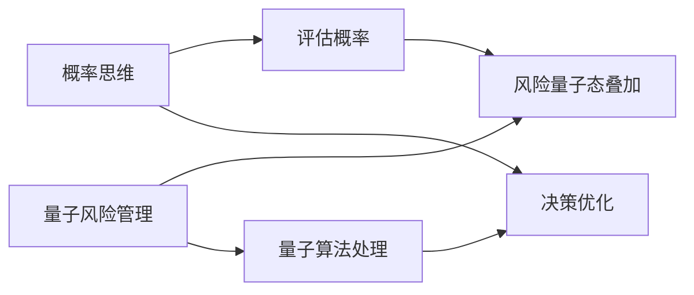

# 芒格的"概率思维"在量子风险管理中的高级应用

> 关键词：芒格、概率思维、量子风险管理、风险评估、决策优化

> 摘要：本文深入探讨了芒格的“概率思维”在量子风险管理中的高级应用。首先介绍了研究的背景、目的、预期读者等内容，接着阐述了概率思维和量子风险管理的核心概念及联系。详细讲解了相关核心算法原理，并给出Python代码示例。通过数学模型和公式进一步剖析其理论基础，结合项目实战展示具体的代码实现和分析。探讨了该思维在实际中的应用场景，推荐了相关的学习资源、开发工具框架和论文著作。最后总结了未来发展趋势与挑战，提供了常见问题解答和扩展阅读参考资料，旨在为读者全面呈现概率思维在量子风险管理领域的应用价值和方法。

## 1. 背景介绍 
### 1.1 目的和范围
本研究的目的在于深入探究芒格的“概率思维”如何在量子风险管理这一前沿领域发挥高级应用价值。通过对概率思维和量子风险管理的融合研究，旨在为金融、科技等多个行业提供更为精准、有效的风险评估和管理方法。范围涵盖了从理论原理的剖析到实际应用案例的分析，涉及概率理论、量子力学基础、风险管理策略等多个学科领域。

### 1.2 预期读者
本文预期读者包括金融领域的风险管理人员、投资分析师，科技行业的量子计算研究人员、软件开发工程师，以及对风险管理和概率思维感兴趣的学术研究人员和爱好者。通过阅读本文，读者能够深入理解概率思维在量子风险管理中的应用逻辑和方法，从而在实际工作和研究中加以运用。

### 1.3 文档结构概述
本文将按照以下结构展开：首先介绍相关背景信息，包括目的、预期读者和文档结构概述等；接着阐述概率思维和量子风险管理的核心概念及联系，并给出相应的文本示意图和Mermaid流程图；然后详细讲解核心算法原理，使用Python源代码进行说明；通过数学模型和公式进一步解释其理论基础，并举例说明；结合项目实战展示具体的代码实现和分析；探讨实际应用场景；推荐相关的学习资源、开发工具框架和论文著作；最后总结未来发展趋势与挑战，提供常见问题解答和扩展阅读参考资料。

### 1.4 术语表
#### 1.4.1 核心术语定义
- **芒格的概率思维**：由查理·芒格提出的一种思维方式，强调在决策过程中运用概率分析来评估各种可能结果的可能性，从而做出更理性、更优化的决策。
- **量子风险管理**：基于量子力学原理和方法，对复杂系统中的风险进行识别、评估和控制的管理策略。量子力学的不确定性和叠加态等特性为风险管理提供了新的视角和方法。
- **风险评估**：对可能影响目标实现的各种不确定因素进行识别、分析和评价的过程，以确定风险的性质、程度和影响范围。
- **决策优化**：在面临多种选择时，通过对各种因素的综合分析和评估，选择最优方案以实现目标最大化的过程。

#### 1.4.2 相关概念解释
- **量子力学基础**：量子力学是研究微观粒子运动规律的物理学分支，其核心概念包括量子态、叠加态、纠缠态等。这些概念在量子风险管理中被用来描述和处理复杂系统中的不确定性和关联性。
- **概率理论**：研究随机现象数量规律的数学分支，为风险评估和决策提供了理论基础。通过概率计算，可以量化各种事件发生的可能性，从而更好地理解和管理风险。

#### 1.4.3 缩略词列表
- **QM**：Quantum Mechanics（量子力学）
- **RM**：Risk Management（风险管理）

## 2. 核心概念与联系 

### 概率思维原理
芒格的概率思维核心在于认识到世界是充满不确定性的，而决策往往需要在这种不确定性的环境中做出。通过对各种可能结果的概率分析，决策者可以更好地评估风险和收益，从而做出更明智的决策。例如，在投资领域，投资者需要考虑不同投资项目的成功概率和潜在收益，以确定最优的投资组合。

### 量子风险管理原理
量子风险管理基于量子力学的原理，将复杂系统中的风险视为量子态的叠加。在量子力学中，粒子的状态可以同时处于多种可能的状态，直到被测量时才确定为某一具体状态。类似地，在量子风险管理中，风险也可以被看作是多种可能状态的叠加，通过量子算法和模型可以对这些状态进行分析和处理，从而更准确地评估和管理风险。

### 两者联系
概率思维和量子风险管理的联系在于它们都关注不确定性的处理。概率思维通过经典的概率理论来量化不确定性，而量子风险管理则借助量子力学的方法来处理更为复杂的不确定性。在量子风险管理中，概率思维可以作为一种基础的分析工具，用于对量子态的概率分布进行评估和分析。同时，量子力学的方法也可以为概率思维提供更强大的计算和分析能力，从而在复杂系统中实现更精准的风险评估和决策优化。

### 文本示意图
```plaintext
概率思维
|
|-- 评估各种可能结果的概率
|-- 基于概率做出决策

量子风险管理
|
|-- 将风险视为量子态的叠加
|-- 利用量子算法处理不确定性

联系：
概率思维为量子风险管理提供基础分析工具
量子力学方法为概率思维提供强大计算能力
```

### Mermaid流程图


## 3. 核心算法原理 & 具体操作步骤 

### 概率计算算法
在概率思维中，最基本的算法就是概率计算。假设我们有一个事件集合 $S$，其中包含 $n$ 个互斥的事件 $E_1, E_2, \cdots, E_n$，每个事件发生的概率分别为 $P(E_1), P(E_2), \cdots, P(E_n)$，且 $\sum_{i=1}^{n} P(E_i) = 1$。

以下是使用Python实现的简单概率计算示例：
```python
# 定义事件及其概率
events = ['E1', 'E2', 'E3']
probabilities = [0.2, 0.3, 0.5]

# 验证概率之和是否为1
total_probability = sum(probabilities)
if total_probability == 1:
    print("概率之和为1，符合要求")
else:
    print("概率之和不为1，请检查输入")

# 计算某个事件的概率
event_index = 1
print(f"事件 {events[event_index]} 的概率为: {probabilities[event_index]}")
```

### 量子风险管理中的量子态表示算法
在量子风险管理中，风险状态可以用量子态来表示。一个简单的两态量子系统可以用二维向量来表示，例如：
$$
|\psi\rangle = \alpha|0\rangle + \beta|1\rangle
$$
其中，$\alpha$ 和 $\beta$ 是复数，且 $|\alpha|^2 + |\beta|^2 = 1$，$|0\rangle$ 和 $|1\rangle$ 是基态。

以下是使用Python和Qiskit库实现的简单量子态表示示例：
```python
from qiskit import QuantumCircuit, Aer, execute
from qiskit.visualization import plot_bloch_multivector
import numpy as np

# 定义量子态的系数
alpha = np.sqrt(0.6)
beta = np.sqrt(0.4)

# 创建一个单量子比特的量子电路
qc = QuantumCircuit(1)
qc.initialize([alpha, beta], 0)

# 使用模拟器进行模拟
backend = Aer.get_backend('statevector_simulator')
job = execute(qc, backend)
result = job.result()
statevector = result.get_statevector()

# 打印量子态
print("量子态:", statevector)

# 绘制布洛赫球
plot_bloch_multivector(statevector).show()
```

### 具体操作步骤
1. **问题定义**：明确需要评估和管理的风险问题，确定相关的事件集合和可能的结果。
2. **数据收集**：收集与风险相关的数据，包括历史数据、市场信息等，用于计算概率和确定量子态的参数。
3. **概率计算**：使用概率理论和相关算法计算各个事件发生的概率。
4. **量子态表示**：将风险状态用量子态表示，确定量子态的系数和基态。
5. **量子算法处理**：使用量子算法对量子态进行分析和处理，例如量子模拟、量子优化等，以评估风险和优化决策。
6. **结果分析**：对量子算法的结果进行分析和解释，根据结果做出相应的决策和风险管理策略。

## 4. 数学模型和公式 & 详细讲解 & 举例说明 

### 概率理论基础公式
- **加法法则**：对于互斥事件 $A$ 和 $B$，它们的并事件的概率为：
$$
P(A \cup B) = P(A) + P(B)
$$
例如，在一个掷骰子的实验中，事件 $A$ 表示掷出的点数为 1，事件 $B$ 表示掷出的点数为 2。由于 $A$ 和 $B$ 是互斥事件，所以 $P(A \cup B) = P(A) + P(B) = \frac{1}{6} + \frac{1}{6} = \frac{1}{3}$。

- **乘法法则**：对于独立事件 $A$ 和 $B$，它们的交事件的概率为：
$$
P(A \cap B) = P(A) \times P(B)
$$
例如，同时掷两个骰子，事件 $A$ 表示第一个骰子掷出的点数为 1，事件 $B$ 表示第二个骰子掷出的点数为 2。由于两个骰子的掷出结果是相互独立的，所以 $P(A \cap B) = P(A) \times P(B) = \frac{1}{6} \times \frac{1}{6} = \frac{1}{36}$。

### 量子力学基础公式
- **量子态的归一化条件**：对于一个量子态 $|\psi\rangle = \alpha|0\rangle + \beta|1\rangle$，其归一化条件为：
$$
|\alpha|^2 + |\beta|^2 = 1
$$
例如，当 $\alpha = \frac{\sqrt{2}}{2}$，$\beta = \frac{\sqrt{2}}{2}$ 时，$|\alpha|^2 + |\beta|^2 = (\frac{\sqrt{2}}{2})^2 + (\frac{\sqrt{2}}{2})^2 = \frac{1}{2} + \frac{1}{2} = 1$，满足归一化条件。

- **测量概率**：在对量子态 $|\psi\rangle = \alpha|0\rangle + \beta|1\rangle$ 进行测量时，得到 $|0\rangle$ 态的概率为 $|\alpha|^2$，得到 $|1\rangle$ 态的概率为 $|\beta|^2$。
例如，对于量子态 $|\psi\rangle = \frac{\sqrt{3}}{2}|0\rangle + \frac{1}{2}|1\rangle$，测量得到 $|0\rangle$ 态的概率为 $(\frac{\sqrt{3}}{2})^2 = \frac{3}{4}$，测量得到 $|1\rangle$ 态的概率为 $(\frac{1}{2})^2 = \frac{1}{4}$。

### 量子风险管理中的数学模型
在量子风险管理中，可以使用量子态的演化来描述风险的变化。例如，一个简单的量子比特的演化可以用幺正变换来表示：
$$
|\psi(t)\rangle = U(t)|\psi(0)\rangle
$$
其中，$|\psi(0)\rangle$ 是初始量子态，$U(t)$ 是幺正算符，表示量子态随时间的演化。

例如，考虑一个单量子比特的旋转操作，其幺正算符为：
$$
U(\theta) = \begin{bmatrix}
\cos(\frac{\theta}{2}) & -i\sin(\frac{\theta}{2}) \\
-i\sin(\frac{\theta}{2}) & \cos(\frac{\theta}{2})
\end{bmatrix}
$$
假设初始量子态为 $|\psi(0)\rangle = |0\rangle$，当 $\theta = \frac{\pi}{2}$ 时，经过演化后的量子态为：
$$
|\psi(\frac{\pi}{2})\rangle = U(\frac{\pi}{2})|0\rangle = \begin{bmatrix}
\cos(\frac{\pi}{4}) & -i\sin(\frac{\pi}{4}) \\
-i\sin(\frac{\pi}{4}) & \cos(\frac{\pi}{4})
\end{bmatrix}
\begin{bmatrix}
1 \\
0
\end{bmatrix}
= \frac{\sqrt{2}}{2}
\begin{bmatrix}
1 \\
-i
\end{bmatrix}
$$

## 5. 项目实战：代码实际案例和详细解释说明 

### 5.1  开发环境搭建
- **安装Python**：从Python官方网站（https://www.python.org/downloads/）下载并安装Python 3.x版本。
- **安装Qiskit**：Qiskit是一个用于量子计算的开源Python库，可以使用以下命令进行安装：
```sh
pip install qiskit
```
- **安装相关依赖库**：根据具体需求，可能需要安装NumPy、Matplotlib等相关依赖库，可以使用以下命令进行安装：
```sh
pip install numpy matplotlib
```

### 5.2  源代码详细实现和代码解读
以下是一个使用Qiskit实现的简单量子风险管理模拟案例，假设我们要评估一个投资项目的风险，用一个量子比特的状态来表示项目的成功和失败状态。

```python
from qiskit import QuantumCircuit, Aer, execute
from qiskit.visualization import plot_histogram
import numpy as np

# 定义初始量子态的系数
alpha = np.sqrt(0.7)  # 成功的概率
beta = np.sqrt(0.3)   # 失败的概率

# 创建一个单量子比特的量子电路
qc = QuantumCircuit(1, 1)
qc.initialize([alpha, beta], 0)

# 进行测量
qc.measure(0, 0)

# 使用模拟器进行模拟
backend = Aer.get_backend('qasm_simulator')
job = execute(qc, backend, shots=1000)
result = job.result()
counts = result.get_counts()

# 打印测量结果
print("测量结果:", counts)

# 绘制直方图
plot_histogram(counts).show()
```

### 代码解读与分析
1. **导入必要的库**：导入Qiskit相关的库和NumPy、Matplotlib库，用于量子电路的创建、模拟和结果可视化。
2. **定义初始量子态的系数**：根据项目成功和失败的概率，定义量子态的系数 $\alpha$ 和 $\beta$。
3. **创建量子电路**：创建一个单量子比特的量子电路，并将其初始化为指定的量子态。
4. **进行测量**：对量子比特进行测量，将测量结果存储在经典比特中。
5. **使用模拟器进行模拟**：使用Qiskit的模拟器对量子电路进行模拟，设置模拟的次数为1000次。
6. **获取测量结果**：从模拟结果中获取测量的计数结果。
7. **打印测量结果并绘制直方图**：打印测量结果，并使用Matplotlib库绘制直方图，直观地展示测量结果的分布。

通过这个案例，我们可以看到如何使用量子计算的方法来模拟和评估投资项目的风险。通过改变初始量子态的系数，可以模拟不同的风险概率分布。

## 6. 实际应用场景 
### 金融风险管理
在金融领域，量子风险管理可以用于投资组合优化、信用风险评估、市场风险度量等方面。例如，通过量子算法可以更准确地评估不同资产之间的相关性，从而优化投资组合，降低风险。同时，量子计算可以处理大规模的金融数据，提高信用风险评估的准确性和效率。

### 供应链风险管理
在供应链管理中，量子风险管理可以用于评估供应链中断的风险、优化库存管理、预测需求波动等。例如，通过量子算法可以考虑供应链中多个环节的不确定性和关联性，制定更有效的风险管理策略，提高供应链的稳定性和可靠性。

### 医疗风险管理
在医疗领域，量子风险管理可以用于疾病预测、药物研发、医疗资源分配等方面。例如，通过量子算法可以分析大量的医疗数据，预测疾病的发生概率和发展趋势，为疾病的预防和治疗提供决策支持。同时，量子计算可以加速药物研发的过程，提高药物研发的成功率。

### 能源风险管理
在能源领域，量子风险管理可以用于电力系统的可靠性评估、能源市场的价格预测、可再生能源的并网优化等方面。例如，通过量子算法可以考虑电力系统中多个因素的不确定性，评估电力系统的可靠性，制定合理的能源调度策略，提高能源利用效率。

## 7. 工具和资源推荐
### 7.1 学习资源推荐
#### 7.1.1 书籍推荐
- 《穷查理宝典：查理·芒格的智慧箴言录》：深入介绍了查理·芒格的投资理念和思维方式，包括概率思维等重要内容。
- 《量子计算与量子信息》：经典的量子计算教材，全面介绍了量子计算的基本原理、算法和应用。
- 《风险管理与金融机构》：系统介绍了金融风险管理的理论和方法，对理解量子风险管理在金融领域的应用有很大帮助。

#### 7.1.2 在线课程
- Coursera上的“Quantum Computing for Everyone”：适合初学者的量子计算入门课程，介绍了量子计算的基本概念和原理。
- edX上