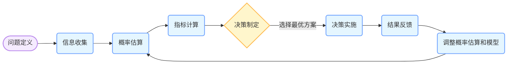

# 芒格的"概率思维"：在不确定性中做出明智决策

> 关键词：概率思维、芒格、不确定性、明智决策、决策模型

> 摘要：本文深入探讨了芒格的“概率思维”，旨在揭示如何运用概率思维在充满不确定性的环境中做出明智决策。文章详细介绍了概率思维的核心概念、相关算法原理，通过数学模型和公式进行了理论阐释，并结合项目实战案例展示了其具体应用。同时，分析了概率思维在不同实际场景中的运用，推荐了相关的学习资源、开发工具和论文著作。最后，总结了概率思维的未来发展趋势与挑战，并对常见问题进行了解答。

## 1. 背景介绍 
### 1.1 目的和范围
在当今复杂多变的世界中，不确定性无处不在，无论是投资领域、商业决策还是日常生活中的选择，都面临着各种未知因素。查理·芒格（Charlie Munger）作为投资界的传奇人物，强调了“概率思维”在决策过程中的重要性。本文的目的在于深入剖析芒格的概率思维，探讨如何将其应用于不同领域的决策中，帮助读者在不确定性中做出更明智的选择。范围涵盖概率思维的基本概念、算法原理、实际应用案例以及相关的学习资源和工具推荐。

### 1.2 预期读者
本文适合对投资、商业决策、风险管理等领域感兴趣的人士阅读，包括投资者、企业家、管理者、金融从业者以及对决策科学有探索欲望的普通读者。同时，对于计算机科学和人工智能领域的专业人员，概率思维也是构建智能决策系统的重要基础，因此也具有一定的参考价值。

### 1.3 文档结构概述
本文将按照以下结构展开：首先介绍概率思维的核心概念与联系，包括原理和架构的文本示意图以及 Mermaid 流程图；接着详细阐述核心算法原理，并给出具体操作步骤，同时使用 Python 源代码进行说明；然后通过数学模型和公式对概率思维进行深入讲解，并举例说明；之后结合项目实战案例，展示概率思维在实际中的应用，包括开发环境搭建、源代码实现和代码解读；再分析概率思维的实际应用场景；推荐相关的工具和资源，包括学习资源、开发工具框架和论文著作；最后总结概率思维的未来发展趋势与挑战，解答常见问题，并提供扩展阅读和参考资料。

### 1.4 术语表
#### 1.4.1 核心术语定义
- **概率思维**：是一种基于概率和统计学原理，对不确定事件进行分析和评估，从而做出决策的思维方式。它考虑了各种可能结果的发生概率，并根据概率大小来权衡不同选择的优劣。
- **期望值**：在概率理论中，期望值是指随机变量的所有可能取值按照其发生概率加权平均得到的结果。它反映了随机变量的平均水平，是决策中常用的一个重要指标。
- **贝叶斯定理**：是一种基于先验概率和新证据来更新后验概率的方法。它可以帮助我们在获得新信息时，对事件的发生概率进行修正和调整。

#### 1.4.2 相关概念解释
- **不确定性**：指事件的结果无法准确预测，存在多种可能的情况。不确定性是现实世界中普遍存在的现象，概率思维正是为了应对这种不确定性而产生的。
- **风险**：与不确定性密切相关，通常指在特定情况下，不利结果发生的可能性及其可能造成的损失。概率思维可以帮助我们对风险进行量化和评估，从而采取相应的措施来降低风险。

#### 1.4.3 缩略词列表
- **P(A)**：表示事件 A 发生的概率。
- **E(X)**：表示随机变量 X 的期望值。
- **P(A|B)**：表示在事件 B 发生的条件下，事件 A 发生的条件概率。

## 2. 核心概念与联系 

### 核心概念原理
概率思维的核心在于认识到世界是充满不确定性的，我们无法准确预知未来事件的具体结果，但可以通过分析和评估各种可能结果的发生概率，来做出更合理的决策。其基本原理基于概率论和统计学，通过对历史数据、经验和相关信息的分析，估算出不同事件发生的概率，并根据这些概率来计算期望值等指标，从而比较不同选择的优劣。

例如，在投资决策中，我们可以将不同投资项目的可能收益看作随机变量，通过分析市场情况、行业趋势、公司基本面等因素，估算出每个项目获得不同收益的概率。然后，根据这些概率计算出每个项目的期望值，期望值较高的项目通常具有更高的投资价值。

### 架构的文本示意图
概率思维的决策架构可以用以下文本描述：
1. **问题定义**：明确需要做出决策的问题，确定可能的选择和可能出现的结果。
2. **信息收集**：收集与问题相关的各种信息，包括历史数据、市场情况、专家意见等。
3. **概率估算**：根据收集到的信息，运用概率统计方法估算出每个可能结果的发生概率。
4. **指标计算**：根据估算出的概率，计算相关的决策指标，如期望值、方差等。
5. **决策制定**：比较不同选择的决策指标，选择最优的决策方案。
6. **反馈与调整**：在决策实施后，根据实际结果对概率估算和决策模型进行反馈和调整，以提高未来决策的准确性。

### Mermaid 流程图


## 3. 核心算法原理 & 具体操作步骤 

### 核心算法原理
概率思维中常用的核心算法包括期望值计算和贝叶斯定理。

#### 期望值计算
期望值是概率思维中一个重要的决策指标，它反映了随机变量的平均水平。对于离散型随机变量 $X$，其期望值 $E(X)$ 的计算公式为：
$$E(X)=\sum_{i=1}^{n}x_{i}P(X = x_{i})$$
其中，$x_{i}$ 是随机变量 $X$ 的第 $i$ 个可能取值，$P(X = x_{i})$ 是取值 $x_{i}$ 发生的概率，$n$ 是可能取值的个数。

#### 贝叶斯定理
贝叶斯定理用于根据新证据更新事件的概率。设 $A$ 和 $B$ 是两个事件，贝叶斯定理的公式为：
$$P(A|B)=\frac{P(B|A)P(A)}{P(B)}$$
其中，$P(A|B)$ 是在事件 $B$ 发生的条件下，事件 $A$ 发生的条件概率；$P(B|A)$ 是在事件 $A$ 发生的条件下，事件 $B$ 发生的条件概率；$P(A)$ 是事件 $A$ 的先验概率；$P(B)$ 是事件 $B$ 的概率。

### 具体操作步骤

#### 步骤 1：确定随机变量和可能取值
首先，明确需要分析的随机变量，并确定其所有可能的取值。例如，在投资决策中，随机变量可以是投资项目的收益，可能取值可以是不同的收益水平。

#### 步骤 2：估算概率
根据收集到的信息，运用概率统计方法估算出每个可能取值发生的概率。这可以通过历史数据、专家意见、市场调研等方式进行。

#### 步骤 3：计算期望值
根据估算出的概率和随机变量的可能取值，使用期望值计算公式计算出随机变量的期望值。

#### 步骤 4：运用贝叶斯定理更新概率（可选）
如果有新的证据或信息出现，可以使用贝叶斯定理更新事件的概率。首先确定先验概率 $P(A)$、条件概率 $P(B|A)$ 和事件 $B$ 的概率 $P(B)$，然后代入贝叶斯定理公式计算后验概率 $P(A|B)$。

#### 步骤 5：做出决策
比较不同选择的期望值或更新后的概率，选择期望值较高或概率更有利的方案作为决策结果。

### Python 源代码示例
```python
# 期望值计算示例
# 定义随机变量的可能取值和对应的概率
values = [100, 200, 300]
probabilities = [0.2, 0.5, 0.3]

# 计算期望值
expected_value = sum([value * prob for value, prob in zip(values, probabilities)])
print(f"期望值: {expected_value}")

# 贝叶斯定理示例
# 定义先验概率 P(A)
p_a = 0.3
# 定义条件概率 P(B|A)
p_b_given_a = 0.8
# 定义事件 B 的概率 P(B)
p_b = 0.4

# 计算后验概率 P(A|B)
p_a_given_b = (p_b_given_a * p_a) / p_b
print(f"后验概率 P(A|B): {p_a_given_b}")
```

## 4. 数学模型和公式 & 详细讲解 & 举例说明 

### 期望值模型
期望值模型是概率思维中最基本的数学模型之一，它通过对随机变量的所有可能取值按照其发生概率进行加权平均，来反映随机变量的平均水平。

#### 详细讲解
期望值的计算公式为：
$$E(X)=\sum_{i=1}^{n}x_{i}P(X = x_{i})$$
其中，$x_{i}$ 是随机变量 $X$ 的第 $i$ 个可能取值，$P(X = x_{i})$ 是取值 $x_{i}$ 发生的概率，$n$ 是可能取值的个数。

期望值的意义在于，它可以帮助我们在不确定的情况下，对不同选择的平均收益进行比较。例如，在投资决策中，如果有两个投资项目，项目 A 的期望值较高，那么从平均意义上来说，选择项目 A 可能会获得更高的收益。

#### 举例说明
假设有一个投资项目，有三种可能的收益情况：收益 100 元的概率为 0.2，收益 200 元的概率为 0.5，收益 300 元的概率为 0.3。则该投资项目的期望值为：
$$E(X)=100\times0.2 + 200\times0.5 + 300\times0.3 = 20 + 100 + 90 = 210$$
这意味着，从平均意义上来说，该投资项目每次投资的预期收益为 210 元。

### 贝叶斯定理模型
贝叶斯定理是一种基于先验概率和新证据来更新后验概率的方法，它在概率思维中具有重要的应用。

#### 详细讲解
贝叶斯定理的公式为：
$$P(A|B)=\frac{P(B|A)P(A)}{P(B)}$$
其中，$P(A|B)$ 是在事件 $B$ 发生的条件下，事件 $A$ 发生的条件概率；$P(B|A)$ 是在事件 $A$ 发生的条件下，事件 $B$ 发生的条件概率；$P(A)$ 是事件 $A$ 的先验概率；$P(B)$ 是事件 $B$ 的概率。

贝叶斯定理的核心思想是，当我们获得新的证据 $B$ 时，我们可以根据先验概率 $P(A)$ 和条件概率 $P(B|A)$ 来更新事件 $A$ 的概率，得到后验概率 $P(A|B)$。这使得我们能够在不断获得新信息的过程中，逐步修正对事件发生概率的估计。

#### 举例说明
假设在某个疾病检测中，已知人群中患病的概率 $P(A)=0.01$（先验概率），检测结果为阳性的概率 $P(B)=0.1$，而患病时检测结果为阳性的概率 $P(B|A)=0.9$。现在有一个人检测结果为阳性，我们想知道他真正患病的概率 $P(A|B)$。

根据贝叶斯定理：
$$P(A|B)=\frac{P(B|A)P(A)}{P(B)}=\frac{0.9\times0.01}{0.1}=0.09$$
这意味着，在检测结果为阳性的情况下，这个人真正患病的概率为 0.09。

## 5. 项目实战：代码实际案例和详细解释说明 

### 5.1  开发环境搭建
为了实现基于概率思维的决策模型，我们可以使用 Python 编程语言，并结合一些常用的科学计算库，如 NumPy 和 Pandas。以下是搭建开发环境的具体步骤：

#### 步骤 1：安装 Python
首先，确保你已经安装了 Python 3.x 版本。你可以从 Python 官方网站（https://www.python.org/downloads/）下载并安装适合你操作系统的 Python 版本。

#### 步骤 2：安装 NumPy 和 Pandas
打开命令行终端，使用以下命令安装 NumPy 和 Pandas：
```sh
pip install numpy pandas
```

#### 步骤 3：选择开发工具
你可以选择使用任何你喜欢的 Python 开发工具，如 PyCharm、Jupyter Notebook 等。这里我们以 Jupyter Notebook 为例，使用以下命令安装 Jupyter Notebook：
```sh
pip install jupyter notebook
```
安装完成后，在命令行终端中输入以下命令启动 Jupyter Notebook：
```sh
jupyter notebook
```

### 5.2  源代码详细实现和代码解读
以下是一个基于概率思维的投资决策案例的源代码实现：

```python
import numpy as np
import pandas as pd

# 定义投资项目的可能收益和对应的概率
projects = [
    {
        "name": "项目 A",
        "values": [100, 200, 300],
        "probabilities": [0.2, 0.5, 0.3]
    },
    {
        "name": "项目 B",
        "values": [50, 250, 400],
        "probabilities": [0.3, 0.4, 0.3]
    }
]

# 计算每个项目的期望值
results = []
for project in projects:
    values = np.array(project["values"])
    probabilities = np.array(project["probabilities"])
    expected_value = np.sum(values * probabilities)
    results.append({
        "项目名称": project["name"],
        "期望值": expected_value
    })

# 将结果转换为 DataFrame 并排序
df = pd.DataFrame(results)
df = df.sort_values(by="期望值", ascending=False)

# 输出结果
print("投资项目期望值分析结果：")
print(df)
```

#### 代码解读
1. **导入必要的库**：导入 NumPy 和 Pandas 库，用于数值计算和数据处理。
2. **定义投资项目**：使用列表和字典的形式定义了两个投资项目，每个项目包含项目名称、可能的收益和对应的概率。
3. **计算期望值**：遍历每个投资项目，将可能的收益和对应的概率转换为 NumPy 数组，然后使用 `np.sum()` 函数计算期望值。
4. **结果存储和排序**：将每个项目的名称和期望值存储在一个列表中，然后使用 Pandas 的 `DataFrame` 将列表转换为表格形式，并按照期望值降序排序。
5. **输出结果**：打印出投资项目期望值分析结果。

### 5.3  代码解读与分析
通过上述代码，我们可以比较不同投资项目的期望值，从而做出更明智的投资决策。在这个案例中，期望值较高的项目通常具有更高的投资价值。

需要注意的是，期望值只是一个平均指标，它不能完全反映投资项目的风险。在实际决策中，我们还需要考虑其他因素，如方差、标准差等，来评估投资项目的风险程度。

## 6. 实际应用场景 
### 投资决策
在投资领域，概率思维可以帮助投资者评估不同投资项目的风险和收益。通过估算每个投资项目的可能收益和对应的概率，计算出期望值和其他风险指标，投资者可以比较不同项目的优劣，选择最适合自己的投资组合。例如，在股票投资中，投资者可以分析不同股票的历史表现、行业前景、公司基本面等因素，估算出每只股票获得不同收益的概率，然后根据期望值和风险指标来决定是否投资以及投资的比例。

### 商业决策
在商业领域，概率思维可以应用于新产品研发、市场推广、供应链管理等多个方面。例如，在新产品研发决策中，企业可以通过市场调研和数据分析，估算出新产品在不同市场环境下的销售概率和利润水平，然后根据期望值来决定是否投入研发以及研发的规模。在市场推广方面，企业可以评估不同推广策略的效果和成本，选择期望值最高的推广方案。

### 风险管理
在风险管理中，概率思维可以帮助企业识别和评估各种风险因素，并采取相应的措施来降低风险。例如，在保险行业，保险公司可以通过分析历史数据和统计信息，估算出不同风险事件发生的概率和损失程度，然后根据这些概率来制定保险费率和理赔政策。在金融机构中，概率思维可以用于信用风险评估、市场风险度量等方面，帮助机构识别潜在的风险并采取相应的风险管理措施。

### 日常生活决策
在日常生活中，概率思维也可以帮助我们做出更明智的决策。例如，在购买彩票时，我们可以通过计算中奖的概率和奖金的期望值，来判断是否值得购买。在选择职业时，我们可以分析不同职业的发展前景、薪资水平和竞争程度等因素，估算出每个职业获得成功的概率和收益，然后根据期望值来做出职业选择。

## 7. 工具和资源推荐
### 7.1 学习资源推荐
#### 7.1.1 书籍推荐
- 《穷查理宝典：查理·芒格的智慧箴言录》：这本书收录了查理·芒格的演讲、文章和访谈，全面介绍了他的投资理念、思维方式和人生智慧，其中概率思维是重要的内容之一。
- 《概率论与数理统计》：这是一本经典的概率论教材，系统介绍了概率论和数理统计的基本概念、理论和方法，对于深入理解概率思维具有重要的帮助。
- 《思考，快与慢》：作者丹尼尔·卡尼曼是诺贝尔经济学奖获得者，他在书中介绍了人类思维的两种模式——快思考和慢思考，并分析了人类在决策过程中常见的认知偏差。概率思维可以帮助我们克服这些认知偏差，做出更理性的决策。

#### 7.1.2 在线课程
- Coursera 上的“Probability-The Science of Uncertainty and Data”：这门课程由斯坦福大学的教授授课，系统介绍了概率论的基本概念、理论和应用，适合初学者和有一定基础的学习者。
- edX 上的“Introduction to Probability - The Science of Uncertainty”：这门课程由麻省理工学院的教授授课，深入讲解了概率论的核心知识，包括随机变量、概率分布、期望值等内容。

#### 7.1.3 技术博客和网站
- 维基百科：维基百科上有丰富的概率论和统计学相关的词条，内容详细、准确，可以作为学习概率思维的重要参考资料。
- Towards Data Science：这是一个专注于数据科学和机器学习的技术博客，上面有很多关于概率思维、数据分析和决策模型的文章，对于了解概率思维的实际应用具有很大的帮助。

### 7.2 开发工具框架推荐
#### 7.2.1 IDE和编辑器
- PyCharm：是一款专业的 Python 集成开发环境，具有强大的代码编辑、调试和项目管理功能，适合开发基于 Python 的概率思维应用程序。
- Jupyter Notebook：是一个交互式的开发环境，支持 Python、R 等多种编程语言。它可以将代码、文本、图表等内容集成在一个文档中，方便进行数据分析和可视化，非常适合用于概率思维的实验和演示。

#### 7.2.2 调试和性能分析工具
- PDB：是 Python 自带的调试工具，可以帮助我们在代码中设置断点、单步执行代码、查看变量值等，方便调试基于概率思维的程序。
- cProfile：是 Python 自带的性能分析工具，可以帮助我们分析程序的运行时间和函数调用情况，找出程序中的性能瓶颈，优化代码性能。

#### 7.2.3 相关框架和库
- NumPy：是 Python 中用于科学计算的基础库，提供了高效的多维数组对象和各种数学函数，非常适合进行概率计算和数值分析。
- Pandas：是 Python 中用于数据处理和分析的库，提供了灵活的数据结构和数据操作方法，方便我们处理和分析概率相关的数据。
- SciPy：是 Python 中用于科学计算和工程计算的库，提供了各种概率分布函数、统计检验方法等，对于概率思维的实现具有重要的帮助。

### 7.3 相关论文著作推荐
#### 7.3.1 经典论文
- “A Mathematical Theory of Communication”：由克劳德·香农（Claude Shannon）发表，奠定了信息论的基础。信息论与概率论密切相关，对于理解不确定性和信息的度量具有重要的意义。
- “The Theory of Games and Economic Behavior”：由约翰·冯·诺伊曼（John von Neumann）和奥斯卡·摩根斯坦（Oskar Morgenstern）合著，开创了博弈论的研究。博弈论在决策科学中具有广泛的应用，与概率思维相互补充。

#### 7.3.2 最新研究成果
- 在学术数据库如 IEEE Xplore、ACM Digital Library 等上搜索“Probabilistic Decision Making”、“Probabilistic Reasoning”等关键词，可以找到关于概率思维的最新研究成果。这些研究成果涉及机器学习、人工智能、运筹学等多个领域，为概率思维的发展提供了新的思路和方法。

#### 7.3.3 应用案例分析
- 一些商业和金融领域的案例分析书籍和报告，如《哈佛商业评论》上的案例研究，会介绍企业在实际决策中如何应用概率思维来解决问题。通过学习这些案例，我们可以更好地理解概率思维在实际应用中的具体方法和技巧。

## 8. 总结：未来发展趋势与挑战
### 未来发展趋势
- **与人工智能的融合**：随着人工智能技术的不断发展，概率思维将与机器学习、深度学习等技术更加紧密地结合。例如，在强化学习中，智能体需要通过概率思维来评估不同动作的价值，从而做出最优的决策。概率图模型等概率方法也将在人工智能的知识表示和推理中发挥重要作用。
- **跨学科应用的拓展**：概率思维将在更多的学科领域得到应用，如生物学、医学、社会学等。在生物学中，概率思维可以用于分析基因表达的不确定性和生物进化的概率过程；在医学中，概率思维可以用于疾病诊断、治疗方案选择等方面；在社会学中，概率思维可以用于分析社会现象的不确定性和预测社会发展的趋势。
- **实时决策支持系统的发展**：随着大数据和云计算技术的发展，实时决策支持系统将越来越受到关注。概率思维可以帮助构建实时决策模型，根据实时数据和信息，快速做出决策。例如，在金融交易中，实时决策支持系统可以根据市场行情和交易数据，运用概率思维快速判断是否进行交易以及交易的数量和价格。

### 挑战
- **数据质量和可用性**：概率思维的应用依赖于大量的高质量数据。然而，在实际应用中，数据可能存在缺失、错误、不一致等问题，这会影响概率估算的准确性。此外，一些领域的数据可能受到隐私和安全等因素的限制，难以获取和使用。
- **模型复杂度和可解释性**：为了更准确地描述不确定性和做出决策，概率模型可能会变得非常复杂。复杂的模型虽然可以提高预测的准确性，但也会降低模型的可解释性。在一些应用场景中，如医疗决策和金融监管，模型的可解释性非常重要，需要在模型复杂度和可解释性之间找到平衡。
- **人类认知偏差的影响**：尽管概率思维可以帮助我们做出更理性的决策，但人类在决策过程中仍然会受到各种认知偏差的影响，如过度自信、锚定效应等。如何克服这些认知偏差，使人们更好地应用概率思维进行决策，是一个需要解决的问题。

## 9. 附录：常见问题与解答
### 问题 1：概率思维是否适用于所有决策场景？
概率思维适用于大多数存在不确定性的决策场景，但并不是适用于所有场景。在一些确定性较高的场景中，如按照既定规则进行的操作，可能不需要使用概率思维。此外，概率思维需要有一定的数据和信息支持，如果缺乏足够的数据和信息，概率估算的准确性会受到影响，此时概率思维的应用效果也会受到限制。

### 问题 2：如何提高概率估算的准确性？
提高概率估算的准确性可以从以下几个方面入手：
- **收集更多的数据**：数据量越大，概率估算的准确性通常越高。可以通过多种渠道收集相关的数据，如历史数据、市场调研数据、实验数据等。
- **使用合适的概率模型**：根据具体的问题和数据特点，选择合适的概率模型进行概率估算。不同的概率模型适用于不同的场景，选择合适的模型可以提高估算的准确性。
- **结合专家意见**：在一些情况下，专家的经验和知识可以帮助我们更准确地估算概率。可以邀请相关领域的专家进行评估和判断，并将专家意见与数据结合起来进行概率估算。

### 问题 3：概率思维与直觉决策有什么区别？
概率思维是一种基于概率和统计学原理的理性决策方式，它通过分析和评估各种可能结果的发生概率，来做出更合理的决策。而直觉决策则是基于个人的经验、感觉和直觉来做出决策，往往没有经过系统的分析和计算。概率思维可以帮助我们克服直觉决策中的认知偏差，做出更客观、更准确的决策。但在一些情况下，直觉决策也可以快速做出决策，尤其是在时间紧迫或缺乏数据的情况下。

## 10. 扩展阅读 & 参考资料
### 扩展阅读
- 《黑天鹅：如何应对不可预知的未来》：作者纳西姆·尼古拉斯·塔勒布（Nassim Nicholas Taleb）在书中介绍了黑天鹅事件的概念，强调了不确定性在现实世界中的重要性。概率思维可以帮助我们更好地应对黑天鹅事件。
- 《信号与噪声：为什么多数预测会失败，而有些却不会》：作者纳特·西尔弗（Nate Silver）通过大量的案例分析，介绍了如何在不确定性中进行准确的预测。概率思维是进行准确预测的重要工具之一。

### 参考资料
- 查理·芒格的演讲和文章：可以通过阅读查理·芒格的演讲和文章，深入了解他的概率思维和投资理念。
- 概率论和统计学相关的教材和学术论文：如《概率论基础教程》、《数理统计学导论》等教材，以及相关领域的学术论文，可以帮助我们系统学习概率论和统计学的知识。

作者：AI天才研究院/AI Genius Institute & 禅与计算机程序设计艺术 /Zen And The Art of Computer Programming