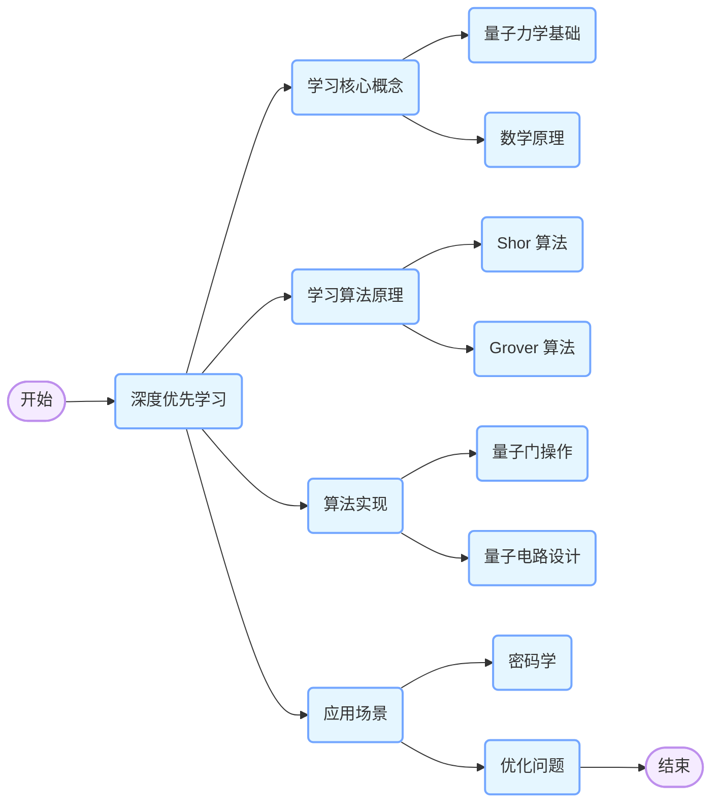

# 芒格的"深度优先"学习在量子算法研发中的重要性

> 关键词：芒格、深度优先学习、量子算法研发、学习方法、知识体系

> 摘要：本文探讨了芒格的“深度优先”学习方法在量子算法研发领域的重要性。首先介绍了“深度优先”学习的背景和相关概念，接着阐述了量子算法的核心概念及联系，详细讲解了量子算法的核心原理、操作步骤以及相关数学模型。通过实际项目案例展示了如何将“深度优先”学习应用于量子算法研发中。分析了量子算法的实际应用场景，推荐了相关的学习工具、资源和论文著作。最后总结了未来量子算法研发的发展趋势与挑战，并对常见问题进行了解答。

## 1. 背景介绍 
### 1.1 目的和范围
本文章旨在深入探讨芒格所倡导的“深度优先”学习方法在量子算法研发过程中的重要意义和应用价值。通过分析该学习方法的特点和优势，结合量子算法研发的复杂性和专业性，阐述如何运用“深度优先”学习来提升研发效率和质量。文章的范围涵盖了“深度优先”学习方法的理论基础、量子算法的基本概念和原理、实际项目中的应用案例以及相关的学习资源和工具推荐等方面。

### 1.2 预期读者
本文预期读者主要包括对量子算法研发感兴趣的科研人员、工程师、程序员，以及希望学习如何运用有效学习方法提升专业技能的学生和从业者。同时，对于对投资大师芒格的学习理念感兴趣，并想了解其在科技领域应用的读者也具有一定的参考价值。

### 1.3 文档结构概述
本文将按照以下结构进行阐述：首先介绍相关背景知识，包括“深度优先”学习和量子算法的基本概念；接着详细讲解量子算法的核心原理和操作步骤，以及与之相关的数学模型；然后通过实际项目案例展示“深度优先”学习在量子算法研发中的应用；分析量子算法的实际应用场景；推荐相关的学习工具、资源和论文著作；最后总结量子算法研发的未来发展趋势与挑战，并对常见问题进行解答。

### 1.4 术语表
#### 1.4.1 核心术语定义
- **深度优先学习**：一种学习方法，强调对某个领域的知识进行深入、系统的学习，先专注于核心概念和关键知识点，逐步构建完整的知识体系，而不是广泛但肤浅地涉猎多个领域。
- **量子算法**：基于量子力学原理设计的算法，利用量子比特的特性（如叠加态、纠缠态等）来解决特定问题，通常在某些计算任务上具有比经典算法更高的效率。
- **量子比特（qubit）**：量子计算中的基本信息单位，与经典比特（只能表示 0 或 1）不同，量子比特可以同时处于 0 和 1 的叠加态。
- **叠加态**：量子系统的一种状态，量子比特可以同时处于多个基态的线性组合状态，使得量子计算机能够并行处理多个计算任务。
- **纠缠态**：多个量子比特之间的一种特殊关联状态，其中一个量子比特的状态会瞬间影响其他纠缠量子比特的状态，无论它们之间的距离有多远。

#### 1.4.2 相关概念解释
- **量子计算**：利用量子力学原理进行信息处理的计算方式，通过操纵量子比特的状态来实现计算任务。
- **经典算法**：基于经典计算机的二进制逻辑设计的算法，如排序算法、搜索算法等。
- **量子门**：类似于经典逻辑门，是量子计算中用于操纵量子比特状态的基本操作单元。

#### 1.4.3 缩略词列表
- **QFT**：Quantum Fourier Transform，量子傅里叶变换
- **Shor**：Shor 算法，一种用于整数分解的量子算法
- **Grover**：Grover 算法，一种用于无序数据库搜索的量子算法

## 2. 核心概念与联系 

### 2.1 “深度优先”学习的原理
“深度优先”学习的核心思想是从一个领域的核心概念出发，逐步深入研究相关的细节和分支知识。这种学习方法的优点在于能够快速建立起对某个领域的深入理解，形成完整的知识体系。在学习过程中，学习者首先专注于最重要、最基础的知识点，然后逐步扩展到相关的子领域，不断深化对知识的理解和掌握。

### 2.2 量子算法的核心概念
量子算法是基于量子力学原理设计的算法，主要利用量子比特的叠加态和纠缠态来实现高效的计算。量子比特可以同时处于多个状态的叠加，这使得量子计算机能够并行处理多个计算任务，从而在某些问题上具有比经典计算机更高的计算效率。常见的量子算法包括 Shor 算法、Grover 算法等。

### 2.3 两者的联系
在量子算法研发中，“深度优先”学习方法具有重要的应用价值。量子算法涉及到量子力学、数学、计算机科学等多个领域的知识，其概念和原理较为复杂。通过“深度优先”学习，研发人员可以先深入掌握量子算法的核心概念和基本原理，如量子比特、叠加态、纠缠态等，然后逐步扩展到相关的数学模型和算法实现细节。这种学习方法有助于研发人员快速建立起对量子算法的深入理解，提高研发效率和质量。

### 2.4 文本示意图
```plaintext
深度优先学习
|-- 核心概念（量子比特、叠加态、纠缠态）
|   |-- 量子力学基础
|   |-- 数学原理（线性代数、概率论）
|-- 算法原理（Shor 算法、Grover 算法）
|   |-- 算法设计思路
|   |-- 复杂度分析
|-- 算法实现
|   |-- 量子门操作
|   |-- 量子电路设计
|-- 应用场景
|   |-- 密码学
|   |-- 优化问题
```

### 2.5 Mermaid 流程图


## 3. 核心算法原理 & 具体操作步骤 

### 3.1 Grover 算法原理
Grover 算法是一种用于无序数据库搜索的量子算法，其核心思想是通过量子振幅放大技术，在 $O(\sqrt{N})$ 的时间复杂度内找到目标元素，而经典算法的时间复杂度为 $O(N)$。

#### 算法步骤
1. **初始化**：将所有量子比特初始化为叠加态。
2. **Oracle 操作**：通过 Oracle 函数标记目标元素，使得目标元素的振幅变为相反数。
3. **扩散操作**：对所有量子比特进行扩散操作，增大目标元素的振幅。
4. **重复步骤 2 和 3**：多次重复 Oracle 操作和扩散操作，直到目标元素的振幅足够大。
5. **测量**：对所有量子比特进行测量，得到目标元素的概率较大。

### 3.2 Python 代码实现
```python
import numpy as np
from qiskit import QuantumCircuit, Aer, execute

# 定义数据库大小
N = 4
# 目标元素索引
target = 2

# 初始化量子电路
qc = QuantumCircuit(int(np.log2(N)), int(np.log2(N)))

# 步骤 1: 初始化所有量子比特为叠加态
qc.h(range(int(np.log2(N))))

# 步骤 2: Oracle 操作
def oracle(qc, target):
    target_binary = bin(target)[2:].zfill(int(np.log2(N)))
    for i, bit in enumerate(target_binary):
        if bit == '0':
            qc.x(i)
    qc.mct(list(range(int(np.log2(N)) - 1)), int(np.log2(N)) - 1)
    for i, bit in enumerate(target_binary):
        if bit == '0':
            qc.x(i)
    return qc

qc = oracle(qc, target)

# 步骤 3: 扩散操作
def diffusion(qc):
    qc.h(range(int(np.log2(N))))
    qc.x(range(int(np.log2(N))))
    qc.mct(list(range(int(np.log2(N)) - 1)), int(np.log2(N)) - 1)
    qc.x(range(int(np.log2(N))))
    qc.h(range(int(np.log2(N))))
    return qc

qc = diffusion(qc)

# 步骤 4: 重复 Oracle 和扩散操作
iterations = int(np.pi / 4 * np.sqrt(N)) - 1
for _ in range(iterations):
    qc = oracle(qc, target)
    qc = diffusion(qc)

# 步骤 5: 测量
qc.measure(range(int(np.log2(N))), range(int(np.log2(N))))

# 运行量子电路
backend = Aer.get_backend('qasm_simulator')
job = execute(qc, backend, shots=1024)
result = job.result()
counts = result.get_counts(qc)

# 输出结果
print("测量结果:", counts)
```

### 3.3 代码解释
1. **初始化量子电路**：使用 `QuantumCircuit` 类创建一个量子电路，其中包含 `int(np.log2(N))` 个量子比特和 `int(np.log2(N))` 个经典比特。
2. **初始化量子比特为叠加态**：使用 `h` 门对所有量子比特进行 Hadamard 变换，将其初始化为叠加态。
3. **Oracle 操作**：通过 `oracle` 函数标记目标元素，使用 `x` 门和 `mct` 门实现。
4. **扩散操作**：通过 `diffusion` 函数增大目标元素的振幅，使用 `h` 门、`x` 门和 `mct` 门实现。
5. **重复 Oracle 和扩散操作**：根据公式 $O(\sqrt{N})$ 计算迭代次数，多次重复 Oracle 和扩散操作。
6. **测量**：使用 `measure` 门对所有量子比特进行测量，并将结果存储在经典比特中。
7. **运行量子电路**：使用 `qasm_simulator` 后端运行量子电路，设置测量次数为 1024 次。
8. **输出结果**：使用 `get_counts` 方法获取测量结果，并打印输出。

## 4. 数学模型和公式 & 详细讲解 & 举例说明 

### 4.1 量子比特的数学表示
量子比特可以用二维复向量空间中的向量来表示，通常用基态 $|0\rangle$ 和 $|1\rangle$ 表示。一个量子比特的一般状态可以表示为：
$$|\psi\rangle = \alpha|0\rangle + \beta|1\rangle$$
其中 $\alpha$ 和 $\beta$ 是复数，满足 $|\alpha|^2 + |\beta|^2 = 1$。$|\alpha|^2$ 表示测量量子比特得到 $|0\rangle$ 的概率，$|\beta|^2$ 表示测量量子比特得到 $|1\rangle$ 的概率。

### 4.2 叠加态和纠缠态的数学表示
#### 叠加态
多个量子比特的叠加态可以表示为各个量子比特状态的张量积。例如，两个量子比特的叠加态可以表示为：
$$|\psi\rangle = \alpha_{00}|00\rangle + \alpha_{01}|01\rangle + \alpha_{10}|10\rangle + \alpha_{11}|11\rangle$$
其中 $\sum_{i,j=0}^{1}|\alpha_{ij}|^2 = 1$。

#### 纠缠态
纠缠态是多个量子比特之间的一种特殊关联状态，不能表示为各个量子比特状态的张量积。例如，Bell 态是一种常见的纠缠态：
$$|\Phi^+\rangle = \frac{1}{\sqrt{2}}(|00\rangle + |11\rangle)$$

### 4.3 Grover 算法的数学原理
#### 初始状态
Grover 算法的初始状态是所有量子比特的均匀叠加态：
$$|\psi_0\rangle = \frac{1}{\sqrt{N}}\sum_{x=0}^{N-1}|x\rangle$$
其中 $N$ 是数据库的大小。

#### Oracle 操作
Oracle 操作可以表示为一个幺正矩阵 $U_{\omega}$，它将目标元素的振幅变为相反数：
$$U_{\omega}|x\rangle = (-1)^{f(x)}|x\rangle$$
其中 $f(x)$ 是 Oracle 函数，当 $x$ 是目标元素时，$f(x) = 1$，否则 $f(x) = 0$。

#### 扩散操作
扩散操作可以表示为一个幺正矩阵 $U_s$：
$$U_s = 2|\psi_0\rangle\langle\psi_0| - I$$
其中 $I$ 是单位矩阵。

#### 振幅放大
通过多次重复 Oracle 操作和扩散操作，可以增大目标元素的振幅。假设初始状态下目标元素的振幅为 $\sin\theta$，经过 $k$ 次迭代后，目标元素的振幅为 $\sin((2k + 1)\theta)$。当 $(2k + 1)\theta \approx \frac{\pi}{2}$ 时，目标元素的振幅接近 1，测量得到目标元素的概率接近 1。

### 4.4 举例说明
假设数据库大小 $N = 4$，目标元素索引为 2。初始状态为：
$$|\psi_0\rangle = \frac{1}{\sqrt{4}}(|00\rangle + |01\rangle + |10\rangle + |11\rangle)$$
Oracle 操作后，目标元素 $|10\rangle$ 的振幅变为相反数：
$$U_{\omega}|\psi_0\rangle = \frac{1}{\sqrt{4}}(|00\rangle + |01\rangle - |10\rangle + |11\rangle)$$
扩散操作后，目标元素的振幅增大：
$$U_sU_{\omega}|\psi_0\rangle \approx |10\rangle$$
经过多次迭代后，测量得到目标元素 $|10\rangle$ 的概率接近 1。

## 5. 项目实战：代码实际案例和详细解释说明 

### 5.1  开发环境搭建
#### 安装 Python
首先需要安装 Python 环境，建议使用 Python 3.7 及以上版本。可以从 Python 官方网站（https://www.python.org/downloads/） 下载并安装。

#### 安装 Qiskit
Qiskit 是一个用于量子计算的开源框架，可以使用以下命令安装：
```sh
pip install qiskit
```

#### 安装其他依赖库
为了运行量子电路并进行可视化，还需要安装一些其他的依赖库，如 `matplotlib`：
```sh
pip install matplotlib
```

### 5.2  源代码详细实现和代码解读
```python
import numpy as np
from qiskit import QuantumCircuit, Aer, execute
import matplotlib.pyplot as plt

# 定义数据库大小
N = 8
# 目标元素索引
target = 5

# 初始化量子电路
qc = QuantumCircuit(int(np.log2(N)), int(np.log2(N)))

# 步骤 1: 初始化所有量子比特为叠加态
qc.h(range(int(np.log2(N))))

# 步骤 2: Oracle 操作
def oracle(qc, target):
    target_binary = bin(target)[2:].zfill(int(np.log2(N)))
    for i, bit in enumerate(target_binary):
        if bit == '0':
            qc.x(i)
    qc.mct(list(range(int(np.log2(N)) - 1)), int(np.log2(N)) - 1)
    for i, bit in enumerate(target_binary):
        if bit == '0':
            qc.x(i)
    return qc

qc = oracle(qc, target)

# 步骤 3: 扩散操作
def diffusion(qc):
    qc.h(range(int(np.log2(N))))
    qc.x(range(int(np.log2(N))))
    qc.mct(list(range(int(np.log2(N)) - 1)), int(np.log2(N)) - 1)
    qc.x(range(int(np.log2(N))))
    qc.h(range(int(np.log2(N))))
    return qc

qc = diffusion(qc)

# 步骤 4: 重复 Oracle 和扩散操作
iterations = int(np.pi / 4 * np.sqrt(N)) - 1
for _ in range(iterations):
    qc = oracle(qc, target)
    qc = diffusion(qc)

# 步骤 5: 测量
qc.measure(range(int(np.log2(N))), range(int(np.log2(N))))

# 运行量子电路
backend = Aer.get_backend('qasm_simulator')
job = execute(qc, backend, shots=1024)
result = job.result()
counts = result.get_counts(qc)

# 输出结果
print("测量结果:", counts)

# 可视化结果
plt.bar(counts.keys(), counts.values())
plt.xlabel('测量结果')
plt.ylabel('出现次数')
plt.title('Grover 算法测量结果')
plt.show()
```

### 5.3  代码解读与分析
1. **导入必要的库**：导入 `numpy`、`qiskit` 和 `matplotlib` 库。
2. **定义数据库大小和目标元素索引**：设置数据库大小 `N` 和目标元素索引 `target`。
3. **初始化量子电路**：使用 `QuantumCircuit` 类创建一个量子电路，包含 `int(np.log2(N))` 个量子比特和 `int(np.log2(N))` 个经典比特。
4. **初始化量子比特为叠加态**：使用 `h` 门对所有量子比特进行 Hadamard 变换，将其初始化为叠加态。
5. **Oracle 操作**：通过 `oracle` 函数标记目标元素，使用 `x` 门和 `mct` 门实现。
6. **扩散操作**：通过 `diffusion` 函数增大目标元素的振幅，使用 `h` 门、`x` 门和 `mct` 门实现。
7. **重复 Oracle 和扩散操作**：根据公式 $O(\sqrt{N})$ 计算迭代次数，多次重复 Oracle 和扩散操作。
8. **测量**：使用 `measure` 门对所有量子比特进行测量，并将结果存储在经典比特中。
9. **运行量子电路**：使用 `qasm_simulator` 后端运行量子电路，设置测量次数为 1024 次。
10. **输出结果**：使用 `get_counts` 方法获取测量结果，并打印输出。
11. **可视化结果**：使用 `matplotlib` 库绘制测量结果的柱状图，直观展示各个测量结果的出现次数。

## 6. 实际应用场景 
### 6.1 密码学
量子算法在密码学领域具有重要的应用价值。例如，Shor 算法可以在多项式时间内分解大整数，这对现有的基于大整数分解的密码体制（如 RSA 算法）构成了威胁。另一方面，量子密钥分发技术可以利用量子力学的原理实现无条件安全的密钥分发，为密码学提供了新的解决方案。

### 6.2 优化问题
量子算法可以用于解决各种优化问题，如旅行商问题、背包问题等。Grover 算法可以在无序数据库中快速搜索目标元素，对于某些优化问题可以提供更高效的解决方案。此外，量子退火算法可以用于求解组合优化问题，通过模拟量子系统的退火过程来寻找最优解。

### 6.3 机器学习
量子算法在机器学习领域也有潜在的应用。例如，量子支持向量机、量子神经网络等量子机器学习算法可以利用量子计算机的并行计算能力，提高机器学习模型的训练和预测效率。此外，量子算法还可以用于数据挖掘、特征选择等任务。

### 6.4 化学模拟
量子算法可以用于模拟量子系统的行为，在化学领域具有重要的应用。例如，通过量子算法可以模拟分子的电子结构和化学反应过程，为药物研发、材料科学等领域提供理论支持。

## 7. 工具和资源推荐
### 7.1 学习资源推荐
#### 7.1.1 书籍推荐
- 《量子计算与量子信息》（*Quantum Computation and Quantum Information*）：由 Michael A. Nielsen 和 Isaac L. Chuang 所著，是量子计算领域的经典教材，全面介绍了量子计算的基本原理、算法和应用。
- 《量子计算：从线性代数到物理实现》（*Quantum Computing: From Linear Algebra to Physical Realizations*）：由 Yanofsky 和 Mannucci 所著，从线性代数的角度出发，详细介绍了量子计算的数学基础和物理实现。
- 《穷查理宝典：查理·芒格的智慧箴言录》（*Poor Charlie's Almanack: The Wit and Wisdom of Charles T. Munger*）：介绍了芒格的投资理念和学习方法，对理解“深度优先”学习具有重要的参考价值。

#### 7.1.2 在线课程
- Coursera 上的《量子计算基础》（*Fundamentals of Quantum Computation*）：由 University of Colorado Boulder 提供，介绍了量子计算的基本概念、原理和算法。
- edX 上的《量子信息科学与量子计算》（*Quantum Information Science and Quantum Computing*）：由 Delft University of Technology 提供，深入讲解了量子信息科学和量子计算的相关知识。

#### 7.1.3 技术博客和网站
- Qiskit 官方博客（https://qiskit.org/blog/）：提供了量子计算领域的最新技术动态和研究成果。
- Quantum Computing Report（https://www.quantumcomputingreport.com/）：专注于量子计算领域的新闻和分析。

### 7.2 开发工具框架推荐
#### 7.2.1 IDE和编辑器
- PyCharm：一款功能强大的 Python 集成开发环境，支持代码编辑、调试、版本控制等功能。
- Visual Studio Code：一款轻量级的代码编辑器，支持多种编程语言和插件扩展，适合快速开发和调试量子算法。

#### 7.2.2 调试和性能分析工具
- Qiskit Aer：Qiskit 提供的量子模拟器，可以用于调试和验证量子电路的正确性。
- IBM Quantum Experience：IBM 提供的在线量子计算平台，支持用户在真实的量子计算机上运行量子算法，并提供性能分析工具。

#### 7.2.3 相关框架和库
- Qiskit：一个用于量子计算的开源框架，提供了量子电路设计、模拟和执行的工具。
- Cirq：Google 开发的用于量子计算的开源框架，支持多种量子硬件平台。

### 7.3 相关论文著作推荐
#### 7.3.1 经典论文
- Shor, P. W. (1994). Algorithms for quantum computation: discrete logarithms and factoring. *Proceedings of the 35th annual symposium on Foundations of computer science*. IEEE.
- Grover, L. K. (1996). A fast quantum mechanical algorithm for database search. *Proceedings of the twenty-eighth annual ACM symposium on Theory of computing*. ACM.

#### 7.3.2 最新研究成果
- Google 团队发表的关于量子霸权的论文：Arute, F., Arya, K., Babbush, R., Bacon, D., Bardin, J. C., Barends, R.,... & Neven, H. (2019). Quantum supremacy using a programmable superconducting processor. *Nature*, 574(7779), 505-510.

#### 7.3.3 应用案例分析
- 关于量子算法在密码学中的应用案例分析：Löhr, H., & Schaffner, C. (2017). Quantum key distribution: A survey. *arXiv preprint arXiv:1707.02662*.

## 8. 总结：未来发展趋势与挑战
### 8.1 未来发展趋势
- **硬件技术的进步**：随着量子比特数量的增加和量子比特保真度的提高，量子计算机的性能将不断提升，为量子算法的研发和应用提供更强大的支持。
- **跨学科研究的深入**：量子算法的研发需要涉及量子力学、数学、计算机科学等多个领域的知识，未来跨学科研究将更加深入，推动量子算法在更多领域的应用。
- **云量子计算的普及**：云量子计算平台的出现使得更多的科研人员和开发者能够方便地使用量子计算机，促进量子算法的研究和应用。

### 8.2 挑战
- **量子比特的稳定性**：量子比特非常脆弱，容易受到外界环境的干扰，导致量子比特的状态发生错误。如何提高量子比特的稳定性是量子算法研发面临的一个重要挑战。
- **量子算法的可扩展性**：目前大多数量子算法只能处理小规模的问题，如何将量子算法扩展到大规模问题是一个亟待解决的问题。
- **人才短缺**：量子算法研发需要具备深厚的量子力学、数学和计算机科学知识的专业人才，目前相关领域的人才短缺是制约量子算法发展的一个重要因素。

## 9. 附录：常见问题与解答
### 9.1 什么是“深度优先”学习？
“深度优先”学习是一种学习方法，强调对某个领域的知识进行深入、系统的学习，先专注于核心概念和关键知识点，逐步构建完整的知识体系，而不是广泛但肤浅地涉猎多个领域。

### 9.2 量子算法与经典算法有什么区别？
量子算法基于量子力学原理，利用量子比特的叠加态和纠缠态来实现高效的计算，在某些问题上具有比经典算法更高的计算效率。经典算法基于经典计算机的二进制逻辑设计，计算效率受到经典计算机硬件的限制。

### 9.3 如何学习量子算法？
可以通过阅读相关的书籍和论文、参加在线课程、使用开源框架进行实践等方式学习量子算法。同时，需要具备一定的量子力学、数学和计算机科学知识。

### 9.4 量子算法在实际应用中面临哪些挑战？
量子算法在实际应用中面临着量子比特的稳定性、量子算法的可扩展性、人才短缺等挑战。需要不断提高量子比特的保真度、优化量子算法的设计和实现、培养更多的专业人才来推动量子算法的实际应用。

## 10. 扩展阅读 & 参考资料
- Nielsen, M. A., & Chuang, I. L. (2010). *Quantum Computation and Quantum Information*. Cambridge University Press.
- Yanofsky, N. S., & Mannucci, M. A. (2008). *Quantum Computing for Computer Scientists*. Cambridge University Press.
- Munger, C. T. (2005). *Poor Charlie's Almanack: The Wit and Wisdom of Charles T. Munger*. Donning Company Publishers.
- Shor, P. W. (1994). Algorithms for quantum computation: discrete logarithms and factoring. *Proceedings of the 35th annual symposium on Foundations of computer science*. IEEE.
- Grover, L. K. (1996). A fast quantum mechanical algorithm for database search. *Proceedings of the twenty-eighth annual ACM symposium on Theory of computing*. ACM.
- Arute, F., Arya, K., Babbush, R., Bacon, D., Bardin, J. C., Barends, R.,... & Neven, H. (2019). Quantum supremacy using a programmable superconducting processor. *Nature*, 574(7779), 505-510.
- Löhr, H., & Schaffner, C. (2017). Quantum key distribution: A survey. *arXiv preprint arXiv:1707.02662*.

作者：AI天才研究院/AI Genius Institute & 禅与计算机程序设计艺术 /Zen And The Art of Computer Programming