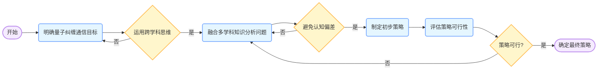

# 芒格的"清晰思考"方法在量子纠缠通信策略制定中的运用

> 关键词：芒格、清晰思考方法、量子纠缠通信、策略制定、跨学科思维

> 摘要：本文旨在探讨芒格的“清晰思考”方法如何应用于量子纠缠通信策略的制定。通过分析芒格清晰思考方法的核心要点，结合量子纠缠通信领域的特点和需求，详细阐述如何运用跨学科思维、避免认知偏差等方式，制定出更具科学性和前瞻性的量子纠缠通信策略。文章将介绍相关的核心概念、算法原理、数学模型，并通过项目实战案例展示该方法的实际应用，同时探讨其在实际场景中的应用以及未来的发展趋势与挑战。

## 1. 背景介绍 
### 1.1 目的和范围
本研究的主要目的是探索将芒格的“清晰思考”方法引入量子纠缠通信策略制定过程的可行性和有效性。量子纠缠通信作为一种新兴的通信技术，具有极高的安全性和潜在的高速通信能力，但在策略制定过程中面临诸多复杂的问题和挑战。芒格的“清晰思考”方法强调跨学科知识的运用和理性的决策思维，有望为量子纠缠通信策略的制定提供新的思路和方法。

本研究的范围涵盖了量子纠缠通信的基本原理、策略制定的流程和方法，以及芒格“清晰思考”方法的核心要点和应用场景。通过理论分析和实际案例研究，探讨如何将两者有机结合，以提高量子纠缠通信策略的科学性和有效性。

### 1.2 预期读者
本文预期读者包括从事量子通信领域的科研人员、工程师和技术专家，他们可以从本文中获取关于如何运用跨学科思维制定量子纠缠通信策略的新方法和新思路。同时，对投资哲学、决策思维感兴趣的读者，以及希望了解量子纠缠通信技术发展动态的普通读者也可以从本文中获得有价值的信息。

### 1.3 文档结构概述
本文将按照以下结构展开：
- 核心概念与联系：介绍芒格的“清晰思考”方法和量子纠缠通信的基本概念，以及两者之间的联系。
- 核心算法原理 & 具体操作步骤：阐述在量子纠缠通信策略制定中运用芒格“清晰思考”方法的算法原理和具体操作步骤。
- 数学模型和公式 & 详细讲解 & 举例说明：建立相关的数学模型，推导公式，并通过具体例子说明如何运用这些模型和公式进行策略制定。
- 项目实战：代码实际案例和详细解释说明：通过实际项目案例，展示如何运用芒格的“清晰思考”方法进行量子纠缠通信策略的制定，并对代码进行详细解读。
- 实际应用场景：探讨量子纠缠通信策略在不同实际场景中的应用，以及芒格“清晰思考”方法在其中的作用。
- 工具和资源推荐：推荐相关的学习资源、开发工具和论文著作，帮助读者进一步深入研究。
- 总结：未来发展趋势与挑战：总结本文的主要内容，分析量子纠缠通信策略制定的未来发展趋势和面临的挑战。
- 附录：常见问题与解答：解答读者在阅读过程中可能遇到的常见问题。
- 扩展阅读 & 参考资料：提供相关的扩展阅读材料和参考资料，方便读者进一步深入研究。

### 1.4 术语表
#### 1.4.1 核心术语定义
- 芒格的“清晰思考”方法：由查理·芒格提出的一种思考方式，强调运用跨学科知识、避免认知偏差、从多个角度分析问题等，以实现更理性、更准确的决策。
- 量子纠缠通信：利用量子纠缠现象进行信息传输的通信方式，具有极高的安全性和潜在的高速通信能力。
- 策略制定：根据特定的目标和条件，制定出一系列行动方案和决策的过程。

#### 1.4.2 相关概念解释
- 跨学科思维：将不同学科的知识和方法融合在一起，从多个角度分析和解决问题的思维方式。
- 认知偏差：人类在认知过程中由于各种因素的影响而产生的偏离客观事实的现象，如过度自信、锚定效应等。
- 量子纠缠：量子力学中的一种现象，两个或多个量子系统之间存在一种特殊的关联，使得它们的状态相互依赖，即使它们之间的距离很远。

#### 1.4.3 缩略词列表
- QEC：量子纠缠通信（Quantum Entanglement Communication）
- CTM：清晰思考方法（Clear Thinking Method）

## 2. 核心概念与联系 
### 2.1 芒格的“清晰思考”方法核心原理
芒格的“清晰思考”方法建立在跨学科知识体系之上。他认为，世界上的问题往往不是孤立存在的，而是涉及多个学科领域。因此，要想全面、深入地理解和解决问题，就需要掌握多个学科的基础知识，包括数学、物理学、生物学、心理学、经济学等。

例如，在分析一个商业问题时，不仅要考虑经济学原理，还要考虑心理学因素对消费者行为的影响，以及生物学中关于竞争和进化的概念。通过跨学科的视角，可以避免单一学科思维的局限性，更准确地把握问题的本质。

此外，芒格强调要避免认知偏差。人类的思维存在许多固有的缺陷，如过度自信、锚定效应、从众心理等，这些认知偏差会影响我们的决策质量。为了避免这些偏差，需要保持清醒的头脑，对自己的思维过程进行反思和批判。例如，在做决策时，要充分考虑各种可能性，避免被先入为主的观念所束缚。

### 2.2 量子纠缠通信基本原理
量子纠缠通信基于量子纠缠现象。量子纠缠是指两个或多个量子系统之间存在一种特殊的关联，使得它们的状态相互依赖，即使它们之间的距离很远。当一个量子系统的状态发生改变时，另一个与之纠缠的量子系统的状态也会立即发生相应的改变，这种改变是瞬间的，不受距离的限制。

在量子纠缠通信中，通常使用纠缠光子对作为信息载体。发送方和接收方分别持有纠缠光子对中的一个光子。发送方通过对自己手中的光子进行操作（如测量），可以将信息编码到光子的状态中。由于纠缠关系，接收方手中的光子状态也会相应改变，接收方通过对自己手中的光子进行测量，就可以解码出发送方所传递的信息。

### 2.3 两者之间的联系
将芒格的“清晰思考”方法应用于量子纠缠通信策略制定中具有重要意义。量子纠缠通信是一个高度复杂的领域，涉及到量子力学、信息科学、光学等多个学科的知识。运用跨学科思维，可以更好地理解量子纠缠通信的原理和技术，从而制定出更科学、更合理的策略。

例如，在量子纠缠通信系统的设计中，不仅要考虑量子力学的原理，还要考虑信息科学中的编码、解码算法，以及光学中的光传输和检测技术。通过跨学科的知识融合，可以优化系统的性能，提高通信的效率和安全性。

同时，避免认知偏差也有助于在量子纠缠通信策略制定中做出更准确的决策。在这个领域中，由于技术的复杂性和不确定性，很容易出现过度自信或盲目跟风的情况。运用芒格的“清晰思考”方法，可以保持理性和客观，充分评估各种风险和机遇，从而制定出更稳健的策略。

### 2.4 核心概念原理和架构的文本示意图
以下是一个简单的文本示意图，展示了芒格的“清晰思考”方法与量子纠缠通信策略制定之间的关系：

```plaintext
芒格的“清晰思考”方法
|
|-- 跨学科思维
|   |-- 融合多学科知识
|   |   |-- 量子力学
|   |   |-- 信息科学
|   |   |-- 光学
|   |   |-- 心理学
|   |   |-- 经济学
|   |-- 全面分析问题
|
|-- 避免认知偏差
|   |-- 保持理性客观
|   |-- 反思批判思维
|
|-- 应用于量子纠缠通信策略制定
|   |-- 系统设计
|   |-- 技术选择
|   |-- 风险评估
|   |-- 市场策略
```

### 2.5 Mermaid 流程图


## 3. 核心算法原理 & 具体操作步骤 
### 3.1 核心算法原理
在量子纠缠通信策略制定中运用芒格的“清晰思考”方法，核心算法原理可以概括为以下几个步骤：

#### 3.1.1 问题定义与目标设定
首先，需要明确量子纠缠通信面临的问题和要实现的目标。例如，提高通信的安全性、增加通信的距离、降低通信的成本等。这一步骤类似于算法中的输入部分，明确了问题的边界和期望的输出。

#### 3.1.2 跨学科知识融合
运用跨学科思维，收集和整合与量子纠缠通信相关的多个学科的知识。例如，量子力学知识用于理解纠缠现象和量子态的操作，信息科学知识用于设计编码和解码算法，光学知识用于光信号的传输和检测等。通过知识融合，建立一个全面的问题模型。

#### 3.1.3 认知偏差检测与修正
在分析问题和制定策略的过程中，要时刻警惕认知偏差的影响。例如，避免过度自信导致对技术难度的低估，避免锚定效应导致对初始方案的过度依赖等。可以通过反思、批判和多角度分析等方式来检测和修正认知偏差。

#### 3.1.4 策略生成与评估
基于跨学科知识和修正后的认知，生成多种可能的策略方案。然后，运用数学模型和评估指标对这些方案进行评估，选择最优的策略方案。评估指标可以包括通信性能、成本、可靠性等。

### 3.2 具体操作步骤
以下是运用芒格的“清晰思考”方法制定量子纠缠通信策略的具体操作步骤：

#### 3.2.1 步骤一：明确问题和目标
- 与量子纠缠通信项目的相关人员进行沟通，了解项目的背景和需求。
- 确定要解决的具体问题，如提高通信的安全性或增加通信的距离。
- 明确项目的目标，如在一定时间内实现特定的通信性能指标。

#### 3.2.2 步骤二：跨学科知识学习与整合
- 学习量子力学、信息科学、光学等相关学科的基础知识。
- 收集和整理与量子纠缠通信相关的文献、研究报告和实际案例。
- 将不同学科的知识进行整合，建立一个综合的知识体系。

#### 3.2.3 步骤三：认知偏差检测
- 回顾自己的思维过程，检查是否存在过度自信、锚定效应、从众心理等认知偏差。
- 与团队成员进行讨论，听取不同的意见和建议，从多个角度审视问题。

#### 3.2.4 步骤四：策略生成
- 根据跨学科知识和修正后的认知，提出多种可能的策略方案。
- 对每个方案进行详细的描述，包括技术路线、实施步骤、预期效果等。

#### 3.2.5 步骤五：策略评估
- 建立评估指标体系，如通信性能指标（传输速率、误码率等）、成本指标（设备成本、运营成本等）、可靠性指标（系统稳定性、抗干扰能力等）。
- 运用数学模型和评估方法对每个策略方案进行评估，计算出每个方案的综合得分。

#### 3.2.6 步骤六：策略选择与优化
- 根据评估结果，选择得分最高的策略方案作为初步方案。
- 对初步方案进行进一步的优化和完善，考虑实际实施过程中可能遇到的问题和风险。

#### 3.2.7 步骤七：实施与监控
- 按照优化后的策略方案进行实施，建立项目进度管理和监控机制。
- 定期对项目的进展情况进行评估和分析，根据实际情况及时调整策略。

### 3.3 Python 源代码实现
以下是一个简单的 Python 代码示例，用于模拟运用芒格的“清晰思考”方法进行量子纠缠通信策略评估的过程：

```python
# 定义策略方案类
class Strategy:
    def __init__(self, name, performance, cost, reliability):
        self.name = name
        self.performance = performance
        self.cost = cost
        self.reliability = reliability

    def get_score(self, performance_weight=0.4, cost_weight=0.3, reliability_weight=0.3):
        """
        计算策略方案的综合得分
        :param performance_weight: 性能指标权重
        :param cost_weight: 成本指标权重
        :param reliability_weight: 可靠性指标权重
        :return: 综合得分
        """
        score = self.performance * performance_weight + \
                (1 - self.cost) * cost_weight + \
                self.reliability * reliability_weight
        return score

# 定义策略评估函数
def evaluate_strategies(strategies):
    best_strategy = None
    best_score = -1
    for strategy in strategies:
        score = strategy.get_score()
        if score > best_score:
            best_score = score
            best_strategy = strategy
    return best_strategy

# 示例策略方案
strategy1 = Strategy("策略1", performance=0.8, cost=0.3, reliability=0.7)
strategy2 = Strategy("策略2", performance=0.6, cost=0.2, reliability=0.9)
strategy3 = Strategy("策略3", performance=0.7, cost=0.4, reliability=0.8)

# 策略列表
strategies = [strategy1, strategy2, strategy3]

# 评估策略方案
best_strategy = evaluate_strategies(strategies)

print(f"最优策略方案: {best_strategy.name}，综合得分: {best_strategy.get_score()}")
```

### 3.4 代码解释
- `Strategy` 类：用于表示一个策略方案，包含策略名称、性能指标、成本指标和可靠性指标。`get_score` 方法用于计算该策略方案的综合得分，通过加权求和的方式将各个指标进行综合评估。
- `evaluate_strategies` 函数：用于对多个策略方案进行评估，找出综合得分最高的策略方案。
- 示例部分：创建了三个示例策略方案，并将它们存储在列表中。调用 `evaluate_strategies` 函数对这些策略方案进行评估，最后输出最优策略方案的名称和综合得分。

## 4. 数学模型和公式 & 详细讲解 & 举例说明 
### 4.1 数学模型建立
在量子纠缠通信策略制定中，可以建立一个多目标决策的数学模型。设共有 $n$ 个策略方案，每个方案有 $m$ 个评估指标，用 $x_{ij}$ 表示第 $i$ 个策略方案在第 $j$ 个评估指标上的取值，其中 $i = 1, 2, \cdots, n$，$j = 1, 2, \cdots, m$。每个评估指标有相应的权重 $w_j$，且 $\sum_{j = 1}^{m} w_j = 1$。

则第 $i$ 个策略方案的综合得分 $S_i$ 可以表示为：

$$S_i = \sum_{j = 1}^{m} w_j x_{ij}$$

### 4.2 公式详细讲解
- $x_{ij}$：表示第 $i$ 个策略方案在第 $j$ 个评估指标上的取值。例如，$x_{i1}$ 可以表示第 $i$ 个策略方案的通信性能指标（如传输速率），$x_{i2}$ 可以表示成本指标（如设备成本）等。这些取值需要根据实际情况进行量化和标准化处理，以确保不同指标之间具有可比性。
- $w_j$：表示第 $j$ 个评估指标的权重。权重的确定需要根据项目的目标和重点来进行。例如，如果项目更注重通信性能，则通信性能指标的权重可以设置得较高；如果更注重成本控制，则成本指标的权重可以设置得较高。
- $S_i$：表示第 $i$ 个策略方案的综合得分。通过比较不同策略方案的综合得分，可以选择出最优的策略方案。

### 4.3 举例说明
假设我们要对三个量子纠缠通信策略方案进行评估，评估指标包括通信性能、成本和可靠性，权重分别为 $w_1 = 0.4$，$w_2 = 0.3$，$w_3 = 0.3$。三个策略方案在各个评估指标上的取值如下表所示：

| 策略方案 | 通信性能 $x_{i1}$ | 成本 $x_{i2}$ | 可靠性 $x_{i3}$ |
| ---- | ---- | ---- | ---- |
| 策略 1 | 0.8 | 0.3 | 0.7 |
| 策略 2 | 0.6 | 0.2 | 0.9 |
| 策略 3 | 0.7 | 0.4 | 0.8 |

根据上述公式，计算每个策略方案的综合得分：

- 策略 1 的综合得分：

$$S_1 = 0.4 \times 0.8 + 0.3 \times (1 - 0.3) + 0.3 \times 0.7 = 0.32 + 0.21 + 0.21 = 0.74$$

- 策略 2 的综合得分：

$$S_2 = 0.4 \times 0.6 + 0.3 \times (1 - 0.2) + 0.3 \times 0.9 = 0.24 + 0.24 + 0.27 = 0.75$$

- 策略 3 的综合得分：

$$S_3 = 0.4 \times 0.7 + 0.3 \times (1 - 0.4) + 0.3 \times 0.8 = 0.28 + 0.18 + 0.24 = 0.7$$

比较三个策略方案的综合得分，$S_2 > S_1 > S_3$，因此策略 2 为最优策略方案。

## 5. 项目实战：代码实际案例和详细解释说明 
### 5.1  开发环境搭建
#### 5.1.1 操作系统
建议使用 Linux 或 macOS 操作系统，因为它们对 Python 开发环境的支持较好。也可以使用 Windows 操作系统，但需要注意一些环境配置的细节。

#### 5.1.2 Python 安装
从 Python 官方网站（https://www.python.org/downloads/）下载并安装 Python 3.x 版本。安装完成后，在命令行中输入 `python --version` 检查 Python 是否安装成功。

#### 5.1.3 虚拟环境创建
为了避免不同项目之间的依赖冲突，建议使用虚拟环境。可以使用 `venv` 模块来创建虚拟环境，命令如下：

```bash
python -m venv myenv
```

其中 `myenv` 是虚拟环境的名称，可以根据需要进行修改。激活虚拟环境：

- 在 Linux 或 macOS 上：

```bash
source myenv/bin/activate
```

- 在 Windows 上：

```bash
myenv\Scripts\activate
```

#### 5.1.4 依赖库安装
在虚拟环境中安装所需的依赖库，主要是 Python 的基本库和可能用到的科学计算库，如 `numpy`、`pandas` 等。可以使用 `pip` 进行安装：

```bash
pip install numpy pandas
```

### 5.2  源代码详细实现和代码解读
以下是一个更完整的 Python 代码示例，用于模拟一个量子纠缠通信策略制定的项目实战：

```python
import pandas as pd

# 定义策略方案类
class Strategy:
    def __init__(self, name, performance, cost, reliability):
        self.name = name
        self.performance = performance
        self.cost = cost
        self.reliability = reliability

    def get_score(self, performance_weight=0.4, cost_weight=0.3, reliability_weight=0.3):
        """
        计算策略方案的综合得分
        :param performance_weight: 性能指标权重
        :param cost_weight: 成本指标权重
        :param reliability_weight: 可靠性指标权重
        :return: 综合得分
        """
        score = self.performance * performance_weight + \
                (1 - self.cost) * cost_weight + \
                self.reliability * reliability_weight
        return score

# 定义策略评估函数
def evaluate_strategies(strategies):
    scores = []
    for strategy in strategies:
        score = strategy.get_score()
        scores.append(score)
    df = pd.DataFrame({
        '策略名称': [strategy.name for strategy in strategies],
        '综合得分': scores
    })
    df = df.sort_values(by='综合得分', ascending=False)
    return df

# 示例策略方案
strategy1 = Strategy("策略1", performance=0.8, cost=0.3, reliability=0.7)
strategy2 = Strategy("策略2", performance=0.6, cost=0.2, reliability=0.9)
strategy3 = Strategy("策略3", performance=0.7, cost=0.4, reliability=0.8)

# 策略列表
strategies = [strategy1, strategy2, strategy3]

# 评估策略方案
result = evaluate_strategies(strategies)

# 输出评估结果
print("策略评估结果：")
print(result)
```

### 5.3  代码解读与分析
- `Strategy` 类：与之前的代码示例相同，用于表示一个策略方案，包含策略名称、性能指标、成本指标和可靠性指标。`get_score` 方法用于计算该策略方案的综合得分。
- `evaluate_strategies` 函数：该函数接受一个策略方案列表作为输入，计算每个策略方案的综合得分，并将结果存储在一个 `pandas` 数据框中。然后，按照综合得分对数据框进行降序排序，返回排序后的结果。
- 示例部分：创建了三个示例策略方案，并将它们存储在列表中。调用 `evaluate_strategies` 函数对这些策略方案进行评估，最后输出评估结果。

通过这个代码示例，我们可以看到如何运用 Python 代码实现量子纠缠通信策略的评估过程。在实际项目中，可以根据具体需求对代码进行扩展和优化，例如添加更多的评估指标、动态调整指标权重等。

## 6. 实际应用场景 
### 6.1 军事通信领域
在军事通信中，信息的安全性至关重要。量子纠缠通信具有极高的安全性，因为任何对纠缠光子的测量都会破坏纠缠态，从而被通信双方察觉。运用芒格的“清晰思考”方法制定量子纠缠通信策略，可以综合考虑军事作战的需求、量子通信技术的特点以及成本和可靠性等因素。

例如，在制定军事通信网络的建设策略时，需要运用跨学科思维，结合军事战略、量子力学、信息科学等知识。要考虑到通信节点的布局、通信线路的选择、信号的加密和解密等问题。同时，避免认知偏差，不能盲目追求技术的先进性而忽视实际的作战需求和成本限制。

### 6.2 金融交易领域
金融交易对信息的及时性和安全性要求很高。量子纠缠通信可以提供更快速、更安全的信息传输通道，有助于提高金融交易的效率和可靠性。在制定金融交易量子纠缠通信策略时，芒格的“清晰思考”方法可以帮助我们全面分析问题。

一方面，要考虑金融市场的特点和需求，如交易的高频性、数据的保密性等。另一方面，要结合量子通信技术的发展现状和趋势，选择合适的技术方案和设备。同时，要避免认知偏差，不能因为量子通信技术的新颖性而过度乐观，要充分评估技术的成熟度和实际应用的可行性。

### 6.3 科研合作领域
在科研合作中，不同研究团队之间需要进行大量的数据传输和共享。量子纠缠通信可以为科研合作提供更高效、更安全的通信方式。运用芒格的“清晰思考”方法制定科研合作量子纠缠通信策略，可以促进科研工作的顺利开展。

例如，在国际科研合作项目中，需要考虑不同国家和地区的科研需求、法律法规、技术标准等因素。通过跨学科思维，结合量子力学、信息科学、国际关系等知识，制定出符合各方利益的通信策略。同时，避免认知偏差，不能因为文化差异或信息不对称而做出错误的决策。

## 7. 工具和资源推荐
### 7.1 学习资源推荐
#### 7.1.1 书籍推荐
- 《穷查理宝典：查理·芒格的智慧箴言录》：这本书详细介绍了查理·芒格的投资哲学和“清晰思考”方法，是学习芒格思想的经典著作。
- 《量子力学导论》：由 David J. Griffiths 所著，是一本优秀的量子力学入门教材，对于理解量子纠缠通信的原理有很大帮助。
- 《信息论、编码与密码学》：全面介绍了信息论的基本概念、编码和解码算法以及密码学的相关知识，对于量子纠缠通信中的信息处理和安全保障有重要的参考价值。

#### 7.1.2 在线课程
- Coursera 上的“量子计算与量子信息”课程：由知名高校的教授授课，系统地介绍了量子计算和量子信息的基本理论和技术。
- edX 上的“信息论基础”课程：深入讲解了信息论的基本概念和应用，对于理解量子纠缠通信中的信息传输有很大帮助。

#### 7.1.3 技术博客和网站
- 量子计算前沿（https://www.qbitai.com/）：专注于量子计算和量子通信领域的技术动态和研究成果，提供了丰富的资讯和技术文章。
- 科学网（https://www.sciencenet.cn/）：涵盖了多个学科领域的科研动态和学术交流，其中也有关于量子纠缠通信的相关报道和研究成果。

### 7.2 开发工具框架推荐
#### 7.2.1 IDE和编辑器
- PyCharm：是一款专业的 Python 集成开发环境，提供了丰富的代码编辑、调试和项目管理功能，适合 Python 开发。
- Jupyter Notebook：是一个交互式的开发环境，支持 Python、R 等多种编程语言，方便进行代码编写、数据分析和可视化。

#### 7.2.2 调试和性能分析工具
- pdb：Python 自带的调试工具，可以帮助开发者逐步调试代码，查找问题。
- cProfile：Python 的性能分析工具，可以分析代码的运行时间和函数调用情况，帮助优化代码性能。

#### 7.2.3 相关框架和库
- Qiskit：是 IBM 开发的一个开源量子计算框架，提供了量子电路设计、模拟和实验等功能，对于量子纠缠通信的研究和开发有一定的参考价值。
- NumPy：是 Python 的一个科学计算库，提供了高效的数组操作和数学函数，在量子纠缠通信的数值模拟和数据分析中经常使用。

### 7.3 相关论文著作推荐
#### 7.3.1 经典论文
- “Teleporting an unknown quantum state via dual classical and Einstein-Podolsky-Rosen channels”：由 C. H. Bennett 等人发表于 1993 年的 Science 杂志上，首次提出了量子隐形传态的概念，是量子纠缠通信领域的经典论文。
- “Quantum cryptography based on Bell's theorem”：由 A. K. Ekert 发表于 1991 年的 Physical Review Letters 杂志上，提出了基于贝尔定理的量子密码学方案，为量子纠缠通信的安全性提供了理论基础。

#### 7.3.2 最新研究成果
- 关注 Nature、Science、Physical Review Letters 等顶级学术期刊上关于量子纠缠通信的最新研究论文，了解该领域的前沿动态和最新技术。

#### 7.3.3 应用案例分析
- 查阅相关的学术会议论文集和行业报告，了解量子纠缠通信在军事、金融、科研等领域的实际应用案例和经验教训。

## 8. 总结：未来发展趋势与挑战
### 8.1 未来发展趋势
#### 8.1.1 技术融合趋势
未来，量子纠缠通信技术将与其他前沿技术如人工智能、物联网等深度融合。例如，将量子纠缠通信应用于物联网中，可以提高物联网设备之间通信的安全性和效率。同时，利用人工智能技术对量子纠缠通信系统进行优化和管理，可以提高系统的性能和可靠性。

#### 8.1.2 产业化发展趋势
随着量子纠缠通信技术的不断成熟，其产业化发展将加速。越来越多的企业将投入到量子纠缠通信领域的研发和应用中，推动量子纠缠通信设备的商业化生产和应用。例如，量子加密通信设备可能会在金融、军事等领域得到更广泛的应用。

#### 8.1.3 国际合作趋势
量子纠缠通信是一个全球性的研究课题，需要各国科研团队之间的合作和交流。未来，国际合作将更加紧密，各国将共同攻克量子纠缠通信技术中的关键难题，推动该领域的发展。

### 8.2 面临的挑战
#### 8.2.1 技术难题
尽管量子纠缠通信技术取得了一定的进展，但仍然面临着许多技术难题。例如，量子纠缠态的制备和保持难度较大，量子信号的传输距离有限，量子通信设备的成本较高等。解决这些技术难题需要大量的科研投入和时间。

#### 8.2.2 标准和规范缺失
目前，量子纠缠通信领域的标准和规范还不完善。缺乏统一的标准和规范会给量子纠缠通信设备的研发、生产和应用带来困难，也不利于该领域的产业化发展。因此，需要尽快建立和完善相关的标准和规范。

#### 8.2.3 人才短缺
量子纠缠通信是一个高度专业化的领域，需要具备量子力学、信息科学、光学等多学科知识的专业人才。目前，该领域的人才短缺问题比较严重，制约了量子纠缠通信技术的发展。培养和吸引更多的专业人才是解决这一问题的关键。

## 9. 附录：常见问题与解答
### 9.1 什么是量子纠缠通信？
量子纠缠通信是利用量子纠缠现象进行信息传输的通信方式。量子纠缠是指两个或多个量子系统之间存在一种特殊的关联，使得它们的状态相互依赖，即使它们之间的距离很远。当一个量子系统的状态发生改变时，另一个与之纠缠的量子系统的状态也会立即发生相应的改变，这种改变是瞬间的，不受距离的限制。

### 9.2 芒格的“清晰思考”方法有哪些核心要点？
芒格的“清晰思考”方法的核心要点包括：
- 跨学科思维：运用多个学科的知识和方法来分析和解决问题，避免单一学科思维的局限性。
- 避免认知偏差：保持清醒的头脑，对自己的思维过程进行反思和批判，避免过度自信、锚定效应、从众心理等认知偏差的影响。
- 从多个角度分析问题：全面、深入地了解问题的本质，考虑各种可能性和后果。

### 9.3 如何将芒格的“清晰思考”方法应用于量子纠缠通信策略制定中？
可以按照以下步骤将芒格的“清晰思考”方法应用于量子纠缠通信策略制定中：
- 明确问题和目标：确定量子纠缠通信面临的问题和要实现的目标。
- 跨学科知识学习与整合：学习量子力学、信息科学、光学等相关学科的知识，并将其整合到策略制定过程中。
- 认知偏差检测与修正：检查自己的思维过程，避免认知偏差的影响。
- 策略生成与评估：基于跨学科知识和修正后的认知，生成多种可能的策略方案，并运用数学模型和评估指标对这些方案进行评估。
- 策略选择与优化：选择最优的策略方案，并对其进行进一步的优化和完善。

### 9.4 量子纠缠通信在实际应用中存在哪些困难？
量子纠缠通信在实际应用中存在以下困难：
- 技术难题：量子纠缠态的制备和保持难度较大，量子信号的传输距离有限，量子通信设备的成本较高等。
- 标准和规范缺失：目前量子纠缠通信领域的标准和规范还不完善，给设备的研发、生产和应用带来困难。
- 人才短缺：该领域需要具备多学科知识的专业人才，目前人才短缺问题比较严重。

## 10. 扩展阅读 & 参考资料
### 10.1 扩展阅读
- 《人类的群星闪耀时》：斯蒂芬·茨威格的经典著作，通过讲述历史上的重大事件和人物故事，展现了人类的智慧和勇气，对于培养跨学科思维和历史视野有很大帮助。
- 《思考，快与慢》：丹尼尔·卡尼曼的著作，深入探讨了人类的思维方式和决策过程，揭示了认知偏差的产生机制和影响，对于理解芒格的“清晰思考”方法有重要的参考价值。

### 10.2 参考资料
- 查理·芒格的官方演讲和访谈记录，可在相关网站上查找。
- 量子纠缠通信领域的学术论文和研究报告，可通过学术数据库如 IEEE Xplore、ACM Digital Library 等获取。
- 行业新闻和资讯，可关注量子计算前沿、科学网等相关网站。

作者：AI天才研究院/AI Genius Institute & 禅与计算机程序设计艺术 /Zen And The Art of Computer Programming