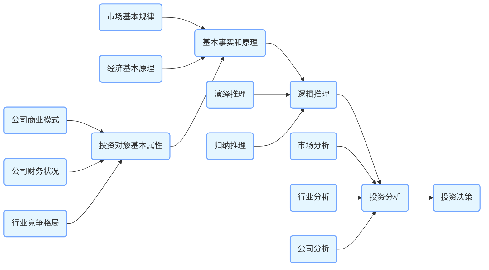

# 芒格的"第一原理"思维在投资分析中的应用

> 关键词：芒格、第一原理思维、投资分析、应用、决策

> 摘要：本文深入探讨了芒格的“第一原理”思维在投资分析中的应用。首先介绍了背景信息，包括目的、预期读者、文档结构和相关术语。接着阐述了核心概念，分析了“第一原理”思维与投资分析的联系，并给出了相应的示意图和流程图。然后详细讲解了核心算法原理，结合Python代码说明操作步骤。通过数学模型和公式进一步剖析其在投资中的应用，并举例说明。项目实战部分提供了开发环境搭建、源代码实现与解读。还介绍了实际应用场景，推荐了相关工具和资源。最后总结了未来发展趋势与挑战，提供常见问题解答和扩展阅读参考。旨在帮助投资者运用“第一原理”思维进行更科学、准确的投资分析。

## 1. 背景介绍 
### 1.1 目的和范围
在当今复杂多变的投资市场中，投资者面临着众多的选择和不确定性。如何做出明智的投资决策，是每个投资者都关心的问题。芒格的“第一原理”思维为我们提供了一种独特而有效的方法。本文的目的在于深入探讨“第一原理”思维在投资分析中的应用，帮助投资者理解其核心思想，并掌握如何将其运用到实际的投资决策中。范围涵盖了“第一原理”思维的基本概念、与投资分析的结合方式、具体的算法和操作步骤、数学模型以及实际案例等方面。

### 1.2 预期读者
本文预期读者主要包括专业投资者、投资分析师、金融从业者以及对投资分析感兴趣的个人。无论是经验丰富的投资者希望进一步提升投资决策能力，还是初学者想要了解科学的投资分析方法，都能从本文中获得有价值的信息。

### 1.3 文档结构概述
本文将按照以下结构展开：首先介绍核心概念，明确“第一原理”思维的定义以及它与投资分析的联系；接着阐述核心算法原理和具体操作步骤，通过Python代码进行详细说明；然后引入数学模型和公式，并举例说明其在投资分析中的应用；项目实战部分提供实际的代码案例和详细解释；随后介绍实际应用场景；再推荐相关的工具和资源；最后总结未来发展趋势与挑战，提供常见问题解答和扩展阅读参考。

### 1.4 术语表
#### 1.4.1 核心术语定义
- **第一原理思维**：是一种从最基本的事实和原理出发，通过逻辑推理来解决问题的思维方式。它强调打破传统的思维定式，深入探究事物的本质。
- **投资分析**：是指对投资项目进行评估和研究的过程，包括对市场、行业、公司等方面的分析，以确定投资的可行性和潜在收益。

#### 1.4.2 相关概念解释
- **演绎推理**：从一般性的前提出发，通过推导即“演绎”，得出具体陈述或个别结论的过程。在“第一原理”思维中，演绎推理用于从基本原理推导出具体的投资策略。
- **归纳推理**：是从个别事例中概括出一般结论的推理方法。在投资分析中，归纳推理可用于总结市场规律和经验。

#### 1.4.3 缩略词列表
- **ROE**：Return on Equity，净资产收益率，是衡量公司盈利能力的重要指标。
- **PE**：Price-to-Earnings Ratio，市盈率，反映了股票价格与每股收益之间的关系。

## 2. 核心概念与联系 

### 核心概念原理
“第一原理”思维的核心在于回归事物的本质，从最基本的事实和原理出发进行思考。在投资分析中，这意味着不依赖于传统的经验和直觉，而是深入研究投资对象的基本属性、市场的基本规律以及经济的基本原理。例如，在分析一家公司的投资价值时，不是仅仅看其当前的股价和市场表现，而是从公司的商业模式、财务状况、行业竞争格局等最基本的方面入手。

### 架构的文本示意图
```plaintext
第一原理思维
|--基本事实和原理
|   |--市场基本规律
|   |--经济基本原理
|   |--投资对象基本属性
|       |--公司商业模式
|       |--公司财务状况
|       |--行业竞争格局
|--逻辑推理
|   |--演绎推理
|   |--归纳推理
|--投资分析
|   |--市场分析
|   |--行业分析
|   |--公司分析
|--投资决策
```

### Mermaid 流程图


从这个流程图可以看出，“第一原理”思维以基本事实和原理为起点，通过逻辑推理进行投资分析，最终得出投资决策。市场基本规律、经济基本原理和投资对象基本属性是基本事实和原理的重要组成部分，演绎推理和归纳推理是逻辑推理的主要方式，而市场分析、行业分析和公司分析则构成了投资分析的主要内容。

## 3. 核心算法原理 & 具体操作步骤 

### 核心算法原理
在投资分析中运用“第一原理”思维的核心算法原理可以概括为以下几个步骤：
1. **确定基本原理**：明确投资分析中涉及的基本原理，如市场供需关系、公司价值评估原理等。
2. **收集数据**：收集与投资对象相关的各种数据，包括财务数据、市场数据、行业数据等。
3. **分析数据**：运用基本原理对收集到的数据进行分析，通过逻辑推理得出关于投资对象的结论。
4. **制定投资策略**：根据分析结论制定相应的投资策略。

### 具体操作步骤及Python代码实现
以下是一个简单的示例，演示如何运用“第一原理”思维分析一家公司的投资价值。假设我们要分析一家公司的盈利能力，使用净资产收益率（ROE）作为指标。

```python
# 步骤1：收集数据
# 假设我们已经获取了公司的净利润和净资产数据
net_profit = 1000000  # 净利润
net_assets = 5000000  # 净资产

# 步骤2：分析数据
# 计算净资产收益率（ROE）
roe = (net_profit / net_assets) * 100

# 步骤3：判断投资价值
# 假设我们认为ROE大于20%的公司具有较好的盈利能力
if roe > 20:
    investment_decision = "值得投资"
else:
    investment_decision = "不值得投资"

# 步骤4：输出结果
print(f"该公司的净资产收益率为 {roe}%，{investment_decision}。")
```

在这个示例中，我们首先收集了公司的净利润和净资产数据，这是基本的数据收集步骤。然后根据净资产收益率的计算公式（$ROE = \frac{净利润}{净资产} \times 100\%$）进行计算，这是运用基本原理进行数据分析的过程。最后根据我们设定的判断标准（ROE大于20%）得出投资决策。

## 4. 数学模型和公式 & 详细讲解 & 举例说明 

### 数学模型和公式
在投资分析中，有许多数学模型和公式可以运用“第一原理”思维进行推导和应用。以下是一些常见的例子：

#### 1. 市盈率（PE）模型
市盈率是衡量股票价格与每股收益之间关系的指标，计算公式为：
$$PE = \frac{股价}{每股收益}$$

从“第一原理”思维的角度来看，市盈率反映了投资者为获取每股收益所愿意支付的价格。较低的市盈率可能意味着股票被低估，具有投资价值；而较高的市盈率可能表示股票被高估。

#### 2. 股息折现模型（DDM）
股息折现模型用于估算股票的内在价值，公式为：
$$V = \frac{D_1}{r - g}$$
其中，$V$ 表示股票的内在价值，$D_1$ 表示下一期预计股息，$r$ 表示投资者要求的回报率，$g$ 表示股息的增长率。

这个模型的基本原理是，股票的价值等于其未来股息的现值之和。通过预测股息和增长率，并结合投资者要求的回报率，可以计算出股票的内在价值。

### 详细讲解
#### 市盈率模型
市盈率模型的核心思想是将股票价格与公司的盈利水平进行比较。如果一家公司的市盈率低于同行业平均水平，可能意味着该公司的股票被低估，具有投资机会。然而，市盈率模型也有其局限性，它没有考虑公司的未来增长潜力、行业竞争等因素。

#### 股息折现模型
股息折现模型基于现金流折现的原理，认为股票的价值取决于其未来产生的现金流（即股息）。该模型要求对股息增长率和投资者要求的回报率进行合理估计。如果估计不准确，可能会导致计算出的股票内在价值与实际价值偏差较大。

### 举例说明
#### 市盈率模型举例
假设公司A的股价为50元，每股收益为5元，则其市盈率为：
$$PE = \frac{50}{5} = 10$$
假设同行业平均市盈率为15，说明公司A的市盈率低于行业平均水平，从市盈率模型的角度来看，公司A的股票可能被低估，具有一定的投资价值。

#### 股息折现模型举例
假设公司B下一期预计股息为2元，投资者要求的回报率为10%，股息增长率为5%，则该公司股票的内在价值为：
$$V = \frac{2}{0.1 - 0.05} = \frac{2}{0.05} = 40$$
如果公司B的当前股价为35元，低于其内在价值40元，根据股息折现模型，该股票可能被低估，值得投资。

## 5. 项目实战：代码实际案例和详细解释说明 

### 5.1  开发环境搭建
为了实现投资分析的项目实战，我们可以使用Python语言，并搭建相应的开发环境。以下是具体步骤：

#### 1. 安装Python
可以从Python官方网站（https://www.python.org/downloads/）下载并安装Python的最新版本。

#### 2. 安装必要的库
在投资分析中，我们常用的库包括`pandas`用于数据处理、`numpy`用于数值计算、`matplotlib`用于数据可视化等。可以使用以下命令进行安装：
```sh
pip install pandas numpy matplotlib
```

#### 3. 选择开发工具
可以选择使用Jupyter Notebook、PyCharm等开发工具。Jupyter Notebook适合进行交互式的数据分析和代码演示，而PyCharm则是一个功能强大的Python集成开发环境。

### 5.2  源代码详细实现和代码解读
以下是一个更复杂的投资分析项目实战代码示例，我们将分析一家公司的财务数据，并根据ROE和PE指标进行投资决策。

```python
import pandas as pd
import numpy as np
import matplotlib.pyplot as plt

# 步骤1：加载数据
# 假设我们有一个包含公司财务数据的CSV文件
data = pd.read_csv('company_financial_data.csv')

# 步骤2：数据预处理
# 计算ROE和PE
data['ROE'] = (data['净利润'] / data['净资产']) * 100
data['PE'] = data['股价'] / data['每股收益']

# 步骤3：数据可视化
# 绘制ROE和PE的变化趋势图
plt.figure(figsize=(12, 6))
plt.subplot(1, 2, 1)
plt.plot(data['年份'], data['ROE'])
plt.title('ROE变化趋势')
plt.xlabel('年份')
plt.ylabel('ROE (%)')

plt.subplot(1, 2, 2)
plt.plot(data['年份'], data['PE'])
plt.title('PE变化趋势')
plt.xlabel('年份')
plt.ylabel('PE')

plt.show()

# 步骤4：投资决策
# 假设我们认为ROE大于20%且PE小于15的公司具有投资价值
investment_opportunities = data[(data['ROE'] > 20) & (data['PE'] < 15)]

if not investment_opportunities.empty:
    print("发现投资机会：")
    print(investment_opportunities[['年份', 'ROE', 'PE']])
else:
    print("未发现符合条件的投资机会。")
```

### 5.3  代码解读与分析
#### 步骤1：加载数据
使用`pandas`库的`read_csv`函数加载包含公司财务数据的CSV文件。

#### 步骤2：数据预处理
计算ROE和PE指标，并将其添加到数据集中。

#### 步骤3：数据可视化
使用`matplotlib`库绘制ROE和PE的变化趋势图，帮助我们直观地观察公司的财务状况变化。

#### 步骤4：投资决策
根据设定的条件（ROE大于20%且PE小于15）筛选出具有投资价值的年份，并输出结果。

通过这个项目实战，我们可以更深入地理解如何运用“第一原理”思维进行投资分析，从基本的财务数据出发，通过计算指标、可视化分析和决策判断，得出投资结论。

## 6. 实际应用场景 
### 股票投资
在股票投资中，“第一原理”思维可以帮助投资者深入分析上市公司的基本面。例如，通过研究公司的商业模式、产品竞争力、管理团队等基本因素，判断公司的长期发展潜力。同时，运用财务指标如ROE、PE等进行定量分析，结合市场趋势和宏观经济环境，做出合理的投资决策。

### 基金投资
对于基金投资，投资者可以运用“第一原理”思维分析基金的投资策略、投资组合、基金经理的能力等。了解基金的投资目标和风险特征，评估其是否符合自己的投资需求。通过对基金历史业绩、持仓情况等数据的分析，筛选出优质的基金产品。

### 房地产投资
在房地产投资中，“第一原理”思维可以应用于对房地产项目的评估。考虑地理位置、土地价值、市场供需关系等基本因素，分析房地产的潜在增值空间和租金收益。同时，关注宏观经济政策、人口流动等因素对房地产市场的影响，做出明智的投资决策。

### 创业投资
创业投资中，“第一原理”思维有助于投资者评估创业项目的可行性。从项目的商业模式、市场需求、技术创新等核心方面入手，分析项目的竞争优势和发展前景。评估创业团队的能力和执行力，判断项目是否具有投资价值。

## 7. 工具和资源推荐
### 7.1 学习资源推荐
#### 7.1.1 书籍推荐
- 《穷查理宝典：查理·芒格的智慧箴言录》：全面介绍了查理·芒格的投资理念和思维方式，是学习“第一原理”思维的经典读物。
- 《聪明的投资者》：本杰明·格雷厄姆的经典著作，阐述了价值投资的基本原理和方法，对投资分析具有重要的指导意义。
- 《财务报表分析与证券定价》：深入讲解了如何通过财务报表分析评估公司的价值，为投资分析提供了实用的工具和方法。

#### 7.1.2 在线课程
- Coursera上的“投资学原理”：由知名高校教授授课，系统介绍了投资学的基本理论和方法。
- edX上的“财务分析与决策”：帮助学习者掌握财务分析的技巧，提升投资决策能力。

#### 7.1.3 技术博客和网站
- 雪球网：提供丰富的股票投资分析和讨论，投资者可以在这里学习到不同的投资策略和分析方法。
- 价值投资看人性：专注于价值投资领域，分享投资经验和研究成果。

### 7.2 开发工具框架推荐
#### 7.2.1 IDE和编辑器
- Jupyter Notebook：适合进行交互式的数据分析和代码演示，方便投资者快速验证投资想法。
- PyCharm：功能强大的Python集成开发环境，提供丰富的代码编辑、调试和版本控制功能。

#### 7.2.2 调试和性能分析工具
- IPython：增强的Python交互式解释器，提供了丰富的调试和分析功能。
- cProfile：Python内置的性能分析工具，可用于分析代码的执行时间和性能瓶颈。

#### 7.2.3 相关框架和库
- Pandas：强大的数据处理和分析库，可用于处理和分析投资数据。
- Numpy：用于高效的数值计算，在投资分析中常用于处理大规模数据。
- Matplotlib：用于数据可视化，帮助投资者直观地展示投资分析结果。

### 7.3 相关论文著作推荐
#### 7.3.1 经典论文
- Fama, E. F., & French, K. R. (1992). The cross-section of expected stock returns. Journal of Finance, 47(2), 427-465. 该论文提出了著名的Fama-French三因子模型，对股票收益率的横截面进行了深入分析。
- Sharpe, W. F. (1964). Capital asset prices: A theory of market equilibrium under conditions of risk. Journal of Finance, 19(3), 425-442. 夏普提出的资本资产定价模型（CAPM），是现代投资理论的重要基础。

#### 7.3.2 最新研究成果
- 通过学术数据库如IEEE Xplore、ACM Digital Library等可以获取投资分析领域的最新研究成果，了解行业的前沿动态。

#### 7.3.3 应用案例分析
- 《投资银行案例分析》：通过实际案例分析，介绍了投资银行在不同项目中的投资策略和决策过程，对投资者具有一定的借鉴意义。

## 8. 总结：未来发展趋势与挑战
### 未来发展趋势
#### 1. 数据驱动的投资分析
随着大数据和人工智能技术的发展，未来的投资分析将更加依赖于数据。投资者可以利用海量的市场数据、公司数据和社交媒体数据等，运用机器学习和深度学习算法进行分析，挖掘潜在的投资机会。

#### 2. 跨学科融合
“第一原理”思维强调从多个学科的基本原理出发进行思考。未来的投资分析将更加注重跨学科融合，结合经济学、金融学、统计学、计算机科学等多个学科的知识，提供更全面、准确的投资决策。

#### 3. 个性化投资服务
随着投资者需求的多样化，未来的投资服务将更加个性化。根据投资者的风险偏好、投资目标和财务状况等因素，为投资者提供定制化的投资策略和建议。

### 挑战
#### 1. 数据质量和隐私问题
在数据驱动的投资分析中，数据质量至关重要。不准确或不完整的数据可能导致错误的投资决策。同时，数据隐私问题也需要引起重视，如何在保护投资者隐私的前提下，合理利用数据是一个挑战。

#### 2. 算法复杂度和可解释性
机器学习和深度学习算法在投资分析中的应用越来越广泛，但这些算法往往具有较高的复杂度，其决策过程难以解释。投资者需要理解算法的原理和局限性，避免盲目依赖算法。

#### 3. 市场不确定性
投资市场充满了不确定性，宏观经济环境、政策变化、突发事件等因素都可能对市场产生影响。即使运用“第一原理”思维进行投资分析，也难以完全预测市场的变化，投资者需要具备应对不确定性的能力。

## 9. 附录：常见问题与解答
### 问题1：“第一原理”思维与传统投资分析方法有什么区别？
传统投资分析方法往往依赖于经验和历史数据，通过类比和归纳来做出决策。而“第一原理”思维强调从最基本的事实和原理出发，通过逻辑推理来解决问题，不依赖于传统的经验和直觉，更注重对事物本质的探究。

### 问题2：如何培养“第一原理”思维？
培养“第一原理”思维需要从以下几个方面入手：一是学习不同学科的基本原理，拓宽知识面；二是遇到问题时，尝试从最基本的层面进行思考，打破传统的思维定式；三是多进行逻辑推理和分析练习，提高思维能力。

### 问题3：在投资分析中，“第一原理”思维是否适用于所有情况？
虽然“第一原理”思维是一种强大的思维方式，但在投资分析中并非适用于所有情况。投资市场具有复杂性和不确定性，有些因素难以用基本原理进行解释和预测。因此，在实际应用中，需要结合其他分析方法和经验，综合做出决策。

## 10. 扩展阅读 & 参考资料
### 扩展阅读
- 《黑天鹅：如何应对不可预知的未来》：探讨了不确定性对投资和生活的影响，帮助投资者更好地应对市场的变化。
- 《思考，快与慢》：介绍了人类思维的两种模式，对投资者理解自己的决策过程具有重要意义。

### 参考资料
- 查理·芒格的演讲和文章，可通过公开渠道获取，深入了解他的“第一原理”思维和投资理念。
- 金融学术期刊，如《Journal of Finance》《Review of Financial Studies》等，提供了最新的投资研究成果和理论。

作者：AI天才研究院/AI Genius Institute & 禅与计算机程序设计艺术 /Zen And The Art of Computer Programming