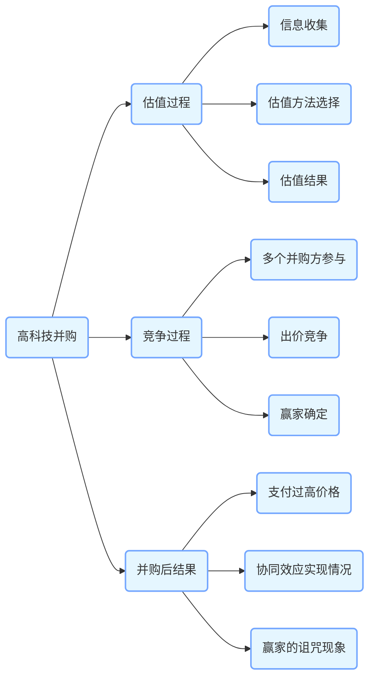

# 芒格的“赢家的诅咒”提醒在高科技并购中的应用

> 关键词：赢家的诅咒、高科技并购、估值偏差、信息不对称、协同效应

> 摘要：本文聚焦于芒格提出的“赢家的诅咒”概念在高科技并购领域的应用。首先介绍了“赢家的诅咒”的背景知识及其在高科技并购中的重要性，接着阐述了相关核心概念和它们之间的联系，深入分析了其背后的核心算法原理和具体操作步骤，借助数学模型和公式进行了详细讲解并举例说明。通过项目实战案例，展示了在高科技并购中如何应对“赢家的诅咒”。探讨了其在实际应用场景中的表现，推荐了相关的学习工具、资源以及论文著作。最后总结了未来高科技并购中“赢家的诅咒”的发展趋势与挑战，并对常见问题进行了解答，为高科技企业并购提供了全面且深入的参考。

## 1. 背景介绍 
### 1.1 目的和范围
高科技行业的并购活动日益频繁，企业希望通过并购实现资源整合、技术升级和市场拓展等目标。然而，“赢家的诅咒”现象在这些并购中时有发生，导致并购方付出过高代价却未能获得预期收益。本文旨在深入探讨芒格的“赢家的诅咒”提醒在高科技并购中的应用，分析其产生的原因、影响以及应对策略，范围涵盖高科技行业各类并购场景，包括软件、硬件、互联网等细分领域。

### 1.2 预期读者
本文预期读者主要包括高科技企业的管理层、投资银行家、并购顾问、金融分析师以及对高科技并购和金融理论感兴趣的研究人员。这些读者希望通过了解“赢家的诅咒”在高科技并购中的应用，提升并购决策的科学性和成功率。

### 1.3 文档结构概述
本文首先介绍相关背景知识，包括目的、预期读者和文档结构。接着阐述核心概念与联系，通过示意图和流程图展示其原理和架构。然后详细讲解核心算法原理和具体操作步骤，结合 Python 代码进行说明。利用数学模型和公式深入分析，并举例佐证。通过项目实战案例展示在实际中的应用，包括开发环境搭建、源代码实现和代码解读。探讨实际应用场景，推荐相关工具和资源，最后总结未来发展趋势与挑战，解答常见问题并提供扩展阅读和参考资料。

### 1.4 术语表
#### 1.4.1 核心术语定义
- **赢家的诅咒**：在拍卖或并购等竞争场景中，获胜者往往因为对目标价值的高估而付出过高的代价，导致后续收益低于预期。
- **高科技并购**：高科技企业之间或高科技企业对其他企业进行的合并与收购活动，旨在获取技术、人才、市场等资源。
- **估值偏差**：对目标企业价值的评估与实际价值之间的差异。
- **信息不对称**：在并购过程中，并购方和被并购方掌握的信息存在差异，导致决策失误。
- **协同效应**：并购后企业整体价值大于并购前各企业价值之和的效应，包括经营协同、财务协同等。

#### 1.4.2 相关概念解释
- **拍卖理论**：研究在拍卖场景中竞拍者的行为和价格形成机制的理论，与“赢家的诅咒”密切相关。
- **并购整合**：并购完成后，对被并购企业的业务、文化、人员等进行整合的过程，以实现协同效应。
- **尽职调查**：并购方在并购前对被并购方的财务、法律、业务等方面进行全面调查的过程，以降低信息不对称风险。

#### 1.4.3 缩略词列表
- M&A：Merger and Acquisition，并购
- DCF：Discounted Cash Flow，现金流折现法

## 2. 核心概念与联系 

### 核心概念原理
“赢家的诅咒”源于拍卖理论。在拍卖中，每个竞拍者对拍卖品的价值有自己的估计，由于信息不完全，竞拍者的估计会存在偏差。出价最高的竞拍者往往是对拍卖品价值高估最严重的人，当他赢得拍卖后，可能会发现拍卖品的实际价值低于他的出价，从而遭受损失。

在高科技并购中，并购方对被并购企业的价值评估也存在类似问题。高科技企业的价值往往难以准确评估，因为其技术、市场前景等具有不确定性。并购方为了赢得并购竞争，可能会高估被并购企业的价值，从而支付过高的价格。即使并购完成后，也可能无法实现预期的协同效应，导致并购失败。

### 架构的文本示意图
```plaintext
高科技并购
|
|-- 估值过程
|   |-- 信息收集（尽职调查等）
|   |-- 估值方法选择（DCF、市场法等）
|   |-- 估值结果（存在估值偏差）
|
|-- 竞争过程
|   |-- 多个并购方参与
|   |-- 出价竞争
|   |-- 赢家确定
|
|-- 并购后结果
|   |-- 支付过高价格
|   |-- 协同效应实现情况（可能未达预期）
|   |-- 赢家的诅咒现象（收益低于预期）
```

### Mermaid 流程图


## 3. 核心算法原理 & 具体操作步骤 

### 核心算法原理
在高科技并购中，常用的估值方法之一是现金流折现法（DCF）。其基本原理是将企业未来的现金流按照一定的折现率折现到当前，得到企业的现值。公式如下：

$$V = \sum_{t=1}^{n} \frac{CF_t}{(1 + r)^t}$$

其中，$V$ 表示企业的现值，$CF_t$ 表示第 $t$ 期的现金流，$r$ 表示折现率，$n$ 表示预测期数。

在应用 DCF 法时，存在很多不确定性因素，如未来现金流的预测、折现率的选择等，这些因素可能导致估值偏差，从而引发“赢家的诅咒”。

### 具体操作步骤

#### 步骤 1：确定预测期数 $n$
根据企业的发展阶段和行业特点，确定预测未来现金流的期数。一般来说，对于高科技企业，由于其技术更新换代快，预测期数不宜过长，通常为 5 - 10 年。

#### 步骤 2：预测未来现金流 $CF_t$
这是 DCF 法中最关键也是最困难的一步。需要考虑企业的市场份额、技术创新能力、成本结构等因素。可以采用历史数据分析法、市场调研法等进行预测。

#### 步骤 3：选择折现率 $r$
折现率反映了资金的时间价值和投资风险。通常可以采用资本资产定价模型（CAPM）来计算折现率：

$$r = R_f + \beta (R_m - R_f)$$

其中，$R_f$ 表示无风险利率，$\beta$ 表示企业的贝塔系数，$R_m$ 表示市场收益率。

#### 步骤 4：计算企业现值 $V$
将预测的未来现金流和选择的折现率代入 DCF 公式，计算企业的现值。

### Python 源代码实现
```python
import numpy as np

def dcf_valuation(cash_flows, discount_rate):
    """
    现金流折现法估值函数
    :param cash_flows: 未来现金流列表
    :param discount_rate: 折现率
    :return: 企业现值
    """
    n = len(cash_flows)
    present_values = []
    for t in range(n):
        present_value = cash_flows[t] / ((1 + discount_rate) ** (t + 1))
        present_values.append(present_value)
    return np.sum(present_values)

# 示例数据
cash_flows = [100, 120, 150, 180, 200]  # 未来 5 年的现金流
discount_rate = 0.1  # 折现率为 10%

# 计算企业现值
value = dcf_valuation(cash_flows, discount_rate)
print(f"企业现值: {value}")
```

### 代码解释
上述代码定义了一个 `dcf_valuation` 函数，用于计算企业的现值。函数接受两个参数：未来现金流列表 `cash_flows` 和折现率 `discount_rate`。在函数内部，通过循环计算每一期现金流的现值，并将其累加到 `present_values` 列表中，最后返回所有现值的总和。

## 4. 数学模型和公式 & 详细讲解 & 举例说明 

### 数学模型和公式
#### 现金流折现法（DCF）
$$V = \sum_{t=1}^{n} \frac{CF_t}{(1 + r)^t}$$

其中，$V$ 表示企业的现值，$CF_t$ 表示第 $t$ 期的现金流，$r$ 表示折现率，$n$ 表示预测期数。

#### 资本资产定价模型（CAPM）
$$r = R_f + \beta (R_m - R_f)$$

其中，$R_f$ 表示无风险利率，$\beta$ 表示企业的贝塔系数，$R_m$ 表示市场收益率。

### 详细讲解
#### 现金流折现法（DCF）
DCF 法的核心思想是将企业未来的现金流折现到当前，考虑了资金的时间价值。未来现金流的预测是关键，需要综合考虑企业的经营状况、市场环境等因素。折现率反映了投资的风险，风险越高，折现率越大，企业的现值越低。

#### 资本资产定价模型（CAPM）
CAPM 模型用于计算折现率，考虑了无风险利率、市场风险溢价和企业的系统性风险。无风险利率通常采用国债收益率，市场风险溢价是市场收益率与无风险利率的差值，贝塔系数反映了企业股票收益率与市场收益率的相关性。

### 举例说明
假设一家高科技企业未来 5 年的现金流预测如下：$CF_1 = 100$ 万元，$CF_2 = 120$ 万元，$CF_3 = 150$ 万元，$CF_4 = 180$ 万元，$CF_5 = 200$ 万元。无风险利率 $R_f = 3\%$，市场收益率 $R_m = 10\%$，企业的贝塔系数 $\beta = 1.2$。

首先，计算折现率 $r$：
$$r = R_f + \beta (R_m - R_f) = 0.03 + 1.2 \times (0.1 - 0.03) = 0.114$$

然后，计算企业现值 $V$：
$$V = \frac{100}{(1 + 0.114)^1} + \frac{120}{(1 + 0.114)^2} + \frac{150}{(1 + 0.114)^3} + \frac{180}{(1 + 0.114)^4} + \frac{200}{(1 + 0.114)^5} \approx 534.78$$（万元）

在实际并购中，如果其他并购方对该企业的估值过高，出价超过 534.78 万元，就可能陷入“赢家的诅咒”。

## 5. 项目实战：代码实际案例和详细解释说明 

### 5.1  开发环境搭建
#### 操作系统
可以选择 Windows、Linux 或 macOS 操作系统。

#### Python 环境
安装 Python 3.x 版本，可以从 Python 官方网站（https://www.python.org/downloads/）下载安装包进行安装。

#### 开发工具
推荐使用 PyCharm 或 Jupyter Notebook 作为开发工具。PyCharm 是一款专业的 Python 集成开发环境，提供了丰富的代码编辑、调试和管理功能；Jupyter Notebook 则适合进行交互式编程和数据分析。

#### 依赖库安装
在命令行中使用以下命令安装所需的依赖库：
```sh
pip install numpy
```

### 5.2  源代码详细实现和代码解读
```python
import numpy as np

def dcf_valuation(cash_flows, discount_rate):
    """
    现金流折现法估值函数
    :param cash_flows: 未来现金流列表
    :param discount_rate: 折现率
    :return: 企业现值
    """
    n = len(cash_flows)
    present_values = []
    for t in range(n):
        present_value = cash_flows[t] / ((1 + discount_rate) ** (t + 1))
        present_values.append(present_value)
    return np.sum(present_values)

def capm_discount_rate(rf, beta, rm):
    """
    资本资产定价模型计算折现率
    :param rf: 无风险利率
    :param beta: 贝塔系数
    :param rm: 市场收益率
    :return: 折现率
    """
    return rf + beta * (rm - rf)

# 示例数据
cash_flows = [100, 120, 150, 180, 200]  # 未来 5 年的现金流
rf = 0.03  # 无风险利率
beta = 1.2  # 贝塔系数
rm = 0.1  # 市场收益率

# 计算折现率
discount_rate = capm_discount_rate(rf, beta, rm)
print(f"折现率: {discount_rate}")

# 计算企业现值
value = dcf_valuation(cash_flows, discount_rate)
print(f"企业现值: {value}")
```

### 代码解读与分析
#### 函数 `dcf_valuation`
该函数实现了现金流折现法的核心逻辑。它接受未来现金流列表和折现率作为输入，通过循环计算每一期现金流的现值，并将其累加到 `present_values` 列表中，最后返回所有现值的总和，即企业的现值。

#### 函数 `capm_discount_rate`
该函数实现了资本资产定价模型，用于计算折现率。它接受无风险利率、贝塔系数和市场收益率作为输入，根据 CAPM 公式计算并返回折现率。

#### 主程序
主程序中定义了示例数据，包括未来现金流、无风险利率、贝塔系数和市场收益率。首先调用 `capm_discount_rate` 函数计算折现率，然后调用 `dcf_valuation` 函数计算企业现值，并将结果打印输出。

通过这个项目实战案例，我们可以看到如何使用 Python 代码实现高科技企业的估值，以及如何避免因估值偏差而陷入“赢家的诅咒”。

## 6. 实际应用场景 
### 高科技企业战略并购
高科技企业为了实现战略目标，如进入新的市场、获取新技术等，会进行并购活动。在这种情况下，“赢家的诅咒”可能会导致企业支付过高的价格，影响企业的财务状况和战略实施。例如，一家软件企业为了进入人工智能领域，并购了一家初创的人工智能企业，但由于高估了目标企业的技术价值和市场前景，支付了过高的价格，导致并购后业绩不佳。

### 风险投资机构参与并购
风险投资机构在高科技企业的成长过程中扮演着重要角色。当风险投资机构参与高科技企业的并购时，也需要警惕“赢家的诅咒”。如果风险投资机构为了获得投资回报，在并购竞争中出价过高，可能会导致投资失败。例如，某风险投资机构在投资一家互联网金融企业时，由于竞争激烈，出价过高，最终该企业因市场环境变化和自身经营问题倒闭，风险投资机构遭受损失。

### 行业整合并购
高科技行业的竞争激烈，为了提高市场竞争力，行业内企业会进行整合并购。在行业整合过程中，“赢家的诅咒”可能会影响并购的效果。例如，在智能手机行业，一些企业为了扩大市场份额，进行大规模的并购，但由于整合难度大、协同效应未实现等原因，导致并购后企业的业绩下滑。

## 7. 工具和资源推荐
### 7.1 学习资源推荐
#### 7.1.1 书籍推荐
- 《并购创造价值》：全面介绍了并购的理论和实践，包括估值方法、并购策略、整合过程等内容，对理解高科技并购有很大帮助。
- 《投资中最简单的事》：作者深入浅出地阐述了投资的基本原理和方法，其中关于估值和风险控制的内容对避免“赢家的诅咒”有启示作用。
- 《高科技创业企业融资与治理》：专门针对高科技企业的融资和治理问题进行了研究，对于了解高科技并购的背景和特点有重要参考价值。

#### 7.1.2 在线课程
- Coursera 上的“并购与收购”课程：由知名大学教授授课，系统讲解了并购的各个环节和相关理论。
- edX 上的“金融估值”课程：重点介绍了金融估值的方法和技巧，包括现金流折现法、市场法等。
- 中国大学 MOOC 上的“创业投资与管理”课程：结合中国高科技企业的实际情况，讲解了创业投资和并购的相关知识。

#### 7.1.3 技术博客和网站
- 36氪：关注科技、商业和创业领域，提供大量关于高科技企业并购的新闻和分析文章。
- 钛媒体：聚焦于科技行业的创新和变革，有很多关于高科技并购的深度报道和评论。
- Seeking Alpha：是一个全球知名的金融投资网站，提供专业的投资分析和研究报告，对高科技并购的分析有一定参考价值。

### 7.2 开发工具框架推荐
#### 7.2.1 IDE和编辑器
- PyCharm：专业的 Python 集成开发环境，提供代码编辑、调试、版本控制等功能，适合开发复杂的估值模型和数据分析程序。
- Jupyter Notebook：交互式编程环境，方便进行数据探索和模型验证，适合初学者和快速原型开发。
- Visual Studio Code：轻量级的代码编辑器，支持多种编程语言和插件扩展，可用于编写和调试 Python 代码。

#### 7.2.2 调试和性能分析工具
- PDB：Python 自带的调试器，可以帮助开发者定位代码中的问题。
- cProfile：Python 标准库中的性能分析工具，用于分析代码的运行时间和性能瓶颈。
- Py-Spy：一个简单易用的 Python 性能分析工具，可以实时查看 Python 程序的运行状态和性能指标。

#### 7.2.3 相关框架和库
- NumPy：用于科学计算的基础库，提供了高效的数组操作和数学函数，在估值模型的实现中经常使用。
- Pandas：用于数据处理和分析的库，提供了数据结构和数据操作方法，方便处理和分析现金流数据。
- Scikit-learn：机器学习库，可用于构建预测模型，辅助现金流预测和估值。

### 7.3 相关论文著作推荐
#### 7.3.1 经典论文
- “The Winner's Curse in Auctions and Competitive Bidding”：该论文首次提出了“赢家的诅咒”概念，并对其在拍卖和竞争投标中的表现进行了深入分析。
- “Valuation Methods and Shareholder Value Creation in Mergers and Acquisitions”：探讨了并购中常用的估值方法和股东价值创造的问题，对高科技并购的估值有重要参考价值。
- “Information Asymmetry, Corporate Governance, and Mergers and Acquisitions”：研究了信息不对称和公司治理对并购的影响，有助于理解高科技并购中信息不对称导致的“赢家的诅咒”问题。

#### 7.3.2 最新研究成果
- 近年来，学术界对高科技并购中的“赢家的诅咒”问题进行了持续研究，一些研究成果发表在《Journal of Financial Economics》、《Review of Financial Studies》等顶级金融学术期刊上。这些研究成果关注了高科技行业的新特点和新趋势，提出了一些新的理论和方法。

#### 7.3.3 应用案例分析
- 一些咨询公司和研究机构会发布高科技并购的应用案例分析报告，如麦肯锡、波士顿咨询等。这些报告通过实际案例分析，展示了“赢家的诅咒”在高科技并购中的表现和应对策略，对企业的并购决策有一定的借鉴意义。

## 8. 总结：未来发展趋势与挑战
### 未来发展趋势
#### 技术创新推动并购活跃
随着科技的不断进步，高科技行业的技术创新速度加快，新的技术和商业模式不断涌现。企业为了保持竞争力，将更加积极地通过并购获取新技术和人才，高科技并购活动将更加活跃。

#### 跨境并购增加
全球化趋势下，高科技企业的市场竞争日益国际化。企业为了拓展国际市场、获取全球资源，将更多地进行跨境并购。跨境并购将带来更多的机遇，但也面临着文化差异、政策法规等方面的挑战。

#### 数据驱动的并购决策
大数据、人工智能等技术的发展将为高科技并购决策提供更丰富的数据支持和更精准的分析工具。企业将更加依赖数据驱动的决策方法，提高并购决策的科学性和成功率。

### 挑战
#### 估值难度加大
高科技企业的价值越来越难以准确评估，因为其技术创新、市场前景等具有高度的不确定性。传统的估值方法可能无法充分反映高科技企业的真实价值，导致估值偏差增大，“赢家的诅咒”风险增加。

#### 整合难度增加
高科技企业的并购不仅涉及到业务和财务的整合，还涉及到技术、文化和人才的整合。不同企业之间的技术体系、文化氛围和人才结构差异较大，整合难度增加，协同效应的实现面临挑战。

#### 监管加强
随着高科技并购活动的增多，监管部门将加强对并购行为的监管，以保护市场竞争和投资者利益。企业在进行并购时需要遵守更加严格的法律法规，增加了并购的合规成本和风险。

## 9. 附录：常见问题与解答
### 问题 1：如何避免高科技并购中的“赢家的诅咒”？
解答：为了避免“赢家的诅咒”，企业可以采取以下措施：
- 进行充分的尽职调查，尽可能减少信息不对称。
- 采用多种估值方法进行综合评估，避免单一估值方法的局限性。
- 合理评估协同效应，避免过度乐观的预期。
- 制定科学的并购策略，避免盲目跟风和过度竞争。

### 问题 2：高科技并购中的估值偏差主要由哪些因素导致？
解答：高科技并购中的估值偏差主要由以下因素导致：
- 信息不对称：并购方和被并购方掌握的信息存在差异，导致对目标企业的价值评估不准确。
- 技术不确定性：高科技企业的技术创新具有不确定性，未来技术发展方向难以预测，影响了对企业价值的评估。
- 市场变化：高科技行业的市场变化迅速，市场需求、竞争格局等因素的变化会导致企业价值的波动。
- 估值方法局限性：传统的估值方法可能无法充分反映高科技企业的特点和价值，导致估值偏差。

### 问题 3：如何评估高科技并购后的协同效应？
解答：评估高科技并购后的协同效应可以从以下几个方面入手：
- 经营协同：分析并购后企业在业务流程、生产效率、市场份额等方面的提升情况。
- 财务协同：评估并购后企业在资金成本、税收优惠等方面的改善情况。
- 技术协同：考察并购后企业在技术研发、创新能力等方面的协同效果。
- 文化协同：关注并购后企业在企业文化、价值观等方面的融合情况。

## 10. 扩展阅读 & 参考资料
### 扩展阅读
- 《金融炼金术》：作者乔治·索罗斯提出了反身性理论，对理解金融市场的不确定性和投资决策有一定的启示作用。
- 《创新者的窘境》：探讨了创新对企业的影响，以及企业如何应对创新带来的挑战，对高科技企业的并购决策有一定的参考价值。
- 《从0到1》：作者彼得·蒂尔分享了创业和创新的经验和思考，对高科技企业的发展和并购有一定的启发。

### 参考资料
- 相关学术期刊文章，如《Journal of Financial Economics》、《Review of Financial Studies》等。
- 咨询公司和研究机构的报告，如麦肯锡、波士顿咨询等发布的高科技并购研究报告。
- 上市公司的年报和公告，了解实际的高科技并购案例和相关信息。

作者：AI天才研究院/AI Genius Institute & 禅与计算机程序设计艺术 /Zen And The Art of Computer Programming