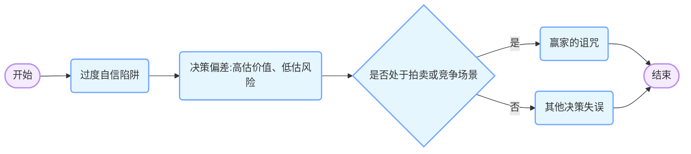

# 芒格的"赢家的诅咒"提醒：警惕过度自信陷阱

> 关键词：赢家的诅咒、过度自信陷阱、决策理论、行为经济学、投资决策、风险评估、理性思维

> 摘要：本文围绕芒格提出的“赢家的诅咒”这一概念展开，深入剖析了过度自信陷阱在各个领域决策过程中的影响。通过介绍相关核心概念、算法原理、数学模型，结合实际案例详细阐述了“赢家的诅咒”产生的原因和后果。同时探讨了其在投资、拍卖等实际应用场景中的表现，推荐了学习相关知识的工具和资源，最后对未来发展趋势与挑战进行了总结，并解答了常见问题。旨在帮助读者认识到过度自信的危害，提升决策的科学性和合理性。

## 1. 背景介绍 
### 1.1 目的和范围
本文的主要目的是深入探讨芒格的“赢家的诅咒”这一重要概念，详细分析过度自信陷阱在决策过程中所带来的负面影响。通过全面的研究和阐述，帮助读者理解“赢家的诅咒”的本质、形成机制以及可能导致的后果。范围涵盖了从理论层面的概念解读到实际应用场景的案例分析，涉及投资、拍卖、商业决策等多个领域，旨在为读者提供一个系统、深入的视角来认识和应对过度自信带来的问题。

### 1.2 预期读者
本文预期读者包括对行为经济学、投资决策、风险管理等领域感兴趣的专业人士，如金融分析师、投资经理、企业管理者等。同时，也适合广大对决策科学和人类认知偏差有探索欲望的普通读者，帮助他们在日常生活和工作中更好地避免过度自信陷阱，做出更理性的决策。

### 1.3 文档结构概述
本文将按照以下结构展开：首先介绍核心概念与联系，包括“赢家的诅咒”和过度自信陷阱的定义、原理及相互关系，并通过示意图和流程图进行直观展示；接着阐述核心算法原理和具体操作步骤，运用Python代码详细说明相关分析方法；然后讲解数学模型和公式，通过具体例子加深理解；之后给出项目实战案例，包括开发环境搭建、源代码实现与解读；再探讨实际应用场景；推荐学习所需的工具和资源；总结未来发展趋势与挑战；最后解答常见问题并提供扩展阅读和参考资料。

### 1.4 术语表
#### 1.4.1 核心术语定义
- **赢家的诅咒**：在拍卖或竞争环境中，赢得标的的一方往往会付出过高的价格，导致其实际收益低于预期，甚至可能遭受损失。这是因为赢家在竞争过程中可能过度自信，高估了标的的价值。
- **过度自信陷阱**：指个体在决策过程中，对自己的判断、能力和知识表现出过度的自信，从而高估自己成功的概率，低估风险和不确定性，最终可能导致决策失误。

#### 1.4.2 相关概念解释
- **行为经济学**：将心理学的研究成果融入传统经济学中，研究人类在经济活动中的实际决策行为。它认为人类的决策并非总是理性的，会受到认知偏差、情绪等因素的影响。
- **认知偏差**：人类在认知过程中由于心理因素的影响而产生的系统性偏差。过度自信就是一种常见的认知偏差，会导致人们在判断和决策时偏离理性。

#### 1.4.3 缩略词列表
目前本文中暂未涉及缩略词。

## 2. 核心概念与联系 

### 核心概念原理
#### 赢家的诅咒原理
在拍卖市场中，每个参与者对拍卖标的都有自己的估值。由于信息的不完全性和个体认知的差异，不同参与者的估值会有所不同。通常情况下，出价最高的参与者会赢得拍卖。然而，这个赢家可能是因为过度自信，高估了标的的真实价值，从而给出了过高的价格。当交易完成后，赢家可能会发现标的的实际价值低于自己的出价，导致收益受损。

例如，在房地产拍卖中，多个买家对一处房产进行竞拍。每个买家根据自己的判断对房产价值进行评估。一些买家可能因为对市场趋势过度乐观，或者对房产的潜在价值过于自信，给出了较高的出价。最终，出价最高的买家赢得了拍卖，但后续可能发现该房产存在一些隐藏问题，或者市场行情并没有如预期那样上涨，导致其购买价格高于房产的实际价值。

#### 过度自信陷阱原理
过度自信源于人类的认知特点。人们往往倾向于高估自己的能力、知识和判断的准确性。在决策过程中，过度自信的人会忽视或低估风险和不确定性，对自己的决策结果过于乐观。这种过度自信会影响他们对信息的收集和处理，导致决策偏差。

比如，在股票投资中，一些投资者可能认为自己对市场有独特的见解和分析能力，过度自信地选择某些股票进行投资。他们可能忽略了宏观经济环境的变化、行业竞争的加剧等风险因素，最终导致投资损失。

### 架构的文本示意图
```plaintext
           过度自信陷阱
              |
              | 导致
              v
       决策偏差（高估价值、低估风险）
              |
              | 在拍卖或竞争场景中表现为
              v
           赢家的诅咒
```

### Mermaid 流程图


## 3. 核心算法原理 & 具体操作步骤 

### 算法原理
为了分析“赢家的诅咒”和过度自信陷阱，我们可以使用蒙特卡罗模拟方法。蒙特卡罗模拟是一种通过随机抽样来模拟复杂系统行为的统计方法。在这个问题中，我们可以模拟多个参与者对拍卖标的进行估值和出价的过程，观察赢家的出价和最终收益情况。

具体步骤如下：
1. 定义每个参与者对标的的真实价值分布。
2. 为每个参与者生成一个基于真实价值的估值，考虑到过度自信的影响，部分参与者的估值可能会高于真实价值。
3. 每个参与者根据自己的估值进行出价。
4. 找出出价最高的赢家。
5. 计算赢家的实际收益（标的真实价值减去出价）。
6. 重复以上步骤多次，统计赢家的平均收益情况。

### Python 源代码实现
```python
import numpy as np

# 定义参数
num_participants = 10  # 参与者数量
num_simulations = 1000  # 模拟次数
true_value_mean = 100  # 标的真实价值的均值
true_value_std = 10  # 标的真实价值的标准差
overconfidence_factor = 1.2  # 过度自信因子

# 初始化赢家收益列表
winner_profits = []

# 进行蒙特卡罗模拟
for _ in range(num_simulations):
    # 生成标的的真实价值
    true_value = np.random.normal(true_value_mean, true_value_std)
    
    # 为每个参与者生成估值
    valuations = []
    for i in range(num_participants):
        if i % 3 == 0:  # 假设三分之一的参与者过度自信
            valuation = true_value * overconfidence_factor
        else:
            valuation = true_value
        valuations.append(valuation)
    
    # 每个参与者根据估值出价
    bids = np.random.uniform(0.8 * np.array(valuations), valuations)
    
    # 找出赢家
    winner_index = np.argmax(bids)
    winner_bid = bids[winner_index]
    
    # 计算赢家的收益
    winner_profit = true_value - winner_bid
    winner_profits.append(winner_profit)

# 计算赢家的平均收益
average_winner_profit = np.mean(winner_profits)

print(f"赢家的平均收益: {average_winner_profit}")
```

### 代码解释
1. **参数定义**：我们定义了参与者数量、模拟次数、标的真实价值的均值和标准差，以及过度自信因子。
2. **蒙特卡罗模拟循环**：通过多次模拟，每次生成标的的真实价值，并为每个参与者生成估值。
3. **估值生成**：部分参与者（这里假设三分之一）的估值会乘以过度自信因子，模拟过度自信的情况。
4. **出价生成**：每个参与者的出价在其估值的一定范围内随机生成。
5. **赢家确定**：找出出价最高的参与者作为赢家。
6. **收益计算**：计算赢家的实际收益（真实价值减去出价）。
7. **结果统计**：最后计算赢家的平均收益并输出。

## 4. 数学模型和公式 & 详细讲解 & 举例说明 

### 数学模型
假设拍卖标的的真实价值 $V$ 服从正态分布 $V \sim N(\mu, \sigma^2)$，其中 $\mu$ 是均值，$\sigma$ 是标准差。每个参与者 $i$ 对标的的估值 $V_i$ 可以表示为：

$$
V_i = 
\begin{cases}
\alpha V, & \text{如果参与者 } i \text{ 过度自信} \\
V, & \text{否则}
\end{cases}
$$

其中 $\alpha > 1$ 是过度自信因子。

参与者 $i$ 的出价 $B_i$ 服从均匀分布 $B_i \sim U(\beta V_i, V_i)$，其中 $0 < \beta < 1$ 是出价下限比例。

赢家的收益 $\pi$ 为：

$$
\pi = V - \max_{i=1}^{n} B_i
$$

其中 $n$ 是参与者数量。

### 详细讲解
- **真实价值分布**：使用正态分布来模拟标的的真实价值，因为在很多实际情况下，价值的波动具有一定的随机性和集中性，正态分布可以较好地描述这种特征。
- **估值模型**：对于过度自信的参与者，其估值会高于真实价值，通过乘以过度自信因子 $\alpha$ 来体现。而非过度自信的参与者估值等于真实价值。
- **出价模型**：参与者的出价在其估值的一定范围内随机生成，使用均匀分布来模拟出价的不确定性。
- **赢家收益**：赢家的收益是标的真实价值减去最高出价。如果最高出价过高，赢家的收益可能为负，即出现“赢家的诅咒”。

### 举例说明
假设标的真实价值 $V$ 服从正态分布 $N(100, 10^2)$，过度自信因子 $\alpha = 1.2$，出价下限比例 $\beta = 0.8$，参与者数量 $n = 5$。

对于一个过度自信的参与者，其估值 $V_1 = 1.2 \times 100 = 120$。他的出价 $B_1$ 服从均匀分布 $U(0.8 \times 120, 120) = U(96, 120)$。假设他随机出的价为 $B_1 = 110$。

其他非过度自信的参与者估值都为 $V_2 = V_3 = V_4 = V_5 = 100$，他们的出价分别服从 $U(0.8 \times 100, 100) = U(80, 100)$。假设他们的出价分别为 $B_2 = 90$，$B_3 = 85$，$B_4 = 92$，$B_5 = 88$。

则最高出价为 $\max\{B_1, B_2, B_3, B_4, B_5\} = 110$，赢家的收益 $\pi = 100 - 110 = -10$，出现了“赢家的诅咒”。

## 5. 项目实战：代码实际案例和详细解释说明 

### 5.1  开发环境搭建
要运行上述的 Python 代码，需要搭建以下开发环境：
1. **Python 安装**：确保你的系统中安装了 Python 3.x 版本。可以从 Python 官方网站（https://www.python.org/downloads/）下载并安装适合你操作系统的版本。
2. **NumPy 库安装**：NumPy 是一个用于科学计算的 Python 库，我们的代码中使用了它来进行数值计算和随机数生成。可以使用以下命令通过 pip 安装 NumPy：
```sh
pip install numpy
```

### 5.2  源代码详细实现和代码解读
以下是完整的源代码及详细解读：
```python
import numpy as np

# 定义参数
num_participants = 10  # 参与者数量
num_simulations = 1000  # 模拟次数
true_value_mean = 100  # 标的真实价值的均值
true_value_std = 10  # 标的真实价值的标准差
overconfidence_factor = 1.2  # 过度自信因子

# 初始化赢家收益列表
winner_profits = []

# 进行蒙特卡罗模拟
for _ in range(num_simulations):
    # 生成标的的真实价值
    true_value = np.random.normal(true_value_mean, true_value_std)
    
    # 为每个参与者生成估值
    valuations = []
    for i in range(num_participants):
        if i % 3 == 0:  # 假设三分之一的参与者过度自信
            valuation = true_value * overconfidence_factor
        else:
            valuation = true_value
        valuations.append(valuation)
    
    # 每个参与者根据估值出价
    bids = np.random.uniform(0.8 * np.array(valuations), valuations)
    
    # 找出赢家
    winner_index = np.argmax(bids)
    winner_bid = bids[winner_index]
    
    # 计算赢家的收益
    winner_profit = true_value - winner_bid
    winner_profits.append(winner_profit)

# 计算赢家的平均收益
average_winner_profit = np.mean(winner_profits)

print(f"赢家的平均收益: {average_winner_profit}")
```
#### 代码解读
1. **导入库**：`import numpy as np` 导入 NumPy 库并使用别名 `np`。
2. **参数定义**：设置参与者数量、模拟次数、标的真实价值的均值和标准差，以及过度自信因子。
3. **初始化列表**：`winner_profits` 用于存储每次模拟中赢家的收益。
4. **蒙特卡罗模拟循环**：`for _ in range(num_simulations)` 循环进行多次模拟。
5. **真实价值生成**：`np.random.normal(true_value_mean, true_value_std)` 生成服从正态分布的标的真实价值。
6. **估值生成**：通过循环为每个参与者生成估值，部分参与者（每三个中的一个）使用过度自信的估值。
7. **出价生成**：`np.random.uniform(0.8 * np.array(valuations), valuations)` 为每个参与者生成在估值范围内的随机出价。
8. **赢家确定**：`np.argmax(bids)` 找出出价最高的参与者的索引，从而确定赢家。
9. **收益计算**：计算赢家的收益并添加到 `winner_profits` 列表中。
10. **结果统计**：`np.mean(winner_profits)` 计算赢家的平均收益并输出。

### 5.3  代码解读与分析
通过运行上述代码，我们可以观察到赢家的平均收益情况。如果平均收益为负，说明在模拟的拍卖场景中，“赢家的诅咒”现象较为明显。这意味着过度自信的参与者可能会因为高估标的价值而给出过高的出价，导致最终收益受损。

我们可以通过调整参数，如参与者数量、过度自信因子、模拟次数等，来进一步研究不同因素对“赢家的诅咒”的影响。例如，增加过度自信因子会使过度自信的参与者估值更高，可能导致“赢家的诅咒”更加严重；增加参与者数量会使竞争更加激烈，也可能增加“赢家的诅咒”出现的概率。

## 6. 实际应用场景 
### 投资领域
在股票市场中，投资者常常会受到过度自信陷阱的影响。一些投资者可能认为自己掌握了独特的信息或分析方法，过度自信地选择某些股票进行投资。例如，某些投资者可能会因为对某家公司的新产品过度乐观，高估了该公司的未来盈利能力，从而大量买入该公司的股票。然而，实际情况可能并不如预期，公司的新产品可能面临市场竞争、技术难题等问题，导致股价下跌，投资者遭受损失。

在房地产投资中，同样存在“赢家的诅咒”现象。当多个投资者竞争一处房产时，一些投资者可能会因为对房地产市场的未来走势过度自信，高估了房产的价值，从而给出过高的出价。如果后续市场行情不如预期，房产的增值空间有限，投资者可能会面临资金被套牢、收益不佳的情况。

### 拍卖市场
无论是艺术品拍卖、古董拍卖还是土地拍卖，“赢家的诅咒”都很常见。在艺术品拍卖中，竞拍者往往会对艺术品的价值有自己的判断。一些竞拍者可能因为对艺术品的喜爱或对其市场潜力的过度自信，在竞拍过程中不断抬高价格。最终赢得拍卖的竞拍者可能会发现，该艺术品的实际市场价值并没有自己出价那么高，或者在后续的转手过程中难以找到买家，导致投资失败。

在土地拍卖中，房地产开发商为了获取土地资源，可能会过度竞争。一些开发商可能会高估土地的开发价值和未来的销售收益，从而给出过高的地价。如果后续开发过程中遇到政策变化、市场需求不足等问题，项目的盈利可能会受到严重影响，甚至可能导致亏损。

### 商业并购
在企业并购活动中，收购方往往需要对目标企业进行估值。如果收购方的管理层过度自信，可能会高估目标企业的协同效应、市场潜力等，从而支付过高的收购价格。例如，一家企业为了扩大市场份额，收购了另一家同行业企业。收购方管理层认为通过整合两家企业的资源，可以实现成本降低、市场份额扩大等协同效应。然而，在实际整合过程中，可能会遇到文化冲突、管理难题等问题，导致协同效应无法实现，收购方不仅没有获得预期的收益，反而可能因为高额的收购成本而陷入财务困境。

## 7. 工具和资源推荐
### 7.1 学习资源推荐
#### 7.1.1 书籍推荐
- 《思考，快与慢》（Thinking, Fast and Slow）：作者丹尼尔·卡尼曼（Daniel Kahneman）是行为经济学领域的大师。这本书介绍了人类思维的两种模式——快思考和慢思考，以及它们如何影响我们的决策。书中详细讨论了各种认知偏差，包括过度自信，对于理解“赢家的诅咒”的根源非常有帮助。
- 《错误的行为》（Misbehaving: The Making of Behavioral Economics）：作者理查德·泰勒（Richard Thaler）是行为经济学的开创者之一。本书讲述了行为经济学的发展历程，通过大量的案例和实验，揭示了人类在经济决策中的非理性行为，为我们认识“赢家的诅咒”提供了丰富的实例和理论支持。
- 《聪明的投资者》（The Intelligent Investor）：作者本杰明·格雷厄姆（Benjamin Graham）是价值投资理论的奠基人。这本书强调了投资者应保持理性和冷静，避免受到情绪和过度自信的影响。它对于投资者如何在投资决策中避免“赢家的诅咒”具有重要的指导意义。

#### 7.1.2 在线课程
- Coursera 上的“行为经济学”课程：由知名高校的教授授课，系统地介绍了行为经济学的基本理论和方法，包括认知偏差、决策模型等内容。通过学习该课程，你可以深入了解过度自信等认知偏差在经济决策中的表现和影响。
- edX 上的“投资决策与行为金融”课程：该课程结合了投资学和行为金融学的知识，讲解了投资者在决策过程中可能遇到的各种心理陷阱，如“赢家的诅咒”，并提供了相应的应对策略。

#### 7.1.3 技术博客和网站
- 行为经济学论坛（Behavioral Economics Forum）：这是一个专门讨论行为经济学相关话题的论坛，汇聚了众多学者、研究人员和爱好者。你可以在论坛上了解到最新的研究成果、案例分析和讨论，对于深入理解“赢家的诅咒”和过度自信陷阱很有帮助。
- 金融时报（Financial Times）的行为金融板块：该板块会定期发布关于行为金融领域的文章和研究报告，其中不乏对“赢家的诅咒”在金融市场中表现的分析和解读。

### 7.2 开发工具框架推荐
#### 7.2.1 IDE和编辑器
- PyCharm：一款功能强大的 Python 集成开发环境（IDE），提供了代码编辑、调试、版本控制等一系列功能，适合开发和运行我们前面介绍的 Python 代码。
- Jupyter Notebook：一种交互式的开发环境，非常适合进行数据分析和实验。你可以在 Jupyter Notebook 中逐行运行代码，查看中间结果，便于对代码进行调试和分析。

#### 7.2.2 调试和性能分析工具
- pdb：Python 自带的调试器，可以帮助你在代码运行过程中设置断点、查看变量值等，方便定位和解决代码中的问题。
- cProfile：Python 的性能分析工具，可以统计代码中各个函数的执行时间和调用次数，帮助你找出代码中的性能瓶颈。

#### 7.2.3 相关框架和库
- NumPy：如前面所述，NumPy 是一个用于科学计算的 Python 库，提供了高效的数组操作和数学函数，对于模拟和分析“赢家的诅咒”相关问题非常有用。
- Pandas：用于数据处理和分析的 Python 库，可以方便地对模拟结果进行数据整理、统计和可视化。

### 7.3 相关论文著作推荐
#### 7.3.1 经典论文
- “The Winner's Curse in Common Value Auctions”（《共同价值拍卖中的赢家的诅咒》）：这篇论文是研究“赢家的诅咒”的经典之作，详细阐述了在共同价值拍卖中“赢家的诅咒”的形成机制和影响因素，为后续的研究奠定了基础。
- “Overconfidence and Speculative Bubbles”（《过度自信与投机泡沫》）：该论文探讨了过度自信在金融市场中如何导致投机泡沫的形成，与“赢家的诅咒”在投资领域的表现密切相关。

#### 7.3.2 最新研究成果
- 定期关注《Journal of Behavioral Finance》（《行为金融杂志》）、《Review of Financial Studies》（《金融研究评论》）等学术期刊，这些期刊会发表行为金融领域的最新研究成果，包括关于“赢家的诅咒”和过度自信陷阱的新理论、新模型和实证研究。

#### 7.3.3 应用案例分析
- 一些商业咨询公司和研究机构会发布关于企业并购、投资决策等方面的案例分析报告，其中可能会涉及到“赢家的诅咒”的实际案例。你可以通过查阅这些报告，了解“赢家的诅咒”在实际商业场景中的表现和应对策略。

## 8. 总结：未来发展趋势与挑战
### 未来发展趋势
- **跨学科研究的深入**：“赢家的诅咒”和过度自信陷阱涉及到经济学、心理学、社会学等多个学科领域。未来，跨学科研究将更加深入，通过整合不同学科的理论和方法，能够更全面、深入地理解人类决策过程中的认知偏差和行为模式，为解决“赢家的诅咒”问题提供更有效的策略。
- **大数据和人工智能的应用**：随着大数据和人工智能技术的发展，我们可以收集和分析更多的决策数据，从而更准确地识别过度自信的行为模式和“赢家的诅咒”的发生概率。同时，人工智能算法可以用于开发决策辅助系统，帮助决策者避免过度自信陷阱，做出更理性的决策。
- **应用领域的拓展**：除了投资、拍卖和商业并购等传统领域，“赢家的诅咒”和过度自信陷阱的研究将拓展到更多领域，如医疗决策、公共政策制定等。在这些领域中，过度自信可能会导致严重的后果，因此研究如何避免这些问题具有重要的现实意义。

### 挑战
- **个体差异的复杂性**：不同个体的过度自信程度和表现方式存在很大差异，受到个人性格、教育背景、经验等多种因素的影响。如何准确地测量和评估个体的过度自信程度，并针对不同个体制定个性化的干预策略是一个挑战。
- **信息不对称的影响**：在实际决策过程中，信息不对称是普遍存在的问题。决策者往往无法获取完全准确的信息，这会增加过度自信的可能性。如何在信息不对称的情况下，有效地识别和纠正过度自信，是未来研究需要解决的难题。
- **行为改变的困难性**：即使人们认识到了过度自信陷阱的存在，要改变自己的决策行为仍然非常困难。因为人类的认知偏差是根深蒂固的，受到心理和生理因素的影响。如何设计有效的干预措施，帮助人们克服过度自信，实现行为改变，是一个具有挑战性的问题。

## 9. 附录：常见问题与解答
### 问题 1：如何判断自己是否陷入了过度自信陷阱？
解答：可以通过回顾自己的决策历史，分析自己的决策结果与预期的差异。如果经常高估自己的能力和决策的准确性，或者在面对失败时不愿意承认自己的错误，可能就陷入了过度自信陷阱。此外，也可以参考一些心理测试工具，如过度自信量表，来评估自己的过度自信程度。

### 问题 2：在拍卖中，如何避免“赢家的诅咒”？
解答：首先，要充分收集关于拍卖标的的信息，尽可能准确地评估其真实价值。可以参考类似标的的历史成交价格、市场行情等。其次，要保持理性和冷静，避免在竞争激烈的氛围中被情绪左右，盲目抬高出价。最后，可以设定一个出价上限，一旦达到上限就停止出价，避免出价过高。

### 问题 3：过度自信陷阱在团队决策中会有什么表现？
解答：在团队决策中，过度自信陷阱可能表现为团队成员过于相信自己的观点和判断，不愿意听取他人的意见。这可能导致团队讨论缺乏充分的交流和碰撞，无法全面考虑各种因素，最终做出错误的决策。此外，团队领导者的过度自信也可能影响整个团队的决策方向，使团队忽视潜在的风险。

### 问题 4：大数据和人工智能如何帮助解决“赢家的诅咒”问题？
解答：大数据可以收集大量的决策数据，包括参与者的出价历史、市场信息等。通过对这些数据的分析，可以发现过度自信的行为模式和“赢家的诅咒”的发生规律。人工智能算法可以根据这些规律建立预测模型，提前预警“赢家的诅咒”的发生。同时，人工智能还可以开发决策辅助系统，为决策者提供客观的建议和参考，帮助他们避免过度自信陷阱。

## 10. 扩展阅读 & 参考资料
### 扩展阅读
- 《黑天鹅》（The Black Swan）：作者纳西姆·尼古拉斯·塔勒布（Nassim Nicholas Taleb）探讨了不可预测的重大事件对人类生活和决策的影响，与过度自信陷阱和“赢家的诅咒”相关，提醒我们要认识到不确定性的存在。
- 《非理性繁荣》（Irrational Exuberance）：作者罗伯特·席勒（Robert J. Shiller）分析了金融市场中的非理性行为和泡沫现象，对于理解投资领域中的过度自信和“赢家的诅咒”有很大的帮助。

### 参考资料
- Kahneman, D., & Tversky, A. (1979). Prospect theory: An analysis of decision under risk. Econometrica, 47(2), 263 - 291.
- Thaler, R. H. (1988). Anomalies: The winner's curse. The Journal of Economic Perspectives, 2(1), 191 - 202.
- Graham, B., & Dodd, D. L. (1934). Security Analysis. McGraw - Hill.

作者：AI天才研究院/AI Genius Institute & 禅与计算机程序设计艺术 /Zen And The Art of Computer Programming