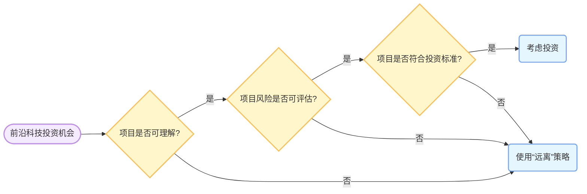

# 芒格的"远离"策略在前沿科技投资中的重要性

> 关键词：芒格、“远离”策略、前沿科技投资、风险规避、价值投资

> 摘要：本文深入探讨了芒格的“远离”策略在前沿科技投资领域的重要性。通过分析该策略的背景，阐述其核心概念与联系，详细讲解相关算法原理和操作步骤，建立数学模型并举例说明。同时结合项目实战案例进行代码实现与解读，探讨实际应用场景，推荐相关工具和资源。最后总结该策略在前沿科技投资中的未来发展趋势与挑战，解答常见问题并提供扩展阅读与参考资料，旨在为投资者在前沿科技投资中运用“远离”策略提供全面且深入的指导。

## 1. 背景介绍 
### 1.1 目的和范围
本文章旨在深入剖析芒格的“远离”策略在前沿科技投资领域的重要性。通过全面的研究和分析，揭示该策略如何帮助投资者在充满不确定性和高风险的前沿科技投资环境中做出更明智的决策。范围涵盖了对“远离”策略的理论基础、实际应用案例以及未来发展趋势的探讨，同时涉及到相关的技术原理、数学模型和代码实现等方面。

### 1.2 预期读者
本文预期读者主要包括对前沿科技投资感兴趣的投资者、金融分析师、科技行业从业者以及相关领域的研究人员。对于希望了解如何在前沿科技投资中有效运用投资策略以降低风险、提高收益的人群，本文将提供有价值的参考和指导。

### 1.3 文档结构概述
本文将按照以下结构展开：首先介绍“远离”策略的背景，包括目的、预期读者和文档结构概述，并对相关术语进行定义和解释。接着阐述核心概念与联系，通过文本示意图和 Mermaid 流程图展示其原理和架构。然后详细讲解核心算法原理和具体操作步骤，并结合 Python 源代码进行说明。之后建立数学模型和公式，通过举例进行详细讲解。再通过项目实战案例，展示代码的实际实现和解读。随后探讨该策略在实际中的应用场景，推荐相关的工具和资源。最后总结未来发展趋势与挑战，解答常见问题并提供扩展阅读与参考资料。

### 1.4 术语表
#### 1.4.1 核心术语定义
- **芒格的“远离”策略**：指由查理·芒格提出的一种投资策略，即投资者应远离那些具有高风险、不确定性大、难以理解或不符合自身投资理念的投资机会。
- **前沿科技投资**：对处于科技发展前沿领域的项目或企业进行的投资，这些领域通常具有创新性强、发展速度快、不确定性高等特点，如人工智能、生物技术、量子计算等。
- **风险规避**：投资者通过各种手段和策略，降低投资过程中面临的风险，以保护投资本金和实现预期收益。
- **价值投资**：一种投资理念，强调通过分析企业的内在价值，寻找被低估的股票进行投资，注重企业的基本面和长期发展潜力。

#### 1.4.2 相关概念解释
- **投资理念**：投资者在进行投资活动时所遵循的基本思想和原则，它指导着投资者的投资决策和行为。不同的投资理念会导致不同的投资策略和方法。
- **不确定性**：在前沿科技投资中，由于科技发展的快速变化和不可预测性，投资项目的未来发展存在很多未知因素，这些未知因素使得投资结果具有不确定性。
- **内在价值**：企业或资产所具有的真实价值，它是由企业的基本面因素如盈利能力、资产质量、市场竞争力等决定的，与市场价格不一定相等。

#### 1.4.3 缩略词列表
- **AI**：Artificial Intelligence，人工智能
- **BI**：Biotechnology，生物技术
- **QC**：Quantum Computing，量子计算

## 2. 核心概念与联系 

### 核心概念原理
芒格的“远离”策略核心原理基于价值投资和风险规避的理念。在前沿科技投资中，科技的快速发展带来了大量的投资机会，但同时也伴随着高度的不确定性和风险。芒格认为，投资者应该专注于自己能够理解和评估的投资领域，对于那些过于复杂、风险难以把握或者不符合自身投资标准的前沿科技项目，应该选择远离。

这种策略的本质是通过避免不必要的风险暴露，保护投资者的本金和收益。在前沿科技领域，很多项目处于技术研发阶段，尚未实现商业化盈利，其未来发展具有很大的不确定性。如果投资者盲目跟风投资这些项目，可能会面临巨大的损失。因此，“远离”策略强调投资者要保持理性和冷静，不被短期的市场热点和炒作所迷惑。

### 架构的文本示意图
```plaintext
前沿科技投资环境
|
|-- 高风险项目（难以理解、不确定性大）
|   |
|   |-- 芒格的“远离”策略 -- 避免投资
|
|-- 低风险项目（可理解、有明确价值）
|   |
|   |-- 价值投资策略 -- 考虑投资
```

### Mermaid 流程图


这个流程图展示了在前沿科技投资中运用芒格的“远离”策略的决策过程。首先判断项目是否可理解，如果不可理解则直接使用“远离”策略。如果项目可理解，再判断其风险是否可评估，若不可评估也使用“远离”策略。若风险可评估，进一步判断项目是否符合投资标准，不符合则使用“远离”策略，符合则考虑投资。

## 3. 核心算法原理 & 具体操作步骤 

### 核心算法原理
在前沿科技投资中运用芒格的“远离”策略，可以通过建立一个基于多因素评估的算法来实现。该算法的核心思想是对每个投资项目的多个关键因素进行评估，根据评估结果判断是否应该远离该项目。

假设我们考虑以下几个关键因素：技术成熟度、市场潜力、竞争态势、财务状况和管理团队。每个因素都可以用一个评分来表示，评分范围为 1 - 10，1 表示最差，10 表示最好。我们可以为每个因素分配一个权重，以反映其在投资决策中的重要性。然后，计算每个项目的综合得分，得分低于某个阈值的项目则被认为是需要远离的项目。

### Python 源代码实现
```python
# 定义每个因素的权重
weights = {
    "技术成熟度": 0.3,
    "市场潜力": 0.25,
    "竞争态势": 0.2,
    "财务状况": 0.15,
    "管理团队": 0.1
}

# 定义评估函数
def evaluate_project(project_scores, threshold):
    """
    计算项目的综合得分，并判断是否需要远离该项目
    :param project_scores: 项目在各个因素上的得分，字典类型
    :param threshold: 综合得分的阈值
    :return: True 表示需要远离，False 表示可以考虑投资
    """
    total_score = 0
    for factor, score in project_scores.items():
        total_score += score * weights[factor]
    if total_score < threshold:
        return True
    return False

# 示例项目得分
project_scores = {
    "技术成熟度": 3,
    "市场潜力": 4,
    "竞争态势": 2,
    "财务状况": 3,
    "管理团队": 3
}

# 设定阈值
threshold = 4

# 评估项目
should_avoid = evaluate_project(project_scores, threshold)
if should_avoid:
    print("根据评估结果，应远离该项目。")
else:
    print("根据评估结果，可以考虑投资该项目。")
```

### 具体操作步骤
1. **确定关键因素**：根据前沿科技投资的特点和自身的投资理念，确定需要考虑的关键因素，如技术成熟度、市场潜力、竞争态势、财务状况和管理团队等。
2. **分配权重**：为每个关键因素分配一个权重，权重的分配应根据其在投资决策中的重要性来确定。可以通过经验判断、历史数据分析或专家意见等方式来确定权重。
3. **评估项目得分**：对每个投资项目在各个关键因素上进行评分，评分范围可以根据实际情况设定，如 1 - 10。评分过程需要综合考虑各种信息和数据，如技术报告、市场研究、财务报表等。
4. **计算综合得分**：根据每个因素的得分和权重，计算项目的综合得分。
5. **设定阈值**：根据自身的风险承受能力和投资目标，设定一个综合得分的阈值。得分低于该阈值的项目则被认为是需要远离的项目。
6. **做出决策**：根据项目的综合得分和阈值，判断是否应该远离该项目。

## 4. 数学模型和公式 & 详细讲解 & 举例说明 

### 数学模型和公式
设项目 $P$ 在 $n$ 个关键因素 $F_1, F_2, \cdots, F_n$ 上的得分分别为 $S_1, S_2, \cdots, S_n$，对应的权重分别为 $W_1, W_2, \cdots, W_n$，其中 $\sum_{i=1}^{n}W_i = 1$。则项目 $P$ 的综合得分 $TS$ 可以用以下公式计算：

$$TS = \sum_{i=1}^{n}S_i \times W_i$$

如果 $TS < T$，其中 $T$ 为设定的阈值，则应远离该项目；否则，可以考虑投资该项目。

### 详细讲解
这个数学模型的核心是通过对项目在多个关键因素上的得分进行加权求和，得到一个综合得分，以此来评估项目的投资价值。权重的分配反映了每个因素在投资决策中的重要性，得分则体现了项目在该因素上的表现。通过设定阈值，可以根据综合得分来判断项目是否值得投资。

### 举例说明
假设我们有三个前沿科技项目 $A$、$B$ 和 $C$，考虑的关键因素包括技术成熟度、市场潜力、竞争态势、财务状况和管理团队，权重分别为 0.3、0.25、0.2、0.15 和 0.1，阈值设定为 4。各项目的得分如下表所示：

| 项目 | 技术成熟度 | 市场潜力 | 竞争态势 | 财务状况 | 管理团队 |
|------|------------|----------|----------|----------|----------|
| A    | 3          | 4        | 2        | 3        | 3        |
| B    | 6          | 7        | 5        | 6        | 5        |
| C    | 2          | 3        | 1        | 2        | 2        |

#### 计算项目 A 的综合得分
$$
\begin{align*}
TS_A &= 3 \times 0.3 + 4 \times 0.25 + 2 \times 0.2 + 3 \times 0.15 + 3 \times 0.1\\
&= 0.9 + 1 + 0.4 + 0.45 + 0.3\\
&= 3.05
\end{align*}
$$

因为 $TS_A = 3.05 < 4$，所以应远离项目 A。

#### 计算项目 B 的综合得分
$$
\begin{align*}
TS_B &= 6 \times 0.3 + 7 \times 0.25 + 5 \times 0.2 + 6 \times 0.15 + 5 \times 0.1\\
&= 1.8 + 1.75 + 1 + 0.9 + 0.5\\
&= 5.95
\end{align*}
$$

因为 $TS_B = 5.95 > 4$，所以可以考虑投资项目 B。

#### 计算项目 C 的综合得分
$$
\begin{align*}
TS_C &= 2 \times 0.3 + 3 \times 0.25 + 1 \times 0.2 + 2 \times 0.15 + 2 \times 0.1\\
&= 0.6 + 0.75 + 0.2 + 0.3 + 0.2\\
&= 2.05
\end{align*}
$$

因为 $TS_C = 2.05 < 4$，所以应远离项目 C。

## 5. 项目实战：代码实际案例和详细解释说明 

### 5.1  开发环境搭建
#### 安装 Python
首先需要安装 Python 环境，建议使用 Python 3.7 及以上版本。可以从 Python 官方网站（https://www.python.org/downloads/）下载适合自己操作系统的安装包，按照安装向导进行安装。

#### 安装开发工具
可以选择使用集成开发环境（IDE）如 PyCharm 或 Visual Studio Code，也可以使用文本编辑器如 Sublime Text 或 Atom。这里以 PyCharm 为例，从 JetBrains 官方网站（https://www.jetbrains.com/pycharm/download/）下载并安装 PyCharm Community Edition。

#### 创建虚拟环境
为了避免不同项目之间的依赖冲突，建议使用虚拟环境。在命令行中执行以下命令创建并激活虚拟环境：

```bash
# 创建虚拟环境
python -m venv myenv

# 激活虚拟环境（Windows）
myenv\Scripts\activate

# 激活虚拟环境（Linux/Mac）
source myenv/bin/activate
```

### 5.2  源代码详细实现和代码解读
以下是一个完整的 Python 代码示例，用于实现芒格的“远离”策略在前沿科技投资中的应用：

```python
# 定义每个因素的权重
weights = {
    "技术成熟度": 0.3,
    "市场潜力": 0.25,
    "竞争态势": 0.2,
    "财务状况": 0.15,
    "管理团队": 0.1
}

# 定义评估函数
def evaluate_project(project_scores, threshold):
    """
    计算项目的综合得分，并判断是否需要远离该项目
    :param project_scores: 项目在各个因素上的得分，字典类型
    :param threshold: 综合得分的阈值
    :return: True 表示需要远离，False 表示可以考虑投资
    """
    total_score = 0
    for factor, score in project_scores.items():
        total_score += score * weights[factor]
    if total_score < threshold:
        return True
    return False

# 示例项目列表
projects = [
    {
        "名称": "项目 A",
        "得分": {
            "技术成熟度": 3,
            "市场潜力": 4,
            "竞争态势": 2,
            "财务状况": 3,
            "管理团队": 3
        }
    },
    {
        "名称": "项目 B",
        "得分": {
            "技术成熟度": 6,
            "市场潜力": 7,
            "竞争态势": 5,
            "财务状况": 6,
            "管理团队": 5
        }
    },
    {
        "名称": "项目 C",
        "得分": {
            "技术成熟度": 2,
            "市场潜力": 3,
            "竞争态势": 1,
            "财务状况": 2,
            "管理团队": 2
        }
    }
]

# 设定阈值
threshold = 4

# 评估每个项目
for project in projects:
    project_name = project["名称"]
    project_scores = project["得分"]
    should_avoid = evaluate_project(project_scores, threshold)
    if should_avoid:
        print(f"项目 {project_name}：根据评估结果，应远离该项目。")
    else:
        print(f"项目 {project_name}：根据评估结果，可以考虑投资该项目。")
```

### 代码解读与分析
1. **权重定义**：`weights` 字典定义了每个关键因素的权重，这些权重反映了各因素在投资决策中的重要性。
2. **评估函数**：`evaluate_project` 函数接受项目得分和阈值作为输入，计算项目的综合得分，并根据阈值判断是否需要远离该项目。
3. **项目列表**：`projects` 列表包含了多个示例项目，每个项目用一个字典表示，包含项目名称和在各个关键因素上的得分。
4. **阈值设定**：`threshold` 变量设定了综合得分的阈值，用于判断项目是否值得投资。
5. **项目评估**：通过遍历项目列表，调用 `evaluate_project` 函数对每个项目进行评估，并输出评估结果。

这个代码示例展示了如何使用 Python 实现芒格的“远离”策略在前沿科技投资中的应用，通过对项目的多因素评估，帮助投资者做出更明智的投资决策。

## 6. 实际应用场景 
### 早期科技创业公司投资
在早期科技创业公司投资中，很多公司处于技术研发和商业模式探索阶段，具有很高的不确定性。芒格的“远离”策略可以帮助投资者筛选掉那些技术不成熟、市场潜力不明确或竞争态势恶劣的创业公司。例如，一些人工智能创业公司虽然拥有先进的技术理念，但缺乏实际的应用场景和商业落地能力，投资者可以运用“远离”策略避免投资这类公司，降低投资风险。

### 新兴科技领域投资
新兴科技领域如量子计算、区块链等发展迅速，但同时也伴随着很多炒作和泡沫。投资者在面对这些领域的投资机会时，很难准确评估项目的真实价值和风险。“远离”策略可以让投资者保持理性，不盲目跟风投资那些过于复杂或难以理解的项目。例如，在区块链领域，很多打着“去中心化金融”旗号的项目存在很大的风险，投资者可以通过远离这些项目，避免遭受损失。

### 科技巨头的战略投资
对于科技巨头来说，在进行战略投资时也可以运用芒格的“远离”策略。科技巨头在拓展新业务领域时，可能会面临很多投资机会，但并不是所有机会都符合其战略目标和投资标准。通过“远离”那些与自身核心业务无关或风险过高的项目，科技巨头可以集中资源和精力，投资那些更有潜力和价值的项目，提升自身的竞争力和市场地位。

## 7. 工具和资源推荐
### 7.1 学习资源推荐
#### 7.1.1 书籍推荐
- 《穷查理宝典：查理·芒格的智慧箴言录》：这本书全面介绍了查理·芒格的投资理念、思维方式和人生智慧，是学习芒格投资思想的经典读物。
- 《聪明的投资者》：本杰明·格雷厄姆的经典著作，阐述了价值投资的基本原理和方法，对理解芒格的“远离”策略有很大的帮助。
- 《创新者的窘境》：克莱顿·克里斯坦森的著作，探讨了新兴技术对传统企业的影响以及企业如何应对创新挑战，对于前沿科技投资有重要的启示作用。

#### 7.1.2 在线课程
- Coursera 上的“投资学原理”课程：该课程由知名高校的教授授课，系统介绍了投资学的基本理论和方法，包括价值投资、风险评估等内容。
- edX 上的“人工智能投资与创新”课程：聚焦于人工智能领域的投资机会和风险，结合实际案例分析，帮助学习者了解前沿科技投资的特点和策略。

#### 7.1.3 技术博客和网站
- Seeking Alpha：一个专业的金融投资博客平台，提供了大量关于科技投资的分析文章和研究报告，投资者可以从中获取最新的市场信息和投资建议。
- TechCrunch：专注于科技行业的新闻和分析网站，及时报道前沿科技领域的最新动态和创业公司的发展情况，对于了解科技投资机会有很大的帮助。

### 7.2 开发工具框架推荐
#### 7.2.1 IDE和编辑器
- PyCharm：一款专业的 Python 集成开发环境，具有强大的代码编辑、调试和项目管理功能，适合 Python 开发者使用。
- Visual Studio Code：一款轻量级的代码编辑器，支持多种编程语言，拥有丰富的插件扩展，可用于开发各种类型的项目。

#### 7.2.2 调试和性能分析工具
- PySnooper：一个简单易用的 Python 调试工具，可以自动记录函数的调用过程和变量的值，帮助开发者快速定位问题。
- cProfile：Python 内置的性能分析工具，可以统计程序中各个函数的执行时间和调用次数，帮助开发者优化代码性能。

#### 7.2.3 相关框架和库
- Pandas：一个强大的数据分析库，提供了丰富的数据结构和数据分析工具，可用于处理和分析投资数据。
- NumPy：一个用于科学计算的 Python 库，提供了高效的数组操作和数学函数，可用于实现投资算法和模型。

### 7.3 相关论文著作推荐
#### 7.3.1 经典论文
- 《有效市场假说》：由尤金·法玛提出，阐述了市场效率的概念和分类，对投资理论和实践产生了深远的影响。
- 《资本资产定价模型》：威廉·夏普等人提出的经典投资模型，用于描述资产的预期收益率与风险之间的关系。

#### 7.3.2 最新研究成果
- 关于前沿科技投资风险评估的最新研究论文，如在《金融研究》《管理科学学报》等学术期刊上发表的相关文章，探讨了如何运用新的方法和技术评估前沿科技投资的风险。
- 关于人工智能在投资决策中的应用研究，如在《人工智能》《机器学习研究杂志》等期刊上发表的论文，介绍了人工智能算法在投资策略制定和风险控制中的应用。

#### 7.3.3 应用案例分析
- 一些知名投资机构的年度报告和研究报告，如巴菲特的伯克希尔·哈撒韦公司的年报，其中包含了大量关于投资决策和风险管理的实际案例分析，对投资者有很大的借鉴意义。
- 行业研究机构发布的关于前沿科技投资的案例分析报告，如麦肯锡、波士顿咨询等公司的报告，分析了不同科技领域的投资机会和挑战。

## 8. 总结：未来发展趋势与挑战
### 未来发展趋势
#### 与新兴技术融合
随着人工智能、大数据、区块链等新兴技术的不断发展，芒格的“远离”策略将与这些技术更加紧密地融合。例如，利用人工智能算法可以对大量的投资数据进行分析和挖掘，更准确地评估项目的风险和价值，从而更好地应用“远离”策略。

#### 跨领域投资应用
“远离”策略将不仅仅局限于前沿科技投资领域，还将在其他领域如医疗、能源、消费等跨领域投资中得到更广泛的应用。投资者可以借鉴该策略的理念，在不同领域的投资中避免高风险项目，提高投资的成功率。

#### 个性化投资策略定制
未来，投资者将更加注重个性化的投资策略定制。根据投资者的风险承受能力、投资目标和投资经验等因素，结合“远离”策略，可以为每个投资者量身定制适合其自身情况的投资策略，实现更加精准的投资决策。

### 挑战
#### 技术发展的不确定性
前沿科技的发展速度非常快，新技术不断涌现，这使得投资项目的评估和风险判断变得更加困难。投资者很难准确预测某项技术的未来发展趋势和市场前景，从而增加了运用“远离”策略的难度。

#### 数据质量和可用性
在运用“远离”策略进行投资决策时，需要大量准确的数据支持。然而，在前沿科技领域，很多数据可能存在不完整、不准确或难以获取的问题，这会影响到评估结果的准确性和可靠性。

#### 市场情绪和炒作的影响
前沿科技投资市场容易受到市场情绪和炒作的影响，一些项目可能会被过度炒作，导致其市场价格偏离其内在价值。投资者在运用“远离”策略时，需要克服市场情绪的干扰，保持理性和冷静，准确判断项目的真实价值。

## 9. 附录：常见问题与解答
### 问题 1：如何确定关键因素的权重？
确定关键因素的权重可以通过多种方法。一种方法是根据经验判断，结合投资者自身的投资理念和对各因素重要性的认识来分配权重。另一种方法是通过历史数据分析，研究不同因素对投资回报的影响程度，根据影响程度来确定权重。还可以参考专家意见，咨询行业内的专业人士或投资顾问，获取他们的建议和意见。

### 问题 2：评分过程中如何保证客观性？
为了保证评分过程的客观性，需要综合考虑各种信息和数据。可以收集项目的技术报告、市场研究、财务报表等资料，对项目进行全面的评估。同时，可以采用多维度评估的方法，邀请不同领域的专家进行评分，然后取平均值或综合考虑各专家的意见。此外，还可以建立评分标准和流程，确保评分过程的规范性和一致性。

### 问题 3：如果项目的某些因素数据缺失，应该如何处理？
如果项目的某些因素数据缺失，可以采用以下方法处理。一种方法是进行合理的估算，根据项目的其他相关信息和行业平均水平，对缺失的数据进行估算。另一种方法是采用敏感性分析，分析不同假设下缺失数据对综合得分的影响程度，从而评估项目的风险。如果数据缺失严重影响到评估结果的准确性，可以考虑放弃对该项目的评估，运用“远离”策略。

### 问题 4：“远离”策略是否意味着完全不投资前沿科技项目？
“远离”策略并不意味着完全不投资前沿科技项目。该策略强调的是投资者要保持理性和冷静，对投资项目进行充分的评估和分析，避免投资那些高风险、不确定性大、难以理解或不符合自身投资标准的项目。对于那些具有明确的技术优势、市场潜力和商业价值的前沿科技项目，投资者仍然可以考虑投资。

## 10. 扩展阅读 & 参考资料
### 扩展阅读
- 《黑天鹅：如何应对不可预知的未来》：纳西姆·尼古拉斯·塔勒布的著作，探讨了不确定性和意外事件对投资和决策的影响，对于理解前沿科技投资中的风险有很大的帮助。
- 《投资最重要的事》：霍华德·马克斯的著作，分享了作者在投资领域的经验和智慧，强调了风险管理和价值投资的重要性。

### 参考资料
- 《查理·芒格的演讲集》
- 各大金融数据库和研究机构发布的前沿科技投资报告
- 相关学术期刊上发表的关于投资策略和前沿科技的研究论文

作者：AI天才研究院/AI Genius Institute & 禅与计算机程序设计艺术 /Zen And The Art of Computer Programming