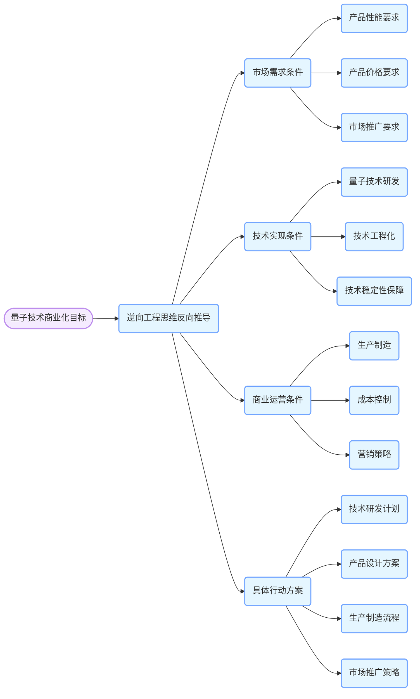

# 芒格的"逆向工程"思维在量子技术商业化中的应用

> 关键词：芒格逆向工程思维、量子技术、商业化应用、技术转化、商业策略

> 摘要：本文深入探讨了芒格的“逆向工程”思维在量子技术商业化过程中的应用。首先介绍了背景信息，包括目的范围、预期读者等内容。接着阐述了核心概念与联系，通过文本示意图和Mermaid流程图呈现。详细讲解了核心算法原理及具体操作步骤，结合Python代码进行说明。还给出了相关数学模型和公式，并举例说明。通过项目实战案例，对代码实现和解读进行了分析。探讨了量子技术商业化的实际应用场景，推荐了学习资源、开发工具框架以及相关论文著作。最后总结了未来发展趋势与挑战，解答了常见问题，并提供了扩展阅读和参考资料，旨在为量子技术商业化提供新的思路和方法。

## 1. 背景介绍 
### 1.1 目的和范围
本文章的主要目的是研究如何将芒格的“逆向工程”思维应用于量子技术的商业化进程中。逆向工程思维强调从目标出发，反向推导实现目标所需的步骤和条件。量子技术作为前沿科技，在商业化过程中面临诸多挑战，如技术转化困难、市场需求不明确等。通过应用逆向工程思维，我们试图找到更有效的商业化路径，提高量子技术商业化的成功率。

文章的范围涵盖了量子技术商业化的各个方面，包括核心概念、算法原理、数学模型、项目实战、实际应用场景等。同时，也会推荐相关的学习资源、开发工具和论文著作，为读者提供全面的参考。

### 1.2 预期读者
本文的预期读者包括量子技术领域的科研人员、创业者、投资者，以及对商业策略和科技应用感兴趣的人士。科研人员可以从逆向工程思维中获得技术转化的新思路；创业者可以借鉴这种思维方式制定商业计划；投资者可以通过了解量子技术商业化的方法评估投资价值；对科技和商业感兴趣的人士可以拓宽知识面，了解前沿科技的商业应用。

### 1.3 文档结构概述
本文将按照以下结构展开：首先介绍核心概念与联系，明确逆向工程思维和量子技术商业化的相关概念和它们之间的联系；接着讲解核心算法原理和具体操作步骤，通过Python代码详细说明；然后给出数学模型和公式，并举例说明；通过项目实战案例，介绍开发环境搭建、源代码实现和代码解读；探讨量子技术商业化的实际应用场景；推荐学习资源、开发工具框架和相关论文著作；最后总结未来发展趋势与挑战，解答常见问题，并提供扩展阅读和参考资料。

### 1.4 术语表
#### 1.4.1 核心术语定义
- **逆向工程思维**：一种从目标或结果出发，反向推导实现该目标所需的步骤、条件和资源的思维方式。通过明确最终想要达到的结果，分析需要克服的障碍和满足的条件，从而制定出可行的行动计划。
- **量子技术**：基于量子力学原理发展起来的一系列技术，包括量子计算、量子通信、量子传感等。这些技术利用量子系统的独特性质，如量子叠加、量子纠缠等，具有更高的计算能力、更安全的通信和更精确的测量等优势。
- **量子技术商业化**：将量子技术从实验室研究成果转化为具有市场价值的产品或服务的过程。这包括技术的开发、生产、销售和市场推广等环节，旨在实现商业盈利和社会价值。

#### 1.4.2 相关概念解释
- **技术转化**：将科研成果从实验室阶段转化为实际应用的过程，涉及技术的工程化、产品化和产业化等多个方面。在量子技术商业化中，技术转化是关键环节，需要解决技术稳定性、成本控制等问题。
- **市场需求分析**：对市场上潜在的需求进行研究和评估的过程。在量子技术商业化中，了解市场需求有助于确定产品或服务的定位和发展方向，提高商业化的成功率。
- **商业策略**：企业为实现商业目标而制定的一系列计划和决策，包括市场定位、产品定价、营销策略等。在量子技术商业化中，合理的商业策略能够有效地推动技术的市场推广和应用。

#### 1.4.3 缩略词列表
- **QC**：Quantum Computing，量子计算
- **QKD**：Quantum Key Distribution，量子密钥分发
- **QIS**：Quantum Information Science，量子信息科学

## 2. 核心概念与联系 
### 核心概念原理
#### 逆向工程思维原理
逆向工程思维的核心是从目标反向推导。在商业领域，首先要明确最终的商业目标，例如实现一定的销售额、占据一定的市场份额等。然后，分析为了实现这个目标，需要满足哪些条件，如产品的性能、价格、市场推广等。接着，进一步思考为了满足这些条件，需要采取哪些具体的行动，如技术研发、生产制造、市场营销等。通过这种反向推导的方式，可以更清晰地规划出实现目标的路径。

#### 量子技术商业化原理
量子技术商业化的过程是将量子技术的科研成果转化为具有市场竞争力的产品或服务。这需要经过多个阶段，包括技术研发、产品设计、生产制造、市场推广等。在技术研发阶段，要确保量子技术的性能和稳定性；在产品设计阶段，要根据市场需求设计出符合用户需求的产品；在生产制造阶段，要解决成本控制和大规模生产的问题；在市场推广阶段，要提高产品的知名度和市场占有率。

### 架构的文本示意图
```plaintext
量子技术商业化目标
|
|-- 逆向工程思维反向推导
|   |-- 市场需求条件
|   |   |-- 产品性能要求
|   |   |-- 产品价格要求
|   |   |-- 市场推广要求
|   |-- 技术实现条件
|   |   |-- 量子技术研发
|   |   |-- 技术工程化
|   |   |-- 技术稳定性保障
|   |-- 商业运营条件
|       |-- 生产制造
|       |-- 成本控制
|       |-- 营销策略
|
|-- 具体行动方案
|   |-- 技术研发计划
|   |-- 产品设计方案
|   |-- 生产制造流程
|   |-- 市场推广策略
```

### Mermaid流程图


## 3. 核心算法原理 & 具体操作步骤 
### 核心算法原理
在量子技术商业化中应用逆向工程思维可以看作是一个优化问题，目标是最大化商业价值。可以使用贪心算法的思想来逐步逼近最优解。贪心算法的核心是在每一步都选择当前看起来最优的决策，从而逐步构建出最终的解决方案。

具体来说，从量子技术商业化的目标出发，每次选择对实现目标影响最大的条件进行满足。例如，如果市场需求中对产品性能的要求最为关键，那么首先集中资源提高量子技术产品的性能。在满足了一个条件后，再考虑下一个对目标影响较大的条件，直到实现最终的商业目标。

### Python代码实现
```python
# 定义量子技术商业化的目标，例如实现一定的销售额
commercial_goal = 1000000

# 定义各个条件及其对目标的影响权重
conditions = {
    "product_performance": 0.4,
    "product_price": 0.3,
    "market_promotion": 0.2,
    "technology_stability": 0.1
}

# 定义每个条件的当前满足程度
condition_status = {
    "product_performance": 0,
    "product_price": 0,
    "market_promotion": 0,
    "technology_stability": 0
}

# 定义每个条件的改进步骤和对应的收益
improve_steps = {
    "product_performance": {
        "step1": 100000,
        "step2": 200000,
        "step3": 300000
    },
    "product_price": {
        "step1": 80000,
        "step2": 150000,
        "step3": 200000
    },
    "market_promotion": {
        "step1": 50000,
        "step2": 120000,
        "step3": 180000
    },
    "technology_stability": {
        "step1": 30000,
        "step2": 60000,
        "step3": 90000
    }
}

# 贪心算法实现
def reverse_engineering_greedy():
    current_value = 0
    while current_value < commercial_goal:
        best_condition = None
        best_step = None
        best_improvement = 0
        # 遍历每个条件
        for condition in conditions:
            # 遍历每个条件的改进步骤
            for step, improvement in improve_steps[condition].items():
                if condition_status[condition] < len(improve_steps[condition]):
                    # 计算该步骤的加权改进值
                    weighted_improvement = improvement * conditions[condition]
                    if weighted_improvement > best_improvement:
                        best_improvement = weighted_improvement
                        best_condition = condition
                        best_step = step
        # 执行最优步骤
        if best_condition and best_step:
            current_value += improve_steps[best_condition][best_step]
            condition_status[best_condition] += 1
            print(f"执行 {best_condition} 的 {best_step} 步骤，当前价值: {current_value}")
        else:
            break
    return current_value

# 执行逆向工程贪心算法
final_value = reverse_engineering_greedy()
print(f"最终实现的商业价值: {final_value}")
```

### 具体操作步骤
1. **明确商业目标**：确定量子技术商业化的具体目标，如销售额、市场份额等。在上述代码中，商业目标被定义为 `commercial_goal = 1000000`。
2. **分析影响条件**：找出影响商业目标实现的关键条件，如产品性能、价格、市场推广等，并确定每个条件的权重。代码中使用 `conditions` 字典来存储条件及其权重。
3. **评估当前状态**：了解每个条件的当前满足程度，以便确定需要改进的方向。代码中使用 `condition_status` 字典来存储每个条件的当前状态。
4. **制定改进步骤**：为每个条件制定具体的改进步骤，并评估每个步骤的收益。代码中使用 `improve_steps` 字典来存储每个条件的改进步骤和收益。
5. **执行贪心算法**：在每一步选择对商业目标影响最大的改进步骤进行执行，直到实现商业目标或无法再进行改进。代码中使用 `reverse_engineering_greedy` 函数实现贪心算法。

## 4. 数学模型和公式 & 详细讲解 & 举例说明 
### 数学模型
我们可以将量子技术商业化的过程看作是一个多目标优化问题。设商业目标为 $G$，影响商业目标的条件有 $n$ 个，分别为 $C_1, C_2, \cdots, C_n$，每个条件的权重为 $w_i$，其中 $\sum_{i=1}^{n} w_i = 1$。每个条件的改进步骤有 $m_i$ 个，第 $j$ 个步骤对商业目标的贡献为 $r_{ij}$。

设 $x_{ij}$ 为一个二进制变量，表示是否选择第 $i$ 个条件的第 $j$ 个改进步骤，$x_{ij} \in \{0, 1\}$。则商业目标可以表示为：

$$
G = \sum_{i=1}^{n} w_i \sum_{j=1}^{m_i} r_{ij} x_{ij}
$$

同时，需要满足一些约束条件，例如资源限制、技术可行性等。

### 详细讲解
上述数学模型的核心思想是通过选择合适的改进步骤，最大化商业目标 $G$。每个条件的权重 $w_i$ 表示该条件对商业目标的重要程度，权重越大，该条件对商业目标的影响越大。$r_{ij}$ 表示第 $i$ 个条件的第 $j$ 个改进步骤对商业目标的贡献，通过选择 $x_{ij} = 1$ 来执行该步骤。

### 举例说明
假设我们有三个影响商业目标的条件：产品性能（$C_1$）、产品价格（$C_2$）和市场推广（$C_3$），它们的权重分别为 $w_1 = 0.4$，$w_2 = 0.3$，$w_3 = 0.3$。

产品性能有两个改进步骤，$r_{11} = 100000$，$r_{12} = 200000$；产品价格有两个改进步骤，$r_{21} = 80000$，$r_{22} = 150000$；市场推广有两个改进步骤，$r_{31} = 50000$，$r_{32} = 120000$。

如果我们选择执行产品性能的第一个步骤（$x_{11} = 1$）、产品价格的第二个步骤（$x_{22} = 1$）和市场推广的第一个步骤（$x_{31} = 1$），则商业目标为：

$$
\begin{align*}
G &= w_1 r_{11} x_{11} + w_2 r_{22} x_{22} + w_3 r_{31} x_{31}\\
&= 0.4 \times 100000 \times 1 + 0.3 \times 150000 \times 1 + 0.3 \times 50000 \times 1\\
&= 40000 + 45000 + 15000\\
&= 100000
\end{align*}
$$

通过不断地选择合适的 $x_{ij}$ 值，可以逐步提高商业目标 $G$ 的值。

## 5. 项目实战：代码实际案例和详细解释说明 
### 5.1  开发环境搭建
#### 操作系统
建议使用 Linux 或 macOS 操作系统，因为它们对 Python 开发环境的支持较好。Windows 系统也可以使用，但可能需要额外的配置。

#### Python 环境
安装 Python 3.7 或更高版本。可以从 Python 官方网站（https://www.python.org/downloads/）下载安装包进行安装。安装完成后，使用以下命令验证 Python 版本：
```bash
python --version
```

#### 开发工具
推荐使用 PyCharm 作为集成开发环境（IDE），它提供了丰富的功能，如代码编辑、调试、自动补全等。也可以使用 VS Code 等轻量级编辑器，配合 Python 扩展进行开发。

### 5.2  源代码详细实现和代码解读
```python
# 定义量子技术商业化的目标，例如实现一定的销售额
commercial_goal = 1000000

# 定义各个条件及其对目标的影响权重
conditions = {
    "product_performance": 0.4,
    "product_price": 0.3,
    "market_promotion": 0.2,
    "technology_stability": 0.1
}

# 定义每个条件的当前满足程度
condition_status = {
    "product_performance": 0,
    "product_price": 0,
    "market_promotion": 0,
    "technology_stability": 0
}

# 定义每个条件的改进步骤和对应的收益
improve_steps = {
    "product_performance": {
        "step1": 100000,
        "step2": 200000,
        "step3": 300000
    },
    "product_price": {
        "step1": 80000,
        "step2": 150000,
        "step3": 200000
    },
    "market_promotion": {
        "step1": 50000,
        "step2": 120000,
        "step3": 180000
    },
    "technology_stability": {
        "step1": 30000,
        "step2": 60000,
        "step3": 90000
    }
}

# 贪心算法实现
def reverse_engineering_greedy():
    current_value = 0
    while current_value < commercial_goal:
        best_condition = None
        best_step = None
        best_improvement = 0
        # 遍历每个条件
        for condition in conditions:
            # 遍历每个条件的改进步骤
            for step, improvement in improve_steps[condition].items():
                if condition_status[condition] < len(improve_steps[condition]):
                    # 计算该步骤的加权改进值
                    weighted_improvement = improvement * conditions[condition]
                    if weighted_improvement > best_improvement:
                        best_improvement = weighted_improvement
                        best_condition = condition
                        best_step = step
        # 执行最优步骤
        if best_condition and best_step:
            current_value += improve_steps[best_condition][best_step]
            condition_status[best_condition] += 1
            print(f"执行 {best_condition} 的 {best_step} 步骤，当前价值: {current_value}")
        else:
            break
    return current_value

# 执行逆向工程贪心算法
final_value = reverse_engineering_greedy()
print(f"最终实现的商业价值: {final_value}")
```

### 代码解读与分析
1. **商业目标定义**：`commercial_goal` 变量定义了量子技术商业化的目标，这里假设为实现 1000000 的销售额。
2. **条件权重定义**：`conditions` 字典存储了各个条件对商业目标的影响权重，例如产品性能的权重为 0.4，表示它对商业目标的影响较大。
3. **条件状态定义**：`condition_status` 字典记录了每个条件的当前满足程度，初始值都为 0。
4. **改进步骤和收益定义**：`improve_steps` 字典存储了每个条件的改进步骤和对应的收益，例如产品性能的第一个步骤收益为 100000。
5. **贪心算法实现**：`reverse_engineering_greedy` 函数实现了逆向工程的贪心算法。在每次循环中，遍历每个条件的改进步骤，计算加权改进值，选择加权改进值最大的步骤执行，直到实现商业目标或无法再进行改进。
6. **执行算法并输出结果**：调用 `reverse_engineering_greedy` 函数执行算法，并输出最终实现的商业价值。

## 6. 实际应用场景 
### 量子计算商业化
在量子计算领域，逆向工程思维可以帮助企业更好地实现商业化。首先明确商业目标，例如为金融机构提供更高效的风险评估服务。然后反向推导，了解金融机构对风险评估的性能要求，如计算速度、准确性等。根据这些要求，确定量子计算技术需要达到的性能指标，如量子比特数、门保真度等。接着，制定技术研发计划，逐步提高量子计算的性能。同时，考虑产品价格和市场推广策略，以满足金融机构的预算和市场需求。

### 量子通信商业化
对于量子通信商业化，目标可能是为政府部门和企业提供更安全的通信服务。通过逆向工程思维，分析政府和企业对通信安全的需求，如密钥分发的安全性、通信的稳定性等。根据这些需求，确定量子通信技术的研发方向，如量子密钥分发的协议优化、量子纠缠的保持等。在产品设计阶段，考虑如何降低成本，提高产品的性价比。在市场推广方面，强调量子通信的安全性优势，吸引更多的客户。

### 量子传感商业化
量子传感在医疗、环境监测等领域有广泛的应用前景。以医疗领域为例，商业目标可能是开发一种更精确的医疗检测设备。通过逆向工程思维，了解医疗行业对检测设备的性能要求，如检测灵敏度、准确性等。根据这些要求，研发量子传感技术，提高传感器的性能。同时，考虑产品的易用性和成本，以满足医疗市场的需求。在市场推广方面，与医疗机构合作进行临床试验，证明产品的有效性和优势。

## 7. 工具和资源推荐
### 7.1 学习资源推荐
#### 7.1.1 书籍推荐
- 《穷查理宝典：查理·芒格的智慧箴言录》：这本书介绍了芒格的思维方式和投资理念，对于理解逆向工程思维有很大的帮助。
- 《量子计算与量子信息》：经典的量子计算教材，全面介绍了量子计算的基本原理和算法。
- 《量子通信原理与技术》：系统地阐述了量子通信的原理、技术和应用，适合量子通信领域的初学者和研究者。

#### 7.1.2 在线课程
- Coursera 上的“Quantum Computing for Everyone”：该课程由专业教授授课，深入浅出地介绍了量子计算的基础知识，适合对量子计算感兴趣的初学者。
- edX 上的“Quantum Information Science”：课程涵盖了量子信息科学的各个方面，包括量子比特、量子门、量子算法等，适合有一定物理学基础的学习者。

#### 7.1.3 技术博客和网站
- 量子位（https://www.qbitai.com/）：专注于量子技术领域的资讯和技术解读，提供最新的行业动态和技术文章。
- arXiv（https://arxiv.org/）：一个预印本平台，包含了大量的量子技术研究论文，方便研究者了解最新的研究成果。

### 7.2 开发工具框架推荐
#### 7.2.1 IDE和编辑器
- PyCharm：功能强大的 Python 集成开发环境，提供了丰富的代码编辑、调试和项目管理功能。
- VS Code：轻量级的代码编辑器，支持多种编程语言，通过安装 Python 扩展可以方便地进行 Python 开发。

#### 7.2.2 调试和性能分析工具
- PDB：Python 自带的调试工具，可以帮助开发者定位代码中的问题。
- cProfile：Python 标准库中的性能分析工具，可以分析代码的运行时间和函数调用情况。

#### 7.2.3 相关框架和库
- Qiskit：IBM 开发的开源量子计算框架，提供了量子电路设计、模拟和实验的工具。
- Cirq：Google 开发的量子计算框架，支持量子电路的构建和模拟。

### 7.3 相关论文著作推荐
#### 7.3.1 经典论文
- "Quantum Computation and Quantum Information" by Michael A. Nielsen and Isaac L. Chuang：该论文是量子计算领域的经典之作，系统地介绍了量子计算的基本理论和算法。
- "The Security of Practical Quantum Key Distribution" by Hoi-Kwong Lo, Michele Curty, and Benoit Qi：这篇论文对量子密钥分发的安全性进行了深入研究，为量子通信的商业化提供了理论基础。

#### 7.3.2 最新研究成果
- 定期关注 arXiv 上的量子技术研究论文，了解最新的研究进展。例如，关于量子纠错码、量子模拟算法等方面的研究成果。
- 关注顶级学术期刊，如《Nature》《Science》《Physical Review Letters》等，这些期刊经常发表量子技术领域的重要研究成果。

#### 7.3.3 应用案例分析
- 研究一些量子技术商业化的成功案例，如 IBM 的量子计算云服务、ID Quantique 的量子密钥分发产品等。分析它们的商业策略、技术路线和市场推广方法，为自己的项目提供参考。

## 8. 总结：未来发展趋势与挑战
### 未来发展趋势
- **技术融合**：量子技术将与人工智能、大数据、物联网等技术深度融合，创造出更多的应用场景和商业机会。例如，量子计算可以为人工智能提供更强大的计算能力，加速机器学习算法的训练过程。
- **产业生态完善**：随着量子技术商业化的推进，相关的产业链将逐渐完善，包括量子芯片制造、量子设备研发、量子软件服务等。产业生态的完善将降低量子技术的应用门槛，促进量子技术的广泛应用。
- **国际合作加强**：量子技术是全球性的前沿科技，各国将加强在量子技术领域的合作与交流。通过国际合作，可以共享资源、共同攻克技术难题，推动量子技术的快速发展。

### 挑战
- **技术难题**：量子技术目前还面临着许多技术难题，如量子比特的稳定性、量子纠错码的实现等。这些技术难题需要科研人员不断地进行研究和创新，才能实现量子技术的大规模应用。
- **成本高昂**：量子技术的研发和生产成本较高，限制了其商业化的进程。降低量子技术的成本是实现商业化的关键之一，需要通过技术创新和产业规模化来实现。
- **市场认知不足**：由于量子技术的专业性和复杂性，市场对量子技术的认知度较低。提高市场对量子技术的认知和接受度，需要加强科普宣传和市场推广。

## 9. 附录：常见问题与解答
### 问题 1：逆向工程思维在量子技术商业化中的应用有哪些优势？
解答：逆向工程思维可以帮助企业从商业目标出发，明确实现目标所需的条件和步骤，避免盲目投入资源。通过反向推导，可以更有针对性地进行技术研发、产品设计和市场推广，提高商业化的成功率。

### 问题 2：量子技术商业化需要具备哪些条件？
解答：量子技术商业化需要具备技术、市场、资金、人才等多方面的条件。技术方面，需要有成熟的量子技术和稳定的产品性能；市场方面，需要有明确的市场需求和商业应用场景；资金方面，需要有足够的资金支持技术研发和市场推广；人才方面，需要有专业的科研人员和商业运营人才。

### 问题 3：如何评估量子技术商业化项目的可行性？
解答：可以从技术可行性、市场可行性、财务可行性等方面进行评估。技术可行性主要评估量子技术的成熟度和稳定性；市场可行性主要评估市场需求和竞争情况；财务可行性主要评估项目的成本、收益和投资回报率等。

### 问题 4：量子技术商业化过程中可能会遇到哪些风险？
解答：可能会遇到技术风险，如量子技术无法达到预期的性能指标；市场风险，如市场需求不足、竞争激烈等；资金风险，如资金短缺、融资困难等；人才风险，如核心人才流失等。

## 10. 扩展阅读 & 参考资料
### 扩展阅读
- 《从0到1：开启商业与未来的秘密》：这本书介绍了创业和创新的方法和理念，对于量子技术创业者有一定的启发。
- 《创新者的窘境》：探讨了企业在面对技术变革时的困境和应对策略，有助于理解量子技术商业化过程中的挑战。

### 参考资料
- Nielsen, M. A., & Chuang, I. L. (2000). Quantum Computation and Quantum Information. Cambridge University Press.
- Lo, H. -K., Curty, M., & Qi, B. (2014). The Security of Practical Quantum Key Distribution. Reviews of Modern Physics, 84(1), 621 - 669.
- Charlie Munger. Poor Charlie's Almanack: The Wit and Wisdom of Charles T. Munger.

作者：AI天才研究院/AI Genius Institute & 禅与计算机程序设计艺术 /Zen And The Art of Computer Programming