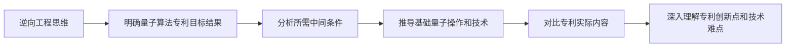

# 芒格的"逆向工程"思维在量子算法专利分析中的应用

> 关键词：芒格逆向工程思维、量子算法、专利分析、技术洞察、创新驱动

> 摘要：本文旨在探讨芒格的“逆向工程”思维在量子算法专利分析中的应用。首先介绍了背景信息，包括研究目的、预期读者等。接着阐述了核心概念，如逆向工程思维和量子算法专利的相关原理及联系。通过Python代码详细讲解了核心算法原理和操作步骤，给出了数学模型和公式。在项目实战部分，展示了开发环境搭建、源代码实现及解读。还分析了实际应用场景，推荐了学习资源、开发工具和相关论文。最后总结了未来发展趋势与挑战，并对常见问题进行了解答，为量子算法专利分析提供了新的视角和方法。

## 1. 背景介绍 
### 1.1 目的和范围
随着量子计算技术的飞速发展，量子算法领域的专利竞争日益激烈。对量子算法专利进行深入分析，有助于企业和研究机构了解技术趋势、发现创新机会、避免专利侵权等。芒格的“逆向工程”思维强调从结果出发，反向推导实现过程，将其应用于量子算法专利分析中，能够帮助我们更深入地理解专利的核心技术和创新点。本研究的范围涵盖了常见的量子算法专利类型，通过具体案例分析逆向工程思维的应用效果。

### 1.2 预期读者
本文的预期读者包括量子计算领域的研究人员、专利分析师、企业技术管理人员以及对量子算法和专利分析感兴趣的爱好者。对于研究人员来说，本文可以提供新的研究思路和方法；专利分析师可以借鉴逆向工程思维提升专利分析的准确性和深度；企业技术管理人员可以通过专利分析制定更合理的技术战略；爱好者则可以了解量子算法专利分析的基本流程和方法。

### 1.3 文档结构概述
本文首先介绍背景信息，让读者了解研究的目的和范围。接着阐述核心概念，包括逆向工程思维和量子算法专利的相关原理及联系。然后通过Python代码详细讲解核心算法原理和操作步骤，并给出数学模型和公式。在项目实战部分，展示开发环境搭建、源代码实现及解读。之后分析实际应用场景，推荐学习资源、开发工具和相关论文。最后总结未来发展趋势与挑战，解答常见问题，并提供扩展阅读和参考资料。

### 1.4 术语表
#### 1.4.1 核心术语定义
- **逆向工程思维**：从最终的结果或目标出发，反向推导实现该结果所需的步骤、条件和技术，以深入理解事物的本质和工作原理。
- **量子算法**：基于量子力学原理设计的算法，利用量子比特的叠加、纠缠等特性，在某些问题上具有比经典算法更高的计算效率。
- **专利分析**：对专利文献进行收集、整理、分析和研究，以了解技术发展趋势、评估专利价值、发现创新机会等。

#### 1.4.2 相关概念解释
- **量子比特（qubit）**：量子计算中的基本信息单位，与经典比特不同，量子比特可以处于0、1或两者的叠加态。
- **叠加态**：量子比特可以同时处于多个状态的线性组合，这使得量子计算机在处理某些问题时能够并行计算。
- **纠缠态**：多个量子比特之间存在一种特殊的关联，使得一个量子比特的状态变化会立即影响其他纠缠量子比特的状态。

#### 1.4.3 缩略词列表
- **QC**：Quantum Computing，量子计算
- **QIP**：Quantum Information Processing，量子信息处理
- **Shor算法**：一种量子算法，用于整数分解，在密码学领域具有重要意义。
- **Grover算法**：一种量子搜索算法，能够在未排序的数据集中快速找到目标元素。

## 2. 核心概念与联系 
### 逆向工程思维原理
逆向工程思维的核心是从结果反向推导过程。在解决问题时，我们通常习惯于从已知条件出发，逐步推导到目标结果。而逆向工程思维则是先明确目标结果，然后思考要达到这个结果需要满足哪些条件，每个条件又依赖于哪些更基础的条件，以此类推，直到找到最基本的要素。例如，在分析一款成功的产品时，逆向工程思维会先观察产品的功能和性能，然后拆解产品的各个组件，研究每个组件的设计和工作原理，最终了解整个产品的研发过程和技术要点。

### 量子算法专利原理
量子算法专利是对量子算法相关技术的法律保护。量子算法的核心在于利用量子力学的特性，如叠加态和纠缠态，来实现更高效的计算。专利中通常会描述算法的具体步骤、使用的量子门（类似于经典逻辑门）、量子比特的初始化和操作方式等。例如，Shor算法通过量子傅里叶变换实现整数分解，其专利会详细阐述如何构建量子电路来完成这一变换。

### 两者的联系
将逆向工程思维应用于量子算法专利分析中，可以帮助我们从专利所声称的效果出发，反向推导算法的实现过程。通过分析专利中描述的最终计算结果和性能提升，我们可以尝试还原算法的核心步骤和关键技术。例如，如果一个量子算法专利声称能够在多项式时间内解决某个NP难题，我们可以从这个目标结果出发，思考需要哪些量子操作和电路结构来实现这一目标，然后与专利中实际描述的内容进行对比，从而更深入地理解专利的创新点和技术难点。

### 文本示意图
```plaintext
逆向工程思维
|
|--明确量子算法专利目标结果
|   |
|   |--分析所需中间条件
|       |
|       |--推导基础量子操作和技术
|           |
|           |--对比专利实际内容
|
|--深入理解专利创新点和技术难点
```

### Mermaid流程图


## 3. 核心算法原理 & 具体操作步骤 
### 逆向分析量子算法专利的核心思路
逆向分析量子算法专利的核心思路是从专利所描述的最终计算结果出发，逐步反向推导算法的实现过程。具体步骤如下：
1. **确定目标结果**：仔细阅读专利文本，明确专利所声称的算法能够实现的计算任务和性能提升，如更快的计算速度、更低的资源消耗等。
2. **分析中间结果**：思考为了达到最终目标结果，需要先得到哪些中间结果。例如，在整数分解问题中，可能需要先计算出某些因子的候选值。
3. **推导量子操作**：根据中间结果，推导需要进行哪些量子操作来得到这些结果。这可能涉及到量子门的应用、量子比特的初始化和测量等。
4. **构建量子电路**：将推导得到的量子操作组合成量子电路，模拟算法的执行过程。
5. **对比验证**：将构建的量子电路与专利中实际描述的电路进行对比，验证推导的正确性，并找出专利中的创新点和技术难点。

### Python代码实现
以下是一个简单的示例，演示如何使用Python和Qiskit库来逆向分析一个简单的量子算法专利。假设专利描述了一个量子算法，用于实现两个量子比特的纠缠态制备。

```python
import qiskit
from qiskit import QuantumCircuit, Aer, execute

# 步骤1：确定目标结果
# 目标是制备两个量子比特的纠缠态，如贝尔态 |Φ⁺⟩ = (|00⟩ + |11⟩) / √2

# 步骤2：分析中间结果
# 要制备贝尔态，需要先将第一个量子比特置于叠加态，然后通过CNOT门实现纠缠

# 步骤3：推导量子操作
# 操作1：对第一个量子比特应用Hadamard门（H门）
# 操作2：对第一个和第二个量子比特应用CNOT门

# 步骤4：构建量子电路
qc = QuantumCircuit(2, 2)  # 创建一个包含2个量子比特和2个经典比特的量子电路
qc.h(0)  # 对第一个量子比特应用H门
qc.cx(0, 1)  # 对第一个和第二个量子比特应用CNOT门
qc.measure([0, 1], [0, 1])  # 测量量子比特并将结果存储到经典比特中

# 步骤5：对比验证
# 假设专利中描述的电路也是通过H门和CNOT门实现纠缠态制备，这里可以验证我们的推导
backend = Aer.get_backend('qasm_simulator')  # 使用模拟器后端
job = execute(qc, backend, shots=1000)  # 执行量子电路1000次
result = job.result()
counts = result.get_counts(qc)
print("测量结果：", counts)
```

### 代码解释
1. **导入库**：导入Qiskit库中的必要模块，包括`QuantumCircuit`用于构建量子电路，`Aer`用于提供模拟器后端，`execute`用于执行量子电路。
2. **确定目标结果**：明确要制备的纠缠态为贝尔态 |Φ⁺⟩。
3. **分析中间结果和推导量子操作**：根据贝尔态的制备原理，确定需要先对第一个量子比特应用H门，然后对两个量子比特应用CNOT门。
4. **构建量子电路**：创建一个包含2个量子比特和2个经典比特的量子电路，依次应用H门和CNOT门，并进行测量。
5. **对比验证**：使用模拟器后端执行量子电路1000次，获取测量结果并打印。如果测量结果符合贝尔态的预期（大部分结果为 |00⟩ 和 |11⟩），则说明我们的推导是正确的。

## 4. 数学模型和公式 & 详细讲解 & 举例说明 
### 量子比特和量子态的数学表示
在量子计算中，量子比特用二维复向量空间中的向量来表示。一个量子比特可以处于基态 |0⟩ 或 |1⟩，也可以处于它们的叠加态：
$$|\psi⟩ = \alpha|0⟩ + \beta|1⟩$$
其中，$\alpha$ 和 $\beta$ 是复数，满足 $|\alpha|^2 + |\beta|^2 = 1$。$|\alpha|^2$ 和 $|\beta|^2$ 分别表示测量量子比特得到 |0⟩ 和 |1⟩ 的概率。

### 量子门的数学表示
量子门是对量子比特进行操作的基本单元，用酉矩阵来表示。常见的量子门包括：
- **Hadamard门（H门）**：用于将量子比特从基态转换为叠加态，其矩阵表示为：
$$H = \frac{1}{\sqrt{2}}\begin{bmatrix}1 & 1\\1 & -1\end{bmatrix}$$
对量子比特 |0⟩ 应用H门的结果为：
$$H|0⟩ = \frac{1}{\sqrt{2}}\begin{bmatrix}1 & 1\\1 & -1\end{bmatrix}\begin{bmatrix}1\\0\end{bmatrix} = \frac{1}{\sqrt{2}}\begin{bmatrix}1\\1\end{bmatrix} = \frac{|0⟩ + |1⟩}{\sqrt{2}}$$
- **CNOT门**：用于实现两个量子比特之间的纠缠，其矩阵表示为：
$$CNOT = \begin{bmatrix}1 & 0 & 0 & 0\\0 & 1 & 0 & 0\\0 & 0 & 0 & 1\\0 & 0 & 1 & 0\end{bmatrix}$$
假设第一个量子比特为控制比特，第二个量子比特为目标比特。如果控制比特为 |0⟩，则目标比特不变；如果控制比特为 |1⟩，则目标比特取反。

### 量子算法的数学模型
以制备贝尔态 |Φ⁺⟩ 为例，其制备过程可以用数学公式表示为：
1. 初始状态：两个量子比特都处于 |0⟩ 态，即 $|\psi_0⟩ = |00⟩$。
2. 对第一个量子比特应用H门：
$$|\psi_1⟩ = (H \otimes I)|00⟩ = \frac{|0⟩ + |1⟩}{\sqrt{2}} \otimes |0⟩ = \frac{|00⟩ + |10⟩}{\sqrt{2}}$$
其中，$I$ 是2x2的单位矩阵。
3. 对两个量子比特应用CNOT门：
$$|\psi_2⟩ = CNOT|\psi_1⟩ = \frac{|00⟩ + |11⟩}{\sqrt{2}} = |Φ⁺⟩$$

### 举例说明
假设我们要逆向分析一个量子算法专利，该专利声称可以通过一系列量子门操作将一个初始量子态 $|\psi_0⟩ = \alpha|0⟩ + \beta|1⟩$ 转换为目标量子态 $|\psi_t⟩ = \gamma|0⟩ + \delta|1⟩$。我们可以根据量子门的数学表示，反向推导需要应用哪些量子门。

设需要应用的量子门为 $U$，则有 $|\psi_t⟩ = U|\psi_0⟩$。通过求解方程 $U = |\psi_t⟩⟨\psi_0|^\dagger$（其中 $^\dagger$ 表示共轭转置），可以得到所需的量子门矩阵 $U$。然后，我们可以将 $U$ 分解为一系列已知的基本量子门的组合，从而实现逆向分析。

## 5. 项目实战：代码实际案例和详细解释说明 
### 5.1  开发环境搭建
#### 安装Python
首先，确保你已经安装了Python 3.x版本。可以从Python官方网站（https://www.python.org/downloads/）下载并安装适合你操作系统的版本。

#### 安装Qiskit库
Qiskit是一个用于量子计算的开源Python库，提供了丰富的工具和接口来构建、模拟和运行量子电路。可以使用以下命令来安装Qiskit：
```sh
pip install qiskit
```

#### 安装其他依赖库
为了进行数据可视化和分析，还可以安装一些其他的依赖库，如`matplotlib`和`numpy`：
```sh
pip install matplotlib numpy
```

### 5.2  源代码详细实现和代码解读
以下是一个更复杂的项目实战案例，逆向分析一个基于Grover算法的量子搜索专利。Grover算法是一种用于在未排序的数据集中快速找到目标元素的量子算法。

```python
import qiskit
from qiskit import QuantumCircuit, Aer, execute
import numpy as np
import matplotlib.pyplot as plt

# 步骤1：确定目标结果
# 目标是在一个包含N个元素的未排序数据集中找到目标元素
N = 4  # 数据集大小
target = 2  # 目标元素

# 步骤2：分析中间结果
# Grover算法的核心是通过多次迭代来放大目标元素的概率振幅
# 需要先构建初始叠加态，然后进行Oracle操作和扩散操作

# 步骤3：推导量子操作
# 操作1：构建初始叠加态，对所有量子比特应用H门
# 操作2：Oracle操作，标记目标元素
# 操作3：扩散操作，放大目标元素的概率振幅

# 步骤4：构建量子电路
n = int(np.log2(N))  # 所需的量子比特数
qc = QuantumCircuit(n, n)

# 构建初始叠加态
for qubit in range(n):
    qc.h(qubit)

# 迭代次数
iterations = int(np.floor(np.pi / 4 * np.sqrt(N)))

# 迭代过程
for _ in range(iterations):
    # Oracle操作
    oracle = QuantumCircuit(n)
    target_binary = format(target, 'b').zfill(n)
    for qubit in range(n):
        if target_binary[qubit] == '0':
            oracle.x(qubit)
    oracle.mct(list(range(n - 1)), n - 1)  # 多控制Toffoli门
    for qubit in range(n):
        if target_binary[qubit] == '0':
            oracle.x(qubit)
    qc.compose(oracle, inplace=True)

    # 扩散操作
    diffusion = QuantumCircuit(n)
    for qubit in range(n):
        diffusion.h(qubit)
        diffusion.x(qubit)
    diffusion.mct(list(range(n - 1)), n - 1)  # 多控制Toffoli门
    for qubit in range(n):
        diffusion.x(qubit)
        diffusion.h(qubit)
    qc.compose(diffusion, inplace=True)

# 测量量子比特
qc.measure(range(n), range(n))

# 步骤5：对比验证
backend = Aer.get_backend('qasm_simulator')
job = execute(qc, backend, shots=1000)
result = job.result()
counts = result.get_counts(qc)

# 可视化结果
plt.bar(counts.keys(), counts.values())
plt.xlabel('测量结果')
plt.ylabel('计数')
plt.title('Grover算法测量结果')
plt.show()
```

### 5.3  代码解读与分析
1. **确定目标结果**：明确要在包含 $N = 4$ 个元素的数据集中找到目标元素 $target = 2$。
2. **分析中间结果**：Grover算法通过多次迭代来放大目标元素的概率振幅，需要构建初始叠加态、进行Oracle操作和扩散操作。
3. **推导量子操作**：
    - **初始叠加态**：对所有量子比特应用H门，将它们置于叠加态。
    - **Oracle操作**：标记目标元素，通过多控制Toffoli门实现。
    - **扩散操作**：放大目标元素的概率振幅，通过一系列H门、X门和多控制Toffoli门实现。
4. **构建量子电路**：
    - 创建一个包含 $n = \log_2(N)$ 个量子比特和 $n$ 个经典比特的量子电路。
    - 构建初始叠加态。
    - 进行多次迭代，每次迭代包括Oracle操作和扩散操作。
    - 测量量子比特。
5. **对比验证**：使用模拟器后端执行量子电路1000次，获取测量结果并可视化。如果测量结果中目标元素的计数明显高于其他元素，则说明算法有效。

## 6. 实际应用场景 
### 企业技术战略制定
企业可以利用逆向工程思维对量子算法专利进行分析，了解竞争对手的技术布局和创新方向。通过分析专利的核心技术和创新点，企业可以制定相应的技术战略，如加大研发投入、开展合作研发、进行专利布局等，以提升自身的竞争力。

### 专利侵权风险评估
在进行量子算法研发和产品开发时，企业需要评估是否存在专利侵权风险。逆向工程思维可以帮助企业从专利的最终效果出发，反向推导算法的实现过程，与自身的技术进行对比，从而判断是否存在侵权的可能性。

### 创新机会发现
逆向分析量子算法专利可以帮助研究人员发现新的创新机会。通过对专利的深入理解，研究人员可以尝试改进现有算法，提出新的算法思路，或者将量子算法应用到新的领域。

### 学术研究参考
对于学术研究人员来说，量子算法专利分析可以为他们的研究提供参考。专利中往往包含了最新的技术成果和创新思路，研究人员可以从中获取灵感，开展相关的理论研究和实验验证。

## 7. 工具和资源推荐
### 7.1 学习资源推荐
#### 7.1.1 书籍推荐
- 《量子计算与量子信息》（Quantum Computation and Quantum Information）：这是量子计算领域的经典教材，全面介绍了量子计算的基本原理、算法和应用。
- 《量子计算编程实战》（Programming Quantum Computers）：通过实际案例和代码，介绍了如何使用Python和Qiskit库进行量子计算编程。

#### 7.1.2 在线课程
- Coursera上的“量子计算基础”（Foundations of Quantum Computing）课程：由知名高校的教授授课，系统地介绍了量子计算的基础知识和算法。
- edX上的“量子信息科学与工程”（Quantum Information Science and Engineering）课程：涵盖了量子信息的理论、实验和应用等方面的内容。

#### 7.1.3 技术博客和网站
- Qiskit官方博客（https://qiskit.org/blog/）：提供了量子计算领域的最新技术动态、研究成果和案例分析。
- Quantum Computing Report（https://www.quantumcomputingreport.com/）：专注于量子计算行业的新闻、分析和评论。

### 7.2 开发工具框架推荐
#### 7.2.1 IDE和编辑器
- Jupyter Notebook：是一个交互式的开发环境，非常适合进行量子计算实验和代码演示。
- PyCharm：是一款功能强大的Python集成开发环境，支持Qiskit库的开发和调试。

#### 7.2.2 调试和性能分析工具
- Qiskit Aer：是Qiskit库中的模拟器后端，提供了丰富的调试和性能分析功能，如量子电路可视化、状态向量模拟等。
- QuTiP：是一个用于量子系统模拟和分析的Python库，可以帮助研究人员进行量子算法的性能评估。

#### 7.2.3 相关框架和库
- Cirq：是Google开发的一个开源量子计算框架，提供了灵活的量子电路构建和模拟功能。
- PennyLane：是一个用于量子机器学习的开源库，支持多种量子计算平台和算法。

### 7.3 相关论文著作推荐
#### 7.3.1 经典论文
- Shor, P. W. "Algorithms for quantum computation: discrete logarithms and factoring." Proceedings 35th annual symposium on foundations of computer science. IEEE, 1994.：介绍了Shor算法，为量子计算在密码学领域的应用奠定了基础。
- Grover, L. K. "A fast quantum mechanical algorithm for database search." Proceedings of the twenty-eighth annual ACM symposium on Theory of computing. ACM, 1996.：提出了Grover算法，展示了量子计算在搜索问题上的优势。

#### 7.3.2 最新研究成果
- 可以通过IEEE Xplore、ACM Digital Library等学术数据库搜索量子算法领域的最新研究论文，了解该领域的前沿动态。

#### 7.3.3 应用案例分析
- 一些行业报告和研究机构会发布量子算法在不同领域的应用案例分析，如金融、医疗、物流等，可以从中了解量子算法的实际应用效果和挑战。

## 8. 总结：未来发展趋势与挑战
### 未来发展趋势
- **算法创新**：随着量子计算技术的不断发展，将会有更多的创新量子算法被提出。逆向工程思维可以帮助研究人员更好地理解现有算法的原理和局限性，从而推动新算法的研发。
- **跨领域应用**：量子算法将逐渐应用到更多的领域，如人工智能、机器学习、密码学等。逆向工程思维可以帮助企业和研究机构快速了解不同领域的需求和技术特点，将量子算法与其他技术进行融合。
- **专利竞争加剧**：量子算法领域的专利竞争将日益激烈，企业和研究机构需要加强专利分析和布局，以保护自己的技术创新成果。逆向工程思维可以为专利分析提供更有效的方法和工具。

### 挑战
- **技术复杂性**：量子算法和量子计算技术本身具有很高的复杂性，逆向分析量子算法专利需要具备深厚的量子力学和计算机科学知识。
- **数据获取困难**：专利文本通常包含大量的技术细节和专业术语，获取和理解这些数据需要花费大量的时间和精力。
- **专利保护范围界定**：量子算法专利的保护范围界定比较困难，逆向分析过程中需要准确判断专利的核心技术和创新点，避免侵权风险。

## 9. 附录：常见问题与解答
### 问题1：逆向工程思维是否会侵犯专利权益？
解答：逆向工程思维本身并不侵犯专利权益。逆向工程是一种分析和理解技术的方法，通过从结果反向推导过程来深入了解事物的本质。只要在分析过程中不违反专利法的相关规定，如不直接复制专利中的技术方案进行商业应用，就不会构成侵权。

### 问题2：如何判断逆向分析得到的结果是否正确？
解答：可以通过以下几种方式来判断逆向分析结果的正确性：
- **对比验证**：将逆向分析得到的量子电路或算法与专利中实际描述的内容进行对比，检查是否一致。
- **模拟实验**：使用量子模拟器对逆向分析得到的量子电路进行模拟实验，观察测量结果是否符合预期。
- **理论分析**：从量子力学的理论角度对逆向分析结果进行分析，检查其是否符合量子算法的基本原理。

### 问题3：逆向工程思维在量子算法专利分析中的应用有哪些局限性？
解答：逆向工程思维在量子算法专利分析中的应用存在以下局限性：
- **信息不完整性**：专利文本可能存在信息不完整或模糊的情况，导致逆向分析过程中出现困难或错误。
- **技术保密性**：一些企业和研究机构可能会对核心技术进行保密，专利中可能只公开了部分技术信息，影响逆向分析的准确性。
- **算法复杂性**：一些量子算法非常复杂，逆向分析需要耗费大量的时间和计算资源，甚至可能无法得到精确的结果。

## 10. 扩展阅读 & 参考资料
### 扩展阅读
- Nielsen, M. A., & Chuang, I. L. "Quantum Computation and Quantum Information: 10th Anniversary Edition." Cambridge University Press, 2010.
- Devitt, S. J., Munro, W. J., & Nemoto, K. "Quantum computers." Reports on Progress in Physics 76.7 (2013): 076001.

### 参考资料
- Qiskit官方文档（https://qiskit.org/documentation/）
- IEEE Xplore（https://ieeexplore.ieee.org/）
- ACM Digital Library（https://dl.acm.org/）

作者：AI天才研究院/AI Genius Institute & 禅与计算机程序设计艺术 /Zen And The Art of Computer Programming