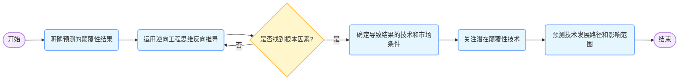

# 芒格的"逆向工程"思维在颠覆性技术预测中的应用

> 关键词：芒格、逆向工程思维、颠覆性技术预测、技术分析、创新思维

> 摘要：本文深入探讨了芒格的“逆向工程”思维在颠覆性技术预测中的应用。首先介绍了“逆向工程”思维和颠覆性技术预测的背景知识，阐述了两者的核心概念及联系。接着详细讲解了基于逆向工程思维进行颠覆性技术预测的核心算法原理、数学模型和公式，并结合Python代码进行说明。通过实际项目案例展示了该思维在技术预测中的具体操作流程和代码实现。分析了逆向工程思维在不同实际应用场景中的作用，推荐了相关的学习资源、开发工具和研究论文。最后总结了逆向工程思维在颠覆性技术预测领域的未来发展趋势与挑战，并对常见问题进行了解答。

## 1. 背景介绍 
### 1.1 目的和范围
在当今快速发展的科技时代，颠覆性技术的出现往往会打破现有的产业格局，给企业和社会带来巨大的影响。准确预测颠覆性技术的发展趋势，对于企业制定战略、政府规划政策以及科研机构确定研究方向都具有重要意义。本文章旨在探讨芒格的“逆向工程”思维在颠覆性技术预测中的应用，通过系统的分析和案例研究，为读者提供一种新的技术预测方法和思路。本文的范围涵盖了逆向工程思维的原理、在技术预测中的具体应用步骤、相关的数学模型和实际项目案例，以及未来的发展趋势和挑战。

### 1.2 预期读者
本文的预期读者包括科技行业的从业者，如企业的管理人员、技术专家、市场分析师等，他们可以从本文中获取新的技术预测方法，为企业的战略决策提供参考。同时，科研人员也可以通过本文了解逆向工程思维在技术研究中的应用，拓宽研究视野。此外，对科技发展趋势感兴趣的投资者和普通读者也能从本文中了解到颠覆性技术预测的相关知识和方法。

### 1.3 文档结构概述
本文将按照以下结构进行组织：首先介绍逆向工程思维和颠覆性技术预测的背景知识，包括目的、预期读者、文档结构概述和相关术语表。接着阐述逆向工程思维和颠覆性技术预测的核心概念及联系，通过文本示意图和Mermaid流程图进行展示。然后详细讲解基于逆向工程思维进行颠覆性技术预测的核心算法原理和具体操作步骤，结合Python代码进行说明。再介绍相关的数学模型和公式，并通过举例进行详细讲解。之后通过实际项目案例展示逆向工程思维在技术预测中的具体应用，包括开发环境搭建、源代码实现和代码解读。分析逆向工程思维在不同实际应用场景中的作用，推荐相关的学习资源、开发工具和研究论文。最后总结逆向工程思维在颠覆性技术预测领域的未来发展趋势与挑战，解答常见问题，并提供扩展阅读和参考资料。

### 1.4 术语表
#### 1.4.1 核心术语定义
- **逆向工程思维**：是指从目标或结果出发，反向推导实现该目标所需的条件和步骤的一种思维方式。在芒格的理念中，逆向工程思维强调通过考虑问题的反面，避免错误和陷阱，从而更好地实现目标。
- **颠覆性技术**：是指那些能够打破现有市场格局、创造新的市场需求、改变行业竞争规则的技术。颠覆性技术通常具有创新性、突破性和变革性的特点，能够对传统产业产生巨大的冲击。
- **颠覆性技术预测**：是指通过对各种技术发展趋势、市场需求、社会环境等因素的分析和研究，预测未来可能出现的颠覆性技术及其发展趋势的过程。

#### 1.4.2 相关概念解释
- **技术成熟度曲线**：是一种描述技术从诞生到成熟的发展过程的曲线。通常包括技术萌芽期、期望膨胀期、泡沫破裂谷底期、稳步爬升光明期和生产成熟期五个阶段。通过分析技术成熟度曲线，可以了解技术的发展阶段和趋势，为技术预测提供参考。
- **创新扩散理论**：是研究新技术如何在社会系统中传播和扩散的理论。该理论认为，新技术的扩散过程通常包括创新者、早期采用者、早期大众、晚期大众和落后者五个群体。了解创新扩散理论有助于预测新技术的市场接受程度和扩散速度。

#### 1.4.3 缩略词列表
- **AI**：Artificial Intelligence，人工智能
- **IoT**：Internet of Things，物联网
- **VR**：Virtual Reality，虚拟现实
- **AR**：Augmented Reality，增强现实

## 2. 核心概念与联系 

### 逆向工程思维原理
逆向工程思维的核心在于从最终目标或结果出发，反向思考实现该目标所需的条件和步骤。它与传统的正向思维方式不同，正向思维通常是从已知的条件出发，逐步推导得出结论；而逆向工程思维则是先明确目标，然后分析为了实现这个目标，需要满足哪些条件，这些条件又依赖于哪些更基础的条件，以此类推，直到找到最根本的因素。

例如，假设我们的目标是开发一款具有高市场竞争力的智能手机。使用逆向工程思维，我们首先会考虑这款手机在市场上取得成功需要具备哪些特点，如高性能、长续航、独特的外观设计、丰富的功能等。然后分析为了实现这些特点，需要采用哪些技术和零部件，如先进的处理器、大容量电池、优质的显示屏等。接着进一步思考这些技术和零部件的研发和生产需要哪些资源和条件，如研发团队的专业能力、生产设备的先进程度等。通过这样的反向推导，我们可以更全面地了解实现目标所需的各种因素，从而有针对性地进行规划和决策。

### 颠覆性技术预测原理
颠覆性技术预测是一个复杂的过程，需要综合考虑多种因素。其基本原理是通过对技术发展趋势、市场需求、社会环境等方面的分析，识别出那些具有潜在颠覆性的技术，并预测它们的发展路径和影响范围。

在技术发展趋势方面，需要关注新兴技术的研究进展、技术突破的可能性以及技术之间的融合趋势。例如，人工智能技术与物联网技术的融合可能会催生新的应用场景和商业模式，从而对传统产业产生颠覆性影响。在市场需求方面，要了解消费者的需求变化、市场的竞争格局以及行业的发展趋势。社会环境因素也不容忽视，如政策法规、文化观念、人口结构等都会对技术的发展和应用产生影响。

### 两者的联系
逆向工程思维为颠覆性技术预测提供了一种有效的方法和视角。在进行颠覆性技术预测时，我们可以运用逆向工程思维，从未来可能出现的颠覆性结果出发，反向推导导致这些结果的技术因素和市场条件。通过这种方式，我们可以更有针对性地关注那些具有潜在颠覆性的技术，并提前做好应对准备。

例如，如果我们预测未来交通领域可能会出现颠覆性的变革，如自动驾驶技术的广泛应用，我们可以运用逆向工程思维，分析为了实现自动驾驶技术的广泛应用，需要哪些技术条件，如高精度的传感器、强大的计算能力、先进的算法等；还需要哪些市场条件，如消费者的接受程度、相关政策的支持等。通过这样的分析，我们可以更深入地了解自动驾驶技术的发展趋势和面临的挑战，从而更好地进行技术预测和战略规划。

### 文本示意图
```plaintext
逆向工程思维
|
|-- 明确最终目标（如开发有竞争力的产品、预测颠覆性技术等）
|
|-- 反向推导实现目标所需条件
|   |
|   |-- 一级条件（如产品的特点、技术发展趋势）
|   |
|   |-- 二级条件（如技术和零部件、市场需求）
|   |
|   |--...
|
|-- 分析根本因素（如资源、人才等）

颠覆性技术预测
|
|-- 考虑技术发展趋势（新兴技术研究进展、技术融合等）
|
|-- 关注市场需求（消费者需求变化、竞争格局等）
|
|-- 考虑社会环境因素（政策法规、文化观念等）
|
|-- 识别潜在颠覆性技术并预测发展路径和影响范围

逆向工程思维与颠覆性技术预测的联系
|
|-- 从未来颠覆性结果出发，反向推导技术因素和市场条件
|
|-- 更有针对性地关注潜在颠覆性技术，提前做好应对准备
```

### Mermaid 流程图


## 3. 核心算法原理 & 具体操作步骤 

### 核心算法原理
基于逆向工程思维进行颠覆性技术预测的核心算法原理可以概括为以下几个步骤：

1. **定义目标状态**：明确我们要预测的颠覆性技术的最终状态或影响，例如某项技术在市场上的占有率达到一定比例、对某个行业的生产效率提升到某个水平等。
2. **反向推导条件**：从目标状态出发，反向分析为了实现该目标需要满足哪些条件。这些条件可以分为技术条件、市场条件、社会条件等多个方面。
3. **建立条件依赖关系**：分析各个条件之间的依赖关系，确定哪些条件是实现其他条件的前提，构建一个条件依赖图。
4. **评估条件可能性**：对每个条件的实现可能性进行评估，可以采用专家评估、数据分析等方法。
5. **预测技术发展路径**：根据条件依赖关系和条件实现可能性，预测技术的发展路径和时间节点。

### Python 代码实现

```python
# 定义条件类
class Condition:
    def __init__(self, name, probability=0.5):
        self.name = name
        self.probability = probability
        self.dependencies = []

    def add_dependency(self, dependency):
        self.dependencies.append(dependency)

    def can_be_met(self):
        # 检查所有依赖条件是否都能满足
        for dep in self.dependencies:
            if not dep.can_be_met():
                return False
        # 根据概率判断该条件是否能满足
        import random
        return random.random() < self.probability

# 定义技术预测类
class TechnologyPrediction:
    def __init__(self, goal_condition):
        self.goal_condition = goal_condition

    def predict_path(self):
        path = []
        stack = [self.goal_condition]
        visited = set()

        while stack:
            current = stack.pop()
            if current.name not in visited:
                visited.add(current.name)
                path.append(current.name)
                for dep in current.dependencies:
                    stack.append(dep)

        return path

# 示例：定义条件和依赖关系
condition1 = Condition("高精度传感器技术成熟", 0.6)
condition2 = Condition("强大的计算能力", 0.7)
condition3 = Condition("先进的算法", 0.8)
condition4 = Condition("消费者接受自动驾驶技术", 0.5)
condition5 = Condition("政策支持自动驾驶技术", 0.6)

goal_condition = Condition("自动驾驶技术广泛应用", 0.5)
goal_condition.add_dependency(condition1)
goal_condition.add_dependency(condition2)
goal_condition.add_dependency(condition3)
goal_condition.add_dependency(condition4)
goal_condition.add_dependency(condition5)

# 进行技术预测
prediction = TechnologyPrediction(goal_condition)
path = prediction.predict_path()
print("预测的技术发展路径:", path)
```

### 具体操作步骤

1. **步骤一：定义条件**
    - 首先，根据预测的目标，确定可能影响技术发展的各种条件。这些条件可以通过文献调研、专家访谈等方式获取。
    - 使用 `Condition` 类来表示每个条件，为每个条件设置一个名称和实现的概率。

2. **步骤二：建立依赖关系**
    - 分析各个条件之间的依赖关系，使用 `add_dependency` 方法为每个条件添加依赖条件。

3. **步骤三：创建技术预测对象**
    - 使用 `TechnologyPrediction` 类创建一个技术预测对象，将目标条件作为参数传入。

4. **步骤四：进行预测**
    - 调用 `predict_path` 方法进行技术发展路径的预测，该方法返回一个包含条件名称的列表，表示预测的技术发展路径。

## 4. 数学模型和公式 & 详细讲解 & 举例说明 

### 条件实现概率模型
在逆向工程思维的颠覆性技术预测中，我们需要对每个条件的实现概率进行评估。假设我们有 $n$ 个条件 $C_1, C_2, \cdots, C_n$，每个条件的实现概率分别为 $P(C_1), P(C_2), \cdots, P(C_n)$。

#### 独立条件情况
如果这些条件是相互独立的，即一个条件的实现与否不影响其他条件的实现，那么目标条件 $G$ 实现的概率 $P(G)$ 可以通过以下公式计算：

$$P(G) = \prod_{i=1}^{n} P(C_i)$$

例如，假设有三个独立条件 $C_1$、$C_2$ 和 $C_3$，它们的实现概率分别为 $P(C_1) = 0.6$，$P(C_2) = 0.7$，$P(C_3) = 0.8$，则目标条件 $G$ 实现的概率为：

$$P(G) = 0.6 \times 0.7 \times 0.8 = 0.336$$

#### 非独立条件情况
当条件之间存在依赖关系时，情况会更加复杂。假设条件 $C_j$ 依赖于条件 $C_i$，则 $C_j$ 实现的概率需要考虑 $C_i$ 是否实现。设 $P(C_j|C_i)$ 表示在条件 $C_i$ 实现的情况下条件 $C_j$ 实现的概率。

我们可以使用贝叶斯公式来计算条件的联合概率。例如，对于两个条件 $C_1$ 和 $C_2$，其中 $C_2$ 依赖于 $C_1$，则 $C_1$ 和 $C_2$ 都实现的概率为：

$$P(C_1 \cap C_2) = P(C_1) \times P(C_2|C_1)$$

### 技术发展时间预测模型
除了预测条件的实现概率，我们还可以对技术发展的时间进行预测。假设每个条件的实现时间服从某种概率分布，例如正态分布。设条件 $C_i$ 的期望实现时间为 $\mu_i$，标准差为 $\sigma_i$。

如果目标条件 $G$ 依赖于多个条件 $C_1, C_2, \cdots, C_n$，则目标条件 $G$ 的期望实现时间 $T_G$ 可以近似为：

$$T_G = \max_{i=1}^{n} \mu_i$$

这是因为目标条件的实现需要所有依赖条件都实现，所以它的实现时间取决于最后一个实现的依赖条件。

例如，假设有三个条件 $C_1$、$C_2$ 和 $C_3$，它们的期望实现时间分别为 $\mu_1 = 2$ 年，$\mu_2 = 3$ 年，$\mu_3 = 1$ 年，则目标条件 $G$ 的期望实现时间为：

$$T_G = \max(2, 3, 1) = 3 \text{ 年}$$

### 举例说明
假设我们要预测电动汽车在市场上占有率达到 50% 这一目标条件 $G$ 的实现情况。我们分析出三个依赖条件：
- $C_1$：电池技术取得重大突破，实现长续航和快速充电，实现概率 $P(C_1) = 0.7$，期望实现时间 $\mu_1 = 5$ 年。
- $C_2$：充电基础设施广泛普及，实现概率 $P(C_2) = 0.6$，期望实现时间 $\mu_2 = 6$ 年。
- $C_3$：消费者对电动汽车的接受度大幅提高，实现概率 $P(C_3) = 0.8$，期望实现时间 $\mu_3 = 4$ 年。

假设这些条件是相互独立的，则目标条件 $G$ 实现的概率为：

$$P(G) = P(C_1) \times P(C_2) \times P(C_3) = 0.7 \times 0.6 \times 0.8 = 0.336$$

目标条件 $G$ 的期望实现时间为：

$$T_G = \max(\mu_1, \mu_2, \mu_3) = \max(5, 6, 4) = 6 \text{ 年}$$

这意味着根据我们的分析，电动汽车在市场上占有率达到 50% 的概率为 33.6%，期望在 6 年后实现。

## 5. 项目实战：代码实际案例和详细解释说明 

### 5.1  开发环境搭建
为了实现基于逆向工程思维的颠覆性技术预测项目，我们需要搭建一个Python开发环境。以下是具体的搭建步骤：

#### 安装Python
首先，从Python官方网站（https://www.python.org/downloads/）下载并安装Python 3.x 版本。安装过程中请确保勾选“Add Python to PATH”选项，以便在命令行中可以直接使用Python命令。

#### 创建虚拟环境
为了避免不同项目之间的依赖冲突，建议使用虚拟环境。可以使用 `venv` 模块来创建虚拟环境。打开命令行，进入项目目录，执行以下命令：

```sh
python -m venv myenv
```

其中 `myenv` 是虚拟环境的名称，可以根据需要进行修改。

#### 激活虚拟环境
在Windows系统上，执行以下命令激活虚拟环境：

```sh
myenv\Scripts\activate
```

在Linux或Mac系统上，执行以下命令激活虚拟环境：

```sh
source myenv/bin/activate
```

#### 安装必要的库
在激活虚拟环境后，使用 `pip` 安装必要的库。在这个项目中，我们只使用Python的内置库，因此不需要额外安装其他库。

### 5.2  源代码详细实现和代码解读
以下是完整的Python代码实现：

```python
# 定义条件类
class Condition:
    def __init__(self, name, probability=0.5):
        """
        初始化条件对象
        :param name: 条件名称
        :param probability: 条件实现的概率，默认为0.5
        """
        self.name = name
        self.probability = probability
        self.dependencies = []

    def add_dependency(self, dependency):
        """
        添加条件的依赖关系
        :param dependency: 依赖的条件对象
        """
        self.dependencies.append(dependency)

    def can_be_met(self):
        """
        检查条件是否能满足
        :return: 如果条件能满足返回True，否则返回False
        """
        # 检查所有依赖条件是否都能满足
        for dep in self.dependencies:
            if not dep.can_be_met():
                return False
        # 根据概率判断该条件是否能满足
        import random
        return random.random() < self.probability

# 定义技术预测类
class TechnologyPrediction:
    def __init__(self, goal_condition):
        """
        初始化技术预测对象
        :param goal_condition: 目标条件对象
        """
        self.goal_condition = goal_condition

    def predict_path(self):
        """
        预测技术发展路径
        :return: 包含条件名称的列表，表示预测的技术发展路径
        """
        path = []
        stack = [self.goal_condition]
        visited = set()

        while stack:
            current = stack.pop()
            if current.name not in visited:
                visited.add(current.name)
                path.append(current.name)
                for dep in current.dependencies:
                    stack.append(dep)

        return path

# 示例：定义条件和依赖关系
condition1 = Condition("高精度传感器技术成熟", 0.6)
condition2 = Condition("强大的计算能力", 0.7)
condition3 = Condition("先进的算法", 0.8)
condition4 = Condition("消费者接受自动驾驶技术", 0.5)
condition5 = Condition("政策支持自动驾驶技术", 0.6)

goal_condition = Condition("自动驾驶技术广泛应用", 0.5)
goal_condition.add_dependency(condition1)
goal_condition.add_dependency(condition2)
goal_condition.add_dependency(condition3)
goal_condition.add_dependency(condition4)
goal_condition.add_dependency(condition5)

# 进行技术预测
prediction = TechnologyPrediction(goal_condition)
path = prediction.predict_path()
print("预测的技术发展路径:", path)
```

### 代码解读与分析
#### 条件类（Condition）
- `__init__` 方法：初始化条件对象，接收条件名称和实现概率作为参数。
- `add_dependency` 方法：用于添加条件的依赖关系，将依赖的条件对象添加到 `dependencies` 列表中。
- `can_be_met` 方法：检查条件是否能满足。首先递归检查所有依赖条件是否都能满足，如果有任何一个依赖条件不满足，则该条件也不满足。然后根据设定的概率，随机判断该条件是否能满足。

#### 技术预测类（TechnologyPrediction）
- `__init__` 方法：初始化技术预测对象，接收目标条件对象作为参数。
- `predict_path` 方法：使用栈和集合来实现深度优先搜索，遍历条件的依赖关系，生成预测的技术发展路径。

#### 示例部分
定义了几个条件和依赖关系，创建了目标条件对象，并使用 `TechnologyPrediction` 类进行技术预测。最后打印出预测的技术发展路径。

这个项目通过简单的代码实现了基于逆向工程思维的颠覆性技术预测的基本功能。在实际应用中，可以根据需要扩展代码，例如添加更多的条件属性、改进概率评估方法等。

## 6. 实际应用场景 
### 企业战略规划
企业在制定战略规划时，需要预测未来可能出现的颠覆性技术，以便提前做好准备，避免被市场淘汰。运用芒格的逆向工程思维，可以从企业的长期目标出发，反向推导为了实现这些目标需要哪些技术支持，从而识别出潜在的颠覆性技术。

例如，一家传统汽车制造企业的目标是在未来成为智能出行领域的领导者。通过逆向工程思维，企业可以分析为了实现这一目标，需要具备自动驾驶技术、车联网技术、新能源技术等。然后进一步研究这些技术的发展趋势和市场需求，制定相应的研发战略和合作计划。

### 风险投资决策
风险投资机构在选择投资项目时，需要评估项目的技术创新性和市场潜力。逆向工程思维可以帮助投资机构从项目的预期收益出发，反向分析实现这些收益需要哪些技术突破和市场条件。

例如，一家风险投资机构考虑投资一家人工智能初创企业。通过逆向工程思维，投资机构可以分析该企业的产品在市场上取得成功需要满足哪些条件，如算法的准确性、数据的质量、市场的接受程度等。然后评估企业在这些方面的能力和发展潜力，从而做出投资决策。

### 政府政策制定
政府在制定科技政策时，需要引导资源向具有潜力的颠覆性技术领域倾斜。逆向工程思维可以帮助政府从国家的战略目标出发，反向推导为了实现这些目标需要发展哪些技术，以及需要提供哪些政策支持。

例如，政府的目标是提高国家的能源效率和减少碳排放。通过逆向工程思维，政府可以分析为了实现这一目标，需要发展新能源技术、节能技术、智能电网技术等。然后制定相应的政策，如补贴研发、税收优惠、建设基础设施等，以促进这些技术的发展和应用。

### 科研机构研究方向确定
科研机构在确定研究方向时，需要关注具有潜在颠覆性的技术领域，以提高研究的创新性和影响力。逆向工程思维可以帮助科研机构从解决实际问题或满足社会需求出发，反向推导需要研究哪些技术。

例如，科研机构的目标是解决城市交通拥堵问题。通过逆向工程思维，科研机构可以分析为了实现这一目标，需要研究自动驾驶技术、智能交通管理系统、共享出行模式等。然后根据自身的研究实力和资源，选择合适的研究方向进行深入研究。

## 7. 工具和资源推荐
### 7.1 学习资源推荐
#### 7.1.1 书籍推荐
- 《穷查理宝典：查理·芒格的智慧箴言录》：这本书详细介绍了芒格的投资理念和思维方式，包括逆向工程思维，对于理解芒格的思想和应用逆向工程思维具有重要的参考价值。
- 《创新者的窘境》：该书探讨了颠覆性技术对企业的影响，以及企业如何应对颠覆性创新的挑战，为颠覆性技术预测和战略规划提供了理论基础。
- 《技术的本质：技术是什么，它是如何进化的》：从哲学和科学的角度深入探讨了技术的本质和发展规律，有助于读者更好地理解技术的发展趋势和颠覆性技术的产生机制。

#### 7.1.2 在线课程
- Coursera上的“Technological Innovation, Entrepreneurship, and Strategic Management”：该课程涵盖了技术创新、创业和战略管理等方面的内容，介绍了如何预测和应对颠覆性技术的方法和工具。
- edX上的“Artificial Intelligence: Implications for Business Strategy”：课程主要探讨了人工智能技术对企业战略的影响，以及如何在企业中应用人工智能技术进行创新和竞争，对于理解颠覆性技术在商业领域的应用具有重要意义。

#### 7.1.3 技术博客和网站
- TechCrunch：是一家知名的科技博客，提供最新的科技新闻、创业公司动态和技术趋势分析，有助于读者及时了解科技行业的最新发展。
- IEEE Spectrum：是电气和电子工程师协会（IEEE）的旗舰出版物，涵盖了各种技术领域的研究成果和发展趋势，对于专业技术人员和科研人员具有很高的参考价值。

### 7.2 开发工具框架推荐
#### 7.2.1 IDE和编辑器
- PyCharm：是一款专门为Python开发设计的集成开发环境（IDE），具有强大的代码编辑、调试、自动补全和版本控制等功能，适合开发基于Python的技术预测项目。
- Visual Studio Code：是一款轻量级的代码编辑器，支持多种编程语言和插件扩展，具有丰富的代码编辑和调试功能，也可以用于Python项目的开发。

#### 7.2.2 调试和性能分析工具
- PDB：是Python的内置调试器，可以帮助开发者在代码中设置断点、单步执行代码、查看变量值等，方便调试代码。
- cProfile：是Python的性能分析工具，可以分析代码的运行时间和函数调用次数，帮助开发者找出代码中的性能瓶颈。

#### 7.2.3 相关框架和库
- NumPy：是Python的一个基础科学计算库，提供了高效的多维数组对象和各种数学函数，可用于处理和分析大量的数据。
- Pandas：是Python的一个数据处理和分析库，提供了丰富的数据结构和数据操作方法，方便进行数据清洗、整理和分析。

### 7.3 相关论文著作推荐
#### 7.3.1 经典论文
- “Disruptive Technologies: Catching the Wave” by Clayton M. Christensen and Joseph L. Bower：这篇论文首次提出了颠覆性技术的概念，并分析了颠覆性技术对企业的影响和应对策略，是颠覆性技术研究领域的经典之作。
- “The Nature of Technology: What It Is and How It Evolves” by W. Brian Arthur：该论文从经济学和哲学的角度探讨了技术的本质和发展规律，为技术预测和创新研究提供了理论基础。

#### 7.3.2 最新研究成果
- 关注顶级学术期刊如Nature、Science、IEEE Transactions on various fields等上发表的关于新兴技术和颠覆性技术的研究论文，了解最新的研究动态和成果。
- 参加相关的学术会议，如ACM SIGKDD、NeurIPS等，获取最新的研究报告和学术交流机会。

#### 7.3.3 应用案例分析
- 一些知名企业的案例研究，如特斯拉在电动汽车领域的创新、苹果公司在智能手机领域的颠覆性变革等，可以通过分析这些案例，了解颠覆性技术在实际应用中的发展过程和成功经验。

## 8. 总结：未来发展趋势与挑战
### 未来发展趋势
#### 技术融合加速
未来，各种新兴技术如人工智能、物联网、区块链、量子计算等将加速融合，产生更多的颠覆性技术。逆向工程思维可以帮助我们从技术融合的结果出发，反向推导需要哪些技术条件和创新点，从而提前布局和研发。

#### 数据驱动的预测
随着大数据和机器学习技术的发展，基于数据驱动的颠覆性技术预测将变得更加准确和可靠。逆向工程思维可以与数据挖掘、机器学习算法相结合，通过分析大量的历史数据和实时数据，预测技术的发展趋势和潜在的颠覆性因素。

#### 跨学科合作加强
颠覆性技术的产生往往需要跨学科的知识和技能。未来，逆向工程思维将促进不同学科之间的合作和交流，整合各方资源，共同攻克技术难题，推动颠覆性技术的发展。

### 挑战
#### 数据质量和可用性
数据驱动的预测依赖于高质量和可用的数据。然而，在实际应用中，数据可能存在不完整、不准确、不一致等问题，影响预测的准确性。此外，一些关键数据可能受到隐私和安全的限制，难以获取和使用。

#### 技术复杂性和不确定性
新兴技术的发展速度快、变化大，技术的复杂性和不确定性增加了预测的难度。逆向工程思维虽然可以帮助我们从目标出发进行反向推导，但在面对复杂的技术系统和不确定的市场环境时，仍然难以准确预测技术的发展路径和影响范围。

#### 人类认知局限
人类的认知能力和思维方式存在一定的局限性，可能无法全面和准确地理解和预测颠覆性技术的发展。逆向工程思维虽然可以提供一种新的视角和方法，但仍然需要不断地学习和更新知识，突破认知局限。

## 9. 附录：常见问题与解答
### 问题1：逆向工程思维在颠覆性技术预测中的准确性如何？
逆向工程思维可以为颠覆性技术预测提供一种系统的方法和视角，但预测的准确性受到多种因素的影响，如数据质量、技术复杂性、市场不确定性等。在实际应用中，需要结合其他方法和工具，如数据分析、专家评估等，提高预测的准确性。

### 问题2：如何确定条件的实现概率？
确定条件的实现概率可以采用多种方法，如专家评估、数据分析、历史经验等。专家评估可以邀请相关领域的专家根据他们的知识和经验对条件的实现概率进行评估。数据分析可以通过分析历史数据和相关指标，建立概率模型进行预测。历史经验可以参考类似技术或项目的发展情况，推断条件的实现概率。

### 问题3：逆向工程思维是否适用于所有类型的技术预测？
逆向工程思维适用于大多数类型的技术预测，特别是对于那些具有明确目标和结果的技术预测。然而，对于一些新兴的、不确定性较高的技术领域，逆向工程思维可能需要与其他方法相结合，以应对技术的复杂性和不确定性。

### 问题4：如何在实际项目中应用逆向工程思维进行技术预测？
在实际项目中应用逆向工程思维进行技术预测，可以按照以下步骤进行：
1. 明确预测的目标和结果。
2. 反向推导实现目标所需的条件。
3. 分析条件之间的依赖关系。
4. 评估条件的实现概率和时间。
5. 根据分析结果，制定相应的战略和计划。

## 10. 扩展阅读 & 参考资料
### 扩展阅读
- 《黑天鹅：如何应对不可预知的未来》：探讨了不可预测的重大事件对社会和经济的影响，对于理解颠覆性技术的不确定性和应对策略具有启发意义。
- 《奇点临近》：提出了技术加速发展的观点，预测了未来技术的发展趋势和对人类社会的影响，为颠覆性技术预测提供了一种宏观的视角。

### 参考资料
- Christensen, C. M., & Bower, J. L. (1995). Disruptive Technologies: Catching the Wave. Harvard Business Review.
- Arthur, W. B. (2009). The Nature of Technology: What It Is and How It Evolves. Free Press.
- Graham, C. (2005). Poor Charlie's Almanack: The Wit and Wisdom of Charles T. Munger. Donning Company Publishers.

作者：AI天才研究院/AI Genius Institute & 禅与计算机程序设计艺术 /Zen And The Art of Computer Programming