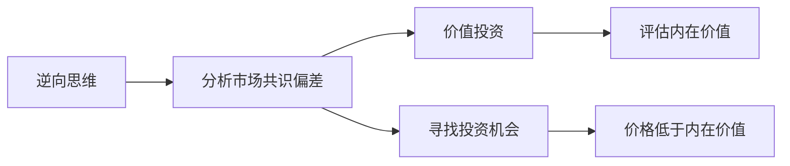

# 芒格的"逆向思维"：在市场共识中寻找投资机会

> 关键词：芒格、逆向思维、市场共识、投资机会、价值投资

> 摘要：本文深入探讨了芒格的逆向思维在投资领域的应用，即在市场共识中寻找投资机会。首先介绍了文章的背景，包括目的、预期读者、文档结构和相关术语。接着阐述了逆向思维、市场共识等核心概念及其联系，并通过示意图和流程图进行展示。详细讲解了逆向思维应用的核心算法原理和具体操作步骤，同时给出了相应的 Python 代码。还介绍了相关的数学模型和公式，并举例说明。通过项目实战，展示了逆向思维在实际投资中的应用，包括开发环境搭建、源代码实现和代码解读。分析了逆向思维在不同场景下的实际应用，推荐了学习逆向投资所需的工具和资源，包括书籍、在线课程、技术博客、开发工具、框架和相关论文。最后总结了逆向思维在投资领域的未来发展趋势与挑战，解答了常见问题，并提供了扩展阅读和参考资料，帮助读者全面理解和运用逆向思维进行投资。

## 1. 背景介绍 
### 1.1 目的和范围
在投资领域，市场共识往往反映了大多数投资者的观点和预期。然而，这种共识并不总是正确的，可能会导致资产价格偏离其内在价值。查理·芒格（Charlie Munger）所倡导的逆向思维为投资者提供了一种独特的视角，帮助他们在市场共识中发现被忽视或误判的投资机会。本文的目的在于深入剖析芒格的逆向思维，并探讨如何运用这种思维方式在市场共识中寻找有潜力的投资机会。文章将涵盖逆向思维的理论基础、核心算法原理、数学模型、实际应用案例以及相关工具和资源的推荐等方面。

### 1.2 预期读者
本文主要面向对投资领域感兴趣的读者，包括专业投资者、投资爱好者、金融从业者以及正在学习投资知识的学生。无论您是初涉投资领域，还是已经有一定投资经验，都可以从本文中获取关于逆向思维在投资中的应用的有价值信息。

### 1.3 文档结构概述
本文将按照以下结构展开：首先介绍相关背景知识，包括文章的目的、预期读者、文档结构和术语表。接着阐述逆向思维和市场共识的核心概念及其联系，并通过示意图和流程图进行直观展示。然后详细讲解逆向思维在投资中的核心算法原理和具体操作步骤，同时给出相应的 Python 代码实现。随后介绍相关的数学模型和公式，并通过具体例子进行说明。通过项目实战，展示逆向思维在实际投资中的应用，包括开发环境搭建、源代码实现和代码解读。分析逆向思维在不同场景下的实际应用，推荐学习逆向投资所需的工具和资源，包括书籍、在线课程、技术博客、开发工具、框架和相关论文。最后总结逆向思维在投资领域的未来发展趋势与挑战，解答常见问题，并提供扩展阅读和参考资料。

### 1.4 术语表
#### 1.4.1 核心术语定义
- **逆向思维**：与常规思维相反，不盲目跟随市场主流观点和趋势，而是独立思考，从相反的角度去分析和判断投资机会的思维方式。
- **市场共识**：指市场中大多数投资者对某一资产或市场趋势的普遍看法和预期。
- **价值投资**：一种投资策略，通过分析资产的内在价值，寻找价格低于其内在价值的投资标的，并长期持有。

#### 1.4.2 相关概念解释
- **羊群效应**：在投资市场中，投资者往往会受到群体行为的影响，跟随大多数人的决策，而忽视自己的独立判断。这种现象就像羊群跟随头羊行动一样，导致市场出现过度反应或错误定价。
- **安全边际**：指投资标的的市场价格与内在价值之间的差额。安全边际越大，投资的风险就越低。

#### 1.4.3 缩略词列表
- **PE**：市盈率（Price-to-Earnings Ratio），是指股票价格除以每股收益的比率，用于衡量股票的估值水平。
- **PB**：市净率（Price-to-Book Ratio），是指股票价格除以每股净资产的比率，用于衡量股票的账面价值与市场价格之间的关系。

## 2. 核心概念与联系 
### 核心概念原理
#### 逆向思维
逆向思维是芒格投资哲学的重要组成部分。它要求投资者不被市场的短期波动和主流观点所左右，而是冷静地分析市场情况，从相反的方向去思考问题。当市场上大多数投资者都看好某一资产时，逆向投资者会思考是否存在被忽视的风险；当市场普遍悲观时，逆向投资者则会寻找被低估的投资机会。例如，在市场恐慌性抛售时，逆向投资者可能会认为这是一个低价买入优质资产的好时机。

#### 市场共识
市场共识是市场参与者对某一资产或市场趋势的集体看法。它通常受到多种因素的影响，如宏观经济数据、行业动态、媒体报道等。市场共识在一定程度上反映了市场的预期，但由于投资者的情绪和信息不对称等因素，市场共识可能会出现偏差。例如，在牛市中，市场共识往往过于乐观，导致资产价格高估；而在熊市中，市场共识则可能过于悲观，使资产价格被低估。

#### 价值投资
价值投资是逆向思维在投资中的具体应用。价值投资者通过深入研究公司的基本面，评估其内在价值，并寻找价格低于内在价值的投资标的。逆向思维帮助价值投资者在市场共识与公司内在价值出现偏差时，发现投资机会。例如，当市场普遍对某一行业或公司持悲观态度时，价值投资者会通过逆向思维，深入分析公司的财务状况、竞争优势等因素，判断其是否被低估。

### 架构的文本示意图
```plaintext
            逆向思维
              |
              | 分析市场共识偏差
              |
       +----------------+
       |                |
  价值投资           寻找投资机会
       |                |
       | 评估内在价值    | 价格低于内在价值
       |                |
       +----------------+
```

### Mermaid 流程图


## 3. 核心算法原理 & 具体操作步骤 
### 核心算法原理
逆向思维在投资中的核心算法原理可以概括为以下几个步骤：
1. **收集市场信息**：通过各种渠道收集与投资标的相关的市场信息，包括宏观经济数据、行业动态、公司财务报表等。
2. **分析市场共识**：对收集到的信息进行分析，了解市场参与者对投资标的的普遍看法和预期，即市场共识。
3. **寻找偏差**：对比市场共识与投资标的的内在价值，寻找两者之间的偏差。如果市场共识过于乐观，而投资标的的内在价值被高估，那么可能存在卖出机会；反之，如果市场共识过于悲观，而投资标的的内在价值被低估，那么可能存在买入机会。
4. **评估风险**：在发现投资机会后，需要对投资风险进行评估。考虑各种可能影响投资标的价格的因素，如宏观经济环境变化、行业竞争加剧等。
5. **做出决策**：根据分析结果和风险评估，做出投资决策。如果认为投资机会具有足够的吸引力，且风险可控，那么可以考虑买入或卖出投资标的。

### 具体操作步骤
以下是运用逆向思维寻找投资机会的具体操作步骤：
1. **确定投资领域**：根据自己的兴趣和专业知识，选择一个或多个投资领域，如股票、债券、房地产等。
2. **筛选投资标的**：在选定的投资领域中，筛选出具有一定潜力的投资标的。可以根据一些基本的财务指标，如市盈率、市净率等，初步筛选出一些被低估的股票。
3. **深入研究**：对筛选出的投资标的进行深入研究，包括分析公司的财务报表、了解行业竞争格局、评估公司的管理层能力等。通过深入研究，评估投资标的的内在价值。
4. **分析市场共识**：关注市场上关于投资标的的主流观点和预期。可以通过阅读财经媒体报道、参加行业研讨会等方式，了解市场共识。
5. **寻找偏差**：对比投资标的的内在价值和市场共识，寻找两者之间的偏差。如果发现市场共识与内在价值存在较大偏差，那么可能存在投资机会。
6. **评估风险**：在发现投资机会后，需要对投资风险进行评估。考虑各种可能影响投资标的价格的因素，如宏观经济环境变化、行业竞争加剧等。可以运用一些风险评估模型，如夏普比率、波动率等，评估投资风险。
7. **做出决策**：根据分析结果和风险评估，做出投资决策。如果认为投资机会具有足够的吸引力，且风险可控，那么可以考虑买入或卖出投资标的。

### Python 代码实现
以下是一个简单的 Python 代码示例，用于演示如何运用逆向思维筛选被低估的股票：

```python
import pandas as pd

# 假设我们有一个包含股票信息的 DataFrame，其中包含股票代码、市盈率、市净率等信息
data = {
    'stock_code': ['000001', '000002', '000003', '000004'],
    'pe_ratio': [10, 20, 15, 5],
    'pb_ratio': [1.5, 2.5, 2, 0.8]
}

df = pd.DataFrame(data)

# 定义筛选条件，例如市盈率低于 12 且市净率低于 1.5
pe_threshold = 12
pb_threshold = 1.5

# 筛选出符合条件的股票
undervalued_stocks = df[(df['pe_ratio'] < pe_threshold) & (df['pb_ratio'] < pb_threshold)]

print("被低估的股票：")
print(undervalued_stocks)
```

在上述代码中，我们首先创建了一个包含股票信息的 DataFrame，然后定义了市盈率和市净率的筛选条件。最后，我们使用 Pandas 的条件筛选功能，筛选出符合条件的被低估的股票。

## 4. 数学模型和公式 & 详细讲解 & 举例说明 
### 内在价值评估模型
#### 股息贴现模型（Dividend Discount Model，DDM）
股息贴现模型是一种常用的评估股票内在价值的模型。该模型认为，股票的内在价值等于其未来股息的现值之和。其基本公式为：

$$V = \sum_{t=1}^{\infty} \frac{D_t}{(1 + r)^t}$$

其中，$V$ 表示股票的内在价值，$D_t$ 表示第 $t$ 期的股息，$r$ 表示贴现率。

#### 详细讲解
股息贴现模型的基本思想是，投资者购买股票的目的是为了获得未来的股息收入。因此，股票的价值应该等于其未来股息的现值之和。贴现率 $r$ 反映了投资者对投资风险的预期，风险越高，贴现率越高。

#### 举例说明
假设某公司每年的股息增长率为 $g$，当前股息为 $D_0$，贴现率为 $r$。如果股息增长率 $g$ 保持不变，那么可以使用简化的股息贴现模型——戈登增长模型（Gordon Growth Model）来计算股票的内在价值：

$$V = \frac{D_0(1 + g)}{r - g}$$

例如，某公司当前股息为 $D_0 = 2$ 元，股息增长率 $g = 5\%$，贴现率 $r = 10\%$。则该公司股票的内在价值为：

$$V = \frac{2(1 + 0.05)}{0.1 - 0.05} = \frac{2.1}{0.05} = 42$$（元）

### 风险评估模型
#### 夏普比率（Sharpe Ratio）
夏普比率是一种常用的评估投资组合风险调整后收益的指标。其公式为：

$$Sharpe Ratio = \frac{R_p - R_f}{\sigma_p}$$

其中，$R_p$ 表示投资组合的预期收益率，$R_f$ 表示无风险收益率，$\sigma_p$ 表示投资组合的收益率标准差。

#### 详细讲解
夏普比率衡量了投资组合每承担一单位风险所获得的超过无风险收益率的额外收益。夏普比率越高，说明投资组合的风险调整后收益越好。

#### 举例说明
假设某投资组合的预期收益率为 $R_p = 15\%$，无风险收益率为 $R_f = 3\%$，收益率标准差为 $\sigma_p = 20\%$。则该投资组合的夏普比率为：

$$Sharpe Ratio = \frac{0.15 - 0.03}{0.2} = \frac{0.12}{0.2} = 0.6$$

## 5. 项目实战：代码实际案例和详细解释说明 
### 5.1  开发环境搭建
#### 安装 Python
首先，需要安装 Python 编程语言。可以从 Python 官方网站（https://www.python.org/downloads/）下载适合自己操作系统的 Python 安装包，并按照安装向导进行安装。

#### 安装必要的库
在运用逆向思维进行投资分析时，需要使用一些 Python 库，如 Pandas、Numpy 等。可以使用以下命令来安装这些库：

```bash
pip install pandas numpy
```

### 5.2  源代码详细实现和代码解读
以下是一个更完整的 Python 代码示例，用于运用逆向思维筛选被低估的股票，并评估投资组合的风险：

```python
import pandas as pd
import numpy as np

# 假设我们有一个包含股票信息的 CSV 文件，文件名为 stocks.csv
# 文件包含股票代码、市盈率、市净率、股息率等信息
data = pd.read_csv('stocks.csv')

# 定义筛选条件
pe_threshold = 12
pb_threshold = 1.5
dividend_yield_threshold = 3

# 筛选出符合条件的股票
undervalued_stocks = data[(data['pe_ratio'] < pe_threshold) & 
                          (data['pb_ratio'] < pb_threshold) & 
                          (data['dividend_yield'] > dividend_yield_threshold)]

# 计算筛选出的股票的平均收益率和标准差
returns = undervalued_stocks['returns']
mean_return = np.mean(returns)
std_return = np.std(returns)

# 假设无风险收益率为 3%
risk_free_rate = 0.03

# 计算夏普比率
sharpe_ratio = (mean_return - risk_free_rate) / std_return

print("被低估的股票：")
print(undervalued_stocks)
print("平均收益率：", mean_return)
print("收益率标准差：", std_return)
print("夏普比率：", sharpe_ratio)
```

### 5.3  代码解读与分析
1. **数据读取**：使用 Pandas 的 `read_csv` 函数读取包含股票信息的 CSV 文件，并将数据存储在 DataFrame 中。
2. **筛选条件定义**：定义市盈率、市净率和股息率的筛选条件，用于筛选出被低估的股票。
3. **股票筛选**：使用 Pandas 的条件筛选功能，筛选出符合条件的被低估的股票。
4. **收益率计算**：从筛选出的股票数据中提取收益率数据，并计算平均收益率和收益率标准差。
5. **夏普比率计算**：假设无风险收益率为 3%，使用夏普比率公式计算投资组合的夏普比率。
6. **结果输出**：输出被低估的股票信息、平均收益率、收益率标准差和夏普比率。

通过上述代码，我们可以运用逆向思维筛选出被低估的股票，并评估投资组合的风险。

## 6. 实际应用场景 
### 股票投资
在股票投资中，逆向思维可以帮助投资者在市场恐慌或过度乐观时发现投资机会。例如，在熊市中，市场普遍悲观，大多数股票价格下跌。此时，逆向投资者可以通过深入研究，寻找那些基本面良好但被市场错杀的股票。相反，在牛市中，市场情绪高涨，股票价格普遍上涨。逆向投资者则需要保持冷静，避免盲目跟风，寻找那些可能被高估的股票并适时卖出。

### 债券投资
在债券投资中，逆向思维同样具有重要作用。当市场利率上升时，债券价格通常会下跌，市场情绪可能会变得悲观。逆向投资者可以分析利率上升的原因和趋势，如果认为利率上升是短期现象，那么可以在债券价格下跌时买入被低估的债券。反之，当市场利率下降时，债券价格上涨，逆向投资者需要警惕债券价格是否被高估，适时卖出债券。

### 房地产投资
在房地产投资中，逆向思维也可以帮助投资者发现投资机会。例如，当某个地区的房地产市场出现低迷，房价下跌，市场上大多数投资者持观望态度时，逆向投资者可以深入研究该地区的经济发展前景、人口增长趋势等因素。如果认为该地区的房地产市场具有长期投资价值，那么可以在房价低迷时买入房产。

## 7. 工具和资源推荐
### 7.1 学习资源推荐
#### 7.1.1 书籍推荐
- 《穷查理宝典：查理·芒格的智慧箴言录》：这本书收录了查理·芒格的演讲、文章和访谈，全面介绍了他的投资哲学和逆向思维方法。
- 《聪明的投资者》：本杰明·格雷厄姆的经典著作，阐述了价值投资的基本原理和方法，对逆向思维在投资中的应用具有重要指导意义。
- 《金融炼金术》：乔治·索罗斯的著作，介绍了他的反身性理论和逆向投资策略。

#### 7.1.2 在线课程
- Coursera 上的“投资学原理”课程：该课程由知名大学的教授授课，系统介绍了投资学的基本原理和方法，包括逆向投资策略。
- edX 上的“价值投资基础”课程：课程深入讲解了价值投资的核心概念和分析方法，对运用逆向思维进行投资具有很大帮助。

#### 7.1.3 技术博客和网站
- 雪球网：一个专业的投资交流平台，上面有很多投资者分享自己的投资经验和逆向思维案例。
- 价值投资论坛：专注于价值投资领域的讨论，提供了大量关于逆向投资的文章和观点。

### 7.2 开发工具框架推荐
#### 7.2.1 IDE和编辑器
- PyCharm：一款功能强大的 Python 集成开发环境，提供了代码编辑、调试、版本控制等功能，适合进行投资分析代码的开发。
- Jupyter Notebook：一个交互式的编程环境，支持 Python 等多种编程语言，方便进行数据探索和分析。

#### 7.2.2 调试和性能分析工具
- PDB：Python 自带的调试工具，可以帮助开发者定位代码中的问题。
- cProfile：Python 的性能分析工具，可以分析代码的运行时间和资源使用情况，帮助优化代码性能。

#### 7.2.3 相关框架和库
- Pandas：一个强大的数据分析库，提供了数据结构和数据分析工具，方便进行股票数据的处理和分析。
- Numpy：一个用于科学计算的 Python 库，提供了高效的数组操作和数学函数，可用于投资组合的风险评估和计算。

### 7.3 相关论文著作推荐
#### 7.3.1 经典论文
- 《有效市场假说》：由尤金·法玛（Eugene F. Fama）发表的经典论文，探讨了市场效率和股票价格的形成机制，对逆向投资理论具有重要影响。
- 《资本资产定价模型》：由威廉·夏普（William F. Sharpe）提出的经典论文，阐述了资产定价的基本原理，为投资组合的风险评估提供了理论基础。

#### 7.3.2 最新研究成果
- 近年来，一些学者对逆向投资策略进行了深入研究，探讨了逆向思维在不同市场环境下的有效性和应用方法。可以通过学术数据库，如知网、万方等，搜索相关的研究论文。

#### 7.3.3 应用案例分析
- 一些金融研究机构和投资公司会发布关于逆向投资策略的应用案例分析报告。可以关注这些报告，了解逆向思维在实际投资中的应用效果和经验教训。

## 8. 总结：未来发展趋势与挑战
### 未来发展趋势
- **数据驱动的逆向投资**：随着大数据和人工智能技术的发展，投资者可以获取更多的市场信息和数据。未来，逆向投资将更加依赖于数据驱动的分析方法，通过对海量数据的挖掘和分析，更准确地发现市场共识与内在价值之间的偏差。
- **跨市场和跨资产类别的逆向投资**：投资者将越来越关注跨市场和跨资产类别的投资机会。逆向思维可以帮助投资者在不同市场和资产类别之间寻找价值差异，实现资产的多元化配置。
- **社会责任投资与逆向思维的结合**：随着社会对环境保护、社会责任和公司治理（ESG）的关注度不断提高，逆向投资者可能会关注那些被市场忽视但具有良好 ESG 表现的公司，将社会责任投资与逆向思维相结合。

### 挑战
- **信息过载**：在信息爆炸的时代，投资者面临着大量的市场信息和数据。如何从海量信息中筛选出有价值的信息，并准确判断市场共识的偏差，是逆向投资者面临的一大挑战。
- **市场有效性的提高**：随着市场的发展和投资者的成熟，市场的有效性可能会不断提高。这意味着市场共识与内在价值之间的偏差可能会越来越小，逆向投资的机会可能会减少。
- **情绪管理**：逆向投资需要投资者具备强大的情绪管理能力。在市场情绪高涨或低迷时，投资者很容易受到情绪的影响，做出错误的决策。如何保持冷静和理性，是逆向投资者需要克服的另一个挑战。

## 9. 附录：常见问题与解答
### 逆向思维是否适用于所有市场环境？
逆向思维并不适用于所有市场环境。在某些情况下，市场共识可能是正确的，此时盲目逆向操作可能会导致损失。逆向思维更适用于市场出现过度反应或错误定价的情况，投资者需要根据具体的市场情况和投资标的进行分析和判断。

### 如何判断市场共识是否存在偏差？
判断市场共识是否存在偏差需要综合考虑多个因素。投资者可以通过深入研究投资标的的基本面，评估其内在价值，并与市场价格进行对比。同时，还可以关注市场情绪、宏观经济数据、行业动态等因素，分析市场共识的形成原因和合理性。此外，参考专业分析师的意见和研究报告也可以帮助投资者判断市场共识是否存在偏差。

### 逆向投资是否意味着与市场主流观点完全相反？
逆向投资并不意味着与市场主流观点完全相反。逆向投资的核心是独立思考，不盲目跟随市场趋势。在某些情况下，逆向投资者可能会认同市场的部分观点，但会从不同的角度去分析和判断投资机会。逆向投资强调的是在市场共识的基础上，寻找被忽视或误判的投资机会。

## 10. 扩展阅读 & 参考资料
### 扩展阅读
- 《巴菲特致股东的信：投资者和公司高管教程》：这本书收录了巴菲特历年致股东的信，深入阐述了他的投资理念和方法，对逆向思维在投资中的应用具有重要启示。
- 《投资最重要的事》：霍华德·马克斯的著作，强调了在投资中运用逆向思维和风险管理的重要性。

### 参考资料
- 《证券分析》：本杰明·格雷厄姆和戴维·多德的经典著作，是价值投资领域的奠基之作，为逆向投资提供了理论基础。
- 财经媒体报道，如《华尔街日报》、《金融时报》等，提供了丰富的市场信息和投资分析。

作者：AI天才研究院/AI Genius Institute & 禅与计算机程序设计艺术 /Zen And The Art of Computer Programming