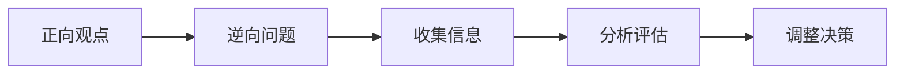

# 芒格的“逆向思考”在市场分析中的应用

> 关键词：芒格、逆向思考、市场分析、投资决策、风险评估

> 摘要：本文深入探讨了芒格的“逆向思考”方法在市场分析中的应用。从背景介绍入手，阐述了逆向思考的目的、适用读者以及文档结构。详细解析了逆向思考的核心概念与联系，包括其原理和架构。通过Python代码阐述了核心算法原理及具体操作步骤，同时给出了相关的数学模型和公式并举例说明。结合项目实战，展示了逆向思考在实际案例中的应用，包括开发环境搭建、源代码实现和代码解读。还探讨了逆向思考在市场分析中的实际应用场景，推荐了相关的学习资源、开发工具框架以及论文著作。最后总结了逆向思考的未来发展趋势与挑战，并提供了常见问题解答和扩展阅读参考资料，旨在帮助读者更好地运用逆向思考进行市场分析。

## 1. 背景介绍 
### 1.1 目的和范围
在市场分析领域，传统的思考方式往往局限于正向的逻辑推导和趋势预测。而芒格的“逆向思考”方法为我们提供了一个全新的视角。本文的目的在于深入研究逆向思考在市场分析中的具体应用，帮助投资者、分析师等相关人员拓宽思维方式，更全面、准确地评估市场情况，做出更明智的决策。

我们的研究范围涵盖了股票市场、期货市场、外汇市场等各类金融市场，以及一些非金融领域的市场，如消费品市场、房地产市场等。通过对不同市场的分析，展示逆向思考方法的通用性和有效性。

### 1.2 预期读者
本文预期读者主要包括以下几类人群：
- 投资者：无论是个人投资者还是机构投资者，都可以通过学习逆向思考方法，提高投资决策的质量，降低投资风险。
- 市场分析师：逆向思考可以为分析师提供新的分析思路和方法，帮助他们更深入地理解市场动态，提供更有价值的分析报告。
- 金融从业者：包括银行、证券、基金等金融机构的工作人员，逆向思考有助于他们更好地应对市场变化，制定合理的业务策略。
- 对市场分析和投资感兴趣的爱好者：通过阅读本文，他们可以了解到一种独特的思考方式，提升自己的市场分析能力。

### 1.3 文档结构概述
本文将按照以下结构进行组织：
- 核心概念与联系：介绍逆向思考的核心概念、原理和架构，并通过文本示意图和Mermaid流程图进行直观展示。
- 核心算法原理 & 具体操作步骤：运用Python代码详细阐述逆向思考在市场分析中的核心算法原理和具体操作步骤。
- 数学模型和公式 & 详细讲解 & 举例说明：给出逆向思考相关的数学模型和公式，并通过具体例子进行详细讲解。
- 项目实战：代码实际案例和详细解释说明：通过一个实际的市场分析项目，展示逆向思考的具体应用，包括开发环境搭建、源代码实现和代码解读。
- 实际应用场景：探讨逆向思考在不同市场分析场景中的应用。
- 工具和资源推荐：推荐相关的学习资源、开发工具框架以及论文著作。
- 总结：未来发展趋势与挑战：总结逆向思考在市场分析中的应用现状，展望其未来发展趋势，并分析可能面临的挑战。
- 附录：常见问题与解答：解答读者在学习和应用逆向思考过程中可能遇到的常见问题。
- 扩展阅读 & 参考资料：提供相关的扩展阅读材料和参考资料，方便读者进一步深入学习。

### 1.4 术语表
#### 1.4.1 核心术语定义
- 逆向思考：指从问题的相反方向进行思考，通过考虑可能导致失败、风险的因素，来更全面地评估事物的一种思考方式。
- 市场分析：对市场的供求关系、价格走势、竞争状况等进行研究和评估的过程。
- 投资决策：投资者根据市场分析等信息，决定是否进行投资以及如何投资的过程。
- 风险评估：对投资或其他活动中可能面临的风险进行识别、分析和评估的过程。

#### 1.4.2 相关概念解释
- 正向思考：与逆向思考相对，是按照常规的逻辑顺序，从已知条件出发，逐步推导得出结论的思考方式。
- 黑天鹅事件：指非常难以预测，且不寻常的事件，通常会引起市场的剧烈波动。逆向思考有助于我们更好地应对黑天鹅事件。

#### 1.4.3 缩略词列表
- ROI：Return on Investment，投资回报率
- P/E：Price-to-Earnings Ratio，市盈率

## 2. 核心概念与联系 

### 逆向思考的核心概念
逆向思考的核心在于打破常规的思维定式，不局限于正向的因果关系推导。在市场分析中，正向思考往往关注市场的上涨趋势、利好因素等，而逆向思考则着重考虑市场下跌的可能性、潜在的风险和危机。

例如，当市场上大多数人都看好某只股票时，逆向思考者会问：“这只股票可能会在什么情况下出现大幅下跌？”“有哪些隐藏的风险因素被大家忽略了？”通过这样的思考方式，可以更全面地评估股票的价值和投资风险。

### 逆向思考的原理
逆向思考的原理基于以下几点：
- 避免过度乐观：人类在认知过程中往往存在过度乐观的倾向，容易忽视潜在的风险。逆向思考可以帮助我们克服这种心理偏差，更客观地看待市场。
- 发现被忽视的信息：市场中存在大量的信息，但人们往往只关注那些符合自己预期的信息。逆向思考促使我们去挖掘那些被大多数人忽略的信息，从而发现新的投资机会或风险点。
- 提高决策的稳健性：通过考虑不利因素，我们可以提前做好应对准备，降低决策的风险，使投资决策更加稳健。

### 逆向思考的架构
逆向思考的架构可以分为以下几个步骤：
1. 确定正向观点：明确市场上大多数人所持有的观点或预期。
2. 提出逆向问题：针对正向观点，提出相反的问题，思考可能导致相反结果的因素。
3. 收集信息：围绕逆向问题，收集相关的信息，包括市场数据、行业动态、公司基本面等。
4. 分析评估：对收集到的信息进行分析和评估，判断逆向情况发生的可能性和影响程度。
5. 调整决策：根据分析评估的结果，对原有的投资决策进行调整或完善。

### 文本示意图
```plaintext
正向观点 --> 逆向问题 --> 收集信息 --> 分析评估 --> 调整决策
```

### Mermaid流程图


## 3. 核心算法原理 & 具体操作步骤 

### 核心算法原理
逆向思考在市场分析中的核心算法原理可以用以下步骤来概括：
1. 定义正向市场预期：根据市场上的主流观点和数据，确定当前市场对某个资产或市场的预期表现。
2. 构建逆向场景：从相反的方向出发，构建可能导致市场表现与正向预期相反的场景。
3. 评估逆向场景的可能性：通过分析各种因素，评估逆向场景发生的概率。
4. 计算逆向场景的影响：如果逆向场景发生，计算其对投资组合或市场的影响程度。
5. 综合决策：根据逆向场景的可能性和影响程度，综合考虑是否调整投资策略。

### 具体操作步骤及Python代码实现

以下是一个简单的Python示例，展示如何运用逆向思考进行股票市场分析：

```python
# 定义正向市场预期
# 假设市场上大多数人认为某只股票未来一年会上涨20%
positive_expectation = 0.2

# 构建逆向场景
# 逆向场景：该股票未来一年会下跌10%
reverse_scenario = -0.1

# 评估逆向场景的可能性
# 这里简单假设我们通过分析历史数据和市场趋势，认为逆向场景发生的概率为30%
probability = 0.3

# 计算逆向场景的影响
# 假设我们投资了10000元该股票
investment = 10000
impact = investment * reverse_scenario * probability

# 综合决策
# 如果逆向场景的影响超过我们可以承受的损失，考虑调整投资策略
tolerance = 500
if impact > tolerance:
    print("逆向场景影响超过容忍度，考虑调整投资策略")
else:
    print("逆向场景影响在容忍度范围内，可以维持原投资策略")
```

在上述代码中，我们首先定义了正向市场预期，然后构建了逆向场景。接着，评估了逆向场景发生的可能性，并计算了其对投资的影响。最后，根据影响程度和我们的容忍度，做出是否调整投资策略的决策。

## 4. 数学模型和公式 & 详细讲解 & 举例说明 

### 数学模型
逆向思考在市场分析中的数学模型可以基于期望收益和风险评估来构建。

设正向市场预期的收益率为 $R_p$，逆向场景的收益率为 $R_r$，逆向场景发生的概率为 $P_r$，投资金额为 $I$。

则逆向场景对投资的预期影响 $E$ 可以用以下公式表示：

$$E = I \times R_r \times P_r$$

### 详细讲解
- $R_p$：代表市场上大多数人对某个资产或市场的预期收益率，是正向思考的结果。
- $R_r$：是我们构建的逆向场景下的收益率，通常与正向预期相反。
- $P_r$：表示逆向场景发生的概率，需要通过对各种因素的分析和评估来确定。
- $I$：是我们的投资金额。

通过计算 $E$，我们可以量化逆向场景对投资的潜在影响，从而帮助我们做出更合理的决策。

### 举例说明
假设我们投资了50000元购买某只股票，市场上普遍预期该股票未来一年的收益率为15%，即 $R_p = 0.15$。

我们通过逆向思考，构建了一个逆向场景：如果公司的新产品研发失败，该股票可能会下跌20%，即 $R_r = -0.2$。

经过对公司研发情况、市场竞争等因素的分析，我们认为逆向场景发生的概率为25%，即 $P_r = 0.25$。

则逆向场景对我们投资的预期影响为：

$$E = 50000 \times (-0.2) \times 0.25 = -2500$$

这意味着，如果逆向场景发生，我们可能会损失2500元。如果我们的风险容忍度较低，就需要考虑调整投资策略，如减少持仓或增加其他风险对冲措施。

## 5. 项目实战：代码实际案例和详细解释说明 

### 5.1  开发环境搭建
为了进行逆向思考在市场分析中的项目实战，我们需要搭建以下开发环境：
- Python环境：建议使用Python 3.7及以上版本。可以从Python官方网站（https://www.python.org/downloads/）下载安装。
- 数据分析库：安装 `pandas`、`numpy` 等常用的数据分析库，用于数据处理和分析。可以使用以下命令进行安装：
```sh
pip install pandas numpy
```
- 数据获取库：如果需要从互联网获取市场数据，可以安装 `yfinance` 库。使用以下命令安装：
```sh
pip install yfinance
```

### 5.2  源代码详细实现和代码解读
以下是一个完整的Python代码示例，展示如何运用逆向思考进行股票市场分析的项目实战：

```python
import yfinance as yf
import pandas as pd
import numpy as np

# 定义股票代码和时间范围
ticker = 'AAPL'
start_date = '2020-01-01'
end_date = '2021-01-01'

# 获取股票数据
data = yf.download(ticker, start=start_date, end=end_date)

# 正向思考：计算股票的平均收益率
returns = data['Close'].pct_change()
average_return = returns.mean()

# 逆向思考：构建逆向场景
# 假设逆向场景是股票在某个月内跌幅超过10%
reverse_condition = returns < -0.1

# 评估逆向场景的可能性
reverse_probability = reverse_condition.sum() / len(returns)

# 计算逆向场景的影响
# 假设我们投资了10000元
investment = 10000
reverse_impact = investment * reverse_probability * -0.1

# 综合决策
# 假设我们的风险容忍度为500元
tolerance = 500
if reverse_impact > tolerance:
    print("逆向场景影响超过容忍度，考虑调整投资策略")
else:
    print("逆向场景影响在容忍度范围内，可以维持原投资策略")

# 可视化分析
import matplotlib.pyplot as plt

plt.figure(figsize=(12, 6))
plt.plot(returns, label='Daily Returns')
plt.axhline(y=-0.1, color='r', linestyle='--', label='Reverse Scenario Threshold')
plt.title(f'{ticker} Daily Returns')
plt.xlabel('Date')
plt.ylabel('Returns')
plt.legend()
plt.show()
```

### 代码解读与分析
1. **数据获取**：使用 `yfinance` 库从雅虎财经获取指定股票在指定时间范围内的历史数据。
2. **正向思考**：计算股票的平均收益率，这是市场分析中常见的正向思考方式。
3. **逆向思考**：构建逆向场景，即股票在某个月内跌幅超过10%。通过比较每日收益率和 -0.1 的大小，得到逆向场景发生的条件。
4. **评估逆向场景的可能性**：计算逆向场景发生的次数占总天数的比例，得到逆向场景发生的概率。
5. **计算逆向场景的影响**：根据投资金额、逆向场景发生的概率和逆向场景下的收益率，计算逆向场景对投资的影响。
6. **综合决策**：将逆向场景的影响与我们的风险容忍度进行比较，根据比较结果决定是否调整投资策略。
7. **可视化分析**：使用 `matplotlib` 库绘制股票的每日收益率曲线，并标注逆向场景的阈值，直观地展示逆向场景的发生情况。

## 6. 实际应用场景 
### 股票市场
在股票市场中，逆向思考可以帮助投资者避免盲目跟风。当市场上大多数人都看好某只热门股票时，逆向思考者会关注该股票可能存在的风险，如公司财务状况不佳、行业竞争加剧等。通过分析这些逆向因素，投资者可以更理性地评估股票的价值，避免在高位买入。

例如，在科技股泡沫时期，很多投资者盲目追捧科技股，而逆向思考者则关注到科技公司的高估值和盈利能力的不确定性，提前减持或避开了科技股，从而避免了巨大的损失。

### 期货市场
期货市场具有高风险性和杠杆性，逆向思考尤为重要。在期货交易中，投资者通常会根据市场趋势进行交易，但逆向思考者会考虑到市场反转的可能性。例如，当期货价格连续上涨时，逆向思考者会分析可能导致价格下跌的因素，如供应增加、需求减少等。他们会提前设置止损点，或者考虑进行反向交易，以降低风险。

### 外汇市场
外汇市场受到多种因素的影响，如经济数据、政治事件、货币政策等。逆向思考可以帮助投资者更好地应对市场的不确定性。当市场对某一货币的走势形成一致预期时，逆向思考者会寻找可能导致预期反转的因素。例如，如果市场普遍预期美元将升值，逆向思考者会关注美国经济数据的不利变化、其他国家货币政策的调整等因素，从而提前做好应对准备。

### 消费品市场
在消费品市场中，企业可以运用逆向思考来进行市场调研和产品开发。传统的市场调研往往关注消费者的需求和偏好，而逆向思考则可以从消费者不喜欢的产品特点、未被满足的需求等方面入手。例如，某家化妆品公司通过逆向思考发现，消费者对某些化妆品的刺激性和油腻感不满意，于是开发了一款温和、清爽的化妆品，获得了市场的认可。

## 7. 工具和资源推荐
### 7.1 学习资源推荐
#### 7.1.1 书籍推荐
- 《穷查理宝典：查理·芒格的智慧箴言录》：这是了解芒格思想的经典著作，书中详细介绍了芒格的投资理念、思维方式等内容，对学习逆向思考有很大的帮助。
- 《思考，快与慢》：作者丹尼尔·卡尼曼是诺贝尔经济学奖得主，书中介绍了人类思维的两种模式——快思考和慢思考，以及如何避免思维偏差，与逆向思考的理念密切相关。
- 《黑天鹅：如何应对不可预知的未来》：探讨了黑天鹅事件的特点和影响，逆向思考可以帮助我们更好地应对黑天鹅事件，这本书为我们提供了相关的理论和方法。

#### 7.1.2 在线课程
- Coursera上的“Behavioral Finance”（行为金融学）课程：该课程介绍了行为金融学的基本理论和方法，包括人类在投资决策中的思维偏差，对理解逆向思考在投资中的应用有很大的帮助。
- edX上的“Investment Management”（投资管理）课程：涵盖了投资分析、资产配置等方面的内容，通过学习该课程，可以更好地将逆向思考应用到实际的投资决策中。

#### 7.1.3 技术博客和网站
- Seeking Alpha：一个专业的金融投资网站，提供了大量的市场分析文章和投资观点，通过阅读不同的观点，可以培养逆向思考的能力。
- 雪球网：国内知名的投资交流平台，投资者可以在上面分享自己的投资经验和观点，与其他投资者进行互动，从中学习逆向思考的方法。

### 7.2 开发工具框架推荐
#### 7.2.1 IDE和编辑器
- PyCharm：一款功能强大的Python集成开发环境，提供了代码编辑、调试、版本控制等功能，适合进行Python代码的开发和调试。
- Jupyter Notebook：一种交互式的开发环境，支持代码、文本、图表等多种形式的展示，非常适合进行数据分析和可视化。

#### 7.2.2 调试和性能分析工具
- PDB：Python自带的调试工具，可以帮助我们逐行调试代码，找出代码中的问题。
- cProfile：Python的性能分析工具，可以分析代码的运行时间和函数调用情况，帮助我们优化代码性能。

#### 7.2.3 相关框架和库
- Pandas：用于数据处理和分析的Python库，提供了高效的数据结构和数据操作方法，在市场数据分析中非常常用。
- Numpy：Python的数值计算库，提供了高效的数组和矩阵运算功能，是很多数据分析和机器学习库的基础。
- Matplotlib：用于数据可视化的Python库，可以绘制各种类型的图表，如折线图、柱状图、散点图等，帮助我们直观地展示数据。

### 7.3 相关论文著作推荐
#### 7.3.1 经典论文
- “A Behavioral Model of Rational Choice”（理性选择的行为模型）：由赫伯特·西蒙（Herbert Simon）发表，提出了有限理性的概念，对理解人类在决策过程中的思维局限有重要意义，与逆向思考的理念相关。
- “The Capital Asset Pricing Model: Theory and Evidence”（资本资产定价模型：理论与证据）：该论文介绍了资本资产定价模型的理论和实证研究，对投资分析和决策有重要的指导作用，逆向思考可以帮助我们对该模型进行反思和改进。

#### 7.3.2 最新研究成果
- 关注顶级金融学术期刊，如《Journal of Finance》（金融期刊）、《Review of Financial Studies》（金融研究评论）等，这些期刊上发表的最新研究成果可以为我们提供关于市场分析和逆向思考的新视角和方法。

#### 7.3.3 应用案例分析
- 一些知名投资机构的研究报告和案例分析，如巴菲特的伯克希尔·哈撒韦公司的年报、桥水基金的研究报告等，这些报告中包含了很多实际的投资案例和逆向思考的应用经验，可以供我们学习和借鉴。

## 8. 总结：未来发展趋势与挑战
### 未来发展趋势
- 更广泛的应用：随着市场的不断发展和变化，逆向思考在市场分析中的应用将越来越广泛。不仅在金融市场，还将在其他领域，如科技、医疗、能源等，发挥重要作用。
- 与人工智能的结合：人工智能技术的发展为逆向思考提供了更强大的工具和方法。通过机器学习、深度学习等技术，可以更高效地收集和分析市场数据，发现潜在的逆向因素，提高逆向思考的准确性和效率。
- 跨学科融合：逆向思考将与心理学、社会学、经济学等多个学科进行更深入的融合。通过综合运用不同学科的知识和方法，可以更全面地理解市场行为和投资者心理，从而更好地应用逆向思考进行市场分析。

### 挑战
- 数据质量和获取难度：逆向思考需要大量的市场数据作为支持，但数据的质量和获取难度是一个挑战。市场数据可能存在噪声、偏差等问题，需要进行有效的清洗和处理。同时，一些关键数据可能难以获取，影响逆向思考的准确性。
- 思维惯性和心理障碍：人类的思维惯性和心理偏差是逆向思考的一大障碍。人们往往习惯于正向思考，难以跳出固有的思维模式。此外，恐惧、贪婪等心理因素也会影响逆向思考的应用，导致投资者在决策过程中出现失误。
- 市场不确定性：市场是复杂多变的，存在很多不确定性因素。即使运用逆向思考，也难以完全准确地预测市场的未来走势。逆向思考只能帮助我们降低风险，提高决策的稳健性，但不能保证绝对的成功。

## 9. 附录：常见问题与解答
### 问题1：逆向思考是否意味着总是与市场主流观点相反？
解答：不是的。逆向思考并不是简单地与市场主流观点相反，而是从相反的方向去思考问题，关注那些被大多数人忽略的因素。有时候，市场主流观点可能是正确的，但通过逆向思考可以更全面地评估市场情况，避免盲目跟风。

### 问题2：如何提高逆向思考的能力？
解答：可以通过以下几种方式提高逆向思考的能力：
- 学习相关知识：阅读有关逆向思考、行为金融学等方面的书籍和文章，了解逆向思考的原理和方法。
- 培养批判性思维：对市场上的各种观点和信息进行批判性思考，不轻易接受，多问几个为什么。
- 实践应用：在实际的市场分析和投资决策中，尝试运用逆向思考方法，不断总结经验教训。

### 问题3：逆向思考在市场分析中的效果如何评估？
解答：可以从以下几个方面评估逆向思考在市场分析中的效果：
- 投资回报率：比较运用逆向思考和不运用逆向思考时的投资回报率，评估逆向思考对投资收益的影响。
- 风险控制：观察逆向思考是否帮助我们降低了投资风险，如减少了亏损的幅度、避免了重大的投资失误等。
- 决策的合理性：评估逆向思考是否使我们的投资决策更加合理、全面，考虑到了更多的因素和可能性。

## 10. 扩展阅读 & 参考资料
### 扩展阅读
- 《金融炼金术》：乔治·索罗斯的著作，介绍了他的反身性理论和投资方法，与逆向思考有一定的关联。
- 《聪明的投资者》：本杰明·格雷厄姆的经典投资著作，强调了价值投资和逆向投资的理念。

### 参考资料
- 芒格在各种演讲和访谈中的讲话记录，这些资料可以帮助我们更深入地了解他的逆向思考思想。
- 相关的金融学术论文和研究报告，为我们提供了逆向思考在市场分析中的理论和实证依据。

作者：AI天才研究院/AI Genius Institute & 禅与计算机程序设计艺术 /Zen And The Art of Computer Programming