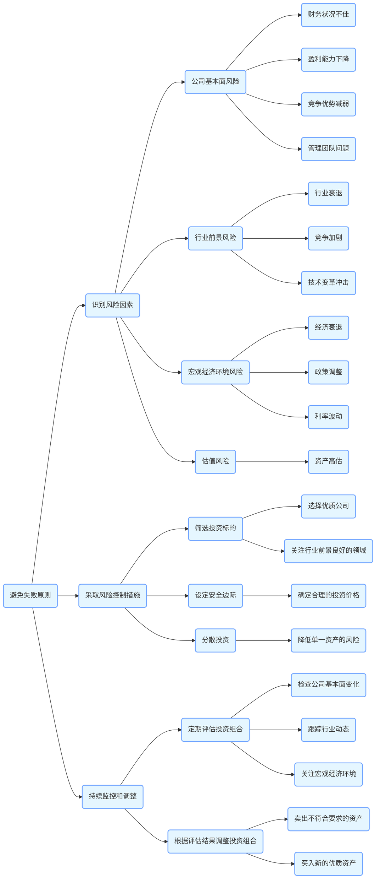

# 芒格的"避免失败"原则：投资成功的另一面

> 关键词：芒格、避免失败原则、投资成功、风险控制、决策思维

> 摘要：本文深入探讨了芒格的“避免失败”原则在投资领域的重要意义。从背景介绍入手，阐述该原则提出的目的、适用范围以及预期读者等内容。详细解析核心概念，包括原则的原理和架构，并通过Mermaid流程图清晰展示其逻辑关系。在核心算法原理部分，用Python代码进行模拟说明。同时给出相关数学模型和公式，结合实际例子帮助理解。通过项目实战案例，展示如何在实际投资中运用该原则。分析该原则在不同场景下的实际应用，推荐相关的学习资源、开发工具和论文著作。最后总结未来发展趋势与挑战，解答常见问题，并提供扩展阅读和参考资料，旨在帮助投资者从“避免失败”的角度探寻投资成功之道。

## 1. 背景介绍 
### 1.1 目的和范围
芒格的“避免失败”原则旨在为投资者提供一种独特的思维方式和决策框架，帮助他们在复杂多变的投资市场中减少失误，提高投资成功的概率。该原则的适用范围广泛，涵盖了股票、债券、基金、房地产等各类投资领域，无论是个人投资者还是专业投资机构，都能从中获得有益的启示。通过深入研究和应用这一原则，投资者可以更加理性地评估投资风险，做出更为明智的投资决策。

### 1.2 预期读者
本文的预期读者主要包括对投资感兴趣的个人投资者、金融行业从业者、投资研究人员以及希望提升投资决策能力的人士。无论您是投资新手，还是具有一定投资经验的专业人士，都能从本文中获得关于芒格“避免失败”原则的深入理解和实际应用方法，从而更好地指导自己的投资实践。

### 1.3 文档结构概述
本文将按照以下结构展开：首先介绍芒格“避免失败”原则的背景信息，包括目的、预期读者和文档结构概述等；接着深入解析核心概念，展示其原理和架构，并通过流程图呈现逻辑关系；然后详细讲解核心算法原理，用Python代码进行模拟；给出相关数学模型和公式，并结合实际例子进行说明；通过项目实战案例，展示该原则在实际投资中的应用过程；分析该原则在不同场景下的实际应用；推荐相关的学习资源、开发工具和论文著作；最后总结未来发展趋势与挑战，解答常见问题，并提供扩展阅读和参考资料。

### 1.4 术语表
#### 1.4.1 核心术语定义
- **避免失败原则**：指在投资决策过程中，将主要精力放在识别和避免可能导致投资失败的因素上，而不仅仅关注潜在的投资收益。通过减少失误和风险，提高投资的整体成功率。
- **投资风险**：指投资过程中可能遭受损失的可能性，包括市场风险、信用风险、流动性风险等多种类型。
- **安全边际**：是指投资价格低于其内在价值的程度，为投资者提供了一定的缓冲空间，以应对可能出现的不确定性和风险。

#### 1.4.2 相关概念解释
- **价值投资**：一种投资策略，强调通过分析公司的基本面，寻找被低估的股票或其他资产进行投资，以获取长期的投资回报。芒格的“避免失败”原则与价值投资理念密切相关，都是基于对资产内在价值的评估和对风险的控制。
- **能力圈**：指投资者所具备的专业知识、经验和技能能够有效覆盖的投资领域。在能力圈范围内进行投资，可以提高投资者对投资对象的理解和判断能力，降低投资风险。

#### 1.4.3 缩略词列表
- **PEG**：市盈率相对盈利增长比率（Price/Earnings to Growth Ratio），用于评估股票的估值是否合理，综合考虑了公司的市盈率和盈利增长率。
- **ROE**：净资产收益率（Return on Equity），反映了公司运用自有资本的效率，是衡量公司盈利能力的重要指标之一。

## 2. 核心概念与联系 

### 核心概念原理
芒格的“避免失败”原则基于这样一个基本理念：在投资中，避免重大损失比追求高额收益更为重要。因为一旦遭受重大损失，投资者需要花费更长的时间和更高的回报率才能恢复到原来的资产水平。该原则的核心在于通过深入的研究和分析，识别出可能导致投资失败的各种因素，并采取相应的措施加以避免。

具体来说，投资者需要关注以下几个方面：
1. **公司基本面**：包括公司的财务状况、盈利能力、竞争优势、管理团队等。通过对这些方面的分析，评估公司的内在价值和可持续发展能力。
2. **行业前景**：了解行业的发展趋势、市场规模、竞争格局等，判断公司所处的行业环境是否有利。
3. **宏观经济环境**：关注宏观经济指标、政策变化等因素，分析其对投资的影响。
4. **估值合理性**：确保投资价格具有足够的安全边际，避免买入高估的资产。

### 架构的文本示意图
```plaintext
避免失败原则
|-- 识别风险因素
|   |-- 公司基本面风险
|   |   |-- 财务状况不佳
|   |   |-- 盈利能力下降
|   |   |-- 竞争优势减弱
|   |   |-- 管理团队问题
|   |-- 行业前景风险
|   |   |-- 行业衰退
|   |   |-- 竞争加剧
|   |   |-- 技术变革冲击
|   |-- 宏观经济环境风险
|   |   |-- 经济衰退
|   |   |-- 政策调整
|   |   |-- 利率波动
|   |-- 估值风险
|   |   |-- 资产高估
|-- 采取风险控制措施
|   |-- 筛选投资标的
|   |   |-- 选择优质公司
|   |   |-- 关注行业前景良好的领域
|   |-- 设定安全边际
|   |   |-- 确定合理的投资价格
|   |-- 分散投资
|   |   |-- 降低单一资产的风险
|-- 持续监控和调整
|   |-- 定期评估投资组合
|   |   |-- 检查公司基本面变化
|   |   |-- 跟踪行业动态
|   |   |-- 关注宏观经济环境
|   |-- 根据评估结果调整投资组合
|   |   |-- 卖出不符合要求的资产
|   |   |-- 买入新的优质资产
```

### Mermaid流程图


## 3. 核心算法原理 & 具体操作步骤 

### 核心算法原理
在投资中运用芒格的“避免失败”原则，可以通过构建一个简单的风险评估模型来实现。该模型的核心思想是根据不同风险因素的权重，对投资标的进行综合评分，从而筛选出风险较低的投资对象。

以下是一个简化的风险评估模型的Python代码示例：

```python
# 定义风险因素及其权重
risk_factors = {
    "财务状况": 0.3,
    "盈利能力": 0.2,
    "行业前景": 0.2,
    "估值合理性": 0.2,
    "管理团队": 0.1
}

# 定义每个风险因素的评分函数
def evaluate_financial_status(company):
    # 这里简单假设根据财务指标计算评分，实际应用中需要更复杂的分析
    financial_ratio = company["财务指标"]
    if financial_ratio > 0.8:
        return 8
    elif financial_ratio > 0.6:
        return 6
    elif financial_ratio > 0.4:
        return 4
    else:
        return 2

def evaluate_profitability(company):
    roe = company["净资产收益率"]
    if roe > 0.2:
        return 8
    elif roe > 0.15:
        return 6
    elif roe > 0.1:
        return 4
    else:
        return 2

def evaluate_industry_outlook(industry):
    growth_rate = industry["行业增长率"]
    if growth_rate > 0.1:
        return 8
    elif growth_rate > 0.05:
        return 6
    elif growth_rate > 0.02:
        return 4
    else:
        return 2

def evaluate_valuation(company):
    peg = company["PEG比率"]
    if peg < 1:
        return 8
    elif peg < 1.5:
        return 6
    elif peg < 2:
        return 4
    else:
        return 2

def evaluate_management_team(company):
    # 这里简单假设根据管理团队的经验和声誉评分
    management_score = company["管理团队评分"]
    if management_score > 8:
        return 8
    elif management_score > 6:
        return 6
    elif management_score > 4:
        return 4
    else:
        return 2

# 定义综合评分函数
def calculate_risk_score(company, industry):
    financial_score = evaluate_financial_status(company)
    profitability_score = evaluate_profitability(company)
    industry_score = evaluate_industry_outlook(industry)
    valuation_score = evaluate_valuation(company)
    management_score = evaluate_management_team(company)

    total_score = (
        financial_score * risk_factors["财务状况"] +
        profitability_score * risk_factors["盈利能力"] +
        industry_score * risk_factors["行业前景"] +
        valuation_score * risk_factors["估值合理性"] +
        management_score * risk_factors["管理团队"]
    )

    return total_score

# 示例公司和行业数据
company = {
    "财务指标": 0.7,
    "净资产收益率": 0.18,
    "PEG比率": 1.2,
    "管理团队评分": 7
}

industry = {
    "行业增长率": 0.08
}

# 计算风险评分
risk_score = calculate_risk_score(company, industry)
print(f"该公司的风险评分为: {risk_score}")
```

### 具体操作步骤
1. **收集数据**：收集投资标的的相关数据，包括公司的财务报表、行业研究报告、宏观经济数据等。
2. **定义风险因素和权重**：根据投资目标和风险偏好，确定影响投资决策的主要风险因素，并为每个因素分配相应的权重。
3. **构建评分函数**：针对每个风险因素，构建相应的评分函数，将数据转化为具体的评分。
4. **计算综合评分**：根据各风险因素的评分和权重，计算投资标的的综合风险评分。
5. **筛选投资标的**：根据综合评分，筛选出风险较低的投资标的，进行进一步的分析和研究。
6. **持续监控和调整**：定期对投资组合进行评估，根据市场变化和公司基本面的变化，及时调整投资组合。

## 4. 数学模型和公式 & 详细讲解 & 举例说明 

### 数学模型和公式
在上述风险评估模型中，我们使用了加权平均的方法来计算综合风险评分。具体公式如下：

$$S = \sum_{i=1}^{n} w_i \times s_i$$

其中，$S$ 表示综合风险评分，$w_i$ 表示第 $i$ 个风险因素的权重，$s_i$ 表示第 $i$ 个风险因素的评分，$n$ 表示风险因素的数量。

### 详细讲解
该公式的核心思想是将各个风险因素的评分按照其权重进行加权求和，得到一个综合的风险评分。权重的设置反映了每个风险因素在投资决策中的重要程度，评分则是对每个风险因素的量化评估。通过这种方式，我们可以将多个风险因素综合考虑，从而更全面地评估投资标的的风险水平。

### 举例说明
假设我们有三个风险因素：财务状况、盈利能力和行业前景，它们的权重分别为 $0.3$、$0.2$ 和 $0.5$。某公司在这三个风险因素上的评分分别为 $7$、$6$ 和 $8$。则该公司的综合风险评分计算如下：

$$S = 0.3 \times 7 + 0.2 \times 6 + 0.5 \times 8$$
$$S = 2.1 + 1.2 + 4$$
$$S = 7.3$$

根据这个综合评分，我们可以对该公司的投资风险有一个相对客观的认识，并与其他公司进行比较，从而做出更明智的投资决策。

## 5. 项目实战：代码实际案例和详细解释说明 

### 5.1  开发环境搭建
为了运行上述风险评估模型的Python代码，我们需要搭建以下开发环境：
1. **Python环境**：建议使用Python 3.7及以上版本。可以从Python官方网站（https://www.python.org/downloads/）下载并安装。
2. **代码编辑器**：推荐使用Visual Studio Code、PyCharm等专业的Python代码编辑器。这些编辑器提供了丰富的功能，如代码高亮、自动补全、调试等，能够提高开发效率。
3. **必要的库**：上述代码中没有使用第三方库，但在实际应用中，可能需要使用`pandas`、`numpy`等库来处理和分析数据。可以使用以下命令安装这些库：
```sh
pip install pandas numpy
```

### 5.2  源代码详细实现和代码解读
以下是对上述风险评估模型代码的详细解读：

```python
# 定义风险因素及其权重
risk_factors = {
    "财务状况": 0.3,
    "盈利能力": 0.2,
    "行业前景": 0.2,
    "估值合理性": 0.2,
    "管理团队": 0.1
}
```
这部分代码定义了影响投资决策的主要风险因素及其对应的权重。权重的设置可以根据投资者的经验和偏好进行调整。

```python
# 定义每个风险因素的评分函数
def evaluate_financial_status(company):
    # 这里简单假设根据财务指标计算评分，实际应用中需要更复杂的分析
    financial_ratio = company["财务指标"]
    if financial_ratio > 0.8:
        return 8
    elif financial_ratio > 0.6:
        return 6
    elif financial_ratio > 0.4:
        return 4
    else:
        return 2

def evaluate_profitability(company):
    roe = company["净资产收益率"]
    if roe > 0.2:
        return 8
    elif roe > 0.15:
        return 6
    elif roe > 0.1:
        return 4
    else:
        return 2

def evaluate_industry_outlook(industry):
    growth_rate = industry["行业增长率"]
    if growth_rate > 0.1:
        return 8
    elif growth_rate > 0.05:
        return 6
    elif growth_rate > 0.02:
        return 4
    else:
        return 2

def evaluate_valuation(company):
    peg = company["PEG比率"]
    if peg < 1:
        return 8
    elif peg < 1.5:
        return 6
    elif peg < 2:
        return 4
    else:
        return 2

def evaluate_management_team(company):
    # 这里简单假设根据管理团队的经验和声誉评分
    management_score = company["管理团队评分"]
    if management_score > 8:
        return 8
    elif management_score > 6:
        return 6
    elif management_score > 4:
        return 4
    else:
        return 2
```
这部分代码定义了每个风险因素的评分函数。每个函数根据相应的指标值，将风险因素划分为不同的等级，并给予相应的评分。

```python
# 定义综合评分函数
def calculate_risk_score(company, industry):
    financial_score = evaluate_financial_status(company)
    profitability_score = evaluate_profitability(company)
    industry_score = evaluate_industry_outlook(industry)
    valuation_score = evaluate_valuation(company)
    management_score = evaluate_management_team(company)

    total_score = (
        financial_score * risk_factors["财务状况"] +
        profitability_score * risk_factors["盈利能力"] +
        industry_score * risk_factors["行业前景"] +
        valuation_score * risk_factors["估值合理性"] +
        management_score * risk_factors["管理团队"]
    )

    return total_score
```
这个函数用于计算投资标的的综合风险评分。它调用了各个风险因素的评分函数，获取每个因素的评分，并根据权重进行加权求和。

```python
# 示例公司和行业数据
company = {
    "财务指标": 0.7,
    "净资产收益率": 0.18,
    "PEG比率": 1.2,
    "管理团队评分": 7
}

industry = {
    "行业增长率": 0.08
}

# 计算风险评分
risk_score = calculate_risk_score(company, industry)
print(f"该公司的风险评分为: {risk_score}")
```
这部分代码提供了示例公司和行业数据，并调用`calculate_risk_score`函数计算该公司的风险评分，最后将结果打印输出。

### 5.3  代码解读与分析
通过上述代码，我们可以看到如何运用Python实现一个简单的风险评估模型。该模型通过对多个风险因素进行量化评估，并综合考虑各因素的权重，得到一个综合的风险评分。这个评分可以帮助投资者快速筛选出风险较低的投资标的，从而减少投资失败的可能性。

需要注意的是，上述代码只是一个简化的示例，实际应用中需要根据具体情况进行调整和完善。例如，评分函数的设计可以更加复杂，考虑更多的指标和因素；数据的收集和处理也需要更加严谨，确保数据的准确性和可靠性。

## 6. 实际应用场景 
芒格的“避免失败”原则在投资领域有广泛的实际应用场景，以下是一些常见的例子：

### 股票投资
在股票投资中，投资者可以运用该原则筛选优质股票。首先，通过分析公司的财务报表、盈利能力、行业前景等因素，识别出可能存在的风险。对于财务状况不佳、盈利能力下降或所处行业前景黯淡的公司，应谨慎投资或避免投资。其次，关注股票的估值合理性，确保买入价格具有足够的安全边际。最后，定期对投资组合进行评估，根据公司基本面的变化和市场情况，及时调整投资组合。

### 基金投资
在选择基金时，投资者可以考虑基金的投资策略、历史业绩、基金经理的能力等因素。遵循“避免失败”原则，应避免选择投资策略过于激进、业绩波动过大或基金经理经验不足的基金。同时，关注基金的费用率，选择费用较低的基金，以提高投资回报。

### 房地产投资
在房地产投资中，投资者需要考虑房产的地理位置、市场需求、租金回报率等因素。避免投资位于偏远地区、市场需求不足或租金回报率过低的房产。此外，还需要关注房地产市场的宏观经济环境和政策变化，及时调整投资策略。

### 企业并购
在企业并购过程中，收购方需要对目标企业进行全面的尽职调查，识别潜在的风险。包括目标企业的财务状况、法律纠纷、市场竞争力等方面。遵循“避免失败”原则，收购方应谨慎对待存在重大风险的目标企业，避免因并购而带来不必要的损失。

## 7. 工具和资源推荐
### 7.1 学习资源推荐
#### 7.1.1 书籍推荐
- 《穷查理宝典：查理·芒格的智慧箴言录》：这本书收录了芒格的演讲、文章和访谈等内容，全面展示了他的投资理念、思维方式和人生智慧，是学习芒格“避免失败”原则的必读之书。
- 《聪明的投资者》：本杰明·格雷厄姆的经典著作，阐述了价值投资的基本原理和方法，与芒格的投资理念一脉相承，对投资者具有重要的指导意义。
- 《巴菲特致股东的信：投资者和公司高管教程》：通过阅读巴菲特历年致股东的信，读者可以深入了解巴菲特和芒格的投资哲学、决策过程和对市场的看法。

#### 7.1.2 在线课程
- Coursera上的“投资学原理”课程：由知名大学的教授授课，系统介绍了投资学的基本理论和方法，包括资产定价、投资组合管理等内容，有助于投资者建立扎实的投资知识基础。
- 网易云课堂上的“价值投资实战课程”：结合实际案例，深入讲解价值投资的理念和方法，帮助投资者掌握如何运用芒格的“避免失败”原则进行投资决策。

#### 7.1.3 技术博客和网站
- 雪球网：国内知名的投资社区，汇聚了众多投资者和投资专家。在雪球网上，投资者可以分享投资经验、交流投资心得，获取最新的市场信息和研究报告。
- 东方财富网：提供丰富的金融资讯、行情数据和分析工具，投资者可以通过该网站了解宏观经济形势、行业动态和公司基本面信息。

### 7.2 开发工具框架推荐
#### 7.2.1 IDE和编辑器
- Visual Studio Code：一款轻量级的代码编辑器，支持多种编程语言和插件扩展。它具有丰富的功能，如代码高亮、自动补全、调试等，适合Python开发。
- PyCharm：专业的Python集成开发环境，提供了强大的代码编辑、调试和项目管理功能。它具有智能代码提示、代码分析和重构等特性，能够提高开发效率。

#### 7.2.2 调试和性能分析工具
- PDB：Python自带的调试器，可以帮助开发者逐行调试代码，查找和解决问题。
- cProfile：Python标准库中的性能分析工具，用于分析代码的执行时间和函数调用次数，帮助开发者优化代码性能。

#### 7.2.3 相关框架和库
- Pandas：用于数据处理和分析的Python库，提供了高效的数据结构和数据操作方法，方便投资者处理和分析财务数据和市场数据。
- Numpy：Python的数值计算库，提供了多维数组对象和各种数学函数，用于进行数值计算和科学计算。

### 7.3 相关论文著作推荐
#### 7.3.1 经典论文
- 《证券分析》（Security Analysis）：本杰明·格雷厄姆和大卫·多德的经典论文，奠定了价值投资的理论基础，对芒格的投资理念产生了深远影响。
- 《有效市场假说》（Efficient Markets Hypothesis）：由尤金·法玛提出，探讨了市场效率和股票价格的形成机制，对于理解投资市场的运行规律具有重要意义。

#### 7.3.2 最新研究成果
- 可以关注顶级金融学术期刊，如《金融杂志》（Journal of Finance）、《金融经济学杂志》（Journal of Financial Economics）等，获取关于投资理论和实践的最新研究成果。
- 一些知名的金融研究机构，如沃顿商学院金融研究中心、麻省理工学院斯隆管理学院金融研究中心等，也会发布相关的研究报告和论文。

#### 7.3.3 应用案例分析
- 可以参考一些投资案例分析的书籍和文章，了解如何运用芒格的“避免失败”原则进行实际投资决策。例如，《巴菲特投资案例集》详细分析了巴菲特的投资案例，展示了他如何在实践中运用价值投资和风险控制的理念。

## 8. 总结：未来发展趋势与挑战
### 未来发展趋势
随着金融科技的不断发展和市场环境的变化，芒格的“避免失败”原则在未来可能会呈现以下发展趋势：
1. **智能化应用**：借助人工智能和机器学习技术，实现风险评估和投资决策的智能化。通过对大量数据的分析和挖掘，更准确地识别投资风险，提高投资决策的效率和准确性。
2. **多元化投资**：投资者将更加注重多元化投资，通过投资不同类型的资产和市场，降低单一资产的风险。同时，跨领域、跨行业的投资机会将受到更多关注。
3. **社会责任投资**：越来越多的投资者将关注企业的社会责任和可持续发展能力，将环境、社会和治理（ESG）因素纳入投资决策的考量范围。遵循“避免失败”原则，投资者将更倾向于投资那些具有良好社会形象和可持续发展前景的企业。

### 挑战
在应用芒格的“避免失败”原则时，投资者也面临着一些挑战：
1. **数据质量和可靠性**：风险评估和投资决策依赖于大量的数据，数据的质量和可靠性直接影响决策的准确性。然而，数据的获取、清洗和分析过程中可能存在误差和偏差，需要投资者具备较强的数据处理能力和判断力。
2. **市场不确定性**：投资市场充满了不确定性，宏观经济环境、政策变化、突发事件等因素都可能对投资产生影响。即使遵循“避免失败”原则，也难以完全避免投资损失。投资者需要具备应对不确定性的能力，及时调整投资策略。
3. **心理因素影响**：投资决策不仅受到客观因素的影响，还受到投资者心理因素的影响。贪婪、恐惧、从众心理等都可能导致投资者做出错误的决策。投资者需要保持理性和冷静，克服心理因素的干扰。

## 9. 附录：常见问题与解答
### 问题1：“避免失败”原则是否意味着不承担任何风险？
解答：“避免失败”原则并不意味着不承担任何风险。投资本身就存在一定的风险，该原则强调的是通过深入的研究和分析，识别和避免可能导致重大损失的风险。在合理控制风险的前提下，投资者可以适当承担一定的风险，以获取相应的投资回报。

### 问题2：如何确定风险因素的权重？
解答：风险因素的权重可以根据投资者的投资目标、风险偏好和经验来确定。一般来说，对于投资者认为重要的风险因素，可以赋予较高的权重；对于相对次要的风险因素，可以赋予较低的权重。同时，权重也可以根据市场情况和投资环境的变化进行调整。

### 问题3：该原则是否适用于所有类型的投资？
解答：芒格的“避免失败”原则适用于大多数类型的投资，包括股票、债券、基金、房地产等。无论投资何种资产，投资者都需要关注风险控制，避免因盲目投资而遭受重大损失。然而，不同类型的投资具有不同的特点和风险特征，投资者在应用该原则时需要根据具体情况进行调整和优化。

### 问题4：如何持续监控投资组合？
解答：持续监控投资组合需要定期收集和分析相关数据，包括公司的财务报表、行业动态、宏观经济数据等。同时，关注市场变化和公司基本面的变化，及时发现潜在的风险和机会。根据监控结果，投资者可以对投资组合进行调整，卖出不符合要求的资产，买入新的优质资产。

## 10. 扩展阅读 & 参考资料
### 扩展阅读
- 《投资最重要的事》：霍华德·马克斯的著作，深入探讨了投资中的风险控制、逆向思维等重要问题，与芒格的“避免失败”原则相互呼应。
- 《金融炼金术》：乔治·索罗斯的经典著作，介绍了他的反身性理论和投资实践，对于理解金融市场的复杂性和不确定性具有重要启示。

### 参考资料
- 《穷查理宝典：查理·芒格的智慧箴言录》
- 《聪明的投资者》
- 《巴菲特致股东的信：投资者和公司高管教程》
- 雪球网、东方财富网等金融资讯网站
- 《金融杂志》、《金融经济学杂志》等金融学术期刊

作者：AI天才研究院/AI Genius Institute & 禅与计算机程序设计艺术 /Zen And The Art of Computer Programming