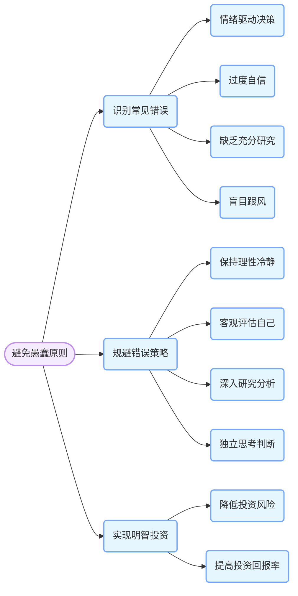

# 芒格的"避免愚蠢"原则：明智投资的基础

> 关键词：芒格、避免愚蠢原则、明智投资、投资理念、风险控制

> 摘要：本文深入探讨了芒格的“避免愚蠢”原则在明智投资中的重要地位。从背景介绍入手，阐述了该原则的目的、适用范围以及预期读者，对相关术语进行了清晰定义。详细剖析了核心概念与联系，结合具体的Mermaid流程图进行展示。通过Python代码讲解了核心算法原理及操作步骤，运用数学模型和公式对原则进行量化分析。给出了项目实战案例，包括开发环境搭建、源代码实现与解读。探讨了该原则在实际投资场景中的应用，推荐了学习该原则的工具和资源，最后总结了未来投资发展趋势与挑战，并解答常见问题，提供扩展阅读和参考资料，帮助投资者更好地理解和运用“避免愚蠢”原则进行明智投资。

## 1. 背景介绍 
### 1.1 目的和范围
芒格的“避免愚蠢”原则在投资领域具有深远的影响。本文的目的在于全面、深入地解析这一原则，为投资者提供一套系统的投资思路和方法。通过详细阐述该原则的核心概念、算法原理、数学模型以及实际应用案例，帮助投资者理解如何在投资过程中避免常见的错误，从而做出更明智的投资决策。

文章的范围涵盖了从理论到实践的多个层面。理论层面包括对“避免愚蠢”原则的核心概念剖析、相关算法原理和数学模型的推导；实践层面则涉及到具体的项目实战案例分析、实际应用场景探讨以及工具和资源推荐等内容。

### 1.2 预期读者
本文的预期读者主要包括以下几类人群：
- **普通投资者**：希望通过学习芒格的投资原则，提升自己的投资能力，避免在投资过程中犯低级错误，实现资产的稳健增值。
- **金融从业者**：如股票分析师、基金经理等，他们可以从本文中获取新的投资理念和方法，完善自己的投资策略，为客户提供更优质的投资建议。
- **投资爱好者**：对投资领域充满兴趣，渴望深入了解投资大师的智慧和经验，通过学习“避免愚蠢”原则，丰富自己的投资知识体系。

### 1.3 文档结构概述
本文将按照以下结构进行阐述：
- 核心概念与联系：介绍“避免愚蠢”原则的核心概念，通过文本示意图和Mermaid流程图展示其原理和架构。
- 核心算法原理 & 具体操作步骤：运用Python代码详细讲解该原则在投资决策中的算法原理和具体操作步骤。
- 数学模型和公式 & 详细讲解 & 举例说明：通过数学模型和公式对“避免愚蠢”原则进行量化分析，并结合实际例子进行说明。
- 项目实战：代码实际案例和详细解释说明：给出一个实际的投资项目案例，包括开发环境搭建、源代码实现和代码解读。
- 实际应用场景：探讨“避免愚蠢”原则在不同投资场景中的具体应用。
- 工具和资源推荐：推荐学习该原则的相关书籍、在线课程、技术博客、开发工具和框架等。
- 总结：未来发展趋势与挑战：总结“避免愚蠢”原则在未来投资领域的发展趋势和可能面临的挑战。
- 附录：常见问题与解答：解答读者在学习和应用该原则过程中可能遇到的常见问题。
- 扩展阅读 & 参考资料：提供相关的扩展阅读资料和参考文献，方便读者进一步深入学习。

### 1.4 术语表
#### 1.4.1 核心术语定义
- **避免愚蠢原则**：芒格提出的一种投资理念，强调在投资过程中通过避免做出愚蠢的决策来降低风险，提高投资成功的概率。其核心在于识别并规避那些可能导致投资失败的常见错误。
- **明智投资**：基于理性分析和合理判断，充分考虑风险和收益因素，做出符合自身投资目标和风险承受能力的投资决策。
- **投资风险**：指投资过程中可能遭受损失的不确定性。包括市场风险、信用风险、流动性风险等多种类型。
- **投资回报率**：衡量投资收益的指标，通常用投资收益与投资成本的比率来表示。计算公式为：$投资回报率=\frac{投资收益}{投资成本}\times100\%$

#### 1.4.2 相关概念解释
- **价值投资**：一种投资策略，强调通过分析公司的基本面，寻找被低估的股票进行投资。价值投资者关注公司的内在价值，认为市场有时会低估某些具有长期增长潜力的公司，通过长期持有这些股票可以获得超额收益。
- **分散投资**：将资金分散投资于不同的资产类别、行业或地区，以降低单一投资带来的风险。通过分散投资，可以使投资组合更加稳健，减少因个别资产波动而对整体投资造成的影响。

#### 1.4.3 缩略词列表
- ROI：Return on Investment，投资回报率
- PE：Price-to-Earnings Ratio，市盈率

## 2. 核心概念与联系 
芒格的“避免愚蠢”原则核心在于通过识别和避免投资过程中的常见错误，来提高投资的成功率和回报率。这一原则的基本理念是，在投资中，避免犯错比追求高收益更为重要。因为一旦犯了严重的错误，可能会导致巨大的损失，甚至使之前的努力付诸东流。

下面是核心概念原理和架构的文本示意图：

```plaintext
避免愚蠢原则
|
|-- 识别常见错误
|   |-- 情绪驱动决策
|   |-- 过度自信
|   |-- 缺乏充分研究
|   |-- 盲目跟风
|
|-- 规避错误策略
|   |-- 保持理性冷静
|   |-- 客观评估自己
|   |-- 深入研究分析
|   |-- 独立思考判断
|
|-- 实现明智投资
|   |-- 降低投资风险
|   |-- 提高投资回报率
```

对应的Mermaid流程图如下：



从流程图中可以看出，“避免愚蠢”原则主要包括三个关键环节：识别常见错误、规避错误策略和实现明智投资。首先，投资者需要识别投资过程中可能出现的常见错误，如情绪驱动决策、过度自信等。然后，针对这些错误，采取相应的规避策略，如保持理性冷静、深入研究分析等。最后，通过有效地避免错误，实现降低投资风险和提高投资回报率的目标，从而达到明智投资的效果。

## 3. 核心算法原理 & 具体操作步骤 
### 核心算法原理
在投资中运用芒格的“避免愚蠢”原则，可以将其转化为一个基于规则的决策算法。该算法的核心思想是通过对投资决策的各个环节进行评估，判断是否存在可能导致愚蠢决策的因素。如果存在，则避免做出该决策；如果不存在，则可以考虑进行投资。

以下是用Python实现的一个简化的核心算法示例：

```python
def avoid_foolish_investment(emotional_decision, overconfidence, lack_of_research, follow_the_crowd):
    """
    该函数用于判断投资决策是否符合“避免愚蠢”原则
    :param emotional_decision: 是否是情绪驱动的决策，True表示是，False表示否
    :param overconfidence: 是否过度自信，True表示是，False表示否
    :param lack_of_research: 是否缺乏充分研究，True表示是，False表示否
    :param follow_the_crowd: 是否盲目跟风，True表示是，False表示否
    :return: True表示符合“避免愚蠢”原则，可以考虑投资；False表示不符合，应避免投资
    """
    if emotional_decision or overconfidence or lack_of_research or follow_the_crowd:
        return False
    return True

# 示例使用
emotional = False
overconfident = False
lack_research = False
follow_crowd = False

result = avoid_foolish_investment(emotional, overconfident, lack_research, follow_crowd)
if result:
    print("该投资决策符合“避免愚蠢”原则，可以考虑投资。")
else:
    print("该投资决策不符合“避免愚蠢”原则，应避免投资。")
```

### 具体操作步骤
1. **收集信息**：在做出投资决策之前，投资者需要收集相关的信息，包括市场动态、公司基本面、行业趋势等。这些信息将用于判断是否存在可能导致愚蠢决策的因素。
2. **评估因素**：根据收集到的信息，对投资决策的各个环节进行评估，判断是否存在情绪驱动决策、过度自信、缺乏充分研究和盲目跟风等因素。可以使用上述的Python函数进行评估。
3. **做出决策**：根据评估结果，如果符合“避免愚蠢”原则，则可以考虑进行投资；如果不符合，则应避免投资。
4. **持续监控**：投资后，投资者需要持续监控投资情况，及时发现并纠正可能出现的错误决策。

## 4. 数学模型和公式 & 详细讲解 & 举例说明 
### 数学模型和公式
在投资中，我们可以通过一些数学模型和公式来量化“避免愚蠢”原则对投资回报率的影响。假设投资回报率 $ROI$ 受到多个因素的影响，包括风险系数 $R$、研究充分度 $S$、情绪稳定性 $E$ 和独立性 $I$。我们可以建立以下的数学模型：

$$ROI = f(R, S, E, I)$$

为了简化模型，我们假设它们之间存在线性关系，即：

$$ROI = aR + bS + cE + dI + k$$

其中，$a$、$b$、$c$、$d$ 是各个因素的权重系数，$k$ 是常数项。

风险系数 $R$ 可以通过历史数据和市场分析来估算，研究充分度 $S$ 可以用研究时间、研究深度等指标来衡量，情绪稳定性 $E$ 和独立性 $I$ 可以通过投资者的心理测试和历史决策记录来评估。

### 详细讲解
- **风险系数 $R$**：风险系数反映了投资所面临的风险程度。一般来说，风险越高，投资回报率的不确定性就越大。$a$ 为负数，说明风险系数越高，投资回报率越低。
- **研究充分度 $S$**：研究充分度表示投资者对投资对象的了解程度。研究越充分，投资者做出明智决策的可能性就越大，从而提高投资回报率。$b$ 为正数，说明研究充分度越高，投资回报率越高。
- **情绪稳定性 $E$**：情绪稳定性反映了投资者在投资过程中的情绪控制能力。情绪越稳定，投资者越不容易受到情绪的影响而做出错误的决策。$c$ 为正数，说明情绪稳定性越高，投资回报率越高。
- **独立性 $I$**：独立性表示投资者在投资决策时是否能够独立思考，不盲目跟风。独立性越强，投资者越有可能发现被市场低估的投资机会。$d$ 为正数，说明独立性越高，投资回报率越高。

### 举例说明
假设我们通过历史数据和统计分析得到以下参数值：$a = -0.2$，$b = 0.3$，$c = 0.2$，$d = 0.2$，$k = 0.1$。

现在有一位投资者，经过评估，他的投资风险系数 $R = 0.6$，研究充分度 $S = 0.8$，情绪稳定性 $E = 0.7$，独立性 $I = 0.7$。

将这些值代入上述公式，可得：

$$
\begin{align*}
ROI &= -0.2\times0.6 + 0.3\times0.8 + 0.2\times0.7 + 0.2\times0.7 + 0.1\\
&= -0.12 + 0.24 + 0.14 + 0.14 + 0.1\\
&= 0.5
\end{align*}
$$

即该投资者的预期投资回报率为 $50\%$。通过这个例子可以看出，通过量化各个因素对投资回报率的影响，我们可以更直观地了解“避免愚蠢”原则在投资中的重要性。如果投资者能够降低风险系数、提高研究充分度、增强情绪稳定性和独立性，就可以提高投资回报率。

## 5. 项目实战：代码实际案例和详细解释说明 
### 5.1  开发环境搭建
在进行投资项目实战之前，需要搭建相应的开发环境。以下是具体的搭建步骤：

#### 安装Python
首先，需要安装Python编程语言。可以从Python官方网站（https://www.python.org/downloads/）下载适合自己操作系统的Python安装包，并按照安装向导进行安装。安装完成后，打开命令行工具，输入 `python --version` 命令，如果能正确显示Python版本号，则说明安装成功。

#### 安装必要的库
在投资项目中，我们可能会用到一些第三方库，如 `pandas` 用于数据处理，`numpy` 用于数值计算，`matplotlib` 用于数据可视化等。可以使用 `pip` 命令来安装这些库：

```bash
pip install pandas numpy matplotlib
```

### 5.2  源代码详细实现和代码解读
以下是一个基于“避免愚蠢”原则的简单投资项目案例，通过分析股票数据来判断是否适合投资。

```python
import pandas as pd
import numpy as np
import matplotlib.pyplot as plt

def analyze_stock_data(file_path):
    """
    该函数用于分析股票数据，判断是否符合“避免愚蠢”原则
    :param file_path: 股票数据文件的路径
    :return: True表示符合原则，可以考虑投资；False表示不符合，应避免投资
    """
    # 读取股票数据
    data = pd.read_csv(file_path)
    
    # 计算一些基本指标，如收益率、波动率等
    data['returns'] = data['Close'].pct_change()
    volatility = data['returns'].std()
    
    # 假设如果波动率超过0.1，则认为风险过高，不符合“避免愚蠢”原则
    if volatility > 0.1:
        return False
    
    # 检查是否存在连续下跌的情况，如果连续下跌超过3天，则认为市场情绪不佳，不符合原则
    consecutive_losses = 0
    for i in range(1, len(data)):
        if data['returns'].iloc[i] < 0:
            consecutive_losses += 1
            if consecutive_losses >= 3:
                return False
        else:
            consecutive_losses = 0
    
    # 如果以上条件都不满足，则认为符合“避免愚蠢”原则
    return True

# 示例使用
file_path = 'stock_data.csv'
result = analyze_stock_data(file_path)
if result:
    print("该股票投资符合“避免愚蠢”原则，可以考虑投资。")
else:
    print("该股票投资不符合“避免愚蠢”原则，应避免投资。")

# 数据可视化
data = pd.read_csv(file_path)
plt.plot(data['Date'], data['Close'])
plt.xlabel('Date')
plt.ylabel('Close Price')
plt.title('Stock Price Trend')
plt.xticks(rotation=45)
plt.show()
```

### 代码解读与分析
- **读取数据**：使用 `pandas` 库的 `read_csv` 函数读取股票数据文件。
- **计算指标**：计算股票的收益率和波动率。收益率通过 `pct_change` 函数计算，波动率通过 `std` 函数计算。
- **风险评估**：如果波动率超过0.1，则认为风险过高，不符合“避免愚蠢”原则。
- **市场情绪评估**：检查是否存在连续下跌超过3天的情况，如果存在，则认为市场情绪不佳，不符合原则。
- **决策判断**：如果以上条件都不满足，则认为符合“避免愚蠢”原则，可以考虑投资。
- **数据可视化**：使用 `matplotlib` 库绘制股票价格走势图，帮助投资者直观地了解股票的价格趋势。

通过这个项目实战案例，我们可以看到如何将“避免愚蠢”原则应用到实际的投资分析中，通过对股票数据的分析和评估，做出更明智的投资决策。

## 6. 实际应用场景 
### 股票投资
在股票投资中，芒格的“避免愚蠢”原则具有重要的应用价值。投资者在选择股票时，往往会受到各种因素的影响，如市场热点、媒体报道、他人建议等。如果不遵循“避免愚蠢”原则，很容易陷入盲目跟风、追涨杀跌的陷阱。

例如，在市场行情火爆时，很多投资者会被市场的乐观情绪所感染，盲目买入一些热门股票，而不考虑这些股票的基本面和估值情况。当市场行情反转时，这些投资者往往会遭受巨大的损失。而遵循“避免愚蠢”原则的投资者，会保持理性冷静，深入研究公司的基本面，评估股票的内在价值，避免在高估值时买入股票。

### 基金投资
在基金投资中，“避免愚蠢”原则同样适用。投资者在选择基金时，不能仅仅根据基金的短期业绩排名来做出决策，而应该综合考虑基金的投资策略、基金经理的能力、基金的风险控制等因素。

例如，有些投资者看到某只基金在短期内业绩表现优异，就盲目跟风买入。然而，这种短期业绩可能是由于市场行情的短期波动或者基金经理的运气所致，并不能代表基金的长期投资能力。遵循“避免愚蠢”原则的投资者，会对基金进行全面的分析和评估，选择那些具有稳定投资策略、优秀基金经理和良好风险控制能力的基金进行投资。

### 房地产投资
在房地产投资中，“避免愚蠢”原则也能帮助投资者避免一些常见的错误。投资者在购买房产时，不能仅仅考虑房价的上涨空间，而应该综合考虑房产的地理位置、周边配套设施、市场供需情况等因素。

例如，有些投资者在房价上涨的预期下，盲目跟风购买一些偏远地区或者配套设施不完善的房产。然而，当市场行情发生变化时，这些房产可能会面临贬值的风险。遵循“避免愚蠢”原则的投资者，会对房地产市场进行深入的研究和分析，选择那些具有良好发展潜力和投资价值的房产进行投资。

## 7. 工具和资源推荐
### 7.1 学习资源推荐
#### 7.1.1 书籍推荐
- 《穷查理宝典：查理·芒格的智慧箴言录》：这是一本全面介绍芒格投资理念和人生智慧的书籍，书中包含了芒格的演讲、文章和访谈等内容，通过阅读这本书，读者可以深入了解芒格的“避免愚蠢”原则和其他投资思想。
- 《聪明的投资者》：作者是本杰明·格雷厄姆，这本书是价值投资领域的经典之作，书中强调了投资者应该保持理性和冷静，避免盲目跟风和情绪化决策，与芒格的“避免愚蠢”原则不谋而合。
- 《投资中最简单的事》：作者是邱国鹭，这本书结合了中国市场的实际情况，深入浅出地阐述了投资的基本原理和方法，对于投资者理解和应用“避免愚蠢”原则具有很大的帮助。

#### 7.1.2 在线课程
- Coursera上的“投资学原理”课程：该课程由知名大学的教授授课，系统地介绍了投资学的基本理论和方法，包括资产定价、投资组合管理等内容，对于提升投资者的专业知识和投资能力具有很大的帮助。
- 网易云课堂上的“价值投资实战课程”：该课程结合了实际案例，详细讲解了价值投资的理念和方法，帮助投资者学会如何分析公司的基本面和估值，避免在投资中犯错误。

#### 7.1.3 技术博客和网站
- 雪球网：这是一个知名的投资社区，上面有很多投资者分享自己的投资经验和心得，同时也有大量的研究报告和分析文章，对于投资者了解市场动态和学习投资知识具有很大的帮助。
- 东方财富网：提供了丰富的金融数据和资讯，包括股票行情、基金净值、财经新闻等，投资者可以通过该网站及时了解市场信息，做出更明智的投资决策。

### 7.2 开发工具框架推荐
#### 7.2.1 IDE和编辑器
- PyCharm：这是一款专门为Python开发设计的集成开发环境（IDE），具有强大的代码编辑、调试和项目管理功能，适合用于开发投资分析相关的Python程序。
- Jupyter Notebook：这是一个基于网页的交互式开发环境，支持多种编程语言，尤其适合用于数据探索和分析。投资者可以使用Jupyter Notebook来进行股票数据的分析和可视化。

#### 7.2.2 调试和性能分析工具
- pdb：Python自带的调试工具，可以帮助开发者在程序运行过程中进行调试，查找和解决代码中的问题。
- cProfile：Python标准库中的性能分析工具，可以帮助开发者分析程序的性能瓶颈，优化代码的运行效率。

#### 7.2.3 相关框架和库
- Pandas：用于数据处理和分析的Python库，提供了高效的数据结构和数据操作方法，适合用于处理股票、基金等金融数据。
- Numpy：用于数值计算的Python库，提供了高效的多维数组对象和数学函数，是科学计算和数据分析的基础库。
- Matplotlib：用于数据可视化的Python库，提供了丰富的绘图函数和工具，可以帮助投资者将分析结果以直观的图表形式展示出来。

### 7.3 相关论文著作推荐
#### 7.3.1 经典论文
- 《证券分析》：作者是本杰明·格雷厄姆和戴维·多德，这篇论文是价值投资领域的经典之作，提出了“内在价值”的概念，为投资者提供了一种评估股票价值的方法。
- 《有效资本市场：理论与实证研究回顾》：作者是尤金·法玛，这篇论文提出了有效市场假说，认为市场价格已经反映了所有可用的信息，投资者很难通过分析市场信息来获得超额收益。

#### 7.3.2 最新研究成果
- 《行为金融学》：行为金融学是近年来兴起的一个研究领域，它结合了心理学和金融学的理论和方法，研究投资者的行为和决策过程。通过阅读相关的研究成果，投资者可以更好地理解自己和其他投资者的行为，避免在投资中犯错误。
- 《量化投资：策略与技术》：量化投资是一种基于数学模型和计算机算法的投资方法，通过阅读相关的研究成果，投资者可以了解量化投资的基本原理和方法，为自己的投资决策提供参考。

#### 7.3.3 应用案例分析
- 《金融炼金术》：作者是乔治·索罗斯，这本书记录了索罗斯的投资经历和哲学思想，通过分析他的投资案例，投资者可以学习到如何在复杂的市场环境中做出明智的投资决策。
- 《巴菲特致股东的信：股份公司教程》：这本书收录了巴菲特历年致股东的信，通过阅读这些信件，投资者可以了解巴菲特的投资理念和方法，以及他在实际投资中的应用案例。

## 8. 总结：未来发展趋势与挑战
### 未来发展趋势
- **数字化和智能化**：随着科技的不断发展，投资领域将越来越数字化和智能化。投资者可以利用大数据、人工智能等技术来分析市场信息，做出更准确的投资决策。例如，通过机器学习算法可以对海量的金融数据进行分析和预测，帮助投资者发现潜在的投资机会。
- **多元化和全球化**：未来的投资市场将更加多元化和全球化。投资者可以通过投资不同的资产类别、行业和地区来分散风险，实现资产的多元化配置。同时，随着全球经济的一体化，投资者也将有更多的机会参与国际市场的投资。
- **社会责任投资**：越来越多的投资者开始关注企业的社会责任和可持续发展，社会责任投资将成为未来投资的一个重要趋势。投资者在选择投资对象时，不仅会考虑企业的财务业绩，还会考虑企业的环境、社会和治理（ESG）因素。

### 挑战
- **技术风险**：虽然数字化和智能化技术为投资带来了很多便利，但也带来了一些技术风险。例如，数据安全问题、算法漏洞等可能会导致投资者的信息泄露和投资损失。投资者需要加强对技术风险的认识和管理，选择可靠的技术平台和服务提供商。
- **市场不确定性**：投资市场充满了不确定性，未来的市场走势很难准确预测。即使投资者遵循“避免愚蠢”原则，也不能完全避免投资风险。投资者需要具备较强的风险承受能力和应对市场变化的能力。
- **信息过载**：在信息爆炸的时代，投资者面临着大量的信息。如何从海量的信息中筛选出有价值的信息，做出正确的投资决策，是投资者面临的一个挑战。投资者需要提高自己的信息分析能力和判断能力，避免被无用的信息所干扰。

## 9. 附录：常见问题与解答
### 问题1：“避免愚蠢”原则是否意味着不承担任何风险？
答：“避免愚蠢”原则并不意味着不承担任何风险。投资本身就存在一定的风险，不可能完全避免。该原则强调的是避免那些因缺乏理性思考和充分研究而导致的愚蠢决策，从而降低不必要的风险。投资者在遵循该原则的前提下，可以根据自己的风险承受能力和投资目标，合理地承担一定的风险，以获取相应的收益。

### 问题2：如何判断自己是否存在情绪驱动决策的问题？
答：可以通过以下几个方面来判断自己是否存在情绪驱动决策的问题：
- **回顾投资决策过程**：仔细回顾自己过去的投资决策，是否在做出决策时受到了情绪的影响，如贪婪、恐惧、愤怒等。
- **观察自己的行为表现**：在投资过程中，观察自己是否容易受到市场波动的影响而做出冲动的决策，如追涨杀跌、频繁交易等。
- **进行心理测试**：可以通过一些专业的心理测试来评估自己的情绪稳定性和决策风格，了解自己是否存在情绪驱动决策的倾向。

### 问题3：在实际投资中，如何平衡研究充分度和投资时机？
答：在实际投资中，平衡研究充分度和投资时机是一个挑战。以下是一些建议：
- **设定研究期限**：在做出投资决策之前，设定一个合理的研究期限，确保在这个期限内对投资对象进行充分的研究。
- **关注关键信息**：在研究过程中，重点关注对投资决策有重要影响的关键信息，避免陷入过于繁琐的细节中。
- **灵活调整决策**：根据市场情况和研究进展，灵活调整投资决策。如果发现投资时机已经成熟，可以在研究基本充分的情况下做出决策；如果市场情况发生变化，需要及时重新评估投资决策。

## 10. 扩展阅读 & 参考资料
### 扩展阅读
- 《巴菲特的投资组合》：这本书详细介绍了巴菲特的投资组合策略和方法，对于投资者理解价值投资和“避免愚蠢”原则具有很大的帮助。
- 《金融的智慧》：作者是米希尔·A·德赛，这本书从历史、哲学和经济学的角度出发，探讨了金融的本质和投资的智慧，为投资者提供了一个更广阔的视角。

### 参考资料
- 《穷查理宝典：查理·芒格的智慧箴言录》，彼得·考夫曼编著
- 《聪明的投资者》，本杰明·格雷厄姆著
- 《投资中最简单的事》，邱国鹭著

作者：AI天才研究院/AI Genius Institute & 禅与计算机程序设计艺术 /Zen And The Art of Computer Programming